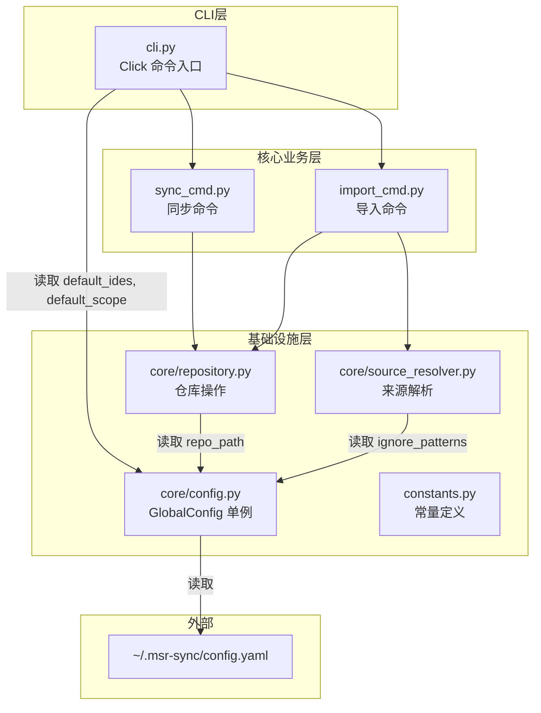
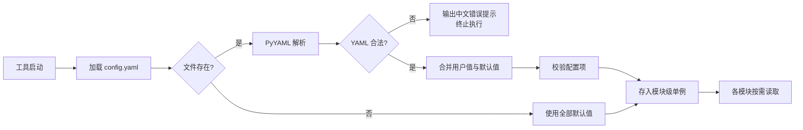

# 技术设计文档 — 全局配置 (Global Config)

## 概述 (Overview)

本特性为 MSR-cli 引入全局配置文件 `~/.msr-sync/config.yaml`，允许用户自定义仓库路径、默认 IDE 列表、默认同步层级和忽略模式。设计遵循以下原则：

1. **向后兼容**：无配置文件时工具行为与引入本特性前完全一致
2. **单例加载**：配置在启动时加载一次，全局共享
3. **部分覆盖**：用户只需配置需要修改的项，其余使用默认值
4. **优雅降级**：文件不存在或为空时使用全部默认值；YAML 语法错误时输出中文错误提示并终止

### 技术选型

| 组件 | 选型 | 理由 |
|------|------|------|
| YAML 解析 | `pyyaml` | 成熟稳定的 YAML 解析库，社区标准 |
| 通配符匹配 | `fnmatch` | Python 标准库，支持 shell 风格 glob 模式 |
| 配置模式 | 模块级单例 | 简单可靠，避免重复 I/O，与现有代码风格一致 |

---

## 架构 (Architecture)

### 模块关系图



### 数据流



### 集成点

| 集成模块 | 读取的配置项 | 集成方式 |
|---------|------------|---------|
| `cli.py` | `default_ides`, `default_scope` | `sync` 命令的 `--ide` 和 `--scope` 参数默认值改为从配置读取 |
| `core/repository.py` | `repo_path` | `Repository.__init__` 中 `base_path` 默认值改为从配置读取 |
| `core/source_resolver.py` | `ignore_patterns` | 目录扫描和压缩包解压后的文件过滤 |

---

## 组件与接口 (Components and Interfaces)

### 新增文件

```
MSR-cli/msr_sync/core/config.py    # GlobalConfig 类及模块级单例
```

### 修改文件

```
MSR-cli/msr_sync/core/repository.py      # Repository 默认 base_path 改为读取配置
MSR-cli/msr_sync/core/source_resolver.py  # 目录扫描增加忽略模式过滤
MSR-cli/msr_sync/cli.py                   # sync 命令默认值改为读取配置
MSR-cli/msr_sync/core/exceptions.py       # 新增 ConfigFileError
MSR-cli/pyproject.toml                    # 添加 pyyaml 依赖
```

### 核心接口：`GlobalConfig` 类

```python
# msr_sync/core/config.py

from pathlib import Path
from typing import List, Optional
import yaml

# 默认值常量
DEFAULT_REPO_PATH = "~/.msr-repos"
DEFAULT_IGNORE_PATTERNS = ["__MACOSX", ".DS_Store", "__pycache__", ".git"]
DEFAULT_IDES = ["all"]
DEFAULT_SCOPE = "global"
VALID_SCOPES = ("global", "project")
VALID_IDES = ("trae", "qoder", "lingma", "codebuddy", "all")
CONFIG_FILE_PATH = Path.home() / ".msr-sync" / "config.yaml"


class GlobalConfig:
    """全局配置对象

    保存从 ~/.msr-sync/config.yaml 加载的用户配置。
    所有属性均有合理默认值，确保无配置文件时行为不变。

    Attributes:
        repo_path: 统一仓库根目录路径（已展开 ~）
        ignore_patterns: 忽略模式列表
        default_ides: 默认同步目标 IDE 列表
        default_scope: 默认同步层级
    """

    def __init__(
        self,
        repo_path: Optional[str] = None,
        ignore_patterns: Optional[List[str]] = None,
        default_ides: Optional[List[str]] = None,
        default_scope: Optional[str] = None,
    ):
        self.repo_path: Path = self._resolve_repo_path(repo_path)
        self.ignore_patterns: List[str] = (
            ignore_patterns if ignore_patterns is not None
            else list(DEFAULT_IGNORE_PATTERNS)
        )
        self.default_ides: List[str] = self._validate_ides(default_ides)
        self.default_scope: str = self._validate_scope(default_scope)

    @staticmethod
    def _resolve_repo_path(raw: Optional[str]) -> Path:
        """解析仓库路径，展开 ~ 前缀，空字符串回退到默认值。"""
        if not raw or not raw.strip():
            return Path(DEFAULT_REPO_PATH).expanduser()
        return Path(raw).expanduser()

    @staticmethod
    def _validate_ides(raw: Optional[List[str]]) -> List[str]:
        """校验 IDE 列表，过滤无效条目并输出警告，空列表回退到默认值。"""
        if raw is None or len(raw) == 0:
            return list(DEFAULT_IDES)
        valid = []
        for ide in raw:
            if ide in VALID_IDES:
                valid.append(ide)
            else:
                # 输出中文警告
                import click
                click.echo(f"⚠️ 配置文件中的 IDE 名称无效，已忽略: {ide}")
        return valid if valid else list(DEFAULT_IDES)

    @staticmethod
    def _validate_scope(raw: Optional[str]) -> str:
        """校验同步层级，无效值回退到默认值并输出警告。"""
        if raw is None:
            return DEFAULT_SCOPE
        if raw in VALID_SCOPES:
            return raw
        import click
        click.echo(f"⚠️ 配置文件中的 default_scope 值无效，已使用默认值 'global': {raw}")
        return DEFAULT_SCOPE

    def to_dict(self) -> dict:
        """将配置序列化为字典（用于测试和调试）。"""
        return {
            "repo_path": str(self.repo_path),
            "ignore_patterns": list(self.ignore_patterns),
            "default_ides": list(self.default_ides),
            "default_scope": self.default_scope,
        }


def load_config(config_path: Optional[Path] = None) -> GlobalConfig:
    """从 YAML 文件加载配置。

    Args:
        config_path: 配置文件路径，默认为 ~/.msr-sync/config.yaml。
                     支持注入自定义路径便于测试。

    Returns:
        GlobalConfig 实例

    Raises:
        ConfigFileError: YAML 语法错误时抛出
    """
    path = config_path or CONFIG_FILE_PATH

    if not path.is_file():
        return GlobalConfig()

    raw_text = path.read_text(encoding="utf-8")
    if not raw_text.strip():
        return GlobalConfig()

    try:
        data = yaml.safe_load(raw_text)
    except yaml.YAMLError as e:
        from msr_sync.core.exceptions import ConfigFileError
        raise ConfigFileError(f"配置文件 YAML 语法错误: {path}\n{e}")

    if not isinstance(data, dict):
        return GlobalConfig()

    return GlobalConfig(
        repo_path=data.get("repo_path"),
        ignore_patterns=data.get("ignore_patterns"),
        default_ides=data.get("default_ides"),
        default_scope=data.get("default_scope"),
    )


def config_to_yaml(config: GlobalConfig) -> str:
    """将 GlobalConfig 序列化为 YAML 字符串（用于往返测试）。"""
    return yaml.dump(config.to_dict(), default_flow_style=False, allow_unicode=True)


# ---- 模块级单例 ----

_global_config: Optional[GlobalConfig] = None


def get_config() -> GlobalConfig:
    """获取全局配置单例。首次调用时自动加载。"""
    global _global_config
    if _global_config is None:
        _global_config = load_config()
    return _global_config


def init_config(config_path: Optional[Path] = None) -> GlobalConfig:
    """显式初始化全局配置单例（用于启动时或测试注入）。"""
    global _global_config
    _global_config = load_config(config_path)
    return _global_config


def reset_config() -> None:
    """重置全局配置单例（仅用于测试）。"""
    global _global_config
    _global_config = None
```

### 集成变更：`Repository.__init__`

```python
# 修改前
def __init__(self, base_path: Optional[Path] = None):
    self.base_path = base_path or Path.home() / ".msr-repos"

# 修改后
def __init__(self, base_path: Optional[Path] = None):
    if base_path is not None:
        self.base_path = base_path
    else:
        from msr_sync.core.config import get_config
        self.base_path = get_config().repo_path
```

### 集成变更：`SourceResolver` 忽略模式过滤

```python
# 在 SourceResolver 中新增过滤方法
import fnmatch
from msr_sync.core.config import get_config

def _should_ignore(self, name: str) -> bool:
    """判断文件名或目录名是否匹配任一忽略模式。

    对每个模式：若模式包含通配符（*、?、[），使用 fnmatch 匹配；
    否则使用精确匹配。仅匹配文件名/目录名部分，不匹配完整路径。

    Args:
        name: 文件名或目录名（不含路径）

    Returns:
        True 表示应跳过
    """
    patterns = get_config().ignore_patterns
    for pattern in patterns:
        if any(c in pattern for c in ('*', '?', '[')):
            if fnmatch.fnmatch(name, pattern):
                return True
        else:
            if name == pattern:
                return True
    return False
```

在 `_resolve_rules_directory`、`_resolve_skills_directory`、`_resolve_mcp_directory` 和 `_resolve_archive` 的目录遍历循环中，对每个 `entry` 调用 `self._should_ignore(entry.name)` 进行过滤。

### 集成变更：`cli.py` sync 命令

```python
# 修改 sync 命令的 --ide 和 --scope 默认值
@main.command()
@click.option("--ide", multiple=True, default=None, ...)
@click.option("--scope", default=None, ...)
def sync(ide, scope, ...):
    from msr_sync.core.config import get_config
    cfg = get_config()

    # 命令行未指定时使用配置值
    if ide is None or len(ide) == 0:
        ide = tuple(cfg.default_ides)
    if scope is None:
        scope = cfg.default_scope

    sync_handler(ide=ide, scope=scope, ...)
```

### 新增异常

```python
# msr_sync/core/exceptions.py 中新增
class ConfigFileError(MSRError):
    """配置文件解析错误（YAML 语法错误等）"""
```

### 依赖变更：`pyproject.toml`

```toml
dependencies = [
    "click>=8.0",
    "pyyaml>=6.0",
]
```

---

## 数据模型 (Data Models)

### 配置文件格式

文件路径：`~/.msr-sync/config.yaml`

```yaml
# MSR-sync 全局配置文件

# 统一仓库路径（支持 ~ 展开）
repo_path: ~/.msr-repos

# 导入扫描时忽略的目录和文件模式
ignore_patterns:
  - __MACOSX
  - .DS_Store
  - __pycache__
  - .git
  - "*.pyc"

# 默认同步目标 IDE 列表
default_ides:
  - trae
  - qoder

# 默认同步层级（global 或 project）
default_scope: global
```

### 配置项默认值表

| 配置项 | 类型 | 默认值 | 说明 |
|-------|------|--------|------|
| `repo_path` | `str` | `~/.msr-repos` | 统一仓库根目录路径 |
| `ignore_patterns` | `List[str]` | `["__MACOSX", ".DS_Store", "__pycache__", ".git"]` | 忽略模式列表 |
| `default_ides` | `List[str]` | `["all"]` | 默认同步目标 IDE |
| `default_scope` | `str` | `"global"` | 默认同步层级 |

### 配置校验规则

| 配置项 | 校验规则 | 无效时行为 |
|-------|---------|----------|
| `repo_path` | 非空字符串 | 空字符串回退到默认值 |
| `ignore_patterns` | 字符串列表 | 使用默认值 |
| `default_ides` | 列表中每项须在 `VALID_IDES` 中 | 过滤无效项并输出中文警告；全部无效时回退到默认值 |
| `default_scope` | 须为 `"global"` 或 `"project"` | 输出中文警告并回退到默认值 |
| 未识别的键 | — | 静默忽略 |


---

## 正确性属性 (Correctness Properties)

*正确性属性是指在系统所有合法执行中都应成立的特征或行为——本质上是对系统应做什么的形式化陈述。属性是连接人类可读规格说明与机器可验证正确性保证之间的桥梁。*

### Property 1: 配置加载正确性（部分配置与未知键）

*对于任意*合法配置键的子集（包括空子集和全集），以及任意数量的未识别键，将其写入 YAML 文件后通过 `load_config` 加载，返回的 `GlobalConfig` 应满足：已设置的已知配置项值与输入一致，未设置的已知配置项使用默认值，未识别的键被静默忽略且不影响其他配置项。

**Validates: Requirements 1.1, 1.5, 6.3**

### Property 2: 忽略模式匹配正确性

*对于任意*文件名和任意忽略模式列表，`_should_ignore(name)` 应返回 `True` 当且仅当该文件名与列表中至少一个模式匹配——对不含通配符（`*`、`?`、`[`）的模式使用精确匹配，对含通配符的模式使用 `fnmatch.fnmatch` 语义。

**Validates: Requirements 2.2, 2.3, 2.5**

### Property 3: 仓库路径波浪号展开

*对于任意*以 `~` 开头的路径字符串，`GlobalConfig` 的 `repo_path` 属性应为不含 `~` 的绝对路径，且其展开结果与 `Path(input).expanduser()` 一致。

**Validates: Requirements 3.2**

### Property 4: 无效 IDE 名称过滤

*对于任意*字符串列表作为 `default_ides` 输入，`GlobalConfig` 的 `default_ides` 属性应仅包含有效 IDE 名称（`trae`、`qoder`、`lingma`、`codebuddy`、`all`）。当输入中所有条目均无效或输入为空列表时，应回退到默认值 `["all"]`。

**Validates: Requirements 4.4, 4.5**

### Property 5: 无效同步层级回退

*对于任意*不等于 `"global"` 且不等于 `"project"` 的字符串作为 `default_scope` 输入，`GlobalConfig` 的 `default_scope` 属性应为 `"global"`。

**Validates: Requirements 5.4**

### Property 6: 配置 YAML 往返一致性

*对于任意*合法的 `GlobalConfig` 对象（所有字段均为有效值），将其通过 `config_to_yaml` 序列化为 YAML 字符串，再通过 `load_config` 解析回 `GlobalConfig` 对象后，两个对象的所有配置项值应完全一致。

**Validates: Requirements 7.2**

---

## 错误处理 (Error Handling)

### 新增错误场景

| 错误类型 | 场景 | 处理方式 |
|---------|------|---------|
| `ConfigFileError` | `config.yaml` 包含非法 YAML 语法 | 输出中文错误提示（含文件路径和解析错误详情），退出码 1 |
| 无效 IDE 名称 | `default_ides` 包含不支持的 IDE | 输出中文警告 `⚠️ 配置文件中的 IDE 名称无效，已忽略: {name}`，过滤该条目 |
| 无效同步层级 | `default_scope` 不是 `global`/`project` | 输出中文警告 `⚠️ 配置文件中的 default_scope 值无效，已使用默认值 'global': {value}`，回退到默认值 |
| 空 `repo_path` | `repo_path` 为空字符串 | 静默回退到默认值 `~/.msr-repos` |
| 空 `default_ides` | `default_ides` 为空列表 | 静默回退到默认值 `["all"]` |
| 未识别的键 | 配置文件包含未知顶层键 | 静默忽略 |

### 错误处理原则

1. **向后兼容优先**：任何配置异常（文件不存在、为空、部分缺失）都应优雅降级到默认值，而非报错
2. **仅语法错误终止**：只有 YAML 语法错误才终止执行，因为这明确表示用户意图但格式有误
3. **中文提示**：所有面向用户的警告和错误信息使用中文
4. **异常层次**：新增 `ConfigFileError` 继承自 `MSRError`，与现有异常体系一致

---

## 测试策略 (Testing Strategy)

### 测试框架

| 工具 | 用途 |
|------|------|
| `pytest` | 单元测试和集成测试框架 |
| `hypothesis` | 属性基测试（Property-Based Testing）库 |
| `click.testing.CliRunner` | CLI 命令集成测试 |
| `tmp_path` (pytest fixture) | 临时目录，隔离文件系统操作 |
| `unittest.mock` | Mock 全局配置单例 |

### 双轨测试方法

#### 属性基测试 (Property-Based Tests)

使用 `hypothesis` 库实现，每个属性测试至少运行 **100 次迭代**。

每个测试用 comment 标注对应的设计属性：

```python
# Feature: global-config, Property 6: 配置 YAML 往返一致性
@given(
    repo_path=st.text(min_size=1, alphabet=st.characters(whitelist_categories=("L", "N", "P"))),
    ignore_patterns=st.lists(st.text(min_size=1, max_size=20), min_size=0, max_size=10),
    default_ides=st.lists(st.sampled_from(["trae", "qoder", "lingma", "codebuddy", "all"]), min_size=1, max_size=5),
    default_scope=st.sampled_from(["global", "project"]),
)
def test_config_yaml_round_trip(repo_path, ignore_patterns, default_ides, default_scope, tmp_path):
    config = GlobalConfig(
        repo_path=repo_path,
        ignore_patterns=ignore_patterns,
        default_ides=default_ides,
        default_scope=default_scope,
    )
    yaml_str = config_to_yaml(config)
    config_file = tmp_path / "config.yaml"
    config_file.write_text(yaml_str, encoding="utf-8")
    loaded = load_config(config_file)
    assert loaded.to_dict() == config.to_dict()
```

属性测试覆盖范围：

| 属性 | 测试标签 | 说明 |
|------|---------|------|
| Property 1 | `Feature: global-config, Property 1: 配置加载正确性` | 随机子集配置键 + 随机未知键 |
| Property 2 | `Feature: global-config, Property 2: 忽略模式匹配正确性` | 随机文件名 × 随机模式列表 |
| Property 3 | `Feature: global-config, Property 3: 仓库路径波浪号展开` | 随机 `~/...` 路径 |
| Property 4 | `Feature: global-config, Property 4: 无效 IDE 名称过滤` | 随机字符串列表（混合有效/无效） |
| Property 5 | `Feature: global-config, Property 5: 无效同步层级回退` | 随机非法字符串 |
| Property 6 | `Feature: global-config, Property 6: 配置 YAML 往返一致性` | 随机合法 GlobalConfig 对象 |

#### 单元测试 (Example-Based Tests)

| 测试场景 | 覆盖需求 |
|---------|---------|
| 配置文件不存在时返回全部默认值 | 1.2 |
| 配置文件为空时返回全部默认值 | 1.3 |
| YAML 语法错误时抛出 ConfigFileError | 1.4 |
| ignore_patterns 默认值验证 | 2.1 |
| repo_path 默认值验证 | 3.1 |
| repo_path 空字符串回退到默认值 | 3.4 |
| Repository 无 base_path 时使用配置值 | 3.3 |
| default_ides 默认值验证 | 4.1 |
| default_ides 空列表回退到默认值 | 4.5 |
| default_scope 默认值验证 | 5.1 |
| YAML 注释行正确处理 | 6.1 |
| YAML 带引号和不带引号字符串 | 7.3 |
| 单例 get_config/init_config/reset_config 生命周期 | — |

#### 集成测试 (Integration Tests)

| 测试场景 | 覆盖需求 |
|---------|---------|
| sync 命令未指定 --ide 时使用配置值 | 4.2 |
| sync 命令显式 --ide 覆盖配置值 | 4.3 |
| sync 命令未指定 --scope 时使用配置值 | 5.2 |
| sync 命令显式 --scope 覆盖配置值 | 5.3 |
| SourceResolver 扫描目录时过滤忽略模式 | 2.2, 2.3 |
| SourceResolver 解压后过滤忽略模式 | 2.4 |

### 新增测试文件

```
MSR-cli/tests/test_config.py    # GlobalConfig 单元测试 + 属性测试
```

### Hypothesis 配置

复用现有 `conftest.py` 中的 Hypothesis profile 配置（default: 100 次，ci: 200 次）。
