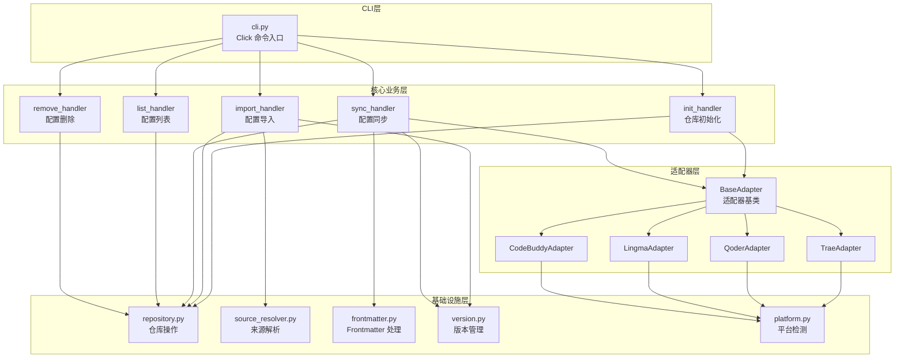

# 技术设计文档 — MSR-cli (`msr-sync`)

## 概述 (Overview)

MSR-cli 是一个基于 Python 的命令行工具，命令名为 `msr-sync`，用于统一管理多款国内 AI IDE（Trae、Qoder/Lingma、CodeBuddy）的 rules、skills、MCP 配置。工具通过建立统一本地仓库 `~/.msr-repos`，提供配置的导入、同步、查看、删除等完整生命周期管理。

### 设计目标

1. **统一管理**：通过中心化仓库消除各 IDE 配置孤岛
2. **格式适配**：自动处理各 IDE 间的配置格式差异（frontmatter 模板、路径约定）
3. **多版本支持**：每个配置条目支持 V1、V2、V3… 多版本并存
4. **跨平台**：支持 macOS 和 Windows，自动解析平台特定路径
5. **多来源导入**：支持从文件、文件夹、压缩包、URL 等多种来源导入配置
6. **用户友好**：所有面向用户的消息使用中文

### 技术选型

| 组件 | 选型 | 理由 |
|------|------|------|
| 语言 | Python 3.9+ | 跨平台、生态丰富、CLI 开发成熟 |
| CLI 框架 | `click` | 成熟稳定，支持子命令、参数校验、帮助文档生成 |
| 路径处理 | `pathlib` | Python 标准库，跨平台路径操作 |
| 压缩包处理 | `zipfile` / `tarfile` | Python 标准库，支持 zip 和 tar.gz |
| HTTP 下载 | `urllib.request` | Python 标准库，无需额外依赖；复杂场景可选 `requests` |
| YAML 解析 | `pyyaml` 或手动解析 frontmatter | 解析 Markdown 文件头部的 YAML frontmatter |
| JSON 处理 | `json` | Python 标准库，处理 MCP 配置文件 |
| 打包分发 | `pyproject.toml` + `setuptools` | 现代 Python 打包标准 |

---

## 架构 (Architecture)

### 系统架构图



### 数据流


### 分层职责

| 层级 | 职责 | 模块 |
|------|------|------|
| CLI 层 | 解析命令行参数，调用业务处理器 | `cli.py` |
| 核心业务层 | 实现 init/import/sync/list/remove 业务逻辑 | `commands/` |
| 适配器层 | 各 IDE 的路径解析和格式转换 | `adapters/` |
| 基础设施层 | 仓库操作、来源解析、版本管理、平台检测 | `core/` |

---

## 组件与接口 (Components and Interfaces)

### 项目目录结构

```
MSR-cli/
├── msr_sync/
│   ├── __init__.py              # 包初始化，版本号
│   ├── cli.py                   # Click CLI 入口，定义所有子命令
│   ├── constants.py             # 常量定义（仓库路径、配置类型等）
│   ├── commands/
│   │   ├── __init__.py
│   │   ├── init_cmd.py          # init 命令处理器
│   │   ├── import_cmd.py        # import 命令处理器
│   │   ├── sync_cmd.py          # sync 命令处理器
│   │   ├── list_cmd.py          # list 命令处理器
│   │   └── remove_cmd.py        # remove 命令处理器
│   ├── adapters/
│   │   ├── __init__.py
│   │   ├── base.py              # BaseAdapter 抽象基类
│   │   ├── trae.py              # Trae 适配器
│   │   ├── qoder.py             # Qoder 适配器
│   │   ├── lingma.py            # Lingma 适配器
│   │   ├── codebuddy.py         # CodeBuddy 适配器
│   │   └── registry.py          # 适配器注册表
│   └── core/
│       ├── __init__.py
│       ├── repository.py        # 统一仓库 CRUD 操作
│       ├── source_resolver.py   # 导入来源解析（文件/文件夹/压缩包/URL）
│       ├── frontmatter.py       # Frontmatter 解析与生成
│       ├── version.py           # 版本号解析与递增
│       └── platform.py          # 平台检测与路径约定
├── tests/
│   ├── __init__.py
│   ├── test_version.py
│   ├── test_frontmatter.py
│   ├── test_repository.py
│   ├── test_source_resolver.py
│   ├── test_adapters.py
│   └── test_commands.py
├── pyproject.toml               # 项目配置与依赖
└── README.md                    # 项目说明
```

### 核心接口定义

#### 1. CLI 入口 (`cli.py`)

```python
import click

@click.group()
def main():
    """MSR-sync: 统一管理多款 AI IDE 的 rules、skills、MCP 配置"""
    pass

@main.command()
@click.option('--merge', is_flag=True, help='合并已有 IDE 配置到统一仓库')
def init(merge: bool):
    """初始化统一配置仓库"""

@main.command(name='import')
@click.argument('config_type', type=click.Choice(['rules', 'skills', 'mcp']))
@click.argument('source')
def import_config(config_type: str, source: str):
    """导入配置到统一仓库"""

@main.command()
@click.option('--ide', multiple=True, default=('all',),
              type=click.Choice(['trae', 'qoder', 'lingma', 'codebuddy', 'all']))
@click.option('--scope', default='global', type=click.Choice(['project', 'global']))
@click.option('--project-dir', default=None, type=click.Path(exists=True))
@click.option('--type', 'config_type', default=None,
              type=click.Choice(['rules', 'skills', 'mcp']))
@click.option('--name', default=None)
@click.option('--version', default=None)
def sync(ide, scope, project_dir, config_type, name, version):
    """同步配置到目标 IDE"""

@main.command(name='list')
@click.option('--type', 'config_type', default=None,
              type=click.Choice(['rules', 'skills', 'mcp']))
def list_configs(config_type: str):
    """查看统一仓库中的配置列表"""

@main.command()
@click.argument('config_type', type=click.Choice(['rules', 'skills', 'mcp']))
@click.argument('name')
@click.argument('version')
def remove(config_type: str, name: str, version: str):
    """删除指定配置版本"""
```

#### 2. 适配器基类 (`adapters/base.py`)

```python
from abc import ABC, abstractmethod
from pathlib import Path
from typing import Optional

class BaseAdapter(ABC):
    """IDE 适配器抽象基类"""

    @property
    @abstractmethod
    def ide_name(self) -> str:
        """IDE 标识名称"""

    # --- 路径解析 ---

    @abstractmethod
    def get_rules_path(self, rule_name: str, scope: str,
                       project_dir: Optional[Path] = None) -> Path:
        """获取 rule 文件的目标路径"""

    @abstractmethod
    def get_skills_path(self, skill_name: str, scope: str,
                        project_dir: Optional[Path] = None) -> Path:
        """获取 skill 目录的目标路径"""

    @abstractmethod
    def get_mcp_path(self) -> Path:
        """获取 MCP 配置文件路径"""

    # --- 格式转换 ---

    @abstractmethod
    def format_rule_content(self, raw_content: str) -> str:
        """将原始 rule 内容转换为 IDE 特定格式（添加 frontmatter 等）"""

    # --- 能力查询 ---

    def supports_global_rules(self) -> bool:
        """是否支持用户级 rules"""
        return False

    # --- 扫描已有配置（用于 init --merge）---

    @abstractmethod
    def scan_existing_configs(self) -> dict:
        """扫描该 IDE 已有的配置，返回 {config_type: [config_items]}"""
```

#### 3. 仓库操作 (`core/repository.py`)

```python
from pathlib import Path
from typing import List, Optional, Dict

class Repository:
    """统一仓库操作类"""

    def __init__(self, base_path: Optional[Path] = None):
        self.base_path = base_path or Path.home() / '.msr-repos'

    def init(self) -> bool:
        """初始化仓库目录结构，返回是否新建"""

    def exists(self) -> bool:
        """检查仓库是否已存在"""

    def store_rule(self, name: str, content: str) -> str:
        """存储 rule 文件，返回版本号"""

    def store_skill(self, name: str, source_dir: Path) -> str:
        """存储 skill 目录，返回版本号"""

    def store_mcp(self, name: str, source_dir: Path) -> str:
        """存储 MCP 配置目录，返回版本号"""

    def get_config_path(self, config_type: str, name: str,
                        version: Optional[str] = None) -> Path:
        """获取配置路径，version 为 None 时返回最新版本"""

    def list_configs(self, config_type: Optional[str] = None) -> Dict[str, Dict[str, List[str]]]:
        """列出配置，返回 {config_type: {name: [versions]}}"""

    def remove_config(self, config_type: str, name: str, version: str) -> bool:
        """删除指定配置版本"""

    def get_next_version(self, config_type: str, name: str) -> str:
        """获取下一个版本号"""

    def get_latest_version(self, config_type: str, name: str) -> Optional[str]:
        """获取最新版本号"""

    def read_rule_content(self, name: str, version: Optional[str] = None) -> str:
        """读取 rule 内容（原始 Markdown）"""
```

#### 4. 来源解析器 (`core/source_resolver.py`)

```python
from pathlib import Path
from typing import List, Tuple
from enum import Enum

class SourceType(Enum):
    FILE = "file"
    DIRECTORY = "directory"
    ARCHIVE = "archive"
    URL = "url"

class ResolvedItem:
    """解析后的单个配置项"""
    def __init__(self, name: str, path: Path, source_type: SourceType):
        self.name = name
        self.path = path
        self.source_type = source_type

class SourceResolver:
    """导入来源解析器"""

    def resolve(self, source: str, config_type: str) -> Tuple[List[ResolvedItem], bool]:
        """
        解析导入来源，返回 (配置项列表, 是否需要用户确认)
        - 单个文件/文件夹：直接返回，无需确认
        - 多个文件/文件夹：返回列表，需要确认
        """

    def _resolve_file(self, path: Path) -> List[ResolvedItem]:
        """解析单个文件"""

    def _resolve_directory(self, path: Path, config_type: str) -> List[ResolvedItem]:
        """解析目录"""

    def _resolve_archive(self, path: Path, config_type: str) -> List[ResolvedItem]:
        """解析压缩包"""

    def _resolve_url(self, url: str, config_type: str) -> List[ResolvedItem]:
        """下载并解析 URL 指向的压缩包"""

    def _detect_source_type(self, source: str) -> SourceType:
        """检测来源类型"""

    def _is_single_skill(self, path: Path) -> bool:
        """判断目录是否为单个 skill（包含 SKILL.md）"""

    def _is_single_mcp(self, path: Path) -> bool:
        """判断目录是否为单个 MCP（根目录包含非子目录文件）"""
```

#### 5. Frontmatter 处理 (`core/frontmatter.py`)

```python
from typing import Tuple, Optional

def strip_frontmatter(content: str) -> str:
    """移除 Markdown 内容中的 YAML frontmatter，返回纯内容"""

def parse_frontmatter(content: str) -> Tuple[Optional[dict], str]:
    """解析 frontmatter，返回 (frontmatter_dict, body_content)"""

def build_qoder_header() -> str:
    """生成 Qoder 的 frontmatter 模板"""

def build_lingma_header() -> str:
    """生成 Lingma 的 frontmatter 模板"""

def build_codebuddy_header() -> str:
    """生成 CodeBuddy 的 frontmatter 模板（含当前时间戳）"""
```

#### 6. 版本管理 (`core/version.py`)

```python
from pathlib import Path
from typing import Optional, List

def parse_version(version_str: str) -> int:
    """解析版本字符串 'V1' -> 1，无效格式抛出 ValueError"""

def format_version(version_num: int) -> str:
    """格式化版本号 1 -> 'V1'"""

def get_versions(config_dir: Path) -> List[str]:
    """获取配置目录下所有版本号，按数字排序"""

def get_latest_version(config_dir: Path) -> Optional[str]:
    """获取最新版本号"""

def get_next_version(config_dir: Path) -> str:
    """获取下一个版本号"""
```

#### 7. 平台检测 (`core/platform.py`)

```python
import platform
from pathlib import Path

class PlatformInfo:
    """平台信息"""

    @staticmethod
    def get_os() -> str:
        """返回 'macos', 'windows', 或抛出 UnsupportedPlatformError"""

    @staticmethod
    def get_home() -> Path:
        """获取用户主目录"""

    @staticmethod
    def get_app_support_dir() -> Path:
        """获取应用数据目录（macOS: ~/Library/Application Support, Windows: AppData/Roaming）"""
```

#### 8. 适配器注册表 (`adapters/registry.py`)

```python
from typing import List, Optional
from .base import BaseAdapter

def get_adapter(ide_name: str) -> BaseAdapter:
    """根据 IDE 名称获取适配器实例"""

def get_all_adapters() -> List[BaseAdapter]:
    """获取所有适配器实例"""

def resolve_ide_list(ide_names: tuple) -> List[BaseAdapter]:
    """解析 --ide 参数，'all' 展开为所有适配器"""
```

---

## 数据模型 (Data Models)

### 统一仓库目录结构

```
~/.msr-repos/
├── RULES/
│   └── <rule-name>/
│       ├── V1/
│       │   └── <rule-name>.md      # 原始 Markdown 文件（保留原始 frontmatter）
│       └── V2/
│           └── <rule-name>.md
├── SKILLS/
│   └── <skill-name>/
│       ├── V1/
│       │   ├── SKILL.md
│       │   └── ...                  # 其他技能文件
│       └── V2/
│           ├── SKILL.md
│           └── ...
└── MCP/
    └── <mcp-name>/
        ├── V1/
        │   └── mcp.json             # 或其他 MCP 配置文件
        └── V2/
            └── mcp.json
```

### IDE 路径映射表

#### Qoder (阿里)

| 配置类型 | 层级 | macOS 路径 | Windows 路径 |
|---------|------|-----------|-------------|
| Rules | project | `<project>/.qoder/rules/<name>.md` | 同左 |
| Rules | global | ❌ 不支持 | ❌ 不支持 |
| Skills | project | `<project>/.qoder/skills/<name>/` | 同左 |
| Skills | global | `~/.qoder/skills/<name>/` | 同左 |
| MCP | — | `~/Library/Application Support/Qoder/SharedClientCache/mcp.json` | `%APPDATA%/Qoder/SharedClientCache/mcp.json` |

#### Lingma (阿里)

| 配置类型 | 层级 | macOS 路径 | Windows 路径 |
|---------|------|-----------|-------------|
| Rules | project | `<project>/.lingma/rules/<name>.md` | 同左 |
| Rules | global | ❌ 不支持 | ❌ 不支持 |
| Skills | project | `<project>/.lingma/skills/<name>/` | 同左 |
| Skills | global | `~/.lingma/skills/<name>/` | 同左 |
| MCP | — | `~/Library/Application Support/Lingma/SharedClientCache/mcp.json` | `%APPDATA%/Lingma/SharedClientCache/mcp.json` |

#### Trae (字节)

| 配置类型 | 层级 | macOS 路径 | Windows 路径 |
|---------|------|-----------|-------------|
| Rules | project | `<project>/.trae/rules/<name>.md` | 同左 |
| Rules | global | ❌ 不支持 | ❌ 不支持 |
| Skills | project | `<project>/.trae/skills/<name>/` | 同左 |
| Skills | global | `~/.trae-cn/skills/<name>/` | 同左 |
| MCP | — | `~/Library/Application Support/Trae CN/User/mcp.json` | `%APPDATA%/Trae CN/User/mcp.json` |

#### CodeBuddy (腾讯)

| 配置类型 | 层级 | macOS 路径 | Windows 路径 |
|---------|------|-----------|-------------|
| Rules | project | `<project>/.codebuddy/rules/` | 同左 |
| Rules | global | `~/.codebuddy/rules/` | 同左 |
| Skills | project | `<project>/.codebuddy/skills/<name>/` | 同左 |
| Skills | global | `~/.codebuddy/skills/<name>/` | 同左 |
| MCP | — | `~/.codebuddy/mcp.json` | `~/.codebuddy/mcp.json` |

### Frontmatter 模板

#### Qoder / Lingma

```yaml
---
trigger: always_on
---
```

#### Trae

无 frontmatter，直接写入纯内容。

#### CodeBuddy

```yaml
---
description: 
alwaysApply: true
enabled: true
updatedAt: <current_timestamp>
provider: 
---
```

### MCP 配置文件格式

各 IDE 的 `mcp.json` 采用统一的 JSON 结构：

```json
{
  "servers": {
    "<mcp-name>": {
      "command": "...",
      "args": ["..."],
      "env": {}
    }
  }
}
```

同步时，MCP 适配器将统一仓库中的 MCP 配置合并到目标 IDE 的 `mcp.json` 的 `servers` 字段中。

### 版本号规则

- 格式：`V` + 正整数（V1, V2, V3, …）
- 新导入时：若同名配置已存在，取当前最大版本号 +1
- 同步时：默认使用最新版本（最大版本号），可通过 `--version` 指定


---

## 正确性属性 (Correctness Properties)

*正确性属性是指在系统所有合法执行中都应成立的特征或行为——本质上是对系统应做什么的形式化陈述。属性是连接人类可读规格说明与机器可验证正确性保证之间的桥梁。*

### Property 1: 版本号格式往返一致性 (Version Format Round-Trip)

*对于任意*正整数 n，`format_version(n)` 产生的字符串经 `parse_version` 解析后应返回原始整数 n。即 `parse_version(format_version(n)) == n`。

**Validates: Requirements 13.1**

### Property 2: 版本递增正确性 (Version Increment Correctness)

*对于任意*非空的版本目录集合（包含 V1, V2, … Vk），`get_next_version` 返回的版本号应等于当前最大版本号加 1。即若最大版本为 Vk，则下一个版本为 V(k+1)。对于空目录，应返回 V1。

**Validates: Requirements 2.5, 3.7, 4.7**

### Property 3: 最新版本选择正确性 (Latest Version Selection)

*对于任意*包含至少一个版本目录的配置目录，`get_latest_version` 返回的版本号应等于所有版本中数字最大的那个。

**Validates: Requirements 13.2**

### Property 4: Frontmatter 剥离与 IDE 头部转换 (Frontmatter Strip and IDE Header Transformation)

*对于任意*包含合法 YAML frontmatter 的 Markdown 内容和任意 IDE 适配器，`format_rule_content(strip_frontmatter(content))` 的结果应满足：(a) 不包含原始 frontmatter 内容，(b) 以该 IDE 的模板头部开始（Trae 除外，Trae 应无头部），(c) 包含原始 Markdown 正文内容。

**Validates: Requirements 5.1, 5.2, 5.3, 5.4**

### Property 5: 来源解析器检测完整性 (Source Resolver Detection Completeness)

*对于任意*包含 N 个匹配配置项的目录（rules 场景下为 .md 文件，skills/mcp 场景下为子目录），来源解析器应恰好检测到 N 个配置项，且每个配置项的名称与原始文件/目录名一致。

**Validates: Requirements 2.2, 3.3, 4.3**

### Property 6: MCP 单/多配置分类正确性 (MCP Single/Multiple Classification)

*对于任意*目录结构，若根目录包含非子目录的文件，则应被分类为单个 MCP 配置；若根目录仅包含子目录，则应被分类为多个 MCP 配置。

**Validates: Requirements 3.6**

### Property 7: Skill 单/多配置分类正确性 (Skill Single/Multiple Classification)

*对于任意*目录结构，若根目录包含 `SKILL.md` 文件，则应被分类为单个 skill 配置；否则应被分类为多个 skill 配置。

**Validates: Requirements 4.6**

### Property 8: MCP JSON 合并保留已有条目 (MCP JSON Merge Preserves Existing Entries)

*对于任意*合法的 `mcp.json` 内容和任意名称不冲突的新 MCP 条目，合并操作后的 JSON 应同时包含所有原有条目和新条目，且原有条目的内容不被修改。

**Validates: Requirements 6.2**

### Property 9: 配置列表输出完整性 (List Output Completeness)

*对于任意*仓库状态（包含任意数量的 rules、skills、mcp 配置及其版本），`list_configs` 返回的结果应包含仓库中所有配置条目，每个条目应包含其名称和所有可用版本号。当指定 `--type` 过滤时，结果应仅包含该类型的条目。

**Validates: Requirements 9.1, 9.2, 9.3**

### Property 10: IDE 路径解析正确性 (IDE Path Resolution Correctness)

*对于任意*合法的 (IDE, 配置类型, 层级, 平台) 组合，适配器解析出的路径应与需求文档中定义的路径模式完全匹配。

**Validates: Requirements 11.1 - 11.21**

---

## 错误处理 (Error Handling)

### 错误分类

| 错误类型 | 场景 | 处理方式 |
|---------|------|---------|
| 仓库不存在 | 执行 sync/list/remove 时仓库未初始化 | 输出提示"请先执行 `msr-sync init` 初始化仓库"，退出码 1 |
| 配置不存在 | remove/sync 指定的配置名或版本不存在 | 输出错误信息"未找到指定的配置: {type}/{name}/{version}"，退出码 1 |
| 来源无效 | import 的文件/目录/URL 不存在或格式不支持 | 输出错误信息"无效的导入来源: {source}"，退出码 1 |
| 压缩包损坏 | 压缩包无法解压 | 输出错误信息"压缩包解压失败: {path}"，退出码 1 |
| 网络错误 | URL 下载失败 | 输出错误信息"下载失败: {url}，请检查网络连接"，退出码 1 |
| 平台不支持 | 在非 macOS/Windows 系统上运行 | 输出错误信息"不支持的操作系统: {os}"，退出码 1 |
| 权限不足 | 无法写入目标路径 | 输出错误信息"权限不足，无法写入: {path}"，退出码 1 |
| JSON 解析失败 | mcp.json 格式错误 | 输出错误信息"MCP 配置文件格式错误: {path}"，退出码 1 |
| IDE 不支持全局 Rules | 对不支持全局 rules 的 IDE 执行全局同步 | 输出警告"⚠️ {ide} 不支持全局级 rules，已跳过"，继续执行 |

### 错误处理原则

1. **快速失败**：参数校验在命令入口处完成，无效参数立即报错
2. **友好提示**：所有错误信息使用中文，包含具体的错误原因和建议操作
3. **部分成功**：批量操作（如同步到多个 IDE）中，单个 IDE 失败不影响其他 IDE 的同步
4. **临时文件清理**：URL 下载和压缩包解压产生的临时文件，无论成功失败都应清理
5. **退出码**：成功返回 0，失败返回 1

### 异常层次

```python
class MSRError(Exception):
    """MSR-cli 基础异常"""

class RepositoryNotFoundError(MSRError):
    """仓库未初始化"""

class ConfigNotFoundError(MSRError):
    """配置不存在"""

class InvalidSourceError(MSRError):
    """无效的导入来源"""

class UnsupportedPlatformError(MSRError):
    """不支持的操作系统"""

class NetworkError(MSRError):
    """网络错误"""

class ConfigParseError(MSRError):
    """配置解析错误"""
```

---

## 测试策略 (Testing Strategy)

### 测试框架

| 工具 | 用途 |
|------|------|
| `pytest` | 单元测试和集成测试框架 |
| `hypothesis` | 属性基测试（Property-Based Testing）库 |
| `click.testing.CliRunner` | CLI 命令集成测试 |
| `tmp_path` (pytest fixture) | 临时目录，隔离文件系统操作 |
| `unittest.mock` | Mock 平台检测、用户输入、网络请求 |

### 双轨测试方法

#### 属性基测试 (Property-Based Tests)

使用 `hypothesis` 库实现，每个属性测试至少运行 **100 次迭代**。

每个测试用 comment 标注对应的设计属性：
```python
# Feature: msr-cli, Property 1: 版本号格式往返一致性
@given(st.integers(min_value=1, max_value=10000))
def test_version_format_round_trip(n):
    assert parse_version(format_version(n)) == n
```

属性测试覆盖范围：
- **Property 1**: 版本号 `format_version` / `parse_version` 往返
- **Property 2**: 版本递增逻辑
- **Property 3**: 最新版本选择
- **Property 4**: Frontmatter 剥离 + IDE 头部转换
- **Property 5**: 来源解析器检测完整性
- **Property 6**: MCP 单/多分类
- **Property 7**: Skill 单/多分类
- **Property 8**: MCP JSON 合并
- **Property 9**: 配置列表完整性
- **Property 10**: IDE 路径解析

#### 单元测试 (Example-Based Tests)

针对具体场景和边界条件：

| 测试场景 | 覆盖需求 |
|---------|---------|
| init 创建目录结构 | 1.1 |
| init 幂等性（重复执行） | 1.2 |
| 单文件 rule 导入 | 2.1 |
| 单文件夹 MCP/skill 导入 | 3.1, 4.1 |
| 同步到各 IDE 的路径验证 | 5.5, 7.5, 7.6 |
| 全局 rules 不支持警告 | 5.6 |
| MCP 同步冲突处理 | 6.3, 6.4, 6.5 |
| Skill 同步冲突处理 | 7.2, 7.3, 7.4 |
| CLI 参数校验 | 8.1 - 8.7 |
| remove 成功/失败 | 10.1, 10.2, 10.3 |
| 不支持的 OS 报错 | 12.2 |
| 指定版本不存在报错 | 13.4 |

#### 集成测试 (Integration Tests)

| 测试场景 | 覆盖需求 |
|---------|---------|
| init --merge 扫描并导入 | 1.3, 1.4 |
| 压缩包导入（zip/tar.gz） | 2.3, 3.2, 3.4, 4.2, 4.4 |
| URL 下载并导入（mock HTTP） | 2.4, 3.5, 4.5 |
| 完整 import → sync 流程 | 端到端验证 |

### 测试目录结构

```
MSR-cli/tests/
├── __init__.py
├── conftest.py                  # 共享 fixtures（tmp_path 仓库、mock 平台等）
├── test_version.py              # Property 1, 2, 3 + 版本相关单元测试
├── test_frontmatter.py          # Property 4 + frontmatter 单元测试
├── test_source_resolver.py      # Property 5, 6, 7 + 来源解析单元测试
├── test_repository.py           # Property 8, 9 + 仓库操作单元测试
├── test_adapters.py             # Property 10 + 适配器单元测试
├── test_commands.py             # CLI 命令集成测试
└── test_integration.py          # 端到端集成测试
```

### Hypothesis 配置

```python
from hypothesis import settings

# 全局配置：每个属性测试至少 100 次迭代
settings.register_profile("ci", max_examples=200)
settings.register_profile("default", max_examples=100)
```
