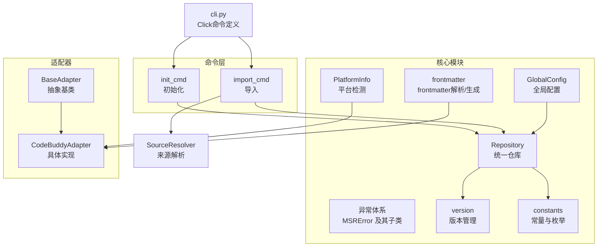
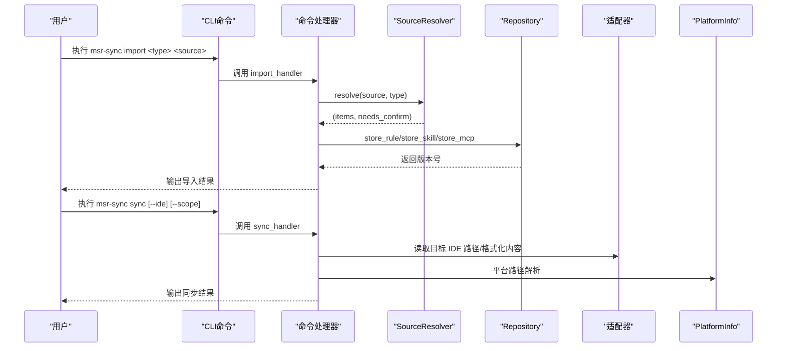
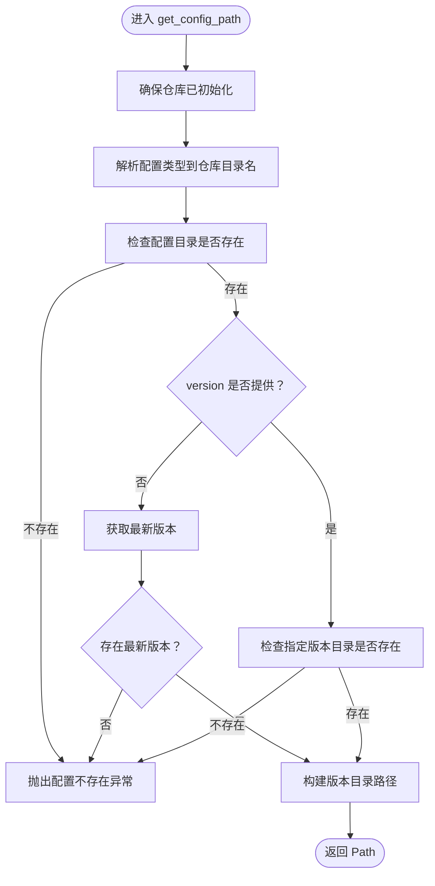
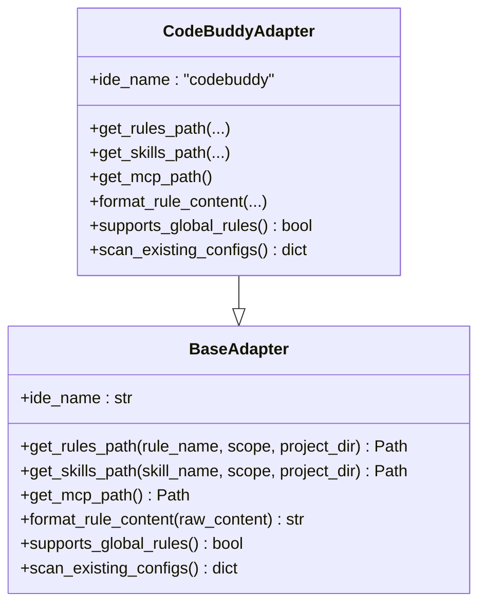
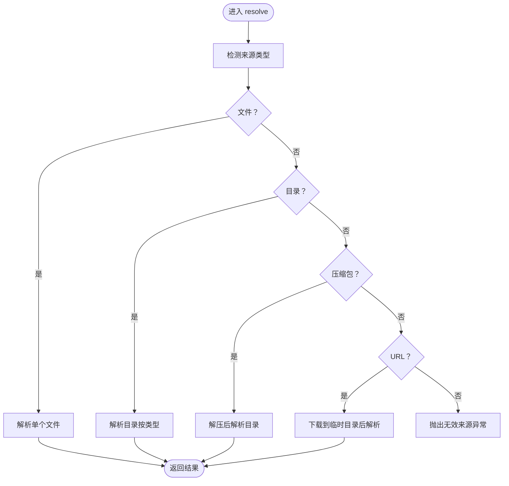
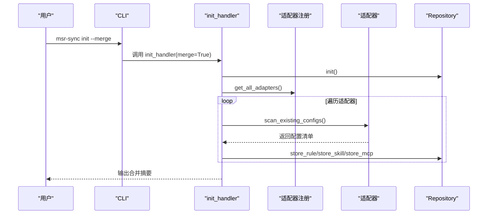
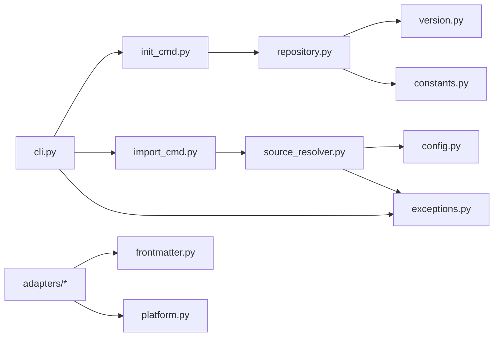

# API参考

<cite>
**本文引用的文件**
- [MSR-cli/msr_sync/core/repository.py](file://MSR-cli/msr_sync/core/repository.py)
- [MSR-cli/msr_sync/core/config.py](file://MSR-cli/msr_sync/core/config.py)
- [MSR-cli/msr_sync/core/exceptions.py](file://MSR-cli/msr_sync/core/exceptions.py)
- [MSR-cli/msr_sync/adapters/base.py](file://MSR-cli/msr_sync/adapters/base.py)
- [MSR-cli/msr_sync/adapters/codebuddy.py](file://MSR-cli/msr_sync/adapters/codebuddy.py)
- [MSR-cli/msr_sync/core/platform.py](file://MSR-cli/msr_sync/core/platform.py)
- [MSR-cli/msr_sync/constants.py](file://MSR-cli/msr_sync/constants.py)
- [MSR-cli/msr_sync/core/version.py](file://MSR-cli/msr_sync/core/version.py)
- [MSR-cli/msr_sync/core/frontmatter.py](file://MSR-cli/msr_sync/core/frontmatter.py)
- [MSR-cli/msr_sync/cli.py](file://MSR-cli/msr_sync/cli.py)
- [MSR-cli/msr_sync/core/source_resolver.py](file://MSR-cli/msr_sync/core/source_resolver.py)
- [MSR-cli/msr_sync/commands/init_cmd.py](file://MSR-cli/msr_sync/commands/init_cmd.py)
- [MSR-cli/msr_sync/commands/import_cmd.py](file://MSR-cli/msr_sync/commands/import_cmd.py)
- [MSR-cli/README.md](file://MSR-cli/README.md)
- [MSR-cli/pyproject.toml](file://MSR-cli/pyproject.toml)
</cite>

## 目录
1. [简介](#简介)
2. [项目结构](#项目结构)
3. [核心组件](#核心组件)
4. [架构总览](#架构总览)
5. [详细组件分析](#详细组件分析)
6. [依赖分析](#依赖分析)
7. [性能考量](#性能考量)
8. [故障排查指南](#故障排查指南)
9. [结论](#结论)
10. [附录](#附录)

## 简介
本文件为 MSR-v2（MSR-cli）核心API的权威参考，面向使用者与二次开发人员，系统性梳理公共接口、类定义、异常体系、配置选项、使用模式与最佳实践。重点覆盖统一仓库管理（Repository）、全局配置（GlobalConfig）、适配器基类（BaseAdapter）及其具体实现（如 CodeBuddyAdapter）、平台检测（PlatformInfo）、版本管理（version模块）、前端页脚解析（frontmatter模块）、来源解析（SourceResolver）以及CLI命令入口与命令处理器。

## 项目结构
MSR-cli 采用“核心模块 + 适配器 + 命令层 + CLI入口”的分层组织方式：
- 核心模块：统一仓库（repository）、全局配置（config）、异常（exceptions）、平台（platform）、版本（version）、frontmatter、常量（constants）
- 适配器：抽象基类（adapters/base.py）与具体实现（adapters/codebuddy.py 等）
- 命令层：init、import、sync、list、remove 等命令处理器
- CLI入口：命令定义与参数绑定（cli.py）

图表来源
- [MSR-cli/msr_sync/core/repository.py:23-291](file://MSR-cli/msr_sync/core/repository.py#L23-L291)
- [MSR-cli/msr_sync/core/config.py:18-204](file://MSR-cli/msr_sync/core/config.py#L18-L204)
- [MSR-cli/msr_sync/core/exceptions.py:4-34](file://MSR-cli/msr_sync/core/exceptions.py#L4-L34)
- [MSR-cli/msr_sync/core/platform.py:9-60](file://MSR-cli/msr_sync/core/platform.py#L9-L60)
- [MSR-cli/msr_sync/core/version.py:9-119](file://MSR-cli/msr_sync/core/version.py#L9-L119)
- [MSR-cli/msr_sync/core/frontmatter.py:10-145](file://MSR-cli/msr_sync/core/frontmatter.py#L10-L145)
- [MSR-cli/msr_sync/constants.py:7-50](file://MSR-cli/msr_sync/constants.py#L7-L50)
- [MSR-cli/msr_sync/adapters/base.py:8-105](file://MSR-cli/msr_sync/adapters/base.py#L8-L105)
- [MSR-cli/msr_sync/adapters/codebuddy.py:22-143](file://MSR-cli/msr_sync/adapters/codebuddy.py#L22-L143)
- [MSR-cli/msr_sync/commands/init_cmd.py:13-137](file://MSR-cli/msr_sync/commands/init_cmd.py#L13-L137)
- [MSR-cli/msr_sync/commands/import_cmd.py:14-151](file://MSR-cli/msr_sync/commands/import_cmd.py#L14-L151)
- [MSR-cli/msr_sync/cli.py:8-116](file://MSR-cli/msr_sync/cli.py#L8-L116)

章节来源
- [MSR-cli/msr_sync/cli.py:1-116](file://MSR-cli/msr_sync/cli.py#L1-L116)
- [MSR-cli/README.md:1-361](file://MSR-cli/README.md#L1-L361)

## 核心组件
本节对公共API进行逐项说明，包括类、方法、参数、返回值与异常。

- 统一仓库 Repository
  - 初始化与存在性
    - 方法: init() → bool
      - 功能: 初始化仓库目录结构（创建 RULES/、SKILLS/、MCP/ 子目录）
      - 返回: True 表示新建仓库，False 表示已存在
    - 方法: exists() → bool
      - 功能: 检查仓库根目录是否存在且包含全部必需子目录
  - 配置存取与版本管理
    - 方法: store_rule(name: str, content: str) → str
      - 功能: 将 rule 内容写入 RULES/<name>/Vn/<name>.md，自动递增版本号
      - 返回: 新版本号字符串（如 'V1'）
    - 方法: store_skill(name: str, source_dir: Path) → str
      - 功能: 将 skill 目录拷贝至 SKILLS/<name>/Vn/
      - 返回: 新版本号字符串
    - 方法: store_mcp(name: str, source_dir: Path) → str
      - 功能: 将 MCP 目录拷贝至 MCP/<name>/Vn/
      - 返回: 新版本号字符串
    - 方法: get_config_path(config_type: str, name: str, version: Optional[str] = None) → Path
      - 功能: 获取配置版本目录路径；version 为 None 时返回最新版本
      - 异常: 未初始化抛出仓库相关异常；找不到配置或版本抛出配置相关异常
    - 方法: list_configs(config_type: Optional[str] = None) → Dict[str, Dict[str, List[str]]]
      - 功能: 列出仓库中所有配置及其版本；可按类型过滤
    - 方法: remove_config(config_type: str, name: str, version: str) → bool
      - 功能: 删除指定配置版本
      - 异常: 未初始化或版本不存在抛出相应异常
    - 方法: read_rule_content(name: str, version: Optional[str] = None) → str
      - 功能: 读取 rule 原始 Markdown 内容；version 为 None 读取最新版本
      - 异常: 未初始化或找不到文件抛出相应异常
  - 关键内部与辅助
    - _ensure_exists() → None：确保仓库已初始化，否则抛出异常
    - _resolve_config_dir(config_type: str) → str：将配置类型映射为仓库目录名

- 全局配置 GlobalConfig
  - 属性
    - repo_path: Path（仓库根目录路径）
    - ignore_patterns: List[str]（导入时忽略的模式）
    - default_ides: List[str]（默认同步目标 IDE 列表）
    - default_scope: str（默认同步层级，'global' 或 'project'）
  - 方法
    - 构造函数: __init__(repo_path=None, ignore_patterns=None, default_ides=None, default_scope=None)
    - 静态方法: _resolve_repo_path(raw: Optional[str]) → Path
    - 静态方法: _validate_ides(raw: Optional[List[str]]) → List[str]
    - 静态方法: _validate_scope(raw: Optional[str]) → str
    - to_dict() → dict：序列化为字典（用于测试/调试）
  - 配置加载与单例
    - 函数: load_config(config_path: Optional[Path] = None) → GlobalConfig
    - 函数: get_config() → GlobalConfig（模块级单例）
    - 函数: init_config(config_path: Optional[Path] = None) → GlobalConfig（显式初始化）
    - 函数: reset_config() → None（仅测试）
    - 函数: generate_default_config(config_path: Optional[Path] = None) → bool（生成默认配置文件）

- 异常体系
  - 基类: MSRError
  - 子类:
    - RepositoryNotFoundError：仓库未初始化
    - ConfigNotFoundError：配置不存在
    - InvalidSourceError：无效的导入来源
    - UnsupportedPlatformError：不支持的操作系统
    - NetworkError：网络错误
    - ConfigParseError：配置解析错误
    - ConfigFileError：配置文件解析错误（YAML 语法错误等）

- 平台检测 PlatformInfo
  - 方法: get_os() → str（'macos' 或 'windows'；不支持时抛出异常）
  - 方法: get_home() → Path（用户主目录）
  - 方法: get_app_support_dir() → Path（应用数据目录；不支持时抛出异常）

- 版本管理 version
  - 函数: parse_version(version_str: str) → int（解析 'Vn' 为 n；非法格式抛错）
  - 函数: format_version(version_num: int) → str（整数转 'Vn'）
  - 函数: get_versions(config_dir: Path) → List[str]（按数字升序返回版本列表）
  - 函数: get_latest_version(config_dir: Path) → Optional[str]（返回最新版本）
  - 函数: get_next_version(config_dir: Path) → str（返回下一个版本）

- Frontmatter 解析与生成
  - 函数: strip_frontmatter(content: str) → str（移除 frontmatter，返回正文）
  - 函数: parse_frontmatter(content: str) → Tuple[Optional[dict], str]（解析 frontmatter 与正文）
  - 函数: build_qoder_header() → str、build_lingma_header() → str、build_codebuddy_header() → str（生成各 IDE 模板头部）

- 常量 constants
  - DEFAULT_REPO_PATH: Path（默认仓库路径）
  - RULES_DIR、SKILLS_DIR、MCP_DIR: str（仓库子目录名）
  - ConfigType: Enum（'rules'、'skills'、'mcp'，含 repo_dir_name 属性）
  - SUPPORTED_IDES: List[str]（支持的 IDE 列表）
  - VERSION_PREFIX: str（版本号前缀 'V'）
  - SKILL_MARKER_FILE: str（'SKILL.md'）
  - MCP_CONFIG_FILE: str（'mcp.json'）
  - SUPPORTED_ARCHIVE_EXTENSIONS: List[str]（'.zip'、'.tar.gz'、'.tgz'）
  - SUPPORTED_PLATFORMS: List[str]（'macos'、'windows'）

- 适配器基类 BaseAdapter
  - 抽象属性: ide_name: str
  - 抽象方法:
    - get_rules_path(rule_name: str, scope: str, project_dir: Optional[Path] = None) → Path
    - get_skills_path(skill_name: str, scope: str, project_dir: Optional[Path] = None) → Path
    - get_mcp_path() → Path
    - format_rule_content(raw_content: str) → str
  - 能力查询: supports_global_rules() → bool（默认 False，CodeBuddy 覆盖为 True）
  - 扫描方法: scan_existing_configs() → dict（返回各类型配置项列表）

- CodeBuddy 适配器 CodeBuddyAdapter
  - 继承: BaseAdapter
  - 路径解析: 支持项目级与用户级 rules/skills；MCP 跨平台统一路径
  - 格式转换: 为 rule 内容添加 CodeBuddy frontmatter（含时间戳）
  - 能力: 支持全局级 rules
  - 扫描: 扫描用户级 rules/skills 与 MCP 配置

- 来源解析 SourceResolver
  - 枚举: SourceType（FILE、DIRECTORY、ARCHIVE、URL）
  - 数据类: ResolvedItem（name、path、source_type）
  - 方法:
    - resolve(source: str, config_type: str) → Tuple[List[ResolvedItem], bool]
    - cleanup() → None（清理临时目录）
  - 内部策略:
    - _detect_source_type(source: str) → SourceType
    - _resolve_file(path: Path) → List[ResolvedItem]
    - _resolve_directory(path: Path, config_type: str) → List[ResolvedItem]
    - _resolve_archive(path: Path, config_type: str) → List[ResolvedItem]
    - _resolve_url(url: str, config_type: str) → List[ResolvedItem]
    - _should_ignore(name: str) → bool（基于全局配置的忽略模式）

- CLI 与命令处理器
  - CLI 入口: main()（Click group）
  - 子命令:
    - init: --merge（合并已有 IDE 配置到统一仓库）
    - import: <type> <source>（导入配置到统一仓库）
    - sync: --ide --scope --project-dir --type --name --version
    - list: --type
    - remove: <type> <name> <version>
  - 错误处理: 捕获 MSRError 并输出错误信息，退出码 1

章节来源
- [MSR-cli/msr_sync/core/repository.py:23-291](file://MSR-cli/msr_sync/core/repository.py#L23-L291)
- [MSR-cli/msr_sync/core/config.py:18-204](file://MSR-cli/msr_sync/core/config.py#L18-L204)
- [MSR-cli/msr_sync/core/exceptions.py:4-34](file://MSR-cli/msr_sync/core/exceptions.py#L4-L34)
- [MSR-cli/msr_sync/core/platform.py:9-60](file://MSR-cli/msr_sync/core/platform.py#L9-L60)
- [MSR-cli/msr_sync/core/version.py:9-119](file://MSR-cli/msr_sync/core/version.py#L9-L119)
- [MSR-cli/msr_sync/core/frontmatter.py:10-145](file://MSR-cli/msr_sync/core/frontmatter.py#L10-L145)
- [MSR-cli/msr_sync/constants.py:7-50](file://MSR-cli/msr_sync/constants.py#L7-L50)
- [MSR-cli/msr_sync/adapters/base.py:8-105](file://MSR-cli/msr_sync/adapters/base.py#L8-L105)
- [MSR-cli/msr_sync/adapters/codebuddy.py:22-143](file://MSR-cli/msr_sync/adapters/codebuddy.py#L22-L143)
- [MSR-cli/msr_sync/core/source_resolver.py:16-404](file://MSR-cli/msr_sync/core/source_resolver.py#L16-L404)
- [MSR-cli/msr_sync/cli.py:8-116](file://MSR-cli/msr_sync/cli.py#L8-L116)

## 架构总览
MSR-cli 的核心流程围绕“导入 → 存储 → 同步”展开。CLI 命令将用户意图转化为具体操作，命令处理器调用 SourceResolver 解析来源，Repository 负责统一存储与版本管理，PlatformInfo 与适配器负责平台与 IDE 的差异化处理。

图表来源
- [MSR-cli/msr_sync/cli.py:14-116](file://MSR-cli/msr_sync/cli.py#L14-L116)
- [MSR-cli/msr_sync/commands/import_cmd.py:14-151](file://MSR-cli/msr_sync/commands/import_cmd.py#L14-L151)
- [MSR-cli/msr_sync/core/source_resolver.py:77-111](file://MSR-cli/msr_sync/core/source_resolver.py#L77-L111)
- [MSR-cli/msr_sync/core/repository.py:89-158](file://MSR-cli/msr_sync/core/repository.py#L89-L158)
- [MSR-cli/msr_sync/adapters/codebuddy.py:31-78](file://MSR-cli/msr_sync/adapters/codebuddy.py#L31-L78)
- [MSR-cli/msr_sync/core/platform.py:12-60](file://MSR-cli/msr_sync/core/platform.py#L12-L60)

## 详细组件分析

### 组件A：Repository（统一仓库）
- 设计要点
  - 以“类型-名称-版本”三层目录组织配置，版本号采用 Vn 格式，自动递增
  - 通过 ConfigType 与常量映射到仓库子目录
  - 提供读写、列举、删除、路径解析与版本查询等能力
- 关键流程图（获取配置路径）

图表来源
- [MSR-cli/msr_sync/core/repository.py:160-199](file://MSR-cli/msr_sync/core/repository.py#L160-L199)

章节来源
- [MSR-cli/msr_sync/core/repository.py:23-291](file://MSR-cli/msr_sync/core/repository.py#L23-L291)

### 组件B：GlobalConfig（全局配置）
- 设计要点
  - 从 ~/.msr-sync/config.yaml 加载，支持默认值与校验
  - 提供模块级单例 get_config()，便于全模块共享
  - 支持生成默认配置文件，避免覆盖已有配置
- 配置项与默认值
  - repo_path: 默认 ~/.msr-repos
  - ignore_patterns: 默认忽略 __MACOSX、.DS_Store、__pycache__、.git
  - default_ides: 默认 ['all']
  - default_scope: 默认 'global'

章节来源
- [MSR-cli/msr_sync/core/config.py:18-204](file://MSR-cli/msr_sync/core/config.py#L18-L204)

### 组件C：BaseAdapter 与 CodeBuddyAdapter
- 设计要点
  - BaseAdapter 定义 IDE 适配器的统一接口：路径解析、格式转换、能力查询、扫描既有配置
  - CodeBuddyAdapter 实现路径解析与格式转换，支持全局级 rules
- 类关系图

图表来源
- [MSR-cli/msr_sync/adapters/base.py:8-105](file://MSR-cli/msr_sync/adapters/base.py#L8-L105)
- [MSR-cli/msr_sync/adapters/codebuddy.py:22-143](file://MSR-cli/msr_sync/adapters/codebuddy.py#L22-L143)

章节来源
- [MSR-cli/msr_sync/adapters/base.py:8-105](file://MSR-cli/msr_sync/adapters/base.py#L8-L105)
- [MSR-cli/msr_sync/adapters/codebuddy.py:22-143](file://MSR-cli/msr_sync/adapters/codebuddy.py#L22-L143)

### 组件D：SourceResolver（来源解析）
- 设计要点
  - 支持文件、目录、压缩包、URL 四种来源类型
  - 自动识别单个 skill 与单个 MCP 的特殊目录结构
  - 基于全局配置的 ignore_patterns 过滤扫描结果
- 流程图（解析来源）

图表来源
- [MSR-cli/msr_sync/core/source_resolver.py:77-111](file://MSR-cli/msr_sync/core/source_resolver.py#L77-L111)

章节来源
- [MSR-cli/msr_sync/core/source_resolver.py:43-404](file://MSR-cli/msr_sync/core/source_resolver.py#L43-L404)

### 组件E：CLI 命令与错误处理
- 设计要点
  - 使用 Click 定义子命令与参数，支持多 IDE、多层级、多类型同步
  - 命令处理器捕获 MSRError 并输出友好错误信息，退出码 1
  - init 命令支持 --merge，自动扫描并导入各 IDE 配置
- 序列图（init --merge）

图表来源
- [MSR-cli/msr_sync/cli.py:14-25](file://MSR-cli/msr_sync/cli.py#L14-L25)
- [MSR-cli/msr_sync/commands/init_cmd.py:13-137](file://MSR-cli/msr_sync/commands/init_cmd.py#L13-L137)

章节来源
- [MSR-cli/msr_sync/cli.py:8-116](file://MSR-cli/msr_sync/cli.py#L8-L116)
- [MSR-cli/msr_sync/commands/init_cmd.py:13-137](file://MSR-cli/msr_sync/commands/init_cmd.py#L13-L137)

## 依赖分析
- 模块内聚与耦合
  - Repository 依赖 constants、version、exceptions；与 frontmatter 间接配合（通过适配器）
  - GlobalConfig 依赖 yaml、constants；提供单例供其他模块共享
  - SourceResolver 依赖 constants、config（忽略模式）、exceptions
  - BaseAdapter/CodeBuddyAdapter 依赖 frontmatter、platform
  - CLI 依赖各命令处理器与 exceptions
- 外部依赖
  - click、pyyaml（见 pyproject.toml）

图表来源
- [MSR-cli/msr_sync/cli.py:1-116](file://MSR-cli/msr_sync/cli.py#L1-L116)
- [MSR-cli/msr_sync/commands/init_cmd.py:1-137](file://MSR-cli/msr_sync/commands/init_cmd.py#L1-L137)
- [MSR-cli/msr_sync/commands/import_cmd.py:1-151](file://MSR-cli/msr_sync/commands/import_cmd.py#L1-L151)
- [MSR-cli/msr_sync/core/source_resolver.py:1-404](file://MSR-cli/msr_sync/core/source_resolver.py#L1-L404)
- [MSR-cli/msr_sync/core/repository.py:1-291](file://MSR-cli/msr_sync/core/repository.py#L1-L291)
- [MSR-cli/msr_sync/core/config.py:1-204](file://MSR-cli/msr_sync/core/config.py#L1-L204)
- [MSR-cli/msr_sync/core/exceptions.py:1-34](file://MSR-cli/msr_sync/core/exceptions.py#L1-L34)
- [MSR-cli/msr_sync/core/frontmatter.py:1-145](file://MSR-cli/msr_sync/core/frontmatter.py#L1-L145)
- [MSR-cli/msr_sync/core/platform.py:1-60](file://MSR-cli/msr_sync/core/platform.py#L1-L60)
- [MSR-cli/msr_sync/constants.py:1-50](file://MSR-cli/msr_sync/constants.py#L1-L50)
- [MSR-cli/msr_sync/core/version.py:1-119](file://MSR-cli/msr_sync/core/version.py#L1-L119)

章节来源
- [MSR-cli/pyproject.toml:18-21](file://MSR-cli/pyproject.toml#L18-L21)

## 性能考量
- I/O 优化
  - Repository 在导入时使用 copytree 与文件写入，建议控制单次导入规模，避免频繁小文件写入
  - SourceResolver 使用临时目录解压压缩包，注意及时调用 cleanup 释放资源
- 版本管理
  - get_versions 会对目录进行排序，大规模版本数量时建议限制扫描范围或缓存结果
- 平台路径解析
  - PlatformInfo 仅做简单路径拼接，性能开销极低
- 建议
  - 批量导入时尽量使用压缩包，减少多次 I/O
  - 合理设置 ignore_patterns，避免扫描无关目录

## 故障排查指南
- 常见异常与处理
  - RepositoryNotFoundError：统一仓库未初始化。解决：先执行初始化命令
  - ConfigNotFoundError：配置或版本不存在。解决：检查配置名称与版本号
  - InvalidSourceError：来源无效（文件/目录/压缩包/URL 不匹配）。解决：确认来源格式与路径
  - UnsupportedPlatformError：不支持的操作系统。解决：当前仅支持 macOS 与 Windows
  - NetworkError：网络错误。解决：检查网络连通性
  - ConfigFileError：配置文件 YAML 语法错误。解决：修正 config.yaml 语法
- CLI 错误处理
  - 所有命令在捕获 MSRError 后会输出错误信息并以退出码 1 结束，便于脚本化处理
- 调试建议
  - 使用 list 命令查看仓库状态与版本
  - 使用 remove 命令清理问题版本
  - 检查 ~/.msr-sync/config.yaml 与 ~/.msr-repos 目录权限

章节来源
- [MSR-cli/msr_sync/core/exceptions.py:4-34](file://MSR-cli/msr_sync/core/exceptions.py#L4-L34)
- [MSR-cli/msr_sync/cli.py:20-24](file://MSR-cli/msr_sync/cli.py#L20-L24)

## 结论
MSR-cli 通过统一仓库与适配器模式，实现了多 IDE 配置的标准化、版本化与自动化同步。其 API 设计清晰、异常体系完备、配置灵活、CLI 易用。遵循本文档的使用模式与最佳实践，可在多 IDE 间高效迁移与共享配置，同时保持版本可追溯与团队一致性。

## 附录

### 配置选项详解
- 配置文件位置
  - ~/.msr-sync/config.yaml
- 配置项
  - repo_path: 统一仓库根目录路径（支持 ~ 展开，默认 ~/.msr-repos）
  - ignore_patterns: 导入扫描时忽略的目录/文件模式（支持精确匹配与通配符）
  - default_ides: 默认同步目标 IDE 列表（可选值：trae、qoder、lingma、codebuddy、all）
  - default_scope: 默认同步层级（global 或 project）
- 生成默认配置
  - init 命令会生成带注释的默认配置文件，避免覆盖已有配置

章节来源
- [MSR-cli/README.md:297-345](file://MSR-cli/README.md#L297-L345)
- [MSR-cli/msr_sync/core/config.py:161-204](file://MSR-cli/msr_sync/core/config.py#L161-L204)

### 使用模式与最佳实践
- 初始化与合并
  - 先执行初始化，再根据需要使用 --merge 合并已有 IDE 配置
- 导入策略
  - 优先使用压缩包导入，便于批量与版本化
  - 使用 URL 导入时确保链接指向受支持的压缩包格式
- 同步策略
  - 未指定版本时默认同步最新版本；必要时显式指定版本
  - 项目级与全局级同步需结合 default_scope 与命令行参数
- 错误处理
  - 捕获 MSRError 并记录日志，避免中断 CI/CD 流程
  - 对网络错误与平台错误分别处理，提供降级方案

章节来源
- [MSR-cli/README.md:159-240](file://MSR-cli/README.md#L159-L240)
- [MSR-cli/msr_sync/cli.py:58-83](file://MSR-cli/msr_sync/cli.py#L58-L83)

### 版本兼容性与变更历史
- 版本信息
  - 包版本与项目版本均为 0.1.0（见 pyproject.toml）
- 变更建议
  - 当前版本处于早期阶段，建议在测试环境中验证导入/同步流程
  - 关注后续版本对 IDE 支持与功能扩展

章节来源
- [MSR-cli/pyproject.toml:11-12](file://MSR-cli/pyproject.toml#L11-L12)
- [MSR-cli/msr_sync/__init__.py:3-4](file://MSR-cli/msr_sync/__init__.py#L3-L4)