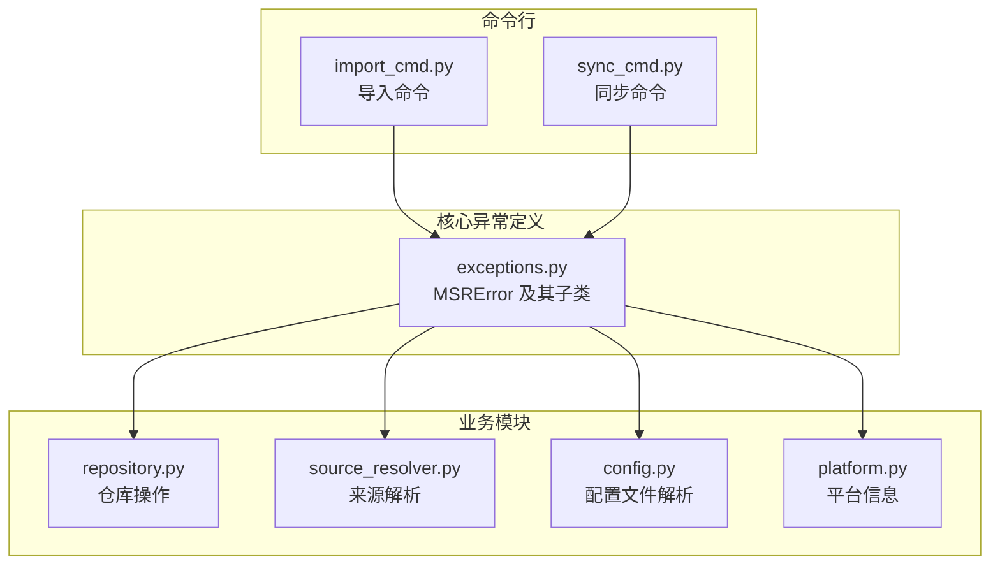
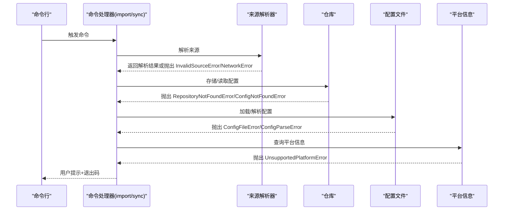
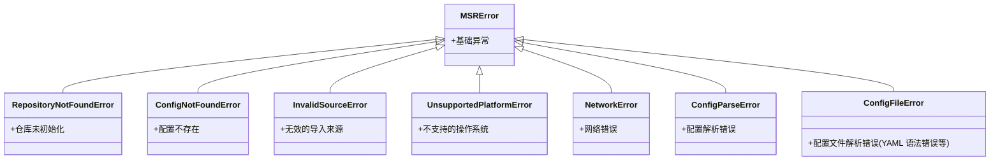
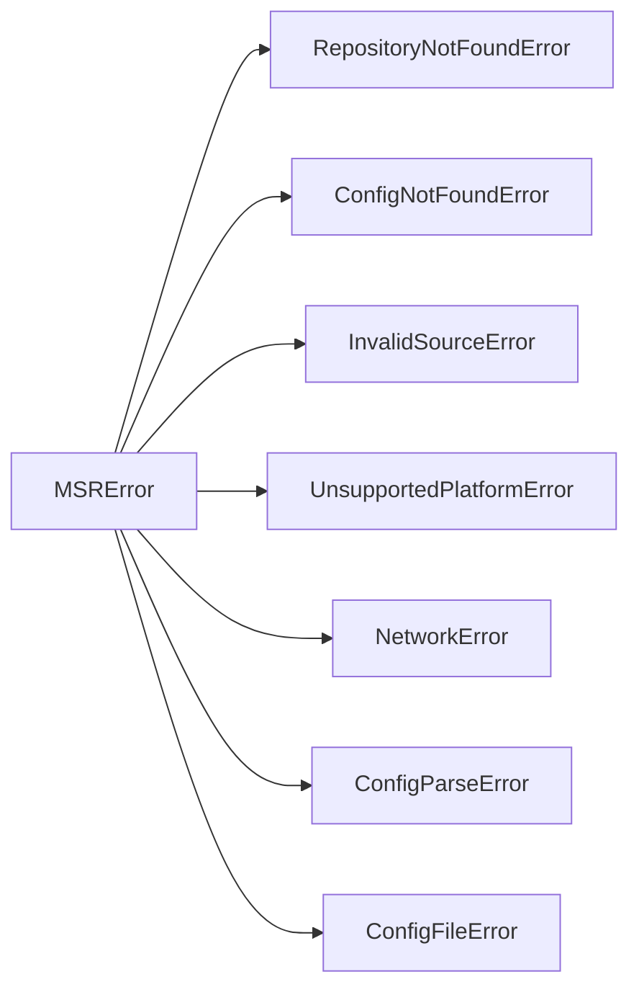

# 异常处理

<cite>
**本文引用的文件**
- [MSR-cli/msr_sync/core/exceptions.py](file://MSR-cli/msr_sync/core/exceptions.py)
- [MSR-cli/tests/test_exceptions.py](file://MSR-cli/tests/test_exceptions.py)
- [MSR-cli/msr_sync/core/repository.py](file://MSR-cli/msr_sync/core/repository.py)
- [MSR-cli/msr_sync/core/source_resolver.py](file://MSR-cli/msr_sync/core/source_resolver.py)
- [MSR-cli/msr_sync/core/config.py](file://MSR-cli/msr_sync/core/config.py)
- [MSR-cli/msr_sync/core/platform.py](file://MSR-cli/msr_sync/core/platform.py)
- [MSR-cli/msr_sync/commands/import_cmd.py](file://MSR-cli/msr_sync/commands/import_cmd.py)
- [MSR-cli/msr_sync/commands/sync_cmd.py](file://MSR-cli/msr_sync/commands/sync_cmd.py)
</cite>

## 目录
1. [简介](#简介)
2. [项目结构](#项目结构)
3. [核心组件](#核心组件)
4. [架构总览](#架构总览)
5. [详细组件分析](#详细组件分析)
6. [依赖分析](#依赖分析)
7. [性能考虑](#性能考虑)
8. [故障排查指南](#故障排查指南)
9. [结论](#结论)

## 简介
本文件面向开发者，系统性梳理 MSR-v2 的异常处理机制，聚焦于自定义异常类的定义、继承关系、触发条件、错误消息格式与处理建议，并结合命令行工具的实际使用场景，给出异常捕获与处理的最佳实践。同时提供异常链追踪与调试技巧，帮助开发者在不同业务场景下正确识别与处置各类异常。

## 项目结构
MSR-v2 的异常体系位于核心模块，围绕“仓库”“来源解析”“配置文件”“平台信息”等子系统进行分层定义，命令行命令在关键流程中对异常进行捕获与用户提示，形成“异常定义—异常抛出—异常捕获”的闭环。

图表来源
- [MSR-cli/msr_sync/core/exceptions.py:1-34](file://MSR-cli/msr_sync/core/exceptions.py#L1-L34)
- [MSR-cli/msr_sync/core/repository.py:60-259](file://MSR-cli/msr_sync/core/repository.py#L60-L259)
- [MSR-cli/msr_sync/core/source_resolver.py:100-299](file://MSR-cli/msr_sync/core/source_resolver.py#L100-L299)
- [MSR-cli/msr_sync/core/config.py:110-204](file://MSR-cli/msr_sync/core/config.py#L110-L204)
- [MSR-cli/msr_sync/core/platform.py:20-60](file://MSR-cli/msr_sync/core/platform.py#L20-L60)
- [MSR-cli/msr_sync/commands/import_cmd.py:14-151](file://MSR-cli/msr_sync/commands/import_cmd.py#L14-L151)
- [MSR-cli/msr_sync/commands/sync_cmd.py:265-411](file://MSR-cli/msr_sync/commands/sync_cmd.py#L265-L411)

章节来源
- [MSR-cli/msr_sync/core/exceptions.py:1-34](file://MSR-cli/msr_sync/core/exceptions.py#L1-L34)
- [MSR-cli/msr_sync/core/repository.py:60-259](file://MSR-cli/msr_sync/core/repository.py#L60-L259)
- [MSR-cli/msr_sync/core/source_resolver.py:100-299](file://MSR-cli/msr_sync/core/source_resolver.py#L100-L299)
- [MSR-cli/msr_sync/core/config.py:110-204](file://MSR-cli/msr_sync/core/config.py#L110-L204)
- [MSR-cli/msr_sync/core/platform.py:20-60](file://MSR-cli/msr_sync/core/platform.py#L20-L60)
- [MSR-cli/msr_sync/commands/import_cmd.py:14-151](file://MSR-cli/msr_sync/commands/import_cmd.py#L14-L151)
- [MSR-cli/msr_sync/commands/sync_cmd.py:265-411](file://MSR-cli/msr_sync/commands/sync_cmd.py#L265-L411)

## 核心组件
MSR-v2 的异常体系采用“基础异常类 + 业务领域异常类”的分层设计：
- 基础异常类：MSRError
- 业务异常类：
  - RepositoryNotFoundError：仓库未初始化
  - ConfigNotFoundError：配置或版本不存在
  - InvalidSourceError：无效的导入来源
  - UnsupportedPlatformError：不支持的操作系统
  - NetworkError：网络错误
  - ConfigParseError：MCP 配置解析错误
  - ConfigFileError：配置文件 YAML 语法错误

这些异常类均继承自 MSRError，便于上层统一捕获与处理。

章节来源
- [MSR-cli/msr_sync/core/exceptions.py:4-34](file://MSR-cli/msr_sync/core/exceptions.py#L4-L34)
- [MSR-cli/tests/test_exceptions.py:16-49](file://MSR-cli/tests/test_exceptions.py#L16-L49)

## 架构总览
异常在各模块中的分布与流转如下：
- 定义：exceptions.py 提供异常类定义
- 抛出：repository.py、source_resolver.py、config.py、platform.py 在业务校验失败时抛出相应异常
- 捕获：import_cmd.py、sync_cmd.py 在命令入口处捕获并进行用户提示与退出码控制

图表来源
- [MSR-cli/msr_sync/commands/import_cmd.py:38-56](file://MSR-cli/msr_sync/commands/import_cmd.py#L38-L56)
- [MSR-cli/msr_sync/commands/sync_cmd.py:265-411](file://MSR-cli/msr_sync/commands/sync_cmd.py#L265-L411)
- [MSR-cli/msr_sync/core/source_resolver.py:100-299](file://MSR-cli/msr_sync/core/source_resolver.py#L100-L299)
- [MSR-cli/msr_sync/core/repository.py:60-259](file://MSR-cli/msr_sync/core/repository.py#L60-L259)
- [MSR-cli/msr_sync/core/config.py:110-204](file://MSR-cli/msr_sync/core/config.py#L110-L204)
- [MSR-cli/msr_sync/core/platform.py:20-60](file://MSR-cli/msr_sync/core/platform.py#L20-L60)

## 详细组件分析

### 异常类定义与继承关系
- MSRError：所有业务异常的基类，继承自标准库 Exception
- 子类职责：
  - RepositoryNotFoundError：仓库未初始化时触发
  - ConfigNotFoundError：配置或版本不存在时触发
  - InvalidSourceError：来源类型/文件/目录/压缩包/URL 校验失败时触发
  - UnsupportedPlatformError：当前操作系统不受支持时触发
  - NetworkError：网络下载失败时触发
  - ConfigParseError：MCP 配置 JSON 解析错误时触发
  - ConfigFileError：配置文件 YAML 语法错误时触发

图表来源
- [MSR-cli/msr_sync/core/exceptions.py:4-34](file://MSR-cli/msr_sync/core/exceptions.py#L4-L34)

章节来源
- [MSR-cli/msr_sync/core/exceptions.py:4-34](file://MSR-cli/msr_sync/core/exceptions.py#L4-L34)
- [MSR-cli/tests/test_exceptions.py:26-49](file://MSR-cli/tests/test_exceptions.py#L26-L49)

### 异常触发条件与错误消息格式

- RepositoryNotFoundError
  - 触发条件：仓库不存在或未初始化
  - 触发位置：仓库操作前的前置校验
  - 错误消息格式：包含明确的引导语句，提示先执行初始化
  - 处理建议：在命令入口处捕获并提示用户先执行初始化；避免在未初始化状态下进行任何仓库操作

- ConfigNotFoundError
  - 触发条件：配置项或版本不存在
  - 触发位置：查询配置路径、列出配置、删除配置等
  - 错误消息格式：包含配置类型、名称、版本等上下文信息
  - 处理建议：在命令入口处捕获并提示用户检查配置是否存在；若为版本问题，建议列出可用版本

- InvalidSourceError
  - 触发条件：来源类型无法识别、文件/目录/压缩包不存在、不支持的文件格式、URL 下载失败等
  - 触发位置：来源解析器的多种分支
  - 错误消息格式：包含来源标识与具体原因
  - 处理建议：在命令入口处捕获并提示用户修正来源参数；对压缩包提供更明确的格式提示

- UnsupportedPlatformError
  - 触发条件：当前操作系统不在受支持列表内
  - 触发位置：平台信息查询与应用数据目录定位
  - 错误消息格式：包含系统标识
  - 处理建议：在命令入口处捕获并提示用户切换到受支持的操作系统

- NetworkError
  - 触发条件：网络下载失败
  - 触发位置：来源解析器的 URL 下载分支
  - 错误消息格式：包含 URL 与网络相关提示
  - 处理建议：在命令入口处捕获并提示检查网络连接

- ConfigParseError
  - 触发条件：MCP 配置 JSON 解析失败
  - 触发位置：同步命令中对 MCP 配置的读取与解析
  - 错误消息格式：包含文件路径与解析错误详情
  - 处理建议：在命令入口处捕获并提示用户检查 MCP 配置格式

- ConfigFileError
  - 触发条件：配置文件 YAML 语法错误
  - 触发位置：配置文件解析
  - 错误消息格式：包含文件路径与 YAML 解析错误
  - 处理建议：在命令入口处捕获并提示用户修复 YAML 语法

章节来源
- [MSR-cli/msr_sync/core/repository.py:60-259](file://MSR-cli/msr_sync/core/repository.py#L60-L259)
- [MSR-cli/msr_sync/core/source_resolver.py:100-299](file://MSR-cli/msr_sync/core/source_resolver.py#L100-L299)
- [MSR-cli/msr_sync/core/config.py:110-204](file://MSR-cli/msr_sync/core/config.py#L110-L204)
- [MSR-cli/msr_sync/core/platform.py:20-60](file://MSR-cli/msr_sync/core/platform.py#L20-L60)
- [MSR-cli/msr_sync/commands/sync_cmd.py:265-411](file://MSR-cli/msr_sync/commands/sync_cmd.py#L265-L411)

### 异常与业务逻辑的关系
- 仓库操作：在执行存储/读取/删除等操作前，必须确保仓库已初始化，否则抛出 RepositoryNotFoundError
- 来源解析：对来源进行类型判定与合法性校验，不合法时抛出 InvalidSourceError；网络来源失败时抛出 NetworkError
- 配置解析：YAML 语法错误抛出 ConfigFileError；MCP 配置 JSON 解析错误抛出 ConfigParseError
- 平台信息：仅支持 macOS 与 Windows，其他系统抛出 UnsupportedPlatformError

章节来源
- [MSR-cli/msr_sync/core/repository.py:60-259](file://MSR-cli/msr_sync/core/repository.py#L60-L259)
- [MSR-cli/msr_sync/core/source_resolver.py:100-299](file://MSR-cli/msr_sync/core/source_resolver.py#L100-L299)
- [MSR-cli/msr_sync/core/config.py:110-204](file://MSR-cli/msr_sync/core/config.py#L110-L204)
- [MSR-cli/msr_sync/core/platform.py:20-60](file://MSR-cli/msr_sync/core/platform.py#L20-L60)

### 异常捕获与处理最佳实践

- 命令入口捕获
  - 在命令入口处对特定异常进行捕获与用户提示，随后以合适的退出码结束进程
  - 示例参考：导入命令对 InvalidSourceError、NetworkError 进行捕获并提示；对 RepositoryNotFoundError 进行捕获并提示初始化

- 分层处理
  - 业务层负责抛出具体异常
  - 命令层负责捕获并进行用户提示与流程控制
  - 避免在业务层吞掉异常导致不可见的失败

- 错误消息可读性
  - 错误消息应包含上下文信息（来源、路径、类型等）
  - 对常见问题提供明确的解决建议（例如“请先执行初始化”）

- 退出码控制
  - 对可预期的用户错误使用非零退出码，便于脚本化集成

章节来源
- [MSR-cli/msr_sync/commands/import_cmd.py:38-56](file://MSR-cli/msr_sync/commands/import_cmd.py#L38-L56)
- [MSR-cli/msr_sync/commands/import_cmd.py:145-150](file://MSR-cli/msr_sync/commands/import_cmd.py#L145-L150)

### 异常链追踪与调试技巧
- 使用异常链（from e）保留原始错误上下文，便于定位问题源头
  - 示例：压缩包解压失败时通过异常链保留底层异常
- 在命令入口处打印异常消息，结合日志或用户提示快速定位
- 对网络错误，优先检查网络连通性与代理设置
- 对 YAML/JSON 解析错误，逐行核对文件格式与编码

章节来源
- [MSR-cli/msr_sync/core/source_resolver.py:313-313](file://MSR-cli/msr_sync/core/source_resolver.py#L313-L313)
- [MSR-cli/msr_sync/commands/sync_cmd.py:271-316](file://MSR-cli/msr_sync/commands/sync_cmd.py#L271-L316)

## 依赖分析
异常类之间的依赖关系清晰，均为继承关系，无循环依赖；命令层对异常进行集中捕获，耦合度低，便于扩展新的异常类型。

图表来源
- [MSR-cli/msr_sync/core/exceptions.py:4-34](file://MSR-cli/msr_sync/core/exceptions.py#L4-L34)

章节来源
- [MSR-cli/msr_sync/core/exceptions.py:4-34](file://MSR-cli/msr_sync/core/exceptions.py#L4-L34)

## 性能考虑
- 异常抛出与捕获本身成本较低，主要影响在于异常链构建与消息拼接
- 建议在高频路径中避免不必要的异常构造，优先通过返回值或状态码进行快速失败
- 对网络请求等外部依赖，建议在调用前进行预检，减少异常发生频率

## 故障排查指南
- 仓库未初始化
  - 现象：执行导入/同步时报仓库不存在
  - 排查：先执行初始化命令，再重试
  - 参考：仓库前置校验与错误消息

- 配置或版本不存在
  - 现象：查询/删除配置时报错
  - 排查：列出可用配置与版本，确认名称与版本号
  - 参考：配置路径解析与错误消息

- 来源无效或网络错误
  - 现象：导入来源解析失败或下载失败
  - 排查：检查来源类型、路径、URL 与网络连通性
  - 参考：来源解析器的多种校验分支

- 平台不受支持
  - 现象：平台信息查询失败
  - 排查：确认操作系统是否为 macOS 或 Windows
  - 参考：平台信息模块

- 配置文件/JSON 解析错误
  - 现象：YAML/JSON 语法错误
  - 排查：检查文件编码、语法与格式
  - 参考：配置解析与 MCP 配置解析

章节来源
- [MSR-cli/msr_sync/core/repository.py:60-259](file://MSR-cli/msr_sync/core/repository.py#L60-L259)
- [MSR-cli/msr_sync/core/source_resolver.py:100-299](file://MSR-cli/msr_sync/core/source_resolver.py#L100-L299)
- [MSR-cli/msr_sync/core/config.py:110-204](file://MSR-cli/msr_sync/core/config.py#L110-L204)
- [MSR-cli/msr_sync/core/platform.py:20-60](file://MSR-cli/msr_sync/core/platform.py#L20-L60)
- [MSR-cli/msr_sync/commands/sync_cmd.py:265-411](file://MSR-cli/msr_sync/commands/sync_cmd.py#L265-L411)

## 结论
MSR-v2 的异常处理机制以清晰的分层设计与明确的错误消息为核心，配合命令层的集中捕获与用户提示，形成了良好的用户体验与可维护性。开发者在扩展新功能时，应遵循“定义具体异常—在业务层抛出—在命令层捕获”的模式，并保持错误消息的可读性与上下文完整性，以提升整体系统的稳定性与可诊断性。