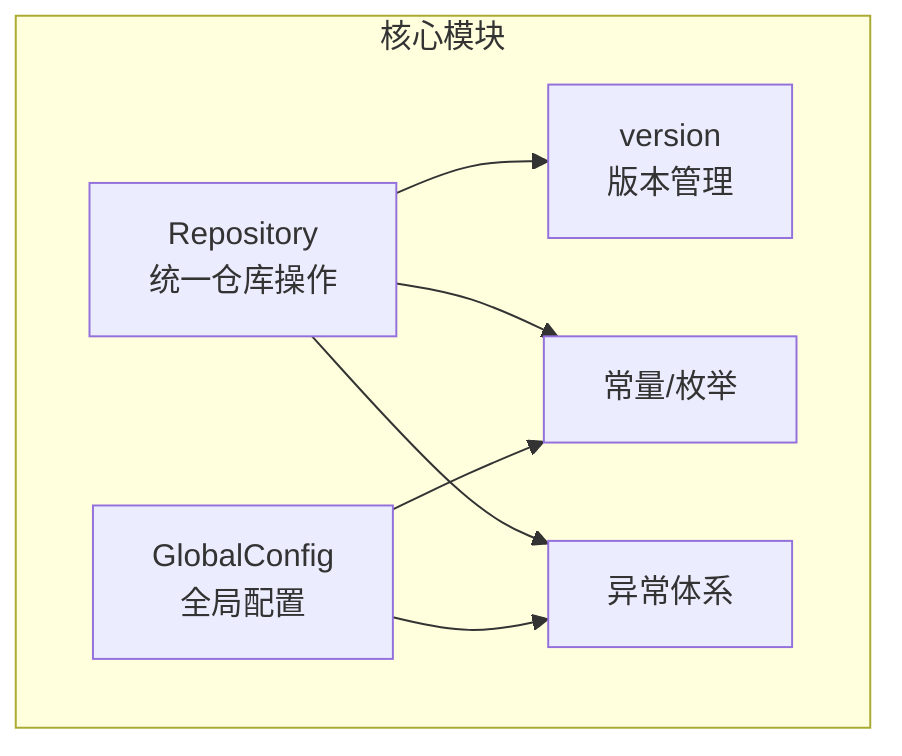
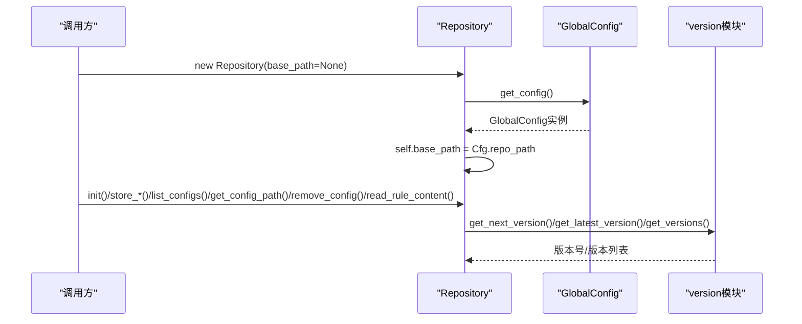
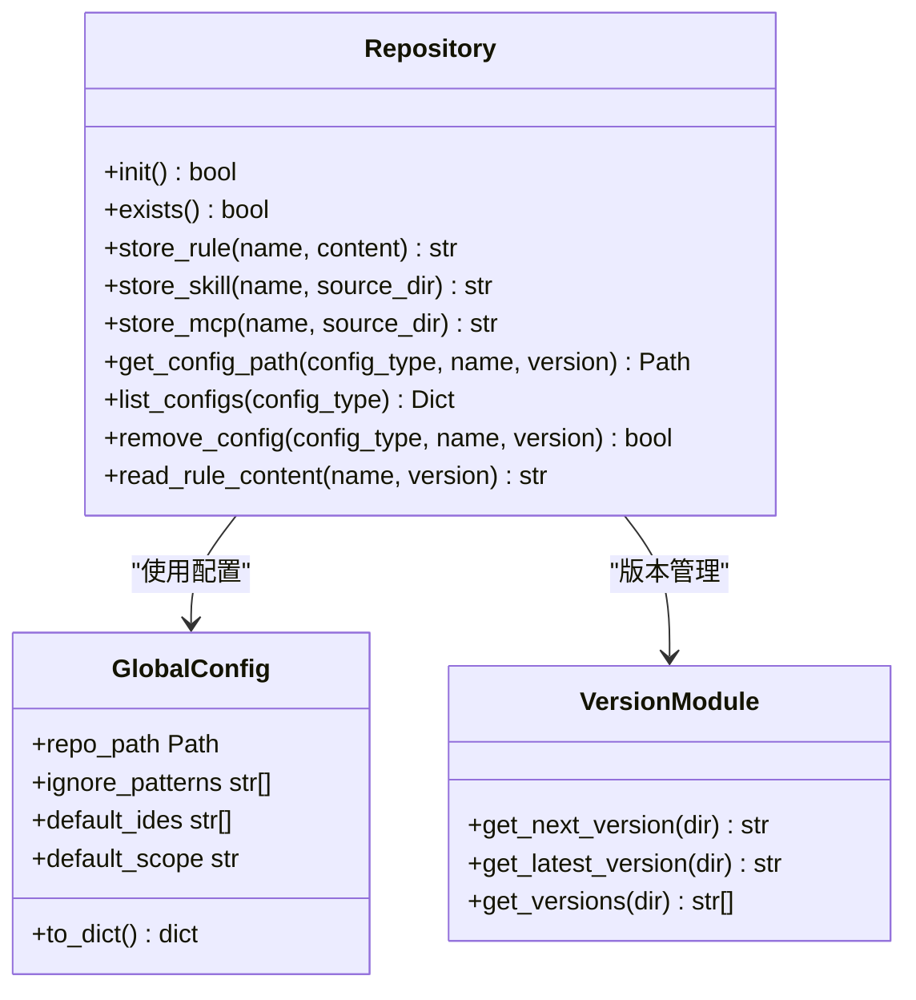
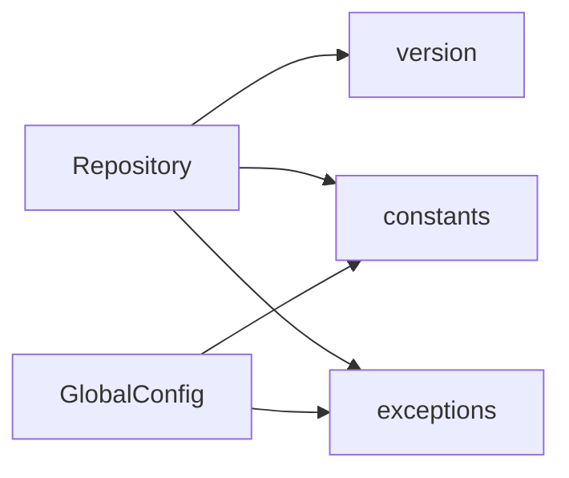

# 核心类

<cite>
**本文引用的文件**
- [repository.py](file://MSR-cli/msr_sync/core/repository.py)
- [config.py](file://MSR-cli/msr_sync/core/config.py)
- [constants.py](file://MSR-cli/msr_sync/constants.py)
- [version.py](file://MSR-cli/msr_sync/core/version.py)
- [exceptions.py](file://MSR-cli/msr_sync/core/exceptions.py)
- [test_repository.py](file://MSR-cli/tests/test_repository.py)
- [test_config.py](file://MSR-cli/tests/test_config.py)
- [frontmatter.py](file://MSR-cli/msr_sync/core/frontmatter.py)
</cite>

## 目录
1. [简介](#简介)
2. [项目结构](#项目结构)
3. [核心组件](#核心组件)
4. [架构总览](#架构总览)
5. [详细组件分析](#详细组件分析)
6. [依赖分析](#依赖分析)
7. [性能考量](#性能考量)
8. [故障排查指南](#故障排查指南)
9. [结论](#结论)
10. [附录](#附录)

## 简介
本文件面向MSR-v2的“核心类”API文档，聚焦两个关键模块：
- Repository类：统一管理规则（rules）、技能（skills）、MCP配置的导入、存储、查询与删除，支持多版本管理。
- GlobalConfig类：负责加载、校验与序列化用户全局配置，提供默认值与单例访问。

文档将逐项说明Repository类的公共方法签名、参数、返回值、异常与使用示例，以及GlobalConfig类的配置加载、保存、验证与最佳实践；并解释二者之间的协作关系、错误处理策略与性能考量。

## 项目结构
MSR-v2的CLI核心位于MSR-cli/msr_sync/core目录，关键文件如下：
- repository.py：统一仓库操作类与版本管理工具
- config.py：全局配置对象与配置文件加载/保存
- constants.py：常量与枚举（配置类型、目录名、版本前缀等）
- version.py：版本解析/格式化/获取最新/获取下一个版本
- exceptions.py：异常层次结构
- frontmatter.py：Markdown frontmatter解析与IDE模板生成（与仓库读取规则内容相关）

图表来源
- [repository.py:1-291](file://MSR-cli/msr_sync/core/repository.py#L1-L291)
- [config.py:1-204](file://MSR-cli/msr_sync/core/config.py#L1-L204)
- [version.py:1-119](file://MSR-cli/msr_sync/core/version.py#L1-L119)
- [constants.py:1-50](file://MSR-cli/msr_sync/constants.py#L1-L50)
- [exceptions.py:1-34](file://MSR-cli/msr_sync/core/exceptions.py#L1-L34)

章节来源
- [repository.py:1-291](file://MSR-cli/msr_sync/core/repository.py#L1-L291)
- [config.py:1-204](file://MSR-cli/msr_sync/core/config.py#L1-L204)
- [constants.py:1-50](file://MSR-cli/msr_sync/constants.py#L1-L50)
- [version.py:1-119](file://MSR-cli/msr_sync/core/version.py#L1-L119)
- [exceptions.py:1-34](file://MSR-cli/msr_sync/core/exceptions.py#L1-L34)

## 核心组件
本节概述Repository与GlobalConfig两大核心类的功能职责与交互方式。

- Repository类
  - 职责：在统一仓库中管理rules/skills/mcp三类配置的导入、存储、查询与删除；支持多版本管理（V1/V2/V3…）。
  - 关键能力：初始化仓库目录结构、解析配置类型、存储rule内容、复制skill/mcp目录、获取配置路径、列出配置、删除指定版本、读取rule内容。
  - 依赖：version模块（版本解析/格式化/获取最新/下一个版本）、constants（目录名/类型枚举）、异常体系。

- GlobalConfig类
  - 职责：封装用户全局配置，提供默认值、校验与序列化；通过单例模式提供全局访问。
  - 关键能力：解析仓库路径（支持~展开）、校验IDE列表与同步层级、加载/保存配置、生成默认配置文件。
  - 依赖：常量（默认值、有效范围）、异常体系。

章节来源
- [repository.py:23-291](file://MSR-cli/msr_sync/core/repository.py#L23-L291)
- [config.py:18-204](file://MSR-cli/msr_sync/core/config.py#L18-L204)

## 架构总览
Repository与GlobalConfig通过配置解耦：当未显式传入base_path时，Repository会通过get_config()从GlobalConfig获取仓库根路径。版本管理由version模块提供统一的版本号解析与生成逻辑。

图表来源
- [repository.py:33-40](file://MSR-cli/msr_sync/core/repository.py#L33-L40)
- [config.py:140-145](file://MSR-cli/msr_sync/core/config.py#L140-L145)
- [version.py:103-119](file://MSR-cli/msr_sync/core/version.py#L103-L119)

## 详细组件分析

### Repository类API详解
Repository类提供统一的仓库操作接口，支持rules/skills/mcp三类配置的导入、存储、查询与删除，并对版本进行管理。

- 方法清单与签名
  - init() -> bool
    - 功能：初始化仓库目录结构（创建RULES/、SKILLS/、MCP/子目录）。
    - 返回：True表示新建了仓库，False表示仓库已存在（幂等）。
    - 异常：无直接抛出，但后续操作依赖仓库存在。
    - 使用示例：参见测试用例中的初始化断言与目录结构验证。
    - 最佳实践：在执行任何仓库操作前先调用init()，确保目录结构完整。

  - exists() -> bool
    - 功能：检查仓库根目录是否存在且包含所有必需子目录。
    - 返回：布尔值。
    - 异常：无。
    - 使用示例：配合init()进行幂等判断。

  - store_rule(name: str, content: str) -> str
    - 功能：将rule内容写入 RULES/<name>/Vn/<name>.md，自动递增版本号。
    - 参数：name（规则名）、content（Markdown内容）。
    - 返回：新创建的版本号字符串（如'V1'）。
    - 异常：若仓库未初始化，内部通过ensure_exists()抛出RepositoryNotFoundError。
    - 使用示例：参见单元测试中store_rule创建文件与版本递增的断言。
    - 最佳实践：确保content编码为UTF-8；遵循name命名规范（仅小写字母与数字，首字符小写）。

  - store_skill(name: str, source_dir: Path) -> str
    - 功能：将source_dir内容拷贝到 SKILLS/<name>/Vn/，自动递增版本号。
    - 参数：name（技能名）、source_dir（源目录）。
    - 返回：新版本号字符串。
    - 异常：同上。
    - 使用示例：参见单元测试中store_skill复制目录结构与文件内容的断言。
    - 最佳实践：source_dir需包含有效的技能标识文件；避免包含无关文件导致忽略模式生效。

  - store_mcp(name: str, source_dir: Path) -> str
    - 功能：将source_dir内容拷贝到 MCP/<name>/Vn/，自动递增版本号。
    - 参数：name（MCP配置名）、source_dir（源目录）。
    - 返回：新版本号字符串。
    - 异常：同上。
    - 使用示例：参见单元测试中store_mcp复制配置文件的断言。
    - 最佳实践：确保source_dir包含有效的MCP配置文件。

  - get_config_path(config_type: str, name: str, version: Optional[str] = None) -> Path
    - 功能：获取配置路径；version为None时返回最新版本路径。
    - 参数：config_type（rules/skills/mcp）、name（配置名）、version（可选）。
    - 返回：Path对象。
    - 异常：RepositoryNotFoundError（仓库未初始化）、ConfigNotFoundError（配置或版本不存在）。
    - 使用示例：参见单元测试中get_config_path返回最新版本路径与错误处理断言。
    - 最佳实践：在调用前确保仓库已初始化；version为None时自动选择最新版本。

  - list_configs(config_type: Optional[str] = None) -> Dict[str, Dict[str, List[str]]]
    - 功能：列出仓库中的配置；可按类型过滤。
    - 参数：config_type（可选，rules/skills/mcp）。
    - 返回：嵌套字典 {config_type: {name: [versions]}}。
    - 异常：RepositoryNotFoundError（仓库未初始化）。
    - 使用示例：参见属性测试中list_configs返回所有配置条目与版本号的断言。
    - 最佳实践：用于展示与审计用途；注意对空仓库的处理。

  - remove_config(config_type: str, name: str, version: str) -> bool
    - 功能：删除指定配置版本目录。
    - 参数：config_type、name、version。
    - 返回：True。
    - 异常：RepositoryNotFoundError（仓库未初始化）、ConfigNotFoundError（配置版本不存在）。
    - 使用示例：参见单元测试中remove_config删除版本目录与错误处理断言。
    - 最佳实践：谨慎删除；建议先备份或确认版本号。

  - read_rule_content(name: str, version: Optional[str] = None) -> str
    - 功能：读取rule原始内容；version为None时读取最新版本。
    - 参数：name、version（可选）。
    - 返回：rule文件的原始Markdown内容。
    - 异常：RepositoryNotFoundError（仓库未初始化）、ConfigNotFoundError（rule或版本不存在）。
    - 使用示例：参见单元测试中read_rule_content返回正确内容与指定版本读取的断言。
    - 最佳实践：读取后进行必要的内容处理（如剥离frontmatter）。

- 错误处理策略
  - 仓库未初始化：Repository._ensure_exists()统一抛出RepositoryNotFoundError。
  - 配置或版本不存在：ConfigNotFoundError，明确指出具体缺失项。
  - 版本类型无效：_resolve_config_dir()抛出ValueError。
  - 文件读写异常：底层文件系统异常由Python标准库抛出，建议调用方捕获并记录。

- 性能考量
  - 目录遍历：list_configs对仓库根目录进行遍历，复杂度与配置条目数量线性相关。
  - 版本号解析：get_versions使用parse_version进行严格校验，避免非标准目录干扰。
  - 复制操作：store_skill/store_mcp使用shutil.copytree，大目录复制可能较耗时，建议在后台或异步执行。
  - 编码：统一使用UTF-8读写，避免编码问题导致的失败。

- 使用示例与最佳实践
  - 初始化与导入：先init()，再store_rule/store_skill/store_mcp，最后list_configs核对。
  - 版本管理：通过get_next_version/get_latest_version控制版本号，避免冲突。
  - 安全删除：remove_config前先get_config_path确认路径，避免误删。
  - 规则内容处理：read_rule_content读取后可结合frontmatter模块剥离frontmatter或提取元数据。

章节来源
- [repository.py:40-291](file://MSR-cli/msr_sync/core/repository.py#L40-L291)
- [version.py:59-119](file://MSR-cli/msr_sync/core/version.py#L59-L119)
- [exceptions.py:8-14](file://MSR-cli/msr_sync/core/exceptions.py#L8-L14)
- [test_repository.py:204-547](file://MSR-cli/tests/test_repository.py#L204-L547)

### GlobalConfig类API详解
GlobalConfig负责加载、校验与序列化用户全局配置，提供默认值与单例访问。

- 类与方法
  - GlobalConfig.__init__(repo_path=None, ignore_patterns=None, default_ides=None, default_scope=None)
    - 功能：构造配置对象，设置默认值并进行校验。
    - 参数：repo_path（仓库路径，支持~展开）、ignore_patterns（忽略模式列表）、default_ides（IDE列表）、default_scope（同步层级）。
    - 默认值：仓库路径默认"~/.msr-repos"；忽略模式默认["__MACOSX",".DS_Store","__pycache__",".git"]；IDE默认["all"]；同步层级默认"global"。
    - 校验：_validate_ides过滤无效IDE并输出警告；_validate_scope无效值回退到默认值并输出警告。
    - 使用示例：参见单元测试中默认值、空值回退、无效值回退的断言。

  - GlobalConfig._resolve_repo_path(raw: Optional[str]) -> Path
    - 功能：解析仓库路径，展开~前缀，空字符串回退到默认值。
    - 使用示例：参见单元测试中空字符串与空白字符串回退断言。

  - GlobalConfig._validate_ides(raw: Optional[List[str]]) -> List[str]
    - 功能：校验IDE列表，过滤无效条目并输出警告，空列表回退到默认值。
    - 使用示例：参见单元测试中无效IDE过滤与回退断言。

  - GlobalConfig._validate_scope(raw: Optional[str]) -> str
    - 功能：校验同步层级，无效值回退到默认值并输出警告。
    - 使用示例：参见单元测试中无效层级回退断言。

  - GlobalConfig.to_dict() -> dict
    - 功能：序列化为字典（用于测试与调试）。
    - 使用示例：参见单元测试中to_dict断言。

  - load_config(config_path: Optional[Path] = None) -> GlobalConfig
    - 功能：从YAML文件加载配置；文件不存在或为空时返回默认配置。
    - 参数：config_path（可选，默认"~/.msr-sync/config.yaml"）。
    - 异常：ConfigFileError（YAML语法错误时抛出，包含文件路径信息）。
    - 使用示例：参见单元测试中文件不存在、空文件、YAML语法错误的断言。

  - config_to_yaml(config: GlobalConfig) -> str
    - 功能：将GlobalConfig序列化为YAML字符串（用于往返测试）。
    - 使用示例：参见单元测试中往返一致性断言。

  - get_config() -> GlobalConfig
    - 功能：获取全局配置单例；首次调用时自动加载。
    - 使用示例：参见单元测试中单例生命周期断言。

  - init_config(config_path: Optional[Path] = None) -> GlobalConfig
    - 功能：显式初始化全局配置单例（用于启动时或测试注入）。
    - 使用示例：参见单元测试中init_config替换单例断言。

  - reset_config() -> None
    - 功能：重置全局配置单例（仅用于测试）。
    - 使用示例：参见单元测试中reset_config断言。

  - generate_default_config(config_path: Optional[Path] = None) -> bool
    - 功能：生成带注释的默认配置文件；若已存在则跳过。
    - 参数：config_path（可选，默认"~/.msr-sync/config.yaml"）。
    - 返回：True表示新建了配置文件，False表示文件已存在。
    - 使用示例：参见单元测试中生成文件、包含注释、不覆盖现有内容、自动创建父目录的断言。

- 错误处理策略
  - 配置文件不存在或为空：返回默认配置，不抛异常。
  - YAML语法错误：抛出ConfigFileError，包含文件路径与错误详情。
  - 无效IDE/同步层级：过滤无效值并输出警告，使用默认值回退。
  - 单例生命周期：通过reset_config避免测试间状态污染。

- 性能考量
  - 文件I/O：load_config仅在首次调用get_config()时触发；后续调用直接返回单例。
  - YAML解析：使用yaml.safe_load，安全性高；大文件解析时注意I/O开销。
  - 默认值缓存：GlobalConfig构造时一次性完成校验与展开，后续使用无需重复计算。

- 使用示例与最佳实践
  - 首次使用：直接调用get_config()即可获得单例；如需自定义路径，使用init_config()。
  - 生成默认配置：首次运行时调用generate_default_config()，用户可编辑后再加载。
  - 配置校验：在导入前调用load_config()或get_config()，确保配置有效。
  - 测试隔离：使用reset_config()清理单例状态，避免跨测试用例相互影响。

章节来源
- [config.py:18-204](file://MSR-cli/msr_sync/core/config.py#L18-L204)
- [exceptions.py:32-33](file://MSR-cli/msr_sync/core/exceptions.py#L32-L33)
- [test_config.py:40-435](file://MSR-cli/tests/test_config.py#L40-L435)

### 类关系与协作模式
- Repository与GlobalConfig
  - 当Repository未显式传入base_path时，会通过get_config()从GlobalConfig获取repo_path，实现配置驱动的仓库根路径。
  - Repository内部使用version模块进行版本号管理，version模块依赖constants中的VERSION_PREFIX与目录名常量。
  - 异常体系统一，Repository在未初始化或配置不存在时抛出RepositoryNotFoundError/ConfigNotFoundError。

- Repository与version
  - Repository在store_*系列方法中调用get_next_version()获取下一个版本号；在get_config_path/read_rule_content中调用get_latest_version()/get_versions()获取版本列表。
  - version模块提供严格的版本号格式校验，确保仓库结构的一致性。

- Repository与constants
  - _CONFIG_TYPE_DIR_MAP与_REPO_SUBDIRS来自constants，确保仓库目录名与配置类型的一致映射。
  - ConfigType枚举提供类型安全的配置类型标识。

- Repository与frontmatter
  - read_rule_content返回原始Markdown内容，可结合frontmatter模块剥离frontmatter或提取元数据，便于IDE适配。

图表来源
- [repository.py:23-291](file://MSR-cli/msr_sync/core/repository.py#L23-L291)
- [config.py:18-204](file://MSR-cli/msr_sync/core/config.py#L18-L204)
- [version.py:59-119](file://MSR-cli/msr_sync/core/version.py#L59-L119)

章节来源
- [repository.py:23-291](file://MSR-cli/msr_sync/core/repository.py#L23-L291)
- [config.py:18-204](file://MSR-cli/msr_sync/core/config.py#L18-L204)
- [version.py:59-119](file://MSR-cli/msr_sync/core/version.py#L59-L119)

## 依赖分析
- 内部依赖
  - Repository依赖version（版本管理）、constants（目录名/类型枚举）、exceptions（异常体系）。
  - GlobalConfig依赖constants（默认值/有效范围）、exceptions（异常体系）。
- 外部依赖
  - YAML解析：config模块使用PyYAML进行配置文件解析。
  - 文件系统：shutil用于目录复制，Path用于路径操作。
- 循环依赖
  - 未发现循环依赖；模块间为单向依赖（Repository->version, Repository->constants, Repository->exceptions；GlobalConfig->constants, GlobalConfig->exceptions）。

图表来源
- [repository.py:7-17](file://MSR-cli/msr_sync/core/repository.py#L7-L17)
- [config.py:3-15](file://MSR-cli/msr_sync/core/config.py#L3-L15)

章节来源
- [repository.py:7-17](file://MSR-cli/msr_sync/core/repository.py#L7-L17)
- [config.py:3-15](file://MSR-cli/msr_sync/core/config.py#L3-L15)

## 性能考量
- 目录遍历与版本解析
  - list_configs对仓库根目录进行遍历，复杂度与配置条目数量线性相关；建议在UI中分页或延迟加载。
  - get_versions使用parse_version进行严格校验，避免非标准目录干扰，性能开销较小。
- 文件复制
  - store_skill/store_mcp使用shutil.copytree，大目录复制可能较耗时；建议在后台线程执行并提供进度反馈。
- 编码与I/O
  - 统一使用UTF-8读写，避免编码问题；YAML解析使用safe_load，安全性高但对大文件需注意I/O开销。
- 单例优化
  - GlobalConfig通过单例减少重复加载，提升性能；测试中通过reset_config重置单例状态。

[本节为通用性能讨论，不直接分析具体文件]

## 故障排查指南
- 仓库未初始化
  - 现象：调用store_rule/list_configs/remove_config/get_config_path/read_rule_content时抛出RepositoryNotFoundError。
  - 处理：先调用init()创建目录结构；或确保GlobalConfig中的repo_path指向有效仓库。
  - 参考：单元测试中未初始化仓库的错误断言。

- 配置或版本不存在
  - 现象：get_config_path/remove_config/read_rule_content抛出ConfigNotFoundError。
  - 处理：确认配置名称与版本号；使用list_configs查看可用版本；必要时重新导入。
  - 参考：单元测试中不存在配置/版本的错误断言。

- YAML语法错误
  - 现象：load_config抛出ConfigFileError，包含文件路径与错误详情。
  - 处理：修复YAML语法；或删除损坏文件后重新生成默认配置。
  - 参考：单元测试中YAML语法错误的断言。

- 无效IDE/同步层级
  - 现象：无效IDE被过滤，无效同步层级回退到默认值并输出警告。
  - 处理：修正配置文件中的IDE列表与default_scope；保持在有效范围内。
  - 参考：单元测试中无效IDE过滤与回退断言。

- 版本号格式错误
  - 现象：parse_version抛出ValueError，提示无效版本号格式。
  - 处理：确保版本目录名为'Vn'且n为正整数；避免前导零等非规范格式。
  - 参考：version模块中的parse_version实现。

章节来源
- [exceptions.py:8-33](file://MSR-cli/msr_sync/core/exceptions.py#L8-L33)
- [test_repository.py:453-510](file://MSR-cli/tests/test_repository.py#L453-L510)
- [test_config.py:70-79](file://MSR-cli/tests/test_config.py#L70-L79)
- [version.py:9-44](file://MSR-cli/msr_sync/core/version.py#L9-L44)

## 结论
Repository与GlobalConfig共同构成了MSR-v2的核心基础设施：前者负责统一仓库的导入、存储、查询与删除，后者负责全局配置的加载、校验与序列化。二者通过配置解耦，既保证了灵活性，又提供了默认值与单例机制，提升了易用性与稳定性。遵循本文档的API说明、使用示例与最佳实践，可高效、安全地管理rules/skills/mcp配置并维护统一仓库。

[本节为总结性内容，不直接分析具体文件]

## 附录
- 常用流程图：版本管理流程

图表来源
- [version.py:103-119](file://MSR-cli/msr_sync/core/version.py#L103-L119)