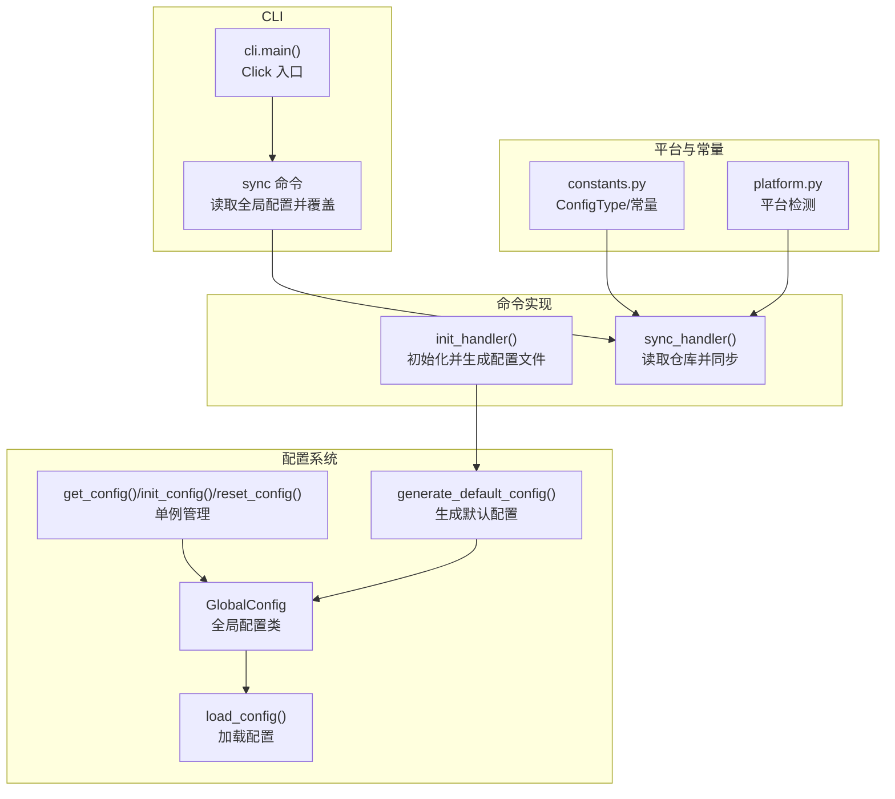
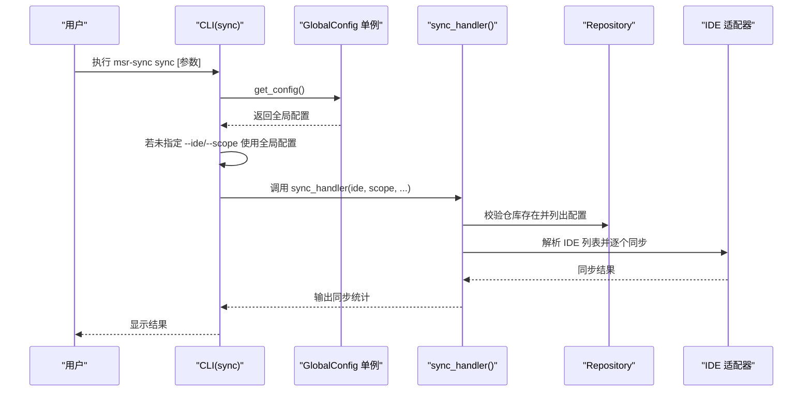
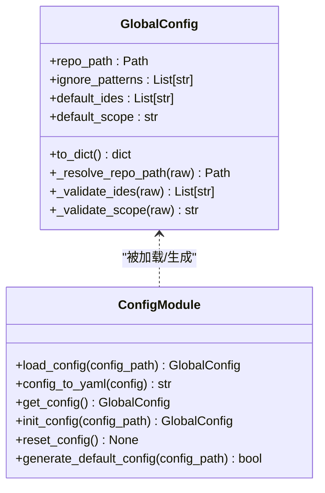
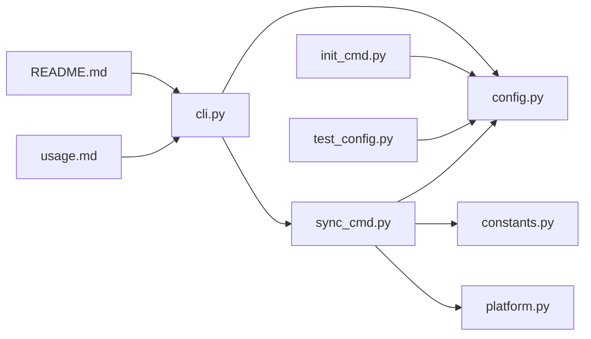

# 配置选项

<cite>
**本文引用的文件**
- [config.py](file://MSR-cli/msr_sync/core/config.py)
- [constants.py](file://MSR-cli/msr_sync/constants.py)
- [cli.py](file://MSR-cli/msr_sync/cli.py)
- [exceptions.py](file://MSR-cli/msr_sync/core/exceptions.py)
- [test_config.py](file://MSR-cli/tests/test_config.py)
- [README.md](file://MSR-cli/README.md)
- [usage.md](file://MSR-cli/docs/usage.md)
- [platform.py](file://MSR-cli/msr_sync/core/platform.py)
- [init_cmd.py](file://MSR-cli/msr_sync/commands/init_cmd.py)
- [sync_cmd.py](file://MSR-cli/msr_sync/commands/sync_cmd.py)
- [pyproject.toml](file://MSR-cli/pyproject.toml)
</cite>

## 目录
1. [简介](#简介)
2. [项目结构](#项目结构)
3. [核心组件](#核心组件)
4. [架构总览](#架构总览)
5. [详细组件分析](#详细组件分析)
6. [依赖关系分析](#依赖关系分析)
7. [性能考量](#性能考量)
8. [故障排查指南](#故障排查指南)
9. [结论](#结论)
10. [附录](#附录)

## 简介
本文件面向 MSR-v2 的配置系统，提供“MSR-sync”配置选项的权威 API 文档。内容涵盖：
- 全局配置项定义、默认值、可选值范围与约束
- 配置文件结构、生成与校验规则
- 命令行参数与配置文件的优先级关系
- 配置生命周期与持久化机制
- 动态更新与运行时行为
- 常见配置场景与最佳实践

## 项目结构
MSR-cli 的配置系统主要由以下模块组成：
- 全局配置加载与单例：负责从 YAML 文件加载、校验与缓存全局配置
- 命令行入口：定义 CLI 子命令与参数，读取全局配置并进行优先级覆盖
- 常量与平台：提供仓库目录常量、配置类型枚举、平台路径解析
- 命令实现：在执行命令时读取全局配置，结合命令行参数决定最终行为
- 测试与文档：提供配置行为的单元测试与使用文档

图表来源
- [config.py:91-159](file://MSR-cli/msr_sync/core/config.py#L91-L159)
- [cli.py:58-82](file://MSR-cli/msr_sync/cli.py#L58-L82)
- [init_cmd.py:32-38](file://MSR-cli/msr_sync/commands/init_cmd.py#L32-L38)
- [sync_cmd.py:26-131](file://MSR-cli/msr_sync/commands/sync_cmd.py#L26-L131)
- [constants.py:16-31](file://MSR-cli/msr_sync/constants.py#L16-L31)
- [platform.py:9-60](file://MSR-cli/msr_sync/core/platform.py#L9-L60)

章节来源
- [config.py:18-159](file://MSR-cli/msr_sync/core/config.py#L18-L159)
- [cli.py:8-116](file://MSR-cli/msr_sync/cli.py#L8-L116)
- [constants.py:16-50](file://MSR-cli/msr_sync/constants.py#L16-L50)
- [platform.py:9-60](file://MSR-cli/msr_sync/core/platform.py#L9-L60)

## 核心组件
- 全局配置类 GlobalConfig：封装 repo_path、ignore_patterns、default_ides、default_scope 四项配置，提供默认值、校验与序列化
- 配置加载函数 load_config：从 YAML 文件加载，处理空文件、语法错误、未知键等边界情况
- 单例管理：get_config、init_config、reset_config，支持启动时注入与测试重置
- 默认配置生成：generate_default_config，生成带中文注释的模板文件，不覆盖已有文件
- CLI 与命令实现：在 sync 命令中读取全局配置，并以命令行参数覆盖默认值

章节来源
- [config.py:18-159](file://MSR-cli/msr_sync/core/config.py#L18-L159)
- [cli.py:58-82](file://MSR-cli/msr_sync/cli.py#L58-L82)
- [init_cmd.py:32-38](file://MSR-cli/msr_sync/commands/init_cmd.py#L32-L38)
- [sync_cmd.py:26-131](file://MSR-cli/msr_sync/commands/sync_cmd.py#L26-L131)

## 架构总览
配置系统遵循“配置文件优先、命令行覆盖”的原则。命令执行流程如下：
- CLI 解析参数，读取全局配置单例
- 若命令行未指定，则使用全局配置中的默认值
- 执行具体命令逻辑（如同步），在运行时生效

图表来源
- [cli.py:58-82](file://MSR-cli/msr_sync/cli.py#L58-L82)
- [config.py:140-159](file://MSR-cli/msr_sync/core/config.py#L140-L159)
- [sync_cmd.py:26-131](file://MSR-cli/msr_sync/commands/sync_cmd.py#L26-L131)

## 详细组件分析

### 全局配置 GlobalConfig
- 配置项
  - repo_path：统一仓库根目录路径（支持 ~ 展开）
  - ignore_patterns：导入扫描时忽略的目录/文件模式列表
  - default_ides：默认同步目标 IDE 列表
  - default_scope：默认同步层级（global 或 project）
- 默认值与约束
  - repo_path：默认 ~/.msr-repos；空字符串或仅空白字符回退到默认值
  - ignore_patterns：默认包含 __MACOSX、.DS_Store、__pycache__、.git
  - default_ides：默认 ["all"]；包含无效值时过滤并输出警告，空列表回退到默认值
  - default_scope：默认 "global"；非 "global"/"project" 时回退并输出警告
- 序列化与反序列化
  - to_dict：导出为字典，便于测试与调试
  - config_to_yaml：将配置序列化为 YAML 字符串
- 加载与生成
  - load_config：从 YAML 文件加载；空文件或非字典返回默认配置；YAML 语法错误抛出配置文件错误
  - generate_default_config：生成带中文注释的模板文件；若已存在则不覆盖

图表来源
- [config.py:18-159](file://MSR-cli/msr_sync/core/config.py#L18-L159)

章节来源
- [config.py:18-159](file://MSR-cli/msr_sync/core/config.py#L18-L159)
- [test_config.py:40-190](file://MSR-cli/tests/test_config.py#L40-L190)
- [test_config.py:393-435](file://MSR-cli/tests/test_config.py#L393-L435)

### 配置文件结构与默认值
- 文件位置：~/.msr-sync/config.yaml
- 结构要点
  - repo_path：字符串；支持 ~ 展开
  - ignore_patterns：字符串列表；支持精确匹配与通配符匹配
  - default_ides：字符串列表；可选值 trae/qoder/lingma/codebuddy/all
  - default_scope：字符串；可选值 global/project
- 默认模板
  - 包含中文注释与示例，未注释的项生效；注释项使用默认值
  - 生成逻辑：不存在时创建，存在时不覆盖

章节来源
- [README.md:307-330](file://MSR-cli/README.md#L307-L330)
- [usage.md:407-433](file://MSR-cli/docs/usage.md#L407-L433)
- [config.py:161-204](file://MSR-cli/msr_sync/core/config.py#L161-L204)

### 命令行参数与优先级
- sync 命令参数
  - --ide：可多次指定，可选值 trae/qoder/lingma/codebuddy/all
  - --scope：可选值 project/global
  - --project-dir：项目目录路径（仅 scope=project 时生效）
  - --type：配置类型过滤 rules/skills/mcp
  - --name：配置名称过滤
  - --version：版本过滤（未指定时默认最新版本）
- 优先级规则
  - 命令行参数 > 配置文件值
  - 若命令行未指定，则使用全局配置中的 default_ides/default_scope
- CLI 与配置交互
  - CLI 读取全局配置单例
  - 未指定参数时回退到全局配置
  - 执行命令逻辑时以最终参数为准

章节来源
- [cli.py:58-82](file://MSR-cli/msr_sync/cli.py#L58-L82)
- [usage.md:214-222](file://MSR-cli/docs/usage.md#L214-L222)
- [README.md:343-344](file://MSR-cli/README.md#L343-L344)

### 配置校验与约束
- YAML 语法错误：抛出配置文件错误，包含文件路径
- 未知键：静默忽略，不影响其他配置项
- default_ides 无效值：过滤并输出警告，空列表或全无效回退到默认值 ["all"]
- default_scope 非法值：回退到默认值 "global" 并输出警告
- repo_path 空字符串：回退到默认值 "~/.msr-repos"
- ignore_patterns：支持精确匹配与通配符匹配，仅匹配文件名/目录名

章节来源
- [config.py:91-127](file://MSR-cli/msr_sync/core/config.py#L91-L127)
- [config.py:56-79](file://MSR-cli/msr_sync/core/config.py#L56-L79)
- [test_config.py:70-79](file://MSR-cli/tests/test_config.py#L70-L79)
- [test_config.py:133-148](file://MSR-cli/tests/test_config.py#L133-L148)
- [test_config.py:150-166](file://MSR-cli/tests/test_config.py#L150-L166)
- [usage.md:464-474](file://MSR-cli/docs/usage.md#L464-L474)

### 配置生命周期与持久化
- 生命周期
  - 初始化：执行 init 命令时生成默认配置文件（若不存在）
  - 加载：首次调用 get_config() 时从 YAML 文件加载
  - 注入：init_config() 可显式注入自定义配置路径
  - 重置：reset_config() 清除单例，便于测试
- 持久化
  - 配置文件位于 ~/.msr-sync/config.yaml
  - 修改后下次命令执行时自动生效，无需重启
  - generate_default_config() 不覆盖已有文件

章节来源
- [init_cmd.py:32-38](file://MSR-cli/msr_sync/commands/init_cmd.py#L32-L38)
- [config.py:140-159](file://MSR-cli/msr_sync/core/config.py#L140-L159)
- [config.py:187-204](file://MSR-cli/msr_sync/core/config.py#L187-L204)

### 动态更新与运行时行为
- 运行时读取：CLI 在执行命令前读取全局配置单例
- 命令行覆盖：未指定的参数使用全局配置值
- 版本默认行为：未指定 --version 时使用每个配置的最新版本
- 同步行为：按 IDE、scope、type、name、version 精确控制

章节来源
- [cli.py:63-79](file://MSR-cli/msr_sync/cli.py#L63-L79)
- [sync_cmd.py:100-131](file://MSR-cli/msr_sync/commands/sync_cmd.py#L100-L131)
- [usage.md:267-273](file://MSR-cli/docs/usage.md#L267-L273)

### 配置依赖关系
- CLI 依赖 GlobalConfig 单例
- sync 命令依赖 Repository 与 IDE 适配器
- 平台检测与路径解析由 platform 模块提供
- 常量模块提供配置类型与仓库目录常量

章节来源
- [cli.py:61-61](file://MSR-cli/msr_sync/cli.py#L61-L61)
- [sync_cmd.py:14-24](file://MSR-cli/msr_sync/commands/sync_cmd.py#L14-L24)
- [constants.py:16-31](file://MSR-cli/msr_sync/constants.py#L16-L31)
- [platform.py:12-30](file://MSR-cli/msr_sync/core/platform.py#L12-L30)

## 依赖关系分析

图表来源
- [cli.py:8-116](file://MSR-cli/msr_sync/cli.py#L8-L116)
- [config.py:18-159](file://MSR-cli/msr_sync/core/config.py#L18-L159)
- [sync_cmd.py:26-131](file://MSR-cli/msr_sync/commands/sync_cmd.py#L26-L131)
- [init_cmd.py:13-42](file://MSR-cli/msr_sync/commands/init_cmd.py#L13-L42)
- [test_config.py:6-21](file://MSR-cli/tests/test_config.py#L6-L21)
- [constants.py:16-31](file://MSR-cli/msr_sync/constants.py#L16-L31)
- [platform.py:9-60](file://MSR-cli/msr_sync/core/platform.py#L9-L60)
- [README.md:1-361](file://MSR-cli/README.md#L1-L361)
- [usage.md:1-759](file://MSR-cli/docs/usage.md#L1-L759)

章节来源
- [pyproject.toml:18-21](file://MSR-cli/pyproject.toml#L18-L21)
- [cli.py:8-116](file://MSR-cli/msr_sync/cli.py#L8-L116)
- [config.py:18-159](file://MSR-cli/msr_sync/core/config.py#L18-L159)

## 性能考量
- 配置加载为一次性 IO 操作，建议通过单例避免重复读取
- ignore_patterns 仅影响导入扫描阶段，对同步阶段无直接影响
- 建议在大规模导入时适当调整 ignore_patterns，减少不必要的扫描

## 故障排查指南
- 配置文件 YAML 语法错误：检查缩进、冒号与引号；可删除后重新生成默认配置
- 无效 IDE 名称：确认 default_ides 中的值为 trae/qoder/lingma/codebuddy/all
- default_scope 非法：改为 global 或 project
- 仓库未初始化：先执行 init 命令
- 权限不足：检查目标路径写入权限
- MCP 配置格式错误：确保 mcp.json 为合法 JSON

章节来源
- [usage.md:634-759](file://MSR-cli/docs/usage.md#L634-L759)
- [exceptions.py:28-34](file://MSR-cli/msr_sync/core/exceptions.py#L28-L34)

## 结论
MSR-cli 的配置系统以简洁、稳健为核心设计目标：通过 YAML 模板化的全局配置文件、严格的校验与回退策略、以及明确的命令行优先级，实现了易用与可维护性的平衡。配合 CLI 的单例配置读取与命令行覆盖机制，用户可以在不同场景下灵活地定制同步行为。

## 附录

### 配置项一览表
- repo_path
  - 类型：字符串
  - 默认值：~/.msr-repos
  - 说明：统一仓库根目录路径，支持 ~ 展开
- ignore_patterns
  - 类型：字符串列表
  - 默认值：[__MACOSX, .DS_Store, __pycache__, .git]
  - 说明：导入扫描时忽略的目录/文件模式；支持精确匹配与通配符匹配
- default_ides
  - 类型：字符串列表
  - 默认值：["all"]
  - 说明：sync 命令未指定 --ide 时的默认目标 IDE
- default_scope
  - 类型：字符串
  - 默认值："global"
  - 说明：sync 命令未指定 --scope 时的默认同步层级

章节来源
- [README.md:332-337](file://MSR-cli/README.md#L332-L337)
- [usage.md:437-442](file://MSR-cli/docs/usage.md#L437-L442)

### 常见配置场景
- 仅同步到 Trae 与 CodeBuddy：在 default_ides 中设置 ["trae","codebuddy"]
- 项目级同步：使用 --scope project 或在 default_scope 中设置 "project"
- 自定义忽略模式：在 ignore_patterns 中添加通配符或精确匹配项
- 从压缩包批量导入：先 import，再 sync

章节来源
- [usage.md:525-631](file://MSR-cli/docs/usage.md#L525-L631)