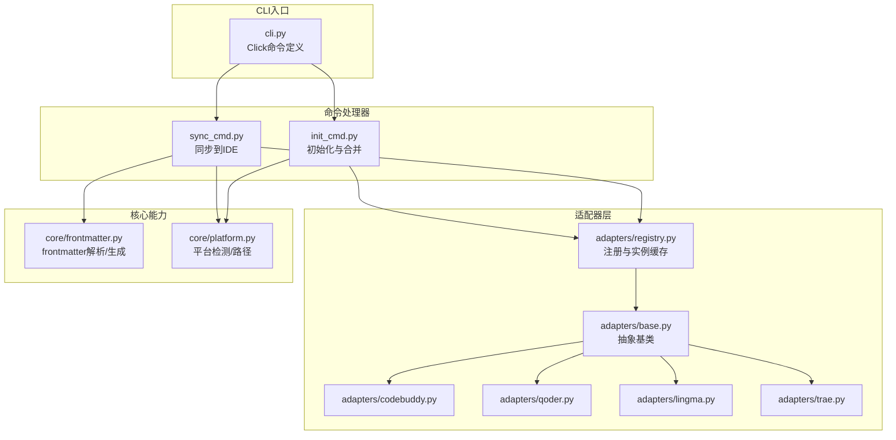
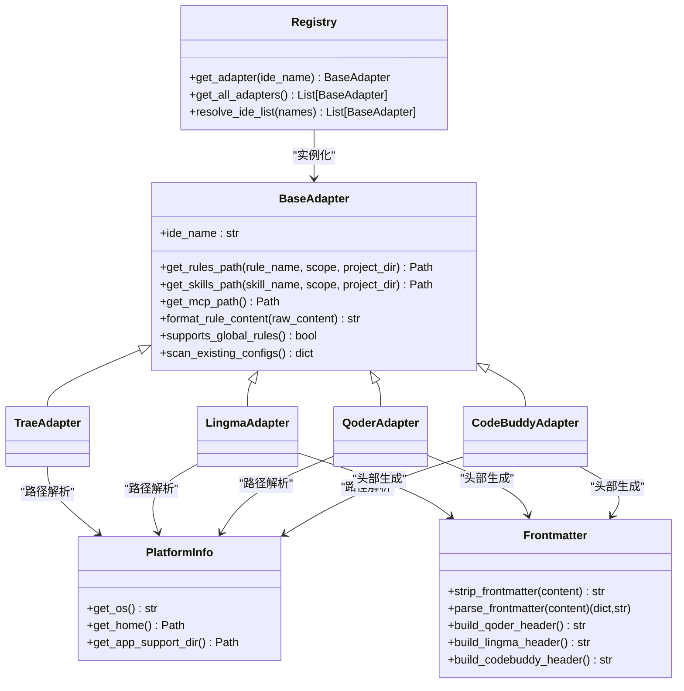
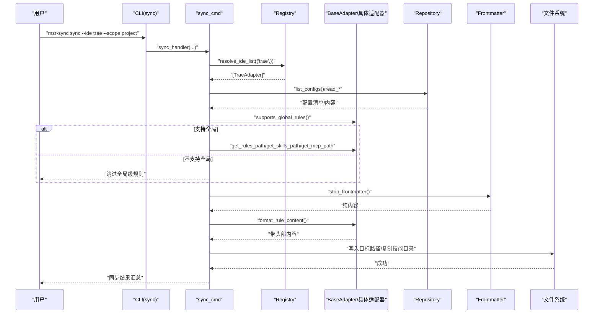
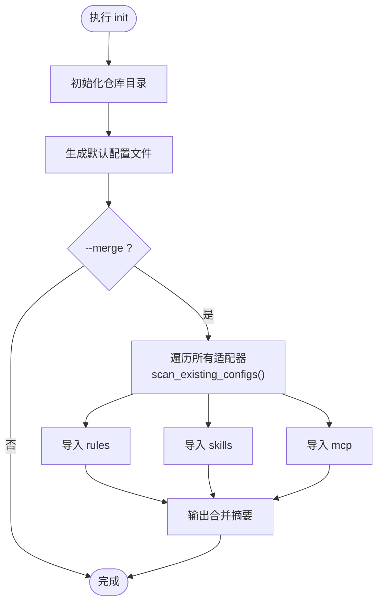
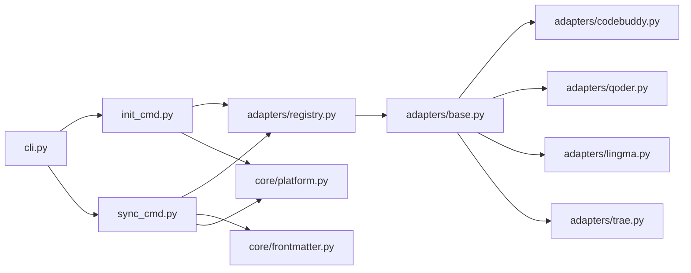
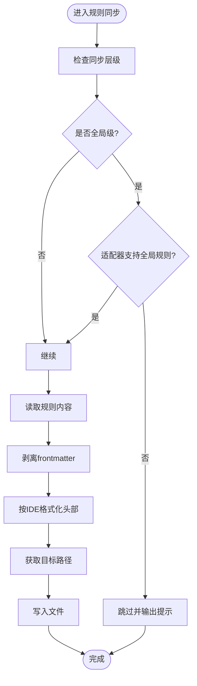
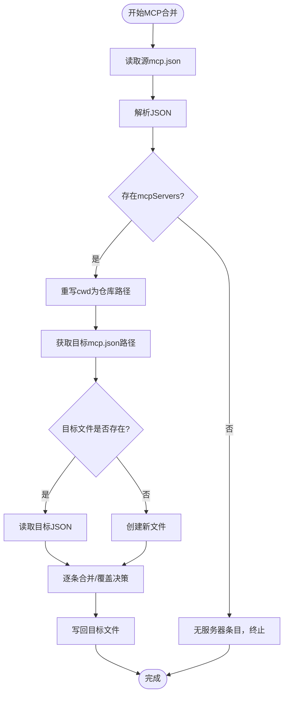

# IDE适配器

<cite>
**本文引用的文件**
- [MSR-cli/msr_sync/adapters/base.py](file://MSR-cli/msr_sync/adapters/base.py)
- [MSR-cli/msr_sync/adapters/registry.py](file://MSR-cli/msr_sync/adapters/registry.py)
- [MSR-cli/msr_sync/adapters/codebuddy.py](file://MSR-cli/msr_sync/adapters/codebuddy.py)
- [MSR-cli/msr_sync/adapters/qoder.py](file://MSR-cli/msr_sync/adapters/qoder.py)
- [MSR-cli/msr_sync/adapters/lingma.py](file://MSR-cli/msr_sync/adapters/lingma.py)
- [MSR-cli/msr_sync/adapters/trae.py](file://MSR-cli/msr_sync/adapters/trae.py)
- [MSR-cli/msr_sync/core/platform.py](file://MSR-cli/msr_sync/core/platform.py)
- [MSR-cli/msr_sync/core/frontmatter.py](file://MSR-cli/msr_sync/core/frontmatter.py)
- [MSR-cli/msr_sync/commands/sync_cmd.py](file://MSR-cli/msr_sync/commands/sync_cmd.py)
- [MSR-cli/msr_sync/commands/init_cmd.py](file://MSR-cli/msr_sync/commands/init_cmd.py)
- [MSR-cli/msr_sync/cli.py](file://MSR-cli/msr_sync/cli.py)
- [MSR-cli/tests/test_adapters.py](file://MSR-cli/tests/test_adapters.py)
- [MSR-cli/pyproject.toml](file://MSR-cli/pyproject.toml)
</cite>

## 目录
1. [简介](#简介)
2. [项目结构](#项目结构)
3. [核心组件](#核心组件)
4. [架构总览](#架构总览)
5. [详细组件分析](#详细组件分析)
6. [依赖分析](#依赖分析)
7. [性能考虑](#性能考虑)
8. [故障排查指南](#故障排查指南)
9. [结论](#结论)
10. [附录](#附录)

## 简介
本文件面向开发者与使用者，系统化阐述“IDE适配器”体系的设计与实现，涵盖适配器架构、适配器模式的应用、四个具体适配器（CodeBuddy、Qoder、Lingma、Trae）的差异化处理机制、注册与管理机制、扩展新IDE支持的方法、跨平台适配的挑战与方案，以及开发与定制的最佳实践。文档同时提供关键流程的时序图与类图，帮助读者快速把握系统全貌。

## 项目结构
MSR-sync 的 CLI 子系统围绕“统一仓库 + 适配器”的架构组织，核心目录与职责如下：
- msr_sync/adapters：适配器抽象与具体实现，以及注册表
- msr_sync/core：平台检测、frontmatter解析/生成、仓库访问等通用能力
- msr_sync/commands：CLI 命令处理器（init、sync、list、remove、import）
- tests：对适配器行为与跨适配器一致性的端到端与属性测试
- pyproject.toml：项目元数据与依赖声明

图表来源
- [MSR-cli/msr_sync/cli.py:1-116](file://MSR-cli/msr_sync/cli.py#L1-L116)
- [MSR-cli/msr_sync/commands/init_cmd.py:1-137](file://MSR-cli/msr_sync/commands/init_cmd.py#L1-L137)
- [MSR-cli/msr_sync/commands/sync_cmd.py:1-411](file://MSR-cli/msr_sync/commands/sync_cmd.py#L1-L411)
- [MSR-cli/msr_sync/adapters/base.py:1-105](file://MSR-cli/msr_sync/adapters/base.py#L1-L105)
- [MSR-cli/msr_sync/adapters/registry.py:1-88](file://MSR-cli/msr_sync/adapters/registry.py#L1-L88)
- [MSR-cli/msr_sync/adapters/codebuddy.py:1-143](file://MSR-cli/msr_sync/adapters/codebuddy.py#L1-L143)
- [MSR-cli/msr_sync/adapters/qoder.py:1-140](file://MSR-cli/msr_sync/adapters/qoder.py#L1-L140)
- [MSR-cli/msr_sync/adapters/lingma.py:1-140](file://MSR-cli/msr_sync/adapters/lingma.py#L1-L140)
- [MSR-cli/msr_sync/adapters/trae.py:1-138](file://MSR-cli/msr_sync/adapters/trae.py#L1-L138)
- [MSR-cli/msr_sync/core/frontmatter.py:1-145](file://MSR-cli/msr_sync/core/frontmatter.py#L1-L145)
- [MSR-cli/msr_sync/core/platform.py:1-60](file://MSR-cli/msr_sync/core/platform.py#L1-L60)

章节来源
- [MSR-cli/msr_sync/cli.py:1-116](file://MSR-cli/msr_sync/cli.py#L1-L116)
- [MSR-cli/msr_sync/commands/init_cmd.py:1-137](file://MSR-cli/msr_sync/commands/init_cmd.py#L1-L137)
- [MSR-cli/msr_sync/commands/sync_cmd.py:1-411](file://MSR-cli/msr_sync/commands/sync_cmd.py#L1-L411)
- [MSR-cli/msr_sync/adapters/base.py:1-105](file://MSR-cli/msr_sync/adapters/base.py#L1-L105)
- [MSR-cli/msr_sync/adapters/registry.py:1-88](file://MSR-cli/msr_sync/adapters/registry.py#L1-L88)
- [MSR-cli/msr_sync/core/platform.py:1-60](file://MSR-cli/msr_sync/core/platform.py#L1-L60)
- [MSR-cli/msr_sync/core/frontmatter.py:1-145](file://MSR-cli/msr_sync/core/frontmatter.py#L1-L145)

## 核心组件
- 适配器抽象基类 BaseAdapter：定义统一接口，包括路径解析、格式转换、能力查询、配置扫描等，确保不同IDE的一致行为契约。
- 注册表 Registry：集中管理适配器类的延迟加载与实例缓存，支持按名称解析与“all”展开。
- 具体适配器：CodeBuddy、Qoder、Lingma、Trae，分别实现各自的路径约定、格式头部、能力与扫描策略。
- 平台能力 PlatformInfo：提供跨平台的用户主目录、应用数据目录等路径解析。
- frontmatter工具：剥离/解析/生成YAML frontmatter，支撑规则内容的统一与IDE特定头部注入。
- 命令处理器：init 与 sync 的业务编排，驱动仓库与适配器交互。

章节来源
- [MSR-cli/msr_sync/adapters/base.py:8-105](file://MSR-cli/msr_sync/adapters/base.py#L8-L105)
- [MSR-cli/msr_sync/adapters/registry.py:8-88](file://MSR-cli/msr_sync/adapters/registry.py#L8-L88)
- [MSR-cli/msr_sync/core/platform.py:9-60](file://MSR-cli/msr_sync/core/platform.py#L9-L60)
- [MSR-cli/msr_sync/core/frontmatter.py:10-145](file://MSR-cli/msr_sync/core/frontmatter.py#L10-L145)

## 架构总览
适配器模式在此处体现为“同一抽象 + 多种实现”，通过统一接口屏蔽IDE差异，使上层命令处理器无需关心具体IDE细节。注册表负责生命周期管理与延迟加载，避免不必要的模块导入；平台与frontmatter模块提供跨平台与内容处理的基础设施。

图表来源
- [MSR-cli/msr_sync/adapters/base.py:8-105](file://MSR-cli/msr_sync/adapters/base.py#L8-L105)
- [MSR-cli/msr_sync/adapters/codebuddy.py:22-143](file://MSR-cli/msr_sync/adapters/codebuddy.py#L22-L143)
- [MSR-cli/msr_sync/adapters/qoder.py:22-140](file://MSR-cli/msr_sync/adapters/qoder.py#L22-L140)
- [MSR-cli/msr_sync/adapters/lingma.py:22-140](file://MSR-cli/msr_sync/adapters/lingma.py#L22-L140)
- [MSR-cli/msr_sync/adapters/trae.py:21-138](file://MSR-cli/msr_sync/adapters/trae.py#L21-L138)
- [MSR-cli/msr_sync/adapters/registry.py:45-88](file://MSR-cli/msr_sync/adapters/registry.py#L45-L88)
- [MSR-cli/msr_sync/core/platform.py:9-60](file://MSR-cli/msr_sync/core/platform.py#L9-L60)
- [MSR-cli/msr_sync/core/frontmatter.py:110-145](file://MSR-cli/msr_sync/core/frontmatter.py#L110-L145)

## 详细组件分析

### 适配器抽象与注册表
- BaseAdapter 定义统一接口，包括：
  - 路径解析：rules/skills/mcp 的目标路径计算
  - 格式转换：剥离统一仓库中的frontmatter后，按IDE需要添加特定头部
  - 能力查询：supports_global_rules 控制全局级rules支持
  - 配置扫描：scan_existing_configs 用于 init --merge
- Registry 提供：
  - 延迟加载：按需导入模块，避免启动时的开销
  - 实例缓存：避免重复构造
  - resolve_ide_list：支持“all”展开与去重

章节来源
- [MSR-cli/msr_sync/adapters/base.py:8-105](file://MSR-cli/msr_sync/adapters/base.py#L8-L105)
- [MSR-cli/msr_sync/adapters/registry.py:8-88](file://MSR-cli/msr_sync/adapters/registry.py#L8-L88)

### CodeBuddy 适配器
- 能力与路径
  - 支持全局级 rules（唯一支持）
  - 路径约定：项目级与用户级 rules/skills 均位于 .codebuddy 目录
  - MCP 路径在 macOS/Windows 统一为用户主目录下的 .codebuddy/mcp.json
- 格式转换
  - 为规则内容添加 CodeBuddy 特定的 frontmatter 模板（含时间戳）
- 配置扫描
  - 扫描用户级 rules、skills 与 MCP 文件

章节来源
- [MSR-cli/msr_sync/adapters/codebuddy.py:1-143](file://MSR-cli/msr_sync/adapters/codebuddy.py#L1-L143)
- [MSR-cli/msr_sync/core/frontmatter.py:128-145](file://MSR-cli/msr_sync/core/frontmatter.py#L128-L145)

### Qoder 适配器
- 能力与路径
  - 不支持全局级 rules
  - 路径约定：项目级 rules/skills 位于 .qoder；用户级 skills 位于 .qoder；MCP 位于 Application Support/Qoder/SharedClientCache/mcp.json
- 格式转换
  - 为规则内容添加 Qoder 的 trigger: always_on 头部
- 配置扫描
  - 扫描用户级 skills 与 MCP 文件（平台不支持时忽略异常）

章节来源
- [MSR-cli/msr_sync/adapters/qoder.py:1-140](file://MSR-cli/msr_sync/adapters/qoder.py#L1-L140)
- [MSR-cli/msr_sync/core/frontmatter.py:110-117](file://MSR-cli/msr_sync/core/frontmatter.py#L110-L117)

### Lingma 适配器
- 能力与路径
  - 不支持全局级 rules
  - 路径约定：项目级 rules/skills 位于 .lingma；用户级 skills 位于 .lingma；MCP 位于 Application Support/Lingma/SharedClientCache/mcp.json
- 格式转换
  - 为规则内容添加 Lingma 的 trigger: always_on 头部
- 配置扫描
  - 扫描用户级 skills 与 MCP 文件（平台不支持时忽略异常）

章节来源
- [MSR-cli/msr_sync/adapters/lingma.py:1-140](file://MSR-cli/msr_sync/adapters/lingma.py#L1-L140)
- [MSR-cli/msr_sync/core/frontmatter.py:119-126](file://MSR-cli/msr_sync/core/frontmatter.py#L119-L126)

### Trae 适配器
- 能力与路径
  - 不支持全局级 rules
  - 路径约定：项目级 rules/skills 位于 .trae；用户级 skills 位于 .trae-cn（注意区别于 .trae）
  - MCP 位于 Application Support/Trae CN/User/mcp.json
- 格式转换
  - 不添加额外头部，直接返回原始内容
- 配置扫描
  - 扫描用户级 skills（.trae-cn）与 MCP 文件（平台不支持时忽略异常）

章节来源
- [MSR-cli/msr_sync/adapters/trae.py:1-138](file://MSR-cli/msr_sync/adapters/trae.py#L1-L138)

### 同步流程（sync 命令）
- 输入参数：--ide、--scope、--project-dir、--type、--name、--version
- 流程要点：
  - 解析目标 IDE 列表（支持“all”）
  - 读取统一仓库配置清单，按类型/名称/版本过滤
  - 对每条配置：
    - 规则：剥离frontmatter，按IDE头部模板格式化，写入目标路径
    - 技能：复制目录，冲突时询问覆盖
    - MCP：读取源 mcp.json，合并到目标 mcp.json，冲突时询问覆盖
  - 全局级规则同步前检查 supports_global_rules，不支持则跳过

图表来源
- [MSR-cli/msr_sync/cli.py:58-82](file://MSR-cli/msr_sync/cli.py#L58-L82)
- [MSR-cli/msr_sync/commands/sync_cmd.py:26-131](file://MSR-cli/msr_sync/commands/sync_cmd.py#L26-L131)
- [MSR-cli/msr_sync/adapters/registry.py:74-88](file://MSR-cli/msr_sync/adapters/registry.py#L74-L88)
- [MSR-cli/msr_sync/core/frontmatter.py:10-24](file://MSR-cli/msr_sync/core/frontmatter.py#L10-L24)

章节来源
- [MSR-cli/msr_sync/commands/sync_cmd.py:26-411](file://MSR-cli/msr_sync/commands/sync_cmd.py#L26-L411)
- [MSR-cli/msr_sync/cli.py:58-82](file://MSR-cli/msr_sync/cli.py#L58-L82)

### 初始化与合并（init 命令）
- 初始化统一仓库目录结构与默认配置
- 当启用 --merge 时：
  - 遍历所有适配器，调用其 scan_existing_configs
  - 读取现有规则/技能/MCP，导入到统一仓库
  - 输出合并摘要

图表来源
- [MSR-cli/msr_sync/commands/init_cmd.py:13-137](file://MSR-cli/msr_sync/commands/init_cmd.py#L13-L137)
- [MSR-cli/msr_sync/adapters/registry.py:65-72](file://MSR-cli/msr_sync/adapters/registry.py#L65-L72)

章节来源
- [MSR-cli/msr_sync/commands/init_cmd.py:13-137](file://MSR-cli/msr_sync/commands/init_cmd.py#L13-L137)

### 跨平台适配的挑战与方案
- 挑战
  - 不同操作系统下用户主目录、应用数据目录不同
  - 不同IDE的 MCP 路径差异（macOS vs Windows）
  - 全局级 rules 支持的差异（CodeBuddy 支持，其余不支持）
- 方案
  - 使用 PlatformInfo 统一获取用户主目录与应用数据目录
  - 在适配器内部封装 IDE 特定路径，对外暴露统一接口
  - 在同步前检查 supports_global_rules，避免无效操作

章节来源
- [MSR-cli/msr_sync/core/platform.py:9-60](file://MSR-cli/msr_sync/core/platform.py#L9-L60)
- [MSR-cli/msr_sync/adapters/codebuddy.py:69-78](file://MSR-cli/msr_sync/adapters/codebuddy.py#L69-L78)
- [MSR-cli/msr_sync/adapters/qoder.py:70-80](file://MSR-cli/msr_sync/adapters/qoder.py#L70-L80)
- [MSR-cli/msr_sync/adapters/lingma.py:70-80](file://MSR-cli/msr_sync/adapters/lingma.py#L70-L80)
- [MSR-cli/msr_sync/adapters/trae.py:71-81](file://MSR-cli/msr_sync/adapters/trae.py#L71-L81)

## 依赖分析
- 模块耦合
  - 命令处理器依赖注册表与仓库访问，间接依赖适配器与frontmatter
  - 适配器依赖平台能力与frontmatter工具
  - 注册表仅依赖适配器模块路径映射，保持低耦合
- 外部依赖
  - Click：命令行框架
  - PyYAML：frontmatter解析（在frontmatter模块中使用）
- 循环依赖
  - 未见循环依赖迹象，模块职责清晰

图表来源
- [MSR-cli/msr_sync/cli.py:1-116](file://MSR-cli/msr_sync/cli.py#L1-L116)
- [MSR-cli/msr_sync/commands/init_cmd.py:1-137](file://MSR-cli/msr_sync/commands/init_cmd.py#L1-L137)
- [MSR-cli/msr_sync/commands/sync_cmd.py:1-411](file://MSR-cli/msr_sync/commands/sync_cmd.py#L1-L411)
- [MSR-cli/msr_sync/adapters/registry.py:1-88](file://MSR-cli/msr_sync/adapters/registry.py#L1-L88)
- [MSR-cli/msr_sync/core/frontmatter.py:1-145](file://MSR-cli/msr_sync/core/frontmatter.py#L1-L145)
- [MSR-cli/msr_sync/core/platform.py:1-60](file://MSR-cli/msr_sync/core/platform.py#L1-L60)

章节来源
- [MSR-cli/msr_sync/commands/sync_cmd.py:14-24](file://MSR-cli/msr_sync/commands/sync_cmd.py#L14-L24)
- [MSR-cli/msr_sync/commands/init_cmd.py:9-11](file://MSR-cli/msr_sync/commands/init_cmd.py#L9-L11)
- [MSR-cli/msr_sync/adapters/registry.py:1-88](file://MSR-cli/msr_sync/adapters/registry.py#L1-L88)
- [MSR-cli/pyproject.toml:18-27](file://MSR-cli/pyproject.toml#L18-L27)

## 性能考虑
- 延迟加载与实例缓存：注册表对适配器类采用延迟加载与实例缓存，减少启动与运行时开销
- 路径解析与文件I/O：规则写入与技能复制为常见操作，建议批量处理与并发控制（当前实现为顺序处理，可作为后续优化方向）
- frontmatter解析：解析与剥离frontmatter为O(n)线性复杂度，影响主要取决于内容长度
- MCP 合并：JSON读取与合并为O(m)（m为服务器条目数），冲突确认为交互式阻塞

[本节为一般性讨论，不直接分析具体文件]

## 故障排查指南
- 不支持的 IDE 名称
  - 现象：resolve_ide_list 抛出 ValueError
  - 排查：确认 IDE 名称拼写与注册表键一致
- 平台不支持
  - 现象：PlatformInfo.get_os 抛出 UnsupportedPlatformError
  - 排查：当前系统为 macOS 或 Windows，否则需扩展平台支持
- MCP 配置格式错误
  - 现象：ConfigParseError
  - 排查：检查 mcp.json 的 JSON 结构与字段
- 全局级 rules 同步被跳过
  - 现象：日志提示某 IDE 不支持全局级 rules
  - 排查：调用 supports_global_rules() 并仅在支持的 IDE 上进行全局同步

章节来源
- [MSR-cli/msr_sync/adapters/registry.py:34-36](file://MSR-cli/msr_sync/adapters/registry.py#L34-L36)
- [MSR-cli/msr_sync/core/platform.py:28-30](file://MSR-cli/msr_sync/core/platform.py#L28-L30)
- [MSR-cli/msr_sync/commands/sync_cmd.py:270-271](file://MSR-cli/msr_sync/commands/sync_cmd.py#L270-L271)
- [MSR-cli/msr_sync/commands/sync_cmd.py:205-207](file://MSR-cli/msr_sync/commands/sync_cmd.py#L205-L207)

## 结论
本系统通过适配器模式与注册表机制，实现了对多款AI IDE的统一管理。四个适配器在路径约定、格式头部、能力查询与配置扫描方面各有差异，但共享同一抽象接口，保证了上层命令处理器的简洁与稳定。平台与frontmatter模块提供了跨平台与内容处理的基础能力。未来扩展新IDE时，只需遵循BaseAdapter接口，实现路径解析、格式转换、能力查询与扫描方法，并在注册表中登记即可。

[本节为总结性内容，不直接分析具体文件]

## 附录

### 扩展新IDE支持指南
- 实现步骤
  - 新建适配器文件：在 adapters 目录下新增 myide.py，继承 BaseAdapter
  - 实现接口：
    - ide_name：返回IDE标识名称
    - get_rules_path / get_skills_path / get_mcp_path：按IDE约定返回目标路径
    - format_rule_content：按IDE需要添加头部或返回原始内容
    - supports_global_rules：声明是否支持全局级 rules
    - scan_existing_configs：扫描用户级配置并返回结构化字典
  - 在注册表中登记：在 registry.py 的 _ADAPTER_REGISTRY 中添加映射
  - 编写测试：参考 tests/test_adapters.py 的模式，补充路径解析、格式转换、能力查询与扫描的单元测试
- 最佳实践
  - 严格遵守 BaseAdapter 接口契约，避免在适配器内引入上层业务逻辑
  - 使用 PlatformInfo 统一处理平台差异
  - 在 format_rule_content 中保持幂等性，避免重复添加头部
  - 在 scan_existing_configs 中对平台不支持的情况进行异常捕获与降级处理

章节来源
- [MSR-cli/msr_sync/adapters/base.py:18-105](file://MSR-cli/msr_sync/adapters/base.py#L18-L105)
- [MSR-cli/msr_sync/adapters/registry.py:10-15](file://MSR-cli/msr_sync/adapters/registry.py#L10-L15)
- [MSR-cli/tests/test_adapters.py:187-256](file://MSR-cli/tests/test_adapters.py#L187-L256)

### 关键流程与算法可视化

#### 规则同步流程（规则内容剥离与格式化）

图表来源
- [MSR-cli/msr_sync/commands/sync_cmd.py:179-231](file://MSR-cli/msr_sync/commands/sync_cmd.py#L179-L231)
- [MSR-cli/msr_sync/core/frontmatter.py:10-24](file://MSR-cli/msr_sync/core/frontmatter.py#L10-L24)

#### MCP 合并流程（源/目标读取、冲突处理、写回）

图表来源
- [MSR-cli/msr_sync/commands/sync_cmd.py:238-350](file://MSR-cli/msr_sync/commands/sync_cmd.py#L238-L350)