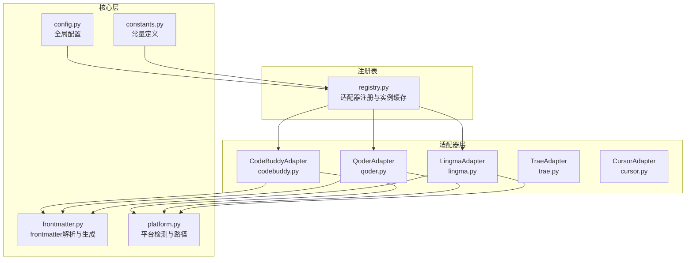
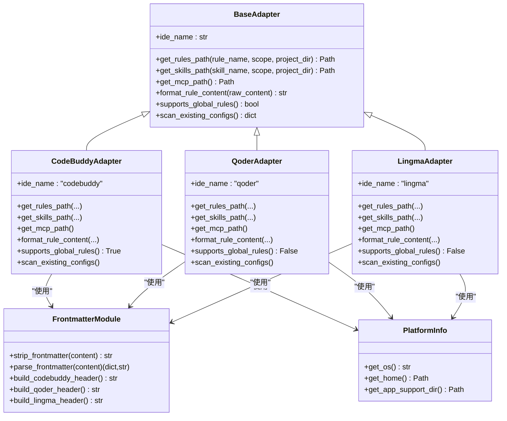
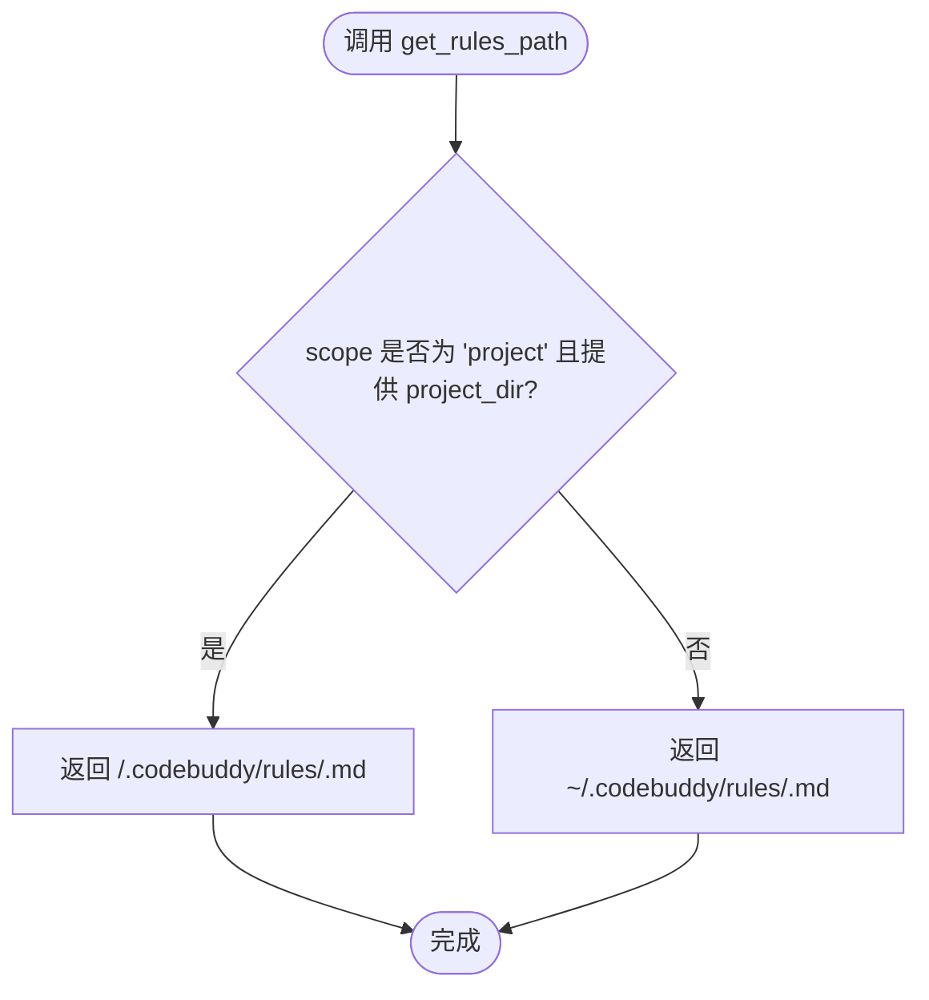
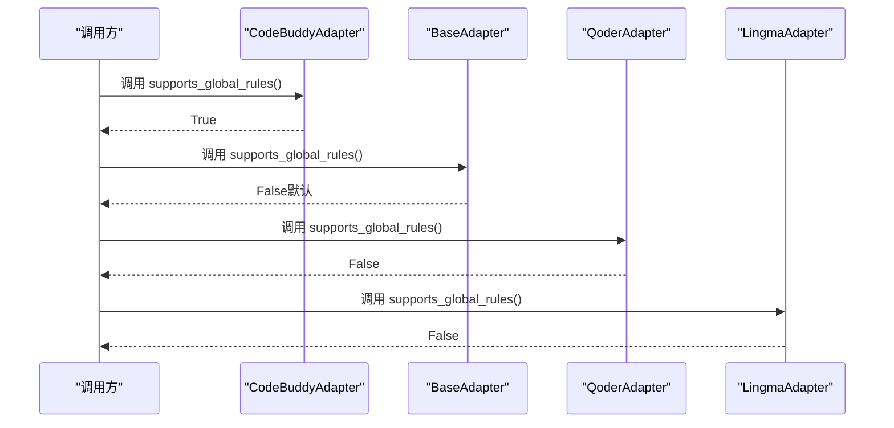
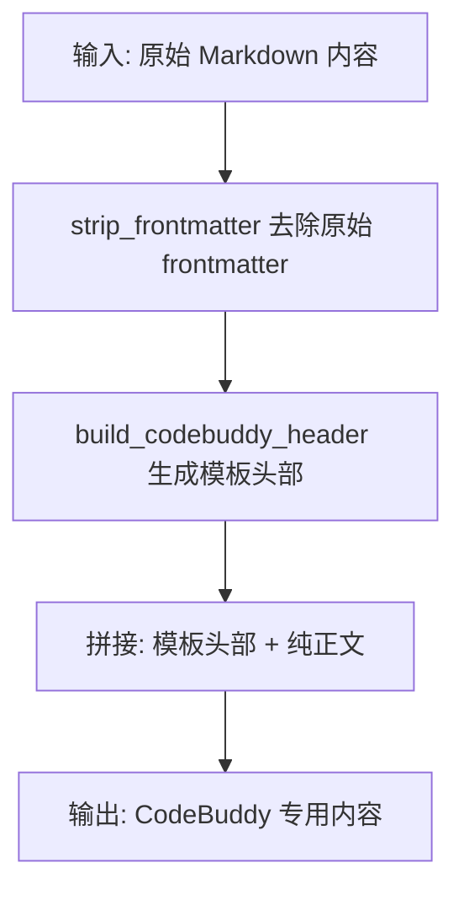
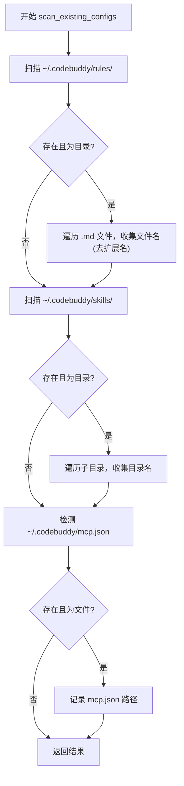
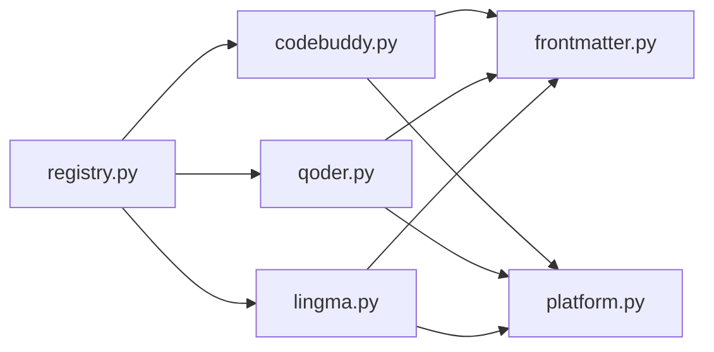

# CodeBuddy适配器

<cite>
**本文引用的文件**
- [codebuddy.py](file://MSR-cli/msr_sync/adapters/codebuddy.py)
- [base.py](file://MSR-cli/msr_sync/adapters/base.py)
- [frontmatter.py](file://MSR-cli/msr_sync/core/frontmatter.py)
- [platform.py](file://MSR-cli/msr_sync/core/platform.py)
- [constants.py](file://MSR-cli/msr_sync/constants.py)
- [config.py](file://MSR-cli/msr_sync/core/config.py)
- [registry.py](file://MSR-cli/msr_sync/adapters/registry.py)
- [qoder.py](file://MSR-cli/msr_sync/adapters/qoder.py)
- [lingma.py](file://MSR-cli/msr_sync/adapters/lingma.py)
- [test_codebuddy_adapter.py](file://MSR-cli/tests/test_codebuddy_adapter.py)
- [test_frontmatter.py](file://MSR-cli/tests/test_frontmatter.py)
</cite>

## 目录
1. [简介](#简介)
2. [项目结构](#项目结构)
3. [核心组件](#核心组件)
4. [架构总览](#架构总览)
5. [详细组件分析](#详细组件分析)
6. [依赖关系分析](#依赖关系分析)
7. [性能考量](#性能考量)
8. [故障排查指南](#故障排查指南)
9. [结论](#结论)
10. [附录](#附录)

## 简介
本文件面向MSR-sync中的CodeBuddy适配器，系统性阐述其独特实现与设计要点，重点包括：
- CodeBuddy支持“全局级rules”的能力及其与其他适配器的根本差异
- 路径解析策略：项目级与用户级rules/skills的不同处理方式
- MCP配置文件的跨平台统一路径处理
- 格式转换机制：build_codebuddy_header函数的作用与frontmatter模板结构
- 如何扫描现有配置：识别与提取已存在的CodeBuddy配置
- 具体的代码示例路径，展示如何处理CodeBuddy特有的配置格式（Markdown frontmatter与JSON配置）

## 项目结构
MSR-cli采用分层与模块化的组织方式：
- 适配器层：各IDE适配器实现统一接口，负责路径解析、格式转换、能力查询与配置扫描
- 核心层：frontmatter解析与生成、平台信息、全局配置、常量定义
- 注册表：集中管理适配器实例与懒加载
- 测试层：覆盖适配器行为、frontmatter解析与转换、路径解析与扫描

图表来源
- [codebuddy.py:1-143](file://MSR-cli/msr_sync/adapters/codebuddy.py#L1-L143)
- [qoder.py:1-140](file://MSR-cli/msr_sync/adapters/qoder.py#L1-L140)
- [lingma.py:1-140](file://MSR-cli/msr_sync/adapters/lingma.py#L1-L140)
- [frontmatter.py:1-164](file://MSR-cli/msr_sync/core/frontmatter.py#L1-L164)
- [platform.py:1-60](file://MSR-cli/msr_sync/core/platform.py#L1-L60)
- [config.py:1-204](file://MSR-cli/msr_sync/core/config.py#L1-L204)
- [constants.py:1-50](file://MSR-cli/msr_sync/constants.py#L1-L50)
- [registry.py:1-89](file://MSR-cli/msr_sync/adapters/registry.py#L1-L89)

章节来源
- [codebuddy.py:1-143](file://MSR-cli/msr_sync/adapters/codebuddy.py#L1-L143)
- [base.py:1-105](file://MSR-cli/msr_sync/adapters/base.py#L1-L105)
- [frontmatter.py:1-164](file://MSR-cli/msr_sync/core/frontmatter.py#L1-L164)
- [platform.py:1-60](file://MSR-cli/msr_sync/core/platform.py#L1-L60)
- [constants.py:1-50](file://MSR-cli/msr_sync/constants.py#L1-L50)
- [config.py:1-204](file://MSR-cli/msr_sync/core/config.py#L1-L204)
- [registry.py:1-89](file://MSR-cli/msr_sync/adapters/registry.py#L1-L89)

## 核心组件
- CodeBuddyAdapter：实现BaseAdapter接口，提供CodeBuddy特有路径解析、格式转换、能力查询与配置扫描
- BaseAdapter：抽象基类，定义统一接口与默认行为（如supports_global_rules默认返回False）
- frontmatter模块：提供strip_frontmatter、parse_frontmatter与build_codebuddy_header等函数
- platform模块：封装平台检测与用户主目录、应用数据目录的获取
- constants与config：定义常量、默认配置与全局配置加载逻辑
- registry：集中管理适配器实例，支持懒加载与缓存

章节来源
- [codebuddy.py:22-143](file://MSR-cli/msr_sync/adapters/codebuddy.py#L22-L143)
- [base.py:8-105](file://MSR-cli/msr_sync/adapters/base.py#L8-L105)
- [frontmatter.py:10-164](file://MSR-cli/msr_sync/core/frontmatter.py#L10-L164)
- [platform.py:9-60](file://MSR-cli/msr_sync/core/platform.py#L9-L60)
- [constants.py:16-50](file://MSR-cli/msr_sync/constants.py#L16-L50)
- [config.py:18-204](file://MSR-cli/msr_sync/core/config.py#L18-L204)
- [registry.py:8-89](file://MSR-cli/msr_sync/adapters/registry.py#L8-L89)

## 架构总览
CodeBuddy适配器在整体架构中的定位与交互如下：

图表来源
- [base.py:8-105](file://MSR-cli/msr_sync/adapters/base.py#L8-L105)
- [codebuddy.py:22-143](file://MSR-cli/msr_sync/adapters/codebuddy.py#L22-L143)
- [qoder.py:22-140](file://MSR-cli/msr_sync/adapters/qoder.py#L22-L140)
- [lingma.py:22-140](file://MSR-cli/msr_sync/adapters/lingma.py#L22-L140)
- [frontmatter.py:10-164](file://MSR-cli/msr_sync/core/frontmatter.py#L10-L164)
- [platform.py:9-60](file://MSR-cli/msr_sync/core/platform.py#L9-L60)

## 详细组件分析

### CodeBuddyAdapter：全局rules支持与路径解析
- 全局rules支持：supports_global_rules返回True，明确指出CodeBuddy是唯一支持全局级rules的IDE
- 路径解析：
  - rules：项目级为<project>/.codebuddy/rules/<name>.md；全局级为~/.codebuddy/rules/<name>.md
  - skills：项目级为<project>/.codebuddy/skills/<name>/；全局级为~/.codebuddy/skills/<name>/
  - MCP：跨平台统一为~/.codebuddy/mcp.json
- 格式转换：format_rule_content通过build_codebuddy_header添加CodeBuddy专用frontmatter模板
- 配置扫描：scan_existing_configs扫描用户级rules(.md)、skills目录与mcp.json文件

图表来源
- [codebuddy.py:31-49](file://MSR-cli/msr_sync/adapters/codebuddy.py#L31-L49)

章节来源
- [codebuddy.py:25-78](file://MSR-cli/msr_sync/adapters/codebuddy.py#L25-L78)
- [codebuddy.py:104-106](file://MSR-cli/msr_sync/adapters/codebuddy.py#L104-L106)
- [codebuddy.py:110-142](file://MSR-cli/msr_sync/adapters/codebuddy.py#L110-L142)

### 与其他适配器的根本差异
- CodeBuddy vs Qoder/Lingma：两者均不支持全局级rules，CodeBuddyAdapter覆盖了BaseAdapter默认行为（supports_global_rules返回False）
- CodeBuddy vs Trae/Cursor：Trae不添加frontmatter头部，Cursor与CodeBuddy类似但模板字段略有差异；CodeBuddyAdapter专注于CodeBuddy的模板字段

图表来源
- [base.py:80-89](file://MSR-cli/msr_sync/adapters/base.py#L80-L89)
- [codebuddy.py:104-106](file://MSR-cli/msr_sync/adapters/codebuddy.py#L104-L106)
- [qoder.py:102-104](file://MSR-cli/msr_sync/adapters/qoder.py#L102-L104)
- [lingma.py:102-104](file://MSR-cli/msr_sync/adapters/lingma.py#L102-L104)

章节来源
- [base.py:80-89](file://MSR-cli/msr_sync/adapters/base.py#L80-L89)
- [codebuddy.py:104-106](file://MSR-cli/msr_sync/adapters/codebuddy.py#L104-L106)
- [qoder.py:102-104](file://MSR-cli/msr_sync/adapters/qoder.py#L102-L104)
- [lingma.py:102-104](file://MSR-cli/msr_sync/adapters/lingma.py#L102-L104)

### 路径解析策略：项目级与用户级
- 项目级：当scope为'project'且提供project_dir时，路径位于项目根目录下的.codebuddy子目录
- 用户级：当scope为'global'时，路径位于用户主目录下的.codebuddy子目录
- MCP统一：无论macOS还是Windows，MCP路径均为~/.codebuddy/mcp.json，避免平台差异带来的复杂性

章节来源
- [codebuddy.py:31-67](file://MSR-cli/msr_sync/adapters/codebuddy.py#L31-L67)
- [codebuddy.py:69-78](file://MSR-cli/msr_sync/adapters/codebuddy.py#L69-L78)
- [platform.py:33-39](file://MSR-cli/msr_sync/core/platform.py#L33-L39)

### MCP配置文件的跨平台统一路径处理
- CodeBuddy的MCP路径在macOS与Windows上保持一致：~/.codebuddy/mcp.json
- 与其他适配器不同（如Qoder/Lingma使用Application Support/AppData路径），CodeBuddy选择用户主目录下的统一位置，简化跨平台一致性

章节来源
- [codebuddy.py:69-78](file://MSR-cli/msr_sync/adapters/codebuddy.py#L69-L78)
- [qoder.py:79-80](file://MSR-cli/msr_sync/adapters/qoder.py#L79-L80)
- [lingma.py:79-80](file://MSR-cli/msr_sync/adapters/lingma.py#L79-L80)

### 格式转换机制：build_codebuddy_header与frontmatter模板
- build_codebuddy_header生成包含以下字段的frontmatter模板：
  - description: 空值占位
  - alwaysApply: true
  - enabled: true
  - updatedAt: 当前UTC时间戳（ISO 8601）
  - provider: 空值占位
- format_rule_content将上述模板与已剥离原始frontmatter的纯Markdown内容拼接，形成CodeBuddy专用格式

图表来源
- [frontmatter.py:10-23](file://MSR-cli/msr_sync/core/frontmatter.py#L10-L23)
- [frontmatter.py:128-144](file://MSR-cli/msr_sync/core/frontmatter.py#L128-L144)
- [codebuddy.py:82-100](file://MSR-cli/msr_sync/adapters/codebuddy.py#L82-L100)

章节来源
- [frontmatter.py:128-144](file://MSR-cli/msr_sync/core/frontmatter.py#L128-L144)
- [codebuddy.py:82-100](file://MSR-cli/msr_sync/adapters/codebuddy.py#L82-L100)

### 扫描现有配置：识别与提取
- 扫描范围：
  - rules：~/.codebuddy/rules/下的.md文件（CodeBuddy支持全局级rules）
  - skills：~/.codebuddy/skills/下的子目录
  - mcp：~/.codebuddy/mcp.json文件
- 返回结构：{"rules": [...], "skills": [...], "mcp": [...]}

图表来源
- [codebuddy.py:110-142](file://MSR-cli/msr_sync/adapters/codebuddy.py#L110-L142)

章节来源
- [codebuddy.py:110-142](file://MSR-cli/msr_sync/adapters/codebuddy.py#L110-L142)

### 代码示例路径：处理CodeBuddy特有的配置格式
- Markdown文件的frontmatter添加
  - 示例路径：[format_rule_content:82-100](file://MSR-cli/msr_sync/adapters/codebuddy.py#L82-L100)
  - 模板生成：[build_codebuddy_header:128-144](file://MSR-cli/msr_sync/core/frontmatter.py#L128-L144)
  - 去除原始frontmatter：[strip_frontmatter:10-23](file://MSR-cli/msr_sync/core/frontmatter.py#L10-L23)
- JSON配置文件的处理
  - MCP路径解析：[get_mcp_path:69-78](file://MSR-cli/msr_sync/adapters/codebuddy.py#L69-L78)
  - 平台路径工具：[PlatformInfo.get_home:33-39](file://MSR-cli/msr_sync/core/platform.py#L33-L39)

章节来源
- [codebuddy.py:82-100](file://MSR-cli/msr_sync/adapters/codebuddy.py#L82-L100)
- [frontmatter.py:10-23](file://MSR-cli/msr_sync/core/frontmatter.py#L10-L23)
- [frontmatter.py:128-144](file://MSR-cli/msr_sync/core/frontmatter.py#L128-L144)
- [codebuddy.py:69-78](file://MSR-cli/msr_sync/adapters/codebuddy.py#L69-L78)
- [platform.py:33-39](file://MSR-cli/msr_sync/core/platform.py#L33-L39)

## 依赖关系分析
- 适配器依赖关系
  - CodeBuddyAdapter依赖frontmatter模块进行格式转换，依赖platform模块进行路径解析
  - QoderAdapter与LingmaAdapter同样依赖frontmatter与platform，但路径与能力不同
- 注册表与适配器实例
  - registry集中管理适配器类的懒加载与实例缓存，避免重复创建

图表来源
- [registry.py:46-63](file://MSR-cli/msr_sync/adapters/registry.py#L46-L63)
- [codebuddy.py:17-19](file://MSR-cli/msr_sync/adapters/codebuddy.py#L17-L19)
- [qoder.py:17-19](file://MSR-cli/msr_sync/adapters/qoder.py#L17-L19)
- [lingma.py:17-19](file://MSR-cli/msr_sync/adapters/lingma.py#L17-L19)

章节来源
- [registry.py:8-89](file://MSR-cli/msr_sync/adapters/registry.py#L8-L89)
- [codebuddy.py:17-19](file://MSR-cli/msr_sync/adapters/codebuddy.py#L17-L19)
- [qoder.py:17-19](file://MSR-cli/msr_sync/adapters/qoder.py#L17-L19)
- [lingma.py:17-19](file://MSR-cli/msr_sync/adapters/lingma.py#L17-L19)

## 性能考量
- 路径解析与文件扫描
  - CodeBuddyAdapter的路径解析为常量时间操作，文件扫描为O(n)遍历，n为目录项数量
  - 建议在大规模目录下避免频繁扫描，结合缓存策略减少I/O
- frontmatter解析
  - parse_frontmatter与strip_frontmatter均为线性扫描，时间复杂度O(m)，m为内容长度
  - build_codebuddy_header为常量时间，包含当前时间戳生成
- 平台路径
  - PlatformInfo.get_home与get_app_support_dir为常量时间，避免重复计算

[本节为一般性性能讨论，无需具体文件来源]

## 故障排查指南
- 全局rules支持问题
  - 现象：调用supports_global_rules()返回False
  - 原因：默认基类行为；CodeBuddyAdapter覆盖为True
  - 解决：确认使用CodeBuddyAdapter实例
  - 参考：[supports_global_rules:104-106](file://MSR-cli/msr_sync/adapters/codebuddy.py#L104-L106)
- MCP路径异常
  - 现象：MCP路径不正确或跨平台不一致
  - 原因：CodeBuddy使用统一的~/.codebuddy/mcp.json
  - 解决：确认PlatformInfo.get_home返回正确用户主目录
  - 参考：[get_mcp_path:69-78](file://MSR-cli/msr_sync/adapters/codebuddy.py#L69-L78), [get_home:33-39](file://MSR-cli/msr_sync/core/platform.py#L33-L39)
- frontmatter解析失败
  - 现象：parse_frontmatter返回None或内容未正确剥离
  - 原因：frontmatter格式不合法或包含未闭合的分隔符
  - 解决：检查Markdown内容是否以合法的---分隔符包裹
  - 参考：[parse_frontmatter:26-60](file://MSR-cli/msr_sync/core/frontmatter.py#L26-L60)
- 配置扫描结果为空
  - 现象：scan_existing_configs返回空列表
  - 原因：目标目录不存在或文件不符合预期（非.md或非目录）
  - 解决：确认~/.codebuddy/rules与skills目录结构
  - 参考：[scan_existing_configs:110-142](file://MSR-cli/msr_sync/adapters/codebuddy.py#L110-L142)

章节来源
- [codebuddy.py:104-106](file://MSR-cli/msr_sync/adapters/codebuddy.py#L104-L106)
- [codebuddy.py:69-78](file://MSR-cli/msr_sync/adapters/codebuddy.py#L69-L78)
- [platform.py:33-39](file://MSR-cli/msr_sync/core/platform.py#L33-L39)
- [frontmatter.py:26-60](file://MSR-cli/msr_sync/core/frontmatter.py#L26-L60)
- [codebuddy.py:110-142](file://MSR-cli/msr_sync/adapters/codebuddy.py#L110-L142)

## 结论
CodeBuddy适配器通过以下关键设计实现了对CodeBuddy生态的深度适配：
- 明确支持全局级rules的能力，区别于其他IDE的限制
- 统一跨平台MCP路径，简化部署与迁移
- 以build_codebuddy_header为核心的frontmatter模板，确保与IDE兼容
- 完整的配置扫描机制，便于init --merge功能的实现
- 与frontmatter、platform等核心模块的清晰边界，保证可维护性与可扩展性

[本节为总结性内容，无需具体文件来源]

## 附录
- 常量与默认配置
  - 统一仓库路径与子目录名称：[constants.py:7-14](file://MSR-cli/msr_sync/constants.py#L7-L14)
  - 全局配置加载与校验：[config.py:18-80](file://MSR-cli/msr_sync/core/config.py#L18-L80)
- 适配器注册与实例化
  - 注册表与懒加载：[registry.py:8-63](file://MSR-cli/msr_sync/adapters/registry.py#L8-L63)
- 测试参考
  - CodeBuddy适配器行为测试：[test_codebuddy_adapter.py:19-227](file://MSR-cli/tests/test_codebuddy_adapter.py#L19-L227)
  - frontmatter解析与转换测试：[test_frontmatter.py:1-381](file://MSR-cli/tests/test_frontmatter.py#L1-L381)

章节来源
- [constants.py:7-14](file://MSR-cli/msr_sync/constants.py#L7-L14)
- [config.py:18-80](file://MSR-cli/msr_sync/core/config.py#L18-L80)
- [registry.py:8-63](file://MSR-cli/msr_sync/adapters/registry.py#L8-L63)
- [test_codebuddy_adapter.py:19-227](file://MSR-cli/tests/test_codebuddy_adapter.py#L19-L227)
- [test_frontmatter.py:1-381](file://MSR-cli/tests/test_frontmatter.py#L1-L381)