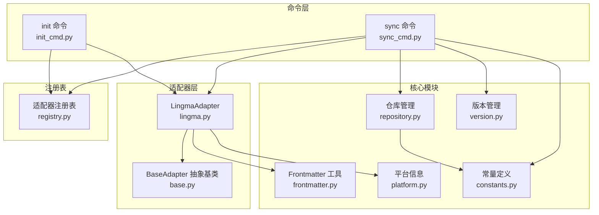
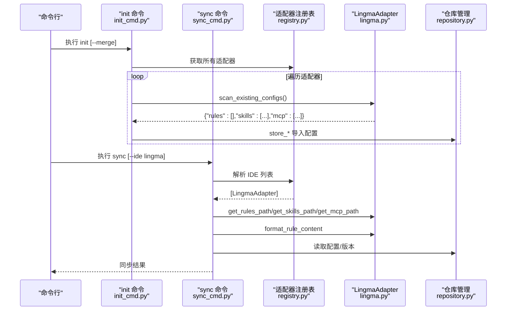
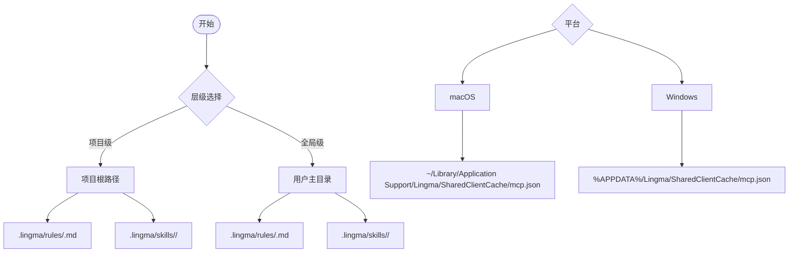
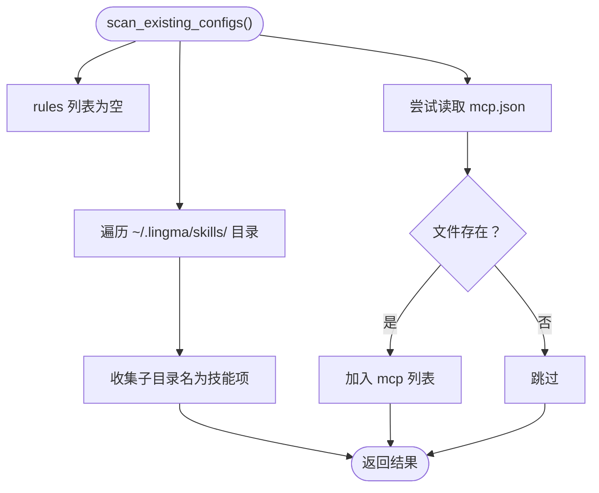
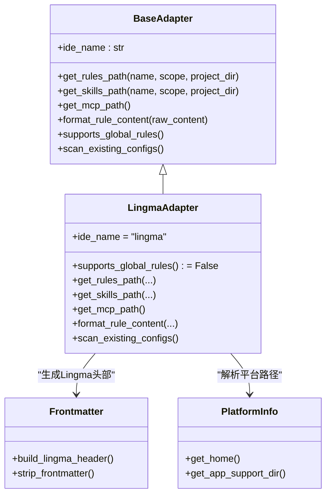
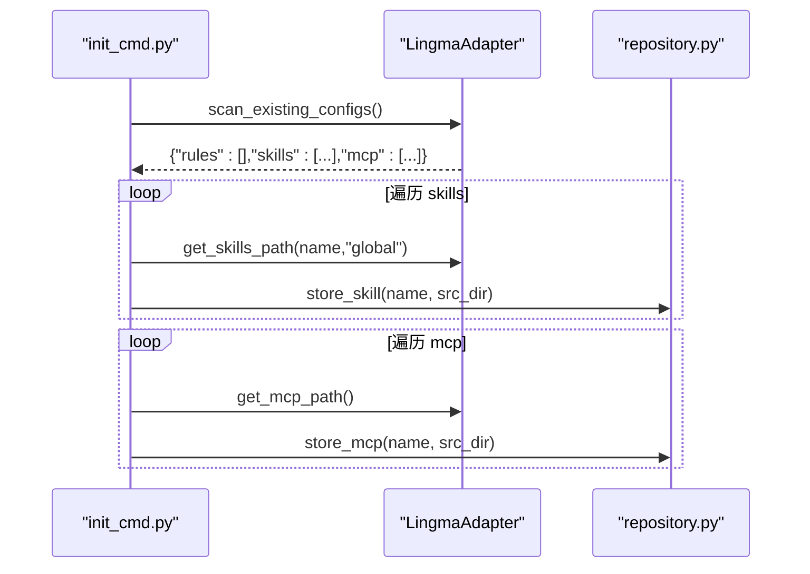
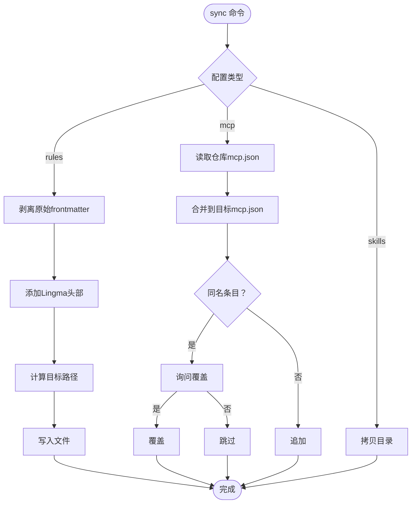
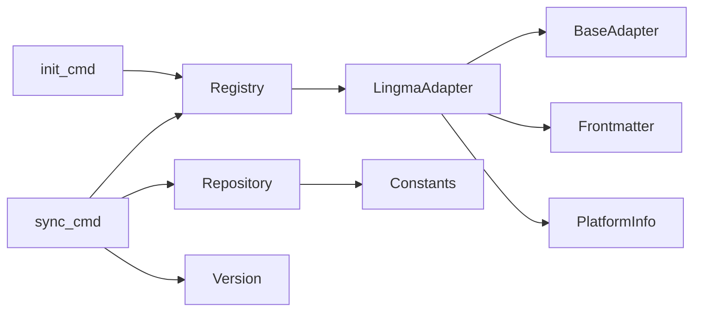

# Lingma适配器

<cite>
**本文引用的文件**
- [lingma.py](file://MSR-cli/msr_sync/adapters/lingma.py)
- [base.py](file://MSR-cli/msr_sync/adapters/base.py)
- [frontmatter.py](file://MSR-cli/msr_sync/core/frontmatter.py)
- [platform.py](file://MSR-cli/msr_sync/core/platform.py)
- [registry.py](file://MSR-cli/msr_sync/adapters/registry.py)
- [constants.py](file://MSR-cli/msr_sync/constants.py)
- [repository.py](file://MSR-cli/msr_sync/core/repository.py)
- [version.py](file://MSR-cli/msr_sync/core/version.py)
- [init_cmd.py](file://MSR-cli/msr_sync/commands/init_cmd.py)
- [sync_cmd.py](file://MSR-cli/msr_sync/commands/sync_cmd.py)
- [test_lingma_adapter.py](file://MSR-cli/tests/test_lingma_adapter.py)
</cite>

## 目录
1. [简介](#简介)
2. [项目结构](#项目结构)
3. [核心组件](#核心组件)
4. [架构总览](#架构总览)
5. [组件详解](#组件详解)
6. [依赖关系分析](#依赖关系分析)
7. [性能考量](#性能考量)
8. [故障排查指南](#故障排查指南)
9. [结论](#结论)
10. [附录](#附录)

## 简介
本文件面向Lingma适配器的实现与配置处理逻辑，系统性阐述其路径约定、配置存储结构（rules、skills、MCP）、Lingma特有格式与数据模型、与标准IDE配置的异同点，并结合CLI命令流程说明扫描机制、冲突处理与版本兼容策略。文档同时提供图示化的架构与流程，帮助读者快速理解与落地实践。

## 项目结构
Lingma适配器位于适配器层，遵循统一的适配器接口规范；其路径解析、格式转换、能力查询与配置扫描由适配器实现，其余功能（如仓库管理、版本管理、平台检测、命令调度）由核心模块提供。

图表来源
- [lingma.py:1-140](file://MSR-cli/msr_sync/adapters/lingma.py#L1-L140)
- [base.py:1-105](file://MSR-cli/msr_sync/adapters/base.py#L1-L105)
- [frontmatter.py:1-164](file://MSR-cli/msr_sync/core/frontmatter.py#L1-L164)
- [platform.py:1-60](file://MSR-cli/msr_sync/core/platform.py#L1-L60)
- [registry.py:1-89](file://MSR-cli/msr_sync/adapters/registry.py#L1-L89)
- [constants.py:1-50](file://MSR-cli/msr_sync/constants.py#L1-L50)
- [repository.py:1-291](file://MSR-cli/msr_sync/core/repository.py#L1-L291)
- [version.py:1-119](file://MSR-cli/msr_sync/core/version.py#L1-L119)
- [init_cmd.py:1-137](file://MSR-cli/msr_sync/commands/init_cmd.py#L1-L137)
- [sync_cmd.py:1-411](file://MSR-cli/msr_sync/commands/sync_cmd.py#L1-L411)

章节来源
- [lingma.py:1-140](file://MSR-cli/msr_sync/adapters/lingma.py#L1-L140)
- [base.py:1-105](file://MSR-cli/msr_sync/adapters/base.py#L1-L105)
- [registry.py:1-89](file://MSR-cli/msr_sync/adapters/registry.py#L1-L89)
- [constants.py:1-50](file://MSR-cli/msr_sync/constants.py#L1-L50)

## 核心组件
- LingmaAdapter：实现Lingma的路径解析、格式转换、能力查询与配置扫描。
- BaseAdapter：定义适配器通用接口，约束实现者提供规则/技能/MCP路径、格式转换、能力查询与扫描方法。
- Frontmatter工具：提供剥离与生成frontmatter的能力，Lingma采用固定触发头。
- 平台信息：提供跨平台的用户主目录与应用数据目录解析。
- 仓库管理：统一仓库的创建、存储、列举与读取，支持多版本管理。
- 版本管理：版本号解析、格式化与递增。
- 注册表：按IDE名称动态加载适配器实例。
- 命令层：init与sync命令集成适配器，完成扫描与同步。

章节来源
- [lingma.py:22-140](file://MSR-cli/msr_sync/adapters/lingma.py#L22-L140)
- [base.py:8-105](file://MSR-cli/msr_sync/adapters/base.py#L8-L105)
- [frontmatter.py:119-126](file://MSR-cli/msr_sync/core/frontmatter.py#L119-L126)
- [platform.py:9-60](file://MSR-cli/msr_sync/core/platform.py#L9-L60)
- [repository.py:23-291](file://MSR-cli/msr_sync/core/repository.py#L23-L291)
- [version.py:1-119](file://MSR-cli/msr_sync/core/version.py#L1-L119)
- [registry.py:10-89](file://MSR-cli/msr_sync/adapters/registry.py#L10-L89)
- [init_cmd.py:13-137](file://MSR-cli/msr_sync/commands/init_cmd.py#L13-L137)
- [sync_cmd.py:26-411](file://MSR-cli/msr_sync/commands/sync_cmd.py#L26-L411)

## 架构总览
Lingma适配器通过统一接口对接命令层，命令层在运行时按需加载适配器实例，完成扫描与同步。Lingma的特性在于：
- 不支持全局级rules（仅项目级rules）。
- skills与rules均以目录/文件形式存储于用户主目录下的.lingma目录。
- MCP配置位于平台应用数据目录的Lingma共享缓存路径。

图表来源
- [init_cmd.py:44-137](file://MSR-cli/msr_sync/commands/init_cmd.py#L44-L137)
- [sync_cmd.py:26-171](file://MSR-cli/msr_sync/commands/sync_cmd.py#L26-L171)
- [registry.py:46-89](file://MSR-cli/msr_sync/adapters/registry.py#L46-L89)
- [lingma.py:108-140](file://MSR-cli/msr_sync/adapters/lingma.py#L108-L140)
- [repository.py:89-291](file://MSR-cli/msr_sync/core/repository.py#L89-L291)

## 组件详解

### 路径约定与配置存储结构
- 规则（rules）
  - 项目级：项目根/.lingma/rules/<name>.md
  - 全局级：用户主目录/.lingma/rules/<name>.md（Lingma不支持全局级rules，此处仅为路径返回）
- 技能（skills）
  - 项目级：项目根/.lingma/skills/<name>/
  - 全局级：用户主目录/.lingma/skills/<name>/
- MCP配置
  - macOS：~/Library/Application Support/Lingma/SharedClientCache/mcp.json
  - Windows：%APPDATA%/Lingma/SharedClientCache/mcp.json

图表来源
- [lingma.py:31-80](file://MSR-cli/msr_sync/adapters/lingma.py#L31-L80)
- [platform.py:42-60](file://MSR-cli/msr_sync/core/platform.py#L42-L60)

章节来源
- [lingma.py:31-80](file://MSR-cli/msr_sync/adapters/lingma.py#L31-L80)
- [platform.py:42-60](file://MSR-cli/msr_sync/core/platform.py#L42-L60)

### 配置扫描机制
- 扫描范围
  - rules：始终为空（Lingma不支持全局级rules）
  - skills：扫描用户主目录下.lingma/skills/的子目录名称
  - mcp：检测平台应用数据目录下的mcp.json是否存在
- 异常处理：平台不支持时忽略MCP扫描，避免中断流程

图表来源
- [lingma.py:108-140](file://MSR-cli/msr_sync/adapters/lingma.py#L108-L140)
- [platform.py:32-60](file://MSR-cli/msr_sync/core/platform.py#L32-L60)

章节来源
- [lingma.py:108-140](file://MSR-cli/msr_sync/adapters/lingma.py#L108-L140)

### 配置格式与数据模型
- 规则内容格式
  - Lingma采用固定触发头：trigger: always_on
  - 通过剥离原始frontmatter后，再添加Lingma头部，保证内容一致性
- 技能目录结构
  - 以目录形式存放，目录名即技能名
- MCP配置
  - 统一仓库中MCP配置以目录形式存储，包含mcp.json
  - 同步时读取仓库中的mcp.json，合并到目标IDE的mcp.json中

图表来源
- [base.py:8-105](file://MSR-cli/msr_sync/adapters/base.py#L8-L105)
- [lingma.py:22-140](file://MSR-cli/msr_sync/adapters/lingma.py#L22-L140)
- [frontmatter.py:119-126](file://MSR-cli/msr_sync/core/frontmatter.py#L119-L126)
- [platform.py:9-60](file://MSR-cli/msr_sync/core/platform.py#L9-L60)

章节来源
- [frontmatter.py:119-126](file://MSR-cli/msr_sync/core/frontmatter.py#L119-L126)
- [lingma.py:84-98](file://MSR-cli/msr_sync/adapters/lingma.py#L84-L98)

### 与标准IDE配置的异同点
- 相同点
  - 均支持rules、skills、MCP三类配置的导入/导出与版本管理
  - 均通过统一仓库进行集中存储与版本控制
- 不同点
  - Lingma不支持全局级rules（全局级rules返回路径但调用方需自行处理）
  - Lingma的规则头部为固定模板，不包含时间戳字段
  - MCP在Lingma中位于平台应用数据目录的共享缓存路径

章节来源
- [lingma.py:102-104](file://MSR-cli/msr_sync/adapters/lingma.py#L102-L104)
- [frontmatter.py:119-126](file://MSR-cli/msr_sync/core/frontmatter.py#L119-L126)
- [platform.py:42-60](file://MSR-cli/msr_sync/core/platform.py#L42-L60)

### 代码示例：解析与转换配置文件
- 规则内容转换
  - 输入：剥离原始frontmatter后的Markdown正文
  - 输出：添加Lingma头部的完整内容
  - 示例路径：[format_rule_content:84-98](file://MSR-cli/msr_sync/adapters/lingma.py#L84-L98)，[build_lingma_header:119-126](file://MSR-cli/msr_sync/core/frontmatter.py#L119-L126)
- 规则路径解析
  - 项目级：项目根/.lingma/rules/<name>.md
  - 全局级：用户主目录/.lingma/rules/<name>.md
  - 示例路径：[get_rules_path:31-50](file://MSR-cli/msr_sync/adapters/lingma.py#L31-L50)
- 技能路径解析
  - 项目级：项目根/.lingma/skills/<name>/
  - 全局级：用户主目录/.lingma/skills/<name>/
  - 示例路径：[get_skills_path:52-68](file://MSR-cli/msr_sync/adapters/lingma.py#L52-L68)
- MCP路径解析
  - macOS：~/Library/Application Support/Lingma/SharedClientCache/mcp.json
  - Windows：%APPDATA%/Lingma/SharedClientCache/mcp.json
  - 示例路径：[get_mcp_path:70-80](file://MSR-cli/msr_sync/adapters/lingma.py#L70-L80)，[get_app_support_dir:42-60](file://MSR-cli/msr_sync/core/platform.py#L42-L60)

章节来源
- [lingma.py:31-80](file://MSR-cli/msr_sync/adapters/lingma.py#L31-L80)
- [frontmatter.py:119-126](file://MSR-cli/msr_sync/core/frontmatter.py#L119-L126)
- [platform.py:42-60](file://MSR-cli/msr_sync/core/platform.py#L42-L60)

### 扫描与合并流程（init --merge）
- init命令在创建统一仓库后，可选择扫描所有IDE的现有配置并导入
- Lingma扫描范围：skills与mcp，rules列表为空
- 导入过程：读取对应文件/目录，写入统一仓库对应目录，自动递增版本号

图表来源
- [init_cmd.py:44-137](file://MSR-cli/msr_sync/commands/init_cmd.py#L44-L137)
- [lingma.py:108-140](file://MSR-cli/msr_sync/adapters/lingma.py#L108-L140)
- [repository.py:114-158](file://MSR-cli/msr_sync/core/repository.py#L114-L158)

章节来源
- [init_cmd.py:44-137](file://MSR-cli/msr_sync/commands/init_cmd.py#L44-L137)
- [lingma.py:108-140](file://MSR-cli/msr_sync/adapters/lingma.py#L108-L140)
- [repository.py:114-158](file://MSR-cli/msr_sync/core/repository.py#L114-L158)

### 同步流程与冲突处理（sync）
- 规则同步
  - 剥离原始frontmatter，添加Lingma头部
  - 若为全局级且IDE不支持全局rules，输出警告并跳过
- MCP同步
  - 读取仓库中的mcp.json，合并到目标IDE的mcp.json
  - 同名条目存在时提示用户确认覆盖
- 技能同步
  - 目标存在时提示覆盖，不存在则直接拷贝

图表来源
- [sync_cmd.py:179-231](file://MSR-cli/msr_sync/commands/sync_cmd.py#L179-L231)
- [sync_cmd.py:238-350](file://MSR-cli/msr_sync/commands/sync_cmd.py#L238-L350)
- [sync_cmd.py:357-411](file://MSR-cli/msr_sync/commands/sync_cmd.py#L357-L411)
- [lingma.py:84-98](file://MSR-cli/msr_sync/adapters/lingma.py#L84-L98)

章节来源
- [sync_cmd.py:179-231](file://MSR-cli/msr_sync/commands/sync_cmd.py#L179-L231)
- [sync_cmd.py:238-350](file://MSR-cli/msr_sync/commands/sync_cmd.py#L238-L350)
- [sync_cmd.py:357-411](file://MSR-cli/msr_sync/commands/sync_cmd.py#L357-L411)
- [lingma.py:84-98](file://MSR-cli/msr_sync/adapters/lingma.py#L84-L98)

### 版本兼容性策略
- 版本号格式
  - 统一采用“Vn”格式，严格校验前缀与数字合法性
- 版本递增
  - 自动获取最新版本并递增，避免覆盖历史版本
- 同步策略
  - 规则同步：按最新版本写入目标IDE
  - MCP同步：按仓库中mcp.json合并，保留既有条目并提示覆盖

章节来源
- [version.py:9-119](file://MSR-cli/msr_sync/core/version.py#L9-L119)
- [sync_cmd.py:160-164](file://MSR-cli/msr_sync/commands/sync_cmd.py#L160-L164)
- [sync_cmd.py:290-350](file://MSR-cli/msr_sync/commands/sync_cmd.py#L290-L350)

## 依赖关系分析
- 适配器层
  - LingmaAdapter依赖BaseAdapter接口，实现路径解析、格式转换与扫描
- 核心模块
  - Frontmatter工具提供统一的头部生成与剥离
  - PlatformInfo提供跨平台路径解析
  - Repository与Version提供统一仓库与版本管理
- 命令层
  - init与sync通过注册表获取适配器实例，驱动扫描与同步

图表来源
- [lingma.py:17-20](file://MSR-cli/msr_sync/adapters/lingma.py#L17-L20)
- [registry.py:46-89](file://MSR-cli/msr_sync/adapters/registry.py#L46-L89)
- [init_cmd.py:9-11](file://MSR-cli/msr_sync/commands/init_cmd.py#L9-L11)
- [sync_cmd.py:14-16](file://MSR-cli/msr_sync/commands/sync_cmd.py#L14-L16)
- [repository.py:7-9](file://MSR-cli/msr_sync/core/repository.py#L7-L9)
- [constants.py:16-44](file://MSR-cli/msr_sync/constants.py#L16-L44)

章节来源
- [registry.py:10-89](file://MSR-cli/msr_sync/adapters/registry.py#L10-L89)
- [init_cmd.py:9-11](file://MSR-cli/msr_sync/commands/init_cmd.py#L9-L11)
- [sync_cmd.py:14-16](file://MSR-cli/msr_sync/commands/sync_cmd.py#L14-L16)
- [repository.py:7-9](file://MSR-cli/msr_sync/core/repository.py#L7-L9)
- [constants.py:16-44](file://MSR-cli/msr_sync/constants.py#L16-L44)

## 性能考量
- 扫描效率
  - skills扫描仅遍历.lingma/skills/子目录，复杂度O(n)
  - mcp扫描仅检测文件存在性，开销极小
- 写入策略
  - 规则与技能写入采用原子性写入与目录复制，避免部分写入导致的数据损坏
- 版本管理
  - 版本号解析与递增为O(k)（k为版本数量），通常很小

## 故障排查指南
- 平台不支持
  - 现象：MCP扫描失败或路径不可用
  - 处理：适配器层已捕获异常并忽略，不影响其他配置的导入/同步
- 全局级rules不支持
  - 现象：全局级同步时被跳过
  - 处理：调用方需自行处理并输出警告
- MCP配置冲突
  - 现象：目标mcp.json中存在同名条目
  - 处理：交互式确认覆盖，避免误覆盖
- 规则内容异常
  - 现象：frontmatter格式不合法导致剥离失败
  - 处理：frontmatter模块会回退为原文，确保不中断流程

章节来源
- [lingma.py:131-137](file://MSR-cli/msr_sync/adapters/lingma.py#L131-L137)
- [sync_cmd.py:205-207](file://MSR-cli/msr_sync/commands/sync_cmd.py#L205-L207)
- [sync_cmd.py:326-334](file://MSR-cli/msr_sync/commands/sync_cmd.py#L326-L334)
- [frontmatter.py:26-61](file://MSR-cli/msr_sync/core/frontmatter.py#L26-L61)

## 结论
Lingma适配器通过严格的路径约定与统一的格式转换，实现了与Lingma IDE的无缝对接。其不支持全局级rules的设计决定了在init --merge与sync流程中需要特别处理全局层级；MCP的合并策略与版本管理保障了配置的可追溯与可维护性。整体设计在保持简洁的同时，兼顾了跨平台与错误恢复能力。

## 附录
- 单元测试要点
  - 路径解析：项目级与全局级路径正确性
  - 格式转换：Lingma头部添加与内容保留
  - 扫描机制：skills与mcp扫描结果正确性
  - 平台差异：macOS与Windows路径解析
  - 参考路径：[test_lingma_adapter.py:1-195](file://MSR-cli/tests/test_lingma_adapter.py#L1-L195)

章节来源
- [test_lingma_adapter.py:19-195](file://MSR-cli/tests/test_lingma_adapter.py#L19-L195)