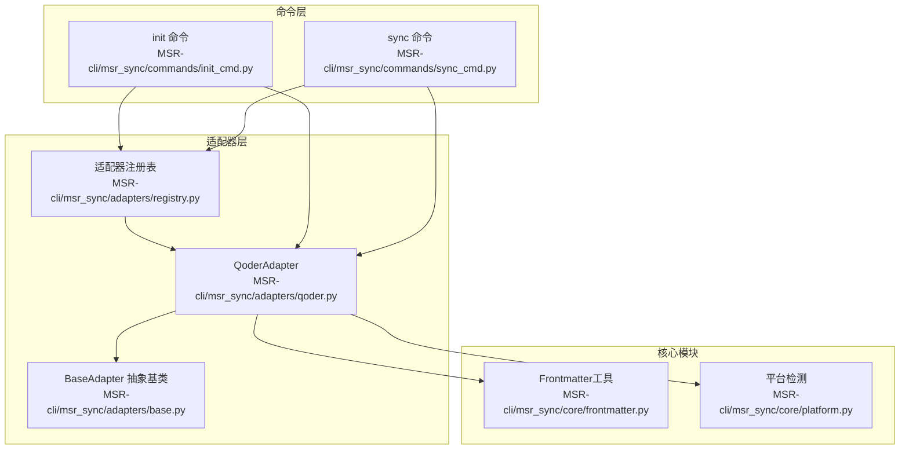
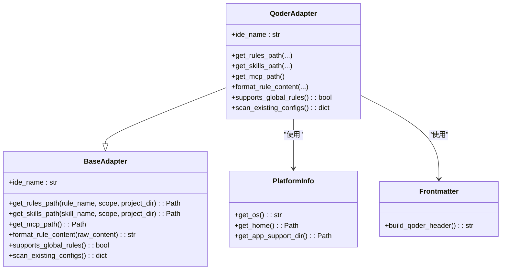
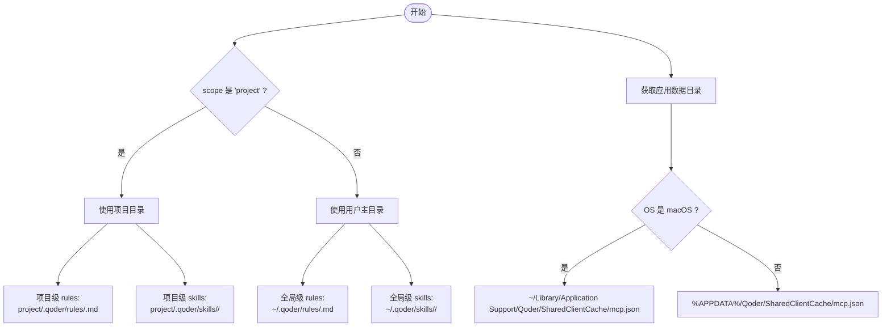
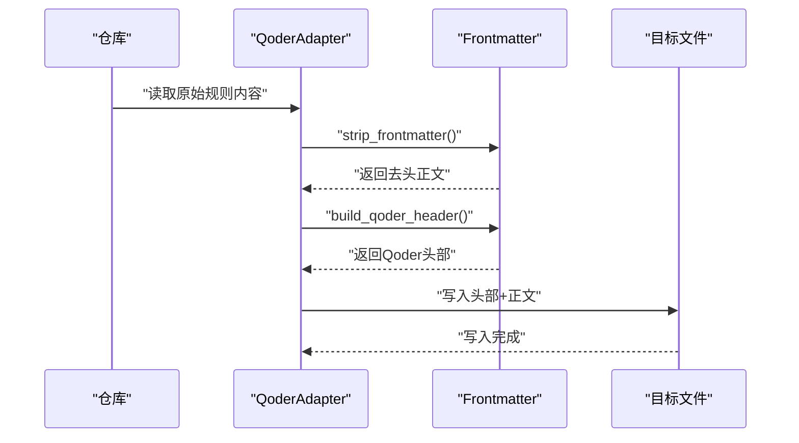
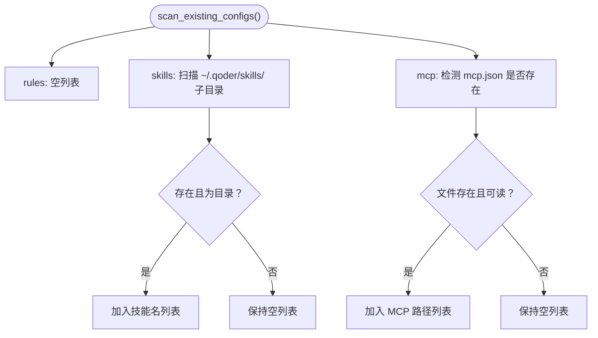
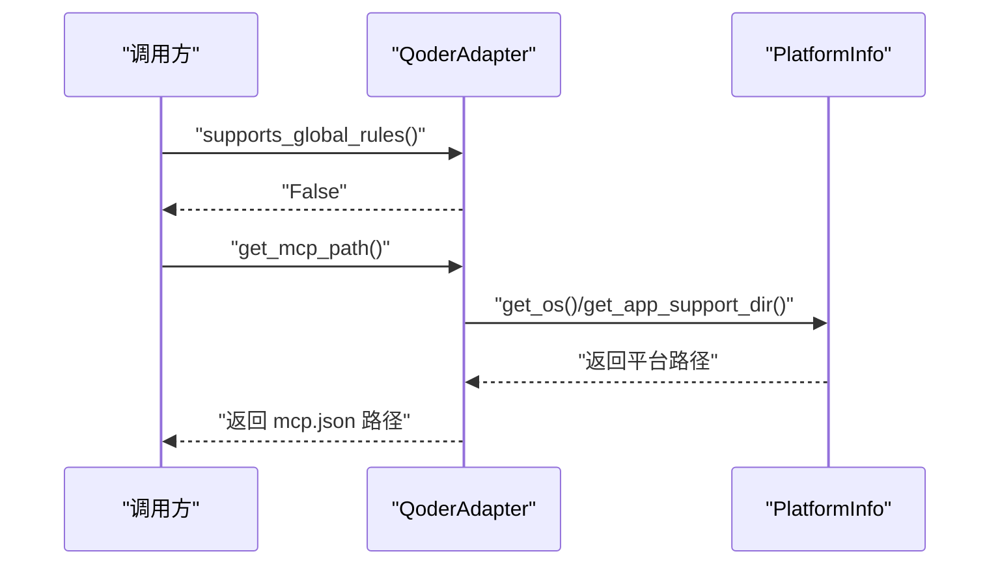
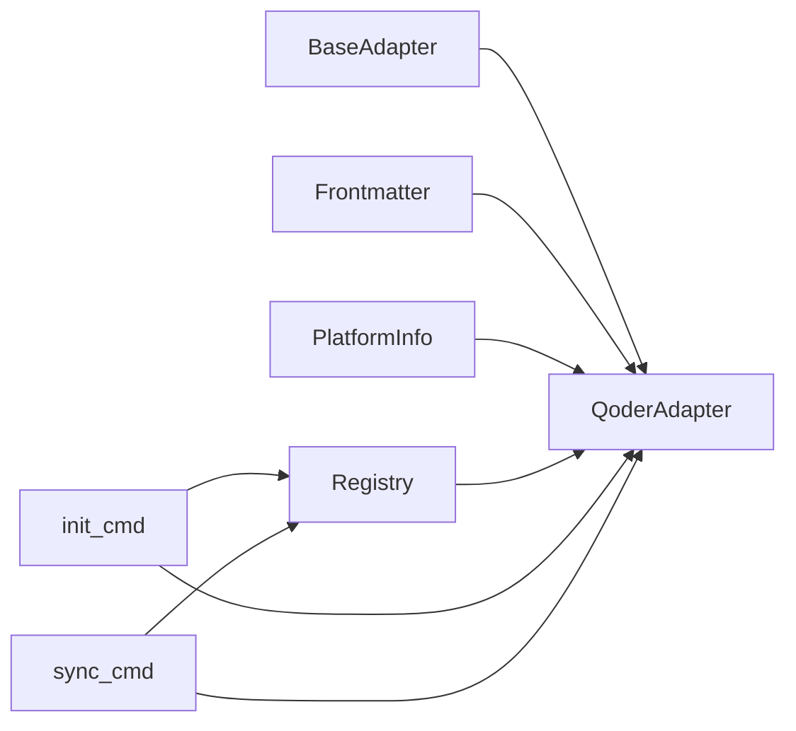

# Qoder适配器

<cite>
**本文引用的文件**
- [qoder.py](file://MSR-cli/msr_sync/adapters/qoder.py)
- [base.py](file://MSR-cli/msr_sync/adapters/base.py)
- [frontmatter.py](file://MSR-cli/msr_sync/core/frontmatter.py)
- [platform.py](file://MSR-cli/msr_sync/core/platform.py)
- [registry.py](file://MSR-cli/msr_sync/adapters/registry.py)
- [init_cmd.py](file://MSR-cli/msr_sync/commands/init_cmd.py)
- [sync_cmd.py](file://MSR-cli/msr_sync/commands/sync_cmd.py)
- [test_qoder_adapter.py](file://MSR-cli/tests/test_qoder_adapter.py)
</cite>

## 目录
1. [简介](#简介)
2. [项目结构](#项目结构)
3. [核心组件](#核心组件)
4. [架构总览](#架构总览)
5. [组件详细分析](#组件详细分析)
6. [依赖关系分析](#依赖关系分析)
7. [性能考量](#性能考量)
8. [故障排查指南](#故障排查指南)
9. [结论](#结论)
10. [附录](#附录)

## 简介
本文件面向MSR-sync中的Qoder适配器，系统性阐述其实现特点、差异化处理机制与跨平台兼容策略。重点包括：
- Qoder的路径解析策略：rules、skills与MCP配置的存储位置与命名规范
- Qoder特有的配置格式与数据结构，以及与标准IDE配置的差异
- 适配器如何处理其特有的配置文件格式
- 扫描逻辑：如何识别并提取Qoder的配置信息
- 跨平台兼容性：针对macOS与Windows的特殊考虑与处理方式

## 项目结构
Qoder适配器位于适配器层，遵循统一的适配器接口规范，并通过注册表进行延迟加载与实例缓存；核心功能由平台检测模块提供跨平台路径支持；命令层在初始化与同步流程中调用适配器完成具体任务。

图表来源
- [qoder.py:1-140](file://MSR-cli/msr_sync/adapters/qoder.py#L1-L140)
- [base.py:1-105](file://MSR-cli/msr_sync/adapters/base.py#L1-L105)
- [registry.py:1-89](file://MSR-cli/msr_sync/adapters/registry.py#L1-L89)
- [frontmatter.py:1-164](file://MSR-cli/msr_sync/core/frontmatter.py#L1-L164)
- [platform.py:1-60](file://MSR-cli/msr_sync/core/platform.py#L1-L60)
- [init_cmd.py:1-137](file://MSR-cli/msr_sync/commands/init_cmd.py#L1-L137)
- [sync_cmd.py:1-411](file://MSR-cli/msr_sync/commands/sync_cmd.py#L1-L411)

章节来源
- [qoder.py:1-140](file://MSR-cli/msr_sync/adapters/qoder.py#L1-L140)
- [base.py:1-105](file://MSR-cli/msr_sync/adapters/base.py#L1-L105)
- [registry.py:1-89](file://MSR-cli/msr_sync/adapters/registry.py#L1-L89)
- [frontmatter.py:1-164](file://MSR-cli/msr_sync/core/frontmatter.py#L1-L164)
- [platform.py:1-60](file://MSR-cli/msr_sync/core/platform.py#L1-L60)
- [init_cmd.py:1-137](file://MSR-cli/msr_sync/commands/init_cmd.py#L1-L137)
- [sync_cmd.py:1-411](file://MSR-cli/msr_sync/commands/sync_cmd.py#L1-L411)

## 核心组件
- QoderAdapter：实现Qoder的路径解析、格式转换、能力查询与配置扫描
- BaseAdapter：定义适配器接口契约，约束各IDE适配器的统一行为
- Frontmatter工具：提供Markdown frontmatter解析与各IDE模板头部生成
- PlatformInfo：提供跨平台路径解析（用户主目录、应用数据目录）
- 适配器注册表：延迟加载与实例缓存，支持按IDE名称解析适配器
- 命令层：init与sync命令在生命周期中调用适配器完成配置导入与同步

章节来源
- [qoder.py:22-140](file://MSR-cli/msr_sync/adapters/qoder.py#L22-L140)
- [base.py:8-105](file://MSR-cli/msr_sync/adapters/base.py#L8-L105)
- [frontmatter.py:110-116](file://MSR-cli/msr_sync/core/frontmatter.py#L110-L116)
- [platform.py:9-60](file://MSR-cli/msr_sync/core/platform.py#L9-L60)
- [registry.py:8-89](file://MSR-cli/msr_sync/adapters/registry.py#L8-L89)
- [init_cmd.py:13-137](file://MSR-cli/msr_sync/commands/init_cmd.py#L13-L137)
- [sync_cmd.py:26-411](file://MSR-cli/msr_sync/commands/sync_cmd.py#L26-L411)

## 架构总览
Qoder适配器遵循“接口契约 + 平台抽象 + 工具函数”的分层设计：
- 接口层：BaseAdapter定义统一方法族
- 实现层：QoderAdapter实现具体路径、格式与扫描逻辑
- 平台层：PlatformInfo封装跨平台路径细节
- 工具层：Frontmatter提供统一的frontmatter处理
- 命令层：init/sync在生命周期中调用适配器

图表来源
- [base.py:8-105](file://MSR-cli/msr_sync/adapters/base.py#L8-L105)
- [qoder.py:22-140](file://MSR-cli/msr_sync/adapters/qoder.py#L22-L140)
- [platform.py:9-60](file://MSR-cli/msr_sync/core/platform.py#L9-L60)
- [frontmatter.py:110-116](file://MSR-cli/msr_sync/core/frontmatter.py#L110-L116)

## 组件详细分析

### Qoder路径解析策略
- rules路径
  - 项目级：项目根目录/.qoder/rules/<name>.md
  - 全局级：用户主目录/.qoder/rules/<name>.md（注意：Qoder不支持全局级rules，调用方需自行处理）
- skills路径
  - 项目级：项目根目录/.qoder/skills/<name>/
  - 全局级：用户主目录/.qoder/skills/<name>/
- MCP路径
  - macOS：~/Library/Application Support/Qoder/SharedClientCache/mcp.json
  - Windows：%APPDATA%/Qoder/SharedClientCache/mcp.json

图表来源
- [qoder.py:31-80](file://MSR-cli/msr_sync/adapters/qoder.py#L31-L80)
- [platform.py:42-60](file://MSR-cli/msr_sync/core/platform.py#L42-L60)

章节来源
- [qoder.py:31-80](file://MSR-cli/msr_sync/adapters/qoder.py#L31-L80)
- [platform.py:42-60](file://MSR-cli/msr_sync/core/platform.py#L42-L60)

### Qoder格式转换与配置格式
- Qoder规则内容格式要求：在剥离原始frontmatter后，添加Qoder专用的frontmatter头部（trigger: always_on）
- 该头部由Frontmatter工具生成，保证统一模板一致性
- 与标准IDE不同，Qoder不包含其他字段（如updatedAt、provider等）

图表来源
- [sync_cmd.py:179-231](file://MSR-cli/msr_sync/commands/sync_cmd.py#L179-L231)
- [frontmatter.py:110-116](file://MSR-cli/msr_sync/core/frontmatter.py#L110-L116)
- [qoder.py:84-98](file://MSR-cli/msr_sync/adapters/qoder.py#L84-L98)

章节来源
- [sync_cmd.py:179-231](file://MSR-cli/msr_sync/commands/sync_cmd.py#L179-L231)
- [frontmatter.py:110-116](file://MSR-cli/msr_sync/core/frontmatter.py#L110-L116)
- [qoder.py:84-98](file://MSR-cli/msr_sync/adapters/qoder.py#L84-L98)

### Qoder扫描逻辑
- 扫描范围
  - rules：始终为空（Qoder不支持全局级rules）
  - skills：扫描用户主目录下~/.qoder/skills/的子目录名称
  - mcp：检测应用数据目录下的Qoder MCP配置文件是否存在
- 异常处理：扫描过程中忽略平台不支持的情况（如异常路径解析）

图表来源
- [qoder.py:108-139](file://MSR-cli/msr_sync/adapters/qoder.py#L108-L139)

章节来源
- [qoder.py:108-139](file://MSR-cli/msr_sync/adapters/qoder.py#L108-L139)
- [test_qoder_adapter.py:121-192](file://MSR-cli/tests/test_qoder_adapter.py#L121-L192)

### 能力查询与跨平台兼容
- 能力查询：Qoder不支持全局级rules，返回False
- 跨平台兼容：通过PlatformInfo获取OS、用户主目录与应用数据目录，分别对应macOS与Windows的路径约定

图表来源
- [qoder.py:102-104](file://MSR-cli/msr_sync/adapters/qoder.py#L102-L104)
- [qoder.py:70-80](file://MSR-cli/msr_sync/adapters/qoder.py#L70-L80)
- [platform.py:12-60](file://MSR-cli/msr_sync/core/platform.py#L12-L60)

章节来源
- [qoder.py:102-104](file://MSR-cli/msr_sync/adapters/qoder.py#L102-L104)
- [qoder.py:70-80](file://MSR-cli/msr_sync/adapters/qoder.py#L70-L80)
- [platform.py:12-60](file://MSR-cli/msr_sync/core/platform.py#L12-L60)

### 与标准IDE配置的差异
- Qoder不支持全局级rules，调用方在全局同步时需跳过或发出警告
- Qoder规则的frontmatter仅包含trigger: always_on，不包含updatedAt、provider等字段
- MCP配置在Qoder中位于应用数据目录下的固定路径，而非用户主目录

章节来源
- [base.py:80-89](file://MSR-cli/msr_sync/adapters/base.py#L80-L89)
- [frontmatter.py:110-116](file://MSR-cli/msr_sync/core/frontmatter.py#L110-L116)
- [qoder.py:70-80](file://MSR-cli/msr_sync/adapters/qoder.py#L70-L80)

### 代码示例路径（展示Qoder适配器如何处理其特有的配置文件格式）
- 规则内容格式转换：参考规则同步流程中的格式化步骤
  - 示例路径：[规则同步流程:179-231](file://MSR-cli/msr_sync/commands/sync_cmd.py#L179-L231)
- MCP配置合并：参考MCP同步与合并流程
  - 示例路径：[MCP同步流程:238-287](file://MSR-cli/msr_sync/commands/sync_cmd.py#L238-L287)，[MCP合并流程:290-349](file://MSR-cli/msr_sync/commands/sync_cmd.py#L290-L349)
- 扫描已有配置：参考QoderAdapter的scan_existing_configs
  - 示例路径：[Qoder扫描逻辑:108-139](file://MSR-cli/msr_sync/adapters/qoder.py#L108-L139)

章节来源
- [sync_cmd.py:179-231](file://MSR-cli/msr_sync/commands/sync_cmd.py#L179-L231)
- [sync_cmd.py:238-349](file://MSR-cli/msr_sync/commands/sync_cmd.py#L238-L349)
- [qoder.py:108-139](file://MSR-cli/msr_sync/adapters/qoder.py#L108-L139)

## 依赖关系分析
- QoderAdapter依赖BaseAdapter接口，确保统一行为
- QoderAdapter依赖Frontmatter工具生成Qoder头部
- QoderAdapter依赖PlatformInfo进行跨平台路径解析
- 注册表负责延迟加载与实例缓存，避免重复创建
- 命令层在init与sync阶段调用适配器，完成导入与同步

图表来源
- [base.py:8-105](file://MSR-cli/msr_sync/adapters/base.py#L8-L105)
- [qoder.py:17-19](file://MSR-cli/msr_sync/adapters/qoder.py#L17-L19)
- [frontmatter.py:110-116](file://MSR-cli/msr_sync/core/frontmatter.py#L110-L116)
- [platform.py:9-60](file://MSR-cli/msr_sync/core/platform.py#L9-L60)
- [registry.py:46-63](file://MSR-cli/msr_sync/adapters/registry.py#L46-L63)
- [init_cmd.py:56-64](file://MSR-cli/msr_sync/commands/init_cmd.py#L56-L64)
- [sync_cmd.py:65-66](file://MSR-cli/msr_sync/commands/sync_cmd.py#L65-L66)

章节来源
- [base.py:8-105](file://MSR-cli/msr_sync/adapters/base.py#L8-L105)
- [qoder.py:17-19](file://MSR-cli/msr_sync/adapters/qoder.py#L17-L19)
- [frontmatter.py:110-116](file://MSR-cli/msr_sync/core/frontmatter.py#L110-L116)
- [platform.py:9-60](file://MSR-cli/msr_sync/core/platform.py#L9-L60)
- [registry.py:46-63](file://MSR-cli/msr_sync/adapters/registry.py#L46-L63)
- [init_cmd.py:56-64](file://MSR-cli/msr_sync/commands/init_cmd.py#L56-L64)
- [sync_cmd.py:65-66](file://MSR-cli/msr_sync/commands/sync_cmd.py#L65-L66)

## 性能考量
- 路径解析与文件I/O：路径解析为常量时间操作；扫描与读取文件为O(n)（n为技能目录数量）
- 跨平台路径：PlatformInfo仅在需要时调用，避免重复计算
- 命令层批量处理：init/sync命令对多个适配器进行迭代，建议在大规模配置场景下关注I/O瓶颈

[本节为通用性能讨论，无需特定文件来源]

## 故障排查指南
- 全局级rules同步失败
  - 现象：全局级同步时被跳过
  - 原因：Qoder不支持全局级rules
  - 处理：切换为项目级同步或在调用方逻辑中跳过
  - 参考：[能力查询:102-104](file://MSR-cli/msr_sync/adapters/qoder.py#L102-L104)，[规则同步逻辑:204-207](file://MSR-cli/msr_sync/commands/sync_cmd.py#L204-L207)
- MCP配置未生效
  - 现象：MCP未被识别或合并
  - 原因：路径不正确或文件不存在
  - 处理：确认应用数据目录与Qoder安装路径一致
  - 参考：[MCP路径解析:70-80](file://MSR-cli/msr_sync/adapters/qoder.py#L70-L80)，[MCP扫描:130-137](file://MSR-cli/msr_sync/adapters/qoder.py#L130-L137)
- 抛出平台不支持异常
  - 现象：PlatformInfo抛出UnsupportedPlatformError
  - 原因：当前操作系统不受支持
  - 处理：确认运行环境为macOS或Windows
  - 参考：[平台检测:22-30](file://MSR-cli/msr_sync/core/platform.py#L22-L30)

章节来源
- [qoder.py:102-104](file://MSR-cli/msr_sync/adapters/qoder.py#L102-L104)
- [sync_cmd.py:204-207](file://MSR-cli/msr_sync/commands/sync_cmd.py#L204-L207)
- [qoder.py:70-80](file://MSR-cli/msr_sync/adapters/qoder.py#L70-L80)
- [qoder.py:130-137](file://MSR-cli/msr_sync/adapters/qoder.py#L130-L137)
- [platform.py:22-30](file://MSR-cli/msr_sync/core/platform.py#L22-L30)

## 结论
Qoder适配器通过严格的接口契约与平台抽象，实现了对Qoder特有配置格式与路径约定的精准适配。其关键特性包括：
- 明确的路径约定与命名规范，确保与Qoder本地配置一致
- 简洁的规则头部模板，满足Qoder的触发策略
- 严格的全局级rules限制，避免不兼容行为
- 完备的跨平台路径解析，保障在macOS与Windows上的可用性
- 清晰的扫描逻辑，便于init --merge流程导入现有配置

[本节为总结性内容，无需特定文件来源]

## 附录
- 单元测试覆盖要点
  - 属性与能力查询：ide_name、supports_global_rules
  - 路径解析：项目级与全局级rules、skills路径
  - MCP路径解析：macOS与Windows路径
  - 格式转换：Qoder头部添加与内容保留
  - 扫描逻辑：rules始终为空、skills扫描、mcp检测
  - 参考：[Qoder适配器测试:1-192](file://MSR-cli/tests/test_qoder_adapter.py#L1-L192)

章节来源
- [test_qoder_adapter.py:16-192](file://MSR-cli/tests/test_qoder_adapter.py#L16-L192)