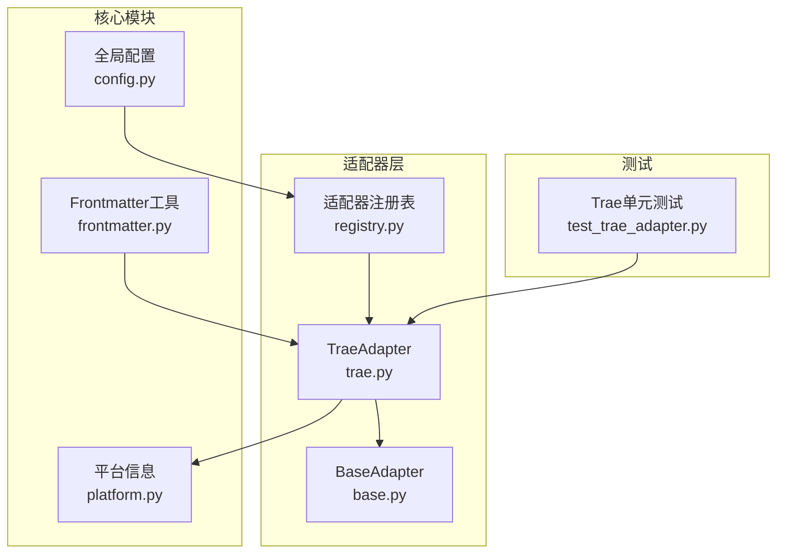
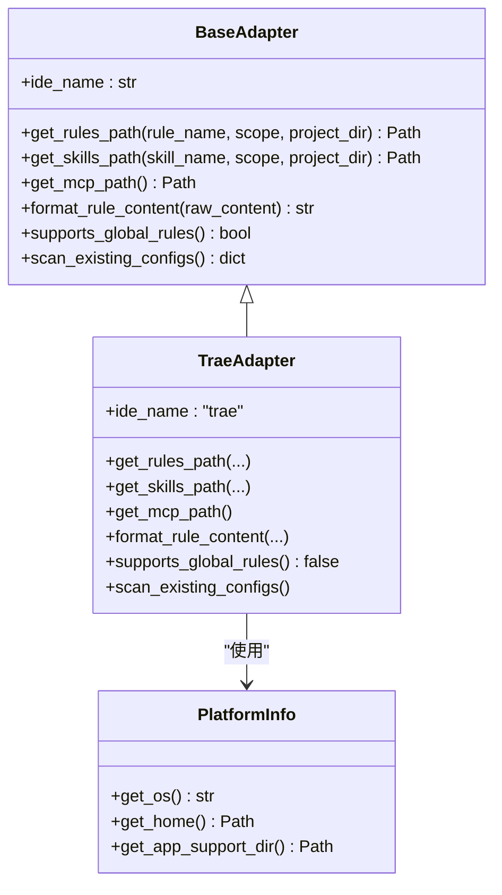
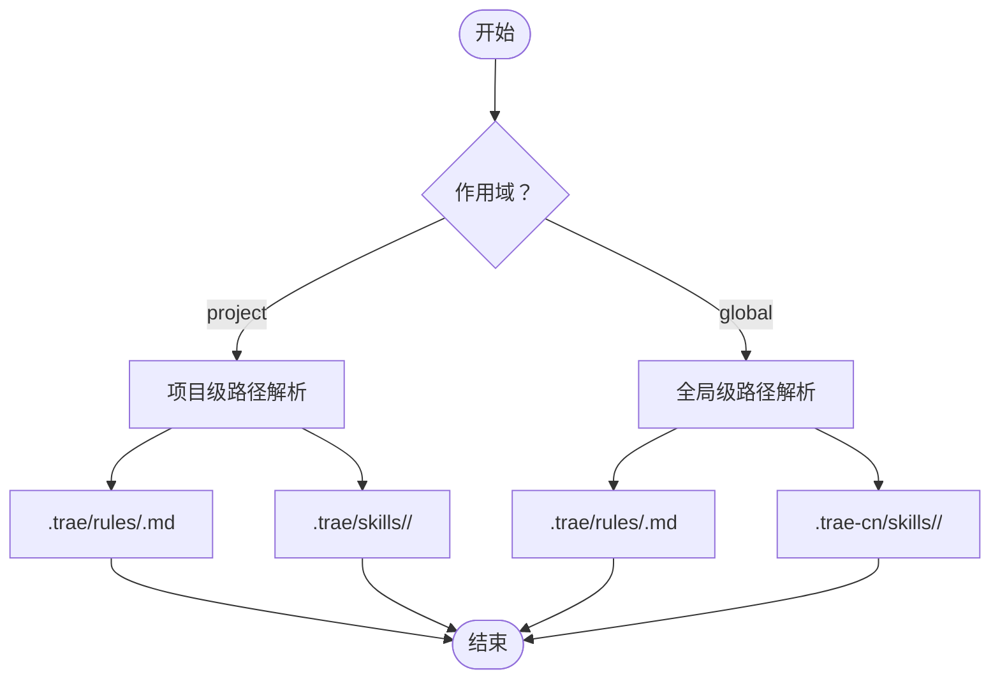
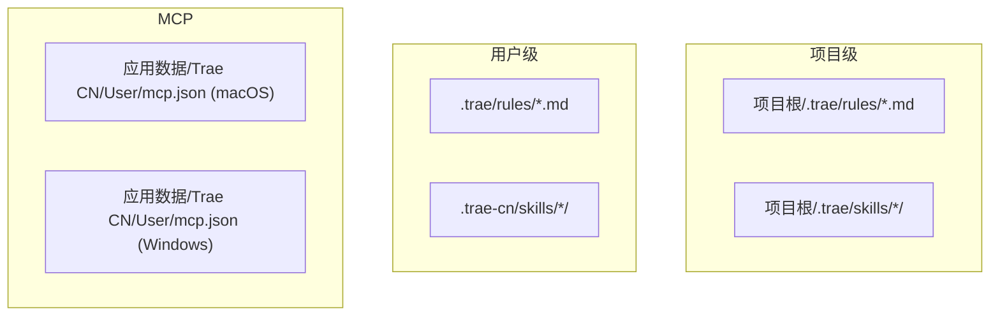
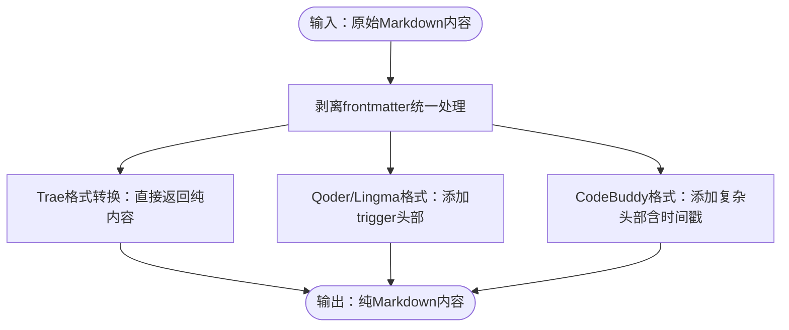
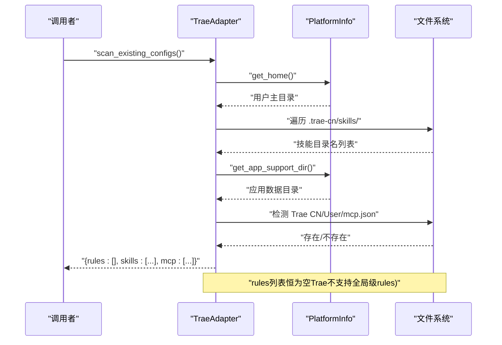
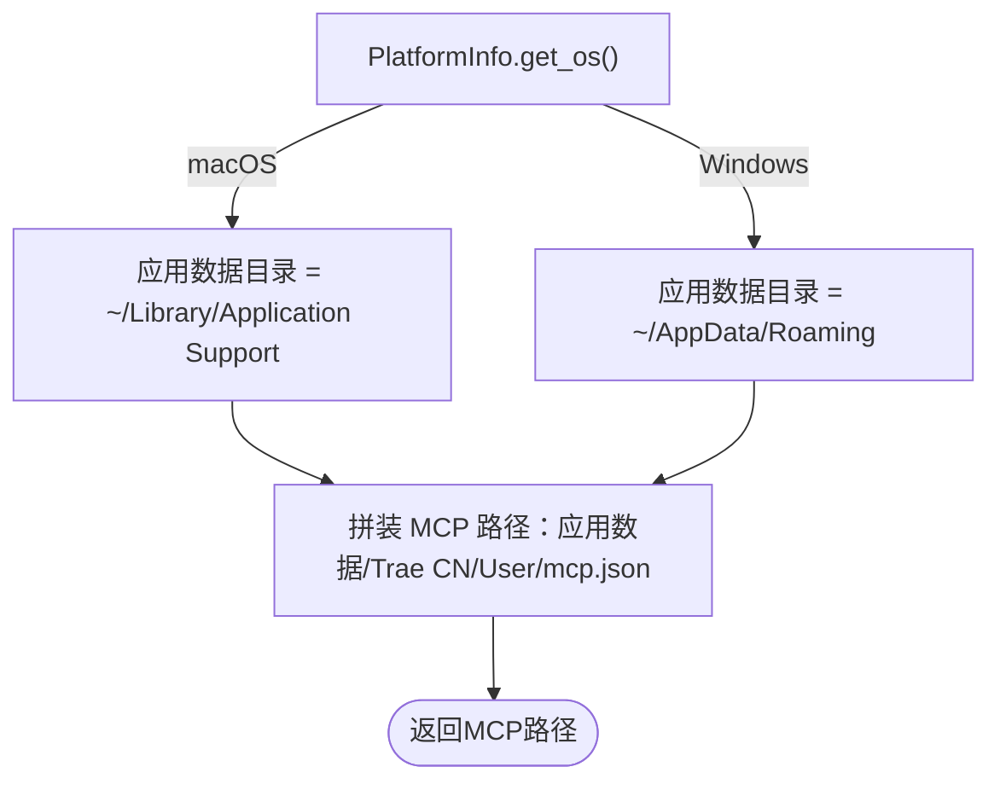
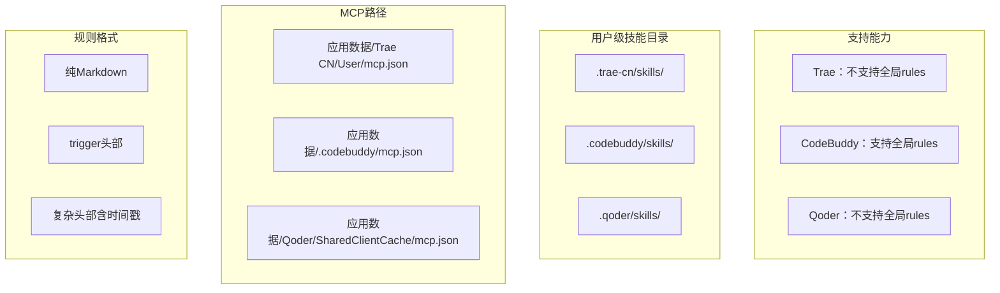
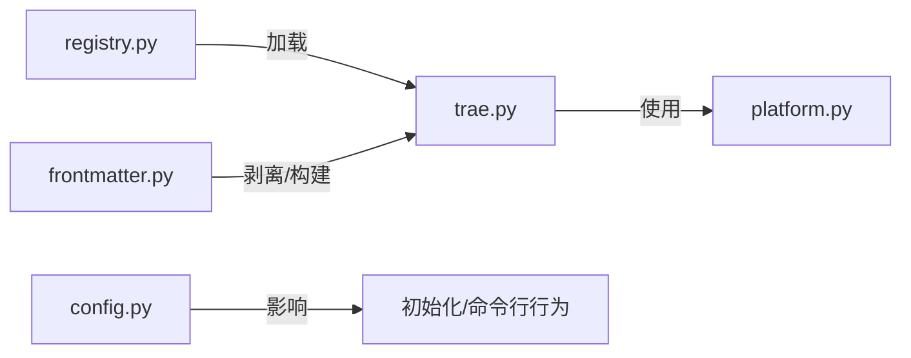

# Trae适配器

<cite>
**本文引用的文件**
- [MSR-cli/msr_sync/adapters/trae.py](file://MSR-cli/msr_sync/adapters/trae.py)
- [MSR-cli/msr_sync/adapters/base.py](file://MSR-cli/msr_sync/adapters/base.py)
- [MSR-cli/msr_sync/adapters/registry.py](file://MSR-cli/msr_sync/adapters/registry.py)
- [MSR-cli/msr_sync/core/platform.py](file://MSR-cli/msr_sync/core/platform.py)
- [MSR-cli/msr_sync/core/config.py](file://MSR-cli/msr_sync/core/config.py)
- [MSR-cli/msr_sync/core/frontmatter.py](file://MSR-cli/msr_sync/core/frontmatter.py)
- [MSR-cli/tests/test_trae_adapter.py](file://MSR-cli/tests/test_trae_adapter.py)
- [MSR-cli/msr_sync/adapters/codebuddy.py](file://MSR-cli/msr_sync/adapters/codebuddy.py)
- [MSR-cli/msr_sync/adapters/qoder.py](file://MSR-cli/msr_sync/adapters/qoder.py)
- [blog-msr-sync.md](file://blog-msr-sync.md)
</cite>

## 目录
1. [简介](#简介)
2. [项目结构](#项目结构)
3. [核心组件](#核心组件)
4. [架构总览](#架构总览)
5. [详细组件分析](#详细组件分析)
6. [依赖分析](#依赖分析)
7. [性能考虑](#性能考虑)
8. [故障排查指南](#故障排查指南)
9. [结论](#结论)
10. [附录](#附录)

## 简介
本文件面向Trae适配器的技术文档，系统阐述其路径解析策略、配置文件组织结构、格式转换机制与扫描逻辑，并通过与Qoder、Lingma、CodeBuddy等其他适配器的对比，突出Trae在跨平台支持、路径处理与配置管理上的独特要求与实现细节。文档同时提供可追溯的源码路径，帮助读者快速定位实现位置。

## 项目结构
- 适配器层位于MSR-cli/msr_sync/adapters/，其中Trae适配器实现于trae.py，继承自BaseAdapter。
- 平台检测与路径解析能力由core/platform.py提供，供适配器按平台返回正确的应用数据目录与用户主目录。
- 配置管理位于core/config.py，定义全局配置与默认值，影响命令行与初始化流程。
- 前言块（frontmatter）解析与生成位于core/frontmatter.py，用于剥离与构建Markdown头部。
- 注册表adapters/registry.py负责IDE适配器的延迟加载与实例缓存。
- 单元测试tests/test_trae_adapter.py覆盖Trae适配器的关键行为与边界条件。

**图表来源**
- [MSR-cli/msr_sync/adapters/trae.py:1-138](file://MSR-cli/msr_sync/adapters/trae.py#L1-L138)
- [MSR-cli/msr_sync/adapters/base.py:1-105](file://MSR-cli/msr_sync/adapters/base.py#L1-L105)
- [MSR-cli/msr_sync/adapters/registry.py:1-89](file://MSR-cli/msr_sync/adapters/registry.py#L1-L89)
- [MSR-cli/msr_sync/core/platform.py:1-60](file://MSR-cli/msr_sync/core/platform.py#L1-L60)
- [MSR-cli/msr_sync/core/config.py:1-204](file://MSR-cli/msr_sync/core/config.py#L1-L204)
- [MSR-cli/msr_sync/core/frontmatter.py:1-164](file://MSR-cli/msr_sync/core/frontmatter.py#L1-L164)
- [MSR-cli/tests/test_trae_adapter.py:1-204](file://MSR-cli/tests/test_trae_adapter.py#L1-L204)

**章节来源**
- [MSR-cli/msr_sync/adapters/trae.py:1-138](file://MSR-cli/msr_sync/adapters/trae.py#L1-L138)
- [MSR-cli/msr_sync/adapters/base.py:1-105](file://MSR-cli/msr_sync/adapters/base.py#L1-L105)
- [MSR-cli/msr_sync/adapters/registry.py:1-89](file://MSR-cli/msr_sync/adapters/registry.py#L1-L89)
- [MSR-cli/msr_sync/core/platform.py:1-60](file://MSR-cli/msr_sync/core/platform.py#L1-L60)
- [MSR-cli/msr_sync/core/config.py:1-204](file://MSR-cli/msr_sync/core/config.py#L1-L204)
- [MSR-cli/msr_sync/core/frontmatter.py:1-164](file://MSR-cli/msr_sync/core/frontmatter.py#L1-L164)
- [MSR-cli/tests/test_trae_adapter.py:1-204](file://MSR-cli/tests/test_trae_adapter.py#L1-L204)

## 核心组件
- TraeAdapter：实现Trae IDE的路径解析、格式转换、能力查询与配置扫描。
- BaseAdapter：定义适配器接口契约，包括路径解析、格式转换、能力查询与扫描方法。
- PlatformInfo：提供跨平台的用户主目录与应用数据目录解析。
- Registry：IDE适配器注册与实例化，支持“all”展开与缓存。
- GlobalConfig：全局配置加载与校验，决定默认IDE列表与默认层级。
- Frontmatter工具：剥离与构建Markdown前言块，为其他适配器提供头部模板。

**章节来源**
- [MSR-cli/msr_sync/adapters/trae.py:21-138](file://MSR-cli/msr_sync/adapters/trae.py#L21-L138)
- [MSR-cli/msr_sync/adapters/base.py:8-105](file://MSR-cli/msr_sync/adapters/base.py#L8-L105)
- [MSR-cli/msr_sync/core/platform.py:9-60](file://MSR-cli/msr_sync/core/platform.py#L9-L60)
- [MSR-cli/msr_sync/adapters/registry.py:8-89](file://MSR-cli/msr_sync/adapters/registry.py#L8-L89)
- [MSR-cli/msr_sync/core/config.py:18-204](file://MSR-cli/msr_sync/core/config.py#L18-L204)
- [MSR-cli/msr_sync/core/frontmatter.py:10-164](file://MSR-cli/msr_sync/core/frontmatter.py#L10-L164)

## 架构总览
Trae适配器遵循BaseAdapter接口，通过PlatformInfo进行跨平台路径解析；在配置扫描阶段，仅扫描用户级技能目录与MCP配置文件，且明确不支持全局级rules。

**图表来源**
- [MSR-cli/msr_sync/adapters/base.py:8-105](file://MSR-cli/msr_sync/adapters/base.py#L8-L105)
- [MSR-cli/msr_sync/adapters/trae.py:21-138](file://MSR-cli/msr_sync/adapters/trae.py#L21-L138)
- [MSR-cli/msr_sync/core/platform.py:9-60](file://MSR-cli/msr_sync/core/platform.py#L9-L60)

## 详细组件分析

### 路径解析策略
- 规则文件（rules）
  - 项目级：在项目根目录下创建“.trae/rules/<name>.md”。
  - 全局级：返回用户主目录下的“.trae/rules/<name>.md”，但Trae不支持全局级rules，调用方可据此发出警告。
- 技能目录（skills）
  - 项目级：在项目根目录“.trae/skills/<name>”。
  - 全局级：使用“.trae-cn/skills/<name>”（注意：与项目级不同，使用“trae-cn”而非“trae”）。
- MCP配置
  - macOS：应用数据目录下“Trae CN/User/mcp.json”。
  - Windows：应用数据目录下“Trae CN/User/mcp.json”。

**图表来源**
- [MSR-cli/msr_sync/adapters/trae.py:30-81](file://MSR-cli/msr_sync/adapters/trae.py#L30-L81)

**章节来源**
- [MSR-cli/msr_sync/adapters/trae.py:30-81](file://MSR-cli/msr_sync/adapters/trae.py#L30-L81)
- [MSR-cli/tests/test_trae_adapter.py:31-70](file://MSR-cli/tests/test_trae_adapter.py#L31-L70)

### 配置文件组织结构
- rules
  - 项目级：.trae/rules/<name>.md
  - 全局级：.trae/rules/<name>.md（Trae不支持）
- skills
  - 项目级：.trae/skills/<name>/
  - 全局级：.trae-cn/skills/<name>/（关键差异）
- MCP
  - 平台：应用数据目录/Trae CN/User/mcp.json

**图表来源**
- [MSR-cli/msr_sync/adapters/trae.py:5-12](file://MSR-cli/msr_sync/adapters/trae.py#L5-L12)
- [MSR-cli/msr_sync/adapters/trae.py:71-81](file://MSR-cli/msr_sync/adapters/trae.py#L71-L81)

**章节来源**
- [MSR-cli/msr_sync/adapters/trae.py:5-12](file://MSR-cli/msr_sync/adapters/trae.py#L5-L12)
- [MSR-cli/msr_sync/adapters/trae.py:71-81](file://MSR-cli/msr_sync/adapters/trae.py#L71-L81)

### 配置格式与数据结构
- 规则内容格式
  - Trae直接写入纯Markdown，不添加额外头部。
  - 与Qoder/Lingma（添加trigger: always_on）和CodeBuddy（添加复杂头部并包含时间戳）不同。
- 数据结构
  - scan_existing_configs返回字典：{"rules": [...], "skills": [...], "mcp": [...]}

**图表来源**
- [MSR-cli/msr_sync/adapters/trae.py:85-96](file://MSR-cli/msr_sync/adapters/trae.py#L85-L96)
- [MSR-cli/msr_sync/core/frontmatter.py:10-61](file://MSR-cli/msr_sync/core/frontmatter.py#L10-L61)
- [blog-msr-sync.md:212-254](file://blog-msr-sync.md#L212-L254)

**章节来源**
- [MSR-cli/msr_sync/adapters/trae.py:85-96](file://MSR-cli/msr_sync/adapters/trae.py#L85-L96)
- [MSR-cli/msr_sync/core/frontmatter.py:10-61](file://MSR-cli/msr_sync/core/frontmatter.py#L10-L61)
- [blog-msr-sync.md:212-254](file://blog-msr-sync.md#L212-L254)

### 扫描逻辑
- rules：始终为空（Trae不支持全局级rules）。
- skills：扫描用户主目录下的“.trae-cn/skills/”子目录，仅统计目录名。
- mcp：检测应用数据目录下的“Trae CN/User/mcp.json”是否存在。

**图表来源**
- [MSR-cli/msr_sync/adapters/trae.py:106-137](file://MSR-cli/msr_sync/adapters/trae.py#L106-L137)
- [MSR-cli/msr_sync/core/platform.py:33-60](file://MSR-cli/msr_sync/core/platform.py#L33-L60)

**章节来源**
- [MSR-cli/msr_sync/adapters/trae.py:106-137](file://MSR-cli/msr_sync/adapters/trae.py#L106-L137)
- [MSR-cli/tests/test_trae_adapter.py:133-204](file://MSR-cli/tests/test_trae_adapter.py#L133-L204)

### 跨平台支持与路径处理细节
- 操作系统检测：通过PlatformInfo.get_os()区分macOS与Windows。
- 应用数据目录：
  - macOS：~/Library/Application Support
  - Windows：~/AppData/Roaming
- MCP路径拼装：应用数据目录/Trae CN/User/mcp.json。
- 技能目录差异：用户级使用“.trae-cn/skills/”，与项目级“.trae/skills/”不同。

**图表来源**
- [MSR-cli/msr_sync/core/platform.py:12-60](file://MSR-cli/msr_sync/core/platform.py#L12-L60)
- [MSR-cli/msr_sync/adapters/trae.py:71-81](file://MSR-cli/msr_sync/adapters/trae.py#L71-L81)

**章节来源**
- [MSR-cli/msr_sync/core/platform.py:12-60](file://MSR-cli/msr_sync/core/platform.py#L12-L60)
- [MSR-cli/msr_sync/adapters/trae.py:71-81](file://MSR-cli/msr_sync/adapters/trae.py#L71-L81)
- [MSR-cli/tests/test_trae_adapter.py:72-110](file://MSR-cli/tests/test_trae_adapter.py#L72-L110)

### 与其他适配器的差异对比
- 全局级rules支持
  - Trae：不支持（返回False）。
  - CodeBuddy：支持（唯一支持全局级rules的IDE）。
  - Qoder：不支持（返回False）。
- 用户级技能目录
  - Trae：使用“.trae-cn/skills/”。
  - CodeBuddy/Qoder：使用“.codebuddy/.qoder/skills/”。
- MCP路径
  - Trae：应用数据/Trae CN/User/mcp.json（跨平台一致）。
  - CodeBuddy：应用数据/.codebuddy/mcp.json（跨平台一致）。
  - Qoder：应用数据/Qoder/SharedClientCache/mcp.json（跨平台一致）。
- 规则格式
  - Trae：纯Markdown，不添加头部。
  - Qoder/Lingma：添加“trigger: always_on”头部。
  - CodeBuddy：添加复杂头部（含时间戳）。

**图表来源**
- [MSR-cli/msr_sync/adapters/trae.py:100-102](file://MSR-cli/msr_sync/adapters/trae.py#L100-L102)
- [MSR-cli/msr_sync/adapters/codebuddy.py:104-106](file://MSR-cli/msr_sync/adapters/codebuddy.py#L104-L106)
- [MSR-cli/msr_sync/adapters/qoder.py:102-104](file://MSR-cli/msr_sync/adapters/qoder.py#L102-L104)
- [MSR-cli/msr_sync/adapters/trae.py:66-69](file://MSR-cli/msr_sync/adapters/trae.py#L66-L69)
- [MSR-cli/msr_sync/adapters/codebuddy.py:64-67](file://MSR-cli/msr_sync/adapters/codebuddy.py#L64-L67)
- [MSR-cli/msr_sync/adapters/qoder.py:65-68](file://MSR-cli/msr_sync/adapters/qoder.py#L65-L68)
- [MSR-cli/msr_sync/adapters/trae.py:79-81](file://MSR-cli/msr_sync/adapters/trae.py#L79-L81)
- [MSR-cli/msr_sync/adapters/codebuddy.py:78-78](file://MSR-cli/msr_sync/adapters/codebuddy.py#L78-L78)
- [MSR-cli/msr_sync/adapters/qoder.py:79-80](file://MSR-cli/msr_sync/adapters/qoder.py#L79-L80)
- [MSR-cli/msr_sync/adapters/trae.py:85-96](file://MSR-cli/msr_sync/adapters/trae.py#L85-L96)
- [MSR-cli/msr_sync/core/frontmatter.py:110-144](file://MSR-cli/msr_sync/core/frontmatter.py#L110-L144)

**章节来源**
- [MSR-cli/msr_sync/adapters/trae.py:100-102](file://MSR-cli/msr_sync/adapters/trae.py#L100-L102)
- [MSR-cli/msr_sync/adapters/codebuddy.py:104-106](file://MSR-cli/msr_sync/adapters/codebuddy.py#L104-L106)
- [MSR-cli/msr_sync/adapters/qoder.py:102-104](file://MSR-cli/msr_sync/adapters/qoder.py#L102-L104)
- [MSR-cli/msr_sync/adapters/trae.py:66-69](file://MSR-cli/msr_sync/adapters/trae.py#L66-L69)
- [MSR-cli/msr_sync/adapters/codebuddy.py:64-67](file://MSR-cli/msr_sync/adapters/codebuddy.py#L64-L67)
- [MSR-cli/msr_sync/adapters/qoder.py:65-68](file://MSR-cli/msr_sync/adapters/qoder.py#L65-L68)
- [MSR-cli/msr_sync/adapters/trae.py:79-81](file://MSR-cli/msr_sync/adapters/trae.py#L79-L81)
- [MSR-cli/msr_sync/adapters/codebuddy.py:78-78](file://MSR-cli/msr_sync/adapters/codebuddy.py#L78-L78)
- [MSR-cli/msr_sync/adapters/qoder.py:79-80](file://MSR-cli/msr_sync/adapters/qoder.py#L79-L80)
- [MSR-cli/msr_sync/adapters/trae.py:85-96](file://MSR-cli/msr_sync/adapters/trae.py#L85-L96)
- [MSR-cli/msr_sync/core/frontmatter.py:110-144](file://MSR-cli/msr_sync/core/frontmatter.py#L110-L144)

## 依赖分析
- 适配器注册与实例化
  - registry.py通过名称映射到具体适配器类，支持“all”展开与实例缓存。
- 平台能力
  - traef.py依赖platform.py提供的跨平台路径解析。
- 配置与命令行
  - config.py提供默认IDE列表与默认层级，影响初始化与同步行为。
- 前言块处理
  - frontmatter.py提供剥离与构建功能，Trae直接返回纯内容，其他适配器使用模板头部。

**图表来源**
- [MSR-cli/msr_sync/adapters/registry.py:46-89](file://MSR-cli/msr_sync/adapters/registry.py#L46-L89)
- [MSR-cli/msr_sync/adapters/trae.py:18-19](file://MSR-cli/msr_sync/adapters/trae.py#L18-L19)
- [MSR-cli/msr_sync/core/platform.py:33-60](file://MSR-cli/msr_sync/core/platform.py#L33-L60)
- [MSR-cli/msr_sync/core/config.py:18-89](file://MSR-cli/msr_sync/core/config.py#L18-L89)
- [MSR-cli/msr_sync/core/frontmatter.py:10-61](file://MSR-cli/msr_sync/core/frontmatter.py#L10-L61)

**章节来源**
- [MSR-cli/msr_sync/adapters/registry.py:46-89](file://MSR-cli/msr_sync/adapters/registry.py#L46-L89)
- [MSR-cli/msr_sync/adapters/trae.py:18-19](file://MSR-cli/msr_sync/adapters/trae.py#L18-L19)
- [MSR-cli/msr_sync/core/platform.py:33-60](file://MSR-cli/msr_sync/core/platform.py#L33-L60)
- [MSR-cli/msr_sync/core/config.py:18-89](file://MSR-cli/msr_sync/core/config.py#L18-L89)
- [MSR-cli/msr_sync/core/frontmatter.py:10-61](file://MSR-cli/msr_sync/core/frontmatter.py#L10-L61)

## 性能考虑
- 路径解析与文件扫描均为轻量操作，主要成本来自磁盘I/O与目录遍历。
- scan_existing_configs对用户级skills目录进行迭代，建议在大型目录结构中关注遍历开销。
- MCP文件检测为单文件存在性判断，开销极低。
- 适配器实例通过注册表缓存，避免重复导入与实例化。

## 故障排查指南
- 规则扫描结果异常
  - 确认Trae不支持全局级rules，scan_existing_configs的rules列表恒为空。
  - 参考：[MSR-cli/msr_sync/adapters/trae.py:106-137](file://MSR-cli/msr_sync/adapters/trae.py#L106-L137)
- 技能目录未被识别
  - 确认使用“.trae-cn/skills/”而非“.trae/skills/”。
  - 参考：[MSR-cli/msr_sync/adapters/trae.py:66-69](file://MSR-cli/msr_sync/adapters/trae.py#L66-L69)
- MCP路径错误
  - 确认平台为macOS或Windows，应用数据目录拼装正确。
  - 参考：[MSR-cli/msr_sync/core/platform.py:54-60](file://MSR-cli/msr_sync/core/platform.py#L54-L60)
- 规则格式不符合预期
  - Trae不添加头部，若期望头部请检查是否选择了Qoder/Lingma/CodeBuddy。
  - 参考：[MSR-cli/msr_sync/adapters/trae.py:85-96](file://MSR-cli/msr_sync/adapters/trae.py#L85-L96)

**章节来源**
- [MSR-cli/msr_sync/adapters/trae.py:106-137](file://MSR-cli/msr_sync/adapters/trae.py#L106-L137)
- [MSR-cli/msr_sync/adapters/trae.py:66-69](file://MSR-cli/msr_sync/adapters/trae.py#L66-L69)
- [MSR-cli/msr_sync/core/platform.py:54-60](file://MSR-cli/msr_sync/core/platform.py#L54-L60)
- [MSR-cli/msr_sync/adapters/trae.py:85-96](file://MSR-cli/msr_sync/adapters/trae.py#L85-L96)

## 结论
Trae适配器在路径解析、格式转换与配置扫描方面具有明确的平台与目录约定：项目级“.trae/”、用户级“.trae-cn/”、MCP位于应用数据目录下的“Trae CN/User/mcp.json”。其规则格式为纯Markdown，不添加头部，与其他适配器形成显著差异。通过注册表与平台模块的支持，Trae适配器实现了稳定的跨平台行为与清晰的职责边界。

## 附录
- 代码示例路径（不展示具体代码内容）
  - Trae规则路径解析示例：[MSR-cli/msr_sync/adapters/trae.py:46-49](file://MSR-cli/msr_sync/adapters/trae.py#L46-L49)
  - Trae技能路径解析示例：[MSR-cli/msr_sync/adapters/trae.py:66-69](file://MSR-cli/msr_sync/adapters/trae.py#L66-L69)
  - Trae MCP路径解析示例：[MSR-cli/msr_sync/adapters/trae.py:80-81](file://MSR-cli/msr_sync/adapters/trae.py#L80-L81)
  - Trae规则格式转换示例：[MSR-cli/msr_sync/adapters/trae.py:95-96](file://MSR-cli/msr_sync/adapters/trae.py#L95-L96)
  - Trae扫描现有配置示例：[MSR-cli/msr_sync/adapters/trae.py:117-137](file://MSR-cli/msr_sync/adapters/trae.py#L117-L137)
  - 单元测试参考：[MSR-cli/tests/test_trae_adapter.py:31-204](file://MSR-cli/tests/test_trae_adapter.py#L31-L204)