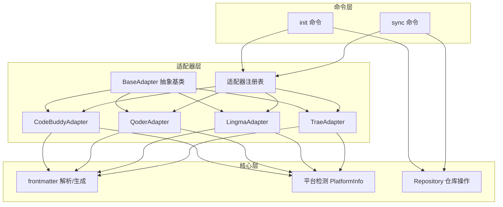
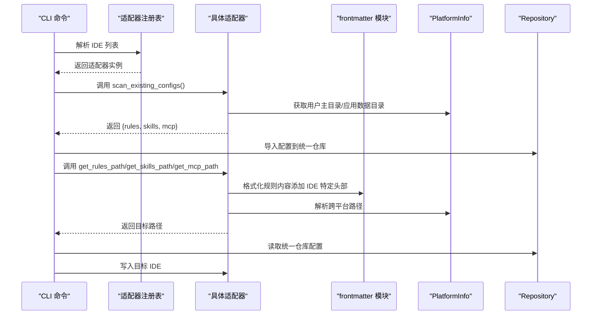
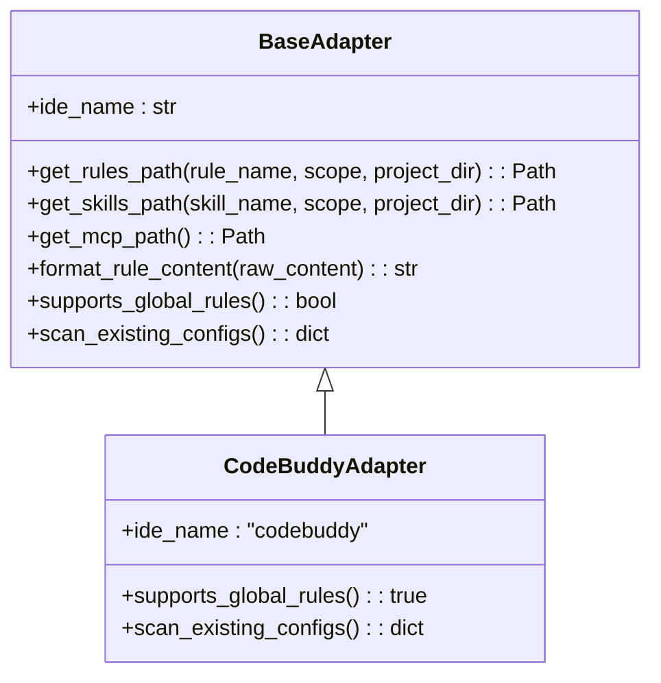
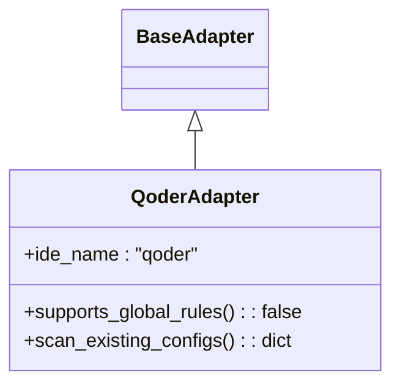
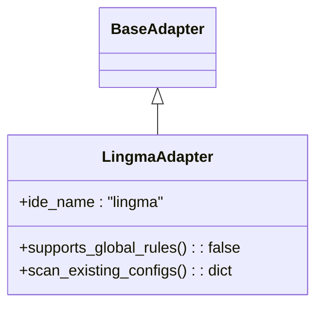
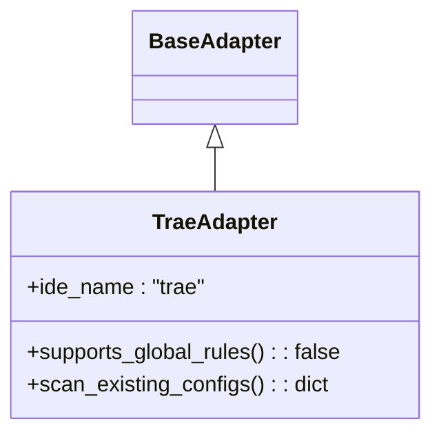
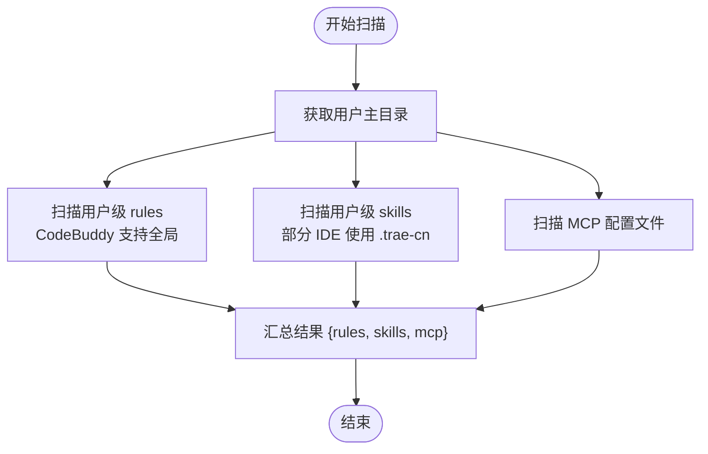
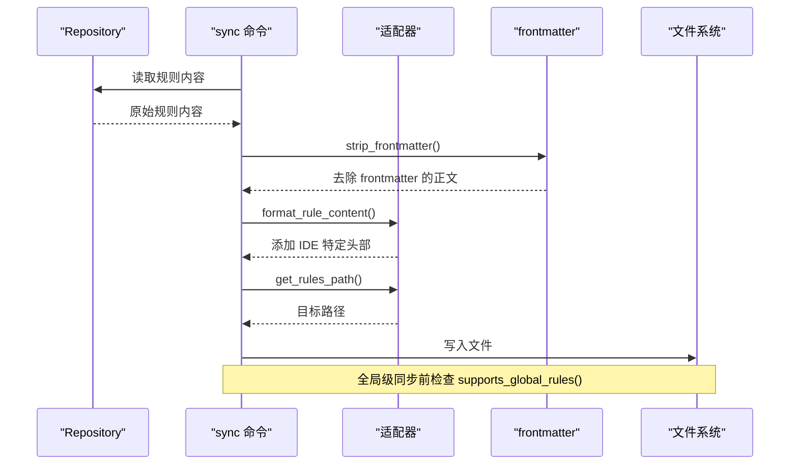
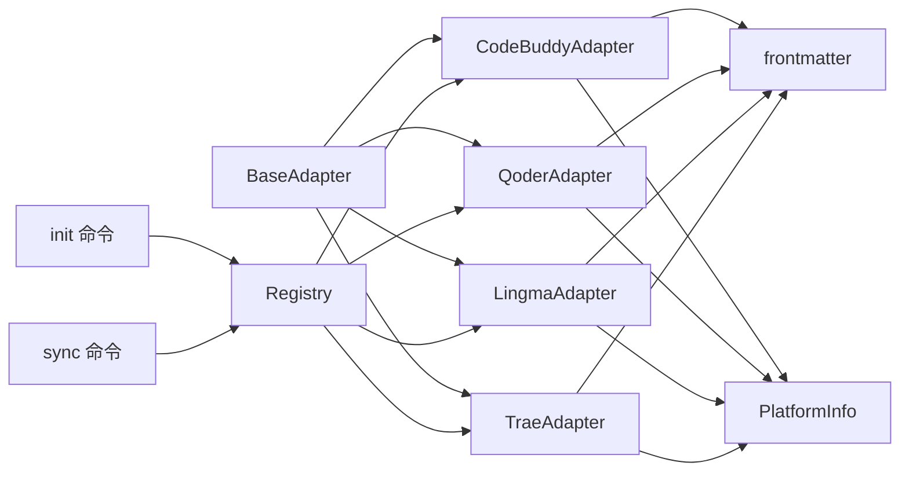

# 具体适配器实现

<cite>
**本文引用的文件**
- [base.py](file://MSR-cli/msr_sync/adapters/base.py)
- [codebuddy.py](file://MSR-cli/msr_sync/adapters/codebuddy.py)
- [qoder.py](file://MSR-cli/msr_sync/adapters/qoder.py)
- [lingma.py](file://MSR-cli/msr_sync/adapters/lingma.py)
- [trae.py](file://MSR-cli/msr_sync/adapters/trae.py)
- [registry.py](file://MSR-cli/msr_sync/adapters/registry.py)
- [frontmatter.py](file://MSR-cli/msr_sync/core/frontmatter.py)
- [platform.py](file://MSR-cli/msr_sync/core/platform.py)
- [init_cmd.py](file://MSR-cli/msr_sync/commands/init_cmd.py)
- [sync_cmd.py](file://MSR-cli/msr_sync/commands/sync_cmd.py)
- [test_codebuddy_adapter.py](file://MSR-cli/tests/test_codebuddy_adapter.py)
- [test_qoder_adapter.py](file://MSR-cli/tests/test_qoder_adapter.py)
- [test_lingma_adapter.py](file://MSR-cli/tests/test_lingma_adapter.py)
- [test_trae_adapter.py](file://MSR-cli/tests/test_trae_adapter.py)
</cite>

## 目录
1. [简介](#简介)
2. [项目结构](#项目结构)
3. [核心组件](#核心组件)
4. [架构总览](#架构总览)
5. [详细组件分析](#详细组件分析)
6. [依赖分析](#依赖分析)
7. [性能考量](#性能考量)
8. [故障排查指南](#故障排查指南)
9. [结论](#结论)
10. [附录](#附录)

## 简介
本文件聚焦于 MSR 项目中具体 IDE 适配器的实现细节，深入分析 CodeBuddy、Qoder、Lingma、Trae 四个适配器的独特特性，涵盖路径解析策略、配置格式转换规则、差异化处理机制、配置扫描实现以及平台兼容性与跨平台路径处理策略。特别强调 CodeBuddy 支持全局 rules 的关键差异，以及各适配器在 MCP 配置合并上的不同处理方式。

## 项目结构
MSR 项目采用“适配器模式 + 注册表 + 命令行驱动”的架构设计：
- 适配器层：定义统一接口并由各 IDE 实现具体逻辑
- 核心层：提供平台检测、frontmatter 解析与生成、仓库操作等通用能力
- 命令层：通过 CLI 命令触发初始化与同步流程，调用适配器完成配置迁移与落地

图表来源
- [base.py:8-105](file://MSR-cli/msr_sync/adapters/base.py#L8-L105)
- [codebuddy.py:22-143](file://MSR-cli/msr_sync/adapters/codebuddy.py#L22-L143)
- [qoder.py:22-140](file://MSR-cli/msr_sync/adapters/qoder.py#L22-L140)
- [lingma.py:22-140](file://MSR-cli/msr_sync/adapters/lingma.py#L22-L140)
- [trae.py:21-138](file://MSR-cli/msr_sync/adapters/trae.py#L21-L138)
- [registry.py:8-89](file://MSR-cli/msr_sync/adapters/registry.py#L8-L89)
- [frontmatter.py:10-164](file://MSR-cli/msr_sync/core/frontmatter.py#L10-L164)
- [platform.py:9-60](file://MSR-cli/msr_sync/core/platform.py#L9-L60)
- [init_cmd.py:13-137](file://MSR-cli/msr_sync/commands/init_cmd.py#L13-L137)
- [sync_cmd.py:26-411](file://MSR-cli/msr_sync/commands/sync_cmd.py#L26-L411)

章节来源
- [base.py:8-105](file://MSR-cli/msr_sync/adapters/base.py#L8-L105)
- [registry.py:8-89](file://MSR-cli/msr_sync/adapters/registry.py#L8-L89)
- [platform.py:9-60](file://MSR-cli/msr_sync/core/platform.py#L9-L60)
- [frontmatter.py:10-164](file://MSR-cli/msr_sync/core/frontmatter.py#L10-L164)
- [init_cmd.py:13-137](file://MSR-cli/msr_sync/commands/init_cmd.py#L13-L137)
- [sync_cmd.py:26-411](file://MSR-cli/msr_sync/commands/sync_cmd.py#L26-L411)

## 核心组件
- 抽象基类 BaseAdapter：定义统一接口，包括路径解析、格式转换、能力查询、配置扫描等职责
- 具体适配器：CodeBuddy、Qoder、Lingma、Trae 分别实现各自的路径解析、格式转换与扫描逻辑
- 注册表 Registry：管理 IDE 名称到适配器类的映射，支持延迟加载与实例缓存
- 平台检测 PlatformInfo：提供跨平台路径解析（主目录、应用数据目录）
- frontmatter 模块：提供统一的 frontmatter 解析与各 IDE 模板头部生成
- 命令层：init 与 sync 命令分别负责配置扫描导入与同步落地

章节来源
- [base.py:8-105](file://MSR-cli/msr_sync/adapters/base.py#L8-L105)
- [registry.py:8-89](file://MSR-cli/msr_sync/adapters/registry.py#L8-L89)
- [platform.py:9-60](file://MSR-cli/msr_sync/core/platform.py#L9-L60)
- [frontmatter.py:10-164](file://MSR-cli/msr_sync/core/frontmatter.py#L10-L164)
- [init_cmd.py:13-137](file://MSR-cli/msr_sync/commands/init_cmd.py#L13-L137)
- [sync_cmd.py:26-411](file://MSR-cli/msr_sync/commands/sync_cmd.py#L26-L411)

## 架构总览
适配器模式将 IDE 差异封装在各自实现中，统一由注册表与命令层调度。初始化阶段通过扫描各 IDE 现有配置导入统一仓库；同步阶段根据仓库内容与适配器规则写入目标 IDE。

图表来源
- [registry.py:46-89](file://MSR-cli/msr_sync/adapters/registry.py#L46-L89)
- [init_cmd.py:44-137](file://MSR-cli/msr_sync/commands/init_cmd.py#L44-L137)
- [sync_cmd.py:133-411](file://MSR-cli/msr_sync/commands/sync_cmd.py#L133-L411)
- [frontmatter.py:110-164](file://MSR-cli/msr_sync/core/frontmatter.py#L110-L164)
- [platform.py:9-60](file://MSR-cli/msr_sync/core/platform.py#L9-L60)

## 详细组件分析

### CodeBuddy 适配器
- 路径解析策略
  - 支持项目级与用户级 rules（唯一支持全局 rules 的 IDE）
  - 项目级 rules/skills 路径位于 <project>/.codebuddy/{rules,skills}/
  - 用户级 rules/skills 路径位于 ~/.codebuddy/{rules,skills}/
  - MCP 路径固定为 ~/.codebuddy/mcp.json（跨平台一致）
- 格式转换规则
  - 为规则内容添加 CodeBuddy frontmatter 模板头部，包含 updatedAt 时间戳、alwaysApply、enabled、description、provider 等字段
- 配置扫描实现
  - 扫描用户级 rules（支持全局）、skills、MCP 文件，返回结构化的配置清单
- 差异化处理机制
  - supports_global_rules() 返回 True，允许全局级同步
- 平台兼容性
  - 使用 PlatformInfo.get_home() 获取用户主目录，MCP 路径在 macOS 与 Windows 相同

图表来源
- [base.py:8-105](file://MSR-cli/msr_sync/adapters/base.py#L8-L105)
- [codebuddy.py:22-143](file://MSR-cli/msr_sync/adapters/codebuddy.py#L22-L143)

章节来源
- [codebuddy.py:22-143](file://MSR-cli/msr_sync/adapters/codebuddy.py#L22-L143)
- [frontmatter.py:128-144](file://MSR-cli/msr_sync/core/frontmatter.py#L128-L144)
- [platform.py:32-60](file://MSR-cli/msr_sync/core/platform.py#L32-L60)
- [test_codebuddy_adapter.py:19-227](file://MSR-cli/tests/test_codebuddy_adapter.py#L19-L227)

### Qoder 适配器
- 路径解析策略
  - 仅支持项目级 rules；当 scope 为 global 时仍返回路径（调用方负责检查 supports_global_rules() 并输出警告）
  - 项目级 rules/skills 路径位于 <project>/.qoder/{rules,skills}/
  - 用户级 skills 路径位于 ~/.qoder/skills/
  - MCP 路径位于 macOS ~/Library/Application Support/Qoder/SharedClientCache/mcp.json 或 Windows %APPDATA%/Qoder/SharedClientCache/mcp.json
- 格式转换规则
  - 为规则内容添加 Qoder frontmatter 模板头部（trigger: always_on）
- 配置扫描实现
  - rules 列表始终为空（不支持全局 rules）
  - 扫描用户级 skills 与 MCP 文件
- 差异化处理机制
  - supports_global_rules() 返回 False，全局级同步将被跳过并提示
- 平台兼容性
  - 使用 PlatformInfo.get_app_support_dir() 获取应用数据目录，MCP 路径随平台变化

图表来源
- [base.py:8-105](file://MSR-cli/msr_sync/adapters/base.py#L8-L105)
- [qoder.py:22-140](file://MSR-cli/msr_sync/adapters/qoder.py#L22-L140)

章节来源
- [qoder.py:22-140](file://MSR-cli/msr_sync/adapters/qoder.py#L22-L140)
- [frontmatter.py:110-117](file://MSR-cli/msr_sync/core/frontmatter.py#L110-L117)
- [platform.py:42-60](file://MSR-cli/msr_sync/core/platform.py#L42-L60)
- [test_qoder_adapter.py:16-192](file://MSR-cli/tests/test_qoder_adapter.py#L16-L192)

### Lingma 适配器
- 路径解析策略
  - 仅支持项目级 rules；当 scope 为 global 时仍返回路径（调用方负责检查 supports_global_rules() 并输出警告）
  - 项目级 rules/skills 路径位于 <project>/.lingma/{rules,skills}/
  - 用户级 skills 路径位于 ~/.lingma/skills/
  - MCP 路径位于 macOS ~/Library/Application Support/Lingma/SharedClientCache/mcp.json 或 Windows %APPDATA%/Lingma/SharedClientCache/mcp.json
- 格式转换规则
  - 为规则内容添加 Lingma frontmatter 模板头部（trigger: always_on）
- 配置扫描实现
  - rules 列表始终为空（不支持全局 rules）
  - 扫描用户级 skills 与 MCP 文件
- 差异化处理机制
  - supports_global_rules() 返回 False，全局级同步将被跳过并提示
- 平台兼容性
  - 使用 PlatformInfo.get_app_support_dir() 获取应用数据目录，MCP 路径随平台变化

图表来源
- [base.py:8-105](file://MSR-cli/msr_sync/adapters/base.py#L8-L105)
- [lingma.py:22-140](file://MSR-cli/msr_sync/adapters/lingma.py#L22-L140)

章节来源
- [lingma.py:22-140](file://MSR-cli/msr_sync/adapters/lingma.py#L22-L140)
- [frontmatter.py:119-126](file://MSR-cli/msr_sync/core/frontmatter.py#L119-L126)
- [platform.py:42-60](file://MSR-cli/msr_sync/core/platform.py#L42-L60)
- [test_lingma_adapter.py:19-195](file://MSR-cli/tests/test_lingma_adapter.py#L19-L195)

### Trae 适配器
- 路径解析策略
  - 仅支持项目级 rules；当 scope 为 global 时仍返回路径（调用方负责检查 supports_global_rules() 并输出警告）
  - 项目级 rules/skills 路径位于 <project>/.trae/{rules,skills}/
  - 用户级 skills 路径位于 ~/.trae-cn/skills/（注意：使用 .trae-cn，而非 .trae）
  - MCP 路径位于 macOS ~/Library/Application Support/Trae CN/User/mcp.json 或 Windows %APPDATA%/Trae CN/User/mcp.json
- 格式转换规则
  - 不添加额外头部，直接返回纯内容
- 配置扫描实现
  - rules 列表始终为空（不支持全局 rules）
  - 扫描用户级 skills（使用 .trae-cn）与 MCP 文件
- 差异化处理机制
  - supports_global_rules() 返回 False，全局级同步将被跳过并提示
- 平台兼容性
  - 使用 PlatformInfo.get_app_support_dir() 获取应用数据目录，MCP 路径随平台变化

图表来源
- [base.py:8-105](file://MSR-cli/msr_sync/adapters/base.py#L8-L105)
- [trae.py:21-138](file://MSR-cli/msr_sync/adapters/trae.py#L21-L138)

章节来源
- [trae.py:21-138](file://MSR-cli/msr_sync/adapters/trae.py#L21-L138)
- [platform.py:42-60](file://MSR-cli/msr_sync/core/platform.py#L42-L60)
- [test_trae_adapter.py:19-204](file://MSR-cli/tests/test_trae_adapter.py#L19-L204)

### 配置扫描实现对比
- CodeBuddy：扫描用户级 rules（支持全局）、skills、MCP
- Qoder：rules 列表为空（不支持全局），扫描用户级 skills、MCP
- Lingma：rules 列表为空（不支持全局），扫描用户级 skills、MCP
- Trae：rules 列表为空（不支持全局），扫描用户级 skills（.trae-cn）、MCP

图表来源
- [codebuddy.py:110-143](file://MSR-cli/msr_sync/adapters/codebuddy.py#L110-L143)
- [qoder.py:108-140](file://MSR-cli/msr_sync/adapters/qoder.py#L108-L140)
- [lingma.py:108-140](file://MSR-cli/msr_sync/adapters/lingma.py#L108-L140)
- [trae.py:106-138](file://MSR-cli/msr_sync/adapters/trae.py#L106-L138)

章节来源
- [codebuddy.py:110-143](file://MSR-cli/msr_sync/adapters/codebuddy.py#L110-L143)
- [qoder.py:108-140](file://MSR-cli/msr_sync/adapters/qoder.py#L108-L140)
- [lingma.py:108-140](file://MSR-cli/msr_sync/adapters/lingma.py#L108-L140)
- [trae.py:106-138](file://MSR-cli/msr_sync/adapters/trae.py#L106-L138)

### 同步流程与规则格式转换
- 规则同步流程
  - 读取统一仓库规则内容，剥离 frontmatter，添加 IDE 特定头部，写入目标路径
  - 全局级同步前检查 supports_global_rules()，不支持则跳过并提示
- MCP 合并流程
  - 读取源 MCP 配置，重写 cwd 路径为仓库路径
  - 读取目标 mcp.json（不存在则新建），合并同名条目时提示覆盖
- Skills 同步流程
  - 目标存在时提示覆盖，不存在则直接拷贝

图表来源
- [sync_cmd.py:179-231](file://MSR-cli/msr_sync/commands/sync_cmd.py#L179-L231)
- [frontmatter.py:10-61](file://MSR-cli/msr_sync/core/frontmatter.py#L10-L61)
- [base.py:65-76](file://MSR-cli/msr_sync/adapters/base.py#L65-L76)

章节来源
- [sync_cmd.py:179-411](file://MSR-cli/msr_sync/commands/sync_cmd.py#L179-L411)
- [frontmatter.py:10-61](file://MSR-cli/msr_sync/core/frontmatter.py#L10-L61)
- [base.py:65-76](file://MSR-cli/msr_sync/adapters/base.py#L65-L76)

## 依赖分析
- 适配器依赖关系
  - 所有适配器继承自 BaseAdapter，实现统一接口
  - CodeBuddy、Qoder、Lingma 依赖 frontmatter 模块生成 IDE 特定头部
  - 四个适配器均依赖 PlatformInfo 进行跨平台路径解析
- 注册表与命令层
  - 注册表负责 IDE 名称到适配器类的延迟加载与实例缓存
  - init 与 sync 命令通过注册表获取适配器实例并调用其方法

图表来源
- [base.py:8-105](file://MSR-cli/msr_sync/adapters/base.py#L8-L105)
- [codebuddy.py:17-20](file://MSR-cli/msr_sync/adapters/codebuddy.py#L17-L20)
- [qoder.py:17-20](file://MSR-cli/msr_sync/adapters/qoder.py#L17-L20)
- [lingma.py:17-20](file://MSR-cli/msr_sync/adapters/lingma.py#L17-L20)
- [trae.py:17-20](file://MSR-cli/msr_sync/adapters/trae.py#L17-L20)
- [registry.py:8-89](file://MSR-cli/msr_sync/adapters/registry.py#L8-L89)
- [init_cmd.py:9-42](file://MSR-cli/msr_sync/commands/init_cmd.py#L9-L42)
- [sync_cmd.py:14-66](file://MSR-cli/msr_sync/commands/sync_cmd.py#L14-L66)

章节来源
- [registry.py:8-89](file://MSR-cli/msr_sync/adapters/registry.py#L8-L89)
- [init_cmd.py:9-42](file://MSR-cli/msr_sync/commands/init_cmd.py#L9-L42)
- [sync_cmd.py:14-66](file://MSR-cli/msr_sync/commands/sync_cmd.py#L14-L66)

## 性能考量
- 路径解析与文件扫描
  - 适配器扫描用户级 rules/skills 时采用迭代目录项并过滤后缀/类型，复杂度近似 O(n)，其中 n 为目录项数量
  - MCP 扫描仅检查文件存在性与大小，避免大文件读取开销
- 同步写入
  - 规则写入为小文件 I/O，成本低
  - Skills 同步涉及目录复制，建议在磁盘空间充足时进行
- 缓存与延迟加载
  - 注册表对适配器实例进行缓存，避免重复创建带来的开销
- 平台检测
  - PlatformInfo 仅在需要时调用，减少不必要的系统调用

## 故障排查指南
- 全局级 rules 同步失败
  - 现象：全局级同步被跳过并提示不支持
  - 原因：Qoder、Lingma、Trae 不支持全局 rules
  - 处理：改为项目级同步或仅在 CodeBuddy 使用全局级
- MCP 配置合并冲突
  - 现象：目标 MCP 中存在同名条目，提示确认覆盖
  - 处理：根据提示选择覆盖或跳过
- 平台不支持异常
  - 现象：在不支持的操作系统上抛出异常
  - 处理：确认当前系统为 macOS 或 Windows；否则扩展 PlatformInfo 支持
- 配置扫描异常
  - 现象：扫描过程中出现异常并跳过
  - 处理：检查用户主目录权限与 IDE 配置目录是否存在

章节来源
- [sync_cmd.py:204-207](file://MSR-cli/msr_sync/commands/sync_cmd.py#L204-L207)
- [sync_cmd.py:324-334](file://MSR-cli/msr_sync/commands/sync_cmd.py#L324-L334)
- [platform.py:12-30](file://MSR-cli/msr_sync/core/platform.py#L12-L30)
- [init_cmd.py:60-64](file://MSR-cli/msr_sync/commands/init_cmd.py#L60-L64)

## 结论
- CodeBuddy 是唯一支持全局 rules 的 IDE 适配器，这使其在统一仓库与多项目场景中具有独特优势
- Qoder、Lingma、Trae 在路径解析与配置扫描上保持一致的“仅支持项目级”策略，MCP 路径随平台变化
- 适配器通过统一接口与注册表实现解耦，frontmatter 模块确保规则内容在不同 IDE 间的一致性
- 命令层在同步前进行能力检查与冲突提示，保证用户体验与数据安全

## 附录
- 配置示例与路径约定（基于适配器实现）
  - CodeBuddy
    - 项目级 rules：项目根目录/.codebuddy/rules/<name>.md
    - 用户级 rules：~/.codebuddy/rules/<name>.md
    - 项目级 skills：项目根目录/.codebuddy/skills/<name>/
    - 用户级 skills：~/.codebuddy/skills/<name>/
    - MCP：~/.codebuddy/mcp.json（跨平台一致）
  - Qoder
    - 项目级 rules：项目根目录/.qoder/rules/<name>.md
    - 项目级 skills：项目根目录/.qoder/skills/<name>/
    - 用户级 skills：~/.qoder/skills/<name>/
    - MCP：~/Library/Application Support/Qoder/SharedClientCache/mcp.json（macOS）或 %APPDATA%/Qoder/SharedClientCache/mcp.json（Windows）
  - Lingma
    - 项目级 rules：项目根目录/.lingma/rules/<name>.md
    - 项目级 skills：项目根目录/.lingma/skills/<name>/
    - 用户级 skills：~/.lingma/skills/<name>/
    - MCP：~/Library/Application Support/Lingma/SharedClientCache/mcp.json（macOS）或 %APPDATA%/Lingma/SharedClientCache/mcp.json（Windows）
  - Trae
    - 项目级 rules：项目根目录/.trae/rules/<name>.md
    - 项目级 skills：项目根目录/.trae/skills/<name>/
    - 用户级 skills：~/.trae-cn/skills/<name>/
    - MCP：~/Library/Application Support/Trae CN/User/mcp.json（macOS）或 %APPDATA%/Trae CN/User/mcp.json（Windows）

章节来源
- [codebuddy.py:5-12](file://MSR-cli/msr_sync/adapters/codebuddy.py#L5-L12)
- [qoder.py:5-12](file://MSR-cli/msr_sync/adapters/qoder.py#L5-L12)
- [lingma.py:5-12](file://MSR-cli/msr_sync/adapters/lingma.py#L5-L12)
- [trae.py:5-12](file://MSR-cli/msr_sync/adapters/trae.py#L5-L12)