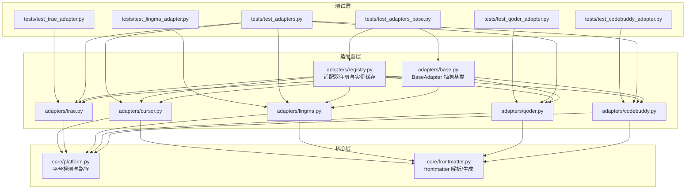
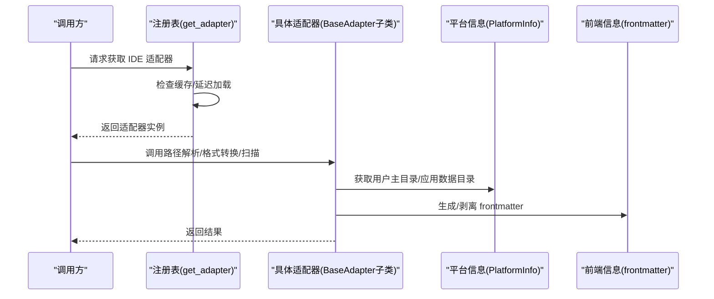
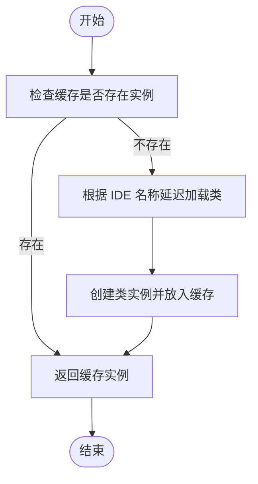
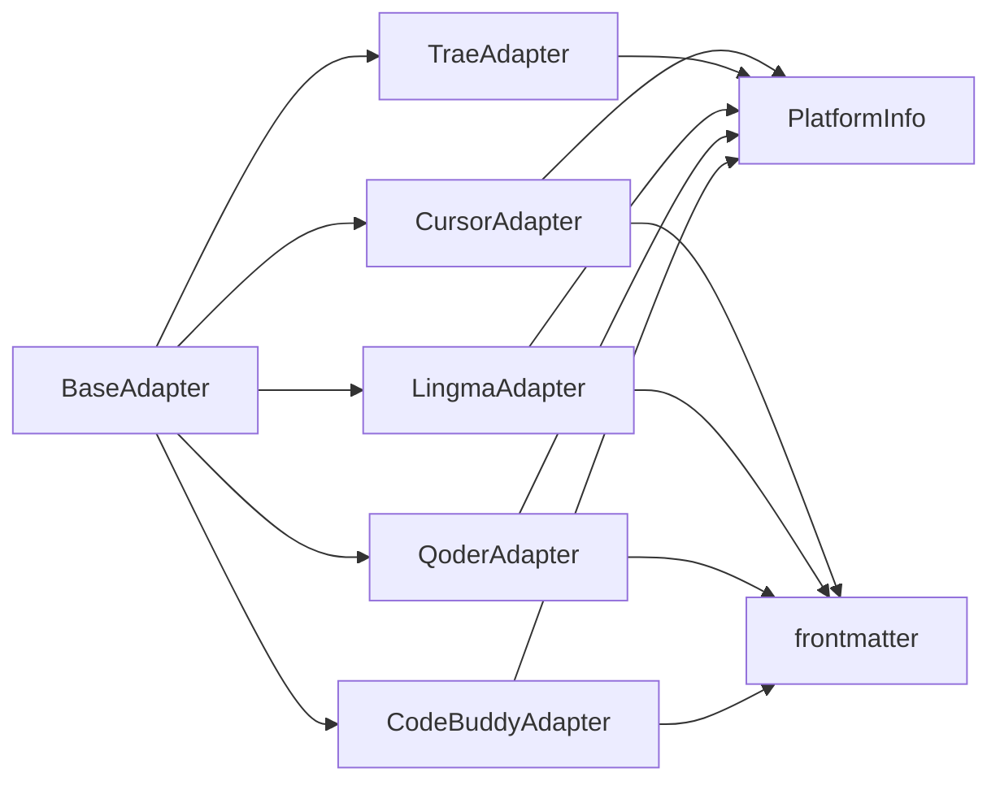

# 适配器开发指南

<cite>
**本文引用的文件**
- [MSR-cli/msr_sync/adapters/base.py](file://MSR-cli/msr_sync/adapters/base.py)
- [MSR-cli/msr_sync/adapters/registry.py](file://MSR-cli/msr_sync/adapters/registry.py)
- [MSR-cli/msr_sync/adapters/codebuddy.py](file://MSR-cli/msr_sync/adapters/codebuddy.py)
- [MSR-cli/msr_sync/adapters/qoder.py](file://MSR-cli/msr_sync/adapters/qoder.py)
- [MSR-cli/msr_sync/adapters/lingma.py](file://MSR-cli/msr_sync/adapters/lingma.py)
- [MSR-cli/msr_sync/adapters/trae.py](file://MSR-cli/msr_sync/adapters/trae.py)
- [MSR-cli/msr_sync/adapters/cursor.py](file://MSR-cli/msr_sync/adapters/cursor.py)
- [MSR-cli/msr_sync/core/platform.py](file://MSR-cli/msr_sync/core/platform.py)
- [MSR-cli/msr_sync/core/frontmatter.py](file://MSR-cli/msr_sync/core/frontmatter.py)
- [MSR-cli/tests/test_adapters_base.py](file://MSR-cli/tests/test_adapters_base.py)
- [MSR-cli/tests/test_adapters.py](file://MSR-cli/tests/test_adapters.py)
- [MSR-cli/tests/test_codebuddy_adapter.py](file://MSR-cli/tests/test_codebuddy_adapter.py)
- [MSR-cli/tests/test_qoder_adapter.py](file://MSR-cli/tests/test_qoder_adapter.py)
- [MSR-cli/tests/test_lingma_adapter.py](file://MSR-cli/tests/test_lingma_adapter.py)
- [MSR-cli/tests/test_trae_adapter.py](file://MSR-cli/tests/test_trae_adapter.py)
- [MSR-cli/pyproject.toml](file://MSR-cli/pyproject.toml)
</cite>

## 目录
1. [简介](#简介)
2. [项目结构](#项目结构)
3. [核心组件](#核心组件)
4. [架构总览](#架构总览)
5. [详细组件分析](#详细组件分析)
6. [依赖分析](#依赖分析)
7. [性能考虑](#性能考虑)
8. [故障排查指南](#故障排查指南)
9. [结论](#结论)
10. [附录](#附录)

## 简介
本指南面向希望为多款 AI IDE 实现“规则（rules）”“技能（skills）”“MCP 配置”同步能力的开发者。通过实现 BaseAdapter 接口，结合平台信息与前端信息工具，可为不同 IDE 提供一致的路径解析、格式转换与配置扫描能力。文档覆盖从环境准备、接口实现、测试验证到注册集成的全流程，并提供模板与示例，帮助你快速完成新 IDE 适配器的开发。

## 项目结构
MSR 项目采用分层组织：适配器层负责 IDE 差异化逻辑；核心层提供平台检测与 frontmatter 处理；测试层覆盖单元测试与跨适配器属性测试。

图表来源
- [MSR-cli/msr_sync/adapters/base.py:8-105](file://MSR-cli/msr_sync/adapters/base.py#L8-L105)
- [MSR-cli/msr_sync/adapters/registry.py:1-89](file://MSR-cli/msr_sync/adapters/registry.py#L1-L89)
- [MSR-cli/msr_sync/adapters/codebuddy.py:1-143](file://MSR-cli/msr_sync/adapters/codebuddy.py#L1-L143)
- [MSR-cli/msr_sync/adapters/qoder.py:1-140](file://MSR-cli/msr_sync/adapters/qoder.py#L1-L140)
- [MSR-cli/msr_sync/adapters/lingma.py:1-140](file://MSR-cli/msr_sync/adapters/lingma.py#L1-L140)
- [MSR-cli/msr_sync/adapters/trae.py:1-138](file://MSR-cli/msr_sync/adapters/trae.py#L1-L138)
- [MSR-cli/msr_sync/adapters/cursor.py:1-133](file://MSR-cli/msr_sync/adapters/cursor.py#L1-L133)
- [MSR-cli/msr_sync/core/platform.py:9-60](file://MSR-cli/msr_sync/core/platform.py#L9-L60)
- [MSR-cli/msr_sync/core/frontmatter.py:1-164](file://MSR-cli/msr_sync/core/frontmatter.py#L1-L164)
- [MSR-cli/tests/test_adapters_base.py:1-206](file://MSR-cli/tests/test_adapters_base.py#L1-L206)
- [MSR-cli/tests/test_adapters.py:1-530](file://MSR-cli/tests/test_adapters.py#L1-L530)
- [MSR-cli/tests/test_codebuddy_adapter.py:1-227](file://MSR-cli/tests/test_codebuddy_adapter.py#L1-L227)
- [MSR-cli/tests/test_qoder_adapter.py:1-192](file://MSR-cli/tests/test_qoder_adapter.py#L1-L192)
- [MSR-cli/tests/test_lingma_adapter.py:1-195](file://MSR-cli/tests/test_lingma_adapter.py#L1-L195)
- [MSR-cli/tests/test_trae_adapter.py:1-204](file://MSR-cli/tests/test_trae_adapter.py#L1-L204)

章节来源
- [MSR-cli/msr_sync/adapters/base.py:1-105](file://MSR-cli/msr_sync/adapters/base.py#L1-L105)
- [MSR-cli/msr_sync/adapters/registry.py:1-89](file://MSR-cli/msr_sync/adapters/registry.py#L1-L89)

## 核心组件
- BaseAdapter 抽象基类：定义适配器必须实现的接口，包括路径解析（rules/skills/MCP）、格式转换（规则内容模板头部）、能力查询（是否支持全局 rules）、配置扫描（用于初始化合并）。
- 适配器注册表：集中管理 IDE 名称到适配器类的映射，支持延迟加载与实例缓存，提供按名称解析与批量解析的能力。
- 平台信息：封装操作系统识别、用户主目录与应用数据目录的获取，为各 IDE 的路径解析提供统一入口。
- 前端信息：提供 frontmatter 的剥离与生成，以及各 IDE 的模板头部生成函数。

章节来源
- [MSR-cli/msr_sync/adapters/base.py:8-105](file://MSR-cli/msr_sync/adapters/base.py#L8-L105)
- [MSR-cli/msr_sync/adapters/registry.py:22-89](file://MSR-cli/msr_sync/adapters/registry.py#L22-L89)
- [MSR-cli/msr_sync/core/platform.py:9-60](file://MSR-cli/msr_sync/core/platform.py#L9-L60)
- [MSR-cli/msr_sync/core/frontmatter.py:10-164](file://MSR-cli/msr_sync/core/frontmatter.py#L10-L164)

## 架构总览
适配器开发遵循“抽象接口 + 具体实现 + 注册表 + 工具层”的分层设计。调用方通过注册表按 IDE 名称获取适配器实例，再调用其路径解析、格式转换与扫描方法。

图表来源
- [MSR-cli/msr_sync/adapters/registry.py:46-89](file://MSR-cli/msr_sync/adapters/registry.py#L46-L89)
- [MSR-cli/msr_sync/adapters/base.py:25-105](file://MSR-cli/msr_sync/adapters/base.py#L25-L105)
- [MSR-cli/msr_sync/core/platform.py:32-60](file://MSR-cli/msr_sync/core/platform.py#L32-L60)
- [MSR-cli/msr_sync/core/frontmatter.py:110-164](file://MSR-cli/msr_sync/core/frontmatter.py#L110-L164)

## 详细组件分析

### BaseAdapter 接口详解与实现要点
- 抽象属性与方法
  - ide_name：返回 IDE 标识名称，用于注册表与日志输出。
  - 路径解析
    - get_rules_path(rule_name, scope, project_dir)：返回规则文件目标路径。scope 为 "project" 或 "global"；project_dir 仅在项目级时提供。
    - get_skills_path(skill_name, scope, project_dir)：返回技能目录目标路径。
    - get_mcp_path()：返回 MCP 配置文件路径。
  - 格式转换
    - format_rule_content(raw_content)：对剥离 frontmatter 的纯 Markdown 内容添加 IDE 特定的模板头部。
  - 能力查询
    - supports_global_rules()：默认 False；仅 CodeBuddy 支持全局 rules。
  - 配置扫描
    - scan_existing_configs()：返回包含 "rules"/"skills"/"mcp" 的字典，用于初始化合并。

- 最佳实践
  - 路径解析：严格区分项目级与全局级，确保在 global 且不支持时给出明确提示或行为约束。
  - 格式转换：保证不破坏原始内容，仅追加必要头部；时间戳等字段使用 UTC。
  - 扫描逻辑：遍历目录时仅收集有效条目（文件/目录），忽略无关扩展名；MCP 文件存在性检测需健壮。
  - 异常处理：对平台不支持的场景（如 macOS/Windows 路径）进行降级或忽略，避免中断流程。

章节来源
- [MSR-cli/msr_sync/adapters/base.py:18-105](file://MSR-cli/msr_sync/adapters/base.py#L18-L105)

### 适配器实现模板与示例
- 模板骨架
  - 继承 BaseAdapter，实现 ide_name、路径解析、格式转换、能力查询、配置扫描。
  - 路径解析中使用 PlatformInfo.get_home()/get_app_support_dir() 获取平台特定路径。
  - 格式转换中使用 frontmatter 模块提供的生成函数（如 build_codebuddy_header/build_cursor_header）或直接返回原始内容。
- 示例参考
  - CodeBuddy：支持全局 rules，MCP 跨平台统一路径，规则头部包含时间戳字段。
  - Qoder/Lingma：不支持全局 rules，MCP 路径位于应用数据目录，规则头部统一为 trigger: always_on。
  - Trae：不支持全局 rules，用户级 skills 使用 .trae-cn 目录，MCP 路径位于应用数据目录，规则不添加头部。
  - Cursor：不支持用户级 rules（但路径解析保持一致），MCP 跨平台统一路径，规则头部包含时间戳字段。

章节来源
- [MSR-cli/msr_sync/adapters/codebuddy.py:22-143](file://MSR-cli/msr_sync/adapters/codebuddy.py#L22-L143)
- [MSR-cli/msr_sync/adapters/qoder.py:22-140](file://MSR-cli/msr_sync/adapters/qoder.py#L22-L140)
- [MSR-cli/msr_sync/adapters/lingma.py:22-140](file://MSR-cli/msr_sync/adapters/lingma.py#L22-L140)
- [MSR-cli/msr_sync/adapters/trae.py:21-138](file://MSR-cli/msr_sync/adapters/trae.py#L21-L138)
- [MSR-cli/msr_sync/adapters/cursor.py:21-133](file://MSR-cli/msr_sync/adapters/cursor.py#L21-L133)

### 平台与前端信息工具
- 平台信息
  - get_os()：返回 "macos" 或 "windows"，否则抛出不支持平台异常。
  - get_home()：返回用户主目录。
  - get_app_support_dir()：macOS 返回 Library/Application Support，Windows 返回 AppData/Roaming。
- 前端信息
  - strip_frontmatter()/parse_frontmatter()：剥离/解析 YAML frontmatter。
  - build_qoder_header()/build_lingma_header()/build_codebuddy_header()/build_cursor_header()：生成各 IDE 的模板头部。

章节来源
- [MSR-cli/msr_sync/core/platform.py:9-60](file://MSR-cli/msr_sync/core/platform.py#L9-L60)
- [MSR-cli/msr_sync/core/frontmatter.py:10-164](file://MSR-cli/msr_sync/core/frontmatter.py#L10-L164)

### 适配器注册与解析流程
- 注册表维护 IDE 名称到模块路径与类名的映射，支持延迟加载与实例缓存。
- get_adapter(ide_name)：按名称获取适配器实例，内部缓存避免重复创建。
- resolve_ide_list(ide_names)：支持 "all" 展开为所有已注册适配器，或指定多个 IDE 名称。

图表来源
- [MSR-cli/msr_sync/adapters/registry.py:46-89](file://MSR-cli/msr_sync/adapters/registry.py#L46-L89)

章节来源
- [MSR-cli/msr_sync/adapters/registry.py:1-89](file://MSR-cli/msr_sync/adapters/registry.py#L1-L89)

### 路径解析与 IDE 差异
- 项目级与全局级路径差异
  - 项目级：通常位于 <project>/.<ide>/...，需要传入 project_dir。
  - 全局级：通常位于 ~/.<ide>/...，部分 IDE 使用特殊目录（如 Trae 的 .trae-cn）。
- 平台差异
  - macOS：应用数据目录为 Library/Application Support。
  - Windows：应用数据目录为 AppData/Roaming。
- MCP 路径
  - 部分 IDE 跨平台统一（如 CodeBuddy/Cursor），部分位于应用数据目录（如 Qoder/Lingma/Trae）。

章节来源
- [MSR-cli/tests/test_adapters.py:47-88](file://MSR-cli/tests/test_adapters.py#L47-L88)
- [MSR-cli/tests/test_codebuddy_adapter.py:72-104](file://MSR-cli/tests/test_codebuddy_adapter.py#L72-L104)
- [MSR-cli/tests/test_qoder_adapter.py:60-98](file://MSR-cli/tests/test_qoder_adapter.py#L60-L98)
- [MSR-cli/tests/test_lingma_adapter.py:63-101](file://MSR-cli/tests/test_lingma_adapter.py#L63-L101)
- [MSR-cli/tests/test_trae_adapter.py:72-110](file://MSR-cli/tests/test_trae_adapter.py#L72-L110)

### 格式转换与头部规范
- Qoder/Lingma：添加 trigger: always_on 头部。
- Trae：不添加头部，直接返回原始内容。
- CodeBuddy/Cursor：添加包含时间戳、启用状态等字段的头部。

章节来源
- [MSR-cli/tests/test_adapters.py:466-530](file://MSR-cli/tests/test_adapters.py#L466-L530)
- [MSR-cli/tests/test_codebuddy_adapter.py:106-138](file://MSR-cli/tests/test_codebuddy_adapter.py#L106-L138)
- [MSR-cli/tests/test_qoder_adapter.py:100-121](file://MSR-cli/tests/test_qoder_adapter.py#L100-L121)
- [MSR-cli/tests/test_lingma_adapter.py:103-122](file://MSR-cli/tests/test_lingma_adapter.py#L103-L122)
- [MSR-cli/tests/test_trae_adapter.py:112-131](file://MSR-cli/tests/test_trae_adapter.py#L112-L131)

## 依赖分析
- 组件耦合
  - 适配器实现依赖 BaseAdapter 接口契约，确保调用方行为一致。
  - 适配器实现依赖 PlatformInfo 进行路径解析，依赖 frontmatter 模块进行内容处理。
  - 注册表通过模块导入实现延迟加载，降低启动成本。
- 外部依赖
  - Python 标准库（pathlib、typing、abc 等）。
  - 可选测试依赖（pytest、hypothesis）。

图表来源
- [MSR-cli/msr_sync/adapters/base.py:8-105](file://MSR-cli/msr_sync/adapters/base.py#L8-L105)
- [MSR-cli/msr_sync/adapters/codebuddy.py:14-20](file://MSR-cli/msr_sync/adapters/codebuddy.py#L14-L20)
- [MSR-cli/msr_sync/adapters/qoder.py:14-20](file://MSR-cli/msr_sync/adapters/qoder.py#L14-L20)
- [MSR-cli/msr_sync/adapters/lingma.py:14-20](file://MSR-cli/msr_sync/adapters/lingma.py#L14-L20)
- [MSR-cli/msr_sync/adapters/trae.py:14-19](file://MSR-cli/msr_sync/adapters/trae.py#L14-L19)
- [MSR-cli/msr_sync/adapters/cursor.py:13-19](file://MSR-cli/msr_sync/adapters/cursor.py#L13-L19)
- [MSR-cli/msr_sync/core/platform.py:9-60](file://MSR-cli/msr_sync/core/platform.py#L9-L60)
- [MSR-cli/msr_sync/core/frontmatter.py:10-164](file://MSR-cli/msr_sync/core/frontmatter.py#L10-L164)

章节来源
- [MSR-cli/msr_sync/adapters/registry.py:1-89](file://MSR-cli/msr_sync/adapters/registry.py#L1-L89)
- [MSR-cli/pyproject.toml:18-27](file://MSR-cli/pyproject.toml#L18-L27)

## 性能考虑
- 实例缓存：注册表对适配器实例进行缓存，避免重复创建与导入，提升批量操作性能。
- 路径解析：优先使用平台信息工具，减少手工拼接带来的错误与开销。
- 扫描策略：目录遍历时仅收集有效条目，避免不必要的 I/O；对不存在的目录短路返回。
- 格式转换：头部生成使用固定模板，避免复杂计算；对空内容快速返回。

## 故障排查指南
- 不支持的 IDE 名称
  - 现象：获取适配器时报错，提示不支持的 IDE。
  - 处理：确认 IDE 名称是否在注册表中，或是否已实现对应模块。
- 平台不支持
  - 现象：调用平台信息接口抛出不支持平台异常。
  - 处理：确认运行环境为 macOS 或 Windows；如为其他平台，需扩展平台检测逻辑。
- 路径解析异常
  - 现象：规则/技能/MCP 路径不符合预期。
  - 处理：核对项目级与全局级路径约定；检查平台目录映射是否正确。
- MCP 扫描失败
  - 现象：MCP 文件未被识别。
  - 处理：确认 IDE 的 MCP 路径是否位于应用数据目录或用户目录；检查文件存在性与权限。
- 单元测试失败
  - 现象：测试用例断言失败。
  - 处理：对照测试用例中的期望路径与头部格式，逐项比对实现；使用 mock 替换平台信息以隔离环境差异。

章节来源
- [MSR-cli/tests/test_adapters_base.py:152-206](file://MSR-cli/tests/test_adapters_base.py#L152-L206)
- [MSR-cli/tests/test_adapters.py:236-240](file://MSR-cli/tests/test_adapters.py#L236-L240)
- [MSR-cli/tests/test_codebuddy_adapter.py:140-227](file://MSR-cli/tests/test_codebuddy_adapter.py#L140-L227)
- [MSR-cli/tests/test_qoder_adapter.py:121-192](file://MSR-cli/tests/test_qoder_adapter.py#L121-L192)
- [MSR-cli/tests/test_lingma_adapter.py:124-195](file://MSR-cli/tests/test_lingma_adapter.py#L124-L195)
- [MSR-cli/tests/test_trae_adapter.py:133-204](file://MSR-cli/tests/test_trae_adapter.py#L133-L204)

## 结论
通过实现 BaseAdapter 接口并遵循平台与前端信息工具的约定，可以为任意 IDE 提供一致的路径解析、格式转换与配置扫描能力。借助注册表的延迟加载与缓存机制，既能保证扩展性又能兼顾性能。建议在开发过程中以现有适配器为参照，严格遵循测试用例中的路径与头部规范，确保跨平台与跨 IDE 的一致性。

## 附录

### 适配器开发流程清单
- 环境准备
  - 安装项目依赖（Click、PyYAML）与可选测试依赖（pytest、hypothesis）。
- 接口实现
  - 新建适配器文件，继承 BaseAdapter，实现 ide_name、路径解析、格式转换、能力查询、配置扫描。
  - 使用 PlatformInfo 获取平台特定路径；使用 frontmatter 模块生成头部。
- 测试验证
  - 编写单元测试，覆盖路径解析、头部生成、扫描逻辑与边界条件。
  - 运行跨适配器属性测试，确保符合统一规范。
- 注册集成
  - 在注册表中添加 IDE 名称到模块路径与类名的映射。
  - 使用 resolve_ide_list("all") 或指定 IDE 名称进行批量解析。
- 发布与运行
  - 通过 CLI 脚本调用适配器功能；确保安装与脚本入口可用。

章节来源
- [MSR-cli/pyproject.toml:18-37](file://MSR-cli/pyproject.toml#L18-L37)
- [MSR-cli/msr_sync/adapters/registry.py:10-16](file://MSR-cli/msr_sync/adapters/registry.py#L10-L16)
- [MSR-cli/tests/test_adapters.py:175-186](file://MSR-cli/tests/test_adapters.py#L175-L186)