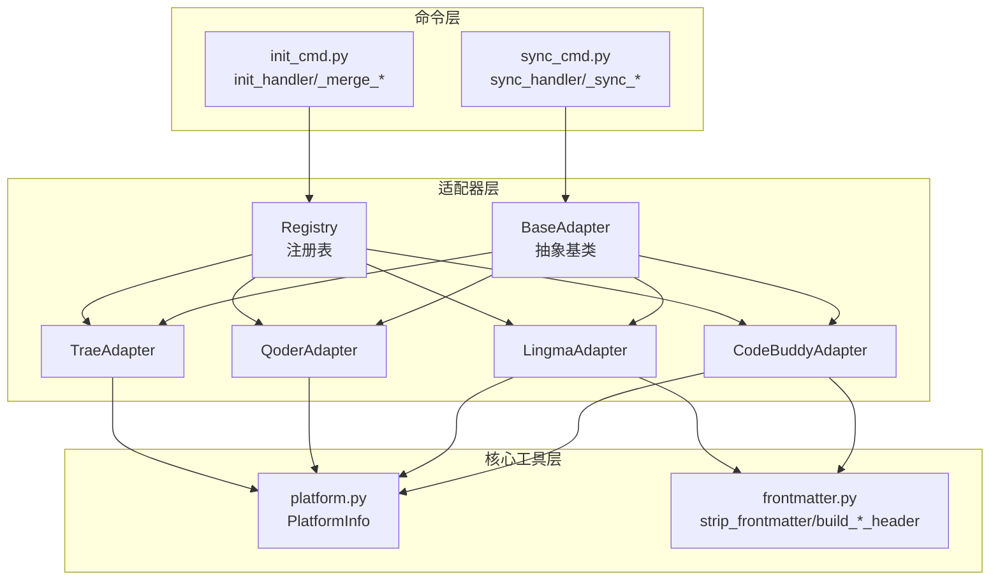
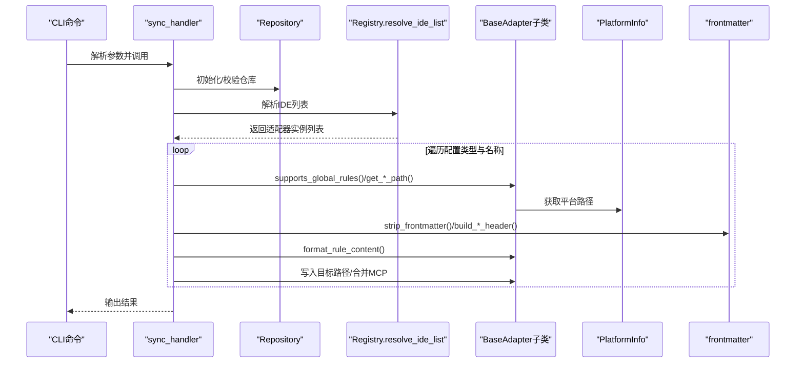
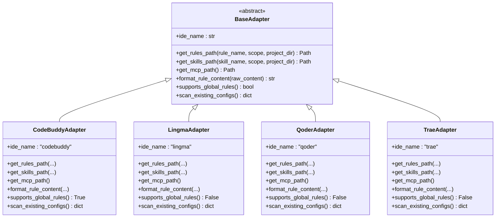
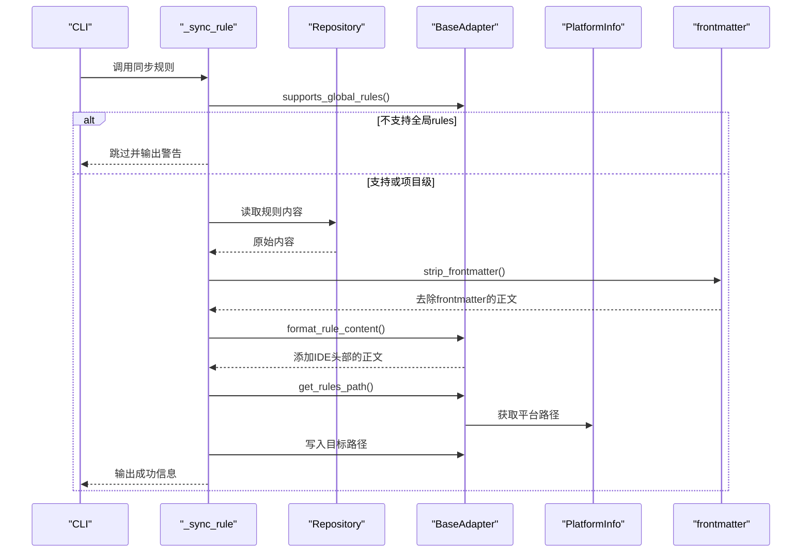
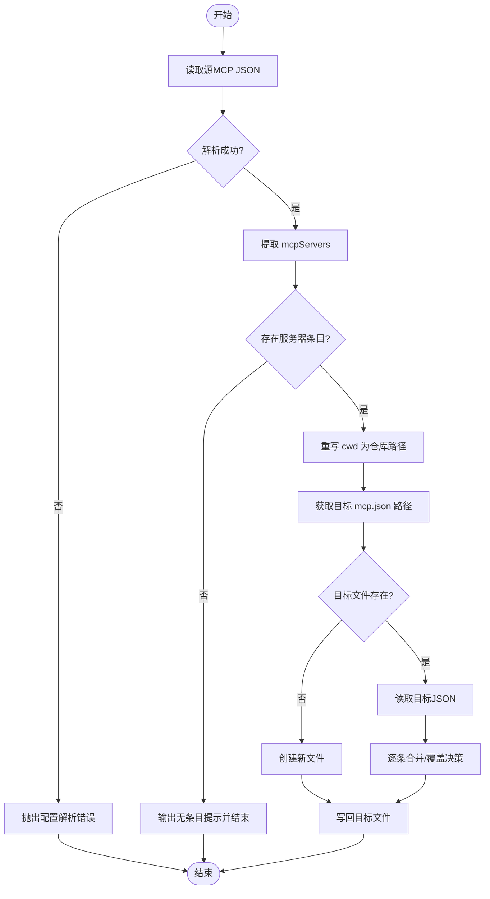
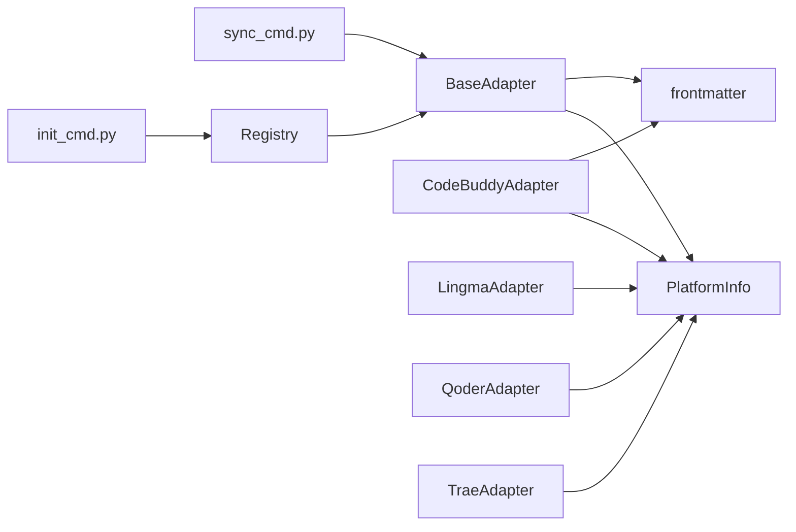

# 适配器架构设计

<cite>
**本文档引用的文件**
- [MSR-cli/msr_sync/adapters/base.py](file://MSR-cli/msr_sync/adapters/base.py)
- [MSR-cli/msr_sync/adapters/registry.py](file://MSR-cli/msr_sync/adapters/registry.py)
- [MSR-cli/msr_sync/adapters/codebuddy.py](file://MSR-cli/msr_sync/adapters/codebuddy.py)
- [MSR-cli/msr_sync/adapters/lingma.py](file://MSR-cli/msr_sync/adapters/lingma.py)
- [MSR-cli/msr_sync/adapters/qoder.py](file://MSR-cli/msr_sync/adapters/qoder.py)
- [MSR-cli/msr_sync/adapters/trae.py](file://MSR-cli/msr_sync/adapters/trae.py)
- [MSR-cli/msr_sync/commands/sync_cmd.py](file://MSR-cli/msr_sync/commands/sync_cmd.py)
- [MSR-cli/msr_sync/commands/init_cmd.py](file://MSR-cli/msr_sync/commands/init_cmd.py)
- [MSR-cli/msr_sync/core/platform.py](file://MSR-cli/msr_sync/core/platform.py)
- [MSR-cli/msr_sync/core/frontmatter.py](file://MSR-cli/msr_sync/core/frontmatter.py)
- [MSR-cli/tests/test_adapters_base.py](file://MSR-cli/tests/test_adapters_base.py)
- [MSR-cli/tests/test_adapters.py](file://MSR-cli/tests/test_adapters.py)
</cite>

## 目录
1. [引言](#引言)
2. [项目结构](#项目结构)
3. [核心组件](#核心组件)
4. [架构总览](#架构总览)
5. [详细组件分析](#详细组件分析)
6. [依赖关系分析](#依赖关系分析)
7. [性能考虑](#性能考虑)
8. [故障排除指南](#故障排除指南)
9. [结论](#结论)
10. [附录](#附录)

## 引言
本文件系统性阐述MSR-v2项目中“适配器架构”的设计与实现，重点围绕BaseAdapter抽象基类及其在多IDE（CodeBuddy、Lingma、Qoder、Trae）上的应用。适配器模式在此项目中的价值在于：
- 将“统一配置管理”与“IDE特定实现”解耦，使核心业务逻辑（如同步、初始化、MCP合并）无需关心具体IDE差异；
- 通过注册表机制实现IDE的动态发现与延迟加载，提升可扩展性；
- 通过统一接口规范（路径解析、格式转换、能力查询、配置扫描）保障跨IDE行为一致性。

## 项目结构
MSR-cli的适配器层位于msr_sync/adapters目录，包含抽象基类、注册表、四个具体适配器实现，以及与之协作的命令处理器、平台检测与frontmatter工具模块。

图表来源
- [MSR-cli/msr_sync/adapters/base.py:1-105](file://MSR-cli/msr_sync/adapters/base.py#L1-L105)
- [MSR-cli/msr_sync/adapters/registry.py:1-88](file://MSR-cli/msr_sync/adapters/registry.py#L1-L88)
- [MSR-cli/msr_sync/adapters/codebuddy.py:1-143](file://MSR-cli/msr_sync/adapters/codebuddy.py#L1-L143)
- [MSR-cli/msr_sync/adapters/lingma.py:1-140](file://MSR-cli/msr_sync/adapters/lingma.py#L1-L140)
- [MSR-cli/msr_sync/adapters/qoder.py:1-140](file://MSR-cli/msr_sync/adapters/qoder.py#L1-L140)
- [MSR-cli/msr_sync/adapters/trae.py:1-138](file://MSR-cli/msr_sync/adapters/trae.py#L1-L138)
- [MSR-cli/msr_sync/commands/sync_cmd.py:1-411](file://MSR-cli/msr_sync/commands/sync_cmd.py#L1-L411)
- [MSR-cli/msr_sync/commands/init_cmd.py:1-137](file://MSR-cli/msr_sync/commands/init_cmd.py#L1-L137)
- [MSR-cli/msr_sync/core/platform.py:1-60](file://MSR-cli/msr_sync/core/platform.py#L1-L60)
- [MSR-cli/msr_sync/core/frontmatter.py:1-145](file://MSR-cli/msr_sync/core/frontmatter.py#L1-L145)

章节来源
- [MSR-cli/msr_sync/adapters/base.py:1-105](file://MSR-cli/msr_sync/adapters/base.py#L1-L105)
- [MSR-cli/msr_sync/adapters/registry.py:1-88](file://MSR-cli/msr_sync/adapters/registry.py#L1-L88)

## 核心组件
- BaseAdapter（抽象基类）：定义统一接口契约，包括路径解析、格式转换、能力查询、配置扫描四类方法，确保所有IDE适配器遵循一致的行为规范。
- 四个具体适配器：分别实现不同IDE的路径约定、头部模板与扫描策略。
- 注册表（Registry）：提供IDE名称到适配器类的延迟加载与实例缓存，支持“all”展开与错误处理。
- 命令处理器：sync_cmd与init_cmd通过适配器完成跨IDE的配置同步与导入。
- 平台检测与frontmatter工具：为适配器提供跨平台路径与头部模板生成能力。

章节来源
- [MSR-cli/msr_sync/adapters/base.py:8-105](file://MSR-cli/msr_sync/adapters/base.py#L8-L105)
- [MSR-cli/msr_sync/adapters/codebuddy.py:22-143](file://MSR-cli/msr_sync/adapters/codebuddy.py#L22-L143)
- [MSR-cli/msr_sync/adapters/lingma.py:22-140](file://MSR-cli/msr_sync/adapters/lingma.py#L22-L140)
- [MSR-cli/msr_sync/adapters/qoder.py:22-140](file://MSR-cli/msr_sync/adapters/qoder.py#L22-L140)
- [MSR-cli/msr_sync/adapters/trae.py:21-138](file://MSR-cli/msr_sync/adapters/trae.py#L21-L138)
- [MSR-cli/msr_sync/adapters/registry.py:45-88](file://MSR-cli/msr_sync/adapters/registry.py#L45-L88)
- [MSR-cli/msr_sync/commands/sync_cmd.py:26-131](file://MSR-cli/msr_sync/commands/sync_cmd.py#L26-L131)
- [MSR-cli/msr_sync/commands/init_cmd.py:13-137](file://MSR-cli/msr_sync/commands/init_cmd.py#L13-L137)
- [MSR-cli/msr_sync/core/platform.py:9-60](file://MSR-cli/msr_sync/core/platform.py#L9-L60)
- [MSR-cli/msr_sync/core/frontmatter.py:10-145](file://MSR-cli/msr_sync/core/frontmatter.py#L10-L145)

## 架构总览
适配器架构采用“抽象接口 + 具体实现 + 注册表 + 命令编排”的分层设计，核心流程如下：
- 命令层解析用户输入，调用注册表解析IDE列表；
- 注册表延迟加载适配器类并缓存实例；
- 适配器提供统一接口，命令层按需调用（路径解析、格式转换、能力查询、配置扫描）；
- 平台检测与frontmatter工具为适配器提供跨平台与头部模板支持。

图表来源
- [MSR-cli/msr_sync/commands/sync_cmd.py:26-131](file://MSR-cli/msr_sync/commands/sync_cmd.py#L26-L131)
- [MSR-cli/msr_sync/adapters/registry.py:74-88](file://MSR-cli/msr_sync/adapters/registry.py#L74-L88)
- [MSR-cli/msr_sync/core/platform.py:9-60](file://MSR-cli/msr_sync/core/platform.py#L9-L60)
- [MSR-cli/msr_sync/core/frontmatter.py:10-145](file://MSR-cli/msr_sync/core/frontmatter.py#L10-L145)

## 详细组件分析

### BaseAdapter抽象基类设计
BaseAdapter定义了适配器必须实现的统一接口，并提供部分默认行为：
- 核心接口
  - 路径解析：get_rules_path、get_skills_path、get_mcp_path
  - 格式转换：format_rule_content
  - 能力查询：supports_global_rules（默认False）
  - 配置扫描：scan_existing_configs
- 设计考量
  - 通过抽象方法强制子类实现关键行为，保证一致性；
  - supports_global_rules提供默认实现，子类可选择覆盖；
  - 所有路径接口均返回Path对象，便于上层统一处理；
  - scan_existing_configs返回标准化字典，便于初始化合并流程消费。

章节来源
- [MSR-cli/msr_sync/adapters/base.py:8-105](file://MSR-cli/msr_sync/adapters/base.py#L8-L105)

### 适配器注册表（Registry）
- 功能
  - 延迟加载：按需导入模块并获取类；
  - 实例缓存：避免重复创建，提升性能；
  - IDE解析：支持('all',)展开与具体名称解析；
  - 错误处理：对未知IDE抛出明确异常。
- 关键实现
  - _ADAPTER_REGISTRY维护IDE名称到模块路径与类名的映射；
  - get_adapter与get_all_adapters提供实例获取；
  - resolve_ide_list支持'all'展开与错误处理。

章节来源
- [MSR-cli/msr_sync/adapters/registry.py:10-88](file://MSR-cli/msr_sync/adapters/registry.py#L10-L88)

### CodeBuddy适配器
- 路径约定
  - 支持全局级rules（唯一支持的IDE）；
  - 项目级与全局级rules/skills路径均遵循约定；
  - MCP路径跨平台统一为用户主目录下的.mcp.json。
- 格式转换
  - 为规则内容添加CodeBuddy特有的frontmatter头部（含时间戳等字段）。
- 能力查询
  - supports_global_rules返回True。
- 配置扫描
  - 扫描用户级rules/skills与MCP文件，返回标准化字典。

章节来源
- [MSR-cli/msr_sync/adapters/codebuddy.py:1-143](file://MSR-cli/msr_sync/adapters/codebuddy.py#L1-L143)
- [MSR-cli/msr_sync/core/frontmatter.py:128-145](file://MSR-cli/msr_sync/core/frontmatter.py#L128-L145)

### Lingma适配器
- 路径约定
  - 仅支持项目级rules；全局级rules返回用户主目录路径（由调用方检查能力）；
  - 全局级skills路径位于用户主目录；
  - MCP路径位于Application Support（macOS）或AppData（Windows）下的IDE专用子目录。
- 格式转换
  - 为规则内容添加trigger: always_on的头部。
- 能力查询
  - supports_global_rules返回False。
- 配置扫描
  - 扫描用户级skills与MCP文件；全局级rules列表为空。

章节来源
- [MSR-cli/msr_sync/adapters/lingma.py:1-140](file://MSR-cli/msr_sync/adapters/lingma.py#L1-L140)
- [MSR-cli/msr_sync/core/frontmatter.py:119-126](file://MSR-cli/msr_sync/core/frontmatter.py#L119-L126)

### Qoder适配器
- 路径约定
  - 与Lingma类似，仅支持项目级rules；全局级rules返回用户主目录路径；
  - 全局级skills路径位于用户主目录；
  - MCP路径位于Application Support下的Qoder专用子目录。
- 格式转换
  - 为规则内容添加trigger: always_on的头部。
- 能力查询
  - supports_global_rules返回False。
- 配置扫描
  - 扫描用户级skills与MCP文件；全局级rules列表为空。

章节来源
- [MSR-cli/msr_sync/adapters/qoder.py:1-140](file://MSR-cli/msr_sync/adapters/qoder.py#L1-L140)
- [MSR-cli/msr_sync/core/frontmatter.py:110-117](file://MSR-cli/msr_sync/core/frontmatter.py#L110-L117)

### Trae适配器
- 路径约定
  - 仅支持项目级rules；全局级rules返回用户主目录路径；
  - 全局级skills路径使用.trae-cn而非.trae；
  - MCP路径位于Application Support下的Trae CN专用子目录。
- 格式转换
  - 不添加额外头部，直接返回原始内容。
- 能力查询
  - supports_global_rules返回False。
- 配置扫描
  - 扫描用户级skills与MCP文件；全局级rules列表为空。

章节来源
- [MSR-cli/msr_sync/adapters/trae.py:1-138](file://MSR-cli/msr_sync/adapters/trae.py#L1-L138)

### 命令层与适配器的交互
- sync_cmd
  - 解析IDE列表（支持'all'）；
  - 对每种配置类型（rules/skills/mcp）调用适配器：
    - rules：剥离frontmatter后调用format_rule_content，再写入目标路径；
    - skills：直接拷贝目录，必要时提示覆盖；
    - mcp：读取源JSON，合并到目标mcp.json。
  - 全局级同步前检查supports_global_rules，不支持则跳过。
- init_cmd
  - 调用get_all_adapters遍历所有适配器；
  - 通过scan_existing_configs收集现有配置并导入统一仓库。

章节来源
- [MSR-cli/msr_sync/commands/sync_cmd.py:26-411](file://MSR-cli/msr_sync/commands/sync_cmd.py#L26-L411)
- [MSR-cli/msr_sync/commands/init_cmd.py:13-137](file://MSR-cli/msr_sync/commands/init_cmd.py#L13-L137)

### UML类图（代码级）

图表来源
- [MSR-cli/msr_sync/adapters/base.py:8-105](file://MSR-cli/msr_sync/adapters/base.py#L8-L105)
- [MSR-cli/msr_sync/adapters/codebuddy.py:22-143](file://MSR-cli/msr_sync/adapters/codebuddy.py#L22-L143)
- [MSR-cli/msr_sync/adapters/lingma.py:22-140](file://MSR-cli/msr_sync/adapters/lingma.py#L22-L140)
- [MSR-cli/msr_sync/adapters/qoder.py:22-140](file://MSR-cli/msr_sync/adapters/qoder.py#L22-L140)
- [MSR-cli/msr_sync/adapters/trae.py:21-138](file://MSR-cli/msr_sync/adapters/trae.py#L21-L138)

### 交互序列图（规则同步流程）

图表来源
- [MSR-cli/msr_sync/commands/sync_cmd.py:179-231](file://MSR-cli/msr_sync/commands/sync_cmd.py#L179-L231)
- [MSR-cli/msr_sync/core/frontmatter.py:10-24](file://MSR-cli/msr_sync/core/frontmatter.py#L10-L24)
- [MSR-cli/msr_sync/core/platform.py:9-60](file://MSR-cli/msr_sync/core/platform.py#L9-L60)

### 复杂逻辑流程图（MCP合并）

图表来源
- [MSR-cli/msr_sync/commands/sync_cmd.py:238-350](file://MSR-cli/msr_sync/commands/sync_cmd.py#L238-L350)

## 依赖关系分析
- 低耦合高内聚
  - BaseAdapter作为稳定接口，具体适配器实现细节隔离在外；
  - Registry负责外部依赖（模块导入）与内部缓存，避免上层感知；
  - 命令层仅依赖BaseAdapter接口，不关心具体实现。
- 外部依赖
  - 平台检测：PlatformInfo提供跨平台路径解析；
  - frontmatter工具：剥离与生成头部模板，减少适配器重复逻辑。
- 潜在循环依赖
  - 适配器依赖平台与frontmatter工具，命令层依赖适配器，形成清晰的单向依赖链。

图表来源
- [MSR-cli/msr_sync/commands/sync_cmd.py:14-24](file://MSR-cli/msr_sync/commands/sync_cmd.py#L14-L24)
- [MSR-cli/msr_sync/commands/init_cmd.py:9-11](file://MSR-cli/msr_sync/commands/init_cmd.py#L9-L11)
- [MSR-cli/msr_sync/adapters/registry.py:5-6](file://MSR-cli/msr_sync/adapters/registry.py#L5-L6)
- [MSR-cli/msr_sync/core/platform.py:9-60](file://MSR-cli/msr_sync/core/platform.py#L9-L60)
- [MSR-cli/msr_sync/core/frontmatter.py:10-145](file://MSR-cli/msr_sync/core/frontmatter.py#L10-L145)

章节来源
- [MSR-cli/msr_sync/commands/sync_cmd.py:14-24](file://MSR-cli/msr_sync/commands/sync_cmd.py#L14-L24)
- [MSR-cli/msr_sync/commands/init_cmd.py:9-11](file://MSR-cli/msr_sync/commands/init_cmd.py#L9-L11)
- [MSR-cli/msr_sync/adapters/registry.py:5-6](file://MSR-cli/msr_sync/adapters/registry.py#L5-L6)

## 性能考虑
- 延迟加载与实例缓存：Registry对适配器类与实例进行缓存，避免重复导入与构造，降低启动与运行时开销。
- 路径与文件操作：适配器统一返回Path对象，便于上层批量mkdir与写入；MCP合并阶段仅在必要时读取/写入文件，减少IO次数。
- 扫描策略：初始化合并时对每个适配器扫描其配置，建议在CI或批处理场景中并发执行（当前实现为顺序遍历，可通过上层调度优化）。

## 故障排除指南
- 无法实例化BaseAdapter
  - 现象：直接实例化抽象基类抛出TypeError。
  - 处理：确保使用具体适配器类（如CodeBuddyAdapter）。
- 未知IDE名称
  - 现象：get_adapter/resolve_ide_list抛出ValueError。
  - 处理：确认IDE名称拼写与注册表支持列表一致。
- 全局级rules不生效
  - 现象：全局级同步被跳过。
  - 处理：仅CodeBuddy支持全局级rules；其他IDE请使用项目级scope。
- MCP合并失败
  - 现象：目标mcp.json格式错误或缺少mcpServers。
  - 处理：检查源文件格式与目标文件权限；确认存在mcpServers条目。
- 平台不支持
  - 现象：PlatformInfo抛出UnsupportedPlatformError。
  - 处理：当前仅支持macOS与Windows；请在受支持系统上运行。

章节来源
- [MSR-cli/tests/test_adapters_base.py:85-98](file://MSR-cli/tests/test_adapters_base.py#L85-L98)
- [MSR-cli/msr_sync/adapters/registry.py:34-42](file://MSR-cli/msr_sync/adapters/registry.py#L34-L42)
- [MSR-cli/msr_sync/commands/sync_cmd.py:204-207](file://MSR-cli/msr_sync/commands/sync_cmd.py#L204-L207)
- [MSR-cli/msr_sync/core/platform.py:28-30](file://MSR-cli/msr_sync/core/platform.py#L28-L30)

## 结论
MSR-v2的适配器架构通过BaseAdapter统一接口、Registry延迟加载与实例缓存、以及命令层的解耦编排，实现了对多IDE的可扩展支持。该设计既保证了核心业务逻辑的稳定性，又为新增IDE提供了清晰的接入路径：只需继承BaseAdapter并实现必要的路径解析、格式转换与扫描逻辑，即可无缝融入现有工作流。同时，平台检测与frontmatter工具进一步降低了跨平台与格式差异带来的复杂度。

## 附录
- 新增IDE扩展步骤
  - 继承BaseAdapter并实现以下方法：
    - ide_name：返回IDE标识名称；
    - get_rules_path/get_skills_path/get_mcp_path：按scope与project_dir返回目标路径；
    - format_rule_content：为规则内容添加IDE特定头部；
    - supports_global_rules：默认False，如支持全局级rules则返回True；
    - scan_existing_configs：扫描并返回现有配置字典。
  - 在_registry.py中注册IDE名称到模块路径与类名的映射；
  - 编写单元测试验证路径解析、格式转换与扫描行为；
  - 在命令层无需修改即可通过resolve_ide_list自动发现新适配器。

章节来源
- [MSR-cli/msr_sync/adapters/base.py:18-105](file://MSR-cli/msr_sync/adapters/base.py#L18-L105)
- [MSR-cli/msr_sync/adapters/registry.py:10-15](file://MSR-cli/msr_sync/adapters/registry.py#L10-L15)
- [MSR-cli/tests/test_adapters_base.py:21-50](file://MSR-cli/tests/test_adapters_base.py#L21-L50)