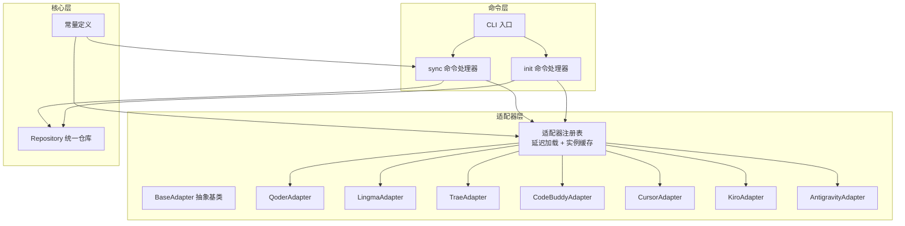
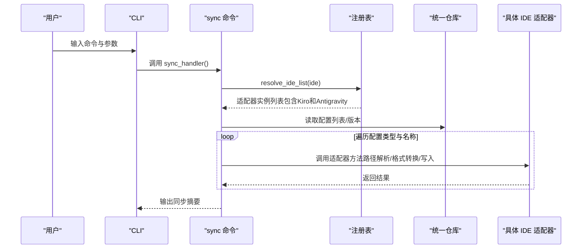
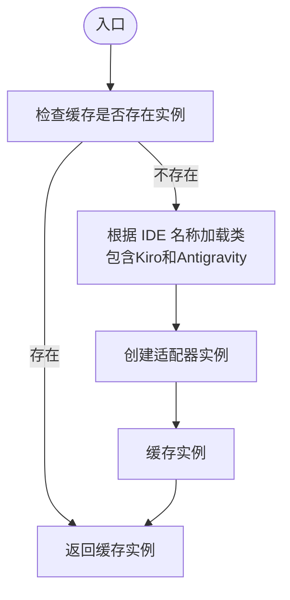
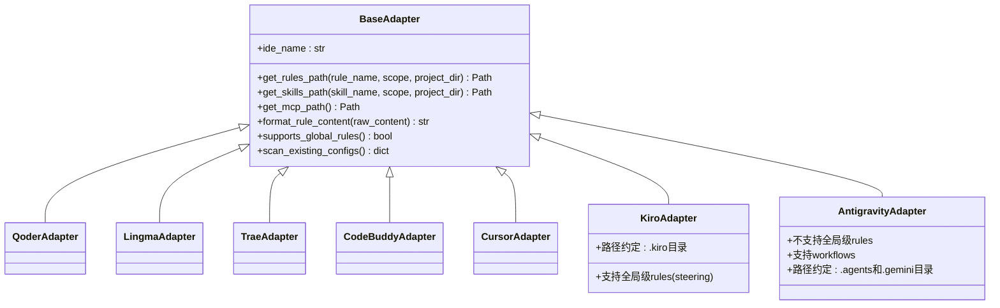
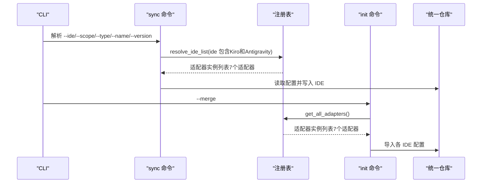
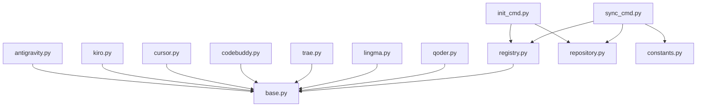

# 适配器注册与管理

<cite>
**本文档引用的文件**
- [registry.py](file://MSR-cli/msr_sync/adapters/registry.py)
- [base.py](file://MSR-cli/msr_sync/adapters/base.py)
- [qoder.py](file://MSR-cli/msr_sync/adapters/qoder.py)
- [lingma.py](file://MSR-cli/msr_sync/adapters/lingma.py)
- [trae.py](file://MSR-cli/msr_sync/adapters/trae.py)
- [codebuddy.py](file://MSR-cli/msr_sync/adapters/codebuddy.py)
- [cursor.py](file://MSR-cli/msr_sync/adapters/cursor.py)
- [kiro.py](file://MSR-cli/msr_sync/adapters/kiro.py)
- [antigravity.py](file://MSR-cli/msr_sync/adapters/antigravity.py)
- [cli.py](file://MSR-cli/msr_sync/cli.py)
- [sync_cmd.py](file://MSR-cli/msr_sync/commands/sync_cmd.py)
- [init_cmd.py](file://MSR-cli/msr_sync/commands/init_cmd.py)
- [repository.py](file://MSR-cli/msr_sync/core/repository.py)
- [constants.py](file://MSR-cli/msr_sync/constants.py)
- [test_adapters.py](file://MSR-cli/tests/test_adapters.py)
- [test_kiro_adapter.py](file://MSR-cli/tests/test_kiro_adapter.py)
- [test_antigravity_adapter.py](file://MSR-cli/tests/test_antigravity_adapter.py)
</cite>

## 更新摘要
**变更内容**
- 适配器数量从5个扩展到7个，新增Kiro和Antigravity适配器支持
- 注册表映射表更新，包含新的适配器注册项
- 适配器抽象基类保持不变，新增适配器遵循统一接口规范
- 测试覆盖范围扩展，包含新适配器的功能验证

## 目录
1. [简介](#简介)
2. [项目结构](#项目结构)
3. [核心组件](#核心组件)
4. [架构总览](#架构总览)
5. [详细组件分析](#详细组件分析)
6. [依赖分析](#依赖分析)
7. [性能考虑](#性能考虑)
8. [故障排除指南](#故障排除指南)
9. [结论](#结论)
10. [附录](#附录)

## 简介
本文件系统化阐述 MSR-sync 项目中"适配器注册与管理"机制的设计与实现，重点围绕以下主题：
- 注册表的设计原理与实现方式
- 如何通过注册表集中管理所有可用的 IDE 适配器实例
- 注册表的初始化过程、适配器查找算法与动态加载机制
- 适配器实例的生命周期管理与缓存策略
- 注册表 API 的使用示例（注册新适配器、获取适配器实例、适配器列表管理）
- 注册表在命令执行过程中的作用，以及如何根据用户选择或默认配置获取对应适配器实例
- 注册表扩展的最佳实践与故障排除指南

**更新** 适配器数量已从5个扩展到7个，新增Kiro和Antigravity适配器，进一步丰富了IDE适配器生态。

## 项目结构
MSR-cli 的适配器体系位于 msr_sync/adapters 目录，采用"抽象基类 + 具体适配器 + 注册表"的分层设计：
- 抽象基类：定义统一接口规范
- 具体适配器：针对不同 IDE 的实现（现包含7个适配器）
- 注册表：集中管理适配器类与实例，提供延迟加载与缓存

**图表来源**
- [registry.py:1-91](file://MSR-cli/msr_sync/adapters/registry.py#L1-L91)
- [base.py:1-105](file://MSR-cli/msr_sync/adapters/base.py#L1-L105)
- [qoder.py:1-140](file://MSR-cli/msr_sync/adapters/qoder.py#L1-L140)
- [lingma.py:1-140](file://MSR-cli/msr_sync/adapters/lingma.py#L1-L140)
- [trae.py:1-138](file://MSR-cli/msr_sync/adapters/trae.py#L1-L138)
- [codebuddy.py:1-143](file://MSR-cli/msr_sync/adapters/codebuddy.py#L1-L143)
- [cursor.py:1-133](file://MSR-cli/msr_sync/adapters/cursor.py#L1-L133)
- [kiro.py:1-133](file://MSR-cli/msr_sync/adapters/kiro.py#L1-L133)
- [antigravity.py:1-131](file://MSR-cli/msr_sync/adapters/antigravity.py#L1-L131)
- [cli.py:1-116](file://MSR-cli/msr_sync/cli.py#L1-L116)
- [sync_cmd.py:1-411](file://MSR-cli/msr_sync/commands/sync_cmd.py#L1-L411)
- [init_cmd.py:1-137](file://MSR-cli/msr_sync/commands/init_cmd.py#L1-L137)
- [repository.py:1-200](file://MSR-cli/msr_sync/core/repository.py#L1-L200)
- [constants.py:1-50](file://MSR-cli/msr_sync/constants.py#L1-L50)

**章节来源**
- [registry.py:1-91](file://MSR-cli/msr_sync/adapters/registry.py#L1-L91)
- [base.py:1-105](file://MSR-cli/msr_sync/adapters/base.py#L1-L105)
- [cli.py:1-116](file://MSR-cli/msr_sync/cli.py#L1-L116)

## 核心组件
- 抽象基类 BaseAdapter：定义统一接口，包括路径解析、格式转换、能力查询、配置扫描等方法，确保各 IDE 适配器行为一致。
- 具体适配器：Qoder、Lingma、Trae、CodeBuddy、Cursor、Kiro、Antigravity 分别实现各自 IDE 的路径约定、格式头部与扫描逻辑。
- 注册表 registry：维护 IDE 名称到模块路径与类名的映射，提供延迟加载与实例缓存，支持按名称获取实例、获取全部实例、解析 IDE 名称元组。

**更新** 现在包含7个适配器，其中Kiro支持全局级rules，Antigravity不支持全局级rules但支持workflows。

**章节来源**
- [base.py:8-105](file://MSR-cli/msr_sync/adapters/base.py#L8-L105)
- [qoder.py:22-140](file://MSR-cli/msr_sync/adapters/qoder.py#L22-L140)
- [lingma.py:22-140](file://MSR-cli/msr_sync/adapters/lingma.py#L22-L140)
- [trae.py:21-138](file://MSR-cli/msr_sync/adapters/trae.py#L21-L138)
- [codebuddy.py:22-143](file://MSR-cli/msr_sync/adapters/codebuddy.py#L22-L143)
- [cursor.py:21-133](file://MSR-cli/msr_sync/adapters/cursor.py#L21-L133)
- [kiro.py:21-133](file://MSR-cli/msr_sync/adapters/kiro.py#L21-L133)
- [antigravity.py:22-131](file://MSR-cli/msr_sync/adapters/antigravity.py#L22-L131)
- [registry.py:8-91](file://MSR-cli/msr_sync/adapters/registry.py#L8-L91)

## 架构总览
注册表在命令执行流程中的关键作用：
- CLI 解析用户输入，决定使用哪些 IDE 与同步范围
- sync 命令通过 resolve_ide_list 将 IDE 名称元组解析为适配器实例列表
- init 命令通过 get_all_adapters 扫描并导入各 IDE 的现有配置
- 适配器实例负责具体的路径解析、格式转换与文件写入

**图表来源**
- [cli.py:58-82](file://MSR-cli/msr_sync/cli.py#L58-L82)
- [sync_cmd.py:26-131](file://MSR-cli/msr_sync/commands/sync_cmd.py#L26-L131)
- [registry.py:77-91](file://MSR-cli/msr_sync/adapters/registry.py#L77-L91)
- [repository.py:160-200](file://MSR-cli/msr_sync/core/repository.py#L160-L200)

## 详细组件分析

### 注册表设计与实现
- 延迟加载映射表：键为 IDE 名称，值为 (模块路径, 类名) 元组，集中管理可加载的适配器类（现包含7个适配器）。
- 实例缓存：按 IDE 名称缓存适配器实例，避免重复创建，提升性能。
- 关键函数：
  - get_adapter：根据 IDE 名称获取实例（首次创建后缓存）
  - get_all_adapters：获取所有已注册适配器实例
  - resolve_ide_list：解析 --ide 参数，支持 'all' 展开与去重

**更新** 注册表映射表现已包含Kiro和Antigravity适配器，总数达到7个。

**图表来源**
- [registry.py:48-66](file://MSR-cli/msr_sync/adapters/registry.py#L48-L66)
- [registry.py:68-75](file://MSR-cli/msr_sync/adapters/registry.py#L68-L75)
- [registry.py:77-91](file://MSR-cli/msr_sync/adapters/registry.py#L77-L91)

**章节来源**
- [registry.py:8-91](file://MSR-cli/msr_sync/adapters/registry.py#L8-L91)

### 适配器抽象基类与具体实现
- BaseAdapter 定义统一接口，包括：
  - ide_name：标识 IDE 名称
  - 路径解析：get_rules_path、get_skills_path、get_mcp_path
  - 格式转换：format_rule_content
  - 能力查询：supports_global_rules（默认 False，CodeBuddy 覆盖为 True）
  - 配置扫描：scan_existing_configs
- 具体适配器实现：
  - Qoder/Lingma/Trae/Cursor：遵循各自 IDE 的路径约定与头部格式
  - CodeBuddy：支持全局级 rules，路径与头部格式特殊
  - Kiro：支持全局级 rules (steering)，路径约定独特
  - Antigravity：不支持全局级 rules，支持 workflows

**更新** 新增Kiro和Antigravity适配器，分别支持不同的路径约定和功能特性。

**图表来源**
- [base.py:8-105](file://MSR-cli/msr_sync/adapters/base.py#L8-L105)
- [qoder.py:22-140](file://MSR-cli/msr_sync/adapters/qoder.py#L22-L140)
- [lingma.py:22-140](file://MSR-cli/msr_sync/adapters/lingma.py#L22-L140)
- [trae.py:21-138](file://MSR-cli/msr_sync/adapters/trae.py#L21-L138)
- [codebuddy.py:22-143](file://MSR-cli/msr_sync/adapters/codebuddy.py#L22-L143)
- [cursor.py:21-133](file://MSR-cli/msr_sync/adapters/cursor.py#L21-L133)
- [kiro.py:21-133](file://MSR-cli/msr_sync/adapters/kiro.py#L21-L133)
- [antigravity.py:22-131](file://MSR-cli/msr_sync/adapters/antigravity.py#L22-L131)

**章节来源**
- [base.py:8-105](file://MSR-cli/msr_sync/adapters/base.py#L8-L105)
- [qoder.py:22-140](file://MSR-cli/msr_sync/adapters/qoder.py#L22-L140)
- [lingma.py:22-140](file://MSR-cli/msr_sync/adapters/lingma.py#L22-L140)
- [trae.py:21-138](file://MSR-cli/msr_sync/adapters/trae.py#L21-L138)
- [codebuddy.py:22-143](file://MSR-cli/msr_sync/adapters/codebuddy.py#L22-L143)
- [cursor.py:21-133](file://MSR-cli/msr_sync/adapters/cursor.py#L21-L133)
- [kiro.py:21-133](file://MSR-cli/msr_sync/adapters/kiro.py#L21-L133)
- [antigravity.py:22-131](file://MSR-cli/msr_sync/adapters/antigravity.py#L22-L131)

### 命令执行中的注册表使用
- CLI 层解析 --ide 参数，若未指定则回退到配置文件中的默认 IDE 列表
- sync 命令通过 resolve_ide_list 将 IDE 名称元组转换为适配器实例列表，再逐个执行同步
- init 命令通过 get_all_adapters 扫描各 IDE 的现有配置并导入统一仓库

**更新** 现在支持Kiro和Antigravity适配器的命令执行，扩展了IDE选择范围。

**图表来源**
- [cli.py:58-82](file://MSR-cli/msr_sync/cli.py#L58-L82)
- [sync_cmd.py:64-66](file://MSR-cli/msr_sync/commands/sync_cmd.py#L64-L66)
- [registry.py:77-91](file://MSR-cli/msr_sync/adapters/registry.py#L77-L91)
- [init_cmd.py:56-57](file://MSR-cli/msr_sync/commands/init_cmd.py#L56-L57)

**章节来源**
- [cli.py:58-82](file://MSR-cli/msr_sync/cli.py#L58-L82)
- [sync_cmd.py:64-66](file://MSR-cli/msr_sync/commands/sync_cmd.py#L64-L66)
- [init_cmd.py:56-57](file://MSR-cli/msr_sync/commands/init_cmd.py#L56-L57)

### 注册表 API 使用示例
- 注册新适配器
  - 在注册表映射表中新增条目，键为 IDE 名称，值为 (模块路径, 类名)
  - 确保模块路径可 import，类名与具体适配器类一致
- 获取适配器实例
  - 调用 get_adapter(ide_name) 获取实例；首次调用触发延迟加载与缓存
- 适配器列表管理
  - 调用 get_all_adapters() 获取全部实例（现包含7个适配器）
  - 调用 resolve_ide_list((...)) 解析 IDE 名称元组，支持 'all' 展开

**更新** 现在支持7个适配器的注册和管理，包括Kiro和Antigravity。

**章节来源**
- [registry.py:8-91](file://MSR-cli/msr_sync/adapters/registry.py#L8-L91)

### 生命周期管理与缓存策略
- 实例缓存：_adapter_instances 以 IDE 名称为键缓存适配器实例，避免重复创建
- 延迟加载：_load_adapter_class 仅在需要时 import 对应模块并获取类
- 缓存失效：当前实现未提供显式缓存清理；如需强制重建，可在上层应用中重新导入模块或替换缓存键

**更新** 现在管理7个适配器实例的生命周期，缓存策略保持不变。

**章节来源**
- [registry.py:20-66](file://MSR-cli/msr_sync/adapters/registry.py#L20-L66)

### 扩展最佳实践
- 新增 IDE 适配器步骤
  - 在适配器目录新增具体适配器类，继承 BaseAdapter 并实现必要方法
  - 在注册表映射表中添加条目，确保模块路径与类名正确
  - 在 CLI 的 --ide 选项中加入新 IDE 名称（如适用）
- 接口一致性
  - 严格遵循 BaseAdapter 的方法签名与语义，保证路径解析、格式转换与扫描逻辑的一致性
- 错误处理
  - 对于不支持的 IDE 名称，注册表抛出 ValueError；调用方应在 CLI 层进行友好提示
- 性能优化
  - 利用注册表的实例缓存减少重复创建；避免在热路径中频繁调用 get_all_adapters

**更新** 新增适配器时需考虑其特定的路径约定和功能特性，如Kiro的全局级支持和Antigravity的workflows支持。

**章节来源**
- [base.py:8-105](file://MSR-cli/msr_sync/adapters/base.py#L8-L105)
- [registry.py:8-91](file://MSR-cli/msr_sync/adapters/registry.py#L8-L91)
- [cli.py:46](file://MSR-cli/msr_sync/cli.py#L46)

## 依赖分析
- 注册表依赖 BaseAdapter 接口，确保所有适配器实现一致的方法签名
- 命令层（sync/init）依赖注册表进行 IDE 实例解析
- 统一仓库模块与常量模块为命令层提供数据与配置支撑

**更新** 依赖关系现在包含新增的Kiro和Antigravity适配器。

**图表来源**
- [registry.py:1-91](file://MSR-cli/msr_sync/adapters/registry.py#L1-L91)
- [base.py:1-105](file://MSR-cli/msr_sync/adapters/base.py#L1-L105)
- [sync_cmd.py:1-411](file://MSR-cli/msr_sync/commands/sync_cmd.py#L1-L411)
- [init_cmd.py:1-137](file://MSR-cli/msr_sync/commands/init_cmd.py#L1-L137)
- [repository.py:1-200](file://MSR-cli/msr_sync/core/repository.py#L1-L200)
- [constants.py:1-50](file://MSR-cli/msr_sync/constants.py#L1-L50)

**章节来源**
- [registry.py:1-91](file://MSR-cli/msr_sync/adapters/registry.py#L1-L91)
- [sync_cmd.py:1-411](file://MSR-cli/msr_sync/commands/sync_cmd.py#L1-L411)
- [init_cmd.py:1-137](file://MSR-cli/msr_sync/commands/init_cmd.py#L1-L137)

## 性能考虑
- 延迟加载与实例缓存显著降低重复创建成本，适合在多次命令调用中复用适配器实例
- resolve_ide_list 在包含 'all' 时会遍历全部注册项（现为7个），建议在批量场景中谨慎使用
- 路径解析与文件写入为主要 IO 开销点，建议在上层进行必要的存在性检查与版本解析

**更新** 现在有7个适配器参与解析，resolve_ide_list的遍历成本相应增加。

## 故障排除指南
- 不支持的 IDE 名称
  - 现象：调用 get_adapter/resolve_ide_list 时抛出 ValueError
  - 处理：确认 IDE 名称拼写与注册表映射一致；在 CLI 层对用户输入进行校验与提示
- 适配器模块未实现
  - 现象：延迟加载阶段 importlib.import_module 抛出 ImportError
  - 处理：检查模块路径是否正确，确保对应适配器类已实现并可 import
- 全局级 rules 不支持
  - 现象：全局级同步时，部分 IDE 输出跳过提示
  - 处理：调用方应先检查 supports_global_rules，必要时降级为项目级同步
- MCP 配置合并冲突
  - 现象：目标 mcp.json 中存在同名条目
  - 处理：按提示确认覆盖或手动清理冲突条目

**更新** 新增适配器的故障排除：Kiro和Antigravity的特定路径约定问题，以及它们对全局级rules的不同支持情况。

## 结论
MSR-sync 的适配器注册与管理机制通过"抽象基类 + 具体适配器 + 注册表"的清晰分层，实现了对多 IDE 的统一接入与扩展。注册表以延迟加载与实例缓存为核心，既保证了灵活性，又兼顾了性能。结合 CLI 的参数解析与命令层的业务流程，系统能够在不同 IDE 之间高效地进行规则、技能与 MCP 配置的同步与迁移。随着Kiro和Antigravity适配器的加入，系统现在支持7种不同的IDE，进一步增强了适配器生态的多样性。

## 附录
- 测试覆盖要点
  - 路径解析正确性：验证各 IDE 的项目级与全局级路径约定（现包含Kiro和Antigravity）
  - 适配器实例一致性：确保所有适配器均为 BaseAdapter 的子类实例
  - resolve_ide_list 行为：'all' 展开、单个 IDE、多 IDE 与非法名称的处理
  - format_rule_content 输出：验证各 IDE 的头部格式与内容保留
  - supports_global_rules：仅 CodeBuddy 和 Kiro 返回 True，Antigravity 返回 False

**更新** 测试覆盖现已扩展到7个适配器，包括Kiro和Antigravity的特定功能验证。

**章节来源**
- [test_adapters.py:1-200](file://MSR-cli/tests/test_adapters.py#L1-L200)
- [test_kiro_adapter.py:1-214](file://MSR-cli/tests/test_kiro_adapter.py#L1-L214)
- [test_antigravity_adapter.py:1-195](file://MSR-cli/tests/test_antigravity_adapter.py#L1-L195)