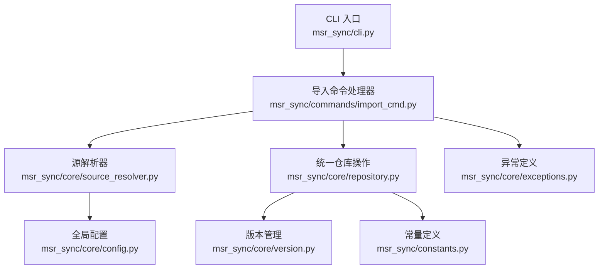
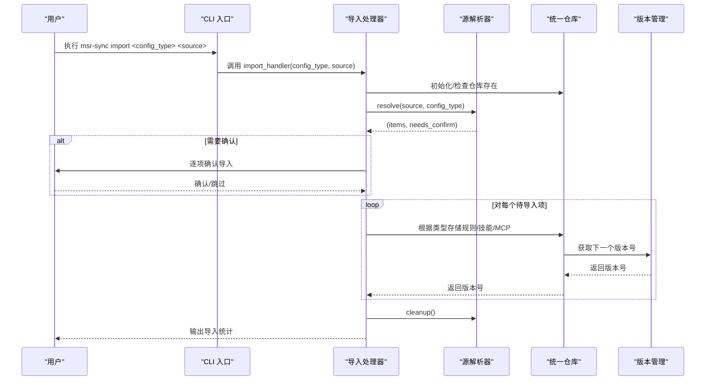
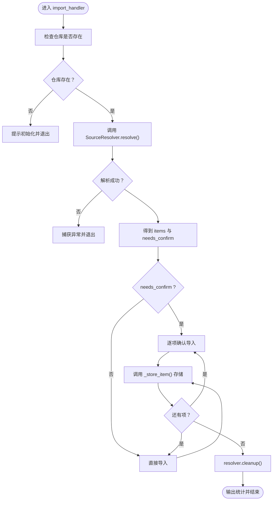
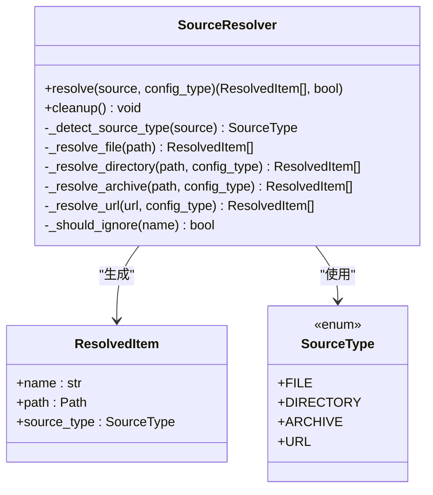
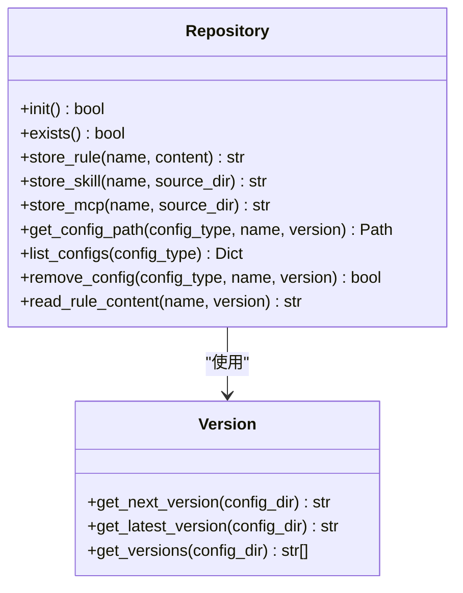
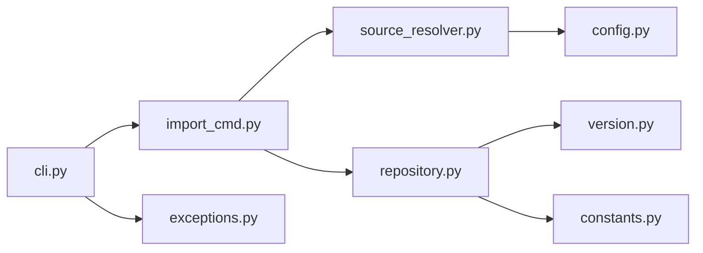

# import 命令详解

<cite>
**本文档引用的文件**
- [import_cmd.py](file://MSR-cli/msr_sync/commands/import_cmd.py)
- [source_resolver.py](file://MSR-cli/msr_sync/core/source_resolver.py)
- [repository.py](file://MSR-cli/msr_sync/core/repository.py)
- [constants.py](file://MSR-cli/msr_sync/constants.py)
- [cli.py](file://MSR-cli/msr_sync/cli.py)
- [config.py](file://MSR-cli/msr_sync/core/config.py)
- [version.py](file://MSR-cli/msr_sync/core/version.py)
- [exceptions.py](file://MSR-cli/msr_sync/core/exceptions.py)
- [usage.md](file://MSR-cli/docs/usage.md)
- [README.md](file://MSR-cli/README.md)
- [test_commands.py](file://MSR-cli/tests/test_commands.py)
- [test_source_resolver.py](file://MSR-cli/tests/test_source_resolver.py)
</cite>

## 目录
1. [简介](#简介)
2. [项目结构](#项目结构)
3. [核心组件](#核心组件)
4. [架构总览](#架构总览)
5. [详细组件分析](#详细组件分析)
6. [依赖关系分析](#依赖关系分析)
7. [性能考虑](#性能考虑)
8. [故障排除指南](#故障排除指南)
9. [结论](#结论)
10. [附录](#附录)

## 简介
本文件为 msr-sync 的 import 命令提供详尽的使用文档，涵盖功能说明、支持的导入源类型、导入流程、参数使用方法、源解析器工作机制、路径处理逻辑、命令行示例、验证与转换、存储机制、错误处理、冲突解决与数据完整性保障、性能优化建议与最佳实践。

## 项目结构
import 命令位于命令层，通过 CLI 入口触发，内部依赖源解析器、仓库操作、版本管理与全局配置模块协同工作。

**图表来源**
- [cli.py:27-38](file://MSR-cli/msr_sync/cli.py#L27-L38)
- [import_cmd.py:14-56](file://MSR-cli/msr_sync/commands/import_cmd.py#L14-L56)
- [source_resolver.py:43-116](file://MSR-cli/msr_sync/core/source_resolver.py#L43-L116)
- [repository.py:23-118](file://MSR-cli/msr_sync/core/repository.py#L23-L118)
- [config.py:18-89](file://MSR-cli/msr_sync/core/config.py#L18-L89)
- [version.py:59-119](file://MSR-cli/msr_sync/core/version.py#L59-L119)
- [constants.py:16-46](file://MSR-cli/msr_sync/constants.py#L16-L46)
- [exceptions.py:4-34](file://MSR-cli/msr_sync/core/exceptions.py#L4-L34)

**章节来源**
- [cli.py:27-38](file://MSR-cli/msr_sync/cli.py#L27-L38)
- [import_cmd.py:14-56](file://MSR-cli/msr_sync/commands/import_cmd.py#L14-L56)
- [source_resolver.py:43-116](file://MSR-cli/msr_sync/core/source_resolver.py#L43-L116)
- [repository.py:23-118](file://MSR-cli/msr_sync/core/repository.py#L23-L118)
- [config.py:18-89](file://MSR-cli/msr_sync/core/config.py#L18-L89)
- [version.py:59-119](file://MSR-cli/msr_sync/core/version.py#L59-L119)
- [constants.py:16-46](file://MSR-cli/msr_sync/constants.py#L16-L46)
- [exceptions.py:4-34](file://MSR-cli/msr_sync/core/exceptions.py#L4-L34)

## 核心组件
- CLI 子命令定义：在主入口中注册 import 子命令，绑定参数与处理器。
- 导入处理器：负责初始化仓库、解析来源、确认导入、存储配置并清理资源。
- 源解析器：识别来源类型（文件/目录/压缩包/URL），解析为 ResolvedItem 列表，决定是否需要用户确认。
- 仓库操作：根据配置类型将规则、技能、MCP 分别存储到统一仓库，自动版本递增。
- 版本管理：提供版本解析、格式化、获取最新版本与下一个版本号的能力。
- 全局配置：提供忽略模式、默认仓库路径等配置项，影响导入行为。
- 异常体系：统一的错误类型，便于上层 CLI 捕获并输出友好提示。

**章节来源**
- [cli.py:27-38](file://MSR-cli/msr_sync/cli.py#L27-L38)
- [import_cmd.py:14-151](file://MSR-cli/msr_sync/commands/import_cmd.py#L14-L151)
- [source_resolver.py:43-404](file://MSR-cli/msr_sync/core/source_resolver.py#L43-L404)
- [repository.py:23-291](file://MSR-cli/msr_sync/core/repository.py#L23-L291)
- [version.py:9-119](file://MSR-cli/msr_sync/core/version.py#L9-L119)
- [config.py:18-204](file://MSR-cli/msr_sync/core/config.py#L18-L204)
- [exceptions.py:4-34](file://MSR-cli/msr_sync/core/exceptions.py#L4-L34)

## 架构总览
import 命令的端到端流程如下：

**图表来源**
- [cli.py:27-38](file://MSR-cli/msr_sync/cli.py#L27-L38)
- [import_cmd.py:14-56](file://MSR-cli/msr_sync/commands/import_cmd.py#L14-L56)
- [source_resolver.py:77-110](file://MSR-cli/msr_sync/core/source_resolver.py#L77-L110)
- [repository.py:89-158](file://MSR-cli/msr_sync/core/repository.py#L89-L158)
- [version.py:103-119](file://MSR-cli/msr_sync/core/version.py#L103-L119)

## 详细组件分析

### 导入命令处理器（import_cmd.py）
- 功能职责
  - 校验仓库是否存在，不存在则提示初始化。
  - 使用源解析器解析来源，得到 ResolvedItem 列表与是否需要确认标志。
  - 单项导入直接执行，多项导入逐项确认后执行。
  - 调用仓库存储方法，按类型写入规则、技能或 MCP。
  - 无论成功与否，最终清理临时目录。
- 关键流程
  - 仓库检查与初始化：通过 Repository.exists() 判断，必要时抛出 RepositoryNotFoundError。
  - 源解析：调用 SourceResolver.resolve()，返回 items 与 needs_confirm。
  - 导入执行：_import_items() 或 _import_with_confirmation()。
  - 存储：_store_item() 根据 config_type 调用仓库对应存储方法。
  - 清理：resolver.cleanup() 释放临时目录。
- 错误处理
  - InvalidSourceError：来源无效（文件/目录不存在、格式不支持等）。
  - NetworkError：URL 下载失败。
  - RepositoryNotFoundError：仓库未初始化。
  - 其他异常：捕获并输出失败信息，返回 None 表示失败。

**图表来源**
- [import_cmd.py:14-151](file://MSR-cli/msr_sync/commands/import_cmd.py#L14-L151)

**章节来源**
- [import_cmd.py:14-151](file://MSR-cli/msr_sync/commands/import_cmd.py#L14-L151)

### 源解析器（source_resolver.py）
- 功能职责
  - 识别来源类型：文件、目录、压缩包、URL。
  - 解析规则：按 .md 文件扫描。
  - 解析技能：根目录含 SKILL.md 视为单个技能，否则每个子目录为独立技能。
  - 解析 MCP：根目录含非子目录文件视为单个 MCP，否则每个子目录为独立 MCP。
  - 压缩包：支持 .zip、.tar.gz、.tgz，自动解压至临时目录，再按目录规则解析。
  - URL：从 URL 推断文件名，校验压缩包格式，下载到临时目录后按压缩包处理。
  - 忽略模式：基于全局配置的 ignore_patterns，支持精确匹配与通配符匹配。
- 关键数据结构
  - SourceType：枚举文件/目录/压缩包/URL。
  - ResolvedItem：包含 name、path、source_type。
- 路径处理
  - 仅匹配文件名/目录名，不匹配完整路径。
  - 压缩包顶层可能有包裹目录，解析时自动进入实际目录。

**图表来源**
- [source_resolver.py:43-404](file://MSR-cli/msr_sync/core/source_resolver.py#L43-L404)

**章节来源**
- [source_resolver.py:43-404](file://MSR-cli/msr_sync/core/source_resolver.py#L43-L404)
- [config.py:18-89](file://MSR-cli/msr_sync/core/config.py#L18-L89)

### 仓库操作（repository.py）
- 功能职责
  - 初始化仓库目录结构（RULES、SKILLS、MCP）。
  - 存储规则：写入 RULES/<name>/Vn/<name>.md。
  - 存储技能：复制 SKILLS/<name>/Vn/ 整个目录。
  - 存储 MCP：复制 MCP/<name>/Vn/ 整个目录。
  - 获取配置路径与版本、列出配置、删除配置版本。
- 版本管理集成
  - 使用 get_next_version() 获取下一个版本号，自动递增。
- 数据完整性
  - 通过版本目录隔离不同版本，避免覆盖。
  - 读取规则时校验文件存在性。

**图表来源**
- [repository.py:23-291](file://MSR-cli/msr_sync/core/repository.py#L23-L291)
- [version.py:59-119](file://MSR-cli/msr_sync/core/version.py#L59-L119)

**章节来源**
- [repository.py:23-291](file://MSR-cli/msr_sync/core/repository.py#L23-L291)
- [version.py:59-119](file://MSR-cli/msr_sync/core/version.py#L59-L119)

### 常量与配置（constants.py, config.py）
- 常量
  - 配置类型枚举与仓库目录映射。
  - 版本号前缀、技能标识文件名、MCP 配置文件名、支持的压缩包扩展名。
- 全局配置
  - repo_path、ignore_patterns、default_ides、default_scope。
  - 忽略模式影响导入扫描与压缩包解压后的扫描。

**章节来源**
- [constants.py:16-46](file://MSR-cli/msr_sync/constants.py#L16-L46)
- [config.py:18-204](file://MSR-cli/msr_sync/core/config.py#L18-L204)

### CLI 定义（cli.py）
- 注册 import 子命令，绑定参数 config_type 与 source。
- 将异常转换为用户可读的错误信息并退出。

**章节来源**
- [cli.py:27-38](file://MSR-cli/msr_sync/cli.py#L27-L38)

## 依赖关系分析
- 组件耦合
  - import_cmd 依赖 repository 与 source_resolver，耦合度适中。
  - source_resolver 依赖 config 获取忽略模式，保持解析逻辑与配置解耦。
  - repository 依赖 version 进行版本号管理，依赖 constants 获取目录名映射。
- 外部依赖
  - Click：命令行框架。
  - PyYAML：配置文件解析。
  - 标准库：urllib.request（URL 下载）、zipfile/tarfile（压缩包处理）、tempfile（临时目录）。

**图表来源**
- [import_cmd.py:14-151](file://MSR-cli/msr_sync/commands/import_cmd.py#L14-L151)
- [source_resolver.py:43-116](file://MSR-cli/msr_sync/core/source_resolver.py#L43-L116)
- [repository.py:23-118](file://MSR-cli/msr_sync/core/repository.py#L23-L118)
- [config.py:18-89](file://MSR-cli/msr_sync/core/config.py#L18-L89)
- [version.py:59-119](file://MSR-cli/msr_sync/core/version.py#L59-L119)
- [constants.py:16-46](file://MSR-cli/msr_sync/constants.py#L16-L46)
- [cli.py:27-38](file://MSR-cli/msr_sync/cli.py#L27-L38)
- [exceptions.py:4-34](file://MSR-cli/msr_sync/core/exceptions.py#L4-L34)

**章节来源**
- [import_cmd.py:14-151](file://MSR-cli/msr_sync/commands/import_cmd.py#L14-L151)
- [source_resolver.py:43-116](file://MSR-cli/msr_sync/core/source_resolver.py#L43-L116)
- [repository.py:23-118](file://MSR-cli/msr_sync/core/repository.py#L23-L118)
- [config.py:18-89](file://MSR-cli/msr_sync/core/config.py#L18-L89)
- [version.py:59-119](file://MSR-cli/msr_sync/core/version.py#L59-L119)
- [constants.py:16-46](file://MSR-cli/msr_sync/constants.py#L16-L46)
- [cli.py:27-38](file://MSR-cli/msr_sync/cli.py#L27-L38)
- [exceptions.py:4-34](file://MSR-cli/msr_sync/core/exceptions.py#L4-L34)

## 性能考虑
- 压缩包处理
  - 临时目录解压后一次性扫描，避免多次 IO。
  - 压缩包格式限制为 zip、tar.gz、tgz，减少兼容性开销。
- 目录扫描
  - 使用忽略模式快速跳过无关条目，减少 IO 与解析时间。
  - 仅匹配文件名/目录名，避免全路径匹配开销。
- 版本管理
  - 版本号解析与排序为 O(n log n)，n 为版本数量，通常较小。
- 网络下载
  - URL 导入使用一次性下载，失败重试需由用户手动重试。
- I/O 优化
  - 规则文件直接读取文本写入，技能与 MCP 目录复制，避免不必要的解析。

[本节为通用性能讨论，无需具体文件分析]

## 故障排除指南
- 仓库未初始化
  - 现象：提示“统一仓库未初始化，请先执行 `msr-sync init`”。
  - 处理：执行初始化命令后再进行导入。
- 无效的导入来源
  - 现象：提示“无效的导入来源”，常见于文件/目录不存在、格式不支持。
  - 处理：检查路径、文件扩展名与压缩包格式。
- 网络错误（URL 导入）
  - 现象：提示“下载失败，请检查网络连接”。
  - 处理：检查网络、代理与 URL 可达性。
- 存储失败
  - 现象：导入单个配置项失败，输出失败信息。
  - 处理：检查权限、磁盘空间与仓库路径配置。
- 版本冲突与覆盖
  - 现象：同名配置导入自动创建新版本，不会覆盖旧版本。
  - 处理：使用 list 查看版本，使用 remove 删除不需要的旧版本。

**章节来源**
- [import_cmd.py:145-150](file://MSR-cli/msr_sync/commands/import_cmd.py#L145-L150)
- [exceptions.py:8-34](file://MSR-cli/msr_sync/core/exceptions.py#L8-L34)
- [usage.md:634-759](file://MSR-cli/docs/usage.md#L634-L759)

## 结论
import 命令通过清晰的职责划分与完善的错误处理，提供了稳定可靠的配置导入能力。其支持多种来源、灵活的确认机制、自动版本管理与严格的路径处理，满足从个人到团队的多样化使用场景。配合全局配置与版本管理，用户可在多 IDE 间高效迁移与共享配置。

[本节为总结性内容，无需具体文件分析]

## 附录

### 命令行示例与最佳实践
- 单个规则文件导入
  - 示例：msr-sync import rules ./coding-standards.md
  - 说明：直接导入，无需确认。
- 多规则目录导入（交互确认）
  - 示例：msr-sync import rules ./my-rules/
  - 说明：发现多个规则项时逐项确认。
- 从压缩包导入
  - 示例：msr-sync import rules ./rules-collection.zip
  - 示例：msr-sync import skills ./all-skills.zip
  - 示例：msr-sync import mcp ./mcp-configs.zip
- 从 URL 导入
  - 示例：msr-sync import rules https://example.com/shared-rules.zip
- 版本冲突处理
  - 说明：同名配置自动创建新版本（V2、V3...），不覆盖旧版本。
- 忽略模式
  - 说明：通过全局配置文件设置 ignore_patterns，导入时自动跳过匹配条目。
- 最佳实践
  - 使用压缩包统一打包共享配置，便于分发与版本管理。
  - 导入前先执行初始化，确保仓库结构正确。
  - 使用 list 查看版本，remove 清理不再需要的旧版本。
  - URL 导入需确保网络可达与压缩包格式正确。

**章节来源**
- [usage.md:84-200](file://MSR-cli/docs/usage.md#L84-L200)
- [README.md:23-118](file://MSR-cli/README.md#L23-L118)
- [test_commands.py:324-477](file://MSR-cli/tests/test_commands.py#L324-L477)
- [test_source_resolver.py:277-716](file://MSR-cli/tests/test_source_resolver.py#L277-L716)