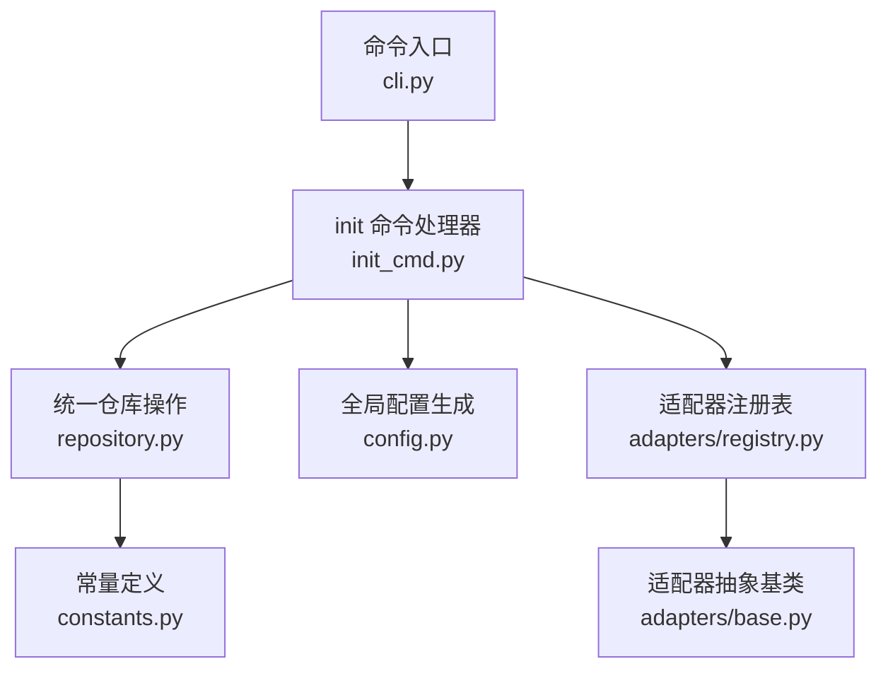
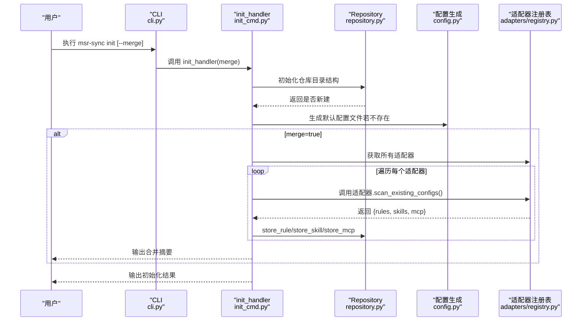
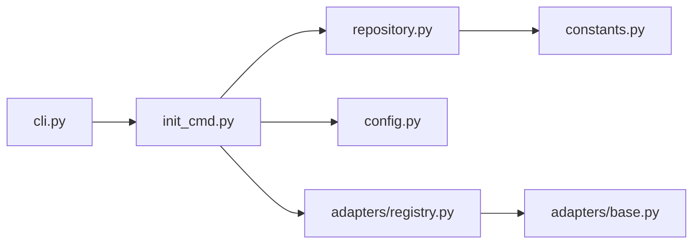

# init 命令详解

<cite>
**本文引用的文件**
- [MSR-cli/README.md](file://MSR-cli/README.md)
- [MSR-cli/docs/usage.md](file://MSR-cli/docs/usage.md)
- [MSR-cli/msr_sync/cli.py](file://MSR-cli/msr_sync/cli.py)
- [MSR-cli/msr_sync/commands/init_cmd.py](file://MSR-cli/msr_sync/commands/init_cmd.py)
- [MSR-cli/msr_sync/core/repository.py](file://MSR-cli/msr_sync/core/repository.py)
- [MSR-cli/msr_sync/core/config.py](file://MSR-cli/msr_sync/core/config.py)
- [MSR-cli/msr_sync/constants.py](file://MSR-cli/msr_sync/constants.py)
- [MSR-cli/msr_sync/adapters/registry.py](file://MSR-cli/msr_sync/adapters/registry.py)
- [MSR-cli/msr_sync/adapters/base.py](file://MSR-cli/msr_sync/adapters/base.py)
- [MSR-cli/tests/test_commands.py](file://MSR-cli/tests/test_commands.py)
- [MSR-cli/pyproject.toml](file://MSR-cli/pyproject.toml)
</cite>

## 目录
1. [简介](#简介)
2. [项目结构](#项目结构)
3. [核心组件](#核心组件)
4. [架构总览](#架构总览)
5. [详细组件分析](#详细组件分析)
6. [依赖关系分析](#依赖关系分析)
7. [性能考量](#性能考量)
8. [故障排除指南](#故障排除指南)
9. [结论](#结论)
10. [附录](#附录)

## 简介
本篇文档围绕 msr-sync 的 init 命令进行深入讲解，涵盖其工作机制、初始化流程、配置生成过程、--merge 参数的扫描与合并策略、统一仓库的创建与目录结构、默认配置文件生成、命令行示例、与其他命令的依赖关系与执行顺序、错误处理与故障排除、最佳实践以及性能优化建议。读者无需深厚的编程背景，也能通过本文快速掌握 init 命令的使用与原理。

## 项目结构
MSR-cli 采用命令驱动的模块化设计，init 命令位于命令层，实际逻辑委托给仓库与配置模块，适配器注册表负责扫描 IDE 配置。整体结构清晰，职责分离明确。

图表来源
- [MSR-cli/msr_sync/cli.py:14-25](file://MSR-cli/msr_sync/cli.py#L14-L25)
- [MSR-cli/msr_sync/commands/init_cmd.py:13-42](file://MSR-cli/msr_sync/commands/init_cmd.py#L13-L42)
- [MSR-cli/msr_sync/core/repository.py:23-51](file://MSR-cli/msr_sync/core/repository.py#L23-L51)
- [MSR-cli/msr_sync/core/config.py:187-204](file://MSR-cli/msr_sync/core/config.py#L187-L204)
- [MSR-cli/msr_sync/adapters/registry.py:65-72](file://MSR-cli/msr_sync/adapters/registry.py#L65-L72)
- [MSR-cli/msr_sync/adapters/base.py:8-16](file://MSR-cli/msr_sync/adapters/base.py#L8-L16)
- [MSR-cli/msr_sync/constants.py:7-13](file://MSR-cli/msr_sync/constants.py#L7-L13)

章节来源
- [MSR-cli/msr_sync/cli.py:14-25](file://MSR-cli/msr_sync/cli.py#L14-L25)
- [MSR-cli/msr_sync/commands/init_cmd.py:13-42](file://MSR-cli/msr_sync/commands/init_cmd.py#L13-L42)
- [MSR-cli/msr_sync/core/repository.py:23-51](file://MSR-cli/msr_sync/core/repository.py#L23-L51)
- [MSR-cli/msr_sync/core/config.py:187-204](file://MSR-cli/msr_sync/core/config.py#L187-L204)
- [MSR-cli/msr_sync/adapters/registry.py:65-72](file://MSR-cli/msr_sync/adapters/registry.py#L65-L72)
- [MSR-cli/msr_sync/adapters/base.py:8-16](file://MSR-cli/msr_sync/adapters/base.py#L8-L16)
- [MSR-cli/msr_sync/constants.py:7-13](file://MSR-cli/msr_sync/constants.py#L7-L13)

## 核心组件
- 命令入口与参数解析：CLI 使用 Click 定义 init 子命令，接收 --merge 标志位。
- init 命令处理器：负责初始化仓库、生成默认配置、可选地扫描并合并 IDE 配置。
- 统一仓库：创建 RULES/SKILLS/MCP 三层目录结构，提供版本化存储与查询能力。
- 全局配置：生成 ~/.msr-sync/config.yaml 默认配置文件，支持自定义仓库路径、忽略模式、默认 IDE 与默认作用域。
- 适配器注册表：动态加载各 IDE 适配器，提供扫描现有配置的能力，用于 --merge。

章节来源
- [MSR-cli/msr_sync/cli.py:14-25](file://MSR-cli/msr_sync/cli.py#L14-L25)
- [MSR-cli/msr_sync/commands/init_cmd.py:13-42](file://MSR-cli/msr_sync/commands/init_cmd.py#L13-L42)
- [MSR-cli/msr_sync/core/repository.py:23-51](file://MSR-cli/msr_sync/core/repository.py#L23-L51)
- [MSR-cli/msr_sync/core/config.py:187-204](file://MSR-cli/msr_sync/core/config.py#L187-L204)
- [MSR-cli/msr_sync/adapters/registry.py:65-72](file://MSR-cli/msr_sync/adapters/registry.py#L65-L72)

## 架构总览
init 命令的执行流程由 CLI 接收参数，调用 init_handler，后者依次完成仓库初始化、默认配置生成、可选的 IDE 配置扫描与合并。合并阶段通过适配器注册表遍历所有已注册的 IDE 适配器，逐个扫描并导入 rules、skills、mcp 配置。

图表来源
- [MSR-cli/msr_sync/cli.py:14-25](file://MSR-cli/msr_sync/cli.py#L14-L25)
- [MSR-cli/msr_sync/commands/init_cmd.py:13-42](file://MSR-cli/msr_sync/commands/init_cmd.py#L13-L42)
- [MSR-cli/msr_sync/core/repository.py:40-51](file://MSR-cli/msr_sync/core/repository.py#L40-L51)
- [MSR-cli/msr_sync/core/config.py:187-204](file://MSR-cli/msr_sync/core/config.py#L187-L204)
- [MSR-cli/msr_sync/adapters/registry.py:65-72](file://MSR-cli/msr_sync/adapters/registry.py#L65-L72)

## 详细组件分析

### init 命令处理器（init_handler）
- 功能概述
  - 初始化统一仓库目录结构（幂等操作）。
  - 生成默认配置文件（若不存在）。
  - 可选地扫描所有 IDE 适配器的现有配置并导入到统一仓库。
- 关键流程
  - 仓库初始化：创建 RULES/SKILLS/MCP 子目录。
  - 默认配置生成：若 ~/.msr-sync/config.yaml 不存在，则写入带注释的默认配置。
  - 合并流程：遍历所有适配器，调用 scan_existing_configs，分别导入 rules、skills、mcp。
- 错误处理
  - 适配器扫描异常会被捕获并跳过，继续处理下一个适配器。
  - 仓库未初始化时，后续命令会抛出明确的错误提示。

章节来源
- [MSR-cli/msr_sync/commands/init_cmd.py:13-42](file://MSR-cli/msr_sync/commands/init_cmd.py#L13-L42)
- [MSR-cli/msr_sync/commands/init_cmd.py:44-137](file://MSR-cli/msr_sync/commands/init_cmd.py#L44-L137)

### 统一仓库（Repository）
- 目录结构
  - RULES/<name>/Vn/<name>.md
  - SKILLS/<name>/Vn/SKILL.md + 其他文件
  - MCP/<name>/Vn/mcp.json
- 核心能力
  - init：创建仓库根目录与子目录。
  - store_rule/store_skill/store_mcp：按名称+版本写入内容，自动递增版本号。
  - get_config_path/list_configs/remove_config/read_rule_content：查询、列举、删除、读取规则内容。
- 依赖与常量
  - 使用 constants 中的目录名与版本前缀常量。
  - 依赖全局配置中的 repo_path。

章节来源
- [MSR-cli/msr_sync/core/repository.py:23-51](file://MSR-cli/msr_sync/core/repository.py#L23-L51)
- [MSR-cli/msr_sync/core/repository.py:89-158](file://MSR-cli/msr_sync/core/repository.py#L89-L158)
- [MSR-cli/msr_sync/core/repository.py:160-235](file://MSR-cli/msr_sync/core/repository.py#L160-L235)
- [MSR-cli/msr_sync/constants.py:7-13](file://MSR-cli/msr_sync/constants.py#L7-L13)

### 全局配置（generate_default_config）
- 默认配置文件位置：~/.msr-sync/config.yaml
- 生成策略：若文件不存在则写入带注释的默认模板；若已存在则跳过。
- 影响范围：init 命令会调用该函数生成默认配置，后续 sync 命令会读取该配置。

章节来源
- [MSR-cli/msr_sync/core/config.py:187-204](file://MSR-cli/msr_sync/core/config.py#L187-L204)

### 适配器注册表（get_all_adapters）
- 作用：延迟加载并缓存 IDE 适配器实例，提供扫描现有配置的能力。
- 适用场景：init --merge 时，遍历所有适配器，扫描各 IDE 的 rules/skills/mcp 配置项。

章节来源
- [MSR-cli/msr_sync/adapters/registry.py:65-72](file://MSR-cli/msr_sync/adapters/registry.py#L65-L72)
- [MSR-cli/msr_sync/adapters/base.py:93-104](file://MSR-cli/msr_sync/adapters/base.py#L93-L104)

### 命令入口（CLI）
- 定义 init 子命令，接收 --merge 标志位。
- 异常处理：捕获 MSRError 并输出错误信息，退出码为 1。

章节来源
- [MSR-cli/msr_sync/cli.py:14-25](file://MSR-cli/msr_sync/cli.py#L14-L25)

## 依赖关系分析
- init 命令对仓库与配置模块存在直接依赖，对适配器注册表存在间接依赖（通过适配器接口）。
- 仓库模块依赖常量模块与版本管理工具。
- CLI 依赖 init 命令处理器。
- 适配器注册表依赖适配器抽象基类，提供扫描接口。

图表来源
- [MSR-cli/msr_sync/cli.py:14-25](file://MSR-cli/msr_sync/cli.py#L14-L25)
- [MSR-cli/msr_sync/commands/init_cmd.py:13-42](file://MSR-cli/msr_sync/commands/init_cmd.py#L13-L42)
- [MSR-cli/msr_sync/core/repository.py:23-51](file://MSR-cli/msr_sync/core/repository.py#L23-L51)
- [MSR-cli/msr_sync/core/config.py:187-204](file://MSR-cli/msr_sync/core/config.py#L187-L204)
- [MSR-cli/msr_sync/adapters/registry.py:65-72](file://MSR-cli/msr_sync/adapters/registry.py#L65-L72)
- [MSR-cli/msr_sync/adapters/base.py:8-16](file://MSR-cli/msr_sync/adapters/base.py#L8-L16)
- [MSR-cli/msr_sync/constants.py:7-13](file://MSR-cli/msr_sync/constants.py#L7-L13)

章节来源
- [MSR-cli/msr_sync/cli.py:14-25](file://MSR-cli/msr_sync/cli.py#L14-L25)
- [MSR-cli/msr_sync/commands/init_cmd.py:13-42](file://MSR-cli/msr_sync/commands/init_cmd.py#L13-L42)
- [MSR-cli/msr_sync/core/repository.py:23-51](file://MSR-cli/msr_sync/core/repository.py#L23-L51)
- [MSR-cli/msr_sync/core/config.py:187-204](file://MSR-cli/msr_sync/core/config.py#L187-L204)
- [MSR-cli/msr_sync/adapters/registry.py:65-72](file://MSR-cli/msr_sync/adapters/registry.py#L65-L72)
- [MSR-cli/msr_sync/adapters/base.py:8-16](file://MSR-cli/msr_sync/adapters/base.py#L8-L16)
- [MSR-cli/msr_sync/constants.py:7-13](file://MSR-cli/msr_sync/constants.py#L7-L13)

## 性能考量
- 并行扫描：init --merge 会遍历所有已注册的 IDE 适配器，逐个扫描配置。若适配器数量较多，建议在空闲时段执行，避免阻塞。
- I/O 操作：导入 rules/skills/mcp 会涉及文件读取与目录复制，建议确保统一仓库所在磁盘空间充足且具备良好读写性能。
- 版本管理：每次导入都会创建新版本，长期积累可能导致目录层级较深。可结合 list 与 remove 清理不再需要的历史版本。
- 依赖加载：适配器采用延迟加载与缓存，减少重复导入成本。

[本节为通用性能建议，不直接分析具体文件]

## 故障排除指南
- 统一仓库未初始化
  - 现象：执行 sync/list/remove/import 等命令时报“统一仓库未初始化”。
  - 处理：先执行 msr-sync init。
- 配置文件 YAML 语法错误
  - 现象：加载 ~/.msr-sync/config.yaml 时抛出语法错误。
  - 处理：修正 YAML 缩进、引号等语法问题；必要时删除配置文件后重新执行 init。
- 适配器扫描异常
  - 现象：init --merge 输出“扫描某 IDE 配置时出错，已跳过”。
  - 处理：检查该 IDE 的配置路径与权限，或暂时跳过该 IDE 的扫描。
- 权限不足
  - 现象：无法写入统一仓库或配置文件。
  - 处理：检查目录权限，确保当前用户具有写入权限。
- IDE 不支持全局规则
  - 现象：同步 Trae/Qoder/Lingma 的全局规则时出现警告。
  - 处理：使用项目级同步替代全局级同步。

章节来源
- [MSR-cli/docs/usage.md:634-759](file://MSR-cli/docs/usage.md#L634-L759)
- [MSR-cli/msr_sync/commands/init_cmd.py:60-64](file://MSR-cli/msr_sync/commands/init_cmd.py#L60-L64)

## 结论
init 命令是 msr-sync 的关键入口，它不仅创建统一仓库与默认配置，还能通过 --merge 参数将各 IDE 的现有配置整合到统一仓库中，为后续的 import、sync、list、remove 等命令奠定基础。理解其初始化流程、合并机制与错误处理策略，有助于高效、稳定地管理多 IDE 的配置。

[本节为总结性内容，不直接分析具体文件]

## 附录

### init 命令详解与示例
- 基本用法
  - 初始化统一仓库：msr-sync init
  - 生成默认配置文件（若不存在）：msr-sync init
- 高级用法
  - 合并已有 IDE 配置：msr-sync init --merge
- 输出示例
  - 新建仓库：✅ 统一仓库已创建: ~/.msr-repos
  - 已存在仓库：统一仓库已初始化，跳过创建
  - 合并摘要：📊 合并摘要（共导入 X 项配置）

章节来源
- [MSR-cli/docs/usage.md:21-82](file://MSR-cli/docs/usage.md#L21-L82)
- [MSR-cli/README.md:159-174](file://MSR-cli/README.md#L159-L174)

### 统一仓库目录结构与默认配置
- 目录结构
  - ~/.msr-repos/RULES/<name>/Vn/<name>.md
  - ~/.msr-repos/SKILLS/<name>/Vn/SKILL.md + 其他文件
  - ~/.msr-repos/MCP/<name>/Vn/mcp.json
- 默认配置文件
  - 位置：~/.msr-sync/config.yaml
  - 生成：init 命令会生成带注释的默认配置文件

章节来源
- [MSR-cli/README.md:240-266](file://MSR-cli/README.md#L240-L266)
- [MSR-cli/README.md:297-331](file://MSR-cli/README.md#L297-L331)
- [MSR-cli/msr_sync/core/config.py:187-204](file://MSR-cli/msr_sync/core/config.py#L187-L204)

### --merge 参数的工作机制与使用场景
- 扫描与合并流程
  - 遍历所有已注册的 IDE 适配器。
  - 调用 scan_existing_configs 获取 rules/skills/mcp 列表。
  - 分别调用 store_rule/store_skill/store_mcp 导入到统一仓库。
  - 输出合并摘要，统计各 IDE 导入的配置数量。
- 使用场景
  - 从多个 IDE 迁移配置到统一仓库。
  - 快速盘点各 IDE 的现有配置并集中管理。

章节来源
- [MSR-cli/msr_sync/commands/init_cmd.py:44-137](file://MSR-cli/msr_sync/commands/init_cmd.py#L44-L137)
- [MSR-cli/msr_sync/adapters/registry.py:65-72](file://MSR-cli/msr_sync/adapters/registry.py#L65-L72)
- [MSR-cli/docs/usage.md:21-82](file://MSR-cli/docs/usage.md#L21-L82)

### 与其他命令的依赖关系与执行顺序
- 依赖关系
  - init：创建仓库与默认配置，为 import/sync/list/remove 提供前提。
  - import：向统一仓库导入配置，依赖仓库初始化。
  - sync：将统一仓库配置同步到目标 IDE，依赖仓库初始化与全局配置。
  - list/remove：查询与删除统一仓库中的配置，依赖仓库初始化。
- 执行顺序建议
  - 先执行 init（可选 --merge），再执行 import，最后执行 sync。

章节来源
- [MSR-cli/docs/usage.md:346-357](file://MSR-cli/docs/usage.md#L346-L357)
- [MSR-cli/msr_sync/cli.py:14-25](file://MSR-cli/msr_sync/cli.py#L14-L25)

### 错误处理与最佳实践
- 错误处理
  - 仓库未初始化：统一仓库未初始化，请先执行 `msr-sync init`
  - 配置文件错误：YAML 语法错误，定位文件路径并修正
  - 适配器扫描异常：捕获异常并跳过，继续处理其他适配器
- 最佳实践
  - 首次使用先执行 init，确保仓库与配置文件就绪。
  - 使用 --merge 一次性迁移多 IDE 配置，减少手工操作。
  - 定期使用 list 查看配置与版本，使用 remove 清理历史版本。
  - 在网络不稳定或磁盘空间不足时，避免执行大规模导入或合并。

章节来源
- [MSR-cli/docs/usage.md:634-759](file://MSR-cli/docs/usage.md#L634-L759)
- [MSR-cli/msr_sync/commands/init_cmd.py:60-64](file://MSR-cli/msr_sync/commands/init_cmd.py#L60-L64)

### 性能优化建议
- 合理安排时间：在系统空闲时段执行 init --merge，避免影响其他任务。
- 磁盘与空间：确保统一仓库所在磁盘有足够的可用空间，避免频繁的 I/O 抖动。
- 版本清理：定期清理不再使用的旧版本，保持目录结构简洁。
- 依赖管理：仅保留必要的 IDE 适配器，减少扫描与导入的开销。

[本节为通用优化建议，不直接分析具体文件]