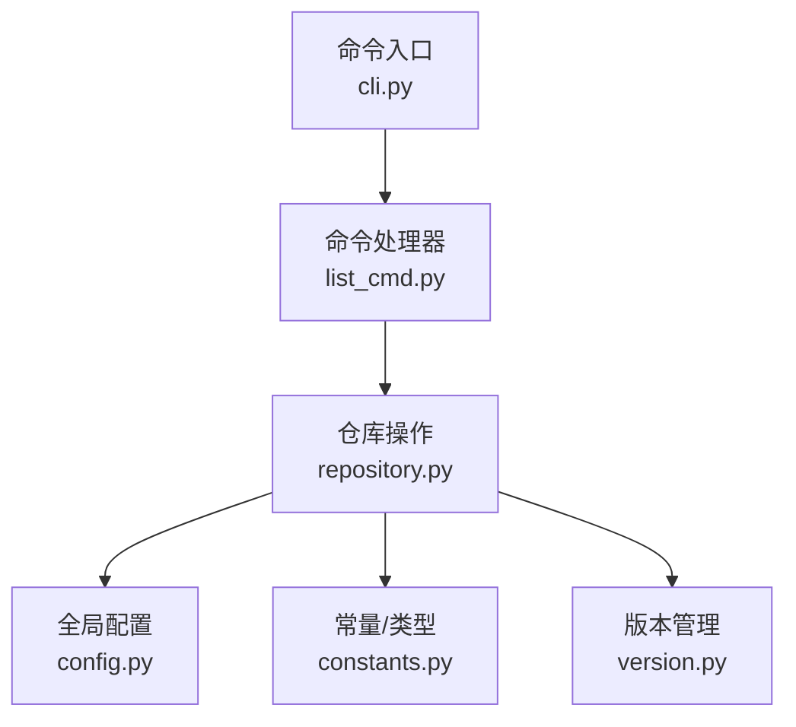
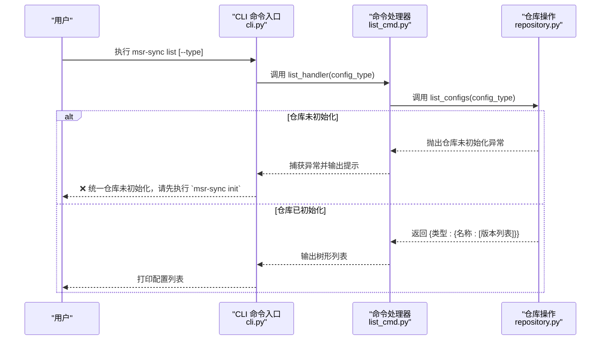
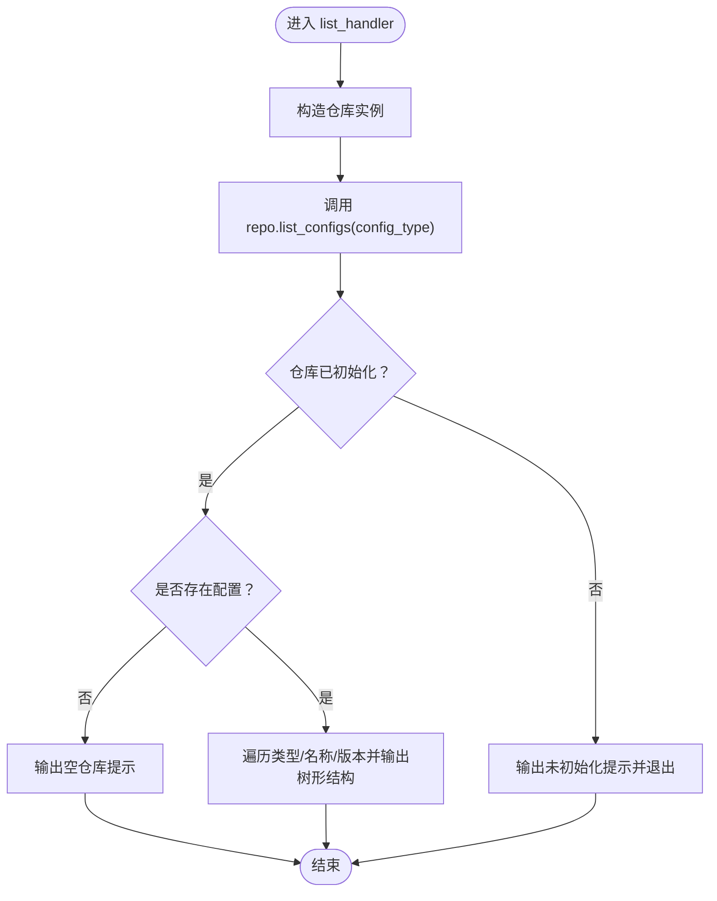
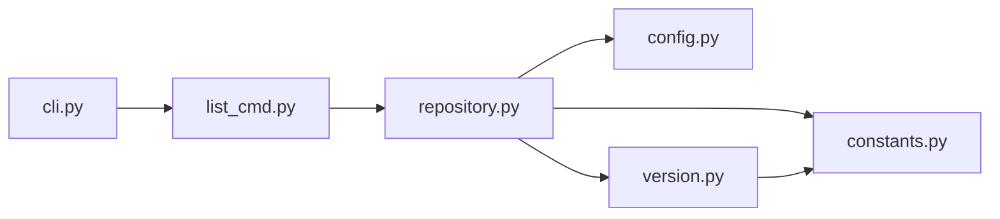

# list 命令详解

<cite>
**本文引用的文件**
- [MSR-cli/msr_sync/commands/list_cmd.py](file://MSR-cli/msr_sync/commands/list_cmd.py)
- [MSR-cli/msr_sync/cli.py](file://MSR-cli/msr_sync/cli.py)
- [MSR-cli/msr_sync/core/repository.py](file://MSR-cli/msr_sync/core/repository.py)
- [MSR-cli/msr_sync/core/config.py](file://MSR-cli/msr_sync/core/config.py)
- [MSR-cli/msr_sync/constants.py](file://MSR-cli/msr_sync/constants.py)
- [MSR-cli/msr_sync/core/version.py](file://MSR-cli/msr_sync/core/version.py)
- [MSR-cli/README.md](file://MSR-cli/README.md)
- [MSR-cli/docs/usage.md](file://MSR-cli/docs/usage.md)
- [MSR-cli/tests/test_commands.py](file://MSR-cli/tests/test_commands.py)
</cite>

## 目录
1. [简介](#简介)
2. [项目结构](#项目结构)
3. [核心组件](#核心组件)
4. [架构总览](#架构总览)
5. [详细组件分析](#详细组件分析)
6. [依赖关系分析](#依赖关系分析)
7. [性能考量](#性能考量)
8. [故障排查指南](#故障排查指南)
9. [结论](#结论)
10. [附录](#附录)

## 简介
本篇文档面向“msr-sync list”命令，提供从功能、输出格式、过滤参数到最佳实践的全量说明。list 命令用于以树形结构查看统一仓库中的配置条目，按配置类型分组展示名称与版本号，帮助你在批量操作前进行检查与验证。

## 项目结构
围绕 list 命令的关键文件与职责如下：
- 命令入口与参数定义：cli.py
- 命令处理器：commands/list_cmd.py
- 仓库操作与数据结构：core/repository.py
- 全局配置与默认路径：core/config.py
- 常量与类型：constants.py
- 版本号解析与排序：core/version.py
- 使用文档与示例：README.md、docs/usage.md
- 测试用例：tests/test_commands.py

图表来源
- [MSR-cli/msr_sync/cli.py:85-101](file://MSR-cli/msr_sync/cli.py#L85-L101)
- [MSR-cli/msr_sync/commands/list_cmd.py:12-63](file://MSR-cli/msr_sync/commands/list_cmd.py#L12-L63)
- [MSR-cli/msr_sync/core/repository.py:23-291](file://MSR-cli/msr_sync/core/repository.py#L23-L291)
- [MSR-cli/msr_sync/core/config.py:18-146](file://MSR-cli/msr_sync/core/config.py#L18-L146)
- [MSR-cli/msr_sync/constants.py:7-50](file://MSR-cli/msr_sync/constants.py#L7-L50)
- [MSR-cli/msr_sync/core/version.py:59-119](file://MSR-cli/msr_sync/core/version.py#L59-L119)

章节来源
- [MSR-cli/msr_sync/cli.py:85-101](file://MSR-cli/msr_sync/cli.py#L85-L101)
- [MSR-cli/msr_sync/commands/list_cmd.py:12-63](file://MSR-cli/msr_sync/commands/list_cmd.py#L12-L63)
- [MSR-cli/msr_sync/core/repository.py:23-291](file://MSR-cli/msr_sync/core/repository.py#L23-L291)
- [MSR-cli/msr_sync/core/config.py:18-146](file://MSR-cli/msr_sync/core/config.py#L18-L146)
- [MSR-cli/msr_sync/constants.py:7-50](file://MSR-cli/msr_sync/constants.py#L7-L50)
- [MSR-cli/msr_sync/core/version.py:59-119](file://MSR-cli/msr_sync/core/version.py#L59-L119)

## 核心组件
- 命令入口与参数
  - list 子命令在 CLI 中注册，支持 --type 过滤参数，类型限定为 rules/skills/mcp。
  - 命令调用命令处理器，捕获异常并输出错误信息。
- 命令处理器
  - 构造仓库实例，调用仓库的 list_configs 方法获取嵌套字典结构的数据。
  - 对空仓库与未初始化仓库分别输出提示。
  - 以树形结构打印配置类型、名称与版本列表。
- 仓库操作
  - list_configs 支持按类型过滤，返回 {类型: {名称: [版本列表]}} 结构。
  - 未指定类型时扫描全部类型。
  - 版本列表通过版本管理模块排序。
- 全局配置
  - 仓库根目录默认位于 ~/.msr-repos，可通过全局配置文件覆盖。
- 常量与类型
  - 定义仓库子目录名称与配置类型枚举，辅助目录解析与类型映射。
- 版本管理
  - 获取版本列表、最新版本与下一个版本号，保证版本号格式与顺序正确。

章节来源
- [MSR-cli/msr_sync/cli.py:85-101](file://MSR-cli/msr_sync/cli.py#L85-L101)
- [MSR-cli/msr_sync/commands/list_cmd.py:12-63](file://MSR-cli/msr_sync/commands/list_cmd.py#L12-L63)
- [MSR-cli/msr_sync/core/repository.py:201-235](file://MSR-cli/msr_sync/core/repository.py#L201-L235)
- [MSR-cli/msr_sync/core/config.py:18-146](file://MSR-cli/msr_sync/core/config.py#L18-L146)
- [MSR-cli/msr_sync/constants.py:16-31](file://MSR-cli/msr_sync/constants.py#L16-L31)
- [MSR-cli/msr_sync/core/version.py:59-119](file://MSR-cli/msr_sync/core/version.py#L59-L119)

## 架构总览
下面的序列图展示了从 CLI 到命令处理器再到仓库操作的调用链路，以及异常处理流程。

图表来源
- [MSR-cli/msr_sync/cli.py:85-101](file://MSR-cli/msr_sync/cli.py#L85-L101)
- [MSR-cli/msr_sync/commands/list_cmd.py:24-63](file://MSR-cli/msr_sync/commands/list_cmd.py#L24-L63)
- [MSR-cli/msr_sync/core/repository.py:201-235](file://MSR-cli/msr_sync/core/repository.py#L201-L235)

## 详细组件分析

### 命令入口与参数
- 注册 list 子命令，定义 --type 选项，限定值为 rules/skills/mcp。
- 调用命令处理器，捕获异常并输出错误信息，退出码为 1。

章节来源
- [MSR-cli/msr_sync/cli.py:85-101](file://MSR-cli/msr_sync/cli.py#L85-L101)

### 命令处理器逻辑
- 构造仓库实例（默认使用全局配置中的仓库路径）。
- 调用仓库的 list_configs，传入可选的类型过滤。
- 异常处理：若仓库未初始化，输出提示并退出。
- 空仓库处理：根据是否指定类型输出不同的提示。
- 非空仓库：按类型与名称排序，输出树形结构，版本以逗号分隔展示。

图表来源
- [MSR-cli/msr_sync/commands/list_cmd.py:24-63](file://MSR-cli/msr_sync/commands/list_cmd.py#L24-L63)
- [MSR-cli/msr_sync/core/repository.py:201-235](file://MSR-cli/msr_sync/core/repository.py#L201-L235)

章节来源
- [MSR-cli/msr_sync/commands/list_cmd.py:12-63](file://MSR-cli/msr_sync/commands/list_cmd.py#L12-L63)

### 仓库操作与数据结构
- list_configs 支持按类型过滤，返回嵌套字典：{类型: {名称: [版本列表]}}。
- 未指定类型时扫描全部类型。
- 版本列表通过版本管理模块排序，确保版本号顺序正确。

章节来源
- [MSR-cli/msr_sync/core/repository.py:201-235](file://MSR-cli/msr_sync/core/repository.py#L201-L235)
- [MSR-cli/msr_sync/core/version.py:59-119](file://MSR-cli/msr_sync/core/version.py#L59-L119)

### 输出格式与解读
- 输出标题：统一仓库配置列表。
- 分组：按配置类型（rules/skills/mcp）分组，仅展示存在配置的类型。
- 类型层级：├── 或 └── 前缀表示树形结构。
- 名称层级：├── 或 └── 前缀表示名称节点。
- 版本展示：名称行末尾以逗号分隔列出所有可用版本，如 [V1, V2]。
- 空仓库提示：未指定类型时提示“统一仓库为空，暂无配置”；指定类型时提示“统一仓库中没有该类型”。

章节来源
- [MSR-cli/msr_sync/commands/list_cmd.py:41-63](file://MSR-cli/msr_sync/commands/list_cmd.py#L41-L63)
- [MSR-cli/docs/usage.md:308-359](file://MSR-cli/docs/usage.md#L308-L359)

### 过滤参数与显示选项
- --type：仅展示指定类型的配置（rules/skills/mcp）。未指定时展示全部类型。
- 无其他显示选项：list 命令专注于简洁的树形展示，不提供额外的格式化开关。

章节来源
- [MSR-cli/msr_sync/cli.py:85-101](file://MSR-cli/msr_sync/cli.py#L85-L101)
- [MSR-cli/docs/usage.md:312-323](file://MSR-cli/docs/usage.md#L312-L323)

### 配置项分类展示
- 分类依据：仓库子目录 RULES/、SKILLS/、MCP/，分别对应 rules、skills、mcp 三类配置。
- 展示顺序：按类型与名称排序，版本按数字升序排列。

章节来源
- [MSR-cli/msr_sync/constants.py:10-16](file://MSR-cli/msr_sync/constants.py#L10-L16)
- [MSR-cli/msr_sync/core/repository.py:201-235](file://MSR-cli/msr_sync/core/repository.py#L201-L235)

### 版本信息与状态标识
- 版本信息：每个配置名称行末尾列出该配置的所有可用版本，以逗号分隔。
- 状态标识：list 命令不输出额外的状态标识，仅展示版本列表；版本号格式为 V1、V2 等。

章节来源
- [MSR-cli/msr_sync/core/version.py:59-119](file://MSR-cli/msr_sync/core/version.py#L59-L119)
- [MSR-cli/msr_sync/commands/list_cmd.py:61](file://MSR-cli/msr_sync/commands/list_cmd.py#L61)

### 命令行示例
- 基本列表显示：msr-sync list
- 按类型过滤：msr-sync list --type rules
- 仓库为空时：msr-sync list

章节来源
- [MSR-cli/docs/usage.md:324-359](file://MSR-cli/docs/usage.md#L324-L359)
- [MSR-cli/README.md:222-233](file://MSR-cli/README.md#L222-L233)

### 输出格式解读与信息提取技巧
- 从输出中可快速定位：
  - 配置类型：第一层为类型（rules/skills/mcp）。
  - 配置名称：第二层为名称。
  - 版本列表：名称行末尾的版本集合。
- 提取技巧：
  - 使用 --type 过滤缩小范围，便于批量操作前核对。
  - 结合 sync 命令的 --name 与 --version 参数，实现精准同步。

章节来源
- [MSR-cli/docs/usage.md:308-359](file://MSR-cli/docs/usage.md#L308-L359)

### 批量操作前的检查与验证建议
- 建议步骤：
  1) 使用 msr-sync list 查看当前仓库中的配置与版本。
  2) 使用 --type 过滤目标类型，确认名称与版本。
  3) 对比目标 IDE 的配置需求，决定是否需要同步或删除。
  4) 如需删除旧版本，结合 remove 命令进行清理。
- 注意事项：
  - 未初始化仓库时，list 会提示先执行 init。
  - 空仓库时，list 会提示暂无配置。

章节来源
- [MSR-cli/docs/usage.md:634-759](file://MSR-cli/docs/usage.md#L634-L759)
- [MSR-cli/tests/test_commands.py:184-200](file://MSR-cli/tests/test_commands.py#L184-L200)

### 与其他命令的最佳实践
- 与 init 配合：先 init 初始化仓库，再 list 查看导入结果。
- 与 import 配合：import 后使用 list 核对版本号与名称。
- 与 sync 配合：list 确认名称与版本后，使用 sync 的 --name 与 --version 精准同步。
- 与 remove 配合：list 确认待删除版本后，使用 remove 删除不再需要的版本。

章节来源
- [MSR-cli/docs/usage.md:308-359](file://MSR-cli/docs/usage.md#L308-L359)

## 依赖关系分析
- 命令入口依赖命令处理器。
- 命令处理器依赖仓库操作。
- 仓库操作依赖全局配置（默认路径）、常量与版本管理模块。
- 版本管理模块依赖常量中的版本前缀。

图表来源
- [MSR-cli/msr_sync/cli.py:85-101](file://MSR-cli/msr_sync/cli.py#L85-L101)
- [MSR-cli/msr_sync/commands/list_cmd.py:24-27](file://MSR-cli/msr_sync/commands/list_cmd.py#L24-L27)
- [MSR-cli/msr_sync/core/repository.py:33-39](file://MSR-cli/msr_sync/core/repository.py#L33-L39)
- [MSR-cli/msr_sync/core/version.py:6-7](file://MSR-cli/msr_sync/core/version.py#L6-L7)

章节来源
- [MSR-cli/msr_sync/cli.py:85-101](file://MSR-cli/msr_sync/cli.py#L85-L101)
- [MSR-cli/msr_sync/commands/list_cmd.py:24-27](file://MSR-cli/msr_sync/commands/list_cmd.py#L24-L27)
- [MSR-cli/msr_sync/core/repository.py:33-39](file://MSR-cli/msr_sync/core/repository.py#L33-L39)
- [MSR-cli/msr_sync/core/version.py:6-7](file://MSR-cli/msr_sync/core/version.py#L6-L7)

## 性能考量
- list 命令仅进行目录扫描与版本解析，时间复杂度与配置数量线性相关。
- 版本排序为 O(k log k)，k 为每个配置的版本数量。
- 建议在大型仓库中配合 --type 过滤，减少输出与处理时间。

## 故障排查指南
- 统一仓库未初始化
  - 现象：输出“统一仓库未初始化，请先执行 msr-sync init”。
  - 处理：先执行 init 初始化仓库。
- 仓库为空
  - 现象：输出“统一仓库为空，暂无配置”或“统一仓库中没有该类型配置”。
  - 处理：先导入配置后再使用 list。
- 权限问题
  - 现象：无法读取仓库目录。
  - 处理：检查仓库路径权限，确保用户具有读取权限。
- 配置文件错误
  - 现象：全局配置文件 YAML 语法错误。
  - 处理：修正配置文件或删除后重新初始化。

章节来源
- [MSR-cli/docs/usage.md:634-759](file://MSR-cli/docs/usage.md#L634-L759)
- [MSR-cli/tests/test_commands.py:184-200](file://MSR-cli/tests/test_commands.py#L184-L200)

## 结论
list 命令提供了简洁高效的统一仓库配置概览，通过树形结构清晰展示配置类型、名称与版本。配合 --type 过滤与其它命令，可在批量操作前进行准确的检查与验证，提升配置管理的可靠性与效率。

## 附录
- 常用命令速查
  - 查看全部配置：msr-sync list
  - 仅看 rules：msr-sync list --type rules
  - 仅看 skills：msr-sync list --type skills
  - 仅看 mcp：msr-sync list --type mcp

章节来源
- [MSR-cli/docs/usage.md:324-359](file://MSR-cli/docs/usage.md#L324-L359)
- [MSR-cli/README.md:222-233](file://MSR-cli/README.md#L222-L233)