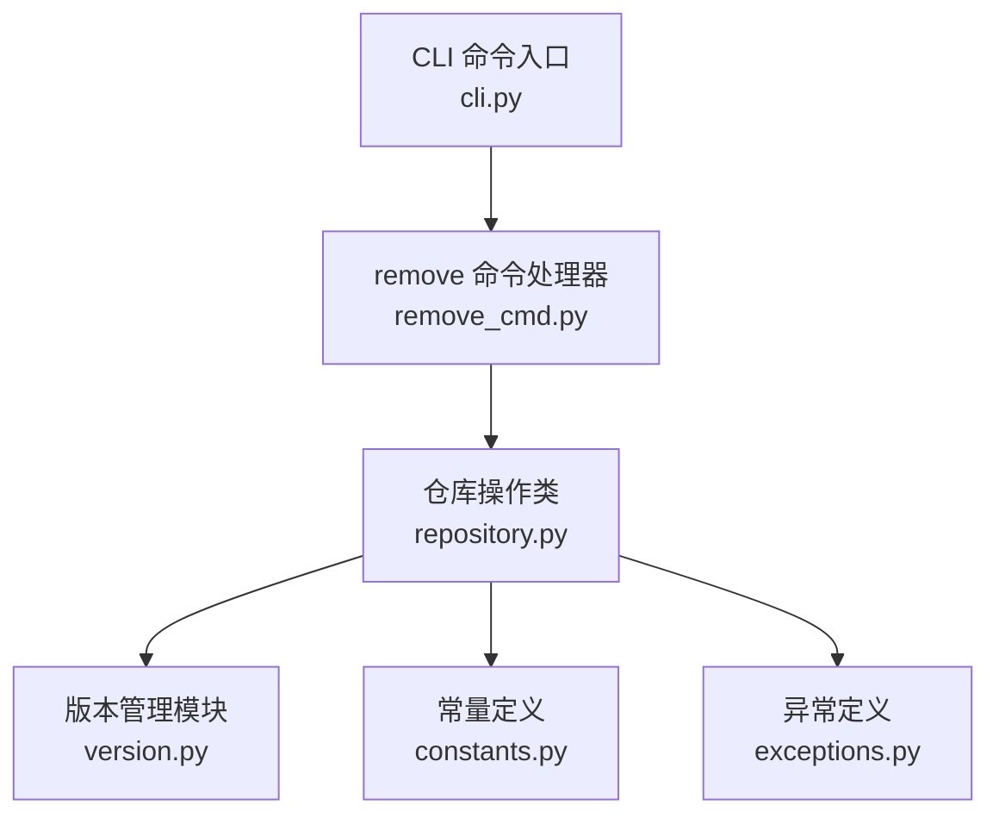
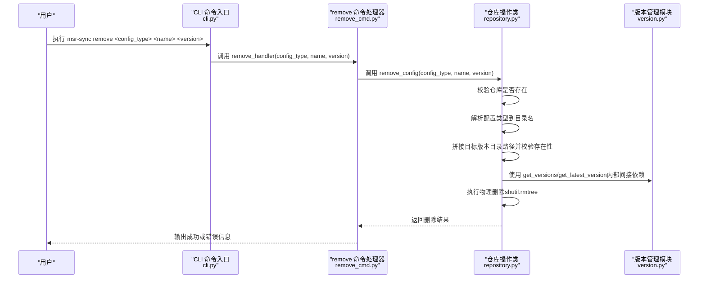
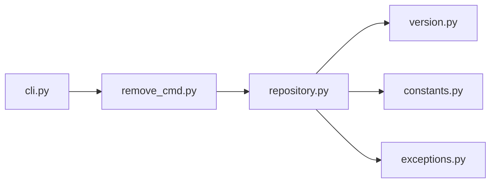

# remove 命令详解

<cite>
**本文引用的文件**
- [remove_cmd.py](file://MSR-cli/msr_sync/commands/remove_cmd.py)
- [repository.py](file://MSR-cli/msr_sync/core/repository.py)
- [version.py](file://MSR-cli/msr_sync/core/version.py)
- [cli.py](file://MSR-cli/msr_sync/cli.py)
- [constants.py](file://MSR-cli/msr_sync/constants.py)
- [exceptions.py](file://MSR-cli/msr_sync/core/exceptions.py)
- [usage.md](file://MSR-cli/docs/usage.md)
- [test_commands.py](file://MSR-cli/tests/test_commands.py)
</cite>

## 目录
1. [简介](#简介)
2. [项目结构](#项目结构)
3. [核心组件](#核心组件)
4. [架构总览](#架构总览)
5. [详细组件分析](#详细组件分析)
6. [依赖关系分析](#依赖关系分析)
7. [性能考量](#性能考量)
8. [故障排除指南](#故障排除指南)
9. [结论](#结论)
10. [附录](#附录)

## 简介
本文件面向 msr-sync 的 remove 命令，提供从功能、安全机制、删除选项与确认流程、版本管理与回滚保护、命令行示例、验证检查与风险评估、误删防护与恢复策略，以及版本管理最佳实践的完整说明。remove 命令用于删除统一仓库中指定配置类型的某个具体版本，支持 rules、skills、mcp 三类配置；删除操作为不可逆的物理删除，因此需要严格的前置校验与错误处理。

## 项目结构
remove 命令位于 CLI 层，通过命令包装器将用户输入解析为参数，随后调用命令处理器，最终委托给仓库操作模块执行删除逻辑。版本管理由独立模块负责，提供版本解析、格式化、版本列表与最新版本查询能力。

图表来源
- [cli.py:103-116](file://MSR-cli/msr_sync/cli.py#L103-L116)
- [remove_cmd.py:12-43](file://MSR-cli/msr_sync/commands/remove_cmd.py#L12-L43)
- [repository.py:23-265](file://MSR-cli/msr_sync/core/repository.py#L23-L265)
- [version.py:9-119](file://MSR-cli/msr_sync/core/version.py#L9-L119)
- [constants.py:7-50](file://MSR-cli/msr_sync/constants.py#L7-L50)
- [exceptions.py:4-34](file://MSR-cli/msr_sync/core/exceptions.py#L4-L34)

章节来源
- [cli.py:103-116](file://MSR-cli/msr_sync/cli.py#L103-L116)
- [remove_cmd.py:12-43](file://MSR-cli/msr_sync/commands/remove_cmd.py#L12-L43)
- [repository.py:23-265](file://MSR-cli/msr_sync/core/repository.py#L23-L265)
- [version.py:9-119](file://MSR-cli/msr_sync/core/version.py#L9-L119)
- [constants.py:7-50](file://MSR-cli/msr_sync/constants.py#L7-L50)
- [exceptions.py:4-34](file://MSR-cli/msr_sync/core/exceptions.py#L4-L34)

## 核心组件
- CLI 命令入口：定义 remove 子命令，接收配置类型、名称、版本三个参数，捕获异常并输出错误信息。
- 命令处理器：封装 remove_handler，负责调用仓库操作并输出结果或错误提示。
- 仓库操作类：Repository 提供 remove_config 方法，执行删除逻辑并进行前置校验。
- 版本管理模块：提供版本解析、格式化、版本列表与最新版本查询，支撑版本合法性与一致性。
- 异常体系：RepositoryNotFoundError、ConfigNotFoundError 等，用于区分“仓库未初始化”和“配置/版本不存在”。

章节来源
- [cli.py:103-116](file://MSR-cli/msr_sync/cli.py#L103-L116)
- [remove_cmd.py:12-43](file://MSR-cli/msr_sync/commands/remove_cmd.py#L12-L43)
- [repository.py:237-265](file://MSR-cli/msr_sync/core/repository.py#L237-L265)
- [version.py:9-119](file://MSR-cli/msr_sync/core/version.py#L9-L119)
- [exceptions.py:8-14](file://MSR-cli/msr_sync/core/exceptions.py#L8-L14)

## 架构总览
remove 命令的调用链路如下：

图表来源
- [cli.py:103-116](file://MSR-cli/msr_sync/cli.py#L103-L116)
- [remove_cmd.py:28-42](file://MSR-cli/msr_sync/commands/remove_cmd.py#L28-L42)
- [repository.py:237-265](file://MSR-cli/msr_sync/core/repository.py#L237-L265)
- [version.py:59-119](file://MSR-cli/msr_sync/core/version.py#L59-L119)

## 详细组件分析

### 命令定义与参数
- 命令格式：msr-sync remove <config_type> <name> <version>
- 参数说明：
  - config_type：配置类型，可选值为 rules、skills、mcp
  - name：配置名称
  - version：版本号，如 V1、V2 等
- 无额外标志位或确认流程：命令直接执行删除，不进行交互式确认。

章节来源
- [cli.py:103-116](file://MSR-cli/msr_sync/cli.py#L103-L116)
- [usage.md:361-395](file://MSR-cli/docs/usage.md#L361-L395)

### 命令处理器逻辑
- 初始化仓库对象：通过 Repository(base_path=None) 获取默认仓库路径。
- 调用 remove_config：传入 config_type、name、version。
- 成功输出：打印“✅ 已删除配置: {type}/{name}/{version}”。
- 错误处理：
  - 仓库未初始化：输出“❌ 统一仓库未初始化，请先执行 msr-sync init”，退出码 1。
  - 配置/版本不存在：输出“❌ 未找到指定的配置版本: {type}/{name}/{version}”，退出码 1。

章节来源
- [remove_cmd.py:12-43](file://MSR-cli/msr_sync/commands/remove_cmd.py#L12-L43)
- [exceptions.py:8-14](file://MSR-cli/msr_sync/core/exceptions.py#L8-L14)

### 仓库操作与删除实现
- 校验仓库存在性：若不存在则抛出 RepositoryNotFoundError。
- 解析配置类型到目录名：rules->RULES、skills->SKILLS、mcp->MCP。
- 拼接目标版本目录路径：{repo_root}/{dir}/{name}/{version}。
- 校验版本目录存在性：不存在则抛出 ConfigNotFoundError。
- 执行删除：使用 shutil.rmtree 删除版本目录。
- 返回布尔值：删除成功返回 True（处理器层未使用返回值，仅用于内部一致性）。

章节来源
- [repository.py:237-265](file://MSR-cli/msr_sync/core/repository.py#L237-L265)
- [constants.py:11-13](file://MSR-cli/msr_sync/constants.py#L11-L13)

### 版本管理与回滚保护
- 版本格式要求：必须以常量 VERSION_PREFIX（'V'）开头，后跟非零正整数，且不允许前导零（如 V01 视为非法）。
- 版本解析与格式化：parse_version 将字符串转为整数，format_version 将整数转回字符串。
- 版本列表与最新版本：get_versions 返回按数字升序排列的版本列表；get_latest_version 返回最大版本号；get_next_version 基于最新版本计算下一个版本号。
- 回滚保护机制：由于 remove 命令删除的是具体版本目录，删除后该版本即不可用；但保留其他版本，因此可通过同步到更高版本实现“回滚”到上一个可用版本。建议在删除前使用 list 命令确认版本状态。

章节来源
- [version.py:9-119](file://MSR-cli/msr_sync/core/version.py#L9-L119)
- [constants.py:36-37](file://MSR-cli/msr_sync/constants.py#L36-L37)
- [repository.py:186-197](file://MSR-cli/msr_sync/core/repository.py#L186-L197)

### 删除选项与确认流程
- 删除选项：命令不支持批量删除或强制删除标志；仅支持单个版本删除。
- 确认流程：命令本身不进行交互式确认，属于“静默删除”。建议在执行前使用 list 命令核对版本列表，避免误删。
- 与导入/同步的区别：导入/同步涉及交互确认与覆盖提示，而 remove 命令直接删除，无确认步骤。

章节来源
- [cli.py:103-116](file://MSR-cli/msr_sync/cli.py#L103-L116)
- [usage.md:361-395](file://MSR-cli/docs/usage.md#L361-L395)

### 安全机制与误删防护
- 前置校验：
  - 仓库存在性校验：未初始化时报错并退出。
  - 配置类型有效性：无效类型会触发异常。
  - 版本目录存在性：不存在的版本直接报错。
- 误删防护：
  - 建议在删除前执行 list 命令查看版本列表。
  - 建议在删除前备份仓库（复制 ~/.msr-repos 目录）。
  - 若删除错误版本，可通过重新导入对应版本或同步到其他版本进行恢复。
- 恢复策略：
  - 重新导入：将相同名称的配置重新导入，系统会自动创建新版本。
  - 同步恢复：若历史版本仍存在于仓库中，可直接同步到该版本。
  - 手工恢复：若仓库被破坏，可从备份恢复。

章节来源
- [repository.py:65-70](file://MSR-cli/msr_sync/core/repository.py#L65-L70)
- [repository.py:254-261](file://MSR-cli/msr_sync/core/repository.py#L254-L261)
- [usage.md:634-759](file://MSR-cli/docs/usage.md#L634-L759)

### 命令行示例
- 删除指定版本：
  - msr-sync remove rules coding-standards V1
- 删除不存在的版本（错误示例）：
  - msr-sync remove rules non-existent V1
- 删除后验证：
  - msr-sync list
- 批量删除说明：
  - 命令不支持批量删除；如需批量删除，可在脚本中循环调用该命令。

章节来源
- [usage.md:379-395](file://MSR-cli/docs/usage.md#L379-L395)
- [test_commands.py:272-317](file://MSR-cli/tests/test_commands.py#L272-L317)

### 风险评估与最佳实践
- 风险点：
  - 删除不可逆：删除后该版本数据丢失。
  - 误删高版本：删除最新版本可能导致同步到更高版本时出现“无可用版本”的情况。
  - 依赖关系：若其他配置依赖该版本，删除后可能影响同步结果。
- 最佳实践：
  - 删除前先执行 list，确认版本列表与预期一致。
  - 删除前进行备份。
  - 删除前评估影响范围，必要时先同步到其他版本。
  - 使用语义化命名与版本号，便于识别与回溯。
  - 在 CI/CD 或团队协作中，删除旧版本前进行评审与通知。

章节来源
- [repository.py:186-197](file://MSR-cli/msr_sync/core/repository.py#L186-L197)
- [usage.md:560-580](file://MSR-cli/docs/usage.md#L560-L580)

## 依赖关系分析
- remove 命令处理器依赖仓库操作类执行删除。
- 仓库操作类依赖版本管理模块进行版本解析与查询。
- CLI 命令入口依赖命令处理器。
- 常量模块提供仓库目录名与版本前缀。
- 异常模块提供统一的错误类型。

图表来源
- [cli.py:103-116](file://MSR-cli/msr_sync/cli.py#L103-L116)
- [remove_cmd.py:8-9](file://MSR-cli/msr_sync/commands/remove_cmd.py#L8-L9)
- [repository.py:7-9](file://MSR-cli/msr_sync/core/repository.py#L7-L9)
- [version.py:6](file://MSR-cli/msr_sync/core/version.py#L6)
- [constants.py:7](file://MSR-cli/msr_sync/constants.py#L7)
- [exceptions.py:8-9](file://MSR-cli/msr_sync/core/exceptions.py#L8-L9)

章节来源
- [cli.py:103-116](file://MSR-cli/msr_sync/cli.py#L103-L116)
- [remove_cmd.py:8-9](file://MSR-cli/msr_sync/commands/remove_cmd.py#L8-L9)
- [repository.py:7-9](file://MSR-cli/msr_sync/core/repository.py#L7-L9)
- [version.py:6](file://MSR-cli/msr_sync/core/version.py#L6)
- [constants.py:7](file://MSR-cli/msr_sync/constants.py#L7)
- [exceptions.py:8-9](file://MSR-cli/msr_sync/core/exceptions.py#L8-L9)

## 性能考量
- 删除操作为本地文件系统操作，主要耗时在于目录遍历与删除，通常很快。
- 版本管理模块在删除过程中不直接参与，但其提供的版本查询能力有助于删除前的决策。
- 建议在大规模删除场景下，先通过 list 命令预估删除数量，避免一次性删除过多版本导致长时间占用。

## 故障排除指南
- 统一仓库未初始化：
  - 现象：输出“❌ 统一仓库未初始化，请先执行 msr-sync init”，退出码 1。
  - 处理：先执行 msr-sync init 初始化仓库。
- 未找到指定的配置版本：
  - 现象：输出“❌ 未找到指定的配置版本: {type}/{name}/{version}”，退出码 1。
  - 处理：使用 msr-sync list 确认配置名称与版本是否存在。
- 配置类型无效：
  - 现象：解析配置类型时抛出异常。
  - 处理：确认 config_type 为 rules、skills、mcp 之一。
- 权限问题：
  - 现象：删除失败，提示权限不足。
  - 处理：检查 ~/.msr-repos 目录的读写权限。

章节来源
- [remove_cmd.py:35-42](file://MSR-cli/msr_sync/commands/remove_cmd.py#L35-L42)
- [repository.py:65-70](file://MSR-cli/msr_sync/core/repository.py#L65-L70)
- [repository.py:254-261](file://MSR-cli/msr_sync/core/repository.py#L254-L261)
- [usage.md:634-759](file://MSR-cli/docs/usage.md#L634-L759)

## 结论
remove 命令提供了简洁高效的单版本删除能力，适用于清理不再需要的历史版本。由于命令不包含交互确认与批量删除选项，建议在执行前进行充分的验证与备份，遵循版本管理最佳实践，以降低误删风险并保障配置的可恢复性。

## 附录
- 相关测试用例：
  - 删除成功：验证输出与目录存在性。
  - 仓库未初始化：验证错误提示与退出码。
  - 配置/版本不存在：验证错误提示与退出码。

章节来源
- [test_commands.py:269-317](file://MSR-cli/tests/test_commands.py#L269-L317)