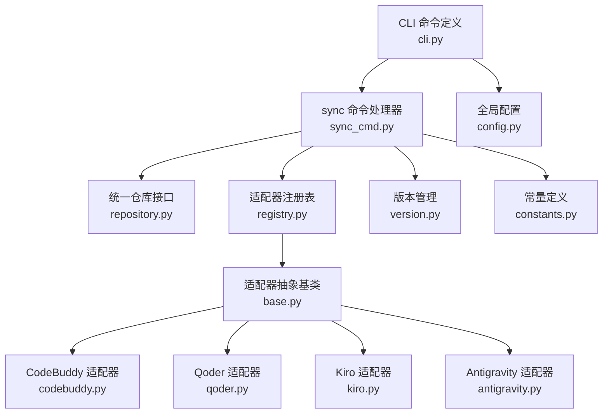
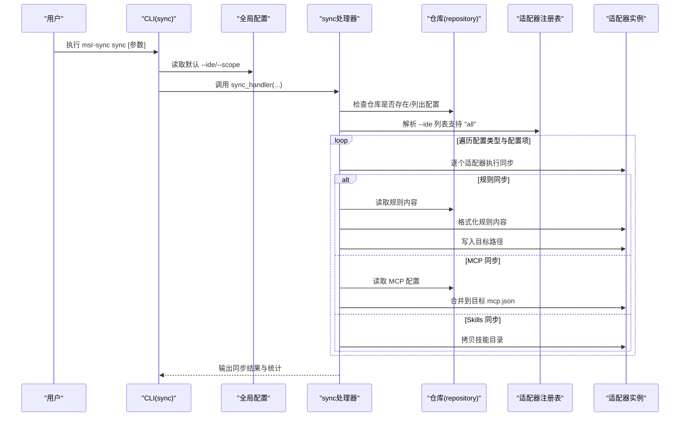
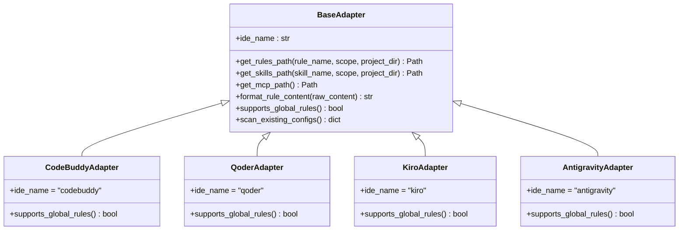
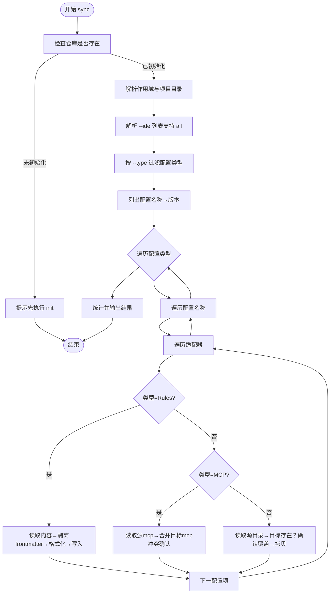
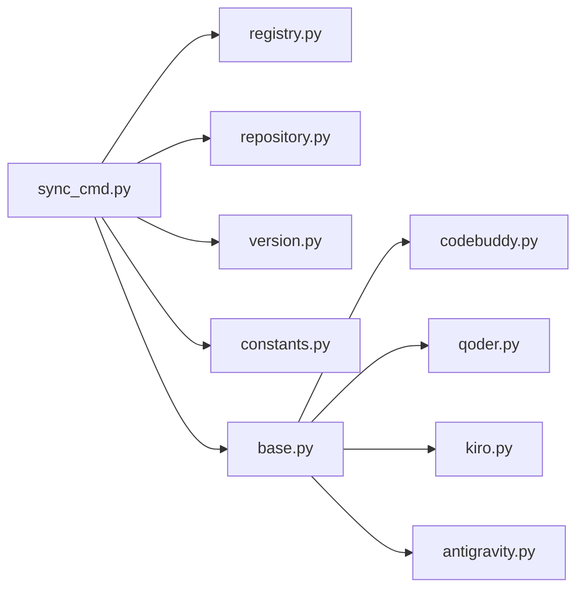

# sync 命令详解

<cite>
**本文引用的文件**
- [sync_cmd.py](file://MSR-cli/msr_sync/commands/sync_cmd.py)
- [cli.py](file://MSR-cli/msr_sync/cli.py)
- [registry.py](file://MSR-cli/msr_sync/adapters/registry.py)
- [base.py](file://MSR-cli/msr_sync/adapters/base.py)
- [codebuddy.py](file://MSR-cli/msr_sync/adapters/codebuddy.py)
- [qoder.py](file://MSR-cli/msr_sync/adapters/qoder.py)
- [kiro.py](file://MSR-cli/msr_sync/adapters/kiro.py)
- [antigravity.py](file://MSR-cli/msr_sync/adapters/antigravity.py)
- [repository.py](file://MSR-cli/msr_sync/core/repository.py)
- [version.py](file://MSR-cli/msr_sync/core/version.py)
- [constants.py](file://MSR-cli/msr_sync/constants.py)
- [config.py](file://MSR-cli/msr_sync/core/config.py)
- [usage.md](file://MSR-cli/docs/usage.md)
</cite>

## 更新摘要
**变更内容**
- 更新CLI参数支持kiro和antigravity选项
- 扩展IDE支持列表，新增两个适配器
- 更新适配器注册表和路径解析
- 更新命令行示例和使用场景
- 更新IDE配置路径参考表

## 目录
1. [简介](#简介)
2. [项目结构](#项目结构)
3. [核心组件](#核心组件)
4. [架构总览](#架构总览)
5. [详细组件分析](#详细组件分析)
6. [依赖关系分析](#依赖关系分析)
7. [性能考量](#性能考量)
8. [故障排除指南](#故障排除指南)
9. [结论](#结论)
10. [附录](#附录)

## 简介
sync 命令用于将统一仓库中的配置（rules、skills、MCP）同步到目标 IDE。它支持按 IDE、作用域（全局/项目）、配置类型、配置名称和版本进行精确控制；支持批量同步多个 IDE；并在同步过程中完成配置扫描、格式转换与目标写入。

**更新** 新增对Kiro（AWS）和Antigravity（Google）两个IDE的支持，扩展了IDE适配器生态系统。

## 项目结构
围绕 sync 命令的关键模块与职责如下：
- CLI 层：定义命令与参数解析，调用命令处理器
- 命令处理器：协调仓库、适配器与同步流程
- 适配器层：面向不同 IDE 的路径解析、格式转换与能力查询
- 仓库层：统一仓库的读写、版本管理与列表查询
- 核心配置与常量：全局配置、默认值、常量定义

**图表来源**
- [cli.py:41-82](file://MSR-cli/msr_sync/cli.py#L41-L82)
- [sync_cmd.py:26-131](file://MSR-cli/msr_sync/commands/sync_cmd.py#L26-L131)
- [registry.py:75-89](file://MSR-cli/msr_sync/adapters/registry.py#L75-L89)
- [base.py:8-105](file://MSR-cli/msr_sync/adapters/base.py#L8-L105)
- [codebuddy.py:22-143](file://MSR-cli/msr_sync/adapters/codebuddy.py#L22-L143)
- [qoder.py:22-140](file://MSR-cli/msr_sync/adapters/qoder.py#L22-L140)
- [kiro.py:21-133](file://MSR-cli/msr_sync/adapters/kiro.py#L21-L133)
- [antigravity.py:22-131](file://MSR-cli/msr_sync/adapters/antigravity.py#L22-L131)
- [repository.py:23-291](file://MSR-cli/msr_sync/core/repository.py#L23-L291)
- [version.py:1-119](file://MSR-cli/msr_sync/core/version.py#L1-L119)
- [constants.py:16-50](file://MSR-cli/msr_sync/constants.py#L16-L50)
- [config.py:18-160](file://MSR-cli/msr_sync/core/config.py#L18-L160)

**章节来源**
- [cli.py:41-82](file://MSR-cli/msr_sync/cli.py#L41-L82)
- [sync_cmd.py:26-131](file://MSR-cli/msr_sync/commands/sync_cmd.py#L26-L131)
- [registry.py:75-89](file://MSR-cli/msr_sync/adapters/registry.py#L75-L89)
- [base.py:8-105](file://MSR-cli/msr_sync/adapters/base.py#L8-L105)
- [repository.py:23-291](file://MSR-cli/msr_sync/core/repository.py#L23-L291)
- [version.py:1-119](file://MSR-cli/msr_sync/core/version.py#L1-L119)
- [constants.py:16-50](file://MSR-cli/msr_sync/constants.py#L16-L50)
- [config.py:18-160](file://MSR-cli/msr_sync/core/config.py#L18-L160)

## 核心组件
- CLI 命令定义与参数绑定：解析 --ide、--scope、--project-dir、--type、--name、--version，并与全局配置联动
- sync 命令处理器：负责仓库初始化检查、目标 IDE 解析、配置过滤与遍历、逐项同步与统计
- 适配器层：统一抽象路径解析、格式转换与能力查询；具体 IDE 适配器实现各自路径与头部格式
- 仓库层：提供 list_configs、get_config_path、read_rule_content 等能力，配合版本管理模块
- 版本管理：解析/格式化版本号、获取最新版本、计算下一个版本
- 常量与全局配置：统一仓库目录名、配置类型枚举、默认 IDE 与作用域、配置文件加载与校验

**更新** 适配器层现已支持7个IDE：qoder、lingma、trae、codebuddy、cursor、kiro、antigravity，扩展了IDE支持范围。

**章节来源**
- [cli.py:41-82](file://MSR-cli/msr_sync/cli.py#L41-L82)
- [sync_cmd.py:26-131](file://MSR-cli/msr_sync/commands/sync_cmd.py#L26-L131)
- [base.py:8-105](file://MSR-cli/msr_sync/adapters/base.py#L8-L105)
- [repository.py:201-235](file://MSR-cli/msr_sync/core/repository.py#L201-L235)
- [version.py:59-119](file://MSR-cli/msr_sync/core/version.py#L59-L119)
- [constants.py:16-50](file://MSR-cli/msr_sync/constants.py#L16-L50)
- [config.py:18-160](file://MSR-cli/msr_sync/core/config.py#L18-L160)

## 架构总览
sync 命令的端到端流程如下：

**图表来源**
- [cli.py:58-82](file://MSR-cli/msr_sync/cli.py#L58-L82)
- [sync_cmd.py:26-131](file://MSR-cli/msr_sync/commands/sync_cmd.py#L26-L131)
- [registry.py:75-89](file://MSR-cli/msr_sync/adapters/registry.py#L75-L89)
- [repository.py:201-291](file://MSR-cli/msr_sync/core/repository.py#L201-L291)

## 详细组件分析

### CLI 与参数绑定
- 参数
  - --ide：可多次指定，支持 trae/qoder/lingma/codebuddy/cursor/kiro/antigravity/all
  - --scope：project/global，默认来自全局配置
  - --project-dir：仅在 scope=project 时生效
  - --type：rules/skills/mcp，过滤配置类型
  - --name：仅同步指定名称
  - --version：指定版本，未指定时使用最新版本
- 默认值与优先级：命令行参数优先于全局配置文件

**更新** --ide 参数现已支持kiro和antigravity选项，扩展了IDE选择范围。

**章节来源**
- [cli.py:41-82](file://MSR-cli/msr_sync/cli.py#L41-L82)
- [config.py:18-80](file://MSR-cli/msr_sync/core/config.py#L18-L80)

### 适配器集成与 --ide 参数
- 适配器注册表支持的 IDE：qoder、lingma、trae、codebuddy、cursor、kiro、antigravity
- --ide=all 展开为所有已注册适配器
- 每个适配器需实现：
  - 路径解析：get_rules_path/get_skills_path/get_mcp_path
  - 格式转换：format_rule_content
  - 能力查询：supports_global_rules
  - 扫描能力：scan_existing_configs（供 init --merge 使用）

**更新** 适配器注册表现已包含kiro和antigravity两个新适配器，支持更多IDE生态。

**图表来源**
- [base.py:8-105](file://MSR-cli/msr_sync/adapters/base.py#L8-L105)
- [codebuddy.py:22-143](file://MSR-cli/msr_sync/adapters/codebuddy.py#L22-L143)
- [qoder.py:22-140](file://MSR-cli/msr_sync/adapters/qoder.py#L22-L140)
- [kiro.py:21-133](file://MSR-cli/msr_sync/adapters/kiro.py#L21-L133)
- [antigravity.py:22-131](file://MSR-cli/msr_sync/adapters/antigravity.py#L22-L131)

**章节来源**
- [registry.py:8-89](file://MSR-cli/msr_sync/adapters/registry.py#L8-L89)
- [base.py:8-105](file://MSR-cli/msr_sync/adapters/base.py#L8-L105)
- [codebuddy.py:22-143](file://MSR-cli/msr_sync/adapters/codebuddy.py#L22-L143)
- [qoder.py:22-140](file://MSR-cli/msr_sync/adapters/qoder.py#L22-L140)
- [kiro.py:21-133](file://MSR-cli/msr_sync/adapters/kiro.py#L21-L133)
- [antigravity.py:22-131](file://MSR-cli/msr_sync/adapters/antigravity.py#L22-L131)

### 同步流程与数据流
- 仓库初始化检查：若未初始化，提示先执行 init
- 目标 IDE 解析：支持单个 IDE 或批量（all）
- 配置过滤：按类型、名称、版本过滤
- 遍历与同步：
  - Rules：剥离 frontmatter → 适配器格式化 → 写入目标路径；全局级需检查 IDE 能力
  - MCP：读取源 mcp.json → 合并到目标 mcp.json（同名条目交互确认）
  - Skills：目标不存在直接拷贝；存在时交互确认覆盖
- 统计与输出：累计成功同步数量，输出汇总信息

**图表来源**
- [sync_cmd.py:26-131](file://MSR-cli/msr_sync/commands/sync_cmd.py#L26-L131)
- [sync_cmd.py:133-411](file://MSR-cli/msr_sync/commands/sync_cmd.py#L133-L411)
- [repository.py:201-291](file://MSR-cli/msr_sync/core/repository.py#L201-L291)

**章节来源**
- [sync_cmd.py:26-131](file://MSR-cli/msr_sync/commands/sync_cmd.py#L26-L131)
- [sync_cmd.py:133-411](file://MSR-cli/msr_sync/commands/sync_cmd.py#L133-L411)
- [repository.py:201-291](file://MSR-cli/msr_sync/core/repository.py#L201-L291)

### 配置扫描、格式转换与目标写入
- 配置扫描：init --merge 使用适配器的 scan_existing_configs，扫描用户级 rules/skills/mcp
- 格式转换：Rules 同步时剥离原始 frontmatter，再由适配器添加 IDE 特定头部
- 目标写入：
  - Rules：确保父目录存在后写入文件
  - MCP：目标不存在新建；存在时按同名条目交互确认后合并写回
  - Skills：目标不存在直接拷贝目录；存在时交互确认后替换

**更新** 新增的kiro和antigravity适配器均实现了完整的配置扫描功能，支持init --merge操作。

**章节来源**
- [base.py:93-105](file://MSR-cli/msr_sync/adapters/base.py#L93-L105)
- [sync_cmd.py:179-230](file://MSR-cli/msr_sync/commands/sync_cmd.py#L179-L230)
- [sync_cmd.py:238-349](file://MSR-cli/msr_sync/commands/sync_cmd.py#L238-L349)
- [sync_cmd.py:357-411](file://MSR-cli/msr_sync/commands/sync_cmd.py#L357-L411)
- [kiro.py:100-133](file://MSR-cli/msr_sync/adapters/kiro.py#L100-L133)
- [antigravity.py:105-131](file://MSR-cli/msr_sync/adapters/antigravity.py#L105-L131)

### 冲突处理、版本管理与回滚
- 冲突处理
  - MCP：同名条目存在时交互确认是否覆盖
  - Skills：同名目录存在时交互确认是否覆盖
- 版本管理
  - 未指定 --version 时，默认使用每个配置的最新版本
  - 版本解析与格式化遵循统一规范，确保版本号顺序正确
- 回滚机制
  - 当前实现未提供自动回滚；建议在同步前备份目标 MCP 配置文件，或在交互确认时谨慎选择覆盖

**章节来源**
- [sync_cmd.py:324-349](file://MSR-cli/msr_sync/commands/sync_cmd.py#L324-L349)
- [sync_cmd.py:390-402](file://MSR-cli/msr_sync/commands/sync_cmd.py#L390-L402)
- [version.py:9-119](file://MSR-cli/msr_sync/core/version.py#L9-L119)

### 命令行示例与使用场景
- 基本同步：同步所有配置到所有 IDE（全局级）
- 条件同步：仅同步 rules 到指定 IDE；或仅同步指定名称的配置
- 高级同步：同时指定 --scope、--project-dir、--type、--name、--version 组合
- 批量同步：--ide 指定多个 IDE，或使用 --ide all 同步到所有支持的 IDE
- 新增IDE同步：支持Kiro和Antigravity的专门同步场景

**更新** 新增针对kiro和antigravity的命令行示例，涵盖这两个新支持IDE的使用场景。

**章节来源**
- [usage.md:202-306](file://MSR-cli/docs/usage.md#L202-L306)

## 依赖关系分析
- sync_cmd 依赖：
  - 适配器注册表：resolve_ide_list
  - 仓库接口：list_configs、get_config_path、read_rule_content
  - 版本管理：get_latest_version
  - 常量：ConfigType、MCP_CONFIG_FILE
  - 异常：ConfigNotFoundError、RepositoryNotFoundError
- 适配器层：
  - BaseAdapter 抽象统一路径解析、格式转换与能力查询
  - CodeBuddyAdapter/QoderAdapter/KiroAdapter/AntigravityAdapter 实现具体路径与头部格式

**更新** 依赖关系现已包含新增的kiro和antigravity适配器。

**图表来源**
- [sync_cmd.py:14-24](file://MSR-cli/msr_sync/commands/sync_cmd.py#L14-L24)
- [registry.py:75-89](file://MSR-cli/msr_sync/adapters/registry.py#L75-L89)
- [repository.py:201-291](file://MSR-cli/msr_sync/core/repository.py#L201-L291)
- [version.py:160-163](file://MSR-cli/msr_sync/core/version.py#L160-L163)
- [constants.py:16-43](file://MSR-cli/msr_sync/constants.py#L16-L43)
- [base.py:8-105](file://MSR-cli/msr_sync/adapters/base.py#L8-L105)
- [codebuddy.py:22-143](file://MSR-cli/msr_sync/adapters/codebuddy.py#L22-L143)
- [qoder.py:22-140](file://MSR-cli/msr_sync/adapters/qoder.py#L22-L140)
- [kiro.py:21-133](file://MSR-cli/msr_sync/adapters/kiro.py#L21-L133)
- [antigravity.py:22-131](file://MSR-cli/msr_sync/adapters/antigravity.py#L22-L131)

**章节来源**
- [sync_cmd.py:14-24](file://MSR-cli/msr_sync/commands/sync_cmd.py#L14-L24)
- [registry.py:75-89](file://MSR-cli/msr_sync/adapters/registry.py#L75-L89)
- [repository.py:201-291](file://MSR-cli/msr_sync/core/repository.py#L201-L291)
- [version.py:160-163](file://MSR-cli/msr_sync/core/version.py#L160-L163)
- [constants.py:16-43](file://MSR-cli/msr_sync/constants.py#L16-L43)
- [base.py:8-105](file://MSR-cli/msr_sync/adapters/base.py#L8-L105)
- [codebuddy.py:22-143](file://MSR-cli/msr_sync/adapters/codebuddy.py#L22-L143)
- [qoder.py:22-140](file://MSR-cli/msr_sync/adapters/qoder.py#L22-L140)
- [kiro.py:21-133](file://MSR-cli/msr_sync/adapters/kiro.py#L21-L133)
- [antigravity.py:22-131](file://MSR-cli/msr_sync/adapters/antigravity.py#L22-L131)

## 性能考量
- 并发处理：当前实现为顺序遍历配置与适配器，未启用并发；对于大量配置与多 IDE 同步，可考虑按配置类型或 IDE 分片并发，但需注意目标路径写入的互斥与冲突确认的交互
- I/O 优化：规则同步为小文件写入，MCP 合并为 JSON 读写与序列化；Skills 同步为目录拷贝；建议在大规模同步时避免频繁磁盘抖动
- 版本解析：版本号解析与排序为 O(n log n)，n 为配置版本数量；可通过缓存最近一次解析结果减少重复计算

## 故障排除指南
- 统一仓库未初始化：执行 init 初始化仓库后再试
- 未找到配置或版本：使用 list 查看当前仓库配置与版本，确认名称与版本号
- MCP 配置格式错误：检查目标 mcp.json 是否为合法 JSON
- 不支持的 IDE：确认 --ide 为 trae/qoder/lingma/codebuddy/cursor/kiro/antigravity/all
- 全局级 rules 不支持：Trae、Qoder、Lingma、Cursor、Antigravity 不支持用户级 rules，使用项目级同步
- 权限不足：检查目标路径写入权限
- 配置文件 YAML 语法错误：修正 ~/.msr-sync/config.yaml 的 YAML 语法

**更新** 故障排除指南现已包含对kiro和antigravity相关问题的处理建议。

**章节来源**
- [usage.md:634-759](file://MSR-cli/docs/usage.md#L634-L759)
- [sync_cmd.py:52-54](file://MSR-cli/msr_sync/commands/sync_cmd.py#L52-L54)
- [sync_cmd.py:268-271](file://MSR-cli/msr_sync/commands/sync_cmd.py#L268-L271)
- [sync_cmd.py:205-207](file://MSR-cli/msr_sync/commands/sync_cmd.py#L205-L207)

## 结论
sync 命令通过清晰的参数体系与适配器抽象，实现了对多 IDE 的统一配置同步。其流程涵盖仓库检查、目标解析、配置过滤、格式转换与目标写入，并在 MCP 与 Skills 同步中提供了交互式冲突处理。结合全局配置与版本管理，用户可在不同场景下灵活地进行基础同步、条件同步与高级同步。

**更新** 随着kiro和antigravity适配器的加入，sync命令现已支持9个主流IDE，进一步增强了工具的通用性和适用性。

## 附录
- 常用命令速查
  - 同步所有配置到所有 IDE（全局级）：msr-sync sync
  - 仅同步 rules 到指定 IDE：msr-sync sync --type rules --ide trae
  - 项目级同步：msr-sync sync --scope project
  - 指定名称与版本：msr-sync sync --type rules --name coding-standards --version V1
  - 批量同步多个 IDE：msr-sync sync --ide trae --ide codebuddy
  - 新增：同步到Kiro：msr-sync sync --ide kiro --type rules
  - 新增：同步到Antigravity：msr-sync sync --ide antigravity --type skills

**更新** 新增针对kiro和antigravity的常用命令示例，帮助用户快速上手这两个新支持的IDE。

**章节来源**
- [usage.md:202-306](file://MSR-cli/docs/usage.md#L202-L306)