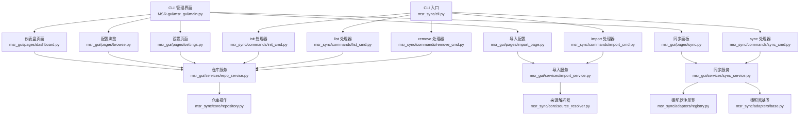
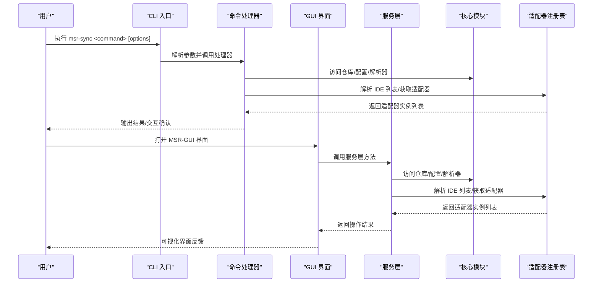
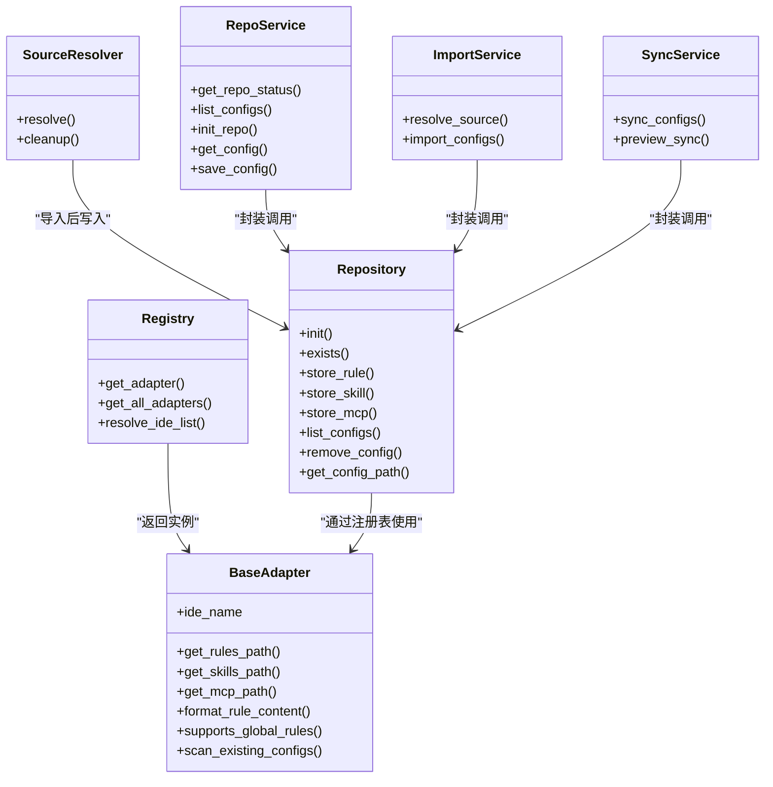

# 命令参考手册

<cite>
**本文引用的文件**
- [MSR-cli/README.md](file://MSR-cli/README.md)
- [MSR-cli/docs/usage.md](file://MSR-cli/docs/usage.md)
- [MSR-cli/pyproject.toml](file://MSR-cli/pyproject.toml)
- [MSR-cli/msr_sync/cli.py](file://MSR-cli/msr_sync/cli.py)
- [MSR-cli/msr_sync/commands/init_cmd.py](file://MSR-cli/msr_sync/commands/init_cmd.py)
- [MSR-cli/msr_sync/commands/import_cmd.py](file://MSR-cli/msr_sync/commands/import_cmd.py)
- [MSR-cli/msr_sync/commands/sync_cmd.py](file://MSR-cli/msr_sync/commands/sync_cmd.py)
- [MSR-cli/msr_sync/commands/list_cmd.py](file://MSR-cli/msr_sync/commands/list_cmd.py)
- [MSR-cli/msr_sync/commands/remove_cmd.py](file://MSR-cli/msr_sync/commands/remove_cmd.py)
- [MSR-cli/msr_sync/core/config.py](file://MSR-cli/msr_sync/core/config.py)
- [MSR-cli/msr_sync/core/repository.py](file://MSR-cli/msr_sync/core/repository.py)
- [MSR-cli/msr_sync/core/source_resolver.py](file://MSR-cli/msr_sync/core/source_resolver.py)
- [MSR-cli/msr_sync/constants.py](file://MSR-cli/msr_sync/constants.py)
- [MSR-cli/msr_sync/adapters/base.py](file://MSR-cli/msr_sync/adapters/base.py)
- [MSR-cli/msr_sync/adapters/registry.py](file://MSR-cli/msr_sync/adapters/registry.py)
- [MSR-gui/README.md](file://MSR-gui/README.md)
- [MSR-gui/pyproject.toml](file://MSR-gui/pyproject.toml)
- [MSR-gui/msr_gui/main.py](file://MSR-gui/msr_gui/main.py)
- [MSR-gui/msr_gui/pages/dashboard.py](file://MSR-gui/msr_gui/pages/dashboard.py)
- [MSR-gui/msr_gui/pages/browse.py](file://MSR-gui/msr_gui/pages/browse.py)
- [MSR-gui/msr_gui/pages/import_page.py](file://MSR-gui/msr_gui/pages/import_page.py)
- [MSR-gui/msr_gui/pages/sync.py](file://MSR-gui/msr_gui/pages/sync.py)
- [MSR-gui/msr_gui/pages/settings.py](file://MSR-gui/msr_gui/pages/settings.py)
- [MSR-gui/msr_gui/services/repo_service.py](file://MSR-gui/msr_gui/services/repo_service.py)
- [MSR-gui/msr_gui/services/import_service.py](file://MSR-gui/msr_gui/services/import_service.py)
- [MSR-gui/msr_gui/services/sync_service.py](file://MSR-gui/msr_gui/services/sync_service.py)
- [MSR-gui/msr_gui/state.py](file://MSR-gui/msr_gui/state.py)
- [MSR-gui/msr_gui/components/sidebar.py](file://MSR-gui/msr_gui/components/sidebar.py)
</cite>

## 目录
1. [简介](#简介)
2. [项目结构](#项目结构)
3. [核心组件](#核心组件)
4. [架构总览](#架构总览)
5. [详细命令分析](#详细命令分析)
6. [GUI 管理界面](#gui-管理界面)
7. [依赖关系分析](#依赖关系分析)
8. [性能考量](#性能考量)
9. [故障排查指南](#故障排查指南)
10. [结论](#结论)
11. [附录](#附录)

## 简介
本手册面向日常使用与深度学习，系统梳理 MSR-v2 的命令行工具 msr-sync 的五大核心命令：init、import、sync、list、remove。同时新增 GUI 管理界面作为替代方案，用户现在可以选择使用 GUI 或 CLI 两种方式管理 MSR 配置。内容涵盖功能说明、参数详解、使用示例、最佳实践、错误处理、调试技巧、高级用法与组合场景，并给出性能优化建议。命令之间的依赖关系与执行顺序清晰呈现，帮助你高效构建与维护统一配置仓库。

## 项目结构
- CLI 入口与命令定义集中在 msr_sync/cli.py，负责参数解析与调用各命令处理器。
- 命令处理器位于 msr_sync/commands/*，分别实现 init、import、sync、list、remove 的业务逻辑。
- GUI 管理界面基于 NiceGUI 构建，位于 MSR-gui/msr_gui/ 目录，提供可视化操作界面。
- 核心能力由 msr_sync/core/* 提供：仓库管理、配置加载、来源解析、常量与版本管理。
- IDE 适配器抽象与注册表位于 msr_sync/adapters/*，用于路径解析、格式转换与扫描。

**图表来源**
- [MSR-cli/msr_sync/cli.py:1-116](file://MSR-cli/msr_sync/cli.py#L1-L116)
- [MSR-cli/msr_sync/commands/init_cmd.py:1-137](file://MSR-cli/msr_sync/commands/init_cmd.py#L1-L137)
- [MSR-cli/msr_sync/commands/import_cmd.py:1-151](file://MSR-cli/msr_sync/commands/import_cmd.py#L1-L151)
- [MSR-cli/msr_sync/commands/sync_cmd.py:1-411](file://MSR-cli/msr_sync/commands/sync_cmd.py#L1-L411)
- [MSR-cli/msr_sync/commands/list_cmd.py:1-63](file://MSR-cli/msr_sync/commands/list_cmd.py#L1-L63)
- [MSR-cli/msr_sync/commands/remove_cmd.py:1-43](file://MSR-cli/msr_sync/commands/remove_cmd.py#L1-L43)
- [MSR-gui/msr_gui/main.py:1-42](file://MSR-gui/msr_gui/main.py#L1-L42)
- [MSR-gui/msr_gui/pages/dashboard.py:1-98](file://MSR-gui/msr_gui/pages/dashboard.py#L1-L98)
- [MSR-gui/msr_gui/pages/browse.py:1-172](file://MSR-gui/msr_gui/pages/browse.py#L1-L172)
- [MSR-gui/msr_gui/pages/import_page.py:1-400](file://MSR-gui/msr_gui/pages/import_page.py#L1-L400)
- [MSR-gui/msr_gui/pages/sync.py:1-459](file://MSR-gui/msr_gui/pages/sync.py#L1-L459)
- [MSR-gui/msr_gui/pages/settings.py:1-119](file://MSR-gui/msr_gui/pages/settings.py#L1-L119)
- [MSR-gui/msr_gui/services/repo_service.py:1-234](file://MSR-gui/msr_gui/services/repo_service.py#L1-L234)
- [MSR-gui/msr_gui/services/import_service.py:1-154](file://MSR-gui/msr_gui/services/import_service.py#L1-L154)
- [MSR-gui/msr_gui/services/sync_service.py:1-427](file://MSR-gui/msr_gui/services/sync_service.py#L1-L427)

**章节来源**
- [MSR-cli/README.md:1-361](file://MSR-cli/README.md#L1-L361)
- [MSR-cli/docs/usage.md:1-759](file://MSR-cli/docs/usage.md#L1-L759)
- [MSR-cli/pyproject.toml:1-37](file://MSR-cli/pyproject.toml#L1-L37)
- [MSR-gui/README.md:1-46](file://MSR-gui/README.md#L1-L46)
- [MSR-gui/pyproject.toml:1-22](file://MSR-gui/pyproject.toml#L1-L22)

## 核心组件
- 仓库管理（Repository）：提供 init、store_rule、store_skill、store_mcp、list_configs、remove_config、get_config_path 等能力，统一管理 RULES/SKILLS/MCP 三层目录与版本号。
- 来源解析器（SourceResolver）：支持文件、目录、压缩包、URL 四类来源，自动识别配置类型与条目，必要时进行批量确认。
- 全局配置（GlobalConfig）：加载 ~/.msr-sync/config.yaml，提供 repo_path、ignore_patterns、default_ides、default_scope 等默认行为。
- 适配器体系（BaseAdapter + Registry）：抽象 IDE 差异，提供路径解析、格式转换、能力查询与扫描接口；注册表负责延迟加载与实例缓存。
- 常量与版本（constants + version）：定义配置类型、目录名、版本前缀、MCP 文件名、归档扩展名等；版本管理支持 V1/V2 等命名与最新版本解析。
- GUI 服务层：RepoService、ImportService、SyncService 封装核心功能，提供异步调用和错误处理。

**章节来源**
- [MSR-cli/msr_sync/core/repository.py:1-291](file://MSR-cli/msr_sync/core/repository.py#L1-L291)
- [MSR-cli/msr_sync/core/source_resolver.py:1-404](file://MSR-cli/msr_sync/core/source_resolver.py#L1-L404)
- [MSR-cli/msr_sync/core/config.py:1-204](file://MSR-cli/msr_sync/core/config.py#L1-L204)
- [MSR-cli/msr_sync/constants.py:1-50](file://MSR-cli/msr_sync/constants.py#L1-L50)
- [MSR-cli/msr_sync/adapters/base.py:1-105](file://MSR-cli/msr_sync/adapters/base.py#L1-L105)
- [MSR-cli/msr_sync/adapters/registry.py:1-88](file://MSR-cli/msr_sync/adapters/registry.py#L1-L88)
- [MSR-gui/msr_gui/services/repo_service.py:1-234](file://MSR-gui/msr_gui/services/repo_service.py#L1-L234)
- [MSR-gui/msr_gui/services/import_service.py:1-154](file://MSR-gui/msr_gui/services/import_service.py#L1-L154)
- [MSR-gui/msr_gui/services/sync_service.py:1-427](file://MSR-gui/msr_gui/services/sync_service.py#L1-L427)

## 架构总览
命令执行流程遵循"CLI → 命令处理器 → 核心模块"的分层设计。init 与 import 侧重仓库初始化与导入；sync 侧重多 IDE 同步；list/remove 提供查询与删除能力。GUI 管理界面通过服务层封装相同的核心功能，提供可视化操作体验。适配器注册表贯穿 sync 流程，按 IDE 分发具体实现。

**图表来源**
- [MSR-cli/msr_sync/cli.py:14-116](file://MSR-cli/msr_sync/cli.py#L14-L116)
- [MSR-cli/msr_sync/commands/sync_cmd.py:65-131](file://MSR-cli/msr_sync/commands/sync_cmd.py#L65-L131)
- [MSR-cli/msr_sync/adapters/registry.py:74-88](file://MSR-cli/msr_sync/adapters/registry.py#L74-L88)
- [MSR-gui/msr_gui/main.py:8-42](file://MSR-gui/msr_gui/main.py#L8-L42)
- [MSR-gui/msr_gui/services/repo_service.py:22-234](file://MSR-gui/msr_gui/services/repo_service.py#L22-L234)
- [MSR-gui/msr_gui/services/import_service.py:14-154](file://MSR-gui/msr_gui/services/import_service.py#L14-L154)
- [MSR-gui/msr_gui/services/sync_service.py:20-427](file://MSR-gui/msr_gui/services/sync_service.py#L20-L427)

## 详细命令分析

### init 命令
- 作用机制
  - 初始化统一仓库目录结构（RULES/SKILLS/MCP）。
  - 生成默认全局配置文件 ~/.msr-sync/config.yaml（若不存在）。
  - 可选合并已有 IDE 配置：扫描各 IDE 适配器的现有配置，导入到统一仓库并输出汇总。
- 适用场景
  - 首次使用，建立统一仓库。
  - 从现有 IDE 迁移配置，快速补齐统一仓库。
- 关键参数
  - --merge：合并已有 IDE 配置。
- 返回结果
  - 成功创建仓库与默认配置文件。
  - 合并模式下输出各 IDE 导入数量摘要。
- 使用示例
  - 基本初始化与合并导入示例见使用文档。
- 最佳实践
  - 建议首次运行后立即执行 list 查看仓库状态。
  - 合并导入后，建议对关键配置进行版本管理与同步验证。
- 错误处理与调试
  - 仓库已存在时为幂等操作，不会重复创建。
  - 合并过程中遇到异常会跳过该 IDE 的导入并输出警告。
- 性能考虑
  - 合并导入涉及磁盘读取与 JSON 解析，建议在空闲时段执行。
  - 合并完成后可立即执行 import/sync，减少后续 IO 次数。

**章节来源**
- [MSR-cli/msr_sync/commands/init_cmd.py:13-137](file://MSR-cli/msr_sync/commands/init_cmd.py#L13-L137)
- [MSR-cli/docs/usage.md:21-81](file://MSR-cli/docs/usage.md#L21-L81)
- [MSR-cli/README.md:159-174](file://MSR-cli/README.md#L159-L174)

### import 命令
- 作用机制
  - 解析来源（文件/目录/压缩包/URL），识别配置类型与条目。
  - 单条目直接导入，多条目逐项确认后导入。
  - 自动处理版本冲突（同名配置创建新版本）。
- 适用场景
  - 从本地文件/目录、压缩包或远程 URL 导入规则、技能、MCP 配置。
- 关键参数
  - config_type：rules/skills/mcp。
  - source：文件/目录/压缩包/URL。
- 返回结果
  - 成功导入的条目数量统计。
- 使用示例
  - 规则、技能、MCP 的导入示例与批量确认流程见使用文档。
- 最佳实践
  - 导入前先执行 list 检查仓库状态。
  - 使用压缩包集中分发配置，便于团队协作。
  - 注意忽略模式（ignore_patterns）对扫描的影响。
- 错误处理与调试
  - 无效来源、网络错误、仓库未初始化等均会输出明确错误信息并退出。
  - URL 导入时会自动处理 GitHub blob 到 raw 的转换。
- 性能考虑
  - 压缩包解压与目录扫描可能较耗时，建议在 SSD 上执行。
  - 大量小文件导入时，优先打包为压缩包以减少 IO。

**章节来源**
- [MSR-cli/msr_sync/commands/import_cmd.py:14-151](file://MSR-cli/msr_sync/commands/import_cmd.py#L14-L151)
- [MSR-cli/msr_sync/core/source_resolver.py:77-111](file://MSR-cli/msr_sync/core/source_resolver.py#L77-L111)
- [MSR-cli/docs/usage.md:84-200](file://MSR-cli/docs/usage.md#L84-L200)
- [MSR-cli/README.md:23-118](file://MSR-cli/README.md#L23-L118)

### sync 命令
- 作用机制
  - 将统一仓库中的配置同步到目标 IDE（支持多 IDE、多层级、多类型过滤与版本选择）。
  - 规则：剥离原始 frontmatter，按 IDE 添加特定头部，写入目标路径。
  - 技能：拷贝目录，冲突时确认覆盖。
  - MCP：合并 mcp.json，冲突时确认覆盖。
- 适用场景
  - 将统一仓库中的配置批量同步到 Trae、Qoder、Lingma、CodeBuddy。
  - 按类型、名称、版本与层级（全局/项目）精确控制同步范围。
- 关键参数
  - --ide：可多次指定，或使用 all。
  - --scope：global/project。
  - --project-dir：项目目录路径（仅 scope=project 时使用）。
  - --type：rules/skills/mcp。
  - --name：配置名称过滤。
  - --version：指定版本（默认使用最新版本）。
- 返回结果
  - 成功同步的条目总数与每项提示信息。
- 使用示例
  - 全量同步、指定 IDE/类型/名称/版本、项目级同步等示例见使用文档。
- 最佳实践
  - 未指定 --version 时默认使用最新版本，可在提示中确认实际版本。
  - 全局级 rules 对 Trae、Qoder、Lingma 不支持，会跳过并输出警告。
  - MCP 同步前确保 mcp.json 存在且包含 mcpServers 字段。
- 错误处理与调试
  - 仓库未初始化、配置不存在、MCP 配置格式错误等均有明确错误提示。
  - MCP 合并时若目标存在同名条目，会弹窗确认覆盖。
- 性能考虑
  - 多 IDE 同步时，适配器注册表使用缓存避免重复实例化。
  - MCP 合并采用增量写入，仅在有变更时写回文件。

**章节来源**
- [MSR-cli/msr_sync/commands/sync_cmd.py:26-411](file://MSR-cli/msr_sync/commands/sync_cmd.py#L26-L411)
- [MSR-cli/docs/usage.md:202-306](file://MSR-cli/docs/usage.md#L202-L306)
- [MSR-cli/README.md:240-296](file://MSR-cli/README.md#L240-L296)

### list 命令
- 作用机制
  - 以树形结构展示统一仓库中的配置条目，按类型分组，列出名称与版本号。
- 适用场景
  - 快速浏览仓库内容，核对导入/同步结果。
- 关键参数
  - --type：可选过滤类型（rules/skills/mcp）。
- 返回结果
  - 仓库为空或按类型过滤后的树形列表。
- 使用示例
  - 全部配置与按类型过滤的示例见使用文档。
- 最佳实践
  - 与 sync/remove 配合使用，先 list 再操作。
- 错误处理与调试
  - 仓库未初始化时输出明确提示并退出。
- 性能考虑
  - 列表展示为 O(N) 遍历，通常很快。

**章节来源**
- [MSR-cli/msr_sync/commands/list_cmd.py:12-63](file://MSR-cli/msr_sync/commands/list_cmd.py#L12-L63)
- [MSR-cli/docs/usage.md:308-358](file://MSR-cli/docs/usage.md#L308-L358)

### remove 命令
- 作用机制
  - 删除统一仓库中指定的配置版本。
- 适用场景
  - 清理不再使用的旧版本配置，释放空间。
- 关键参数
  - config_type：rules/skills/mcp。
  - name：配置名称。
  - version：版本号（如 V1）。
- 返回结果
  - 成功删除提示或错误提示。
- 使用示例
  - 删除指定版本与错误场景示例见使用文档。
- 最佳实践
  - 删除前先 list 确认版本存在。
  - 删除后如需恢复，可重新导入对应版本。
- 错误处理与调试
  - 仓库未初始化或版本不存在时输出明确错误并退出。
- 性能考虑
  - 删除为目录级操作，通常很快。

**章节来源**
- [MSR-cli/msr_sync/commands/remove_cmd.py:12-43](file://MSR-cli/msr_sync/commands/remove_cmd.py#L12-L43)
- [MSR-cli/docs/usage.md:361-395](file://MSR-cli/docs/usage.md#L361-L395)

## GUI 管理界面

### 界面概述
MSR-GUI 是基于 NiceGUI 构建的可视化管理界面，提供与 CLI 功能等价的图形化操作体验。用户可以通过浏览器或原生窗口模式访问界面，享受更直观的操作流程。

### 启动方式
- 开发模式（浏览器）：`msr-gui --browser`
- 原生窗口模式：`msr-gui`
- 指定端口：`msr-gui --port 8080`

### 主要功能模块
- **仪表盘**：概览仓库状态、配置统计和快捷操作
- **配置浏览**：树形展示配置列表，支持版本查看和删除
- **导入配置**：三步向导式导入流程，支持多种来源
- **同步面板**：可视化同步配置，支持预览和确认覆盖
- **设置**：管理全局配置和仓库初始化

### 界面特色
- **响应式设计**：适配不同屏幕尺寸
- **实时状态**：自动刷新仓库状态和配置列表
- **操作日志**：记录所有操作历史
- **主题支持**：支持明暗主题切换
- **异步处理**：后台任务执行，界面保持流畅

**章节来源**
- [MSR-gui/README.md:1-46](file://MSR-gui/README.md#L1-L46)
- [MSR-gui/pyproject.toml:1-22](file://MSR-gui/pyproject.toml#L1-L22)
- [MSR-gui/msr_gui/main.py:1-42](file://MSR-gui/msr_gui/main.py#L1-L42)

### 仪表盘页面
仪表盘提供仓库状态概览、配置统计和快捷操作入口。用户可以快速了解仓库初始化状态、各类配置数量，并直接执行常用操作。

### 配置浏览页面
配置浏览页面以树形结构展示所有配置，支持按类型筛选。用户可以查看配置详情、版本信息，以及执行删除操作。

### 导入配置页面
导入配置页面采用三步向导设计：
1. **选择来源**：选择配置类型和导入来源（文件路径、URL、上传文件）
2. **预览确认**：显示解析结果，支持全选/反选
3. **执行导入**：显示导入进度和日志

### 同步面板
同步面板提供完整的同步操作界面：
- **配置选择**：多标签页展示不同类型配置
- **IDE 选择**：可视化选择目标 IDE，显示支持能力
- **同步选项**：设置同步层级和项目目录
- **预览功能**：显示将要执行的操作和潜在冲突
- **执行同步**：支持确认覆盖并显示详细日志

### 设置页面
设置页面允许用户管理全局配置：
- **全局配置**：仓库路径、默认 IDE、默认作用域、忽略模式
- **仓库管理**：初始化仓库和合并已有配置
- **主题设置**：明暗主题切换

**章节来源**
- [MSR-gui/msr_gui/pages/dashboard.py:1-98](file://MSR-gui/msr_gui/pages/dashboard.py#L1-L98)
- [MSR-gui/msr_gui/pages/browse.py:1-172](file://MSR-gui/msr_gui/pages/browse.py#L1-L172)
- [MSR-gui/msr_gui/pages/import_page.py:1-400](file://MSR-gui/msr_gui/pages/import_page.py#L1-L400)
- [MSR-gui/msr_gui/pages/sync.py:1-459](file://MSR-gui/msr_gui/pages/sync.py#L1-L459)
- [MSR-gui/msr_gui/pages/settings.py:1-119](file://MSR-gui/msr_gui/pages/settings.py#L1-L119)

### 服务层架构
GUI 通过服务层封装核心功能，提供统一的异步接口：

- **RepoService**：封装仓库状态、配置列表、初始化等操作
- **ImportService**：封装导入解析和执行逻辑
- **SyncService**：封装同步预览和执行逻辑

这些服务层直接调用 msr-sync 的核心模块，确保 GUI 和 CLI 功能的一致性。

**章节来源**
- [MSR-gui/msr_gui/services/repo_service.py:1-234](file://MSR-gui/msr_gui/services/repo_service.py#L1-L234)
- [MSR-gui/msr_gui/services/import_service.py:1-154](file://MSR-gui/msr_gui/services/import_service.py#L1-L154)
- [MSR-gui/msr_gui/services/sync_service.py:1-427](file://MSR-gui/msr_gui/services/sync_service.py#L1-L427)

## 依赖关系分析
- 命令到核心模块
  - import/sync/list/remove 均依赖 Repository 与 GlobalConfig。
  - import 依赖 SourceResolver。
  - sync 依赖适配器注册表与适配器基类。
  - GUI 服务层同样依赖相同的底层模块。
- 适配器体系
  - BaseAdapter 抽象各 IDE 的路径、格式与能力。
  - Registry 负责 IDE 名称到适配器类的延迟加载与实例缓存。
- 常量与版本
  - constants 定义目录名、版本前缀、文件名等。
  - version 模块配合仓库实现版本号解析与递增。
- GUI 与 CLI 的关系
  - GUI 通过服务层调用相同的底层模块，功能完全等价。
  - 两者共享同一套核心逻辑，保证数据一致性和操作效果。

**图表来源**
- [MSR-cli/msr_sync/adapters/base.py:8-105](file://MSR-cli/msr_sync/adapters/base.py#L8-L105)
- [MSR-cli/msr_sync/adapters/registry.py:45-88](file://MSR-cli/msr_sync/adapters/registry.py#L45-L88)
- [MSR-cli/msr_sync/core/repository.py:23-200](file://MSR-cli/msr_sync/core/repository.py#L23-L200)
- [MSR-cli/msr_sync/core/source_resolver.py:43-117](file://MSR-cli/msr_sync/core/source_resolver.py#L43-L117)
- [MSR-gui/msr_gui/services/repo_service.py:22-234](file://MSR-gui/msr_gui/services/repo_service.py#L22-L234)
- [MSR-gui/msr_gui/services/import_service.py:14-154](file://MSR-gui/msr_gui/services/import_service.py#L14-L154)
- [MSR-gui/msr_gui/services/sync_service.py:20-427](file://MSR-gui/msr_gui/services/sync_service.py#L20-L427)

**章节来源**
- [MSR-cli/msr_sync/adapters/registry.py:1-88](file://MSR-cli/msr_sync/adapters/registry.py#L1-L88)
- [MSR-cli/msr_sync/core/repository.py:1-291](file://MSR-cli/msr_sync/core/repository.py#L1-L291)
- [MSR-cli/msr_sync/core/source_resolver.py:1-404](file://MSR-cli/msr_sync/core/source_resolver.py#L1-L404)
- [MSR-gui/msr_gui/services/repo_service.py:1-234](file://MSR-gui/msr_gui/services/repo_service.py#L1-L234)
- [MSR-gui/msr_gui/services/import_service.py:1-154](file://MSR-gui/msr_gui/services/import_service.py#L1-L154)
- [MSR-gui/msr_gui/services/sync_service.py:1-427](file://MSR-gui/msr_gui/services/sync_service.py#L1-L427)

## 性能考量
- I/O 优化
  - 压缩包导入优于大量小文件导入，减少目录扫描与磁盘寻道。
  - 合并导入一次性扫描多 IDE，建议在空闲时段执行。
  - GUI 通过异步调用避免界面卡顿，后台执行长时间操作。
- 同步效率
  - 适配器实例缓存避免重复创建，提升多 IDE 同步速度。
  - MCP 合并采用增量写入，仅在有变更时写回文件。
  - GUI 预览功能提前发现潜在冲突，减少无效同步。
- 版本管理
  - 仓库按版本目录组织，删除旧版本可显著减少空间占用。
- 平台与路径
  - 自动检测平台并解析路径，避免跨平台兼容性问题导致的额外开销。
- 界面性能
  - GUI 使用虚拟滚动和懒加载技术，处理大量配置数据。
  - 状态缓存减少重复请求，提升界面响应速度。

## 故障排查指南
- 统一仓库未初始化
  - 现象：执行 sync/list/remove/import 前未执行 init。
  - 处理：先执行 msr-sync init 或在 GUI 设置页面初始化仓库。
- 无效的导入来源
  - 现象：文件/目录不存在、格式不受支持、URL 不可达。
  - 处理：检查路径、格式与网络连通性。
- 网络错误
  - 现象：从 URL 下载压缩包失败。
  - 处理：检查网络与代理设置。
- 压缩包解压失败
  - 现象：压缩包损坏或格式不受支持。
  - 处理：确认压缩包完整性与格式。
- MCP 配置文件格式错误
  - 现象：mcp.json 非法 JSON。
  - 处理：使用 JSON 校验工具修正。
- 权限不足
  - 现象：无法写入目标 IDE 配置路径。
  - 处理：检查目标目录权限。
- 配置文件 YAML 语法错误
  - 现象：~/.msr-sync/config.yaml 语法错误。
  - 处理：修正缩进、冒号与引号；或删除后重新 init。
- IDE 名称或默认层级无效
  - 现象：配置文件中的 default_ides/default_scope 无效。
  - 处理：修正为支持值或删除该项使用默认。
- GUI 界面问题
  - 现象：界面无法加载或功能异常。
  - 处理：检查浏览器兼容性、网络连接和端口占用情况。

**章节来源**
- [MSR-cli/docs/usage.md:634-759](file://MSR-cli/docs/usage.md#L634-L759)

## 结论
msr-sync 通过 init/import/sync/list/remove 五大命令和配套的 GUI 管理界面，构建了从"导入—统一—同步—管理"闭环的配置管理体系。用户现在可以选择 CLI 或 GUI 两种方式来管理 MSR 配置，满足不同使用场景的需求。GUI 提供了更直观的可视化操作体验，而 CLI 则适合自动化脚本和批量处理。借助适配器抽象与版本管理，它有效解决了多 IDE 配置割裂、迁移成本高、格式不统一与版本缺失的问题。建议在团队内推广统一仓库与版本策略，结合批量导入与项目级同步，提升协作效率与一致性。

## 附录

### 命令与参数速查
- init
  - 参数：--merge
  - 适用：首次初始化与合并已有配置
- import
  - 参数：config_type（rules/skills/mcp）、source
  - 适用：从文件/目录/压缩包/URL 导入
- sync
  - 参数：--ide（可多次）、--scope、--project-dir、--type、--name、--version
  - 适用：多 IDE、多层级、多类型、多版本同步
- list
  - 参数：--type
  - 适用：查看仓库配置与版本
- remove
  - 参数：config_type、name、version
  - 适用：删除指定版本

### GUI 功能速查
- 仪表盘：仓库状态概览和快捷操作
- 配置浏览：树形展示和版本管理
- 导入配置：三步向导式导入
- 同步面板：可视化同步操作
- 设置：全局配置和仓库管理

**章节来源**
- [MSR-cli/msr_sync/cli.py:14-116](file://MSR-cli/msr_sync/cli.py#L14-L116)
- [MSR-cli/docs/usage.md:21-395](file://MSR-cli/docs/usage.md#L21-L395)
- [MSR-gui/README.md:15-33](file://MSR-gui/README.md#L15-L33)

### 常见组合与最佳实践
- 从 Trae 迁移到 CodeBuddy：init --merge → list → sync --ide codebuddy
- 批量同步到所有 IDE：sync
- 仅同步规则到指定 IDE：sync --type rules --ide trae
- 项目级同步：sync --scope project --project-dir /path/to/project
- 多版本管理：import → list → sync --name <name> --version V1 → remove <type> <name> V1
- 自定义默认行为：编辑 ~/.msr-sync/config.yaml，设置 default_ides/default_scope
- GUI 操作流程：通过仪表盘初始化 → 导入配置 → 浏览管理 → 同步到 IDE

**章节来源**
- [MSR-cli/docs/usage.md:525-631](file://MSR-cli/docs/usage.md#L525-L631)
- [MSR-cli/README.md:297-345](file://MSR-cli/README.md#L297-L345)
- [MSR-gui/msr_gui/pages/dashboard.py:85-98](file://MSR-gui/msr_gui/pages/dashboard.py#L85-L98)
- [MSR-gui/msr_gui/pages/import_page.py:173-193](file://MSR-gui/msr_gui/pages/import_page.py#L173-L193)
- [MSR-gui/msr_gui/pages/sync.py:332-417](file://MSR-gui/msr_gui/pages/sync.py#L332-L417)