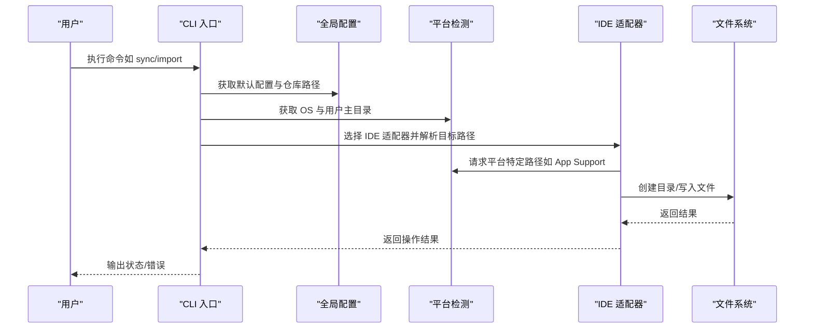
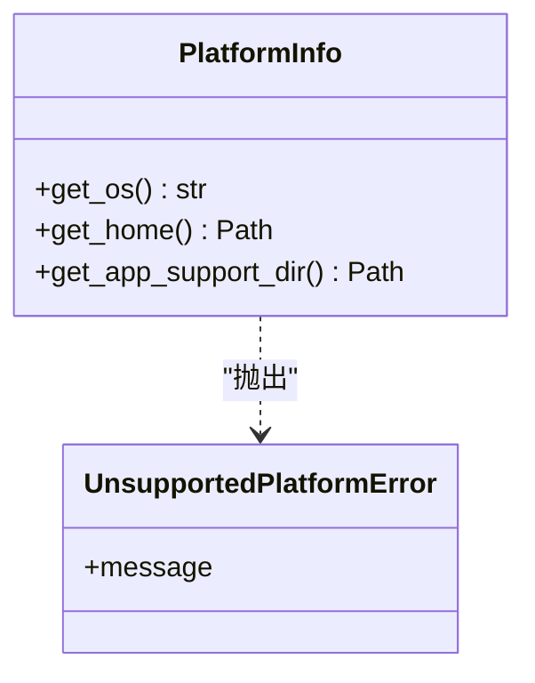
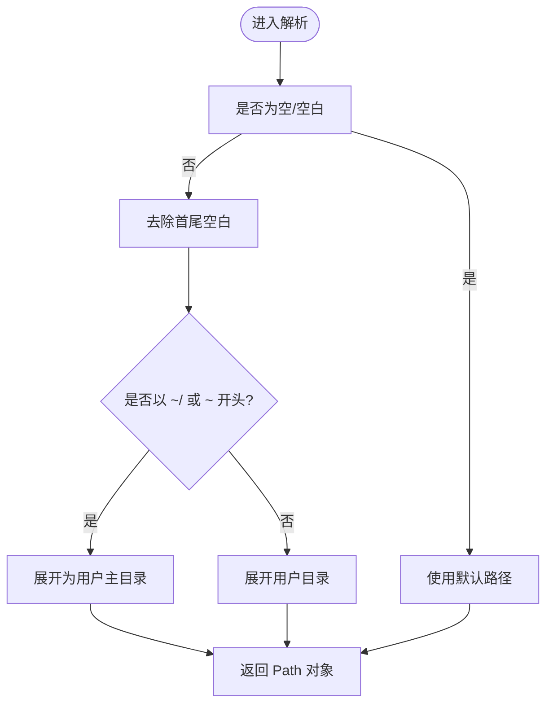
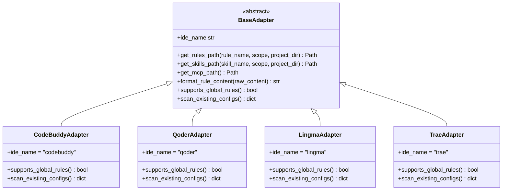
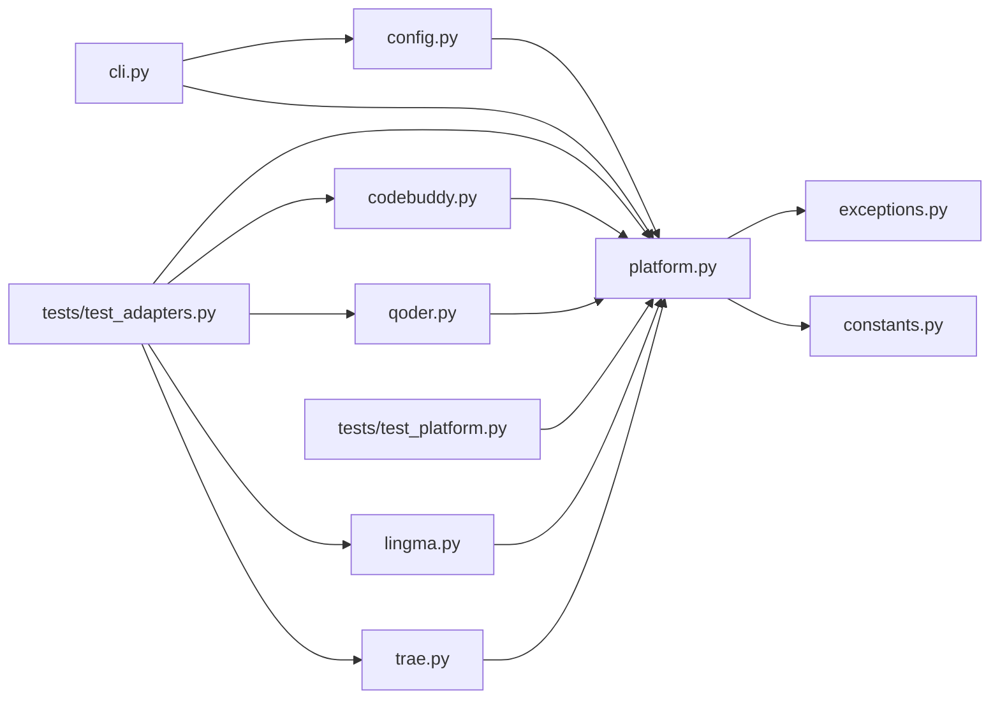
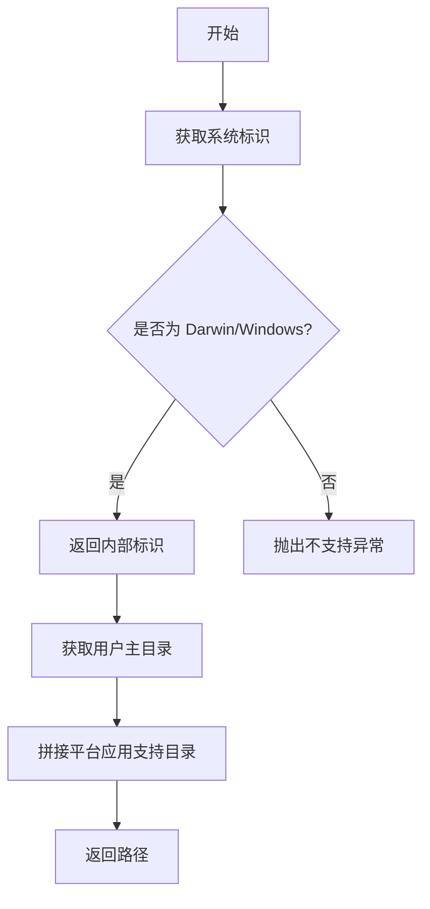

# 平台支持

<cite>
**本文引用的文件**
- [MSR-cli/msr_sync/core/platform.py](file://MSR-cli/msr_sync/core/platform.py)
- [MSR-cli/msr_sync/constants.py](file://MSR-cli/msr_sync/constants.py)
- [MSR-cli/msr_sync/core/config.py](file://MSR-cli/msr_sync/core/config.py)
- [MSR-cli/msr_sync/core/exceptions.py](file://MSR-cli/msr_sync/core/exceptions.py)
- [MSR-cli/msr_sync/cli.py](file://MSR-cli/msr_sync/cli.py)
- [MSR-cli/msr_sync/adapters/base.py](file://MSR-cli/msr_sync/adapters/base.py)
- [MSR-cli/msr_sync/adapters/codebuddy.py](file://MSR-cli/msr_sync/adapters/codebuddy.py)
- [MSR-cli/msr_sync/adapters/qoder.py](file://MSR-cli/msr_sync/adapters/qoder.py)
- [MSR-cli/msr_sync/adapters/lingma.py](file://MSR-cli/msr_sync/adapters/lingma.py)
- [MSR-cli/msr_sync/adapters/trae.py](file://MSR-cli/msr_sync/adapters/trae.py)
- [MSR-cli/tests/test_platform.py](file://MSR-cli/tests/test_platform.py)
- [MSR-cli/tests/test_adapters.py](file://MSR-cli/tests/test_adapters.py)
- [MSR-cli/pyproject.toml](file://MSR-cli/pyproject.toml)
</cite>

## 目录
1. [简介](#简介)
2. [项目结构](#项目结构)
3. [核心组件](#核心组件)
4. [架构总览](#架构总览)
5. [详细组件分析](#详细组件分析)
6. [依赖分析](#依赖分析)
7. [性能考虑](#性能考虑)
8. [故障排除指南](#故障排除指南)
9. [结论](#结论)
10. [附录](#附录)

## 简介
本文件聚焦 MSR-v2 在 macOS 与 Windows 平台上的跨平台支持与实现细节，涵盖以下主题：
- 平台检测机制：操作系统识别、环境变量与路径解析策略
- 路径处理差异：绝对路径、相对路径、用户目录的处理
- 平台特定的配置文件位置与权限管理要点
- 平台兼容性测试策略与验证方法
- 故障排除指南与最佳实践建议

## 项目结构
MSR-v2 的跨平台能力主要集中在核心平台检测模块、适配器层以及全局配置模块。CLI 作为入口，协调命令执行与错误输出。

```mermaid
graph TB
subgraph "CLI"
CLI["cli.py<br/>命令入口与参数解析"]
end
subgraph "核心"
PI["platform.py<br/>平台检测与路径解析"]
CFG["config.py<br/>全局配置与路径展开"]
EXC["exceptions.py<br/>异常体系"]
CONST["constants.py<br/>常量与平台支持清单"]
end
subgraph "适配器"
BASE["adapters/base.py<br/>抽象基类"]
CB["adapters/codebuddy.py"]
QD["adapters/qoder.py"]
LM["adapters/lingma.py"]
TR["adapters/trae.py"]
end
subgraph "测试"
TPL["tests/test_platform.py"]
TAD["tests/test_adapters.py"]
end
CLI --> CFG
CLI --> PI
PI --> EXC
PI --> CONST
BASE --> PI
CB --> BASE
QD --> BASE
LM --> BASE
TR --> BASE
TPL --> PI
TPL --> EXC
TAD --> PI
TAD --> CB
TAD --> QD
TAD --> LM
TAD --> TR
```

**图表来源**
- [MSR-cli/msr_sync/cli.py:1-116](file://MSR-cli/msr_sync/cli.py#L1-L116)
- [MSR-cli/msr_sync/core/platform.py:1-60](file://MSR-cli/msr_sync/core/platform.py#L1-L60)
- [MSR-cli/msr_sync/core/config.py:1-204](file://MSR-cli/msr_sync/core/config.py#L1-L204)
- [MSR-cli/msr_sync/core/exceptions.py:1-34](file://MSR-cli/msr_sync/core/exceptions.py#L1-L34)
- [MSR-cli/msr_sync/constants.py:1-50](file://MSR-cli/msr_sync/constants.py#L1-L50)
- [MSR-cli/msr_sync/adapters/base.py:1-105](file://MSR-cli/msr_sync/adapters/base.py#L1-L105)
- [MSR-cli/msr_sync/adapters/codebuddy.py:1-143](file://MSR-cli/msr_sync/adapters/codebuddy.py#L1-L143)
- [MSR-cli/msr_sync/adapters/qoder.py:1-140](file://MSR-cli/msr_sync/adapters/qoder.py#L1-L140)
- [MSR-cli/msr_sync/adapters/lingma.py:1-140](file://MSR-cli/msr_sync/adapters/lingma.py#L1-L140)
- [MSR-cli/msr_sync/adapters/trae.py:1-138](file://MSR-cli/msr_sync/adapters/trae.py#L1-L138)
- [MSR-cli/tests/test_platform.py:1-75](file://MSR-cli/tests/test_platform.py#L1-L75)
- [MSR-cli/tests/test_adapters.py:358-435](file://MSR-cli/tests/test_adapters.py#L358-L435)

**章节来源**
- [MSR-cli/msr_sync/cli.py:1-116](file://MSR-cli/msr_sync/cli.py#L1-L116)
- [MSR-cli/msr_sync/core/platform.py:1-60](file://MSR-cli/msr_sync/core/platform.py#L1-L60)
- [MSR-cli/msr_sync/core/config.py:1-204](file://MSR-cli/msr_sync/core/config.py#L1-L204)
- [MSR-cli/msr_sync/constants.py:1-50](file://MSR-cli/msr_sync/constants.py#L1-L50)

## 核心组件
- 平台检测与路径解析：通过统一的平台信息类进行操作系统识别，并基于用户主目录与平台特定的应用支持目录生成 IDE 配置路径。
- 适配器层：针对不同 IDE 提供统一接口，按平台差异解析 MCP、rules、skills 的目标路径。
- 全局配置：支持用户主目录下的配置文件，统一仓库路径可使用波浪号展开，保证跨平台一致性。
- 异常体系：明确区分不支持的操作系统、配置文件错误等场景，便于定位问题。

**章节来源**
- [MSR-cli/msr_sync/core/platform.py:9-60](file://MSR-cli/msr_sync/core/platform.py#L9-L60)
- [MSR-cli/msr_sync/adapters/base.py:8-105](file://MSR-cli/msr_sync/adapters/base.py#L8-L105)
- [MSR-cli/msr_sync/core/config.py:18-89](file://MSR-cli/msr_sync/core/config.py#L18-L89)
- [MSR-cli/msr_sync/core/exceptions.py:20-34](file://MSR-cli/msr_sync/core/exceptions.py#L20-L34)

## 架构总览
MSR-v2 的跨平台架构围绕“平台检测 + 适配器 + 配置”三轴展开。CLI 调用配置加载与平台检测，适配器根据 IDE 与平台差异计算目标路径，最终完成规则与技能的导入/同步。



**图表来源**
- [MSR-cli/msr_sync/cli.py:58-82](file://MSR-cli/msr_sync/cli.py#L58-L82)
- [MSR-cli/msr_sync/core/config.py:91-127](file://MSR-cli/msr_sync/core/config.py#L91-L127)
- [MSR-cli/msr_sync/core/platform.py:12-59](file://MSR-cli/msr_sync/core/platform.py#L12-L59)
- [MSR-cli/msr_sync/adapters/codebuddy.py:69-78](file://MSR-cli/msr_sync/adapters/codebuddy.py#L69-L78)
- [MSR-cli/msr_sync/adapters/qoder.py:70-80](file://MSR-cli/msr_sync/adapters/qoder.py#L70-L80)
- [MSR-cli/msr_sync/adapters/lingma.py:70-80](file://MSR-cli/msr_sync/adapters/lingma.py#L70-L80)
- [MSR-cli/msr_sync/adapters/trae.py:71-81](file://MSR-cli/msr_sync/adapters/trae.py#L71-L81)

## 详细组件分析

### 平台检测与路径解析（PlatformInfo）
- 操作系统识别：通过系统标识映射到内部标识，仅支持 macOS 与 Windows，其他系统抛出不支持异常。
- 用户主目录：统一使用标准库获取用户主目录。
- 应用支持目录：macOS 使用 Library/Application Support，Windows 使用 AppData/Roaming。



**图表来源**
- [MSR-cli/msr_sync/core/platform.py:9-60](file://MSR-cli/msr_sync/core/platform.py#L9-L60)
- [MSR-cli/msr_sync/core/exceptions.py:20-22](file://MSR-cli/msr_sync/core/exceptions.py#L20-L22)

**章节来源**
- [MSR-cli/msr_sync/core/platform.py:12-59](file://MSR-cli/msr_sync/core/platform.py#L12-L59)
- [MSR-cli/tests/test_platform.py:13-38](file://MSR-cli/tests/test_platform.py#L13-L38)

### 全局配置与路径展开（GlobalConfig）
- 仓库路径解析：支持空值回退、波浪号展开、用户目录展开，确保跨平台路径一致。
- 默认值与校验：忽略模式、默认 IDE 列表、默认作用域均有默认值与校验逻辑。
- 配置文件位置：位于用户主目录下的隐藏配置文件，不存在时可生成默认模板。



**图表来源**
- [MSR-cli/msr_sync/core/config.py:46-54](file://MSR-cli/msr_sync/core/config.py#L46-L54)

**章节来源**
- [MSR-cli/msr_sync/core/config.py:31-79](file://MSR-cli/msr_sync/core/config.py#L31-L79)
- [MSR-cli/tests/test_config.py:286-309](file://MSR-cli/tests/test_config.py#L286-L309)

### IDE 适配器与平台路径差异
- CodeBuddy：支持项目级与用户级 rules；MCP 跨平台统一为用户主目录下的文件；skills 用户级路径一致。
- Qoder/Lingma：仅项目级 rules；MCP 位于平台应用支持目录下的固定子路径；用户级 skills 位于用户主目录。
- Trae：仅项目级 rules；用户级 skills 使用特殊用户目录；MCP 位于平台应用支持目录下的固定子路径。



**图表来源**
- [MSR-cli/msr_sync/adapters/base.py:8-105](file://MSR-cli/msr_sync/adapters/base.py#L8-L105)
- [MSR-cli/msr_sync/adapters/codebuddy.py:22-143](file://MSR-cli/msr_sync/adapters/codebuddy.py#L22-L143)
- [MSR-cli/msr_sync/adapters/qoder.py:22-140](file://MSR-cli/msr_sync/adapters/qoder.py#L22-L140)
- [MSR-cli/msr_sync/adapters/lingma.py:22-140](file://MSR-cli/msr_sync/adapters/lingma.py#L22-L140)
- [MSR-cli/msr_sync/adapters/trae.py:21-138](file://MSR-cli/msr_sync/adapters/trae.py#L21-L138)

**章节来源**
- [MSR-cli/msr_sync/adapters/codebuddy.py:31-78](file://MSR-cli/msr_sync/adapters/codebuddy.py#L31-L78)
- [MSR-cli/msr_sync/adapters/qoder.py:31-80](file://MSR-cli/msr_sync/adapters/qoder.py#L31-L80)
- [MSR-cli/msr_sync/adapters/lingma.py:31-80](file://MSR-cli/msr_sync/adapters/lingma.py#L31-L80)
- [MSR-cli/msr_sync/adapters/trae.py:30-81](file://MSR-cli/msr_sync/adapters/trae.py#L30-L81)
- [MSR-cli/tests/test_adapters.py:358-435](file://MSR-cli/tests/test_adapters.py#L358-L435)

### 平台特定的配置文件位置与权限管理
- 全局配置文件：位于用户主目录下的隐藏配置文件，不存在时可生成默认模板，避免权限问题。
- IDE 配置文件：
  - CodeBuddy：统一在用户主目录下，跨平台一致。
  - Qoder/Lingma/Trae：MCP 位于平台应用支持目录下，用户级 skills 位于用户主目录。
- 权限建议：确保用户主目录与应用支持目录具备读写权限；若无权限，适配器层会因无法创建目录或写入文件而失败，CLI 将输出错误信息。

**章节来源**
- [MSR-cli/msr_sync/core/config.py:161-204](file://MSR-cli/msr_sync/core/config.py#L161-L204)
- [MSR-cli/msr_sync/adapters/codebuddy.py:110-142](file://MSR-cli/msr_sync/adapters/codebuddy.py#L110-L142)
- [MSR-cli/msr_sync/adapters/qoder.py:108-139](file://MSR-cli/msr_sync/adapters/qoder.py#L108-L139)
- [MSR-cli/msr_sync/adapters/lingma.py:108-139](file://MSR-cli/msr_sync/adapters/lingma.py#L108-L139)
- [MSR-cli/msr_sync/adapters/trae.py:106-137](file://MSR-cli/msr_sync/adapters/trae.py#L106-L137)

## 依赖分析
- 平台检测依赖标准库与异常模块，耦合度低，易于测试。
- 适配器依赖平台检测模块与前端元数据构建模块，形成清晰的职责边界。
- CLI 依赖配置模块与适配器，负责参数解析与错误输出。
- 测试覆盖平台检测与适配器路径解析，确保跨平台行为一致。



**图表来源**
- [MSR-cli/msr_sync/core/platform.py:1-60](file://MSR-cli/msr_sync/core/platform.py#L1-L60)
- [MSR-cli/msr_sync/core/exceptions.py:1-34](file://MSR-cli/msr_sync/core/exceptions.py#L1-L34)
- [MSR-cli/msr_sync/constants.py:48-50](file://MSR-cli/msr_sync/constants.py#L48-L50)
- [MSR-cli/msr_sync/core/config.py:1-204](file://MSR-cli/msr_sync/core/config.py#L1-L204)
- [MSR-cli/msr_sync/adapters/codebuddy.py:1-143](file://MSR-cli/msr_sync/adapters/codebuddy.py#L1-L143)
- [MSR-cli/msr_sync/adapters/qoder.py:1-140](file://MSR-cli/msr_sync/adapters/qoder.py#L1-L140)
- [MSR-cli/msr_sync/adapters/lingma.py:1-140](file://MSR-cli/msr_sync/adapters/lingma.py#L1-L140)
- [MSR-cli/msr_sync/adapters/trae.py:1-138](file://MSR-cli/msr_sync/adapters/trae.py#L1-L138)
- [MSR-cli/msr_sync/cli.py:1-116](file://MSR-cli/msr_sync/cli.py#L1-L116)
- [MSR-cli/tests/test_platform.py:1-75](file://MSR-cli/tests/test_platform.py#L1-L75)
- [MSR-cli/tests/test_adapters.py:358-435](file://MSR-cli/tests/test_adapters.py#L358-L435)

**章节来源**
- [MSR-cli/msr_sync/core/platform.py:1-60](file://MSR-cli/msr_sync/core/platform.py#L1-L60)
- [MSR-cli/msr_sync/adapters/base.py:1-105](file://MSR-cli/msr_sync/adapters/base.py#L1-L105)
- [MSR-cli/msr_sync/cli.py:1-116](file://MSR-cli/msr_sync/cli.py#L1-L116)

## 性能考虑
- 路径解析与文件系统访问：尽量复用平台检测结果，避免重复调用系统 API。
- 配置加载：全局配置单例化，减少重复 IO 与解析成本。
- 适配器扫描：仅在需要时扫描现有配置，避免不必要的目录遍历。
- 日志与错误输出：通过 CLI 统一输出，减少重复打印带来的性能损耗。

## 故障排除指南
- 不支持的操作系统
  - 现象：抛出不支持的操作系统异常。
  - 排查：确认系统标识是否为 Darwin 或 Windows；检查平台检测逻辑。
  - 相关文件：[MSR-cli/msr_sync/core/platform.py:22-30](file://MSR-cli/msr_sync/core/platform.py#L22-L30)，[MSR-cli/tests/test_platform.py:24-32](file://MSR-cli/tests/test_platform.py#L24-L32)
- 配置文件加载失败
  - 现象：YAML 语法错误或配置文件不存在。
  - 排查：检查配置文件是否存在、语法是否正确；必要时重新生成默认配置。
  - 相关文件：[MSR-cli/msr_sync/core/config.py:91-127](file://MSR-cli/msr_sync/core/config.py#L91-L127)，[MSR-cli/msr_sync/core/config.py:187-204](file://MSR-cli/msr_sync/core/config.py#L187-L204)
- MCP 路径解析失败
  - 现象：MCP 文件未找到或路径不正确。
  - 排查：确认平台应用支持目录与 IDE 子路径；检查用户主目录权限。
  - 相关文件：[MSR-cli/tests/test_adapters.py:358-435](file://MSR-cli/tests/test_adapters.py#L358-L435)，[MSR-cli/msr_sync/adapters/qoder.py:70-80](file://MSR-cli/msr_sync/adapters/qoder.py#L70-L80)
- 权限问题
  - 现象：无法创建目录或写入文件。
  - 排查：确认用户主目录与应用支持目录具备读写权限；在受限环境中使用管理员权限或更换目录。
  - 相关文件：[MSR-cli/msr_sync/adapters/codebuddy.py:110-142](file://MSR-cli/msr_sync/adapters/codebuddy.py#L110-L142)，[MSR-cli/msr_sync/adapters/qoder.py:108-139](file://MSR-cli/msr_sync/adapters/qoder.py#L108-L139)

**章节来源**
- [MSR-cli/msr_sync/core/platform.py:22-30](file://MSR-cli/msr_sync/core/platform.py#L22-L30)
- [MSR-cli/msr_sync/core/config.py:91-127](file://MSR-cli/msr_sync/core/config.py#L91-L127)
- [MSR-cli/tests/test_platform.py:24-32](file://MSR-cli/tests/test_platform.py#L24-L32)
- [MSR-cli/tests/test_adapters.py:358-435](file://MSR-cli/tests/test_adapters.py#L358-L435)
- [MSR-cli/msr_sync/adapters/codebuddy.py:110-142](file://MSR-cli/msr_sync/adapters/codebuddy.py#L110-L142)
- [MSR-cli/msr_sync/adapters/qoder.py:108-139](file://MSR-cli/msr_sync/adapters/qoder.py#L108-L139)

## 结论
MSR-v2 在 macOS 与 Windows 平台上实现了稳定的跨平台支持：通过统一的平台检测与路径解析，结合适配器层的差异化实现，确保不同 IDE 的 MCP、rules、skills 在各平台下均能正确落盘。全局配置模块提供了灵活的路径展开与默认值策略，配合完善的测试覆盖，显著提升了可用性与可维护性。

## 附录

### 平台检测与路径解析流程图


**图表来源**
- [MSR-cli/msr_sync/core/platform.py:12-59](file://MSR-cli/msr_sync/core/platform.py#L12-L59)

### 平台兼容性测试策略与验证方法
- 单元测试：覆盖操作系统识别、路径返回类型与期望值、不支持系统异常。
  - 参考：[MSR-cli/tests/test_platform.py:13-74](file://MSR-cli/tests/test_platform.py#L13-L74)
- 集成测试：模拟 macOS 与 Windows 的应用支持目录与用户主目录，验证 MCP 路径解析。
  - 参考：[MSR-cli/tests/test_adapters.py:358-435](file://MSR-cli/tests/test_adapters.py#L358-L435)
- 行为驱动测试：验证配置文件路径展开、默认配置生成等行为。
  - 参考：[MSR-cli/tests/test_config.py:286-309](file://MSR-cli/tests/test_config.py#L286-L309)

### 最佳实践建议
- 使用波浪号展开统一仓库路径，避免硬编码绝对路径。
- 在受限环境中优先使用用户主目录写入，避免系统目录权限问题。
- 同步前先扫描现有配置，避免重复导入与覆盖。
- 在 CI/CD 环境中，预置平台应用支持目录与 IDE 配置，确保路径解析一致。

**章节来源**
- [MSR-cli/msr_sync/constants.py:48-50](file://MSR-cli/msr_sync/constants.py#L48-L50)
- [MSR-cli/msr_sync/core/config.py:46-54](file://MSR-cli/msr_sync/core/config.py#L46-L54)
- [MSR-cli/tests/test_platform.py:13-74](file://MSR-cli/tests/test_platform.py#L13-L74)
- [MSR-cli/tests/test_adapters.py:358-435](file://MSR-cli/tests/test_adapters.py#L358-L435)