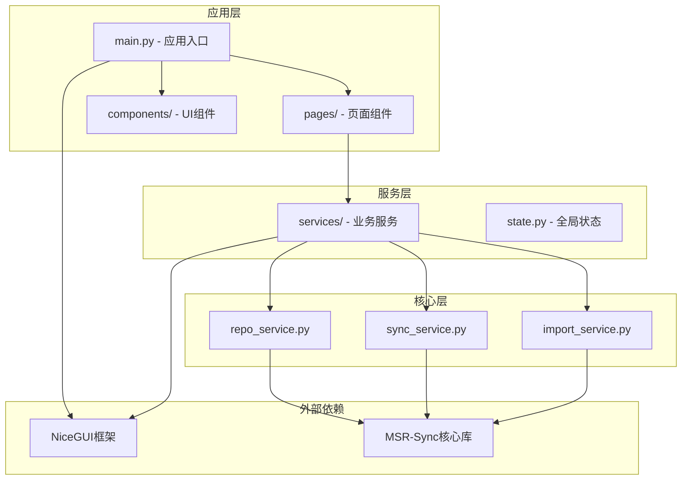
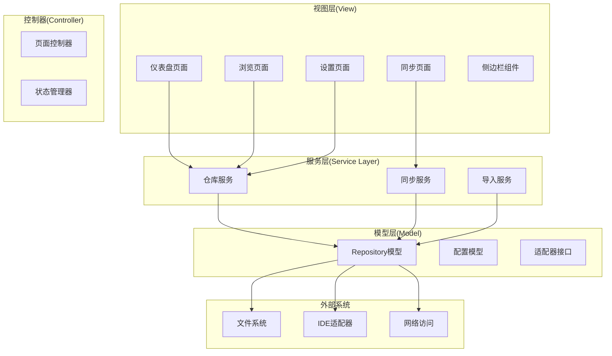
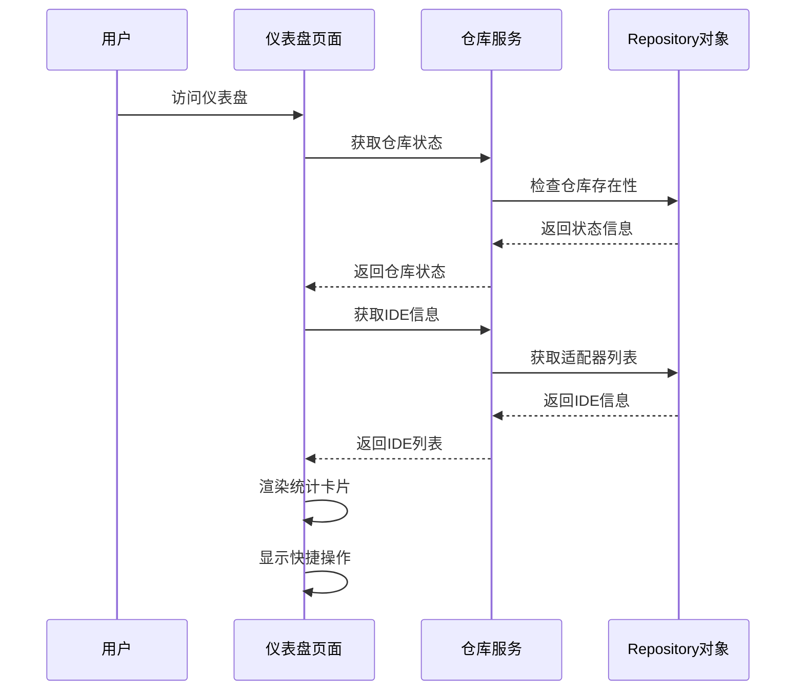
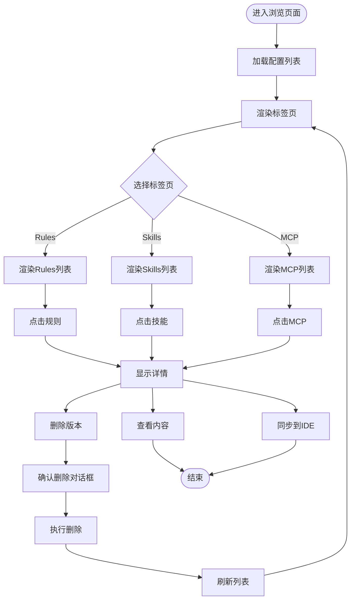
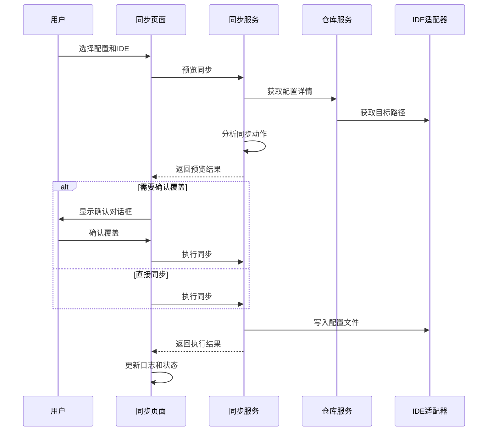
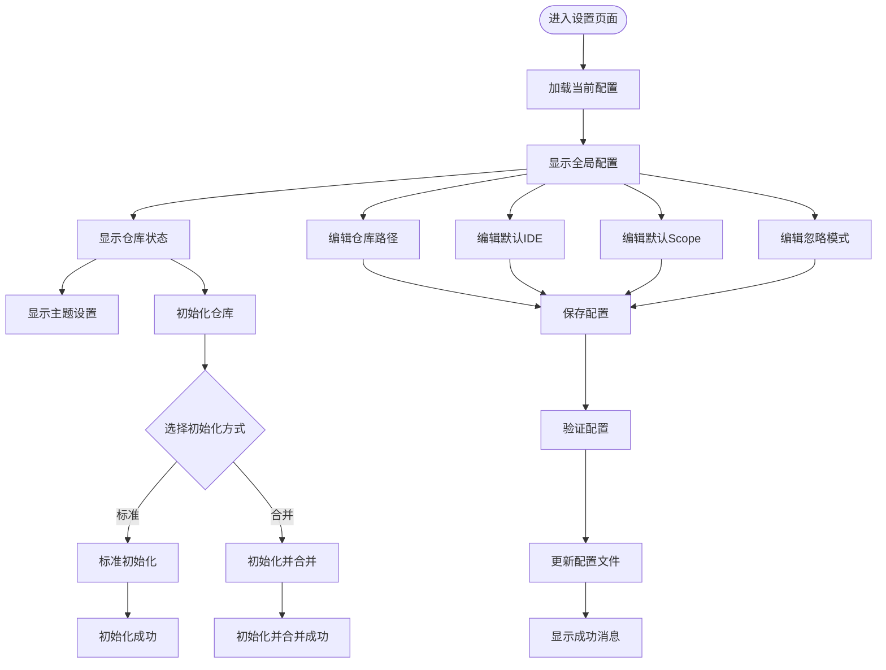
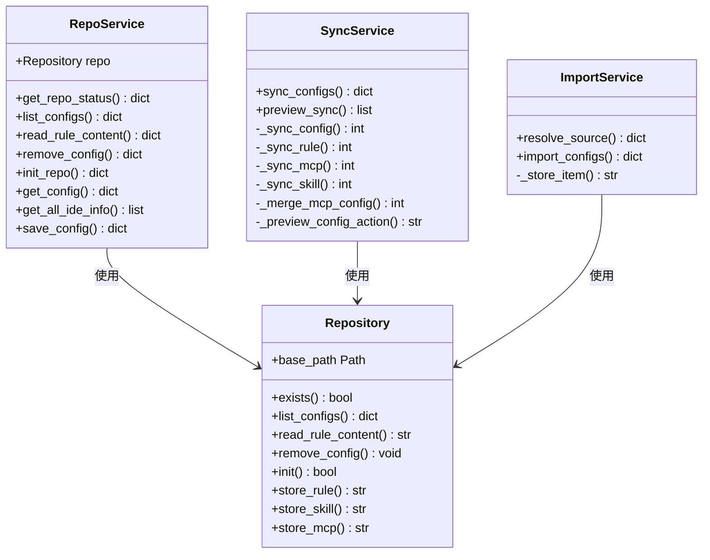
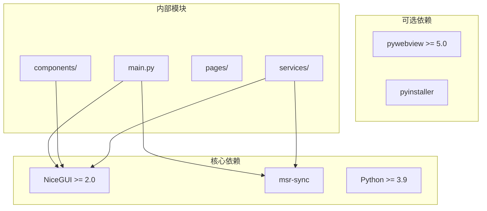
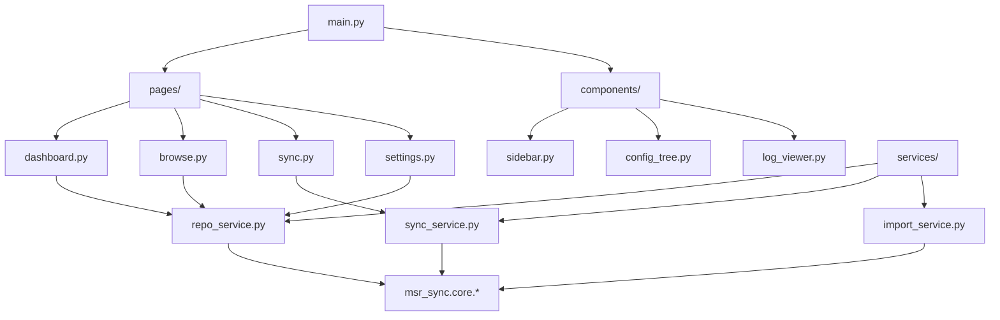

# GUI应用程序指南

<cite>
**本文档引用的文件**
- [MSR-gui/README.md](file://MSR-gui/README.md)
- [MSR-gui/pyproject.toml](file://MSR-gui/pyproject.toml)
- [MSR-gui/msr_gui/main.py](file://MSR-gui/msr_gui/main.py)
- [MSR-gui/msr_gui/state.py](file://MSR-gui/msr_gui/state.py)
- [MSR-gui/msr_gui/__init__.py](file://MSR-gui/msr_gui/__init__.py)
- [MSR-gui/msr_gui/pages/dashboard.py](file://MSR-gui/msr_gui/pages/dashboard.py)
- [MSR-gui/msr_gui/pages/browse.py](file://MSR-gui/msr_gui/pages/browse.py)
- [MSR-gui/msr_gui/pages/sync.py](file://MSR-gui/msr_gui/pages/sync.py)
- [MSR-gui/msr_gui/pages/settings.py](file://MSR-gui/msr_gui/pages/settings.py)
- [MSR-gui/msr_gui/services/repo_service.py](file://MSR-gui/msr_gui/services/repo_service.py)
- [MSR-gui/msr_gui/services/sync_service.py](file://MSR-gui/msr_gui/services/sync_service.py)
- [MSR-gui/msr_gui/services/import_service.py](file://MSR-gui/msr_gui/services/import_service.py)
- [MSR-gui/msr_gui/components/sidebar.py](file://MSR-gui/msr_gui/components/sidebar.py)
- [MSR-gui/msr_gui/components/config_tree.py](file://MSR-gui/msr_gui/components/config_tree.py)
- [MSR-gui/msr_gui/components/log_viewer.py](file://MSR-gui/msr_gui/components/log_viewer.py)
</cite>

## 目录
1. [简介](#简介)
2. [项目结构](#项目结构)
3. [核心组件](#核心组件)
4. [架构概览](#架构概览)
5. [详细组件分析](#详细组件分析)
6. [依赖关系分析](#依赖关系分析)
7. [性能考虑](#性能考虑)
8. [故障排除指南](#故障排除指南)
9. [结论](#结论)

## 简介

MSR Sync Manager 是一个基于 NiceGUI 构建的可视化配置同步管理界面，专门用于管理 IDE 配置的导入、浏览、同步和设置。该应用程序提供了直观的图形用户界面，使用户能够轻松管理规则(Rules)、技能(Skills)和 MCP 配置。

主要功能包括：
- 仪表盘 - 概览与状态监控
- 配置浏览 - 浏览和管理 IDE 配置
- 导入配置 - 从现有配置导入
- 同步面板 - 执行同步操作
- 设置 - 应用设置

## 项目结构

MSR-gui 项目采用清晰的分层架构设计，主要分为以下几个层次：

**图表来源**
- [MSR-gui/msr_gui/main.py:1-42](file://MSR-gui/msr_gui/main.py#L1-L42)
- [MSR-gui/msr_gui/services/repo_service.py:1-234](file://MSR-gui/msr_gui/services/repo_service.py#L1-L234)

**章节来源**
- [MSR-gui/README.md:1-46](file://MSR-gui/README.md#L1-L46)
- [MSR-gui/pyproject.toml:1-22](file://MSR-gui/pyproject.toml#L1-L22)

## 核心组件

### 应用入口与配置

应用程序通过 `main.py` 启动，支持多种运行模式：
- 浏览器模式：`msr-gui --browser`
- 原生窗口模式：`msr-gui`
- 指定端口：`msr-gui --port 8080`

### 全局状态管理

`AppState` 类提供统一的状态管理，包括：
- 仓库状态缓存
- 配置列表缓存  
- 已选 IDE 列表
- 操作日志记录

### 页面路由系统

所有页面通过 `@ui.page` 装饰器自动注册，支持以下路由：
- `/` - 仪表盘
- `/browse` - 配置浏览
- `/sync` - 同步面板
- `/settings` - 设置页面
- `/import` - 导入页面

**章节来源**
- [MSR-gui/msr_gui/main.py:1-42](file://MSR-gui/msr_gui/main.py#L1-L42)
- [MSR-gui/msr_gui/state.py:1-41](file://MSR-gui/msr_gui/state.py#L1-L41)

## 架构概览

MSR-gui 采用了典型的 MVC 架构模式，结合服务层抽象：

**图表来源**
- [MSR-gui/msr_gui/pages/dashboard.py:1-98](file://MSR-gui/msr_gui/pages/dashboard.py#L1-L98)
- [MSR-gui/msr_gui/services/repo_service.py:22-234](file://MSR-gui/msr_gui/services/repo_service.py#L22-L234)
- [MSR-gui/msr_gui/services/sync_service.py:20-427](file://MSR-gui/msr_gui/services/sync_service.py#L20-L427)

## 详细组件分析

### 仪表盘页面

仪表盘页面提供系统概览和快速操作入口：

**图表来源**
- [MSR-gui/msr_gui/pages/dashboard.py:19-26](file://MSR-gui/msr_gui/pages/dashboard.py#L19-L26)
- [MSR-gui/msr_gui/services/repo_service.py:26-51](file://MSR-gui/msr_gui/services/repo_service.py#L26-L51)

仪表盘包含以下核心功能：
- 仓库状态显示（已初始化/未初始化）
- 配置统计（Rules、Skills、MCP 数量）
- 支持的 IDE 列表
- 快速操作按钮（初始化仓库、导入配置、快速同步）

**章节来源**
- [MSR-gui/msr_gui/pages/dashboard.py:1-98](file://MSR-gui/msr_gui/pages/dashboard.py#L1-L98)

### 配置浏览页面

配置浏览页面提供完整的配置管理功能：

**图表来源**
- [MSR-gui/msr_gui/pages/browse.py:73-172](file://MSR-gui/msr_gui/pages/browse.py#L73-L172)

页面特性：
- 三栏布局：左侧列表 + 中间版本选择 + 右侧详情
- 支持删除配置版本
- 规则内容预览（Markdown渲染）
- 直接同步到 IDE 功能

**章节来源**
- [MSR-gui/msr_gui/pages/browse.py:1-172](file://MSR-gui/msr_gui/pages/browse.py#L1-L172)

### 同步面板

同步面板是应用程序的核心功能模块：

**图表来源**
- [MSR-gui/msr_gui/pages/sync.py:265-417](file://MSR-gui/msr_gui/pages/sync.py#L265-L417)
- [MSR-gui/msr_gui/services/sync_service.py:20-150](file://MSR-gui/msr_gui/services/sync_service.py#L20-L150)

同步功能包括：
- 多配置类型支持（Rules、Skills、MCP）
- 多IDE目标支持
- Global/Project 两种同步范围
- 预览机制防止意外覆盖
- 详细的同步日志

**章节来源**
- [MSR-gui/msr_gui/pages/sync.py:1-459](file://MSR-gui/msr_gui/pages/sync.py#L1-L459)
- [MSR-gui/msr_gui/services/sync_service.py:1-427](file://MSR-gui/msr_gui/services/sync_service.py#L1-L427)

### 设置页面

设置页面提供系统配置管理：

**图表来源**
- [MSR-gui/msr_gui/pages/settings.py:85-106](file://MSR-gui/msr_gui/pages/settings.py#L85-L106)

**章节来源**
- [MSR-gui/msr_gui/pages/settings.py:1-119](file://MSR-gui/msr_gui/pages/settings.py#L1-L119)

### 服务层架构

服务层采用职责分离的设计模式：

**图表来源**
- [MSR-gui/msr_gui/services/repo_service.py:22-234](file://MSR-gui/msr_gui/services/repo_service.py#L22-L234)
- [MSR-gui/msr_gui/services/sync_service.py:20-427](file://MSR-gui/msr_gui/services/sync_service.py#L20-L427)
- [MSR-gui/msr_gui/services/import_service.py:14-154](file://MSR-gui/msr_gui/services/import_service.py#L14-L154)

**章节来源**
- [MSR-gui/msr_gui/services/repo_service.py:1-234](file://MSR-gui/msr_gui/services/repo_service.py#L1-L234)
- [MSR-gui/msr_gui/services/sync_service.py:1-427](file://MSR-gui/msr_gui/services/sync_service.py#L1-L427)
- [MSR-gui/msr_gui/services/import_service.py:1-154](file://MSR-gui/msr_gui/services/import_service.py#L1-L154)

## 依赖关系分析

### 外部依赖

应用程序依赖于以下关键组件：

**图表来源**
- [MSR-gui/pyproject.toml:11-18](file://MSR-gui/pyproject.toml#L11-L18)

### 内部模块依赖

**图表来源**
- [MSR-gui/msr_gui/main.py:29-37](file://MSR-gui/msr_gui/main.py#L29-L37)
- [MSR-gui/msr_gui/services/repo_service.py:9-17](file://MSR-gui/msr_gui/services/repo_service.py#L9-L17)

**章节来源**
- [MSR-gui/pyproject.toml:1-22](file://MSR-gui/pyproject.toml#L1-L22)

## 性能考虑

### 异步处理策略

应用程序采用异步编程模式处理 I/O 密集型操作：

1. **数据库/文件系统操作**：使用 `run.io_bound()` 包装
2. **网络请求**：通过适配器层处理
3. **UI 更新**：使用 NiceGUI 的异步事件系统

### 缓存机制

- 配置列表缓存：避免重复查询
- 仓库状态缓存：减少文件系统检查
- 操作日志缓存：提供历史记录

### 内存管理

- 及时清理临时文件和资源
- 合理使用弱引用避免循环引用
- 控制日志数量防止内存泄漏

## 故障排除指南

### 常见问题及解决方案

#### 仓库未初始化
**症状**：访问任何页面都提示仓库未初始化
**解决方法**：
1. 进入设置页面
2. 点击"初始化仓库"按钮
3. 选择合适的初始化方式

#### 同步失败
**症状**：同步操作报错或部分失败
**解决方法**：
1. 查看同步日志获取详细错误信息
2. 检查目标 IDE 是否支持所选配置类型
3. 验证配置文件格式是否正确

#### 配置导入失败
**症状**：导入操作无法识别配置文件
**解决方法**：
1. 确认源文件路径正确
2. 检查文件权限
3. 验证配置文件格式符合要求

### 调试技巧

1. **启用详细日志**：查看操作日志了解具体错误
2. **检查系统兼容性**：确保 Python 版本满足要求
3. **验证依赖安装**：确认所有依赖正确安装

**章节来源**
- [MSR-gui/msr_gui/services/repo_service.py:166-175](file://MSR-gui/msr_gui/services/repo_service.py#L166-L175)
- [MSR-gui/msr_gui/services/sync_service.py:143-149](file://MSR-gui/msr_gui/services/sync_service.py#L143-L149)

## 结论

MSR-gui 应用程序提供了一个功能完整、界面友好的 IDE 配置管理解决方案。其设计特点包括：

**优势**：
- 基于 NiceGUI 的现代化 Web 界面
- 清晰的分层架构便于维护
- 完善的错误处理和日志记录
- 支持多种运行模式（浏览器/原生窗口）

**扩展建议**：
- 添加配置树形展示组件
- 实现实时日志流功能
- 增加配置版本比较功能
- 提供批量操作支持

该应用程序为开发者提供了一个高效、可靠的 IDE 配置同步管理工具，通过直观的界面简化了复杂的配置管理工作流程。