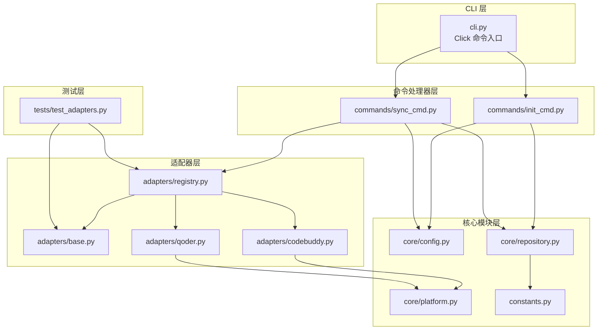
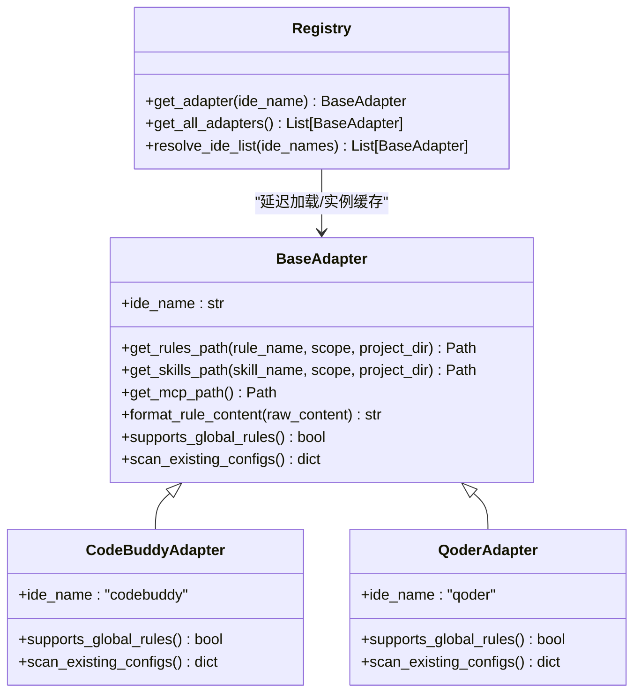
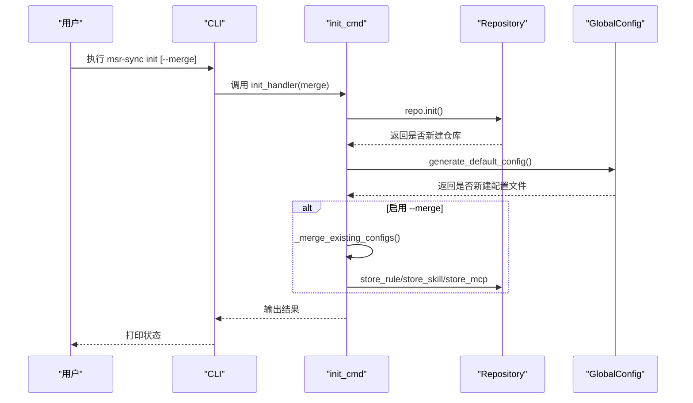
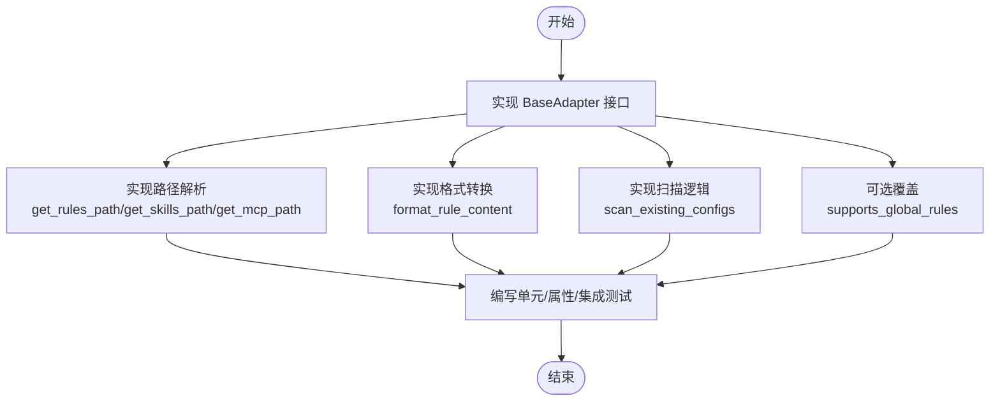
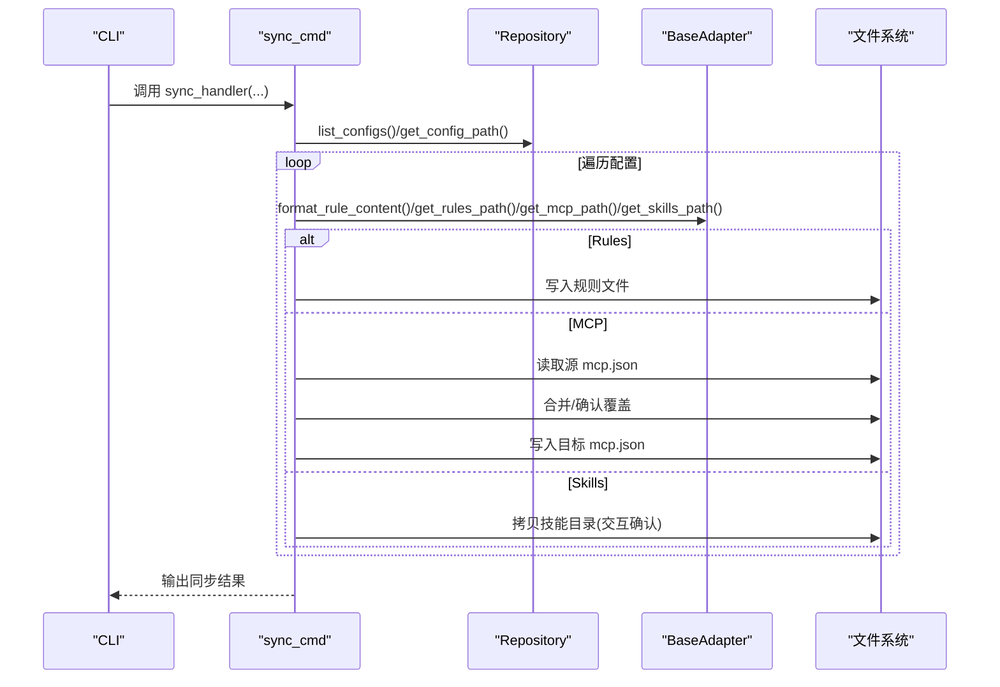
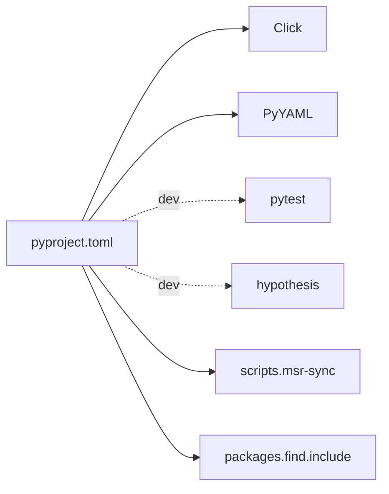

# 开发者指南

<cite>
**本文档引用的文件**
- [pyproject.toml](file://MSR-cli/pyproject.toml)
- [__init__.py](file://MSR-cli/msr_sync/__init__.py)
- [cli.py](file://MSR-cli/msr_sync/cli.py)
- [constants.py](file://MSR-cli/msr_sync/constants.py)
- [usage.md](file://MSR-cli/docs/usage.md)
- [config.py](file://MSR-cli/msr_sync/core/config.py)
- [platform.py](file://MSR-cli/msr_sync/core/platform.py)
- [repository.py](file://MSR-cli/msr_sync/core/repository.py)
- [base.py](file://MSR-cli/msr_sync/adapters/base.py)
- [registry.py](file://MSR-cli/msr_sync/adapters/registry.py)
- [codebuddy.py](file://MSR-cli/msr_sync/adapters/codebuddy.py)
- [qoder.py](file://MSR-cli/msr_sync/adapters/qoder.py)
- [init_cmd.py](file://MSR-cli/msr_sync/commands/init_cmd.py)
- [sync_cmd.py](file://MSR-cli/msr_sync/commands/sync_cmd.py)
- [test_adapters.py](file://MSR-cli/tests/test_adapters.py)
</cite>

## 目录
1. [简介](#简介)
2. [项目结构](#项目结构)
3. [核心组件](#核心组件)
4. [架构总览](#架构总览)
5. [详细组件分析](#详细组件分析)
6. [依赖分析](#依赖分析)
7. [性能考虑](#性能考虑)
8. [故障排查指南](#故障排查指南)
9. [结论](#结论)
10. [附录](#附录)

## 简介
MSR-v2 是一个统一管理多款 AI IDE 的 rules、skills、MCP 配置的命令行工具。它通过分层架构、适配器模式和注册表模式，实现了对不同 IDE 的统一配置管理与同步能力。开发者可通过本指南了解项目架构、适配器开发流程、测试框架使用、构建与发布流程以及贡献指南。

## 项目结构
MSR-cli 采用清晰的分层组织：
- CLI 层：基于 Click 定义命令入口与参数解析
- 命令处理器层：封装 init/import/list/remove/sync 等业务逻辑
- 核心模块层：配置管理、平台检测、仓库操作、版本管理
- 适配器层：针对不同 IDE 的路径解析、格式转换与扫描能力
- 测试层：单元测试、属性测试与集成测试

**图表来源**
- [cli.py:1-116](file://MSR-cli/msr_sync/cli.py#L1-L116)
- [init_cmd.py:1-137](file://MSR-cli/msr_sync/commands/init_cmd.py#L1-L137)
- [sync_cmd.py:1-411](file://MSR-cli/msr_sync/commands/sync_cmd.py#L1-L411)
- [config.py:1-204](file://MSR-cli/msr_sync/core/config.py#L1-L204)
- [platform.py:1-60](file://MSR-cli/msr_sync/core/platform.py#L1-L60)
- [repository.py:1-291](file://MSR-cli/msr_sync/core/repository.py#L1-L291)
- [constants.py:1-50](file://MSR-cli/msr_sync/constants.py#L1-L50)
- [base.py:1-105](file://MSR-cli/msr_sync/adapters/base.py#L1-L105)
- [registry.py:1-88](file://MSR-cli/msr_sync/adapters/registry.py#L1-L88)
- [codebuddy.py:1-143](file://MSR-cli/msr_sync/adapters/codebuddy.py#L1-L143)
- [qoder.py:1-140](file://MSR-cli/msr_sync/adapters/qoder.py#L1-L140)
- [test_adapters.py:1-487](file://MSR-cli/tests/test_adapters.py#L1-L487)

**章节来源**
- [pyproject.toml:1-37](file://MSR-cli/pyproject.toml#L1-L37)
- [__init__.py:1-4](file://MSR-cli/msr_sync/__init__.py#L1-L4)

## 核心组件
- CLI 入口与命令定义：集中于 Click Group，提供 init/import/sync/list/remove 子命令，参数校验与错误处理。
- 全局配置模块：加载与管理 ~/.msr-sync/config.yaml，提供默认值与校验逻辑。
- 平台检测模块：检测操作系统与应用数据目录，支撑跨平台路径解析。
- 仓库操作模块：统一管理 RULES/SKILLS/MCP 三类配置的导入、查询、删除与版本管理。
- 适配器抽象与注册表：定义 BaseAdapter 接口，通过注册表延迟加载具体 IDE 适配器。
- 命令处理器：init 与 sync 的业务逻辑实现，协调仓库与适配器。

**章节来源**
- [cli.py:1-116](file://MSR-cli/msr_sync/cli.py#L1-L116)
- [config.py:1-204](file://MSR-cli/msr_sync/core/config.py#L1-L204)
- [platform.py:1-60](file://MSR-cli/msr_sync/core/platform.py#L1-L60)
- [repository.py:1-291](file://MSR-cli/msr_sync/core/repository.py#L1-L291)
- [base.py:1-105](file://MSR-cli/msr_sync/adapters/base.py#L1-L105)
- [registry.py:1-88](file://MSR-cli/msr_sync/adapters/registry.py#L1-L88)
- [init_cmd.py:1-137](file://MSR-cli/msr_sync/commands/init_cmd.py#L1-L137)
- [sync_cmd.py:1-411](file://MSR-cli/msr_sync/commands/sync_cmd.py#L1-L411)

## 架构总览
MSR-v2 采用分层架构与插件化适配器设计：
- 分层架构：CLI → 命令处理器 → 核心模块 → 适配器
- 适配器模式：BaseAdapter 抽象统一接口，具体 IDE 适配器实现差异化路径与格式转换
- 注册表模式：Registry 延迟加载与实例缓存，支持 IDE 名称到适配器类的映射

**图表来源**
- [base.py:1-105](file://MSR-cli/msr_sync/adapters/base.py#L1-L105)
- [registry.py:1-88](file://MSR-cli/msr_sync/adapters/registry.py#L1-L88)
- [codebuddy.py:1-143](file://MSR-cli/msr_sync/adapters/codebuddy.py#L1-L143)
- [qoder.py:1-140](file://MSR-cli/msr_sync/adapters/qoder.py#L1-L140)

## 详细组件分析

### CLI 与命令流程
- init 命令：初始化统一仓库目录结构，生成默认配置文件；可选合并已有 IDE 配置。
- sync 命令：支持按 IDE、作用域、类型、名称、版本精确同步；对 MCP 合并策略进行交互确认。
- import/list/remove：导入配置、列出仓库内容、删除指定版本。

**图表来源**
- [cli.py:14-42](file://MSR-cli/msr_sync/cli.py#L14-L42)
- [init_cmd.py:13-137](file://MSR-cli/msr_sync/commands/init_cmd.py#L13-L137)
- [repository.py:40-51](file://MSR-cli/msr_sync/core/repository.py#L40-L51)
- [config.py:187-204](file://MSR-cli/msr_sync/core/config.py#L187-L204)

**章节来源**
- [cli.py:1-116](file://MSR-cli/msr_sync/cli.py#L1-L116)
- [init_cmd.py:1-137](file://MSR-cli/msr_sync/commands/init_cmd.py#L1-L137)
- [usage.md:21-82](file://MSR-cli/docs/usage.md#L21-L82)

### 适配器开发指南
- 接口规范
  - 必须实现：ide_name、get_rules_path、get_skills_path、get_mcp_path、format_rule_content、scan_existing_configs
  - 可选覆盖：supports_global_rules（默认 False）
- 实现要求
  - 路径解析：严格遵循各 IDE 的项目级/全局级路径约定
  - 格式转换：对剥离 frontmatter 的内容添加 IDE 特定头部
  - 扫描逻辑：准确扫描用户级配置并返回标准化结构
- 测试方法
  - 单元测试：验证路径解析、格式转换、能力查询与扫描结果
  - 属性测试：使用 Hypothesis 对随机输入进行大规模测试
  - 集成测试：结合 CLI 与命令处理器验证端到端流程

**图表来源**
- [base.py:8-105](file://MSR-cli/msr_sync/adapters/base.py#L8-L105)
- [registry.py:21-88](file://MSR-cli/msr_sync/adapters/registry.py#L21-L88)
- [test_adapters.py:1-487](file://MSR-cli/tests/test_adapters.py#L1-L487)

**章节来源**
- [base.py:1-105](file://MSR-cli/msr_sync/adapters/base.py#L1-L105)
- [registry.py:1-88](file://MSR-cli/msr_sync/adapters/registry.py#L1-L88)
- [codebuddy.py:1-143](file://MSR-cli/msr_sync/adapters/codebuddy.py#L1-L143)
- [qoder.py:1-140](file://MSR-cli/msr_sync/adapters/qoder.py#L1-L140)
- [test_adapters.py:1-487](file://MSR-cli/tests/test_adapters.py#L1-L487)

### 同步流程与 MCP 合并策略
- Rules 同步：剥离原始 frontmatter，添加 IDE 特定头部，写入目标路径；全局级同步时检查支持能力
- Skills 同步：目标不存在直接拷贝；存在时交互确认覆盖
- MCP 同步：读取仓库 JSON，合并到目标 mcp.json；同名条目交互确认覆盖

**图表来源**
- [sync_cmd.py:26-411](file://MSR-cli/msr_sync/commands/sync_cmd.py#L26-L411)
- [repository.py:160-235](file://MSR-cli/msr_sync/core/repository.py#L160-L235)
- [base.py:25-105](file://MSR-cli/msr_sync/adapters/base.py#L25-L105)

**章节来源**
- [sync_cmd.py:1-411](file://MSR-cli/msr_sync/commands/sync_cmd.py#L1-L411)
- [usage.md:202-306](file://MSR-cli/docs/usage.md#L202-L306)

### 仓库与版本管理
- 仓库初始化：创建 RULES/SKILLS/MCP 三类子目录
- 配置存储：按名称与版本号组织，版本号自动递增
- 查询与删除：支持按类型、名称、版本过滤

**章节来源**
- [repository.py:1-291](file://MSR-cli/msr_sync/core/repository.py#L1-L291)
- [constants.py:1-50](file://MSR-cli/msr_sync/constants.py#L1-L50)

## 依赖分析
- 构建与运行时依赖：Click、PyYAML
- 开发依赖：pytest、hypothesis
- CLI 脚本入口：msr-sync → msr_sync.cli:main
- 模块发现：setuptools 自动包含 msr_sync*

**图表来源**
- [pyproject.toml:1-37](file://MSR-cli/pyproject.toml#L1-L37)

**章节来源**
- [pyproject.toml:1-37](file://MSR-cli/pyproject.toml#L1-L37)

## 性能考虑
- 适配器实例缓存：注册表缓存适配器实例，避免重复创建与导入
- 路径解析与文件操作：尽量减少不必要的 IO，批量处理时合并目录创建
- 测试策略：属性测试与单元测试并重，提升覆盖率与稳定性

[本节为通用建议，不直接分析具体文件]

## 故障排查指南
- 统一仓库未初始化：执行 init 或检查配置文件路径
- 配置文件 YAML 语法错误：修正语法或删除后重新生成默认配置
- 不支持的操作系统：当前仅支持 macOS 与 Windows
- 权限不足：检查目标路径写入权限
- MCP 配置文件格式错误：验证 JSON 结构

**章节来源**
- [usage.md:634-759](file://MSR-cli/docs/usage.md#L634-L759)
- [config.py:91-128](file://MSR-cli/msr_sync/core/config.py#L91-L128)

## 结论
MSR-v2 通过清晰的分层架构、稳定的适配器模式与注册表机制，提供了可扩展、易维护的多 IDE 配置管理方案。开发者可基于本文档快速上手，按照适配器开发指南扩展新的 IDE 支持，并利用完善的测试框架保证质量。

## 附录

### 适配器开发步骤清单
- 实现 BaseAdapter 的必要方法
- 编写路径解析与格式转换逻辑
- 实现扫描逻辑并返回标准化结构
- 编写单元测试与属性测试
- 在注册表中注册新适配器

**章节来源**
- [base.py:1-105](file://MSR-cli/msr_sync/adapters/base.py#L1-L105)
- [registry.py:1-88](file://MSR-cli/msr_sync/adapters/registry.py#L1-L88)
- [test_adapters.py:1-487](file://MSR-cli/tests/test_adapters.py#L1-L487)

### 测试框架使用指南
- 单元测试：pytest + hypothesis（属性测试）
- 集成测试：模拟 CLI 与命令处理器调用
- 端到端测试：使用真实仓库与 IDE 路径进行验证

**章节来源**
- [test_adapters.py:1-487](file://MSR-cli/tests/test_adapters.py#L1-L487)
- [pyproject.toml:23-27](file://MSR-cli/pyproject.toml#L23-L27)

### 构建与发布流程
- 依赖管理：通过 pyproject.toml 管理依赖与脚本入口
- 打包与分发：使用 setuptools 构建，pip 安装

**章节来源**
- [pyproject.toml:1-37](file://MSR-cli/pyproject.toml#L1-L37)
- [__init__.py:1-4](file://MSR-cli/msr_sync/__init__.py#L1-L4)

### 贡献指南
- 代码规范：遵循 Python 风格与模块职责分离
- 提交规范：语义化提交信息，关联问题编号
- Pull Request 流程：分支开发、单元测试与属性测试通过、审查与合并

[本节为通用建议，不直接分析具体文件]