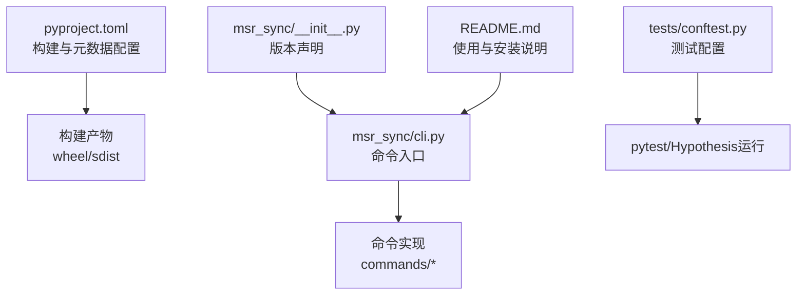
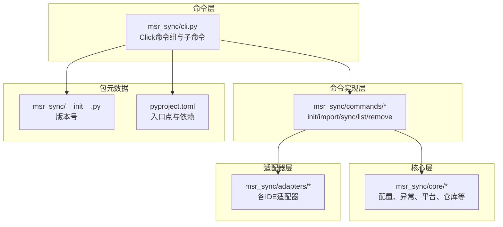
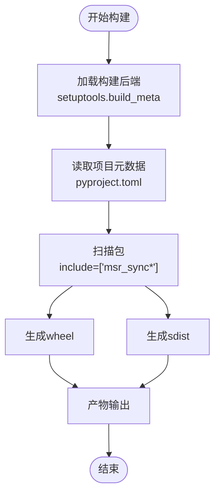
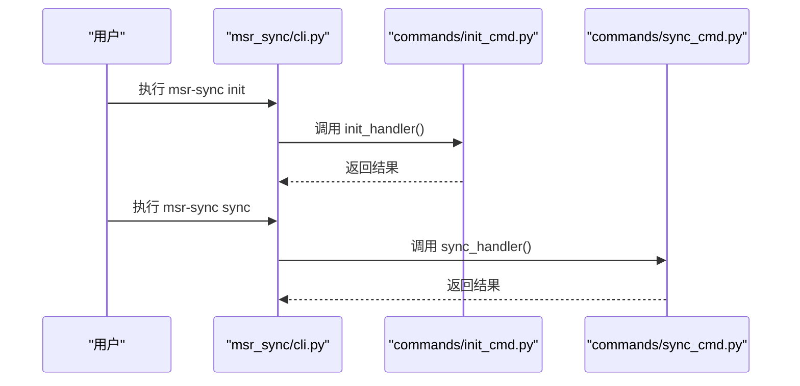
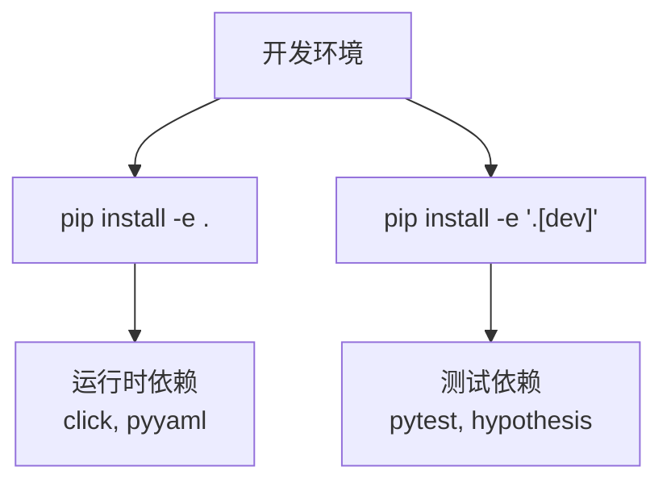
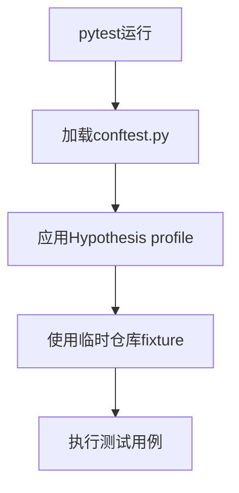
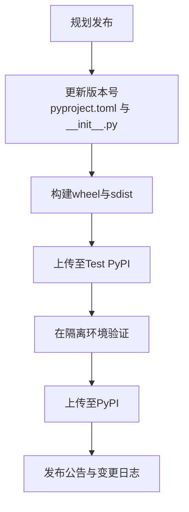
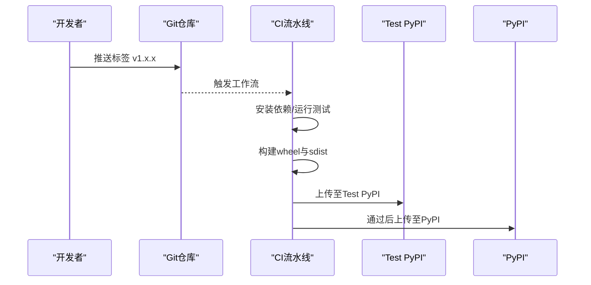
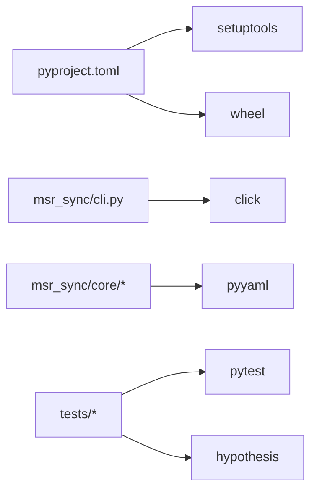

# 构建与发布流程

<cite>
**本文引用的文件**
- [pyproject.toml](file://MSR-cli/pyproject.toml)
- [README.md](file://MSR-cli/README.md)
- [cli.py](file://MSR-cli/msr_sync/cli.py)
- [__init__.py](file://MSR-cli/msr_sync/__init__.py)
- [conftest.py](file://MSR-cli/tests/conftest.py)
</cite>

## 目录
1. [简介](#简介)
2. [项目结构](#项目结构)
3. [核心组件](#核心组件)
4. [架构总览](#架构总览)
5. [详细组件分析](#详细组件分析)
6. [依赖关系分析](#依赖关系分析)
7. [性能考虑](#性能考虑)
8. [故障排查指南](#故障排查指南)
9. [结论](#结论)
10. [附录](#附录)

## 简介
本文件面向MSR-v2项目中的MSR-cli子模块，提供从代码构建、打包、本地安装、开发环境配置到版本管理与发布的完整流程说明。重点围绕pyproject.toml配置文件的各项设置进行拆解，解释wheel与sdist两种包格式的生成流程，给出本地安装与开发环境搭建步骤，明确版本管理策略与发布流程，并补充签名与验证的安全建议。由于仓库中未发现CI/CD配置文件与PyPI发布脚本，本文亦提供可落地的自动化发布建议与注意事项。

## 项目结构
MSR-cli为独立的Python命令行工具，采用标准的setuptools构建系统与现代PEP 621项目元数据格式。核心文件与职责如下：
- pyproject.toml：定义构建系统、项目元数据、依赖、可选开发依赖、入口点与包发现规则
- msr_sync/cli.py：Click驱动的命令入口，定义init/import/sync/list/remove等子命令
- msr_sync/__init__.py：声明包版本号
- tests/conftest.py：pytest与Hypothesis测试配置与共享fixture
- README.md：使用说明、安装方式、功能特性与版本管理策略

**图表来源**
- [pyproject.toml:1-37](file://MSR-cli/pyproject.toml#L1-L37)
- [cli.py:1-116](file://MSR-cli/msr_sync/cli.py#L1-L116)
- [__init__.py:1-4](file://MSR-cli/msr_sync/__init__.py#L1-L4)
- [conftest.py:1-36](file://MSR-cli/tests/conftest.py#L1-L36)
- [README.md:1-361](file://MSR-cli/README.md#L1-L361)

**章节来源**
- [pyproject.toml:1-37](file://MSR-cli/pyproject.toml#L1-L37)
- [README.md:1-361](file://MSR-cli/README.md#L1-L361)

## 核心组件
- 构建系统与后端
  - build-system.requires：声明setuptools与wheel最低版本要求
  - build-backend：使用setuptools.build_meta
- 项目元数据
  - name、version、description、readme、requires-python、license
  - authors、urls（主页与仓库链接）
- 依赖管理
  - dependencies：运行时必需依赖（click、pyyaml）
  - optional-dependencies.dev：开发与测试依赖（pytest、hypothesis）
- 入口点与包发现
  - project.scripts.msrsync：命令行入口映射至cli.main
  - tool.setuptools.packages.find.include：限定包扫描范围
- 测试配置
  - tool.pytest.ini_options.testpaths：测试目录定位

**章节来源**
- [pyproject.toml:1-37](file://MSR-cli/pyproject.toml#L1-L37)

## 架构总览
MSR-cli采用Click框架组织命令，通过入口点注册命令，命令实现位于commands子模块。版本号在包初始化文件中声明，供CLI与包元数据使用。

**图表来源**
- [cli.py:1-116](file://MSR-cli/msr_sync/cli.py#L1-L116)
- [__init__.py:1-4](file://MSR-cli/msr_sync/__init__.py#L1-L4)
- [pyproject.toml:29-30](file://MSR-cli/pyproject.toml#L29-L30)

## 详细组件分析

### 构建系统与打包流程
- 构建后端
  - 使用setuptools.build_meta，遵循现代PEP 517/518流程
- 包格式
  - wheel：二进制分发格式，便于安装与缓存
  - sdist：源码分发格式，便于二次编译与审计
- 包发现与入口点
  - include = ["msr_sync*"] 确保仅打包目标包及其子包
  - project.scripts.msrsync 映射到 msr_sync.cli:main

**图表来源**
- [pyproject.toml:1-37](file://MSR-cli/pyproject.toml#L1-L37)

**章节来源**
- [pyproject.toml:1-37](file://MSR-cli/pyproject.toml#L1-L37)

### 命令入口与版本号
- 命令入口
  - project.scripts.msrsync -> msr_sync.cli:main
  - CLI通过Click定义init/import/sync/list/remove子命令
- 版本号
  - 包内版本号与pyproject.toml version保持一致，便于包元数据与运行时一致

**图表来源**
- [cli.py:14-116](file://MSR-cli/msr_sync/cli.py#L14-L116)

**章节来源**
- [cli.py:1-116](file://MSR-cli/msr_sync/cli.py#L1-L116)
- [__init__.py:1-4](file://MSR-cli/msr_sync/__init__.py#L1-L4)

### 依赖管理与开发环境
- 运行时依赖
  - click：命令行框架
  - pyyaml：YAML解析与序列化
- 开发依赖
  - pytest：测试框架
  - hypothesis：属性测试与随机化测试
- 安装方式
  - 本地开发安装：pip install -e .
  - 开发环境安装（含测试依赖）：pip install -e ".[dev]"

**图表来源**
- [pyproject.toml:18-27](file://MSR-cli/pyproject.toml#L18-L27)
- [README.md:135-158](file://MSR-cli/README.md#L135-L158)

**章节来源**
- [pyproject.toml:18-27](file://MSR-cli/pyproject.toml#L18-L27)
- [README.md:135-158](file://MSR-cli/README.md#L135-L158)

### 测试配置与运行
- 测试目录
  - pytest.testpaths = ["tests"]
- Hypothesis配置
  - CI与默认配置文件profile，分别设定max_examples
- 共享fixture
  - 重置全局配置单例，避免测试间状态污染
  - 提供临时仓库目录与已初始化仓库fixture

**图表来源**
- [conftest.py:1-36](file://MSR-cli/tests/conftest.py#L1-L36)

**章节来源**
- [conftest.py:1-36](file://MSR-cli/tests/conftest.py#L1-L36)

### 版本管理策略与发布流程
- 版本号来源
  - pyproject.toml.version 与 msr_sync/__init__.py.__version__ 保持一致
- 版本管理实践
  - 语义化版本控制（SemVer）：主版本号.次版本号.修订号
  - 发布前更新版本号与变更日志
  - 本地构建wheel与sdist进行自检
- 发布流程（建议）
  - 准备：更新版本号、构建产物、上传凭证配置
  - 上传：使用twine上传至Test PyPI进行预检，再上传至PyPI
  - 验证：在隔离环境中安装并验证功能

**图表来源**
- [pyproject.toml:11-12](file://MSR-cli/pyproject.toml#L11-L12)
- [__init__.py:3-3](file://MSR-cli/msr_sync/__init__.py#L3-L3)
- [README.md:275-295](file://MSR-cli/README.md#L275-L295)

**章节来源**
- [pyproject.toml:11-12](file://MSR-cli/pyproject.toml#L11-L12)
- [__init__.py:3-3](file://MSR-cli/msr_sync/__init__.py#L3-L3)
- [README.md:275-295](file://MSR-cli/README.md#L275-L295)

### CI/CD与自动化发布建议
- 当前状态
  - 仓库未包含CI/CD配置文件与自动化发布脚本
- 建议流程
  - 触发条件：push标签（vX.Y.Z）或PR合并到主分支
  - 步骤：安装依赖、运行测试、构建wheel与sdist、上传至Test PyPI、通过后再上传至PyPI
  - 安全：使用受保护的环境变量存储twine凭据，启用签名与校验
- 注意事项
  - 严格区分测试与生产环境的上传通道
  - 对上传产物进行完整性校验（如哈希）

**图表来源**
- [pyproject.toml:1-37](file://MSR-cli/pyproject.toml#L1-L37)

**章节来源**
- [pyproject.toml:1-37](file://MSR-cli/pyproject.toml#L1-L37)

### 包分发到PyPI的步骤与注意事项
- 步骤
  - 安装构建工具与twine：pip install build twine
  - 清理旧产物：删除dist/目录
  - 构建：python -m build
  - 上传至Test PyPI：twine upload --repository testpypi dist/*
  - 验证：在隔离虚拟环境中安装并测试
  - 上传至PyPI：twine upload dist/*
- 注意事项
  - 保证版本号唯一性，避免覆盖已发布版本
  - 在Test PyPI验证无误后再发布正式版本
  - 保持pyproject.toml与包内版本一致

**章节来源**
- [README.md:135-158](file://MSR-cli/README.md#L135-L158)
- [pyproject.toml:11-12](file://MSR-cli/pyproject.toml#L11-L12)

### 安全措施：签名与验证
- 签名
  - 使用gpg对wheel进行签名，生成.asc文件
- 校验
  - 使用pip install --trusted-host pypi.org --trusted-host files.pythonhosted.org <包名> --no-cache-dir
  - 验证签名与指纹一致性
- 最佳实践
  - 将私钥安全存储于密钥管理服务
  - 在CI中以受控方式注入密钥并执行签名与校验

**章节来源**
- [README.md:135-158](file://MSR-cli/README.md#L135-L158)

## 依赖关系分析
- 内聚与耦合
  - CLI层通过commands层调用核心逻辑，核心层再调用适配器层，层次清晰
  - 依赖方向单一，减少循环依赖风险
- 外部依赖
  - setuptools/wheel：构建系统
  - click：命令行接口
  - pyyaml：配置与数据处理
  - pytest/hypothesis：测试与属性测试

**图表来源**
- [pyproject.toml:1-37](file://MSR-cli/pyproject.toml#L1-L37)
- [cli.py:1-116](file://MSR-cli/msr_sync/cli.py#L1-L116)

**章节来源**
- [pyproject.toml:1-37](file://MSR-cli/pyproject.toml#L1-L37)
- [cli.py:1-116](file://MSR-cli/msr_sync/cli.py#L1-L116)

## 性能考虑
- 构建性能
  - 使用wheel格式提升安装速度
  - 控制包体积：仅include必要模块
- 运行性能
  - 依赖精简：保留click与pyyaml即可满足功能
  - 异步I/O：若未来引入网络请求，建议使用异步库降低阻塞

## 故障排查指南
- 构建失败
  - 检查setuptools与wheel版本是否满足requires要求
  - 确认包发现规则include是否正确
- 安装失败
  - 确认Python版本满足requires-python
  - 使用--force-reinstall与--no-cache-dir清理缓存
- 测试失败
  - 使用pytest -v与--tb=short查看详细错误
  - 检查conftest.py中的fixture是否正确重置全局状态
- 版本不一致
  - 确保pyproject.toml.version与__init__.py.__version__一致

**章节来源**
- [pyproject.toml:1-37](file://MSR-cli/pyproject.toml#L1-L37)
- [conftest.py:14-21](file://MSR-cli/tests/conftest.py#L14-L21)

## 结论
MSR-cli的构建与发布流程以现代PEP 621配置为核心，结合Click命令框架与严格的测试配置，能够稳定产出wheel与sdist两类包。建议在现有基础上完善CI/CD自动化与PyPI发布流程，并加强签名与验证环节，以提升发布安全性与可追溯性。

## 附录
- 快速参考
  - 本地开发安装：pip install -e .
  - 开发环境安装（含测试依赖）：pip install -e ".[dev]"
  - 构建：python -m build
  - 上传至Test PyPI：twine upload --repository testpypi dist/*
  - 上传至PyPI：twine upload dist/*

**章节来源**
- [README.md:135-158](file://MSR-cli/README.md#L135-L158)
- [pyproject.toml:1-37](file://MSR-cli/pyproject.toml#L1-L37)