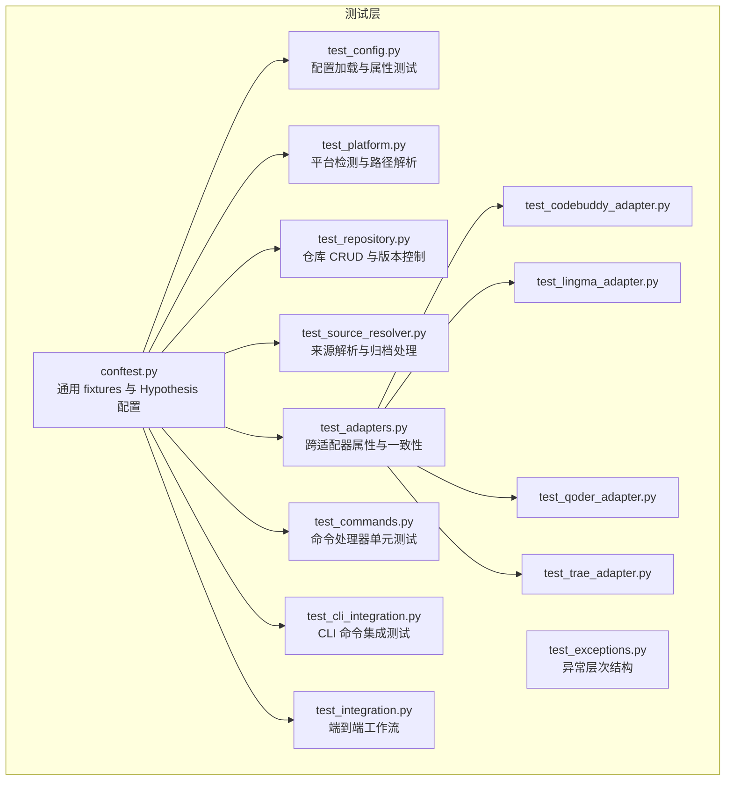
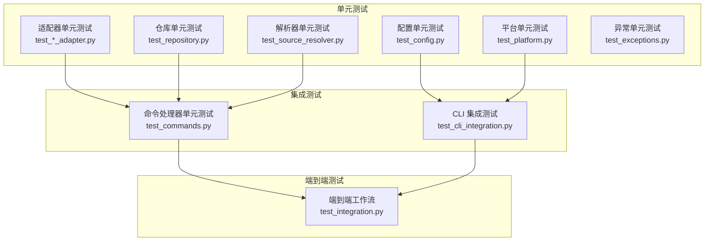
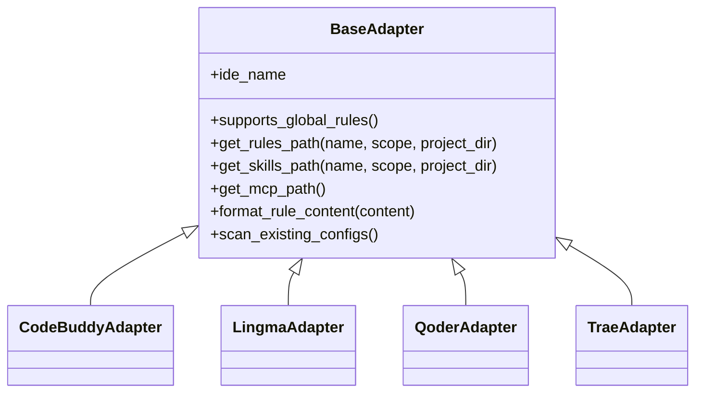
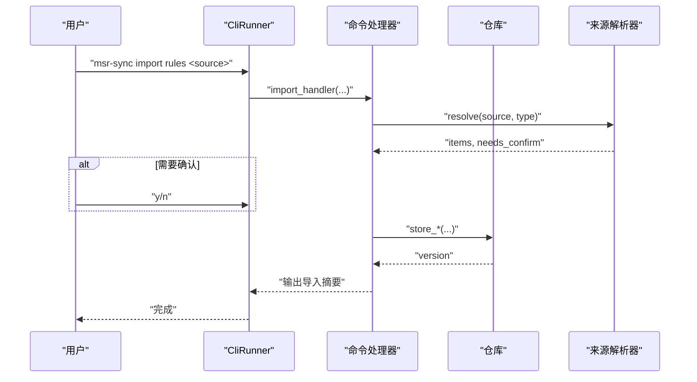
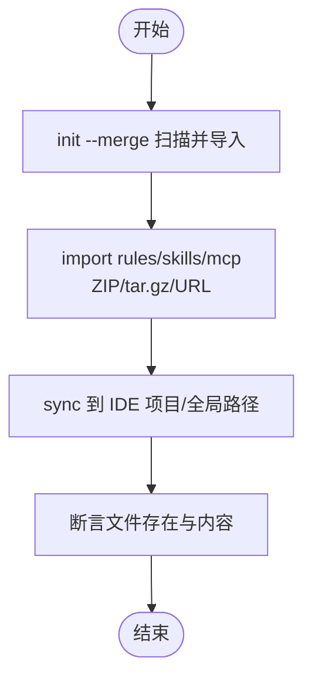
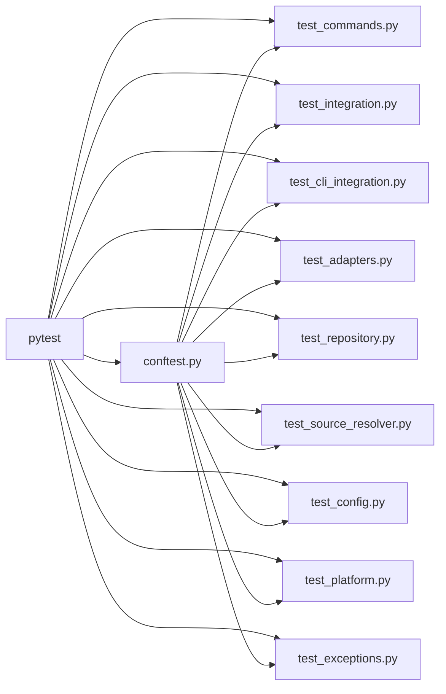

# 测试框架与实践

<cite>
**本文引用的文件**
- [MSR-cli/tests/conftest.py](file://MSR-cli/tests/conftest.py)
- [MSR-cli/pyproject.toml](file://MSR-cli/pyproject.toml)
- [MSR-cli/tests/test_adapters.py](file://MSR-cli/tests/test_adapters.py)
- [MSR-cli/tests/test_commands.py](file://MSR-cli/tests/test_commands.py)
- [MSR-cli/tests/test_integration.py](file://MSR-cli/tests/test_integration.py)
- [MSR-cli/tests/test_cli_integration.py](file://MSR-cli/tests/test_cli_integration.py)
- [MSR-cli/tests/test_config.py](file://MSR-cli/tests/test_config.py)
- [MSR-cli/tests/test_repository.py](file://MSR-cli/tests/test_repository.py)
- [MSR-cli/tests/test_platform.py](file://MSR-cli/tests/test_platform.py)
- [MSR-cli/tests/test_source_resolver.py](file://MSR-cli/tests/test_source_resolver.py)
- [MSR-cli/tests/test_codebuddy_adapter.py](file://MSR-cli/tests/test_codebuddy_adapter.py)
- [MSR-cli/tests/test_lingma_adapter.py](file://MSR-cli/tests/test_lingma_adapter.py)
- [MSR-cli/tests/test_qoder_adapter.py](file://MSR-cli/tests/test_qoder_adapter.py)
- [MSR-cli/tests/test_trae_adapter.py](file://MSR-cli/tests/test_trae_adapter.py)
- [MSR-cli/tests/test_exceptions.py](file://MSR-cli/tests/test_exceptions.py)
</cite>

## 目录
1. [简介](#简介)
2. [项目结构](#项目结构)
3. [核心组件](#核心组件)
4. [架构总览](#架构总览)
5. [详细组件分析](#详细组件分析)
6. [依赖分析](#依赖分析)
7. [性能考虑](#性能考虑)
8. [故障排查指南](#故障排查指南)
9. [结论](#结论)
10. [附录](#附录)

## 简介
本文件系统化梳理 MSR-v2 测试框架，围绕“测试金字塔”组织单元测试、集成测试与端到端测试，解释 pytest 配置与 fixtures 的设计与复用，给出适配器、命令与核心功能的测试示例与最佳实践，详述测试数据准备与清理机制、模拟对象与环境隔离策略，并提供测试覆盖率与持续集成建议及调试方法。

## 项目结构
MSR-v2 的测试位于 MSR-cli/tests 目录，采用按功能域分层的组织方式：
- 基础设施与通用 fixtures：conftest.py
- 配置与平台：test_config.py、test_platform.py
- 仓库与版本：test_repository.py
- 来源解析：test_source_resolver.py
- 适配器族：test_adapters.py、test_codebuddy_adapter.py、test_lingma_adapter.py、test_qoder_adapter.py、test_trae_adapter.py
- 命令层：test_commands.py
- CLI 集成：test_cli_integration.py
- 端到端工作流：test_integration.py
- 异常体系：test_exceptions.py

图表来源
- [MSR-cli/tests/conftest.py:1-36](file://MSR-cli/tests/conftest.py#L1-L36)
- [MSR-cli/tests/test_config.py:1-435](file://MSR-cli/tests/test_config.py#L1-L435)
- [MSR-cli/tests/test_platform.py:1-75](file://MSR-cli/tests/test_platform.py#L1-L75)
- [MSR-cli/tests/test_repository.py:1-547](file://MSR-cli/tests/test_repository.py#L1-L547)
- [MSR-cli/tests/test_source_resolver.py:1-716](file://MSR-cli/tests/test_source_resolver.py#L1-L716)
- [MSR-cli/tests/test_adapters.py:1-530](file://MSR-cli/tests/test_adapters.py#L1-L530)
- [MSR-cli/tests/test_codebuddy_adapter.py:1-227](file://MSR-cli/tests/test_codebuddy_adapter.py#L1-L227)
- [MSR-cli/tests/test_lingma_adapter.py:1-195](file://MSR-cli/tests/test_lingma_adapter.py#L1-L195)
- [MSR-cli/tests/test_qoder_adapter.py:1-192](file://MSR-cli/tests/test_qoder_adapter.py#L1-L192)
- [MSR-cli/tests/test_trae_adapter.py:1-204](file://MSR-cli/tests/test_trae_adapter.py#L1-L204)
- [MSR-cli/tests/test_commands.py:1-533](file://MSR-cli/tests/test_commands.py#L1-L533)
- [MSR-cli/tests/test_cli_integration.py:1-276](file://MSR-cli/tests/test_cli_integration.py#L1-L276)
- [MSR-cli/tests/test_integration.py:1-458](file://MSR-cli/tests/test_integration.py#L1-L458)
- [MSR-cli/tests/test_exceptions.py:1-50](file://MSR-cli/tests/test_exceptions.py#L1-L50)

章节来源
- [MSR-cli/tests/conftest.py:1-36](file://MSR-cli/tests/conftest.py#L1-L36)
- [MSR-cli/pyproject.toml:1-37](file://MSR-cli/pyproject.toml#L1-L37)

## 核心组件
- pytest 配置与运行
  - 测试目录：testpaths = ["tests"]
  - 依赖：pytest、hypothesis
- Hypothesis 属性测试配置
  - profile: ci(200 示例)、default(100 示例)
- 全局单例与状态隔离
  - 自动重置全局配置单例，避免跨用例状态泄漏
  - 临时仓库与初始化夹具，确保文件系统隔离
- CLI 测试基础设施
  - CliRunner 包装命令进行端到端与集成测试
  - monkeypatch 将 Path.home() 重定向至临时目录，隔离真实用户目录

章节来源
- [MSR-cli/pyproject.toml:23-37](file://MSR-cli/pyproject.toml#L23-L37)
- [MSR-cli/tests/conftest.py:8-20](file://MSR-cli/tests/conftest.py#L8-L20)

## 架构总览
测试金字塔由下至上分为三层：
- 单元测试（Unit Tests）
  - 针对最小可测单元，如适配器、仓库、解析器、平台检测、异常体系
  - 使用 pytest + unittest.mock 进行行为断言与边界条件验证
- 集成测试（Integration Tests）
  - 覆盖模块间协作，如命令处理器与仓库、配置、解析器的交互
  - 使用 CliRunner 与临时目录，验证 CLI 行为与文件系统变更
- 端到端测试（E2E Tests）
  - 端到端工作流验证，从 init --merge 到 import → sync 的完整链路
  - 通过 monkeypatch 与临时目录实现环境隔离

图表来源
- [MSR-cli/tests/test_adapters.py:1-530](file://MSR-cli/tests/test_adapters.py#L1-L530)
- [MSR-cli/tests/test_repository.py:1-547](file://MSR-cli/tests/test_repository.py#L1-L547)
- [MSR-cli/tests/test_source_resolver.py:1-716](file://MSR-cli/tests/test_source_resolver.py#L1-L716)
- [MSR-cli/tests/test_config.py:1-435](file://MSR-cli/tests/test_config.py#L1-L435)
- [MSR-cli/tests/test_platform.py:1-75](file://MSR-cli/tests/test_platform.py#L1-L75)
- [MSR-cli/tests/test_exceptions.py:1-50](file://MSR-cli/tests/test_exceptions.py#L1-L50)
- [MSR-cli/tests/test_commands.py:1-533](file://MSR-cli/tests/test_commands.py#L1-L533)
- [MSR-cli/tests/test_cli_integration.py:1-276](file://MSR-cli/tests/test_cli_integration.py#L1-L276)
- [MSR-cli/tests/test_integration.py:1-458](file://MSR-cli/tests/test_integration.py#L1-L458)

## 详细组件分析

### 适配器测试（跨适配器一致性与路径解析）
- 覆盖范围
  - 路径解析一致性：规则/技能/MCP 在不同 IDE 与平台上的路径模式
  - 规则内容格式化：不同 IDE 的 frontmatter/触发器头部差异
  - 全局规则支持：仅 CodeBuddy 支持全局 rules
  - IDE 列表解析：resolve_ide_list 对 'all'、重复与非法输入的行为
- 测试策略
  - Hypothesis 属性测试：对 IDE 名称、配置名、作用域进行大规模随机组合
  - 参数化测试：对已知 IDE 与期望路径/行为进行精确断言
  - 模拟平台 API：通过 patch 替换 PlatformInfo 的 home/app support 获取，保证跨平台路径断言稳定
- 最佳实践
  - 使用 _create_fresh_adapter 避免注册缓存影响
  - 为每个 IDE 编写独立的单元测试文件，便于扩展与维护
  - 对路径断言使用 Path 对象拼接，避免硬编码字符串

图表来源
- [MSR-cli/tests/test_adapters.py:172-186](file://MSR-cli/tests/test_adapters.py#L172-L186)
- [MSR-cli/tests/test_codebuddy_adapter.py:1-227](file://MSR-cli/tests/test_codebuddy_adapter.py#L1-L227)
- [MSR-cli/tests/test_lingma_adapter.py:1-195](file://MSR-cli/tests/test_lingma_adapter.py#L1-L195)
- [MSR-cli/tests/test_qoder_adapter.py:1-192](file://MSR-cli/tests/test_qoder_adapter.py#L1-L192)
- [MSR-cli/tests/test_trae_adapter.py:1-204](file://MSR-cli/tests/test_trae_adapter.py#L1-L204)

章节来源
- [MSR-cli/tests/test_adapters.py:94-530](file://MSR-cli/tests/test_adapters.py#L94-L530)
- [MSR-cli/tests/test_codebuddy_adapter.py:19-227](file://MSR-cli/tests/test_codebuddy_adapter.py#L19-L227)
- [MSR-cli/tests/test_lingma_adapter.py:19-195](file://MSR-cli/tests/test_lingma_adapter.py#L19-L195)
- [MSR-cli/tests/test_qoder_adapter.py:16-192](file://MSR-cli/tests/test_qoder_adapter.py#L16-L192)
- [MSR-cli/tests/test_trae_adapter.py:19-204](file://MSR-cli/tests/test_trae_adapter.py#L19-L204)

### 命令测试（init/list/remove/import/sync）
- 覆盖范围
  - init：创建仓库、幂等性、合并扫描与导入
  - list：树形展示、类型过滤、空仓库提示
  - remove：删除指定版本、错误处理
  - import：单文件/目录/归档/URL 导入、确认流程、版本冲突与清理
  - sync：参数校验、默认值读取、跨 IDE/作用域同步
- 测试策略
  - 使用 CliRunner 包装命令，模拟用户交互（输入 y/n）
  - 通过 patch 与 mock 控制外部依赖（适配器、解析器、平台）
  - 使用 tmp_repo/initialized_repo 夹具隔离文件系统
- 最佳实践
  - 对错误场景使用 exit_code 与输出文本断言
  - 对导入流程断言仓库中最终文件存在与内容正确
  - 对清理流程断言 resolver.cleanup() 总是被调用

图表来源
- [MSR-cli/tests/test_commands.py:324-477](file://MSR-cli/tests/test_commands.py#L324-L477)

章节来源
- [MSR-cli/tests/test_commands.py:22-533](file://MSR-cli/tests/test_commands.py#L22-L533)

### 核心功能测试（配置、仓库、解析器、平台、异常）
- 配置（GlobalConfig）
  - 加载默认值、空文件回退、YAML 注释与引号解析
  - 属性测试：路径展开、无效 IDE 过滤、无效作用域回退、YAML 往返一致性
  - 生成默认配置文件（含注释与合法性）
- 仓库（Repository）
  - 初始化幂等、CRUD 操作、版本管理、路径与内容读取、错误处理
  - 与配置集成：优先使用显式 base_path，否则使用 GlobalConfig
- 解析器（SourceResolver）
  - 单文件/目录/归档/URL 解析，确认流程
  - 单/多配置分类（MCP、Skill）
  - 忽略模式过滤（精确匹配与通配符）
- 平台（PlatformInfo）
  - OS 检测、home 目录、应用支持目录
- 异常（异常层次）
  - MSRError 为基类，各具体异常可被其捕获，消息保持一致

章节来源
- [MSR-cli/tests/test_config.py:1-435](file://MSR-cli/tests/test_config.py#L1-L435)
- [MSR-cli/tests/test_repository.py:1-547](file://MSR-cli/tests/test_repository.py#L1-L547)
- [MSR-cli/tests/test_source_resolver.py:1-716](file://MSR-cli/tests/test_source_resolver.py#L1-L716)
- [MSR-cli/tests/test_platform.py:1-75](file://MSR-cli/tests/test_platform.py#L1-L75)
- [MSR-cli/tests/test_exceptions.py:1-50](file://MSR-cli/tests/test_exceptions.py#L1-L50)

### 端到端测试（init --merge、归档导入、URL 导入、import → sync）
- 覆盖范围
  - init --merge：扫描各 IDE 用户级配置并导入统一仓库
  - 归档导入：ZIP/tar.gz 多规则/多技能/多 MCP 导入
  - URL 导入：HTTP 下载后解析
  - 完整工作流：import → sync，验证文件内容与 frontmatter
- 测试策略
  - 使用 fake_home 将 ~/.msr-repos 重定向到临时目录
  - 通过 patch 替换网络下载，保证可重复性
  - 断言仓库与 IDE 目标路径的文件存在与内容正确

图表来源
- [MSR-cli/tests/test_integration.py:48-458](file://MSR-cli/tests/test_integration.py#L48-L458)

章节来源
- [MSR-cli/tests/test_integration.py:1-458](file://MSR-cli/tests/test_integration.py#L1-L458)
- [MSR-cli/tests/test_cli_integration.py:1-276](file://MSR-cli/tests/test_cli_integration.py#L1-L276)

## 依赖分析
- 测试框架与工具
  - pytest：测试运行、参数化、夹具、断言
  - hypothesis：属性测试，大规模随机输入
  - click.testing：CLI 命令测试
  - unittest.mock：平台 API、外部服务、适配器与解析器的替身
- 关键依赖关系
  - conftest.py 提供全局夹具与 Hypothesis profile
  - 命令测试依赖仓库与解析器模块
  - 端到端测试依赖 CLI 入口与平台模块
  - 适配器测试依赖平台模块与注册表

图表来源
- [MSR-cli/tests/conftest.py:1-36](file://MSR-cli/tests/conftest.py#L1-L36)
- [MSR-cli/tests/test_commands.py:1-533](file://MSR-cli/tests/test_commands.py#L1-L533)
- [MSR-cli/tests/test_integration.py:1-458](file://MSR-cli/tests/test_integration.py#L1-L458)
- [MSR-cli/tests/test_cli_integration.py:1-276](file://MSR-cli/tests/test_cli_integration.py#L1-L276)
- [MSR-cli/tests/test_adapters.py:1-530](file://MSR-cli/tests/test_adapters.py#L1-L530)
- [MSR-cli/tests/test_repository.py:1-547](file://MSR-cli/tests/test_repository.py#L1-L547)
- [MSR-cli/tests/test_source_resolver.py:1-716](file://MSR-cli/tests/test_source_resolver.py#L1-L716)
- [MSR-cli/tests/test_config.py:1-435](file://MSR-cli/tests/test_config.py#L1-L435)
- [MSR-cli/tests/test_platform.py:1-75](file://MSR-cli/tests/test_platform.py#L1-L75)
- [MSR-cli/tests/test_exceptions.py:1-50](file://MSR-cli/tests/test_exceptions.py#L1-L50)

章节来源
- [MSR-cli/tests/conftest.py:1-36](file://MSR-cli/tests/conftest.py#L1-L36)
- [MSR-cli/pyproject.toml:23-27](file://MSR-cli/pyproject.toml#L23-L27)

## 性能考虑
- 属性测试规模控制
  - Hypothesis profile：CI 使用 200 示例，default 使用 100 示例，平衡稳定性与速度
- 临时文件与目录
  - 使用 tmp_path 与临时目录，避免磁盘 IO 与持久化开销
- 模拟与替身
  - 通过 patch 与 mock 减少真实网络请求与文件系统访问
- 并行与隔离
  - autouse 夹具自动重置全局状态，避免测试间相互影响导致的重试与回滚

## 故障排查指南
- 常见问题与定位
  - 路径断言失败：检查是否正确模拟 PlatformInfo 的 home 与 app support 目录
  - 归档导入未生效：确认 needs_confirm 流程与用户输入（y/n），以及解析器 cleanup 是否被调用
  - 端到端失败：核对 fake_home 是否正确重定向，以及 IDE 路径是否符合预期
- 调试技巧
  - 使用 pytest -v -s 查看详细输出与中间状态
  - 在关键断言前打印临时目录结构与文件内容
  - 对网络相关测试使用最小化 mock，确保可重复性
- 依赖与环境
  - 确保 Hypothesis profile 已加载（settings.load_profile）
  - 避免全局配置单例状态污染，依赖 conftest 的自动重置

章节来源
- [MSR-cli/tests/conftest.py:8-20](file://MSR-cli/tests/conftest.py#L8-L20)
- [MSR-cli/tests/test_commands.py:455-477](file://MSR-cli/tests/test_commands.py#L455-L477)
- [MSR-cli/tests/test_integration.py:27-41](file://MSR-cli/tests/test_integration.py#L27-L41)

## 结论
MSR-v2 的测试框架遵循“单元 → 集成 → 端到端”的金字塔结构，结合 pytest 与 hypothesis 实现高覆盖率与高鲁棒性的验证。通过 fixtures 与 mock 实现环境隔离与可重复性，通过属性测试覆盖大量边界与组合场景。建议在 CI 中启用覆盖率统计与并行执行，持续优化属性测试的策略与断言粒度。

## 附录
- 测试覆盖率与持续集成建议
  - 覆盖率：建议使用 pytest-cov，默认阈值可设为模块级行覆盖率 80%+，分支覆盖率 70%+
  - CI：在 PR 中运行单元与集成测试，在主干运行端到端测试；对属性测试设置更严格的示例上限
  - 并行：利用 pytest-xdist 并行执行，注意夹具与临时目录的并发安全
- 调试工具
  - pytest --tb=long 查看完整堆栈
  - pytest-html 生成 HTML 报告
  - hypothesis-db 保存失败示例，便于回归