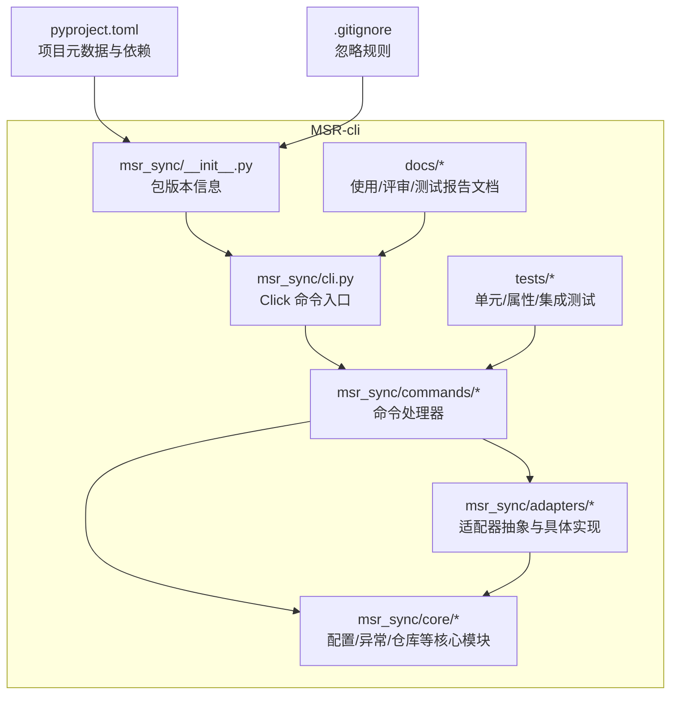
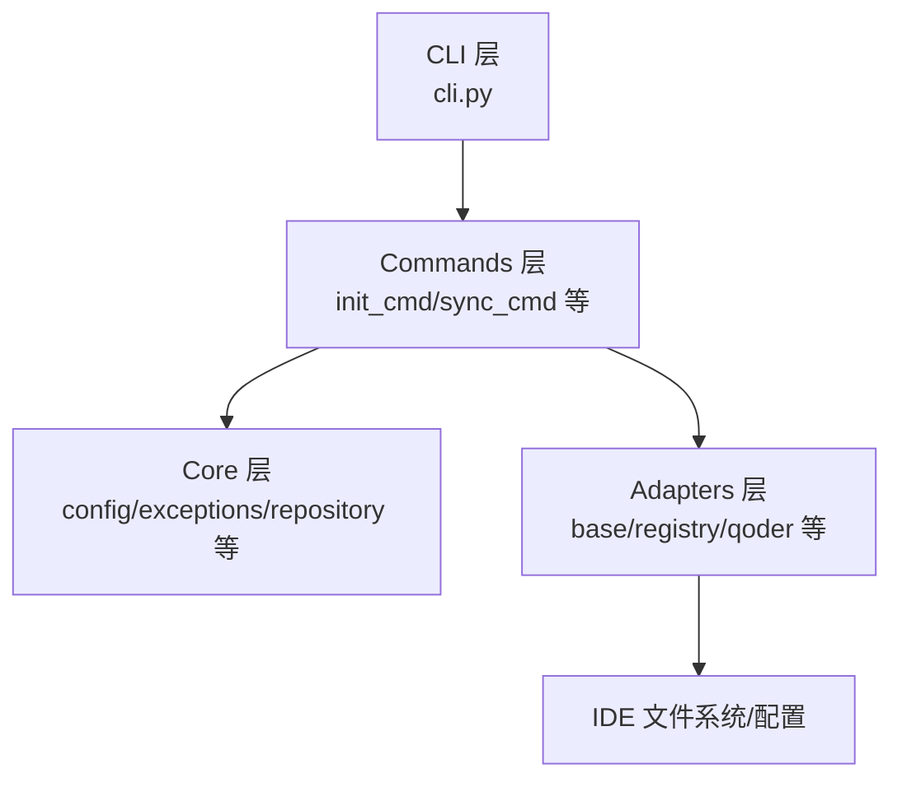
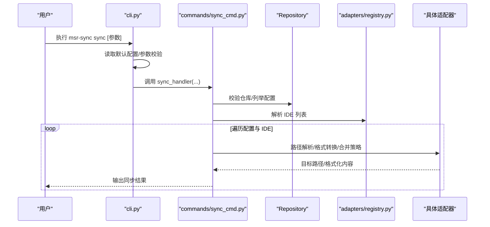
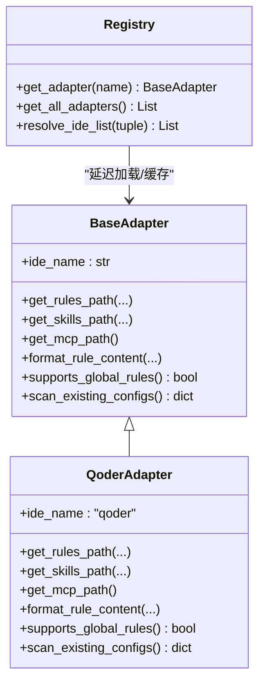
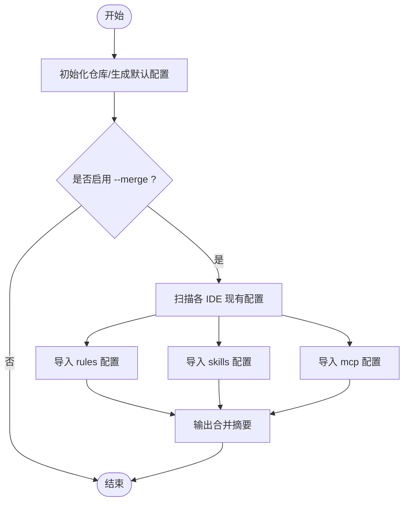
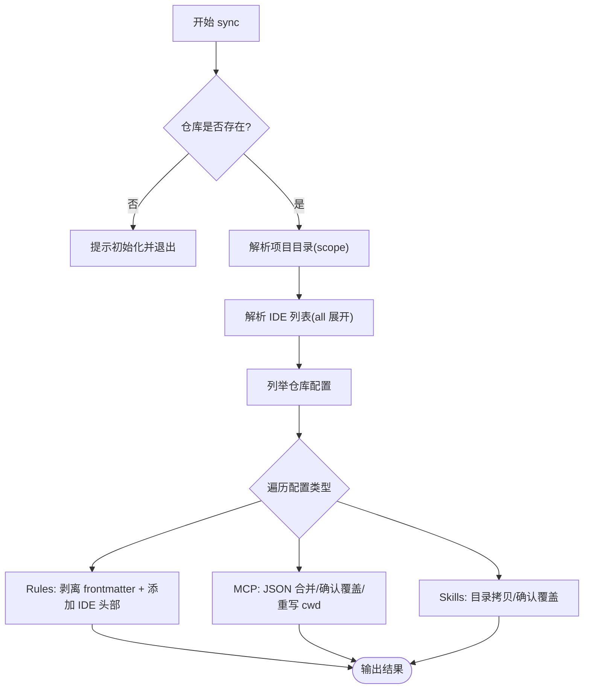
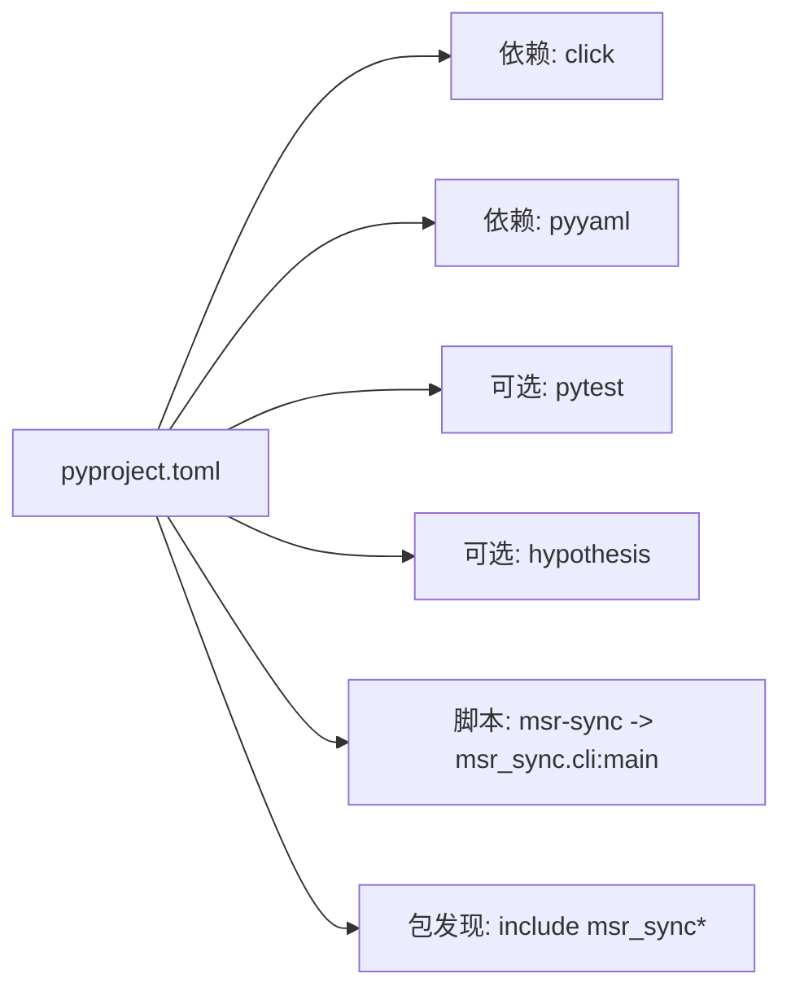

# 贡献指南

<cite>
**本文引用的文件**
- [pyproject.toml](file://MSR-cli/pyproject.toml)
- [blog-msr-sync.md](file://blog-msr-sync.md)
- [code-review.md](file://MSR-cli/docs/code-review.md)
- [test-report.md](file://MSR-cli/docs/test-report.md)
- [usage.md](file://MSR-cli/docs/usage.md)
- [__init__.py](file://MSR-cli/msr_sync/__init__.py)
- [cli.py](file://MSR-cli/msr_sync/cli.py)
- [config.py](file://MSR-cli/msr_sync/core/config.py)
- [exceptions.py](file://MSR-cli/msr_sync/core/exceptions.py)
- [base.py](file://MSR-cli/msr_sync/adapters/base.py)
- [registry.py](file://MSR-cli/msr_sync/adapters/registry.py)
- [qoder.py](file://MSR-cli/msr_sync/adapters/qoder.py)
- [init_cmd.py](file://MSR-cli/msr_sync/commands/init_cmd.py)
- [sync_cmd.py](file://MSR-cli/msr_sync/commands/sync_cmd.py)
- [.gitignore](file://.gitignore)
</cite>

## 目录
1. [简介](#简介)
2. [项目结构](#项目结构)
3. [核心组件](#核心组件)
4. [架构总览](#架构总览)
5. [详细组件分析](#详细组件分析)
6. [依赖关系分析](#依赖关系分析)
7. [性能与质量考量](#性能与质量考量)
8. [故障排查指南](#故障排查指南)
9. [结论](#结论)
10. [附录](#附录)

## 简介
本指南面向希望为 MSR-v2 项目做出贡献的开发者，涵盖从 Fork、分支创建、提交与 Pull Request 的完整流程，到代码风格与编码规范、Issue 报告标准、Bug 修复最佳实践、文档贡献方式、代码审查流程与合并标准，以及新贡献者的入门与常见问题解答。同时给出行为准则与社区参与规范，帮助贡献者高效、高质量地参与项目。

## 项目结构
MSR-v2 采用“CLI 工具 + 文档 + 测试”的组织方式，核心代码位于 MSR-cli 子项目中，采用分层架构与适配器模式，便于扩展新的 AI IDE 支持；文档与测试分别位于 docs 与 tests 目录，便于贡献者快速定位与修改。

图表来源
- [__init__.py:1-4](file://MSR-cli/msr_sync/__init__.py#L1-L4)
- [cli.py:1-116](file://MSR-cli/msr_sync/cli.py#L1-L116)
- [config.py:1-204](file://MSR-cli/msr_sync/core/config.py#L1-L204)
- [base.py:1-105](file://MSR-cli/msr_sync/adapters/base.py#L1-L105)
- [registry.py:1-89](file://MSR-cli/msr_sync/adapters/registry.py#L1-L89)
- [init_cmd.py:1-137](file://MSR-cli/msr_sync/commands/init_cmd.py#L1-L137)
- [sync_cmd.py:1-411](file://MSR-cli/msr_sync/commands/sync_cmd.py#L1-L411)
- [pyproject.toml:1-37](file://MSR-cli/pyproject.toml#L1-L37)
- [.gitignore:1-35](file://.gitignore#L1-L35)

章节来源
- [pyproject.toml:1-37](file://MSR-cli/pyproject.toml#L1-L37)
- [blog-msr-sync.md:1-421](file://blog-msr-sync.md#L1-L421)
- [.gitignore:1-35](file://.gitignore#L1-L35)

## 核心组件
- CLI 入口与命令路由：通过 Click 定义 init/import/sync/list/remove 等子命令，统一异常处理与默认配置读取。
- 核心模块：全局配置加载与校验、异常层次结构、仓库操作等。
- 适配器层：基于抽象基类的策略模式，按 IDE 分离路径解析、格式转换与扫描逻辑。
- 命令处理器：编排核心逻辑，实现幂等初始化、版本选择、MCP 合并策略、交互式覆盖确认等。
- 文档与测试：使用文档、代码评审与测试报告为贡献提供质量保障与回归依据。

章节来源
- [cli.py:1-116](file://MSR-cli/msr_sync/cli.py#L1-L116)
- [config.py:1-204](file://MSR-cli/msr_sync/core/config.py#L1-L204)
- [exceptions.py:1-34](file://MSR-cli/msr_sync/core/exceptions.py#L1-L34)
- [base.py:1-105](file://MSR-cli/msr_sync/adapters/base.py#L1-L105)
- [registry.py:1-89](file://MSR-cli/msr_sync/adapters/registry.py#L1-L89)
- [init_cmd.py:1-137](file://MSR-cli/msr_sync/commands/init_cmd.py#L1-L137)
- [sync_cmd.py:1-411](file://MSR-cli/msr_sync/commands/sync_cmd.py#L1-L411)

## 架构总览
MSR-cli 采用四层架构：CLI 层负责命令解析与参数传递；Commands 层进行业务编排；Core 层封装通用能力（配置、异常、仓库等）；Adapters 层以策略模式对接不同 IDE，实现路径解析与格式转换。

图表来源
- [cli.py:1-116](file://MSR-cli/msr_sync/cli.py#L1-L116)
- [init_cmd.py:1-137](file://MSR-cli/msr_sync/commands/init_cmd.py#L1-L137)
- [sync_cmd.py:1-411](file://MSR-cli/msr_sync/commands/sync_cmd.py#L1-L411)
- [config.py:1-204](file://MSR-cli/msr_sync/core/config.py#L1-L204)
- [base.py:1-105](file://MSR-cli/msr_sync/adapters/base.py#L1-L105)
- [registry.py:1-89](file://MSR-cli/msr_sync/adapters/registry.py#L1-L89)

## 详细组件分析

### CLI 与命令流程
- CLI 定义子命令与参数，读取默认配置，捕获基础异常并以统一方式输出。
- 命令处理器负责参数解析、仓库存在性检查、版本选择、交互式确认与错误处理。

图表来源
- [cli.py:1-116](file://MSR-cli/msr_sync/cli.py#L1-L116)
- [sync_cmd.py:1-411](file://MSR-cli/msr_sync/commands/sync_cmd.py#L1-L411)
- [registry.py:1-89](file://MSR-cli/msr_sync/adapters/registry.py#L1-L89)

章节来源
- [cli.py:1-116](file://MSR-cli/msr_sync/cli.py#L1-L116)
- [sync_cmd.py:1-411](file://MSR-cli/msr_sync/commands/sync_cmd.py#L1-L411)

### 适配器与注册表
- 抽象基类定义路径解析、格式转换、能力查询与扫描接口。
- 注册表以延迟加载方式管理适配器类与实例缓存，支持“all”展开与 IDE 列表解析。

图表来源
- [base.py:1-105](file://MSR-cli/msr_sync/adapters/base.py#L1-L105)
- [qoder.py:1-140](file://MSR-cli/msr_sync/adapters/qoder.py#L1-L140)
- [registry.py:1-89](file://MSR-cli/msr_sync/adapters/registry.py#L1-L89)

章节来源
- [base.py:1-105](file://MSR-cli/msr_sync/adapters/base.py#L1-L105)
- [registry.py:1-89](file://MSR-cli/msr_sync/adapters/registry.py#L1-L89)
- [qoder.py:1-140](file://MSR-cli/msr_sync/adapters/qoder.py#L1-L140)

### 初始化与合并流程
- 初始化仓库并生成默认配置文件；支持 --merge 扫描各 IDE 现有配置并导入统一仓库。
- 合并过程对规则、技能、MCP 分别处理，输出汇总统计。

图表来源
- [init_cmd.py:1-137](file://MSR-cli/msr_sync/commands/init_cmd.py#L1-L137)
- [registry.py:1-89](file://MSR-cli/msr_sync/adapters/registry.py#L1-L89)

章节来源
- [init_cmd.py:1-137](file://MSR-cli/msr_sync/commands/init_cmd.py#L1-L137)

### 同步与合并策略
- Rules：剥离原始 frontmatter，按 IDE 添加特定头部，支持项目级/全局级路径。
- MCP：JSON 合并策略，自动新建/追加/确认覆盖，重写 cwd 指向统一仓库版本路径。
- Skills：目录拷贝，存在目标时交互式确认覆盖。

图表来源
- [sync_cmd.py:1-411](file://MSR-cli/msr_sync/commands/sync_cmd.py#L1-L411)
- [base.py:1-105](file://MSR-cli/msr_sync/adapters/base.py#L1-L105)

章节来源
- [sync_cmd.py:1-411](file://MSR-cli/msr_sync/commands/sync_cmd.py#L1-L411)

## 依赖关系分析
- 项目元数据与依赖：通过 pyproject.toml 管理构建系统、脚本入口、依赖与可选开发依赖。
- 运行时依赖：Click、PyYAML；开发依赖：pytest、hypothesis。
- 包结构：通过 setuptools.find_packages.include 精确包含 msr_sync* 子包。

图表来源
- [pyproject.toml:1-37](file://MSR-cli/pyproject.toml#L1-L37)

章节来源
- [pyproject.toml:1-37](file://MSR-cli/pyproject.toml#L1-L37)

## 性能与质量考量
- 测试策略：单元测试、属性基测试（Hypothesis）与集成测试并行，覆盖版本管理、路径解析、MCP 合并、Frontmatter 处理等关键逻辑。
- 警告与兼容性：测试报告提示 Python 3.14 兼容性相关 DeprecationWarning，建议在 tarfile.extractall 中增加 filter 参数。
- 安全与健壮性：代码评审指出 tarfile.extractall 缺失 filter 参数存在 CVE 风险，建议尽快修复；同时建议引入上下文管理器、消除未使用变量、统一异常处理风格等。

章节来源
- [test-report.md:1-69](file://MSR-cli/docs/test-report.md#L1-L69)
- [code-review.md:1-123](file://MSR-cli/docs/code-review.md#L1-L123)

## 故障排查指南
- 常见错误与解决步骤：未初始化仓库、导入来源无效、下载失败、压缩包解压失败、MCP 格式错误、不支持的操作系统、权限不足、配置文件 YAML 语法错误、无效 IDE 名称或默认层级等。
- 使用文档提供了详尽的命令参数、示例与错误排查指引，建议在提交 Issue 前先对照使用文档核验。

章节来源
- [usage.md:634-759](file://MSR-cli/docs/usage.md#L634-L759)

## 结论
MSR-v2 项目具备清晰的分层架构与完善的测试体系，贡献者可通过本文指南快速理解项目结构、遵循贡献流程与规范，高质量地提交代码与文档，共同提升项目的稳定性与可维护性。

## 附录

### 代码贡献流程（Fork/分支/提交/Pull Request）
- Fork 仓库至个人账号，创建特性分支（建议采用 feat/fix/docs/chore 前缀命名）。
- 在本地开发环境中安装依赖并运行测试，确保通过后再提交。
- 提交信息遵循“类型: 简要描述”，并在 PR 描述中引用相关 Issue。
- 保持 PR 粒度单一，配套测试与文档更新。

### 代码风格与编码规范
- 语言与版本：Python 3.9+，遵循 PEP 8 基本风格。
- 命名与注释：函数/类/模块使用清晰命名；模块与公共接口提供 docstring；长函数拆分、必要处添加注释。
- 异常与日志：使用统一异常层次结构；CLI 输出使用统一格式与 emoji 提示。
- 依赖与配置：遵循 pyproject.toml 的依赖声明；避免在生产代码中引入开发依赖。

### Issue 报告标准与 Bug 修复最佳实践
- 报告模板：标题简洁明确；描述包含环境信息、复现步骤、期望与实际结果；附上相关日志或截图。
- Bug 修复：优先提供最小可复现示例；修复后补充/更新测试；必要时更新使用文档。

### 文档贡献方式与要求
- 文档更新：使用 Markdown，遵循现有风格；示例代码以路径引用代替粘贴，避免硬编码。
- 示例与用法：结合 usage.md 的命令与参数说明，确保示例可运行且与实现一致。

### 代码审查流程与合并标准
- 提交 PR 后自动运行测试；至少一名维护者审查并通过。
- 审查关注点：功能正确性、边界条件、安全性（如 tarfile.filter）、可读性与可维护性。
- 合并前确保 CI 通过、无冲突、变更粒度合理。

### 新贡献者入门指导
- 环境准备：Python 3.9+，克隆仓库，安装依赖（pip install -e .）。
- 运行测试：pytest 与 hypothesis 配置已内置；可参考 test-report.md 的执行环境与结果。
- 阅读文档：从 blog-msr-sync.md 了解背景与价值，从 usage.md 学习命令与使用场景。

### 行为准则与社区参与规范
- 尊重与包容：保持友善、尊重不同观点，避免人身攻击。
- 明确沟通：提问与反馈尽量具体、可复现；回复及时、清晰。
- 保护隐私：不泄露他人隐私信息与敏感数据。
- 遵守法律：遵守所在国家/地区法律法规。