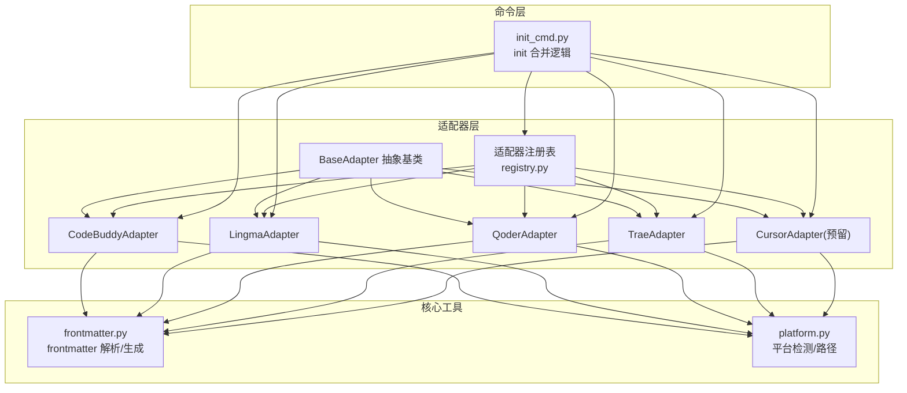
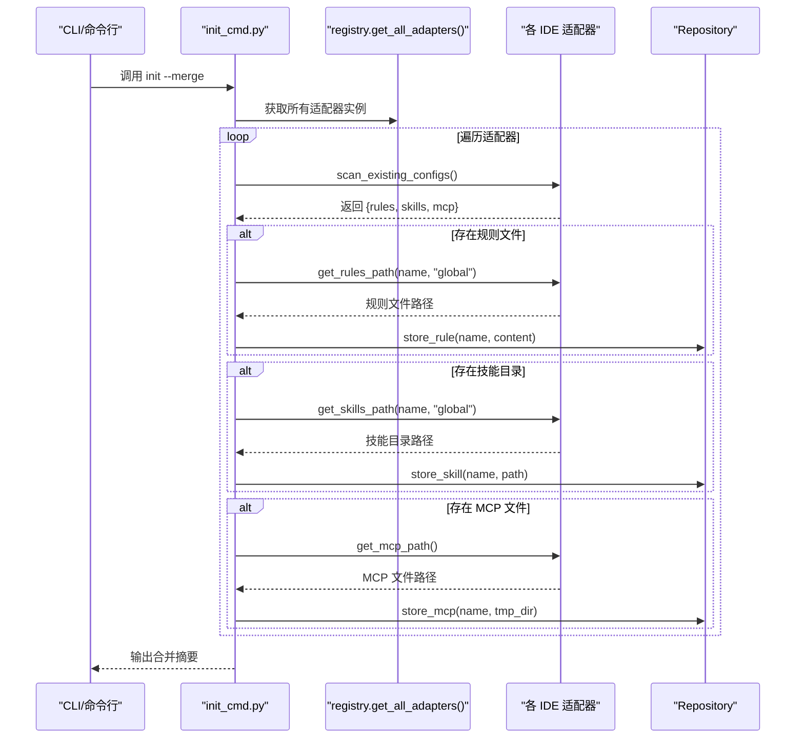
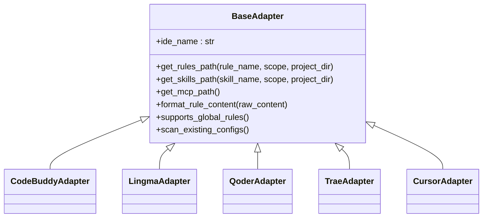
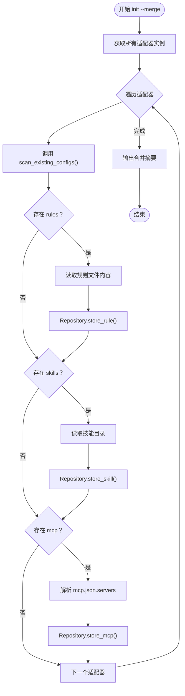
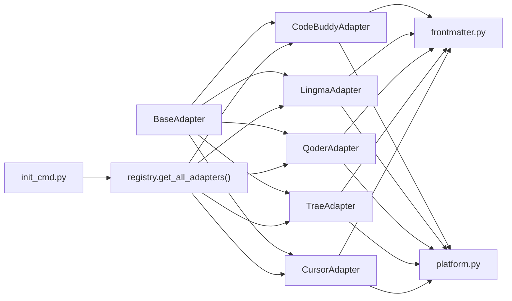

# 适配器开发指南

<cite>
**本文引用的文件**
- [MSR-cli/msr_sync/adapters/base.py](file://MSR-cli/msr_sync/adapters/base.py)
- [MSR-cli/msr_sync/adapters/registry.py](file://MSR-cli/msr_sync/adapters/registry.py)
- [MSR-cli/msr_sync/adapters/codebuddy.py](file://MSR-cli/msr_sync/adapters/codebuddy.py)
- [MSR-cli/msr_sync/adapters/lingma.py](file://MSR-cli/msr_sync/adapters/lingma.py)
- [MSR-cli/msr_sync/adapters/qoder.py](file://MSR-cli/msr_sync/adapters/qoder.py)
- [MSR-cli/msr_sync/adapters/trae.py](file://MSR-cli/msr_sync/adapters/trae.py)
- [MSR-cli/msr_sync/core/frontmatter.py](file://MSR-cli/msr_sync/core/frontmatter.py)
- [MSR-cli/msr_sync/core/platform.py](file://MSR-cli/msr_sync/core/platform.py)
- [MSR-cli/msr_sync/commands/init_cmd.py](file://MSR-cli/msr_sync/commands/init_cmd.py)
- [MSR-cli/tests/test_adapters_base.py](file://MSR-cli/tests/test_adapters_base.py)
- [MSR-cli/tests/test_adapters.py](file://MSR-cli/tests/test_adapters.py)
- [MSR-cli/tests/test_codebuddy_adapter.py](file://MSR-cli/tests/test_codebuddy_adapter.py)
- [MSR-cli/tests/test_lingma_adapter.py](file://MSR-cli/tests/test_lingma_adapter.py)
- [MSR-cli/tests/test_qoder_adapter.py](file://MSR-cli/tests/test_qoder_adapter.py)
- [MSR-cli/tests/test_trae_adapter.py](file://MSR-cli/tests/test_trae_adapter.py)
</cite>

## 目录
1. [简介](#简介)
2. [项目结构](#项目结构)
3. [核心组件](#核心组件)
4. [架构总览](#架构总览)
5. [详细组件分析](#详细组件分析)
6. [依赖关系分析](#依赖关系分析)
7. [性能考量](#性能考量)
8. [故障排查指南](#故障排查指南)
9. [结论](#结论)
10. [附录](#附录)

## 简介
本指南面向需要为新 IDE 开发适配器的工程师，系统讲解如何基于 BaseAdapter 抽象基类实现适配器，覆盖路径解析、格式转换、能力查询与配置扫描四大接口，并结合现有五个 IDE（Qoder、Lingma、Trae、CodeBuddy、Cursor）的实现差异，给出可复用的最佳实践与测试验证方法。同时，文档还解释适配器注册与管理机制，帮助你完成从接口实现到上线验证的全流程。

## 项目结构
MSR 项目的适配器层位于 msr_sync/adapters，核心抽象与注册表位于 base.py 与 registry.py；各 IDE 适配器分别实现具体逻辑；frontmatter 与 platform 模块提供通用工具；init 命令通过注册表扫描并导入现有配置。

图表来源
- [MSR-cli/msr_sync/adapters/base.py:1-105](file://MSR-cli/msr_sync/adapters/base.py#L1-L105)
- [MSR-cli/msr_sync/adapters/registry.py:1-89](file://MSR-cli/msr_sync/adapters/registry.py#L1-L89)
- [MSR-cli/msr_sync/adapters/codebuddy.py:1-143](file://MSR-cli/msr_sync/adapters/codebuddy.py#L1-L143)
- [MSR-cli/msr_sync/adapters/lingma.py:1-140](file://MSR-cli/msr_sync/adapters/lingma.py#L1-L140)
- [MSR-cli/msr_sync/adapters/qoder.py:1-140](file://MSR-cli/msr_sync/adapters/qoder.py#L1-L140)
- [MSR-cli/msr_sync/adapters/trae.py:1-138](file://MSR-cli/msr_sync/adapters/trae.py#L1-L138)
- [MSR-cli/msr_sync/core/frontmatter.py:1-164](file://MSR-cli/msr_sync/core/frontmatter.py#L1-L164)
- [MSR-cli/msr_sync/core/platform.py:1-60](file://MSR-cli/msr_sync/core/platform.py#L1-L60)
- [MSR-cli/msr_sync/commands/init_cmd.py:1-137](file://MSR-cli/msr_sync/commands/init_cmd.py#L1-L137)

章节来源
- [MSR-cli/msr_sync/adapters/base.py:1-105](file://MSR-cli/msr_sync/adapters/base.py#L1-L105)
- [MSR-cli/msr_sync/adapters/registry.py:1-89](file://MSR-cli/msr_sync/adapters/registry.py#L1-L89)

## 核心组件
- BaseAdapter 抽象基类：定义适配器必须实现的四个接口族，确保不同 IDE 的统一接入面。
- 适配器注册表：集中管理 IDE 名称到适配器类的映射，支持延迟加载与实例缓存。
- 各 IDE 适配器：按各自 IDE 的路径约定、格式头部与扫描策略实现接口。
- frontmatter 工具：提供剥离与生成 frontmatter 的通用能力，支撑格式转换。
- platform 工具：提供跨平台路径解析（主目录、应用数据目录）。
- init 命令：通过注册表批量扫描各适配器的现有配置并导入统一仓库。

章节来源
- [MSR-cli/msr_sync/adapters/base.py:8-105](file://MSR-cli/msr_sync/adapters/base.py#L8-L105)
- [MSR-cli/msr_sync/adapters/registry.py:8-89](file://MSR-cli/msr_sync/adapters/registry.py#L8-L89)
- [MSR-cli/msr_sync/core/frontmatter.py:10-164](file://MSR-cli/msr_sync/core/frontmatter.py#L10-L164)
- [MSR-cli/msr_sync/core/platform.py:9-60](file://MSR-cli/msr_sync/core/platform.py#L9-L60)
- [MSR-cli/msr_sync/commands/init_cmd.py:13-137](file://MSR-cli/msr_sync/commands/init_cmd.py#L13-L137)

## 架构总览
适配器开发遵循“抽象接口 + 具体实现 + 注册表管理”的分层设计。调用方通过注册表获取适配器实例，再调用其接口完成路径解析、格式转换与配置扫描；init 命令通过遍历注册表统一触发扫描与导入。

图表来源
- [MSR-cli/msr_sync/commands/init_cmd.py:44-137](file://MSR-cli/msr_sync/commands/init_cmd.py#L44-L137)
- [MSR-cli/msr_sync/adapters/registry.py:66-89](file://MSR-cli/msr_sync/adapters/registry.py#L66-L89)

## 详细组件分析

### BaseAdapter 抽象基类接口规范
- 标识属性：ide_name 必须返回 IDE 名称字符串，用于注册表识别与日志输出。
- 路径解析接口：
  - get_rules_path(rule_name, scope, project_dir?)：返回规则文件目标路径。scope 支持 'project'/'global'；project 级别必须提供 project_dir。
  - get_skills_path(skill_name, scope, project_dir?)：返回技能目录目标路径。scope 与 project_dir 同上。
  - get_mcp_path()：返回 MCP 配置文件路径。
- 格式转换接口：
  - format_rule_content(raw_content)：对剥离 frontmatter 的纯 Markdown 内容添加 IDE 特定的 frontmatter 头部。
- 能力查询接口：
  - supports_global_rules()：默认 False；仅 CodeBuddy 返回 True。
- 配置扫描接口：
  - scan_existing_configs()：扫描用户级配置，返回包含 'rules'、'skills'、'mcp' 三类键的字典。

章节来源
- [MSR-cli/msr_sync/adapters/base.py:18-105](file://MSR-cli/msr_sync/adapters/base.py#L18-L105)

### 适配器注册与管理机制
- 注册表维护 IDE 名称到模块路径与类名的映射，支持延迟加载与实例缓存，避免重复 import 与构造。
- get_adapter(ide_name)：获取单个适配器实例（带缓存）。
- get_all_adapters()：获取所有已注册适配器实例列表。
- resolve_ide_list((...))：支持传入 'all' 展开为全部，或具体 IDE 名称元组，自动去重与校验。

图表来源
- [MSR-cli/msr_sync/adapters/base.py:8-105](file://MSR-cli/msr_sync/adapters/base.py#L8-L105)
- [MSR-cli/msr_sync/adapters/codebuddy.py:22-143](file://MSR-cli/msr_sync/adapters/codebuddy.py#L22-L143)
- [MSR-cli/msr_sync/adapters/lingma.py:22-140](file://MSR-cli/msr_sync/adapters/lingma.py#L22-L140)
- [MSR-cli/msr_sync/adapters/qoder.py:22-140](file://MSR-cli/msr_sync/adapters/qoder.py#L22-L140)
- [MSR-cli/msr_sync/adapters/trae.py:21-138](file://MSR-cli/msr_sync/adapters/trae.py#L21-L138)

章节来源
- [MSR-cli/msr_sync/adapters/registry.py:8-89](file://MSR-cli/msr_sync/adapters/registry.py#L8-L89)

### 各 IDE 差异化处理要点
- CodeBuddy
  - 支持全局级 rules；路径约定与头部生成由 frontmatter 工具提供。
  - MCP 路径跨平台统一为主目录下的 .codebuddy/mcp.json。
- Lingma / Qoder
  - 仅支持项目级 rules；全局 rules 返回路径但调用方需自行警告。
  - MCP 路径位于平台应用数据目录下的 IDE 特定子路径。
- Trae
  - 仅支持项目级 rules；全局 skills 路径使用 .trae-cn（非 .trae）。
  - MCP 路径位于平台应用数据目录下的 'Trae CN' 子路径。
- Cursor
  - 作为预留适配器，格式头部与路径约定与 CodeBuddy 类似，便于快速补齐。

章节来源
- [MSR-cli/msr_sync/adapters/codebuddy.py:5-12](file://MSR-cli/msr_sync/adapters/codebuddy.py#L5-L12)
- [MSR-cli/msr_sync/adapters/lingma.py:5-12](file://MSR-cli/msr_sync/adapters/lingma.py#L5-L12)
- [MSR-cli/msr_sync/adapters/qoder.py:5-12](file://MSR-cli/msr_sync/adapters/qoder.py#L5-L12)
- [MSR-cli/msr_sync/adapters/trae.py:5-12](file://MSR-cli/msr_sync/adapters/trae.py#L5-L12)

### 新 IDE 适配器开发流程
- 步骤 1：创建适配器类并继承 BaseAdapter，实现以下方法：
  - ide_name 返回 IDE 名称。
  - get_rules_path / get_skills_path：按 IDE 路径约定实现，区分 scope 与 project_dir。
  - get_mcp_path：按 IDE 的 MCP 存储位置实现。
  - format_rule_content：调用 frontmatter 工具生成 IDE 特定头部。
  - supports_global_rules：若支持全局 rules 则返回 True。
  - scan_existing_configs：扫描用户级配置，返回包含三类键的字典。
- 步骤 2：在注册表中注册新 IDE 名称与模块路径映射。
- 步骤 3：编写单元测试，覆盖路径解析、格式转换、能力查询与配置扫描。
- 步骤 4：集成 init 命令，确保通过注册表可被统一扫描与导入。
- 步骤 5：进行端到端测试，验证合并流程与错误处理。

章节来源
- [MSR-cli/msr_sync/adapters/base.py:18-105](file://MSR-cli/msr_sync/adapters/base.py#L18-L105)
- [MSR-cli/msr_sync/adapters/registry.py:10-16](file://MSR-cli/msr_sync/adapters/registry.py#L10-L16)
- [MSR-cli/tests/test_adapters_base.py:21-77](file://MSR-cli/tests/test_adapters_base.py#L21-L77)
- [MSR-cli/tests/test_adapters.py:176-186](file://MSR-cli/tests/test_adapters.py#L176-L186)

### 路径解析与格式转换规则
- 路径解析
  - 项目级：规则文件通常位于 <project>/.<ide>/rules/<name>.md；技能目录位于 <project>/.<ide>/skills/<name>/。
  - 全局级：规则与技能通常位于 ~/.<ide>/rules|skills/ 下；部分 IDE（如 Trae）全局技能使用 .trae-cn。
  - MCP：macOS 一般位于 ~/Library/Application Support/<IDE>/.../mcp.json；Windows 一般位于 %APPDATA%/<IDE>/.../mcp.json；CodeBuddy/Cursor 的 MCP 路径跨平台统一为主目录。
- 格式转换
  - Qoder/Lingma：添加 trigger: always_on 的 frontmatter。
  - CodeBuddy/Cursor：添加包含时间戳等字段的 frontmatter。
  - Trae：不添加额外头部，直接返回原始内容。

章节来源
- [MSR-cli/msr_sync/adapters/codebuddy.py:31-100](file://MSR-cli/msr_sync/adapters/codebuddy.py#L31-L100)
- [MSR-cli/msr_sync/adapters/lingma.py:31-98](file://MSR-cli/msr_sync/adapters/lingma.py#L31-L98)
- [MSR-cli/msr_sync/adapters/qoder.py:31-98](file://MSR-cli/msr_sync/adapters/qoder.py#L31-L98)
- [MSR-cli/msr_sync/adapters/trae.py:30-96](file://MSR-cli/msr_sync/adapters/trae.py#L30-L96)
- [MSR-cli/msr_sync/core/frontmatter.py:110-164](file://MSR-cli/msr_sync/core/frontmatter.py#L110-L164)

### 配置扫描与合并流程
- scan_existing_configs 返回结构包含三类键：rules、skills、mcp。
- init 命令遍历所有适配器，逐项导入规则、技能与 MCP；对异常进行捕获与跳过，保证健壮性。
- MCP 导入时解析 mcp.json 的 servers 字段，逐个服务器生成临时目录并存储。

图表来源
- [MSR-cli/msr_sync/commands/init_cmd.py:44-137](file://MSR-cli/msr_sync/commands/init_cmd.py#L44-L137)

章节来源
- [MSR-cli/msr_sync/commands/init_cmd.py:44-137](file://MSR-cli/msr_sync/commands/init_cmd.py#L44-L137)

## 依赖关系分析
- 低耦合高内聚：BaseAdapter 定义清晰接口，各 IDE 适配器仅关注自身路径与头部差异。
- 注册表解耦：通过模块路径与类名映射实现延迟加载，避免循环依赖。
- 工具模块复用：frontmatter 与 platform 为所有适配器提供通用能力，减少重复实现。
- init 命令依赖注册表：统一调度所有适配器，形成可扩展的扫描与导入链路。

图表来源
- [MSR-cli/msr_sync/adapters/base.py:8-105](file://MSR-cli/msr_sync/adapters/base.py#L8-L105)
- [MSR-cli/msr_sync/adapters/registry.py:8-89](file://MSR-cli/msr_sync/adapters/registry.py#L8-L89)
- [MSR-cli/msr_sync/core/frontmatter.py:1-164](file://MSR-cli/msr_sync/core/frontmatter.py#L1-L164)
- [MSR-cli/msr_sync/core/platform.py:1-60](file://MSR-cli/msr_sync/core/platform.py#L1-L60)
- [MSR-cli/msr_sync/commands/init_cmd.py:1-137](file://MSR-cli/msr_sync/commands/init_cmd.py#L1-L137)

章节来源
- [MSR-cli/msr_sync/adapters/registry.py:8-89](file://MSR-cli/msr_sync/adapters/registry.py#L8-L89)

## 性能考量
- 实例缓存：注册表对适配器实例进行缓存，避免重复构造，提升 init 扫描效率。
- 路径扫描：扫描用户级配置时仅枚举目录项并过滤后缀/类型，复杂度近似 O(N)。
- 异常隔离：init 命令对每个适配器的扫描与导入进行异常捕获与跳过，避免单点失败影响整体流程。
- 建议
  - 在适配器内部尽量避免频繁 IO；必要时进行目录存在性与类型判断。
  - 对于 MCP 解析，建议先读取并校验 JSON 结构，再进行服务器条目拆分存储。

章节来源
- [MSR-cli/msr_sync/adapters/registry.py:18-63](file://MSR-cli/msr_sync/adapters/registry.py#L18-L63)
- [MSR-cli/msr_sync/commands/init_cmd.py:60-124](file://MSR-cli/msr_sync/commands/init_cmd.py#L60-L124)

## 故障排查指南
- 无法获取适配器实例
  - 检查 IDE 名称是否在注册表中；确认模块路径与类名映射正确。
  - 若出现延迟加载失败，检查对应模块是否已实现且无语法错误。
- 路径解析异常
  - 确认 scope 与 project_dir 参数组合是否符合预期；项目级必须提供 project_dir。
  - 检查平台路径函数（主目录、应用数据目录）是否可用。
- 格式转换问题
  - 确认 frontmatter 工具生成的头部是否与 IDE 要求一致；注意时间戳格式与字段完整性。
- 配置扫描失败
  - 检查用户级目录是否存在与权限；MCP 文件是否存在且可读。
  - init 命令已对异常进行捕获与跳过，可在日志中定位具体适配器与配置项。

章节来源
- [MSR-cli/msr_sync/adapters/registry.py:22-43](file://MSR-cli/msr_sync/adapters/registry.py#L22-L43)
- [MSR-cli/msr_sync/core/platform.py:12-60](file://MSR-cli/msr_sync/core/platform.py#L12-L60)
- [MSR-cli/tests/test_adapters_base.py:152-156](file://MSR-cli/tests/test_adapters_base.py#L152-L156)
- [MSR-cli/tests/test_adapters.py:236-240](file://MSR-cli/tests/test_adapters.py#L236-L240)
- [MSR-cli/msr_sync/commands/init_cmd.py:60-124](file://MSR-cli/msr_sync/commands/init_cmd.py#L60-L124)

## 结论
通过 BaseAdapter 抽象基类与注册表机制，MSR 项目实现了对多 IDE 的统一接入与扩展。开发者只需遵循接口规范，结合 IDE 的差异化路径与头部规则，即可快速完成新适配器开发。配合完善的测试与 init 合并流程，可确保功能正确性与运行稳定性。

## 附录

### 接口实现清单（新适配器必做）
- 实现 ide_name、get_rules_path、get_skills_path、get_mcp_path、format_rule_content、supports_global_rules、scan_existing_configs。
- 在注册表中添加 IDE 名称到模块路径与类名的映射。
- 编写单元测试，覆盖路径解析、格式转换、能力查询与配置扫描。
- 在 init 命令中验证合并流程，确保异常处理与日志输出正常。

章节来源
- [MSR-cli/msr_sync/adapters/base.py:18-105](file://MSR-cli/msr_sync/adapters/base.py#L18-L105)
- [MSR-cli/msr_sync/adapters/registry.py:10-16](file://MSR-cli/msr_sync/adapters/registry.py#L10-L16)
- [MSR-cli/tests/test_adapters.py:192-240](file://MSR-cli/tests/test_adapters.py#L192-L240)