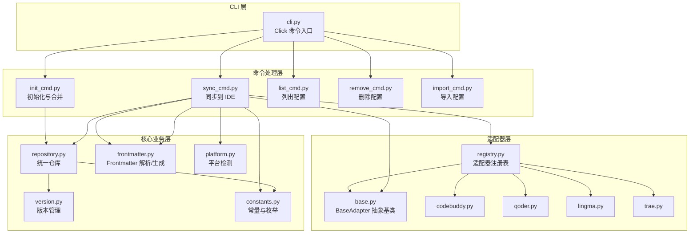
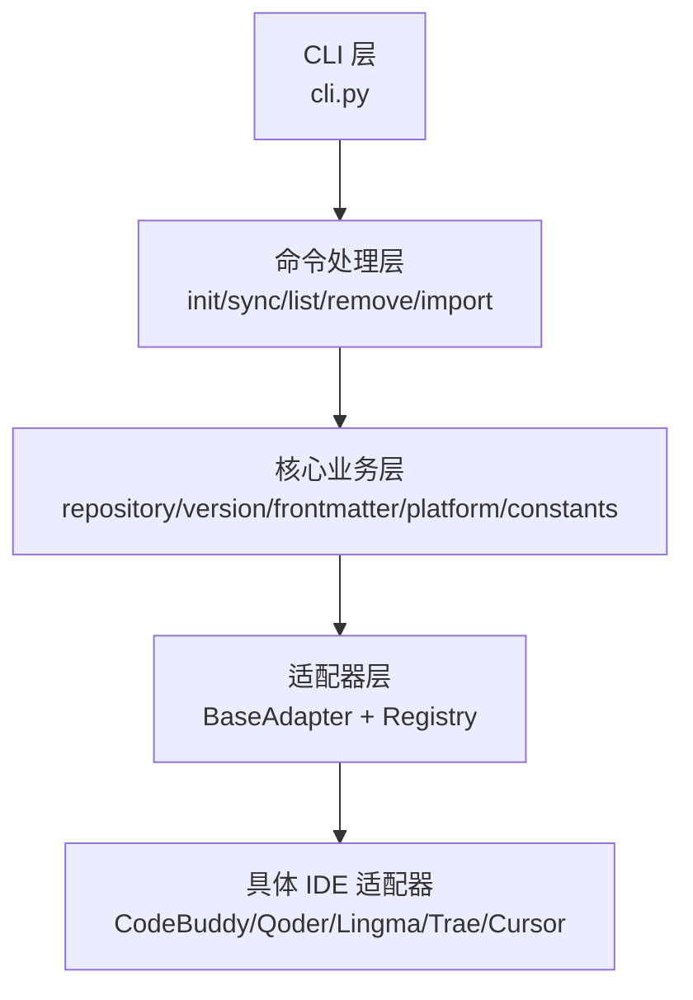
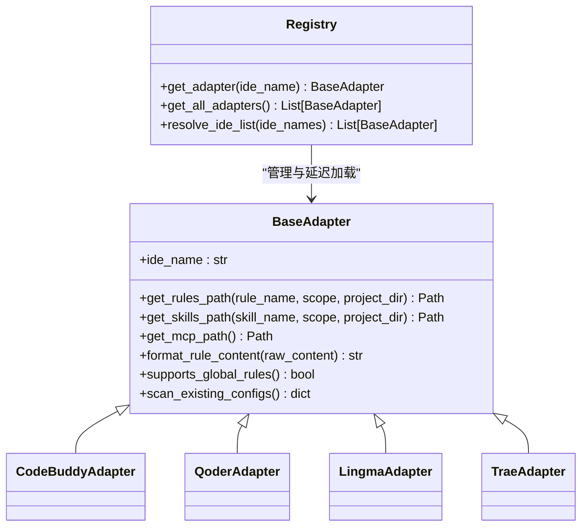
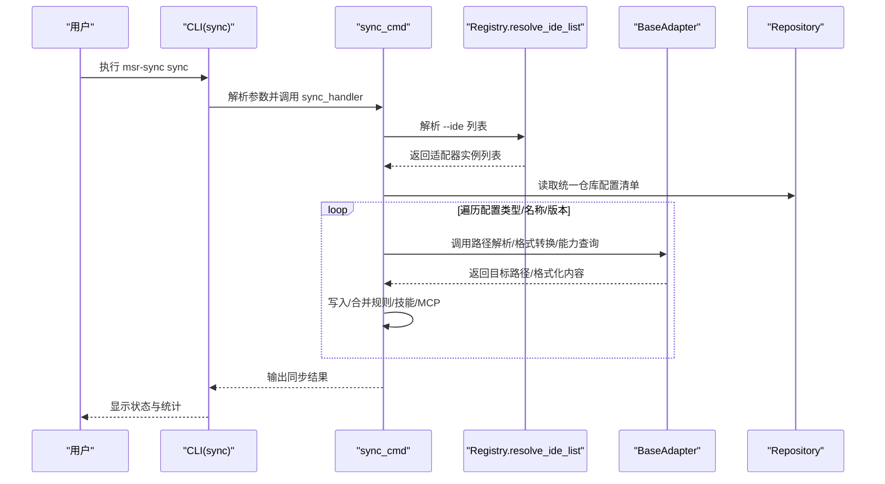
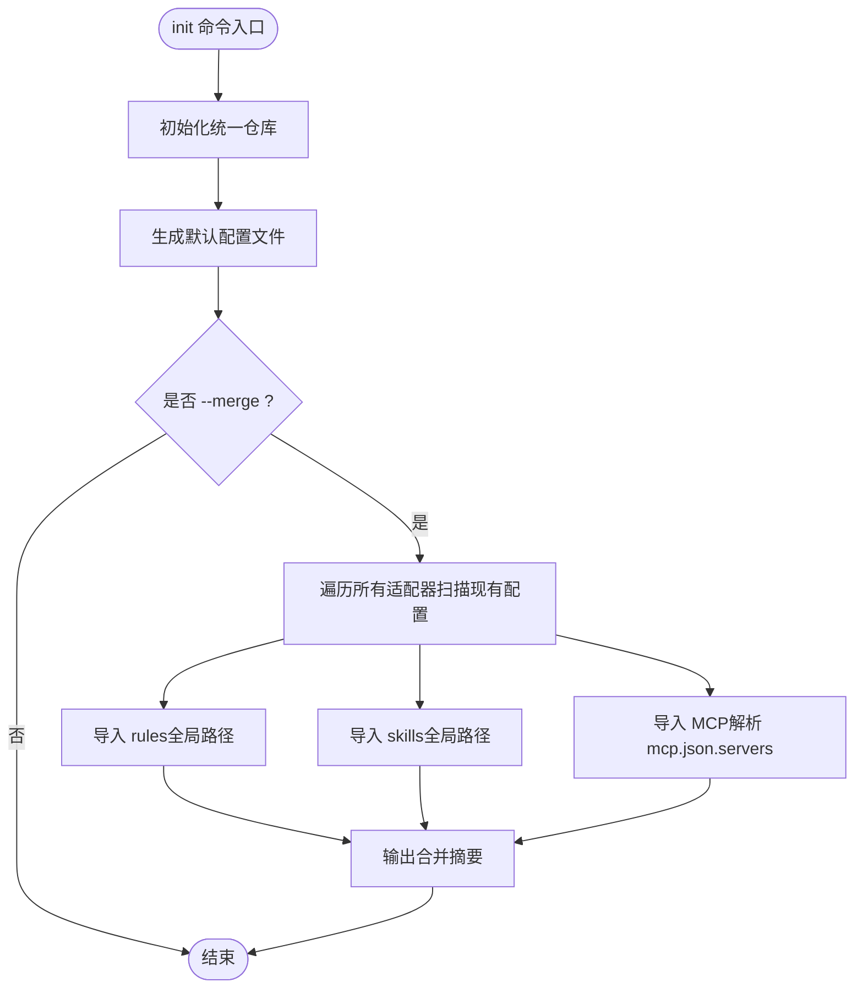
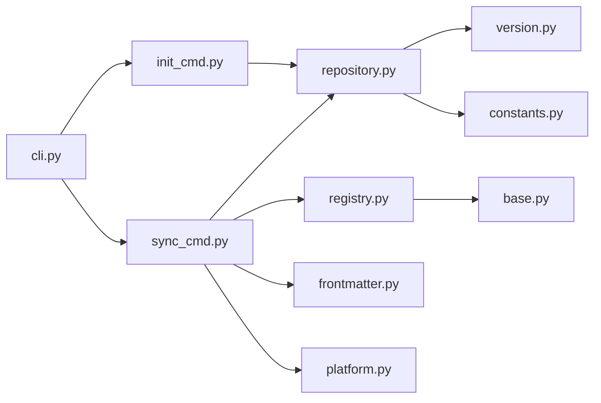

# 项目架构设计

<cite>
**本文引用的文件**
- [MSR-cli/msr_sync/cli.py](file://MSR-cli/msr_sync/cli.py)
- [MSR-cli/msr_sync/adapters/base.py](file://MSR-cli/msr_sync/adapters/base.py)
- [MSR-cli/msr_sync/adapters/registry.py](file://MSR-cli/msr_sync/adapters/registry.py)
- [MSR-cli/msr_sync/adapters/codebuddy.py](file://MSR-cli/msr_sync/adapters/codebuddy.py)
- [MSR-cli/msr_sync/adapters/qoder.py](file://MSR-cli/msr_sync/adapters/qoder.py)
- [MSR-cli/msr_sync/adapters/lingma.py](file://MSR-cli/msr_sync/adapters/lingma.py)
- [MSR-cli/msr_sync/adapters/trae.py](file://MSR-cli/msr_sync/adapters/trae.py)
- [MSR-cli/msr_sync/commands/init_cmd.py](file://MSR-cli/msr_sync/commands/init_cmd.py)
- [MSR-cli/msr_sync/commands/sync_cmd.py](file://MSR-cli/msr_sync/commands/sync_cmd.py)
- [MSR-cli/msr_sync/core/repository.py](file://MSR-cli/msr_sync/core/repository.py)
- [MSR-cli/msr_sync/constants.py](file://MSR-cli/msr_sync/constants.py)
- [MSR-cli/msr_sync/core/frontmatter.py](file://MSR-cli/msr_sync/core/frontmatter.py)
- [MSR-cli/msr_sync/core/platform.py](file://MSR-cli/msr_sync/core/platform.py)
- [MSR-cli/msr_sync/core/version.py](file://MSR-cli/msr_sync/core/version.py)
- [MSR-cli/pyproject.toml](file://MSR-cli/pyproject.toml)
</cite>

## 目录
1. [引言](#引言)
2. [项目结构](#项目结构)
3. [核心组件](#核心组件)
4. [架构总览](#架构总览)
5. [详细组件分析](#详细组件分析)
6. [依赖分析](#依赖分析)
7. [性能考量](#性能考量)
8. [故障排查指南](#故障排查指南)
9. [结论](#结论)
10. [附录](#附录)

## 引言
本文件面向 MSR-v2 项目，系统化阐述其分层架构设计与实现细节，重点包括：
- 分层架构：CLI 层、命令处理层、核心业务层、适配器层的职责划分与交互关系
- 适配器模式：BaseAdapter 抽象基类的设计思路与各具体适配器的差异化处理
- 注册表模式：适配器管理中的注册与延迟加载机制
- 策略模式：在不同配置类型（rules/skills/mcp）处理中的应用
- 数据流与控制流：通过架构图与序列图展示统一仓库与各 IDE 之间的同步过程
- 技术决策背景与权衡：可扩展性、跨平台兼容性与错误处理策略

## 项目结构
MSR-v2 的 CLI 包位于 MSR-cli/msr_sync，采用“功能域+层次”的组织方式：
- CLI 层：命令入口与参数解析
- 命令处理层：init、sync、list、remove、import 等命令处理器
- 核心业务层：仓库管理、版本管理、平台检测、frontmatter 解析
- 适配器层：针对不同 IDE 的适配器与注册表

图表来源
- [MSR-cli/msr_sync/cli.py:1-116](file://MSR-cli/msr_sync/cli.py#L1-L116)
- [MSR-cli/msr_sync/commands/init_cmd.py:1-137](file://MSR-cli/msr_sync/commands/init_cmd.py#L1-L137)
- [MSR-cli/msr_sync/commands/sync_cmd.py:1-411](file://MSR-cli/msr_sync/commands/sync_cmd.py#L1-L411)
- [MSR-cli/msr_sync/core/repository.py:1-291](file://MSR-cli/msr_sync/core/repository.py#L1-L291)
- [MSR-cli/msr_sync/core/version.py:1-119](file://MSR-cli/msr_sync/core/version.py#L1-L119)
- [MSR-cli/msr_sync/core/frontmatter.py:1-164](file://MSR-cli/msr_sync/core/frontmatter.py#L1-L164)
- [MSR-cli/msr_sync/core/platform.py:1-60](file://MSR-cli/msr_sync/core/platform.py#L1-L60)
- [MSR-cli/msr_sync/constants.py:1-50](file://MSR-cli/msr_sync/constants.py#L1-L50)
- [MSR-cli/msr_sync/adapters/base.py:1-105](file://MSR-cli/msr_sync/adapters/base.py#L1-L105)
- [MSR-cli/msr_sync/adapters/registry.py:1-89](file://MSR-cli/msr_sync/adapters/registry.py#L1-L89)
- [MSR-cli/msr_sync/adapters/codebuddy.py:1-143](file://MSR-cli/msr_sync/adapters/codebuddy.py#L1-L143)
- [MSR-cli/msr_sync/adapters/qoder.py:1-140](file://MSR-cli/msr_sync/adapters/qoder.py#L1-L140)
- [MSR-cli/msr_sync/adapters/lingma.py:1-140](file://MSR-cli/msr_sync/adapters/lingma.py#L1-L140)
- [MSR-cli/msr_sync/adapters/trae.py:1-138](file://MSR-cli/msr_sync/adapters/trae.py#L1-L138)

章节来源
- [MSR-cli/msr_sync/cli.py:1-116](file://MSR-cli/msr_sync/cli.py#L1-L116)
- [MSR-cli/msr_sync/commands/init_cmd.py:1-137](file://MSR-cli/msr_sync/commands/init_cmd.py#L1-L137)
- [MSR-cli/msr_sync/commands/sync_cmd.py:1-411](file://MSR-cli/msr_sync/commands/sync_cmd.py#L1-L411)
- [MSR-cli/msr_sync/core/repository.py:1-291](file://MSR-cli/msr_sync/core/repository.py#L1-L291)
- [MSR-cli/msr_sync/constants.py:1-50](file://MSR-cli/msr_sync/constants.py#L1-L50)
- [MSR-cli/msr_sync/adapters/base.py:1-105](file://MSR-cli/msr_sync/adapters/base.py#L1-L105)
- [MSR-cli/msr_sync/adapters/registry.py:1-89](file://MSR-cli/msr_sync/adapters/registry.py#L1-L89)

## 核心组件
- CLI 层：基于 Click 定义子命令，负责参数解析与错误输出，将控制权转交至命令处理层。
- 命令处理层：封装 init、sync、list、remove、import 等业务逻辑，协调核心业务与适配器层。
- 核心业务层：Repository 统一管理规则、技能、MCP 的存储；Version 提供版本解析与递增；Frontmatter 提供解析与模板生成；Platform 提供跨平台路径能力；Constants 定义常量与枚举。
- 适配器层：BaseAdapter 抽象出 IDE 差异化的路径解析、格式转换、能力查询与扫描逻辑；Registry 实现适配器注册与延迟加载。

章节来源
- [MSR-cli/msr_sync/cli.py:1-116](file://MSR-cli/msr_sync/cli.py#L1-L116)
- [MSR-cli/msr_sync/commands/init_cmd.py:1-137](file://MSR-cli/msr_sync/commands/init_cmd.py#L1-L137)
- [MSR-cli/msr_sync/commands/sync_cmd.py:1-411](file://MSR-cli/msr_sync/commands/sync_cmd.py#L1-L411)
- [MSR-cli/msr_sync/core/repository.py:1-291](file://MSR-cli/msr_sync/core/repository.py#L1-L291)
- [MSR-cli/msr_sync/core/version.py:1-119](file://MSR-cli/msr_sync/core/version.py#L1-L119)
- [MSR-cli/msr_sync/core/frontmatter.py:1-164](file://MSR-cli/msr_sync/core/frontmatter.py#L1-L164)
- [MSR-cli/msr_sync/core/platform.py:1-60](file://MSR-cli/msr_sync/core/platform.py#L1-L60)
- [MSR-cli/msr_sync/constants.py:1-50](file://MSR-cli/msr_sync/constants.py#L1-L50)
- [MSR-cli/msr_sync/adapters/base.py:1-105](file://MSR-cli/msr_sync/adapters/base.py#L1-L105)
- [MSR-cli/msr_sync/adapters/registry.py:1-89](file://MSR-cli/msr_sync/adapters/registry.py#L1-L89)

## 架构总览
MSR-v2 采用清晰的分层架构：
- CLI 层仅负责输入与输出，不承载业务逻辑
- 命令处理层编排业务流程，调用核心业务与适配器
- 核心业务层提供通用能力（仓库、版本、平台、frontmatter）
- 适配器层隔离 IDE 差异，通过注册表集中管理

图表来源
- [MSR-cli/msr_sync/cli.py:1-116](file://MSR-cli/msr_sync/cli.py#L1-L116)
- [MSR-cli/msr_sync/commands/init_cmd.py:1-137](file://MSR-cli/msr_sync/commands/init_cmd.py#L1-L137)
- [MSR-cli/msr_sync/commands/sync_cmd.py:1-411](file://MSR-cli/msr_sync/commands/sync_cmd.py#L1-L411)
- [MSR-cli/msr_sync/core/repository.py:1-291](file://MSR-cli/msr_sync/core/repository.py#L1-L291)
- [MSR-cli/msr_sync/adapters/base.py:1-105](file://MSR-cli/msr_sync/adapters/base.py#L1-L105)
- [MSR-cli/msr_sync/adapters/registry.py:1-89](file://MSR-cli/msr_sync/adapters/registry.py#L1-L89)
- [MSR-cli/msr_sync/adapters/codebuddy.py:1-143](file://MSR-cli/msr_sync/adapters/codebuddy.py#L1-L143)
- [MSR-cli/msr_sync/adapters/qoder.py:1-140](file://MSR-cli/msr_sync/adapters/qoder.py#L1-L140)
- [MSR-cli/msr_sync/adapters/lingma.py:1-140](file://MSR-cli/msr_sync/adapters/lingma.py#L1-L140)
- [MSR-cli/msr_sync/adapters/trae.py:1-138](file://MSR-cli/msr_sync/adapters/trae.py#L1-L138)

## 详细组件分析

### CLI 层（命令入口）
- 职责：定义 group 与子命令，解析参数，捕获业务异常并输出
- 关键点：init、import、sync、list、remove 均委托给对应命令处理器；sync 命令支持多 IDE、作用域、类型与版本过滤

章节来源
- [MSR-cli/msr_sync/cli.py:1-116](file://MSR-cli/msr_sync/cli.py#L1-L116)

### 命令处理层（业务编排）
- init_cmd：初始化统一仓库、生成默认配置；支持 --merge 合并现有 IDE 配置
- sync_cmd：解析目标 IDE 列表、配置类型、作用域与版本；分发到规则/技能/MCP 同步逻辑；处理冲突与覆盖确认

章节来源
- [MSR-cli/msr_sync/commands/init_cmd.py:1-137](file://MSR-cli/msr_sync/commands/init_cmd.py#L1-L137)
- [MSR-cli/msr_sync/commands/sync_cmd.py:1-411](file://MSR-cli/msr_sync/commands/sync_cmd.py#L1-L411)

### 核心业务层（通用能力）
- Repository：统一仓库的创建、存在性检查、配置存储/读取/删除、版本解析与列表
- Version：版本号解析、格式化、排序、最新版本与下一个版本计算
- Frontmatter：剥离与解析 Markdown frontmatter，生成各 IDE 模板头部
- Platform：检测操作系统、获取用户主目录与应用数据目录
- Constants：统一仓库路径、子目录名、配置类型枚举、版本前缀、MCP 文件名等

章节来源
- [MSR-cli/msr_sync/core/repository.py:1-291](file://MSR-cli/msr_sync/core/repository.py#L1-L291)
- [MSR-cli/msr_sync/core/version.py:1-119](file://MSR-cli/msr_sync/core/version.py#L1-L119)
- [MSR-cli/msr_sync/core/frontmatter.py:1-164](file://MSR-cli/msr_sync/core/frontmatter.py#L1-L164)
- [MSR-cli/msr_sync/core/platform.py:1-60](file://MSR-cli/msr_sync/core/platform.py#L1-L60)
- [MSR-cli/msr_sync/constants.py:1-50](file://MSR-cli/msr_sync/constants.py#L1-L50)

### 适配器层（策略与注册）
- BaseAdapter：定义 IDE 差异化的接口契约（路径解析、格式转换、能力查询、扫描）
- Registry：延迟加载适配器类、实例缓存、批量获取与 --ide=all 解析
- 具体适配器：CodeBuddy、Qoder、Lingma、Trae（以及 Cursor 占位）分别实现自身路径、头部与扫描逻辑

图表来源
- [MSR-cli/msr_sync/adapters/base.py:1-105](file://MSR-cli/msr_sync/adapters/base.py#L1-L105)
- [MSR-cli/msr_sync/adapters/codebuddy.py:1-143](file://MSR-cli/msr_sync/adapters/codebuddy.py#L1-L143)
- [MSR-cli/msr_sync/adapters/qoder.py:1-140](file://MSR-cli/msr_sync/adapters/qoder.py#L1-L140)
- [MSR-cli/msr_sync/adapters/lingma.py:1-140](file://MSR-cli/msr_sync/adapters/lingma.py#L1-L140)
- [MSR-cli/msr_sync/adapters/trae.py:1-138](file://MSR-cli/msr_sync/adapters/trae.py#L1-L138)
- [MSR-cli/msr_sync/adapters/registry.py:1-89](file://MSR-cli/msr_sync/adapters/registry.py#L1-L89)

章节来源
- [MSR-cli/msr_sync/adapters/base.py:1-105](file://MSR-cli/msr_sync/adapters/base.py#L1-L105)
- [MSR-cli/msr_sync/adapters/registry.py:1-89](file://MSR-cli/msr_sync/adapters/registry.py#L1-L89)
- [MSR-cli/msr_sync/adapters/codebuddy.py:1-143](file://MSR-cli/msr_sync/adapters/codebuddy.py#L1-L143)
- [MSR-cli/msr_sync/adapters/qoder.py:1-140](file://MSR-cli/msr_sync/adapters/qoder.py#L1-L140)
- [MSR-cli/msr_sync/adapters/lingma.py:1-140](file://MSR-cli/msr_sync/adapters/lingma.py#L1-L140)
- [MSR-cli/msr_sync/adapters/trae.py:1-138](file://MSR-cli/msr_sync/adapters/trae.py#L1-L138)

### 适配器模式与差异化处理
- BaseAdapter 抽象：统一定义路径解析、格式转换、能力查询与扫描接口，屏蔽 IDE 差异
- CodeBuddy：支持全局 rules，头部包含时间戳字段
- Qoder/Lingma/Trae：均不支持全局 rules，头部统一为 trigger: always_on
- Trae：用户级 skills 路径为 .trae-cn（非 .trae）
- Registry：延迟加载与实例缓存，避免重复导入与实例化开销

章节来源
- [MSR-cli/msr_sync/adapters/base.py:1-105](file://MSR-cli/msr_sync/adapters/base.py#L1-L105)
- [MSR-cli/msr_sync/adapters/codebuddy.py:1-143](file://MSR-cli/msr_sync/adapters/codebuddy.py#L1-L143)
- [MSR-cli/msr_sync/adapters/qoder.py:1-140](file://MSR-cli/msr_sync/adapters/qoder.py#L1-L140)
- [MSR-cli/msr_sync/adapters/lingma.py:1-140](file://MSR-cli/msr_sync/adapters/lingma.py#L1-L140)
- [MSR-cli/msr_sync/adapters/trae.py:1-138](file://MSR-cli/msr_sync/adapters/trae.py#L1-L138)
- [MSR-cli/msr_sync/adapters/registry.py:1-89](file://MSR-cli/msr_sync/adapters/registry.py#L1-L89)

### 注册表模式（适配器管理）
- 注册表维护 IDE 名称到模块路径与类名的映射，支持延迟加载与实例缓存
- resolve_ide_list 支持 --ide=all 自动展开为所有已注册适配器
- 通过异常明确提示不支持的 IDE 名称，提升可维护性

章节来源
- [MSR-cli/msr_sync/adapters/registry.py:1-89](file://MSR-cli/msr_sync/adapters/registry.py#L1-L89)

### 策略模式（配置类型处理）
- sync_cmd 中根据配置类型（rules/skills/mcp）分发到不同同步策略
- 规则：剥离 frontmatter 后按 IDE 头部模板格式化，再写入目标路径
- 技能：直接复制目录，存在时进行覆盖确认
- MCP：读取源 JSON，合并到目标 mcp.json，同名条目覆盖前确认

章节来源
- [MSR-cli/msr_sync/commands/sync_cmd.py:1-411](file://MSR-cli/msr_sync/commands/sync_cmd.py#L1-L411)

### 数据流与控制流（同步流程）

图表来源
- [MSR-cli/msr_sync/cli.py:58-82](file://MSR-cli/msr_sync/cli.py#L58-L82)
- [MSR-cli/msr_sync/commands/sync_cmd.py:26-131](file://MSR-cli/msr_sync/commands/sync_cmd.py#L26-L131)
- [MSR-cli/msr_sync/adapters/registry.py:75-89](file://MSR-cli/msr_sync/adapters/registry.py#L75-L89)
- [MSR-cli/msr_sync/core/repository.py:201-235](file://MSR-cli/msr_sync/core/repository.py#L201-L235)

### 初始化与合并流程

图表来源
- [MSR-cli/msr_sync/commands/init_cmd.py:13-42](file://MSR-cli/msr_sync/commands/init_cmd.py#L13-L42)
- [MSR-cli/msr_sync/commands/init_cmd.py:44-137](file://MSR-cli/msr_sync/commands/init_cmd.py#L44-L137)

## 依赖分析
- CLI 依赖命令处理层；命令处理层依赖核心业务与适配器层
- 适配器层通过 Registry 间接依赖具体 IDE 模块，实现解耦
- 核心业务层之间低耦合，Repository 依赖 Version 与 Constants，Frontmatter 与 Platform 提供基础能力

图表来源
- [MSR-cli/msr_sync/cli.py:1-116](file://MSR-cli/msr_sync/cli.py#L1-L116)
- [MSR-cli/msr_sync/commands/init_cmd.py:1-137](file://MSR-cli/msr_sync/commands/init_cmd.py#L1-L137)
- [MSR-cli/msr_sync/commands/sync_cmd.py:1-411](file://MSR-cli/msr_sync/commands/sync_cmd.py#L1-L411)
- [MSR-cli/msr_sync/core/repository.py:1-291](file://MSR-cli/msr_sync/core/repository.py#L1-L291)
- [MSR-cli/msr_sync/adapters/registry.py:1-89](file://MSR-cli/msr_sync/adapters/registry.py#L1-L89)
- [MSR-cli/msr_sync/adapters/base.py:1-105](file://MSR-cli/msr_sync/adapters/base.py#L1-L105)
- [MSR-cli/msr_sync/core/version.py:1-119](file://MSR-cli/msr_sync/core/version.py#L1-L119)
- [MSR-cli/msr_sync/constants.py:1-50](file://MSR-cli/msr_sync/constants.py#L1-L50)
- [MSR-cli/msr_sync/core/frontmatter.py:1-164](file://MSR-cli/msr_sync/core/frontmatter.py#L1-L164)
- [MSR-cli/msr_sync/core/platform.py:1-60](file://MSR-cli/msr_sync/core/platform.py#L1-L60)

章节来源
- [MSR-cli/msr_sync/cli.py:1-116](file://MSR-cli/msr_sync/cli.py#L1-L116)
- [MSR-cli/msr_sync/commands/init_cmd.py:1-137](file://MSR-cli/msr_sync/commands/init_cmd.py#L1-L137)
- [MSR-cli/msr_sync/commands/sync_cmd.py:1-411](file://MSR-cli/msr_sync/commands/sync_cmd.py#L1-L411)
- [MSR-cli/msr_sync/core/repository.py:1-291](file://MSR-cli/msr_sync/core/repository.py#L1-L291)
- [MSR-cli/msr_sync/adapters/registry.py:1-89](file://MSR-cli/msr_sync/adapters/registry.py#L1-L89)

## 性能考量
- 延迟加载与实例缓存：Registry 通过缓存避免重复导入与实例化，降低启动与运行时开销
- 版本管理：统一版本号格式与排序，减少 IO 与解析成本
- 跨平台路径：PlatformInfo 统一平台差异，避免分支判断散落各处
- MCP 合并：仅在需要时读取与写入目标文件，减少磁盘操作

## 故障排查指南
- 仓库未初始化：Repository 会在不存在时抛出异常，需先执行 init
- 配置不存在：ConfigNotFoundError 提示找不到配置或版本
- 平台不支持：UnsupportedPlatformError 在未知系统上抛出
- MCP 格式错误：ConfigParseError 指示 JSON 格式问题
- 同步失败：sync_cmd 捕获异常并输出 IDE 名称与失败原因，便于定位

章节来源
- [MSR-cli/msr_sync/core/repository.py:65-70](file://MSR-cli/msr_sync/core/repository.py#L65-L70)
- [MSR-cli/msr_sync/commands/sync_cmd.py:17-21](file://MSR-cli/msr_sync/commands/sync_cmd.py#L17-L21)
- [MSR-cli/msr_sync/core/platform.py:28-30](file://MSR-cli/msr_sync/core/platform.py#L28-L30)
- [MSR-cli/msr_sync/commands/sync_cmd.py:270-271](file://MSR-cli/msr_sync/commands/sync_cmd.py#L270-L271)

## 结论
MSR-v2 通过清晰的分层架构与适配器模式，实现了对多 IDE 的统一管理与扩展。注册表模式保证了适配器的可插拔与可维护性；策略模式使不同配置类型的处理逻辑清晰分离。结合版本管理、frontmatter 解析与跨平台路径能力，系统在可扩展性、可移植性与易用性方面取得良好平衡。

## 附录
- 安装与脚本入口：pyproject.toml 定义了项目元数据与命令入口 msr-sync
- 常量与枚举：统一仓库路径、目录名、配置类型、版本前缀、MCP 文件名等

章节来源
- [MSR-cli/pyproject.toml:1-37](file://MSR-cli/pyproject.toml#L1-L37)
- [MSR-cli/msr_sync/constants.py:1-50](file://MSR-cli/msr_sync/constants.py#L1-L50)