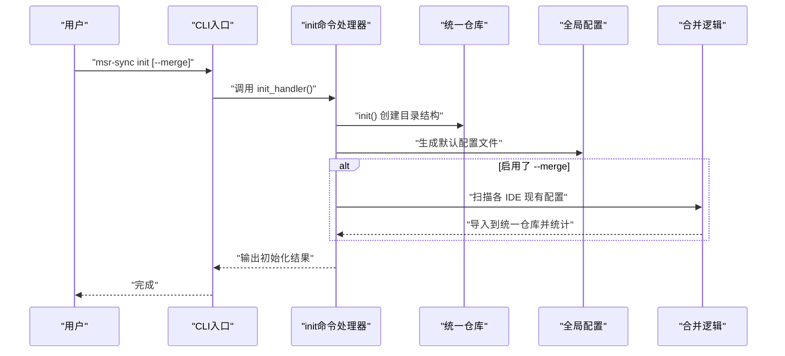
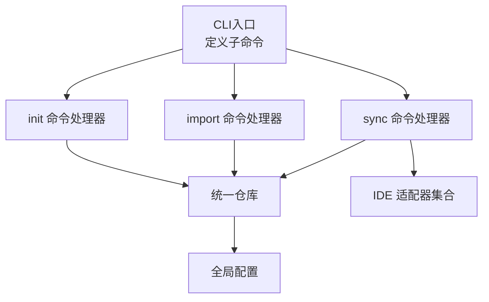

# 快速开始

<cite>
**本文引用的文件**
- [MSR-cli/README.md](file://MSR-cli/README.md)
- [MSR-cli/docs/usage.md](file://MSR-cli/docs/usage.md)
- [MSR-cli/pyproject.toml](file://MSR-cli/pyproject.toml)
- [MSR-cli/msr_sync/cli.py](file://MSR-cli/msr_sync/cli.py)
- [MSR-cli/msr_sync/commands/init_cmd.py](file://MSR-cli/msr_sync/commands/init_cmd.py)
- [MSR-cli/msr_sync/commands/import_cmd.py](file://MSR-cli/msr_sync/commands/import_cmd.py)
- [MSR-cli/msr_sync/commands/sync_cmd.py](file://MSR-cli/msr_sync/commands/sync_cmd.py)
- [MSR-cli/msr_sync/core/config.py](file://MSR-cli/msr_sync/core/config.py)
- [MSR-cli/msr_sync/core/repository.py](file://MSR-cli/msr_sync/core/repository.py)
- [MSR-cli/msr_sync/constants.py](file://MSR-cli/msr_sync/constants.py)
</cite>

## 目录
1. [简介](#简介)
2. [安装](#安装)
3. [快速开始：从零到同步](#快速开始从零到同步)
4. [核心命令详解](#核心命令详解)
5. [配置文件结构与位置](#配置文件结构与位置)
6. [常见使用场景与最佳实践](#常见使用场景与最佳实践)
7. [架构概览](#架构概览)
8. [性能与可靠性考虑](#性能与可靠性考虑)
9. [故障排除](#故障排除)
10. [结语](#结语)

## 简介
MSR-v2（msr-sync）是一个统一管理多款国内 AI IDE（Trae、Qoder、Lingma、CodeBuddy）的规则（rules）、技能（skills）、MCP 配置的命令行工具。它通过“统一仓库”作为配置的单一可信源，实现一次导入、多端同步，并自动处理各 IDE 的格式差异与版本管理。

- 支持平台：macOS、Windows
- Python 版本要求：3.9+
- 安装方式：pip 安装或从源码安装

**章节来源**
- [MSR-cli/README.md:17-21](file://MSR-cli/README.md#L17-L21)
- [MSR-cli/README.md:135-157](file://MSR-cli/README.md#L135-L157)

## 安装
- 通过 pip 安装
  - 命令：pip install msr-sync
- 从源码安装
  - 步骤：克隆仓库 → 进入 MSR-cli 目录 → pip install -e .
- 开发环境安装（含测试依赖）
  - 命令：pip install -e ".[dev]"

**章节来源**
- [MSR-cli/README.md:137-155](file://MSR-cli/README.md#L137-L155)
- [MSR-cli/pyproject.toml:1-37](file://MSR-cli/pyproject.toml#L1-L37)

## 快速开始：从零到同步
下面是最小可行流程，带你从初始化统一仓库，到导入现有配置，再到同步到目标 IDE。

- 步骤 1：初始化统一仓库
  - 命令：msr-sync init
  - 说明：创建 ~/.msr-repos 目录结构，并生成 ~/.msr-sync/config.yaml 默认配置文件
  - 可选：msr-sync init --merge，自动扫描并导入各 IDE 现有配置
- 步骤 2：导入配置
  - 规则（rules）：msr-sync import rules ./my-rule.md
  - 技能（skills）：msr-sync import skills ./my-skill/
  - MCP：msr-sync import mcp ./my-mcp-config/
  - 支持从压缩包或 URL 导入
- 步骤 3：同步到 IDE
  - 全局同步：msr-sync sync
  - 指定类型与 IDE：msr-sync sync --type rules --ide trae
  - 项目级同步：msr-sync sync --scope project --project-dir /path/to/project

提示：首次使用前请确保已初始化仓库，否则会提示“统一仓库未初始化，请先执行 msr-sync init”。

**章节来源**
- [MSR-cli/README.md:159-238](file://MSR-cli/README.md#L159-L238)
- [MSR-cli/docs/usage.md:21-80](file://MSR-cli/docs/usage.md#L21-L80)
- [MSR-cli/docs/usage.md:84-200](file://MSR-cli/docs/usage.md#L84-L200)
- [MSR-cli/docs/usage.md:202-306](file://MSR-cli/docs/usage.md#L202-L306)

## 核心命令详解
本节聚焦三个最常用的命令：init、import、sync，涵盖参数、行为与典型用法。

- msr-sync init
  - 功能：初始化统一仓库，创建 ~/.msr-repos 目录与 RULES/SKILLS/MCP 子目录；生成 ~/.msr-sync/config.yaml 默认配置文件
  - 关键参数：--merge（可选）扫描并导入各 IDE 现有配置
  - 行为要点：
    - 幂等：重复初始化不会重复创建
    - 合并：扫描各 IDE 的 rules/skills/mcp 并导入到统一仓库，输出汇总统计
- msr-sync import
  - 功能：将规则、技能、MCP 配置导入统一仓库
  - 关键参数：config_type（rules/skills/mcp）、source（文件/目录/压缩包/URL）
  - 行为要点：
    - 仓库未初始化时会提示先执行 init
    - 多个配置项时会逐项确认；单个配置项直接导入
    - 同名配置导入时自动创建新版本（V1/V2/V3…）
- msr-sync sync
  - 功能：将统一仓库中的配置同步到目标 IDE
  - 关键参数：--ide（可多次指定）、--scope（global/project）、--project-dir、--type、--name、--version
  - 行为要点：
    - 默认同步最新版本；也可指定具体版本
    - Rules 同步时会剥离原始 frontmatter 并按 IDE 添加特定头部
    - MCP 同步时合并 mcp.json，遇到同名条目会确认覆盖
    - Skills 同步时目标存在则确认覆盖，不存在则直接拷贝

**图表来源**
- [MSR-cli/msr_sync/cli.py:14-24](file://MSR-cli/msr_sync/cli.py#L14-L24)
- [MSR-cli/msr_sync/commands/init_cmd.py:13-42](file://MSR-cli/msr_sync/commands/init_cmd.py#L13-L42)

**章节来源**
- [MSR-cli/msr_sync/cli.py:14-82](file://MSR-cli/msr_sync/cli.py#L14-L82)
- [MSR-cli/msr_sync/commands/init_cmd.py:13-137](file://MSR-cli/msr_sync/commands/init_cmd.py#L13-L137)
- [MSR-cli/msr_sync/commands/import_cmd.py:14-151](file://MSR-cli/msr_sync/commands/import_cmd.py#L14-L151)
- [MSR-cli/msr_sync/commands/sync_cmd.py:26-131](file://MSR-cli/msr_sync/commands/sync_cmd.py#L26-L131)

## 配置文件结构与位置
- 全局配置文件位置：~/.msr-sync/config.yaml
- 自动生成：执行 msr-sync init 时会生成带注释的默认配置文件
- 主要配置项：
  - repo_path：统一仓库根目录路径（支持 ~ 展开，默认 ~/.msr-repos）
  - ignore_patterns：导入扫描时忽略的目录/文件模式（支持精确匹配与通配符）
  - default_ides：默认同步目标 IDE 列表（可选 trae/qoder/lingma/codebuddy/all）
  - default_scope：默认同步层级（global/project）

- 配置校验与回退：
  - default_ides 包含无效值时会忽略并回退到默认值
  - default_scope 非法时回退到 global
  - YAML 语法错误会报错并终止执行
  - 命令行参数优先级高于配置文件

**章节来源**
- [MSR-cli/core/config.py:18-89](file://MSR-cli/msr_sync/core/config.py#L18-L89)
- [MSR-cli/core/config.py:91-127](file://MSR-cli/msr_sync/core/config.py#L91-L127)
- [MSR-cli/core/config.py:140-158](file://MSR-cli/msr_sync/core/config.py#L140-L158)
- [MSR-cli/core/config.py:187-204](file://MSR-cli/msr_sync/core/config.py#L187-L204)
- [MSR-cli/docs/usage.md:397-474](file://MSR-cli/docs/usage.md#L397-L474)

## 常见使用场景与最佳实践
- 从 Trae 迁移到 CodeBuddy
  - 初始化并合并 Trae 配置 → 查看列表 → 同步到 CodeBuddy
- 批量同步到所有 IDE
  - sync 或指定 --type rules
- 项目级同步
  - --scope project，可指定 --project-dir
- 多版本管理
  - 导入新版本自动创建 V2/V3；同步默认最新版本；也可指定 --version
- 从压缩包批量导入共享配置
  - import rules/... https://.../team-rules.zip → sync
- 自定义默认行为
  - 编辑 ~/.msr-sync/config.yaml 设置 default_ides/default_scope，后续命令无需重复指定

最佳实践建议：
- 优先使用 --merge 初始化，快速获得统一仓库的初始状态
- 对于 MCP 配置，确保目录包含 mcp.json，否则同步会被跳过
- 使用 list 查看版本与配置清单，避免误删或误同步
- 在团队内统一导入模板与命名规范，减少歧义

**章节来源**
- [MSR-cli/docs/usage.md:525-631](file://MSR-cli/docs/usage.md#L525-L631)
- [MSR-cli/docs/usage.md:202-306](file://MSR-cli/docs/usage.md#L202-L306)

## 架构概览
MSR-cli 的核心由 CLI、命令处理器、统一仓库与全局配置组成。CLI 定义子命令，命令处理器负责业务逻辑，统一仓库提供 CRUD 与版本管理，全局配置提供用户自定义行为。

**图表来源**
- [MSR-cli/msr_sync/cli.py:8-116](file://MSR-cli/msr_sync/cli.py#L8-L116)
- [MSR-cli/msr_sync/commands/init_cmd.py:13-42](file://MSR-cli/msr_sync/commands/init_cmd.py#L13-L42)
- [MSR-cli/msr_sync/commands/import_cmd.py:14-56](file://MSR-cli/msr_sync/commands/import_cmd.py#L14-L56)
- [MSR-cli/msr_sync/commands/sync_cmd.py:26-83](file://MSR-cli/msr_sync/commands/sync_cmd.py#L26-L83)
- [MSR-cli/msr_sync/core/repository.py:23-71](file://MSR-cli/msr_sync/core/repository.py#L23-L71)
- [MSR-cli/msr_sync/core/config.py:18-89](file://MSR-cli/msr_sync/core/config.py#L18-L89)

## 性能与可靠性考虑
- 导入与同步的 IO 操作
  - import 与 sync 均涉及文件读写与目录遍历，建议在 SSD 上运行以提升速度
- 版本管理
  - 每个配置多版本存储，注意定期清理不再使用的旧版本，避免占用磁盘空间
- 并发与覆盖
  - 同步 MCP 与 Skills 时会进行覆盖确认，避免误覆盖；建议在团队内统一策略
- 平台兼容性
  - 仅支持 macOS 与 Windows；Linux 用户请关注后续支持计划

[本节为通用建议，不直接分析具体文件]

## 故障排除
- 统一仓库未初始化
  - 现象：执行 sync/list/remove/import 时报“统一仓库未初始化”
  - 处理：先执行 msr-sync init
- 未找到指定配置或版本
  - 现象：remove/sync 报“未找到指定的配置版本”
  - 处理：使用 list 查看当前仓库配置与版本，确认名称与版本号
- 导入来源无效或网络错误
  - 现象：import 报“无效的导入来源”或“下载失败”
  - 处理：检查路径/URL 是否正确，网络是否可用
- 压缩包解压失败
  - 现象：import 报“压缩包解压失败”
  - 处理：确认压缩包格式为 zip/tar.gz/tgz，文件未损坏
- MCP 配置格式错误
  - 现象：sync 报“MCP 配置文件格式错误”
  - 处理：检查 mcp.json 是否为合法 JSON，字段是否齐全
- 不支持的操作系统
  - 现象：报“不支持的操作系统”
  - 处理：当前仅支持 macOS/Windows
- 权限不足
  - 现象：报“权限不足，无法写入”
  - 处理：检查目标路径权限
- 全局配置文件 YAML 语法错误
  - 现象：报“配置文件 YAML 语法错误”
  - 处理：修正 YAML 缩进/引号等；或删除后重新 init 生成默认配置
- IDE 名称或 default_scope 无效
  - 现象：出现“无效的 IDE 名称/默认层级”警告
  - 处理：修正配置文件中的值

**章节来源**
- [MSR-cli/docs/usage.md:634-759](file://MSR-cli/docs/usage.md#L634-L759)

## 结语
通过统一仓库与多端同步，MSR-v2 让你在多款 AI IDE 间自由切换的同时，保持配置的一致性与可追溯性。建议结合团队规范与版本管理策略，持续优化导入与同步流程，提升开发效率与协作质量。

[本节为总结性内容，不直接分析具体文件]