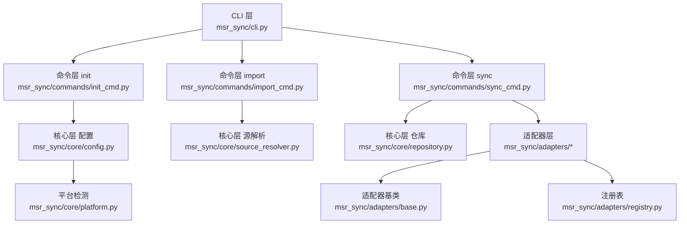
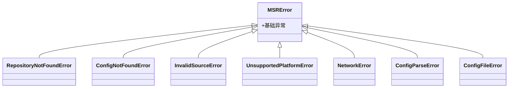
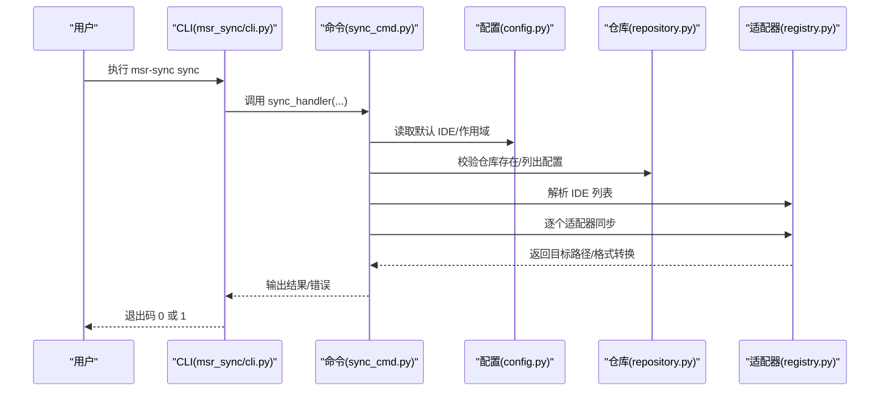
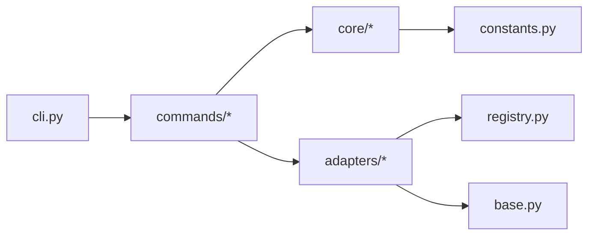

# 故障排除

<cite>
**本文引用的文件**   
- [MSR-cli/msr_sync/cli.py](file://MSR-cli/msr_sync/cli.py)
- [MSR-cli/msr_sync/core/exceptions.py](file://MSR-cli/msr_sync/core/exceptions.py)
- [MSR-cli/msr_sync/core/config.py](file://MSR-cli/msr_sync/core/config.py)
- [MSR-cli/msr_sync/core/platform.py](file://MSR-cli/msr_sync/core/platform.py)
- [MSR-cli/msr_sync/commands/init_cmd.py](file://MSR-cli/msr_sync/commands/init_cmd.py)
- [MSR-cli/msr_sync/commands/import_cmd.py](file://MSR-cli/msr_sync/commands/import_cmd.py)
- [MSR-cli/msr_sync/commands/sync_cmd.py](file://MSR-cli/msr_sync/commands/sync_cmd.py)
- [MSR-cli/msr_sync/constants.py](file://MSR-cli/msr_sync/constants.py)
- [MSR-cli/msr_sync/adapters/base.py](file://MSR-cli/msr_sync/adapters/base.py)
- [MSR-cli/msr_sync/adapters/registry.py](file://MSR-cli/msr_sync/adapters/registry.py)
- [MSR-cli/README.md](file://MSR-cli/README.md)
- [blog-msr-sync.md](file://blog-msr-sync.md)
- [MSR-cli/pyproject.toml](file://MSR-cli/pyproject.toml)
- [MSR-cli/tests/test_exceptions.py](file://MSR-cli/tests/test_exceptions.py)
- [MSR-cli/tests/test_config.py](file://MSR-cli/tests/test_config.py)
</cite>

## 目录
1. [简介](#简介)
2. [项目结构](#项目结构)
3. [核心组件](#核心组件)
4. [架构总览](#架构总览)
5. [详细组件分析](#详细组件分析)
6. [依赖分析](#依赖分析)
7. [性能考虑](#性能考虑)
8. [故障排除指南](#故障排除指南)
9. [结论](#结论)
10. [附录](#附录)

## 简介
本指南面向使用 MSR-v2（msr-sync）的用户，聚焦“安装失败、配置导入错误、同步失败”等常见问题，提供系统化的诊断方法、解决方案与预防建议。同时涵盖性能问题识别与优化、配置冲突检测与解决策略、系统兼容性排查以及用户反馈与社区支持渠道，帮助用户构建自助排障的完整工具箱。

## 项目结构
MSR-cli 采用分层架构：CLI 层负责命令入口与用户交互，Commands 层编排业务流程，Core 层提供配置、异常、平台检测等通用能力，Adapters 层对接不同 IDE 的路径与格式差异。整体结构清晰、职责分离，便于定位问题与快速修复。

图表来源
- [MSR-cli/msr_sync/cli.py:1-116](file://MSR-cli/msr_sync/cli.py#L1-L116)
- [MSR-cli/msr_sync/commands/init_cmd.py:1-137](file://MSR-cli/msr_sync/commands/init_cmd.py#L1-L137)
- [MSR-cli/msr_sync/commands/import_cmd.py:1-151](file://MSR-cli/msr_sync/commands/import_cmd.py#L1-L151)
- [MSR-cli/msr_sync/commands/sync_cmd.py:1-411](file://MSR-cli/msr_sync/commands/sync_cmd.py#L1-L411)
- [MSR-cli/msr_sync/core/config.py:1-204](file://MSR-cli/msr_sync/core/config.py#L1-L204)
- [MSR-cli/msr_sync/core/platform.py:1-60](file://MSR-cli/msr_sync/core/platform.py#L1-L60)
- [MSR-cli/msr_sync/adapters/base.py:1-105](file://MSR-cli/msr_sync/adapters/base.py#L1-L105)
- [MSR-cli/msr_sync/adapters/registry.py:1-88](file://MSR-cli/msr_sync/adapters/registry.py#L1-L88)

章节来源
- [MSR-cli/README.md:1-361](file://MSR-cli/README.md#L1-L361)
- [blog-msr-sync.md:1-421](file://blog-msr-sync.md#L1-L421)

## 核心组件
- CLI 层：定义 init/import/sync/list/remove 等命令，捕获并输出 MSRError 子类异常，统一退出码为 1。
- Commands 层：封装 init/import/sync 的业务逻辑，进行参数解析、调用仓库与适配器、处理用户确认与错误。
- Core 层：提供全局配置加载与校验、平台检测、异常体系、常量定义等。
- Adapters 层：以注册表模式管理各 IDE 适配器，提供路径解析、格式转换、扫描能力。

章节来源
- [MSR-cli/msr_sync/cli.py:1-116](file://MSR-cli/msr_sync/cli.py#L1-L116)
- [MSR-cli/msr_sync/core/exceptions.py:1-34](file://MSR-cli/msr_sync/core/exceptions.py#L1-L34)
- [MSR-cli/msr_sync/core/config.py:1-204](file://MSR-cli/msr_sync/core/config.py#L1-L204)
- [MSR-cli/msr_sync/core/platform.py:1-60](file://MSR-cli/msr_sync/core/platform.py#L1-L60)
- [MSR-cli/msr_sync/adapters/registry.py:1-88](file://MSR-cli/msr_sync/adapters/registry.py#L1-L88)

## 架构总览
MSR-cli 的异常体系与命令处理流程如下：

图表来源
- [MSR-cli/msr_sync/core/exceptions.py:1-34](file://MSR-cli/msr_sync/core/exceptions.py#L1-L34)

命令处理流程（以 sync 为例）：

图表来源
- [MSR-cli/msr_sync/cli.py:58-82](file://MSR-cli/msr_sync/cli.py#L58-L82)
- [MSR-cli/msr_sync/commands/sync_cmd.py:26-131](file://MSR-cli/msr_sync/commands/sync_cmd.py#L26-L131)
- [MSR-cli/msr_sync/core/config.py:140-158](file://MSR-cli/msr_sync/core/config.py#L140-L158)
- [MSR-cli/msr_sync/adapters/registry.py:74-87](file://MSR-cli/msr_sync/adapters/registry.py#L74-L87)

## 详细组件分析

### CLI 异常与退出码
- CLI 对 MSRError 进行捕获并打印中文错误信息，随后以系统退出码 1 退出，便于自动化脚本判断失败。
- 建议：在脚本中检查退出码，结合输出信息定位问题。

章节来源
- [MSR-cli/msr_sync/cli.py:20-24](file://MSR-cli/msr_sync/cli.py#L20-L24)
- [MSR-cli/msr_sync/cli.py:34-38](file://MSR-cli/msr_sync/cli.py#L34-L38)
- [MSR-cli/msr_sync/cli.py:71-82](file://MSR-cli/msr_sync/cli.py#L71-L82)
- [MSR-cli/msr_sync/cli.py:96-100](file://MSR-cli/msr_sync/cli.py#L96-L100)
- [MSR-cli/msr_sync/cli.py:111-115](file://MSR-cli/msr_sync/cli.py#L111-L115)

### 全局配置加载与校验
- 支持默认配置文件不存在、空文件、YAML 语法错误等场景，自动回退到默认值并给出提示。
- default_ides 与 default_scope 无效时会回退默认值并发出警告。
- 建议：修改配置后重新执行命令以生效；命令行参数优先级高于配置文件。

章节来源
- [MSR-cli/msr_sync/core/config.py:91-127](file://MSR-cli/msr_sync/core/config.py#L91-L127)
- [MSR-cli/msr_sync/core/config.py:56-79](file://MSR-cli/msr_sync/core/config.py#L56-L79)
- [MSR-cli/tests/test_config.py:40-68](file://MSR-cli/tests/test_config.py#L40-L68)
- [MSR-cli/tests/test_config.py:109-123](file://MSR-cli/tests/test_config.py#L109-L123)
- [MSR-cli/tests/test_config.py:125-131](file://MSR-cli/tests/test_config.py#L125-L131)

### 平台检测与路径解析
- 自动识别 macOS 与 Windows，提供应用数据目录路径，不支持的系统抛出 UnsupportedPlatformError。
- 建议：在非支持平台使用时提前确认路径规范，必要时通过适配器扩展支持。

章节来源
- [MSR-cli/msr_sync/core/platform.py:9-60](file://MSR-cli/msr_sync/core/platform.py#L9-L60)
- [MSR-cli/msr_sync/core/exceptions.py:20-22](file://MSR-cli/msr_sync/core/exceptions.py#L20-L22)

### 适配器注册与 IDE 能力
- 通过注册表延迟加载适配器类，支持 qoder、lingma、trae、codebuddy。
- BaseAdapter 定义路径解析、格式转换、能力查询与扫描接口；默认不支持全局 rules，CodeBuddy 特殊支持。
- 建议：在同步规则时注意 IDE 能力限制，必要时调整 scope 或 IDE 列表。

章节来源
- [MSR-cli/msr_sync/adapters/registry.py:1-88](file://MSR-cli/msr_sync/adapters/registry.py#L1-L88)
- [MSR-cli/msr_sync/adapters/base.py:1-105](file://MSR-cli/msr_sync/adapters/base.py#L1-L105)

### 命令层：init/import/sync
- init：创建仓库与默认配置文件；合并模式扫描各 IDE 配置并导入，逐项输出跳过与错误信息。
- import：解析来源（文件/目录/压缩包/URL），支持批量确认；仓库未初始化时提示先 init。
- sync：按 IDE、scope、type、name、version 精确控制；Rules 剥离原始 frontmatter 后按 IDE 头部格式写入；MCP 采用 JSON 合并策略并重写 cwd；Skills 目录拷贝并处理覆盖确认。

章节来源
- [MSR-cli/msr_sync/commands/init_cmd.py:13-42](file://MSR-cli/msr_sync/commands/init_cmd.py#L13-L42)
- [MSR-cli/msr_sync/commands/init_cmd.py:44-137](file://MSR-cli/msr_sync/commands/init_cmd.py#L44-L137)
- [MSR-cli/msr_sync/commands/import_cmd.py:14-56](file://MSR-cli/msr_sync/commands/import_cmd.py#L14-L56)
- [MSR-cli/msr_sync/commands/import_cmd.py:58-90](file://MSR-cli/msr_sync/commands/import_cmd.py#L58-L90)
- [MSR-cli/msr_sync/commands/import_cmd.py:92-114](file://MSR-cli/msr_sync/commands/import_cmd.py#L92-L114)
- [MSR-cli/msr_sync/commands/import_cmd.py:117-151](file://MSR-cli/msr_sync/commands/import_cmd.py#L117-L151)
- [MSR-cli/msr_sync/commands/sync_cmd.py:26-131](file://MSR-cli/msr_sync/commands/sync_cmd.py#L26-L131)
- [MSR-cli/msr_sync/commands/sync_cmd.py:179-231](file://MSR-cli/msr_sync/commands/sync_cmd.py#L179-L231)
- [MSR-cli/msr_sync/commands/sync_cmd.py:238-350](file://MSR-cli/msr_sync/commands/sync_cmd.py#L238-L350)
- [MSR-cli/msr_sync/commands/sync_cmd.py:357-411](file://MSR-cli/msr_sync/commands/sync_cmd.py#L357-L411)

## 依赖分析
- CLI 依赖 Core 异常与 Commands；Commands 依赖 Core 配置、仓库与适配器；适配器依赖注册表与基类。
- 依赖关系清晰，耦合度低，便于单独定位与修复问题。

图表来源
- [MSR-cli/msr_sync/cli.py:1-116](file://MSR-cli/msr_sync/cli.py#L1-L116)
- [MSR-cli/msr_sync/commands/sync_cmd.py:1-411](file://MSR-cli/msr_sync/commands/sync_cmd.py#L1-L411)
- [MSR-cli/msr_sync/adapters/registry.py:1-88](file://MSR-cli/msr_sync/adapters/registry.py#L1-L88)
- [MSR-cli/msr_sync/adapters/base.py:1-105](file://MSR-cli/msr_sync/adapters/base.py#L1-L105)
- [MSR-cli/msr_sync/constants.py:1-50](file://MSR-cli/msr_sync/constants.py#L1-L50)

## 性能考虑
- 导入与同步涉及文件系统读写、JSON 解析与目录拷贝，建议：
  - 控制导入规模：分批导入，避免一次性导入大量压缩包。
  - 合理使用 ignore_patterns：减少扫描与导入耗时。
  - 使用项目级同步时明确 project_dir，避免不必要的全局扫描。
  - 关注 MCP cwd 重写与合并策略，避免重复合并导致的多次写入。
- 监控指标建议：导入/同步耗时、磁盘 IO、进程内存峰值；可在 CI/CD 中记录日志并对比基准。

## 故障排除指南

### 一、安装与运行环境问题
- 症状
  - 安装失败或命令不可用
  - 运行时报“不支持的操作系统”
- 诊断步骤
  - 确认 Python 版本满足要求（3.9+）
  - 确认通过 pip 安装或源码安装成功
  - 确认命令入口已注册（脚本入口）
- 解决方案
  - 使用 pip 安装或源码安装开发版
  - 在受支持平台（macOS/Windows）运行
  - 如需扩展支持其他平台，参考平台检测模块扩展路径解析
- 相关异常
  - UnsupportedPlatformError：不支持的操作系统
- 参考
  - [MSR-cli/pyproject.toml:15-21](file://MSR-cli/pyproject.toml#L15-L21)
  - [MSR-cli/README.md:135-158](file://MSR-cli/README.md#L135-L158)
  - [MSR-cli/msr_sync/core/platform.py:22-30](file://MSR-cli/msr_sync/core/platform.py#L22-L30)

章节来源
- [MSR-cli/pyproject.toml:15-21](file://MSR-cli/pyproject.toml#L15-L21)
- [MSR-cli/README.md:135-158](file://MSR-cli/README.md#L135-L158)
- [MSR-cli/msr_sync/core/platform.py:22-30](file://MSR-cli/msr_sync/core/platform.py#L22-L30)

### 二、初始化与仓库问题
- 症状
  - 执行 init 后未生成配置文件
  - 执行 import/sync 提示“统一仓库未初始化”
- 诊断步骤
  - 检查默认仓库路径是否存在
  - 检查默认配置文件是否生成
  - 检查合并模式扫描是否报错
- 解决方案
  - 手动执行 init，确保生成默认配置文件
  - 若仓库已存在但未初始化，重复执行 init（幂等）
  - 合并模式扫描失败时逐个 IDE 检查权限与路径
- 相关异常
  - RepositoryNotFoundError：仓库未初始化
- 参考
  - [MSR-cli/msr_sync/commands/init_cmd.py:13-42](file://MSR-cli/msr_sync/commands/init_cmd.py#L13-L42)
  - [MSR-cli/msr_sync/commands/import_cmd.py:31-34](file://MSR-cli/msr_sync/commands/import_cmd.py#L31-L34)
  - [MSR-cli/msr_sync/commands/sync_cmd.py:51-54](file://MSR-cli/msr_sync/commands/sync_cmd.py#L51-L54)

章节来源
- [MSR-cli/msr_sync/commands/init_cmd.py:13-42](file://MSR-cli/msr_sync/commands/init_cmd.py#L13-L42)
- [MSR-cli/msr_sync/commands/import_cmd.py:31-34](file://MSR-cli/msr_sync/commands/import_cmd.py#L31-L34)
- [MSR-cli/msr_sync/commands/sync_cmd.py:51-54](file://MSR-cli/msr_sync/commands/sync_cmd.py#L51-L54)

### 三、配置导入错误
- 症状
  - 导入来源无效或网络错误
  - YAML 配置文件解析失败
  - 导入后未出现预期配置项
- 诊断步骤
  - 检查导入来源类型与格式（单文件/目录/压缩包/URL）
  - 检查 URL 是否可访问、是否为压缩包链接
  - 检查配置文件 YAML 语法与注释
- 解决方案
  - 使用支持的来源格式；URL 自动转换为 raw 链接
  - 修正 YAML 语法错误；保留注释不影响解析
  - 分批导入并逐一确认；检查 ignore_patterns 是否误过滤
- 相关异常
  - InvalidSourceError：无效的导入来源
  - NetworkError：网络错误
  - ConfigFileError：配置文件解析错误（YAML 语法错误等）
- 参考
  - [MSR-cli/README.md:23-58](file://MSR-cli/README.md#L23-L58)
  - [MSR-cli/msr_sync/commands/import_cmd.py:38-45](file://MSR-cli/msr_sync/commands/import_cmd.py#L38-L45)
  - [MSR-cli/msr_sync/core/config.py:113-117](file://MSR-cli/msr_sync/core/config.py#L113-L117)
  - [MSR-cli/tests/test_config.py:70-79](file://MSR-cli/tests/test_config.py#L70-L79)

章节来源
- [MSR-cli/README.md:23-58](file://MSR-cli/README.md#L23-L58)
- [MSR-cli/msr_sync/commands/import_cmd.py:38-45](file://MSR-cli/msr_sync/commands/import_cmd.py#L38-L45)
- [MSR-cli/msr_sync/core/config.py:113-117](file://MSR-cli/msr_sync/core/config.py#L113-L117)
- [MSR-cli/tests/test_config.py:70-79](file://MSR-cli/tests/test_config.py#L70-L79)

### 四、同步失败与格式问题
- 症状
  - 同步到某 IDE 失败或未生效
  - Rules 未按 IDE 要求添加头部
  - MCP 配置未合并或覆盖冲突
  - Skills 目录未覆盖或未创建
- 诊断步骤
  - 检查 IDE 能力：是否支持全局 rules
  - 检查 MCP 配置文件是否存在与格式正确
  - 检查目标路径权限与父目录创建
  - 检查版本选择与最新版本解析
- 解决方案
  - 对不支持全局 rules 的 IDE，改为项目级同步或更换 IDE
  - 确保 MCP 包含 mcp.json 且包含 mcpServers 字段
  - 使用覆盖确认功能处理同名 MCP 条目
  - 明确指定版本或回滚到历史版本
- 相关异常
  - ConfigNotFoundError：配置未找到
  - ConfigParseError：配置解析错误（JSON/YAML）
- 参考
  - [MSR-cli/msr_sync/commands/sync_cmd.py:204-207](file://MSR-cli/msr_sync/commands/sync_cmd.py#L204-L207)
  - [MSR-cli/msr_sync/commands/sync_cmd.py:268-276](file://MSR-cli/msr_sync/commands/sync_cmd.py#L268-L276)
  - [MSR-cli/msr_sync/commands/sync_cmd.py:324-339](file://MSR-cli/msr_sync/commands/sync_cmd.py#L324-L339)
  - [MSR-cli/msr_sync/commands/sync_cmd.py:388-402](file://MSR-cli/msr_sync/commands/sync_cmd.py#L388-L402)

章节来源
- [MSR-cli/msr_sync/commands/sync_cmd.py:204-207](file://MSR-cli/msr_sync/commands/sync_cmd.py#L204-L207)
- [MSR-cli/msr_sync/commands/sync_cmd.py:268-276](file://MSR-cli/msr_sync/commands/sync_cmd.py#L268-L276)
- [MSR-cli/msr_sync/commands/sync_cmd.py:324-339](file://MSR-cli/msr_sync/commands/sync_cmd.py#L324-L339)
- [MSR-cli/msr_sync/commands/sync_cmd.py:388-402](file://MSR-cli/msr_sync/commands/sync_cmd.py#L388-L402)

### 五、配置冲突与版本管理
- 症状
  - 同名 MCP 条目冲突
  - 同名 Rules/Skills 覆盖确认弹窗频繁
  - 版本号解析异常或未按预期同步
- 诊断步骤
  - 检查 MCP 合并策略与同名条目
  - 检查版本命名与最新版本解析
  - 检查仓库中是否存在非法版本号
- 解决方案
  - 使用覆盖确认功能谨慎处理 MCP 冲突
  - 明确指定版本或回滚到历史版本
  - 清理不需要的历史版本释放空间
- 参考
  - [MSR-cli/README.md:275-295](file://MSR-cli/README.md#L275-L295)
  - [MSR-cli/msr_sync/commands/sync_cmd.py:160-163](file://MSR-cli/msr_sync/commands/sync_cmd.py#L160-L163)
  - [MSR-cli/msr_sync/commands/sync_cmd.py:324-339](file://MSR-cli/msr_sync/commands/sync_cmd.py#L324-L339)

章节来源
- [MSR-cli/README.md:275-295](file://MSR-cli/README.md#L275-L295)
- [MSR-cli/msr_sync/commands/sync_cmd.py:160-163](file://MSR-cli/msr_sync/commands/sync_cmd.py#L160-L163)
- [MSR-cli/msr_sync/commands/sync_cmd.py:324-339](file://MSR-cli/msr_sync/commands/sync_cmd.py#L324-L339)

### 六、系统兼容性问题
- 症状
  - 路径解析异常或权限不足
  - 不同平台路径差异导致找不到 IDE 配置
- 诊断步骤
  - 检查平台检测结果与应用数据目录
  - 检查 IDE 配置目录是否存在与权限
- 解决方案
  - 在受支持平台使用；必要时扩展平台检测与路径解析
  - 手动确认 IDE 配置目录路径并赋予读写权限
- 参考
  - [MSR-cli/msr_sync/core/platform.py:54-59](file://MSR-cli/msr_sync/core/platform.py#L54-L59)
  - [MSR-cli/README.md:128-133](file://MSR-cli/README.md#L128-L133)

章节来源
- [MSR-cli/msr_sync/core/platform.py:54-59](file://MSR-cli/msr_sync/core/platform.py#L54-L59)
- [MSR-cli/README.md:128-133](file://MSR-cli/README.md#L128-L133)

### 七、日志分析与调试技巧
- 日志输出
  - CLI 层统一捕获 MSRError 并输出中文错误信息
  - Commands 层在扫描、导入、同步过程中输出进度与跳过项
- 调试建议
  - 使用最小化命令复现问题（如仅 sync 一条配置）
  - 检查仓库与配置文件路径与权限
  - 对网络导入问题，先验证 URL 可达性
- 参考
  - [MSR-cli/msr_sync/cli.py:20-24](file://MSR-cli/msr_sync/cli.py#L20-L24)
  - [MSR-cli/msr_sync/commands/init_cmd.py:50-64](file://MSR-cli/msr_sync/commands/init_cmd.py#L50-L64)
  - [MSR-cli/msr_sync/commands/import_cmd.py:73-87](file://MSR-cli/msr_sync/commands/import_cmd.py#L73-L87)

章节来源
- [MSR-cli/msr_sync/cli.py:20-24](file://MSR-cli/msr_sync/cli.py#L20-L24)
- [MSR-cli/msr_sync/commands/init_cmd.py:50-64](file://MSR-cli/msr_sync/commands/init_cmd.py#L50-L64)
- [MSR-cli/msr_sync/commands/import_cmd.py:73-87](file://MSR-cli/msr_sync/commands/import_cmd.py#L73-L87)

## 结论
MSR-v2 的异常体系与命令层设计使得问题定位与修复更加直观：CLI 层统一捕获并输出错误，Commands 层在关键节点提供详细提示。通过遵循本文的诊断流程与解决方案，大多数安装、导入与同步问题均可快速解决。对于性能与兼容性问题，建议结合日志与最小化复现逐步排查。

## 附录

### A. 常见错误与处理对照
- 安装失败
  - 症状：命令不可用、依赖缺失
  - 处理：确认 Python 版本与依赖安装
- 配置导入错误
  - 症状：来源无效、网络错误、YAML 语法错误
  - 处理：修正来源与网络、修复 YAML
- 同步失败
  - 症状：IDE 不支持全局 rules、MCP 缺少 mcp.json、权限不足
  - 处理：调整 scope/IDE、确保 MCP 结构正确、赋予权限
- 配置冲突
  - 症状：MCP 同名条目冲突、覆盖确认频繁
  - 处理：使用确认功能或清理冗余条目
- 兼容性问题
  - 症状：路径解析异常、平台不支持
  - 处理：在受支持平台使用或扩展平台支持

### B. 社区支持与反馈渠道
- 项目主页与安装说明：[MSR-cli 说明:1-361](file://MSR-cli/README.md#L1-L361)
- 更多使用与实战场景：[博客文章:1-421](file://blog-msr-sync.md#L1-L421)