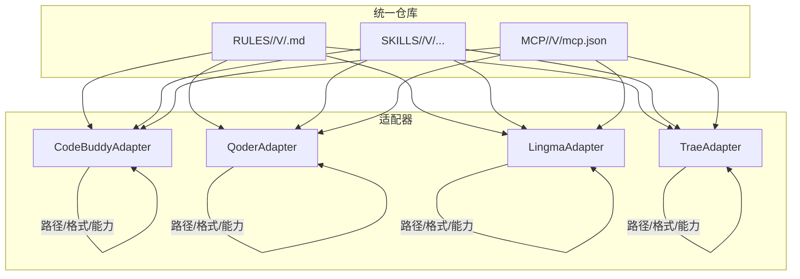
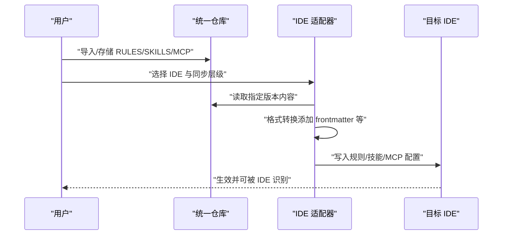
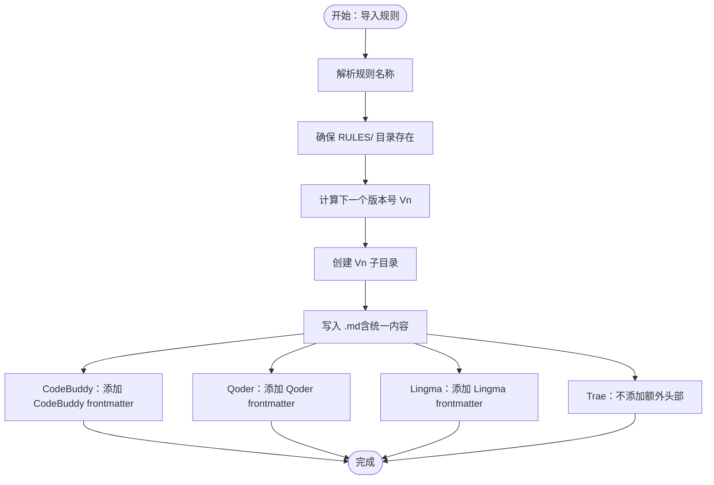
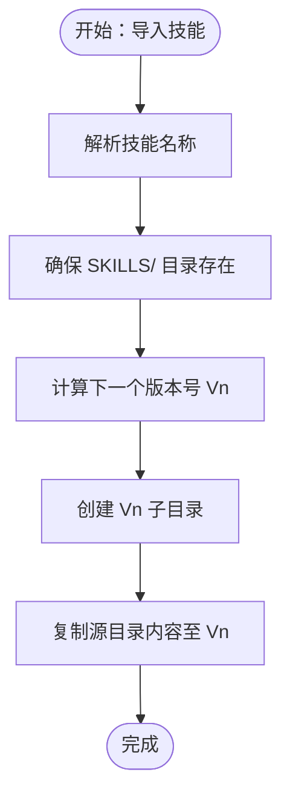
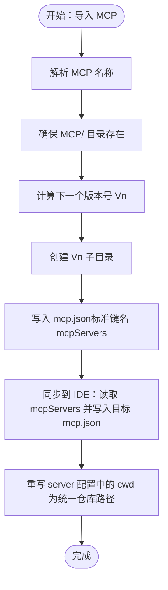
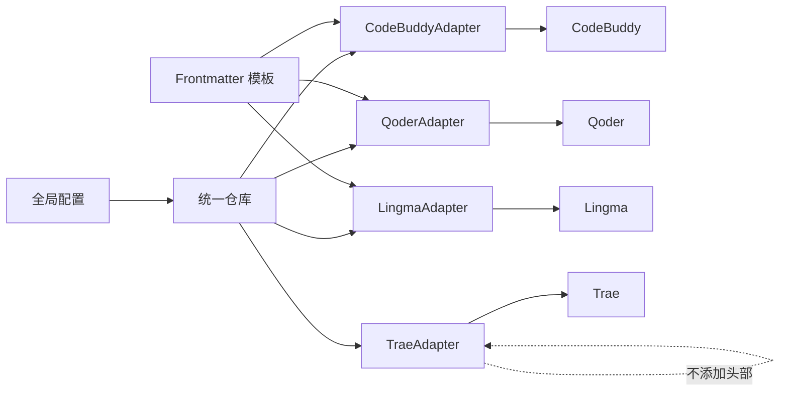

# AI IDE配置类型

<cite>
**本文引用的文件**
- [MSR-cli/msr_sync/core/config.py](file://MSR-cli/msr_sync/core/config.py)
- [MSR-cli/msr_sync/core/frontmatter.py](file://MSR-cli/msr_sync/core/frontmatter.py)
- [MSR-cli/msr_sync/core/repository.py](file://MSR-cli/msr_sync/core/repository.py)
- [MSR-cli/msr_sync/adapters/base.py](file://MSR-cli/msr_sync/adapters/base.py)
- [MSR-cli/msr_sync/adapters/codebuddy.py](file://MSR-cli/msr_sync/adapters/codebuddy.py)
- [MSR-cli/msr_sync/adapters/qoder.py](file://MSR-cli/msr_sync/adapters/qoder.py)
- [MSR-cli/msr_sync/adapters/lingma.py](file://MSR-cli/msr_sync/adapters/lingma.py)
- [MSR-cli/msr_sync/adapters/trae.py](file://MSR-cli/msr_sync/adapters/trae.py)
- [.kiro/specs/mcp-sync-fix/bugfix.md](file://.kiro/specs/mcp-sync-fix/bugfix.md)
- [.kiro/specs/mcp-sync-fix/tasks.md](file://.kiro/specs/mcp-sync-fix/tasks.md)
- [.kiro/specs/mcp-sync-fix/design.md](file://.kiro/specs/mcp-sync-fix/design.md)
- [MSR-cli/tests/test_mcp_merge.py](file://MSR-cli/tests/test_mcp_merge.py)
- [MSR-cli/tests/test_bug_condition_mcp.py](file://MSR-cli/tests/test_bug_condition_mcp.py)
</cite>

## 目录
1. [简介](#简介)
2. [项目结构](#项目结构)
3. [核心组件](#核心组件)
4. [架构总览](#架构总览)
5. [详细组件分析](#详细组件分析)
6. [依赖关系分析](#依赖关系分析)
7. [性能考虑](#性能考虑)
8. [故障排查指南](#故障排查指南)
9. [结论](#结论)
10. [附录](#附录)

## 简介
本文件系统性阐述统一仓库中 AI IDE 配置的三大类型：Rules、Skills、MCP。围绕其含义、作用范围、命名规范、版本管理、存储结构、相互关系与依赖、最佳实践与选择指南进行全面说明，并结合代码库中的适配器实现与 MCP 同步修复规范，给出可操作的组织与管理建议。

## 项目结构
本项目通过“统一仓库”集中管理多 IDE 的配置，采用“按类型分目录”的组织方式：
- RULES：规则类配置，按名称分目录，版本号递增
- SKILLS：技能类配置，按名称分目录，版本号递增
- MCP：模型控制平面（MCP）配置，按名称分目录，版本号递增

同时，针对不同 IDE（CodeBuddy、Qoder、Lingma、Trae）提供适配器，负责：
- 路径解析：确定各 IDE 中规则、技能、MCP 的存储位置
- 格式转换：将统一仓库中的内容转换为 IDE 特定格式（含 frontmatter）
- 能力查询：是否支持全局级规则
- 配置扫描：用于初始化合并（init --merge）

**图表来源**
- [MSR-cli/msr_sync/core/repository.py:89-121](file://MSR-cli/msr_sync/core/repository.py#L89-L121)
- [MSR-cli/msr_sync/adapters/base.py:25-104](file://MSR-cli/msr_sync/adapters/base.py#L25-L104)
- [MSR-cli/msr_sync/adapters/codebuddy.py:31-78](file://MSR-cli/msr_sync/adapters/codebuddy.py#L31-L78)
- [MSR-cli/msr_sync/adapters/qoder.py:31-80](file://MSR-cli/msr_sync/adapters/qoder.py#L31-L80)
- [MSR-cli/msr_sync/adapters/lingma.py:31-80](file://MSR-cli/msr_sync/adapters/lingma.py#L31-L80)
- [MSR-cli/msr_sync/adapters/trae.py:30-81](file://MSR-cli/msr_sync/adapters/trae.py#L30-L81)

**章节来源**
- [MSR-cli/msr_sync/core/repository.py:89-121](file://MSR-cli/msr_sync/core/repository.py#L89-L121)
- [MSR-cli/msr_sync/adapters/base.py:18-104](file://MSR-cli/msr_sync/adapters/base.py#L18-L104)

## 核心组件
- 统一仓库管理器：负责 RULES、SKILLS、MCP 的存储与版本管理，提供按类型与名称的目录结构与版本号递增策略。
- IDE 适配器：为不同 IDE 提供统一接口，包括路径解析、格式转换、能力查询与配置扫描。
- Frontmatter 模板：为 CodeBuddy、Qoder、Lingma 提供特定 frontmatter 模板，保证 IDE 识别与启用。
- 全局配置：管理统一仓库根路径、忽略模式、默认 IDE 与默认同步层级。

**章节来源**
- [MSR-cli/msr_sync/core/repository.py:89-121](file://MSR-cli/msr_sync/core/repository.py#L89-L121)
- [MSR-cli/msr_sync/adapters/base.py:18-104](file://MSR-cli/msr_sync/adapters/base.py#L18-L104)
- [MSR-cli/msr_sync/core/frontmatter.py:110-144](file://MSR-cli/msr_sync/core/frontmatter.py#L110-L144)
- [MSR-cli/msr_sync/core/config.py:18-88](file://MSR-cli/msr_sync/core/config.py#L18-L88)

## 架构总览
统一仓库作为配置中心，适配器根据 IDE 差异决定：
- 存储路径（项目级 vs 全局级）
- 是否支持全局规则
- MCP 配置文件位置
- 规则内容的 frontmatter 包装

**图表来源**
- [MSR-cli/msr_sync/adapters/base.py:25-104](file://MSR-cli/msr_sync/adapters/base.py#L25-L104)
- [MSR-cli/msr_sync/core/frontmatter.py:110-144](file://MSR-cli/msr_sync/core/frontmatter.py#L110-L144)
- [MSR-cli/msr_sync/core/repository.py:89-121](file://MSR-cli/msr_sync/core/repository.py#L89-L121)

## 详细组件分析

### Rules（规则）配置
- 含义与作用：定义 AI IDE 的触发条件、启用状态、描述等元信息，通常以 Markdown + frontmatter 形式存在。
- 存储结构：统一仓库中 RULES/<name>/V<n>/<name>.md；名称与版本号均为字符串，版本号按 V1/V2 递增。
- 命名规范：名称建议使用语义清晰的英文标识，避免特殊字符；同一规则在不同 IDE 下可共享同一名称，但内容可能因 frontmatter 而异。
- 版本管理：每次新增版本时，自动在对应名称目录下创建新版本子目录并写入文件。
- 作用范围：CodeBuddy 支持全局级规则；Qoder、Lingma、Trae 仅支持项目级规则。
- 适配器差异：不同 IDE 的规则内容需要添加各自的 frontmatter 模板；Trae 不添加额外头部，直接使用纯内容。

**图表来源**
- [MSR-cli/msr_sync/core/repository.py:89-112](file://MSR-cli/msr_sync/core/repository.py#L89-L112)
- [MSR-cli/msr_sync/core/frontmatter.py:110-144](file://MSR-cli/msr_sync/core/frontmatter.py#L110-L144)
- [MSR-cli/msr_sync/adapters/codebuddy.py:82-100](file://MSR-cli/msr_sync/adapters/codebuddy.py#L82-L100)
- [MSR-cli/msr_sync/adapters/qoder.py:84-98](file://MSR-cli/msr_sync/adapters/qoder.py#L84-L98)
- [MSR-cli/msr_sync/adapters/lingma.py:84-98](file://MSR-cli/msr_sync/adapters/lingma.py#L84-L98)
- [MSR-cli/msr_sync/adapters/trae.py:85-96](file://MSR-cli/msr_sync/adapters/trae.py#L85-L96)

**章节来源**
- [MSR-cli/msr_sync/core/repository.py:89-112](file://MSR-cli/msr_sync/core/repository.py#L89-L112)
- [MSR-cli/msr_sync/adapters/codebuddy.py:31-49](file://MSR-cli/msr_sync/adapters/codebuddy.py#L31-L49)
- [MSR-cli/msr_sync/adapters/qoder.py:31-50](file://MSR-cli/msr_sync/adapters/qoder.py#L31-L50)
- [MSR-cli/msr_sync/adapters/lingma.py:31-50](file://MSR-cli/msr_sync/adapters/lingma.py#L31-L50)
- [MSR-cli/msr_sync/adapters/trae.py:30-49](file://MSR-cli/msr_sync/adapters/trae.py#L30-L49)
- [MSR-cli/msr_sync/core/frontmatter.py:110-144](file://MSR-cli/msr_sync/core/frontmatter.py#L110-L144)

### Skills（技能）配置
- 含义与作用：封装一组规则、脚本或资源，形成可复用的技能包，IDE 侧按目录结构读取。
- 存储结构：统一仓库中 SKILLS/<name>/V<n>/...（目录内包含技能所需的所有文件与子目录）。
- 命名规范：名称建议与业务域相关，避免与规则名称冲突；版本号同样按 V1/V2 递增。
- 版本管理：复制源目录至新版本子目录，保持相对路径与资源完整性。
- 作用范围：CodeBuddy、Qoder、Lingma、Trae 均支持项目级与用户级（部分 IDE）技能目录。

**图表来源**
- [MSR-cli/msr_sync/core/repository.py:114-121](file://MSR-cli/msr_sync/core/repository.py#L114-L121)

**章节来源**
- [MSR-cli/msr_sync/core/repository.py:114-121](file://MSR-cli/msr_sync/core/repository.py#L114-L121)

### MCP（模型控制平面）配置
- 含义与作用：定义 MCP 服务器的清单（如命令、参数、工作目录等），用于 IDE 启动或连接 MCP 服务。
- 存储结构：统一仓库中 MCP/<name>/V<n>/mcp.json；标准键名为 mcpServers，包含多个 server 条目。
- 命名规范：名称建议与服务域相关；版本号按 V1/V2 递增。
- 版本管理：每次新增版本时，创建新版本子目录并写入 mcp.json。
- 同步修复要点：源配置使用 mcpServers 键名；合并时需读取并写入该键名；若 server 配置包含 cwd 字段，需重写为统一仓库中的实际路径。
- 适配器差异：各 IDE 的 MCP 文件路径不同，适配器负责定位目标 IDE 的 mcp.json。

**图表来源**
- [MSR-cli/msr_sync/core/repository.py:89-112](file://MSR-cli/msr_sync/core/repository.py#L89-L112)
- [.kiro/specs/mcp-sync-fix/bugfix.md:7-18](file://.kiro/specs/mcp-sync-fix/bugfix.md#L7-L18)
- [.kiro/specs/mcp-sync-fix/tasks.md:44-71](file://.kiro/specs/mcp-sync-fix/tasks.md#L44-L71)
- [.kiro/specs/mcp-sync-fix/design.md:71-79](file://.kiro/specs/mcp-sync-fix/design.md#L71-L79)

**章节来源**
- [MSR-cli/msr_sync/core/repository.py:89-112](file://MSR-cli/msr_sync/core/repository.py#L89-L112)
- [.kiro/specs/mcp-sync-fix/bugfix.md:7-18](file://.kiro/specs/mcp-sync-fix/bugfix.md#L7-L18)
- [.kiro/specs/mcp-sync-fix/tasks.md:44-71](file://.kiro/specs/mcp-sync-fix/tasks.md#L44-L71)
- [.kiro/specs/mcp-sync-fix/design.md:71-79](file://.kiro/specs/mcp-sync-fix/design.md#L71-L79)

## 依赖关系分析
- 统一仓库与适配器：统一仓库提供内容与版本号；适配器负责路径解析与格式转换。
- 适配器与 IDE：适配器将转换后的内容写入 IDE 的规则、技能、MCP 文件。
- Frontmatter 模块：为 CodeBuddy、Qoder、Lingma 提供 frontmatter 模板，Trae 不添加头部。
- 全局配置：影响统一仓库根路径与默认同步层级，间接影响适配器的路径解析。

**图表来源**
- [MSR-cli/msr_sync/core/config.py:18-88](file://MSR-cli/msr_sync/core/config.py#L18-L88)
- [MSR-cli/msr_sync/core/repository.py:89-121](file://MSR-cli/msr_sync/core/repository.py#L89-L121)
- [MSR-cli/msr_sync/adapters/base.py:25-104](file://MSR-cli/msr_sync/adapters/base.py#L25-L104)
- [MSR-cli/msr_sync/core/frontmatter.py:110-144](file://MSR-cli/msr_sync/core/frontmatter.py#L110-L144)

**章节来源**
- [MSR-cli/msr_sync/core/config.py:18-88](file://MSR-cli/msr_sync/core/config.py#L18-L88)
- [MSR-cli/msr_sync/adapters/base.py:18-104](file://MSR-cli/msr_sync/adapters/base.py#L18-L104)

## 性能考虑
- 存储与版本：统一仓库按名称与版本号组织，便于增量更新与回滚；避免频繁大文件复制，建议复用稳定资源。
- 同步路径：适配器按 IDE 平台解析路径，尽量减少跨盘符或网络路径的 IO。
- MCP 合并：合并时仅处理新增 server 条目，避免重复写入；对 cwd 的重写应一次性完成，减少多次 IO。
- 前端渲染：Rules 的 frontmatter 仅做简单拼接，开销极低；Skills 为目录复制，注意磁盘空间与权限。

## 故障排查指南
- MCP 键名不匹配：若源配置使用标准 mcpServers 键名，但读取/写入仍使用 servers，会导致无法读取或生成非标准配置。请确认读取与写入键名一致，并在同步前重写 cwd。
- MCP 合并测试：可通过现有测试用例验证合并行为与保留策略，确保无回归。
- Bug 条件探索：编写针对性测试以暴露键名与 cwd 问题，验证修复后行为符合预期。

**章节来源**
- [.kiro/specs/mcp-sync-fix/bugfix.md:7-18](file://.kiro/specs/mcp-sync-fix/bugfix.md#L7-L18)
- [.kiro/specs/mcp-sync-fix/tasks.md:14-18](file://.kiro/specs/mcp-sync-fix/tasks.md#L14-L18)
- [.kiro/specs/mcp-sync-fix/tasks.md:73-77](file://.kiro/specs/mcp-sync-fix/tasks.md#L73-L77)
- [MSR-cli/tests/test_mcp_merge.py](file://MSR-cli/tests/test_mcp_merge.py)
- [MSR-cli/tests/test_bug_condition_mcp.py:63-73](file://MSR-cli/tests/test_bug_condition_mcp.py#L63-L73)

## 结论
Rules、Skills、MCP 三类配置在统一仓库中以清晰的目录与版本结构组织，通过适配器实现跨 IDE 的路径解析与格式转换。MCP 同步修复明确了标准键名与 cwd 重写的必要性。遵循本文的命名规范、版本管理与最佳实践，可在统一仓库中高效管理多 IDE 配置，并降低迁移与维护成本。

## 附录

### 配置类型对比与选择指南
- Rules：适用于通用规则模板，CodeBuddy 支持全局级，其他 IDE 仅支持项目级。优先用于跨 IDE 的通用规则。
- Skills：适用于复杂技能包，包含多文件与资源。按业务域命名，建议与 Rules 解耦。
- MCP：适用于 MCP 服务器清单，注意使用标准键名 mcpServers，并在同步时重写 cwd。

**章节来源**
- [MSR-cli/msr_sync/adapters/codebuddy.py:104-106](file://MSR-cli/msr_sync/adapters/codebuddy.py#L104-L106)
- [MSR-cli/msr_sync/adapters/qoder.py:102-104](file://MSR-cli/msr_sync/adapters/qoder.py#L102-L104)
- [MSR-cli/msr_sync/adapters/lingma.py:102-104](file://MSR-cli/msr_sync/adapters/lingma.py#L102-L104)
- [MSR-cli/msr_sync/adapters/trae.py:100-102](file://MSR-cli/msr_sync/adapters/trae.py#L100-L102)
- [.kiro/specs/mcp-sync-fix/bugfix.md:7-18](file://.kiro/specs/mcp-sync-fix/bugfix.md#L7-L18)

### 最佳实践
- 统一仓库根路径与默认层级：通过全局配置设置 repo_path 与 default_scope，确保团队一致性。
- 命名与版本：规则与技能名称语义化，版本号递增；MCP 使用标准键名 mcpServers。
- 同步前扫描：使用适配器的扫描能力，识别 IDE 已有配置，避免覆盖重要本地设置。
- 测试验证：对 MCP 合并与规则格式转换进行测试，确保修复与回归不发生。

**章节来源**
- [MSR-cli/msr_sync/core/config.py:18-88](file://MSR-cli/msr_sync/core/config.py#L18-L88)
- [MSR-cli/msr_sync/adapters/base.py:93-104](file://MSR-cli/msr_sync/adapters/base.py#L93-L104)
- [MSR-cli/tests/test_mcp_merge.py](file://MSR-cli/tests/test_mcp_merge.py)
- [MSR-cli/tests/test_bug_condition_mcp.py:63-73](file://MSR-cli/tests/test_bug_condition_mcp.py#L63-L73)