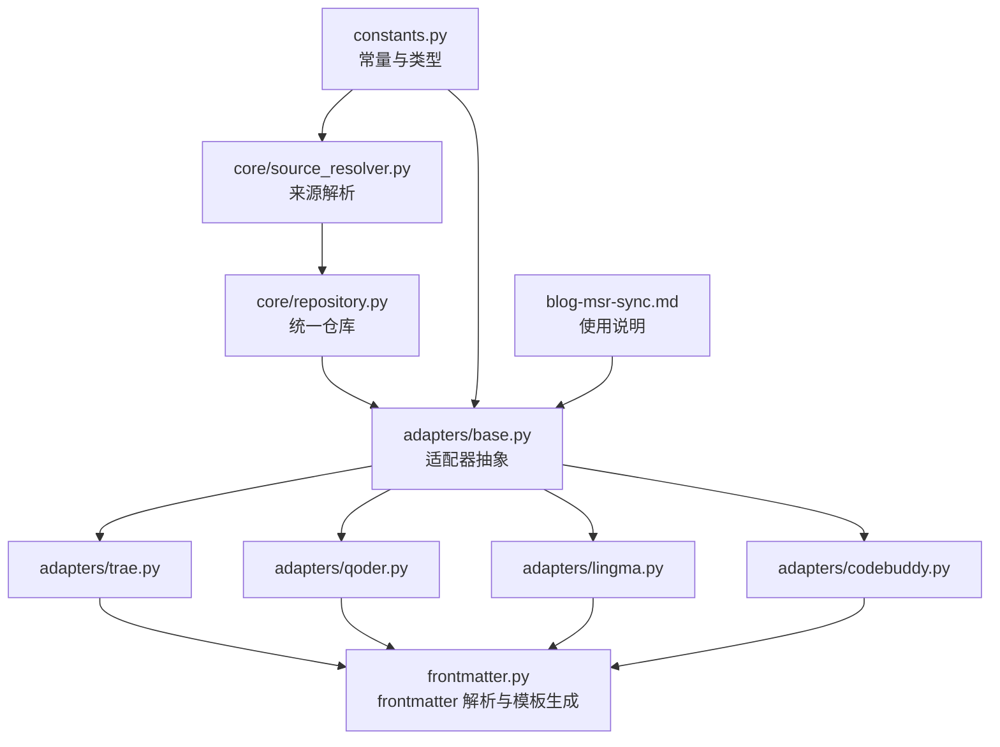
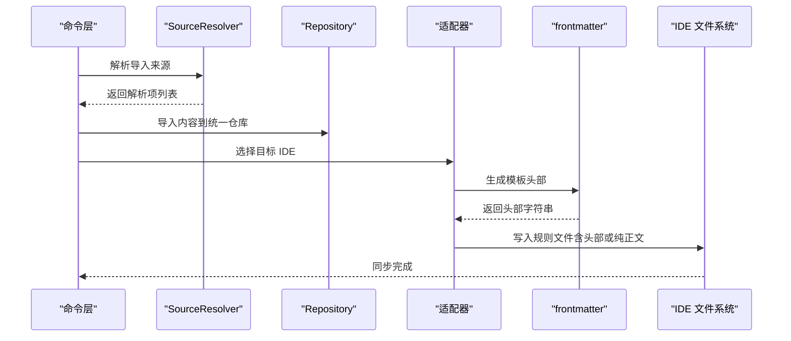
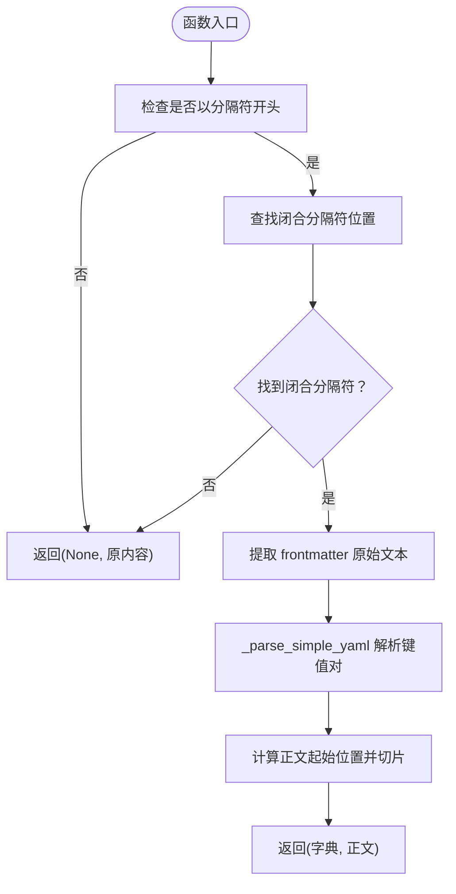
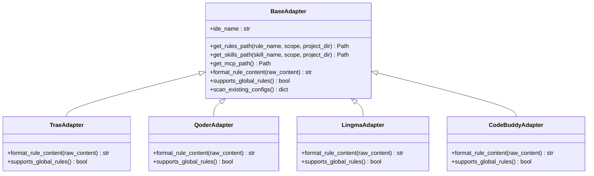
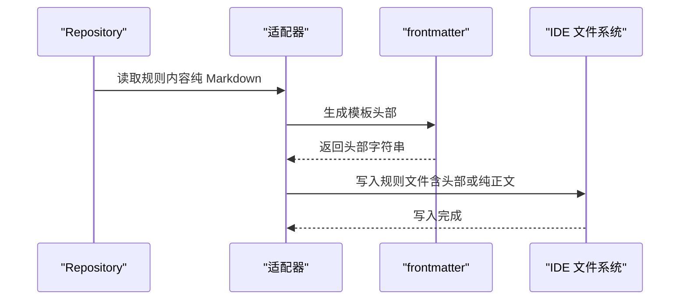
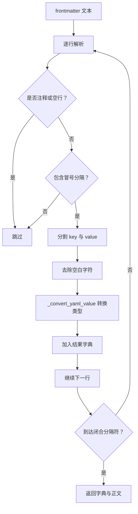
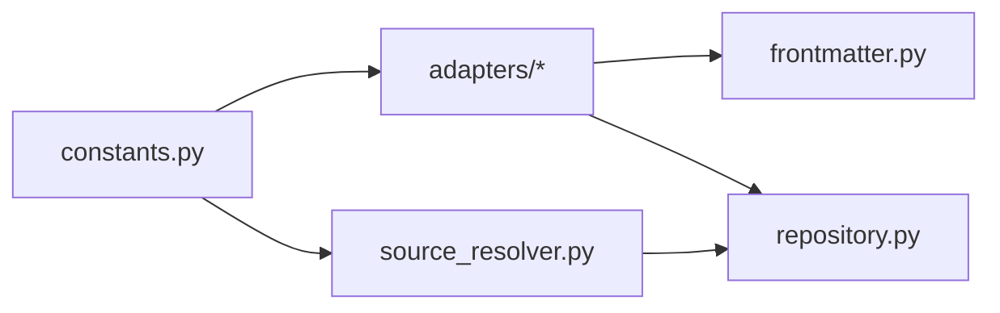

# 前言素材处理

<cite>
**本文引用的文件**   
- [frontmatter.py](file://MSR-cli/msr_sync/core/frontmatter.py)
- [test_frontmatter.py](file://MSR-cli/tests/test_frontmatter.py)
- [base.py](file://MSR-cli/msr_sync/adapters/base.py)
- [codebuddy.py](file://MSR-cli/msr_sync/adapters/codebuddy.py)
- [lingma.py](file://MSR-cli/msr_sync/adapters/lingma.py)
- [qoder.py](file://MSR-cli/msr_sync/adapters/qoder.py)
- [trae.py](file://MSR-cli/msr_sync/adapters/trae.py)
- [repository.py](file://MSR-cli/msr_sync/core/repository.py)
- [source_resolver.py](file://MSR-cli/msr_sync/core/source_resolver.py)
- [constants.py](file://MSR-cli/msr_sync/constants.py)
- [blog-msr-sync.md](file://blog-msr-sync.md)
</cite>

## 目录
1. [引言](#引言)
2. [项目结构](#项目结构)
3. [核心组件](#核心组件)
4. [架构总览](#架构总览)
5. [详细组件分析](#详细组件分析)
6. [依赖分析](#依赖分析)
7. [性能考量](#性能考量)
8. [故障排查指南](#故障排查指南)
9. [结论](#结论)
10. [附录](#附录)

## 引言
本章节聚焦“前言素材”（YAML frontmatter）在配置管理中的作用与实现。前言素材是位于 Markdown 正文之前的一段 YAML 片段，用于承载规则元数据与 IDE 特定的头部字段。在本项目中，frontmatter 负责：
- 元数据提取：从 Markdown 中剥离并解析 YAML 键值对
- 配置验证：识别合法 frontmatter，避免误判正文中的分隔符
- 内容解析：将 YAML 值转换为布尔、数字、空值等基础类型
- IDE 模板生成：为不同 IDE 生成符合其要求的头部模板，保证同步后在各 IDE 中正常识别与启用

通过统一的 frontmatter 处理能力，项目实现了“在统一仓库中仅维护纯 Markdown”的理念，并在同步阶段按 IDE 要求自动注入模板头部，从而消除配置碎片化。

## 项目结构
围绕 frontmatter 的相关模块与职责如下：
- 核心解析与生成：frontmatter.py
- 适配器层：base.py（抽象）、codebuddy.py、lingma.py、qoder.py、trae.py（具体实现）
- 仓库与来源解析：repository.py、source_resolver.py
- 常量与类型：constants.py
- 示例与说明：blog-msr-sync.md
- 单元测试：test_frontmatter.py

图表来源
- [frontmatter.py:1-164](file://MSR-cli/msr_sync/core/frontmatter.py#L1-L164)
- [base.py:1-105](file://MSR-cli/msr_sync/adapters/base.py#L1-L105)
- [trae.py:1-138](file://MSR-cli/msr_sync/adapters/trae.py#L1-L138)
- [qoder.py:1-140](file://MSR-cli/msr_sync/adapters/qoder.py#L1-L140)
- [lingma.py:1-140](file://MSR-cli/msr_sync/adapters/lingma.py#L1-L140)
- [codebuddy.py:1-143](file://MSR-cli/msr_sync/adapters/codebuddy.py#L1-L143)
- [repository.py:1-291](file://MSR-cli/msr_sync/core/repository.py#L1-L291)
- [source_resolver.py:1-404](file://MSR-cli/msr_sync/core/source_resolver.py#L1-L404)
- [constants.py:1-50](file://MSR-cli/msr_sync/constants.py#L1-L50)
- [blog-msr-sync.md:1-421](file://blog-msr-sync.md#L1-L421)

章节来源
- [frontmatter.py:1-164](file://MSR-cli/msr_sync/core/frontmatter.py#L1-L164)
- [base.py:1-105](file://MSR-cli/msr_sync/adapters/base.py#L1-L105)
- [repository.py:1-291](file://MSR-cli/msr_sync/core/repository.py#L1-L291)
- [source_resolver.py:1-404](file://MSR-cli/msr_sync/core/source_resolver.py#L1-L404)
- [constants.py:1-50](file://MSR-cli/msr_sync/constants.py#L1-L50)
- [blog-msr-sync.md:1-421](file://blog-msr-sync.md#L1-L421)

## 核心组件
- frontmatter 解析与剥离
  - strip_frontmatter：移除 frontmatter，返回纯 Markdown 正文
  - parse_frontmatter：解析 frontmatter 为字典与正文
  - _parse_simple_yaml：解析简单 YAML 键值对，支持注释行与空行跳过
  - _convert_yaml_value：将字符串值转换为布尔、整数、浮点或空值
- IDE 模板头部生成
  - build_qoder_header：Qoder/Lingma 通用模板（trigger: always_on）
  - build_lingma_header：Lingma 模板（与 Qoder 相同）
  - build_codebuddy_header：CodeBuddy 模板（含描述、开关、时间戳等字段）
  - build_cursor_header：预留（与 CodeBuddy 结构类似）

章节来源
- [frontmatter.py:10-164](file://MSR-cli/msr_sync/core/frontmatter.py#L10-L164)

## 架构总览
frontmatter 在系统中的工作流：
- 导入阶段：SourceResolver 解析来源（文件/目录/压缩包/URL），统一仓库接收纯 Markdown 内容
- 同步阶段：适配器根据 IDE 能力选择格式转换策略；Trae 直接写入纯 Markdown；Qoder/Lingma 添加 trigger 头部；CodeBuddy 添加复杂头部并包含时间戳
- 验证阶段：单元测试覆盖 strip_frontmatter、parse_frontmatter 以及各 IDE 头部生成与可解析性

图表来源
- [source_resolver.py:77-110](file://MSR-cli/msr_sync/core/source_resolver.py#L77-L110)
- [repository.py:89-112](file://MSR-cli/msr_sync/core/repository.py#L89-L112)
- [base.py:65-76](file://MSR-cli/msr_sync/adapters/base.py#L65-L76)
- [codebuddy.py:82-100](file://MSR-cli/msr_sync/adapters/codebuddy.py#L82-L100)
- [lingma.py:84-98](file://MSR-cli/msr_sync/adapters/lingma.py#L84-L98)
- [qoder.py:84-98](file://MSR-cli/msr_sync/adapters/qoder.py#L84-L98)
- [trae.py:85-96](file://MSR-cli/msr_sync/adapters/trae.py#L85-L96)

## 详细组件分析

### frontmatter 解析与生成模块
- 功能要点
  - 识别合法 frontmatter：以固定分隔符开头与闭合，避免正文中的分隔符误判
  - 解析键值对：支持注释行（以井号开头）与空行跳过
  - 类型转换：布尔、整数、浮点、空值（null/~/空字符串）
  - 模板生成：按 IDE 要求生成头部，确保可被 parse_frontmatter 正确解析
- 关键流程图

图表来源
- [frontmatter.py:26-60](file://MSR-cli/msr_sync/core/frontmatter.py#L26-L60)
- [frontmatter.py:63-86](file://MSR-cli/msr_sync/core/frontmatter.py#L63-L86)
- [frontmatter.py:89-107](file://MSR-cli/msr_sync/core/frontmatter.py#L89-L107)

章节来源
- [frontmatter.py:10-164](file://MSR-cli/msr_sync/core/frontmatter.py#L10-L164)

### 适配器层与 IDE 模板集成
- 抽象接口
  - format_rule_content：将“已剥离原始 frontmatter 的纯 Markdown”转换为 IDE 特定格式
  - supports_global_rules：声明是否支持全局级规则
- 具体实现
  - Trae：不添加头部，直接写入纯 Markdown
  - Qoder/Lingma：添加 trigger: always_on 模板头部
  - CodeBuddy：添加包含描述、开关、时间戳等字段的复杂头部
- 类关系图

图表来源
- [base.py:8-105](file://MSR-cli/msr_sync/adapters/base.py#L8-L105)
- [trae.py:21-138](file://MSR-cli/msr_sync/adapters/trae.py#L21-L138)
- [qoder.py:22-140](file://MSR-cli/msr_sync/adapters/qoder.py#L22-L140)
- [lingma.py:22-140](file://MSR-cli/msr_sync/adapters/lingma.py#L22-L140)
- [codebuddy.py:22-143](file://MSR-cli/msr_sync/adapters/codebuddy.py#L22-L143)

章节来源
- [base.py:18-105](file://MSR-cli/msr_sync/adapters/base.py#L18-L105)
- [trae.py:85-96](file://MSR-cli/msr_sync/adapters/trae.py#L85-L96)
- [qoder.py:84-98](file://MSR-cli/msr_sync/adapters/qoder.py#L84-L98)
- [lingma.py:84-98](file://MSR-cli/msr_sync/adapters/lingma.py#L84-L98)
- [codebuddy.py:82-100](file://MSR-cli/msr_sync/adapters/codebuddy.py#L82-L100)

### 同步流程与模板头部注入
- 流程说明
  - 导入：SourceResolver 解析来源，Repository 存储为纯 Markdown
  - 同步：适配器调用 frontmatter 模块生成模板头部，再写入 IDE 目标路径
  - 验证：单元测试覆盖 strip_frontmatter 与 parse_frontmatter 的正确性，以及各 IDE 头部的可解析性
- 序列图

图表来源
- [repository.py:266-291](file://MSR-cli/msr_sync/core/repository.py#L266-L291)
- [base.py:65-76](file://MSR-cli/msr_sync/adapters/base.py#L65-L76)
- [codebuddy.py:82-100](file://MSR-cli/msr_sync/adapters/codebuddy.py#L82-L100)
- [lingma.py:84-98](file://MSR-cli/msr_sync/adapters/lingma.py#L84-L98)
- [qoder.py:84-98](file://MSR-cli/msr_sync/adapters/qoder.py#L84-L98)
- [trae.py:85-96](file://MSR-cli/msr_sync/adapters/trae.py#L85-L96)

章节来源
- [repository.py:89-112](file://MSR-cli/msr_sync/core/repository.py#L89-L112)
- [base.py:65-76](file://MSR-cli/msr_sync/adapters/base.py#L65-L76)
- [test_frontmatter.py:278-381](file://MSR-cli/tests/test_frontmatter.py#L278-L381)

### 前言素材格式规范与字段定义
- 格式规范
  - 分隔符：以固定分隔符开头与闭合，避免正文中的分隔符误判
  - 键值对：每行一个 key: value，支持注释行（以井号开头）与空行跳过
  - 类型转换：空值、布尔、整数、浮点、字符串
- IDE 字段定义
  - Trae：无头部，纯 Markdown
  - Qoder/Lingma：trigger: always_on
  - CodeBuddy：description、alwaysApply、enabled、updatedAt（UTC 时间戳）、provider
- 字段解析流程图

图表来源
- [frontmatter.py:63-107](file://MSR-cli/msr_sync/core/frontmatter.py#L63-L107)

章节来源
- [frontmatter.py:26-60](file://MSR-cli/msr_sync/core/frontmatter.py#L26-L60)
- [frontmatter.py:63-107](file://MSR-cli/msr_sync/core/frontmatter.py#L63-L107)
- [codebuddy.py:82-100](file://MSR-cli/msr_sync/adapters/codebuddy.py#L82-L100)
- [lingma.py:84-98](file://MSR-cli/msr_sync/adapters/lingma.py#L84-L98)
- [qoder.py:84-98](file://MSR-cli/msr_sync/adapters/qoder.py#L84-L98)
- [trae.py:85-96](file://MSR-cli/msr_sync/adapters/trae.py#L85-L96)

### 在不同配置类型中的应用
- 规则（rules）
  - 统一仓库中存储纯 Markdown
  - 同步时按 IDE 要求注入模板头部
- 技能（skills）
  - 目录拷贝，不涉及 frontmatter
- MCP
  - JSON 合并策略，不涉及 frontmatter

章节来源
- [constants.py:16-31](file://MSR-cli/msr_sync/constants.py#L16-L31)
- [repository.py:114-158](file://MSR-cli/msr_sync/core/repository.py#L114-L158)
- [blog-msr-sync.md:204-270](file://blog-msr-sync.md#L204-L270)

### 最佳实践与常见问题
- 最佳实践
  - 在统一仓库中仅维护纯 Markdown，避免混入 IDE 特定头部
  - 使用统一的 frontmatter 字段命名与类型，便于跨 IDE 一致性
  - 对于需要动态更新的字段（如时间戳），在同步阶段生成，避免手工维护
  - 使用单元测试验证 strip_frontmatter 与 parse_frontmatter 的正确性
- 常见问题
  - 正文包含分隔符导致误判：确保仅以固定分隔符包裹 frontmatter
  - 类型转换异常：确认值为 null/~ 或布尔/数字字符串
  - IDE 头部不可解析：检查模板字段完整性与分隔符格式

章节来源
- [test_frontmatter.py:225-381](file://MSR-cli/tests/test_frontmatter.py#L225-L381)
- [frontmatter.py:37-45](file://MSR-cli/msr_sync/core/frontmatter.py#L37-L45)
- [frontmatter.py:89-107](file://MSR-cli/msr_sync/core/frontmatter.py#L89-L107)

### 自定义 frontmatter 字段的扩展方法
- 扩展步骤
  - 在适配器中新增模板生成函数，遵循现有模板格式
  - 在适配器的 format_rule_content 中调用新模板生成函数
  - 更新单元测试，验证新模板的可解析性与字段完整性
- 注意事项
  - 保持与 parse_frontmatter 的兼容性，避免引入复杂嵌套结构
  - 对于动态字段（如时间戳），在生成时即时计算并注入

章节来源
- [base.py:65-76](file://MSR-cli/msr_sync/adapters/base.py#L65-L76)
- [codebuddy.py:128-144](file://MSR-cli/msr_sync/adapters/codebuddy.py#L128-L144)
- [lingma.py:110-118](file://MSR-cli/msr_sync/adapters/lingma.py#L110-L118)
- [qoder.py:110-118](file://MSR-cli/msr_sync/adapters/qoder.py#L110-L118)
- [test_frontmatter.py:156-218](file://MSR-cli/tests/test_frontmatter.py#L156-L218)

## 依赖分析
- 模块耦合
  - frontmatter 与适配器：适配器依赖 frontmatter 的模板生成函数
  - 适配器与 Repository：适配器通过 Repository 获取规则内容并写入 IDE
  - SourceResolver 与 Repository：SourceResolver 解析来源后交由 Repository 存储
- 外部依赖
  - Python 标准库（datetime、typing）
  - 第三方库（click、pyyaml）用于 CLI 与配置解析

图表来源
- [frontmatter.py:1-164](file://MSR-cli/msr_sync/core/frontmatter.py#L1-L164)
- [base.py:1-105](file://MSR-cli/msr_sync/adapters/base.py#L1-L105)
- [repository.py:1-291](file://MSR-cli/msr_sync/core/repository.py#L1-L291)
- [source_resolver.py:1-404](file://MSR-cli/msr_sync/core/source_resolver.py#L1-L404)
- [constants.py:1-50](file://MSR-cli/msr_sync/constants.py#L1-L50)

章节来源
- [frontmatter.py:1-164](file://MSR-cli/msr_sync/core/frontmatter.py#L1-L164)
- [base.py:1-105](file://MSR-cli/msr_sync/adapters/base.py#L1-L105)
- [repository.py:1-291](file://MSR-cli/msr_sync/core/repository.py#L1-L291)
- [source_resolver.py:1-404](file://MSR-cli/msr_sync/core/source_resolver.py#L1-L404)
- [constants.py:1-50](file://MSR-cli/msr_sync/constants.py#L1-L50)

## 性能考量
- 解析复杂度
  - frontmatter 解析为线性扫描，时间复杂度 O(n)，空间复杂度 O(n)
  - 类型转换为常数时间操作，整体性能优异
- I/O 与内存
  - 仓库读写与适配器写入为磁盘 I/O，建议批量同步时减少频繁打开/关闭文件
  - 临时目录清理由 SourceResolver 管理，避免资源泄漏

## 故障排查指南
- 常见症状与定位
  - frontmatter 未被识别：检查是否以固定分隔符包裹，避免正文误判
  - 类型转换异常：确认值为 null/~ 或布尔/数字字符串
  - IDE 头部不可解析：检查模板字段完整性与分隔符格式
- 单元测试辅助
  - 使用属性测试生成大量合法 Markdown 内容，验证 strip_frontmatter 与 parse_frontmatter 的正确性
  - 验证各 IDE 头部生成后可被 parse_frontmatter 正确解析

章节来源
- [test_frontmatter.py:225-381](file://MSR-cli/tests/test_frontmatter.py#L225-L381)
- [frontmatter.py:37-45](file://MSR-cli/msr_sync/core/frontmatter.py#L37-L45)
- [frontmatter.py:89-107](file://MSR-cli/msr_sync/core/frontmatter.py#L89-L107)

## 结论
frontmatter 在本项目中承担了“元数据承载与格式桥接”的双重角色。通过统一的解析与模板生成机制，项目实现了“在统一仓库中仅维护纯 Markdown”，并在同步阶段按 IDE 要求自动注入头部，有效消除了配置碎片化。配合完善的单元测试与适配器扩展机制，frontmatter 处理具备良好的可维护性与可扩展性。

## 附录
- 使用说明与示例参见项目文档
- 常量与类型定义参见 constants.py

章节来源
- [blog-msr-sync.md:204-270](file://blog-msr-sync.md#L204-L270)
- [constants.py:16-50](file://MSR-cli/msr_sync/constants.py#L16-L50)