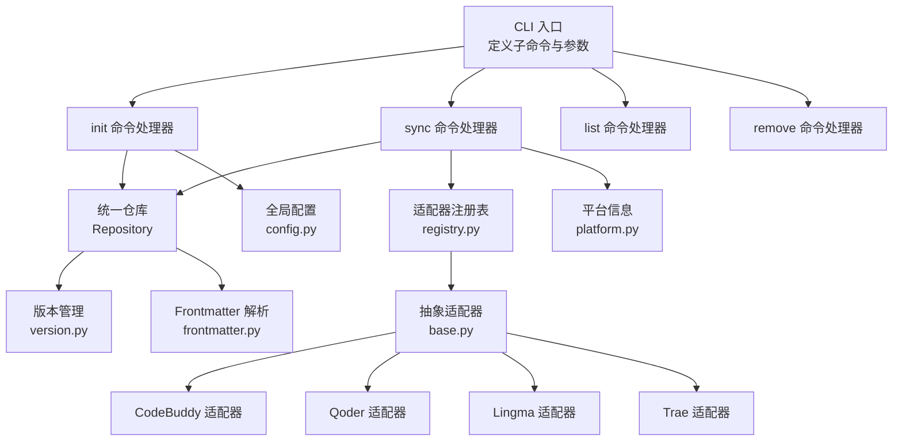
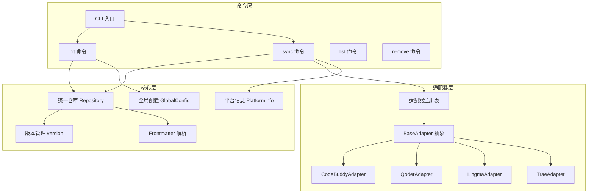
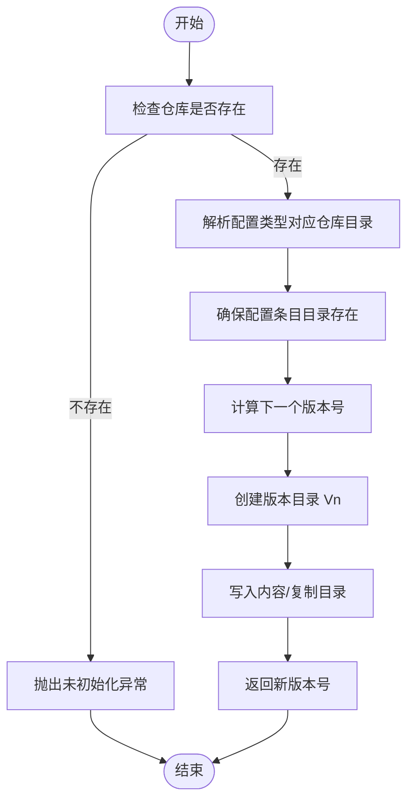
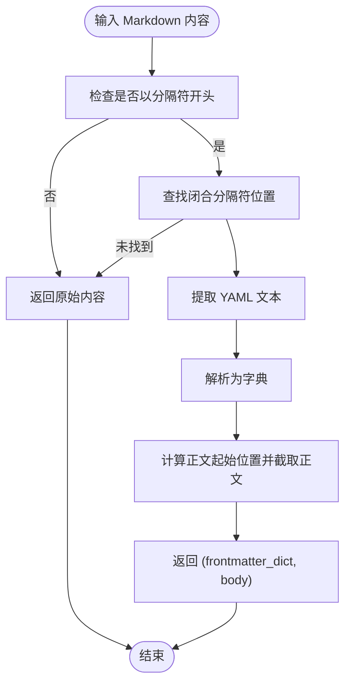
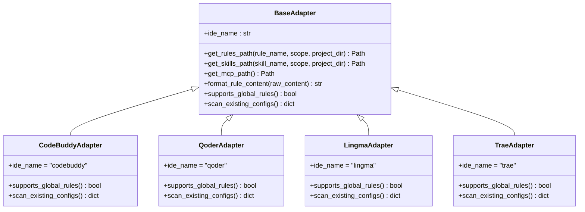
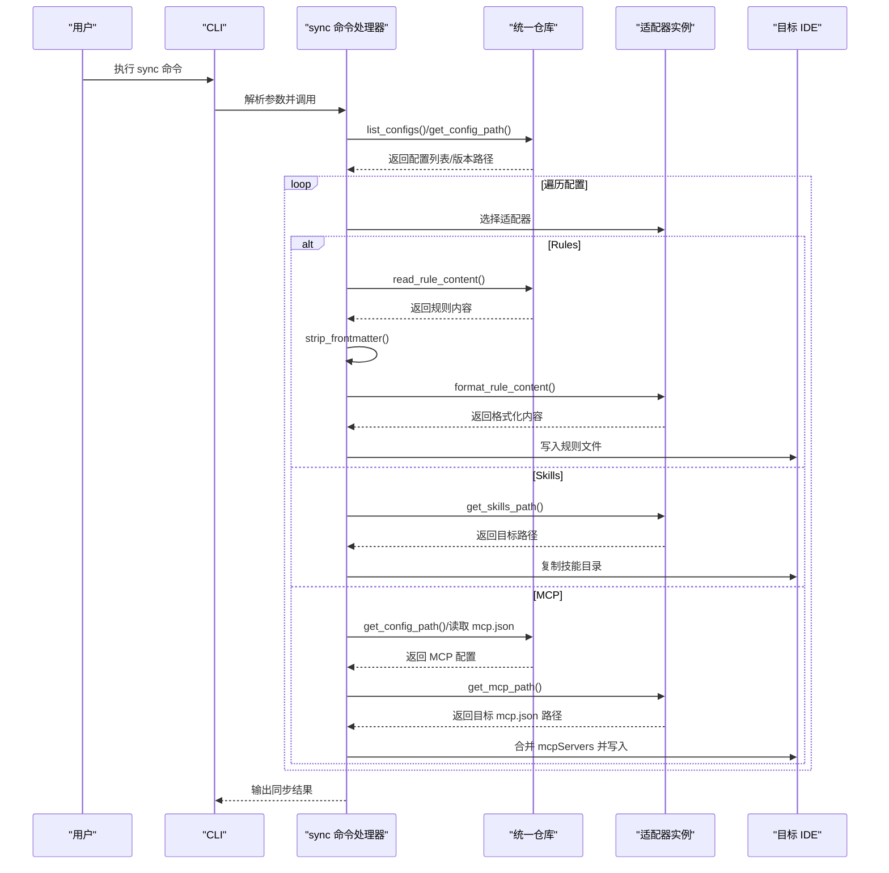
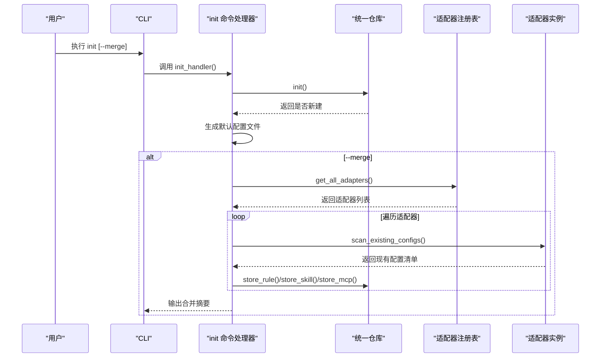
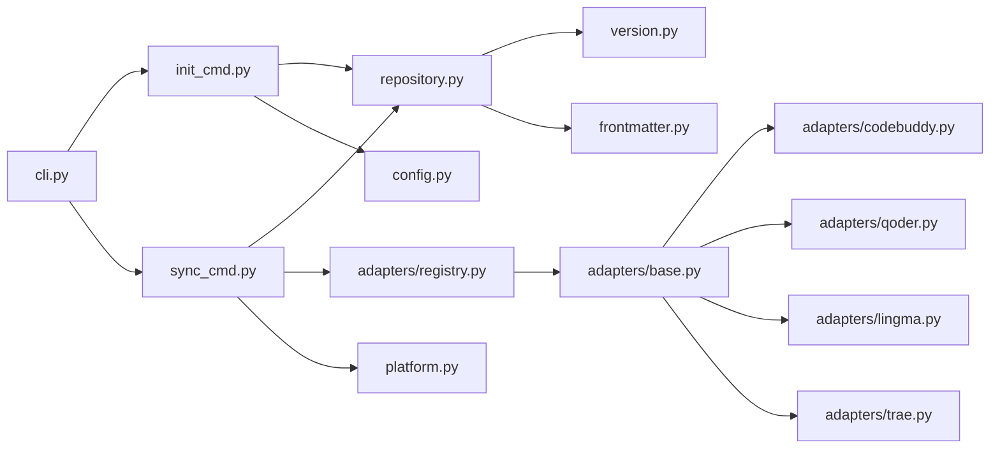

# 核心概念

<cite>
**本文引用的文件**
- [MSR-cli/msr_sync/core/config.py](file://MSR-cli/msr_sync/core/config.py)
- [MSR-cli/msr_sync/constants.py](file://MSR-cli/msr_sync/constants.py)
- [MSR-cli/msr_sync/core/repository.py](file://MSR-cli/msr_sync/core/repository.py)
- [MSR-cli/msr_sync/core/version.py](file://MSR-cli/msr_sync/core/version.py)
- [MSR-cli/msr_sync/core/frontmatter.py](file://MSR-cli/msr_sync/core/frontmatter.py)
- [MSR-cli/msr_sync/core/platform.py](file://MSR-cli/msr_sync/core/platform.py)
- [MSR-cli/msr_sync/adapters/base.py](file://MSR-cli/msr_sync/adapters/base.py)
- [MSR-cli/msr_sync/adapters/registry.py](file://MSR-cli/msr_sync/adapters/registry.py)
- [MSR-cli/msr_sync/adapters/codebuddy.py](file://MSR-cli/msr_sync/adapters/codebuddy.py)
- [MSR-cli/msr_sync/adapters/qoder.py](file://MSR-cli/msr_sync/adapters/qoder.py)
- [MSR-cli/msr_sync/adapters/lingma.py](file://MSR-cli/msr_sync/adapters/lingma.py)
- [MSR-cli/msr_sync/adapters/trae.py](file://MSR-cli/msr_sync/adapters/trae.py)
- [MSR-cli/msr_sync/commands/init_cmd.py](file://MSR-cli/msr_sync/commands/init_cmd.py)
- [MSR-cli/msr_sync/commands/sync_cmd.py](file://MSR-cli/msr_sync/commands/sync_cmd.py)
- [MSR-cli/msr_sync/cli.py](file://MSR-cli/msr_sync/cli.py)
- [MSR-cli/pyproject.toml](file://MSR-cli/pyproject.toml)
</cite>

## 目录
1. [简介](#简介)
2. [项目结构](#项目结构)
3. [核心组件](#核心组件)
4. [架构总览](#架构总览)
5. [详细组件分析](#详细组件分析)
6. [依赖分析](#依赖分析)
7. [性能考虑](#性能考虑)
8. [故障排查指南](#故障排查指南)
9. [结论](#结论)
10. [附录](#附录)

## 简介
本文件面向“MSR-v2”的核心概念与实现，围绕以下主题进行系统化说明：
- AI IDE 配置的基本概念：Rules、Skills、MCP 的定义、作用与差异
- 版本管理机制：版本创建、切换、删除与回滚的流程与约束
- 统一仓库的设计：如何在单一仓库中管理来自不同 IDE 的配置
- 前言素材（frontmatter）处理机制：剥离、解析与模板生成
- 适配器模式的应用：如何通过统一接口对接多个 IDE，提升可扩展性与可维护性
- 概念图与流程图：帮助读者建立从理论到实践的完整认知

## 项目结构
MSR-v2 的核心位于 MSR-cli 子项目，采用“命令行入口 + 核心模块 + 适配器层 + 命令处理器”的分层组织方式：
- 命令行入口：定义 CLI 子命令与参数解析
- 核心模块：配置、仓库、版本、frontmatter、平台信息
- 适配器层：针对不同 IDE 的路径解析、格式转换与扫描能力
- 命令处理器：init、sync、list、remove 等命令的具体实现

**图示来源**
- [MSR-cli/msr_sync/cli.py:1-116](file://MSR-cli/msr_sync/cli.py#L1-L116)
- [MSR-cli/msr_sync/commands/init_cmd.py:1-137](file://MSR-cli/msr_sync/commands/init_cmd.py#L1-L137)
- [MSR-cli/msr_sync/commands/sync_cmd.py:1-411](file://MSR-cli/msr_sync/commands/sync_cmd.py#L1-L411)
- [MSR-cli/msr_sync/core/repository.py:1-291](file://MSR-cli/msr_sync/core/repository.py#L1-L291)
- [MSR-cli/msr_sync/core/version.py:1-119](file://MSR-cli/msr_sync/core/version.py#L1-L119)
- [MSR-cli/msr_sync/core/frontmatter.py:1-145](file://MSR-cli/msr_sync/core/frontmatter.py#L1-L145)
- [MSR-cli/msr_sync/adapters/registry.py:1-88](file://MSR-cli/msr_sync/adapters/registry.py#L1-L88)
- [MSR-cli/msr_sync/adapters/base.py:1-105](file://MSR-cli/msr_sync/adapters/base.py#L1-L105)
- [MSR-cli/msr_sync/adapters/codebuddy.py:1-143](file://MSR-cli/msr_sync/adapters/codebuddy.py#L1-L143)
- [MSR-cli/msr_sync/adapters/qoder.py:1-140](file://MSR-cli/msr_sync/adapters/qoder.py#L1-L140)
- [MSR-cli/msr_sync/adapters/lingma.py:1-140](file://MSR-cli/msr_sync/adapters/lingma.py#L1-L140)
- [MSR-cli/msr_sync/adapters/trae.py:1-138](file://MSR-cli/msr_sync/adapters/trae.py#L1-L138)
- [MSR-cli/msr_sync/core/config.py:1-204](file://MSR-cli/msr_sync/core/config.py#L1-L204)
- [MSR-cli/msr_sync/core/platform.py:1-60](file://MSR-cli/msr_sync/core/platform.py#L1-L60)

**章节来源**
- [MSR-cli/msr_sync/cli.py:1-116](file://MSR-cli/msr_sync/cli.py#L1-L116)
- [MSR-cli/pyproject.toml:1-37](file://MSR-cli/pyproject.toml#L1-L37)

## 核心组件
本节对 Rules、Skills、MCP 的概念与职责进行说明，并结合代码定位其在统一仓库中的存储与访问方式。

- Rules（规则）
  - 定义：AI IDE 的规则文件，通常为 Markdown 内容，可能携带 frontmatter 元数据
  - 存储：统一仓库 RULES/<name>/Vn/<name>.md
  - 访问：通过仓库读取指定版本的规则内容
  - 适配：不同 IDE 对规则的头部模板不同，需要剥离原始 frontmatter 并添加 IDE 特定头部

- Skills（技能）
  - 定义：AI IDE 的技能目录，包含一组文件与资源
  - 存储：统一仓库 SKILLS/<name>/Vn/（完整目录树复制）
  - 访问：通过仓库获取技能目录路径，再由适配器写入目标 IDE

- MCP（模型控制协议）
  - 定义：IDE 的 MCP 配置（mcp.json），包含服务器配置等
  - 存储：统一仓库 MCP/<name>/Vn/（目录形式，包含 mcp.json）
  - 访问：读取源 MCP 配置，合并到目标 IDE 的 mcp.json，处理同名条目覆盖策略

**章节来源**
- [MSR-cli/msr_sync/constants.py:1-50](file://MSR-cli/msr_sync/constants.py#L1-L50)
- [MSR-cli/msr_sync/core/repository.py:1-291](file://MSR-cli/msr_sync/core/repository.py#L1-L291)
- [MSR-cli/msr_sync/commands/sync_cmd.py:1-411](file://MSR-cli/msr_sync/commands/sync_cmd.py#L1-L411)

## 架构总览
MSR-v2 采用“命令驱动 + 适配器模式 + 统一仓库”的架构。命令处理器负责参数解析与流程编排，统一仓库提供配置的持久化与版本管理，适配器层屏蔽不同 IDE 的差异，frontmatter 模块提供跨 IDE 的内容兼容。

**图示来源**
- [MSR-cli/msr_sync/cli.py:1-116](file://MSR-cli/msr_sync/cli.py#L1-L116)
- [MSR-cli/msr_sync/commands/init_cmd.py:1-137](file://MSR-cli/msr_sync/commands/init_cmd.py#L1-L137)
- [MSR-cli/msr_sync/commands/sync_cmd.py:1-411](file://MSR-cli/msr_sync/commands/sync_cmd.py#L1-L411)
- [MSR-cli/msr_sync/core/repository.py:1-291](file://MSR-cli/msr_sync/core/repository.py#L1-L291)
- [MSR-cli/msr_sync/core/version.py:1-119](file://MSR-cli/msr_sync/core/version.py#L1-L119)
- [MSR-cli/msr_sync/core/frontmatter.py:1-145](file://MSR-cli/msr_sync/core/frontmatter.py#L1-L145)
- [MSR-cli/msr_sync/adapters/registry.py:1-88](file://MSR-cli/msr_sync/adapters/registry.py#L1-L88)
- [MSR-cli/msr_sync/adapters/base.py:1-105](file://MSR-cli/msr_sync/adapters/base.py#L1-L105)
- [MSR-cli/msr_sync/adapters/codebuddy.py:1-143](file://MSR-cli/msr_sync/adapters/codebuddy.py#L1-L143)
- [MSR-cli/msr_sync/adapters/qoder.py:1-140](file://MSR-cli/msr_sync/adapters/qoder.py#L1-L140)
- [MSR-cli/msr_sync/adapters/lingma.py:1-140](file://MSR-cli/msr_sync/adapters/lingma.py#L1-L140)
- [MSR-cli/msr_sync/adapters/trae.py:1-138](file://MSR-cli/msr_sync/adapters/trae.py#L1-L138)
- [MSR-cli/msr_sync/core/config.py:1-204](file://MSR-cli/msr_sync/core/config.py#L1-L204)
- [MSR-cli/msr_sync/core/platform.py:1-60](file://MSR-cli/msr_sync/core/platform.py#L1-L60)

## 详细组件分析

### 统一仓库与版本管理
统一仓库将 Rules、Skills、MCP 三类配置分别置于 RULES、SKILLS、MCP 三个子目录下，每个配置条目内部采用“版本目录 Vn”的结构进行多版本管理。版本号解析与格式化遵循固定前缀与严格格式，确保版本号的合法性与可排序性。

**图示来源**
- [MSR-cli/msr_sync/core/repository.py:89-158](file://MSR-cli/msr_sync/core/repository.py#L89-L158)
- [MSR-cli/msr_sync/core/version.py:59-118](file://MSR-cli/msr_sync/core/version.py#L59-L118)

**章节来源**
- [MSR-cli/msr_sync/core/repository.py:1-291](file://MSR-cli/msr_sync/core/repository.py#L1-L291)
- [MSR-cli/msr_sync/core/version.py:1-119](file://MSR-cli/msr_sync/core/version.py#L1-L119)
- [MSR-cli/msr_sync/constants.py:1-50](file://MSR-cli/msr_sync/constants.py#L1-L50)

### 前言素材（frontmatter）处理机制
frontmatter 是夹在两组分隔符之间的 YAML 片段，用于承载元数据。系统提供剥离、解析与模板生成能力：
- 剥离：去除 frontmatter，保留正文
- 解析：将 frontmatter 文本解析为键值字典
- 模板：为不同 IDE 生成各自的头部模板（如 CodeBuddy 的时间戳字段）

**图示来源**
- [MSR-cli/msr_sync/core/frontmatter.py:10-60](file://MSR-cli/msr_sync/core/frontmatter.py#L10-L60)

**章节来源**
- [MSR-cli/msr_sync/core/frontmatter.py:1-145](file://MSR-cli/msr_sync/core/frontmatter.py#L1-L145)

### 适配器模式与 IDE 能力
适配器模式通过统一的 BaseAdapter 接口屏蔽不同 IDE 的差异，包括：
- 路径解析：rules、skills、MCP 在各 IDE 中的存储路径
- 格式转换：将统一仓库中的内容转换为 IDE 特定格式（如添加 frontmatter 模板）
- 能力查询：是否支持全局级 rules 等
- 配置扫描：用于初始化时合并已有 IDE 配置

**图示来源**
- [MSR-cli/msr_sync/adapters/base.py:1-105](file://MSR-cli/msr_sync/adapters/base.py#L1-L105)
- [MSR-cli/msr_sync/adapters/codebuddy.py:1-143](file://MSR-cli/msr_sync/adapters/codebuddy.py#L1-L143)
- [MSR-cli/msr_sync/adapters/qoder.py:1-140](file://MSR-cli/msr_sync/adapters/qoder.py#L1-L140)
- [MSR-cli/msr_sync/adapters/lingma.py:1-140](file://MSR-cli/msr_sync/adapters/lingma.py#L1-L140)
- [MSR-cli/msr_sync/adapters/trae.py:1-138](file://MSR-cli/msr_sync/adapters/trae.py#L1-L138)

**章节来源**
- [MSR-cli/msr_sync/adapters/base.py:1-105](file://MSR-cli/msr_sync/adapters/base.py#L1-L105)
- [MSR-cli/msr_sync/adapters/registry.py:1-88](file://MSR-cli/msr_sync/adapters/registry.py#L1-L88)
- [MSR-cli/msr_sync/adapters/codebuddy.py:1-143](file://MSR-cli/msr_sync/adapters/codebuddy.py#L1-L143)
- [MSR-cli/msr_sync/adapters/qoder.py:1-140](file://MSR-cli/msr_sync/adapters/qoder.py#L1-L140)
- [MSR-cli/msr_sync/adapters/lingma.py:1-140](file://MSR-cli/msr_sync/adapters/lingma.py#L1-L140)
- [MSR-cli/msr_sync/adapters/trae.py:1-138](file://MSR-cli/msr_sync/adapters/trae.py#L1-L138)

### 同步流程（Rules、Skills、MCP）
同步命令根据参数选择 IDE、层级、类型与名称，遍历仓库配置并逐项写入目标 IDE。Rules 需剥离原始 frontmatter 并添加 IDE 特定头部；Skills 直接复制目录；MCP 读取 JSON 并合并到目标 mcp.json，处理同名条目覆盖。

**图示来源**
- [MSR-cli/msr_sync/commands/sync_cmd.py:26-131](file://MSR-cli/msr_sync/commands/sync_cmd.py#L26-L131)
- [MSR-cli/msr_sync/core/frontmatter.py:10-23](file://MSR-cli/msr_sync/core/frontmatter.py#L10-L23)
- [MSR-cli/msr_sync/core/repository.py:160-200](file://MSR-cli/msr_sync/core/repository.py#L160-L200)
- [MSR-cli/msr_sync/adapters/base.py:25-76](file://MSR-cli/msr_sync/adapters/base.py#L25-L76)

**章节来源**
- [MSR-cli/msr_sync/commands/sync_cmd.py:1-411](file://MSR-cli/msr_sync/commands/sync_cmd.py#L1-L411)
- [MSR-cli/msr_sync/core/frontmatter.py:1-145](file://MSR-cli/msr_sync/core/frontmatter.py#L1-L145)
- [MSR-cli/msr_sync/core/repository.py:1-291](file://MSR-cli/msr_sync/core/repository.py#L1-L291)

### 初始化与合并流程
init 命令负责创建统一仓库目录结构并生成默认配置文件；当启用 --merge 时，扫描所有 IDE 的现有配置并导入到统一仓库。该流程体现了“从分散到统一”的迁移策略。

**图示来源**
- [MSR-cli/msr_sync/commands/init_cmd.py:13-42](file://MSR-cli/msr_sync/commands/init_cmd.py#L13-L42)
- [MSR-cli/msr_sync/adapters/registry.py:65-87](file://MSR-cli/msr_sync/adapters/registry.py#L65-L87)
- [MSR-cli/msr_sync/core/repository.py:89-158](file://MSR-cli/msr_sync/core/repository.py#L89-L158)

**章节来源**
- [MSR-cli/msr_sync/commands/init_cmd.py:1-137](file://MSR-cli/msr_sync/commands/init_cmd.py#L1-L137)
- [MSR-cli/msr_sync/adapters/registry.py:1-88](file://MSR-cli/msr_sync/adapters/registry.py#L1-L88)
- [MSR-cli/msr_sync/core/repository.py:1-291](file://MSR-cli/msr_sync/core/repository.py#L1-L291)

## 依赖分析
- 命令层依赖核心模块与适配器层：CLI 通过命令处理器编排仓库与适配器
- 仓库依赖版本与 frontmatter：存储与读取配置时需要版本解析与内容剥离
- 适配器依赖平台信息：跨平台路径解析（如 Application Support 目录）
- 注册表负责延迟加载与实例缓存：避免重复创建适配器实例

**图示来源**
- [MSR-cli/msr_sync/cli.py:1-116](file://MSR-cli/msr_sync/cli.py#L1-L116)
- [MSR-cli/msr_sync/commands/init_cmd.py:1-137](file://MSR-cli/msr_sync/commands/init_cmd.py#L1-L137)
- [MSR-cli/msr_sync/commands/sync_cmd.py:1-411](file://MSR-cli/msr_sync/commands/sync_cmd.py#L1-L411)
- [MSR-cli/msr_sync/core/repository.py:1-291](file://MSR-cli/msr_sync/core/repository.py#L1-L291)
- [MSR-cli/msr_sync/core/version.py:1-119](file://MSR-cli/msr_sync/core/version.py#L1-L119)
- [MSR-cli/msr_sync/core/frontmatter.py:1-145](file://MSR-cli/msr_sync/core/frontmatter.py#L1-L145)
- [MSR-cli/msr_sync/adapters/registry.py:1-88](file://MSR-cli/msr_sync/adapters/registry.py#L1-L88)
- [MSR-cli/msr_sync/adapters/base.py:1-105](file://MSR-cli/msr_sync/adapters/base.py#L1-L105)
- [MSR-cli/msr_sync/adapters/codebuddy.py:1-143](file://MSR-cli/msr_sync/adapters/codebuddy.py#L1-L143)
- [MSR-cli/msr_sync/adapters/qoder.py:1-140](file://MSR-cli/msr_sync/adapters/qoder.py#L1-L140)
- [MSR-cli/msr_sync/adapters/lingma.py:1-140](file://MSR-cli/msr_sync/adapters/lingma.py#L1-L140)
- [MSR-cli/msr_sync/adapters/trae.py:1-138](file://MSR-cli/msr_sync/adapters/trae.py#L1-L138)
- [MSR-cli/msr_sync/core/config.py:1-204](file://MSR-cli/msr_sync/core/config.py#L1-L204)
- [MSR-cli/msr_sync/core/platform.py:1-60](file://MSR-cli/msr_sync/core/platform.py#L1-L60)

**章节来源**
- [MSR-cli/msr_sync/cli.py:1-116](file://MSR-cli/msr_sync/cli.py#L1-L116)
- [MSR-cli/msr_sync/commands/init_cmd.py:1-137](file://MSR-cli/msr_sync/commands/init_cmd.py#L1-L137)
- [MSR-cli/msr_sync/commands/sync_cmd.py:1-411](file://MSR-cli/msr_sync/commands/sync_cmd.py#L1-L411)
- [MSR-cli/msr_sync/core/repository.py:1-291](file://MSR-cli/msr_sync/core/repository.py#L1-L291)
- [MSR-cli/msr_sync/adapters/registry.py:1-88](file://MSR-cli/msr_sync/adapters/registry.py#L1-L88)
- [MSR-cli/msr_sync/core/platform.py:1-60](file://MSR-cli/msr_sync/core/platform.py#L1-L60)

## 性能考虑
- 版本目录结构：Vn 递增写入，读取时按版本号排序，时间复杂度 O(k log k)，k 为某配置条目的版本数量
- 目录复制：Skills 采用完整目录复制，建议控制单个技能目录大小，避免大文件拷贝带来的 IO 压力
- JSON 合并：MCP 合并时对同名条目进行确认，避免误覆盖；建议在批量同步时配合 --dry-run 或交互确认
- 适配器实例缓存：注册表缓存适配器实例，减少重复导入与实例化开销

## 故障排查指南
- 仓库未初始化
  - 现象：执行 sync/list/remove 时报仓库未初始化
  - 处理：先执行 init 命令创建仓库目录结构
  - 参考：[仓库初始化与存在性检查:53-71](file://MSR-cli/msr_sync/core/repository.py#L53-L71)

- 配置或版本不存在
  - 现象：读取规则或删除版本时报找不到配置/版本
  - 处理：确认配置名称与版本号是否正确；使用 list 命令查看可用配置
  - 参考：[配置路径解析与异常抛出:160-199](file://MSR-cli/msr_sync/core/repository.py#L160-L199)

- YAML 配置文件语法错误
  - 现象：加载配置时报 YAML 语法错误
  - 处理：修正 YAML 语法；检查注释与缩进
  - 参考：[配置加载与异常处理:113-127](file://MSR-cli/msr_sync/core/config.py#L113-L127)

- MCP 配置格式错误
  - 现象：读取或合并 MCP 配置时报 JSON 解析错误
  - 处理：检查 mcp.json 的 JSON 格式；确保包含必要的字段
  - 参考：[MCP 配置读取与合并:267-287](file://MSR-cli/msr_sync/commands/sync_cmd.py#L267-L287)

- 平台不支持
  - 现象：平台检测失败
  - 处理：当前仅支持 macOS 与 Windows；请在受支持平台上运行
  - 参考：[平台检测与异常:22-30](file://MSR-cli/msr_sync/core/platform.py#L22-L30)

**章节来源**
- [MSR-cli/msr_sync/core/repository.py:53-71](file://MSR-cli/msr_sync/core/repository.py#L53-L71)
- [MSR-cli/msr_sync/core/repository.py:160-199](file://MSR-cli/msr_sync/core/repository.py#L160-L199)
- [MSR-cli/msr_sync/core/config.py:113-127](file://MSR-cli/msr_sync/core/config.py#L113-L127)
- [MSR-cli/msr_sync/commands/sync_cmd.py:267-287](file://MSR-cli/msr_sync/commands/sync_cmd.py#L267-L287)
- [MSR-cli/msr_sync/core/platform.py:22-30](file://MSR-cli/msr_sync/core/platform.py#L22-L30)

## 结论
MSR-v2 通过统一仓库与版本管理，实现了 Rules、Skills、MCP 的集中化与可追溯；通过适配器模式，屏蔽了不同 IDE 的差异，提升了系统的可扩展性与可维护性；通过 frontmatter 的剥离与模板生成，保证了跨 IDE 的内容兼容。整体架构清晰、职责分明，既满足了理论层面的抽象，也提供了实践层面的可操作性。

## 附录
- 常量与枚举：统一仓库目录名、配置类型枚举、版本号前缀、平台支持等
- CLI 命令：init、import、sync、list、remove 的参数与行为
- 适配器能力：各 IDE 的路径约定、是否支持全局 rules、MCP 路径等

**章节来源**
- [MSR-cli/msr_sync/constants.py:1-50](file://MSR-cli/msr_sync/constants.py#L1-L50)
- [MSR-cli/msr_sync/cli.py:1-116](file://MSR-cli/msr_sync/cli.py#L1-L116)
- [MSR-cli/msr_sync/adapters/codebuddy.py:1-143](file://MSR-cli/msr_sync/adapters/codebuddy.py#L1-L143)
- [MSR-cli/msr_sync/adapters/qoder.py:1-140](file://MSR-cli/msr_sync/adapters/qoder.py#L1-L140)
- [MSR-cli/msr_sync/adapters/lingma.py:1-140](file://MSR-cli/msr_sync/adapters/lingma.py#L1-L140)
- [MSR-cli/msr_sync/adapters/trae.py:1-138](file://MSR-cli/msr_sync/adapters/trae.py#L1-L138)