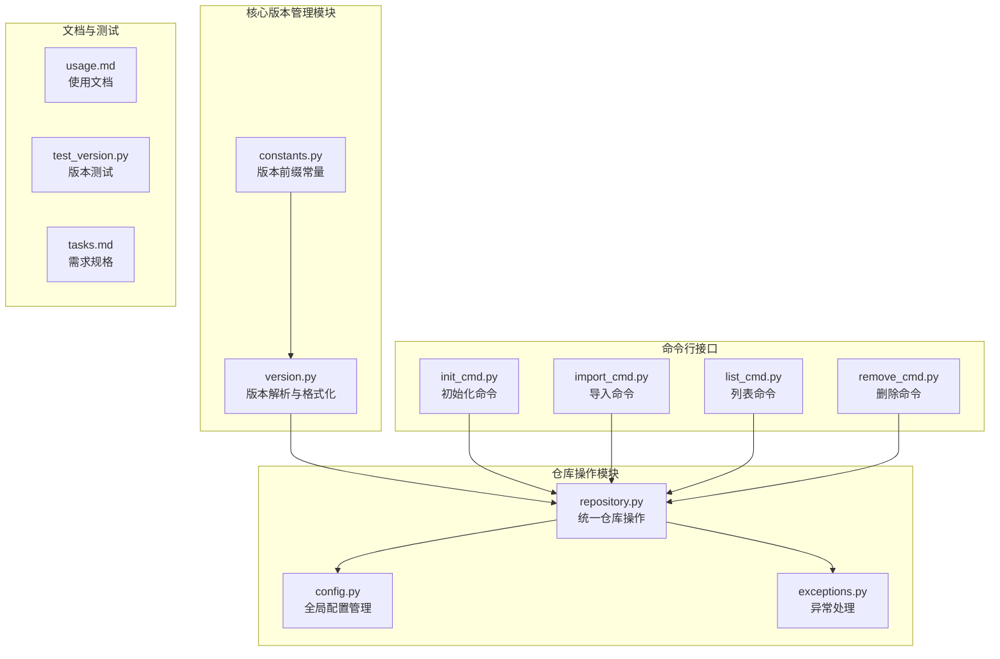
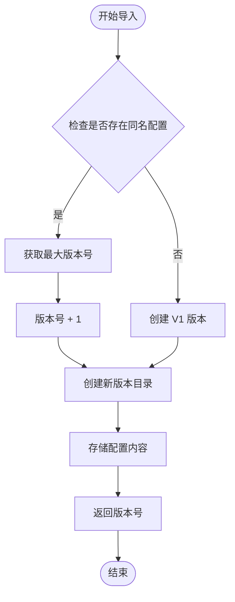
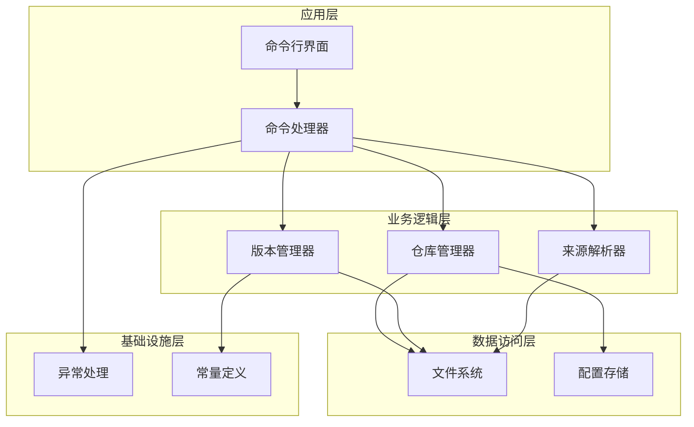
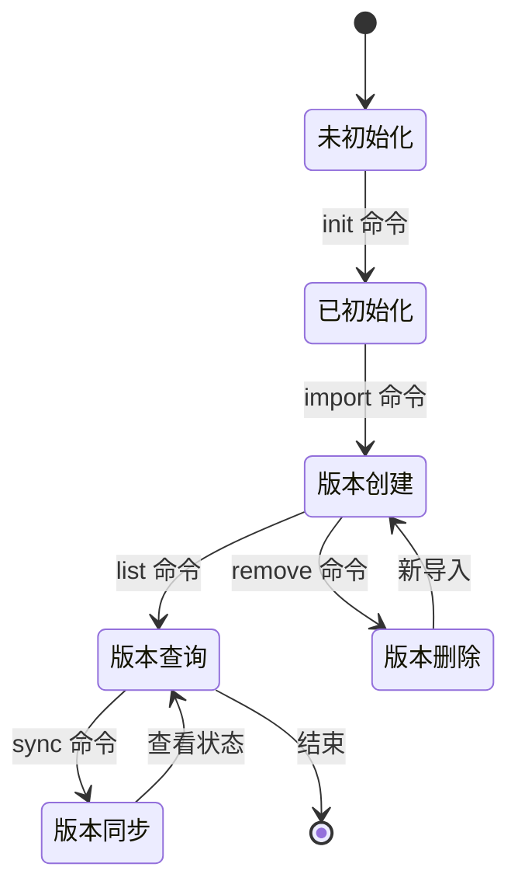
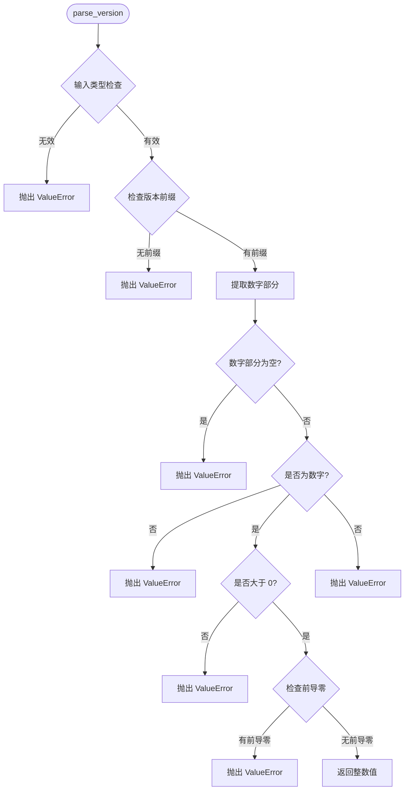
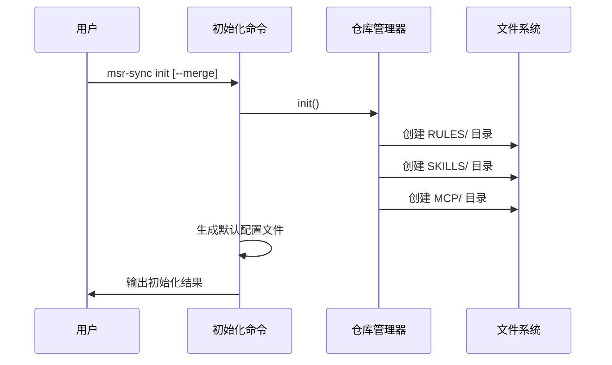
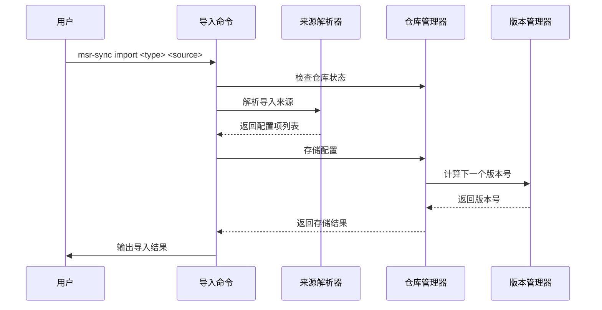
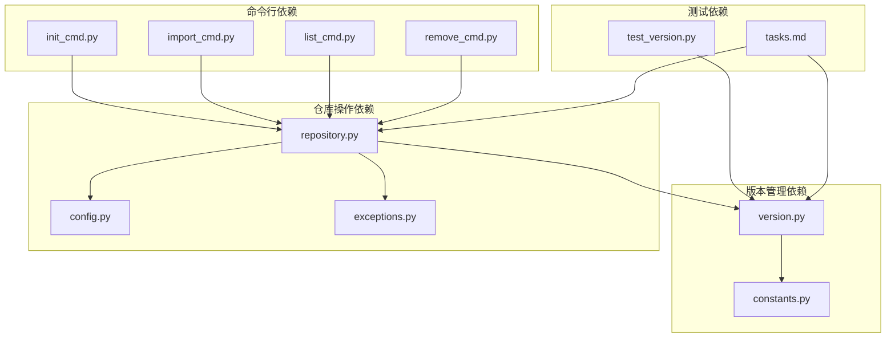
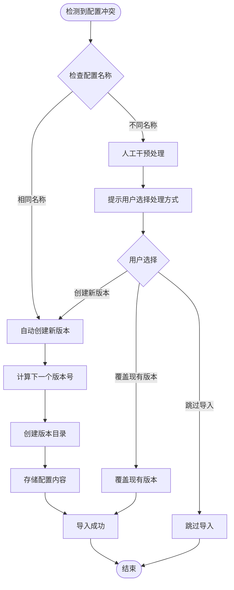

# 版本管理机制

<cite>
**本文档引用的文件**
- [version.py](file://MSR-cli/msr_sync/core/version.py)
- [repository.py](file://MSR-cli/msr_sync/core/repository.py)
- [constants.py](file://MSR-cli/msr_sync/constants.py)
- [init_cmd.py](file://MSR-cli/msr_sync/commands/init_cmd.py)
- [import_cmd.py](file://MSR-cli/msr_sync/commands/import_cmd.py)
- [list_cmd.py](file://MSR-cli/msr_sync/commands/list_cmd.py)
- [remove_cmd.py](file://MSR-cli/msr_sync/commands/remove_cmd.py)
- [config.py](file://MSR-cli/msr_sync/core/config.py)
- [exceptions.py](file://MSR-cli/msr_sync/core/exceptions.py)
- [usage.md](file://MSR-cli/docs/usage.md)
- [tasks.md](file://.kiro/specs/msr-cli/tasks.md)
- [test_version.py](file://MSR-cli/tests/test_version.py)
</cite>

## 目录
1. [简介](#简介)
2. [项目结构](#项目结构)
3. [核心组件](#核心组件)
4. [架构概览](#架构概览)
5. [详细组件分析](#详细组件分析)
6. [依赖关系分析](#依赖关系分析)
7. [性能考虑](#性能考虑)
8. [故障排除指南](#故障排除指南)
9. [结论](#结论)

## 简介

MSR-v2 是一个面向多 IDE 配置管理的版本控制系统，专注于规则（Rules）、技能（Skills）和 MCP 配置的版本化管理。该系统采用简洁而强大的版本管理机制，通过统一的版本号格式和自动化版本控制流程，实现了配置的完整生命周期管理。

版本管理机制的核心特点包括：
- **标准化版本号格式**：采用 V1、V2、V3... 的统一命名规范
- **自动化版本控制**：导入新配置时自动创建新版本，避免手动版本管理
- **智能版本选择**：默认使用最新版本，支持指定版本同步
- **完整的生命周期管理**：支持版本创建、查询、删除和回滚操作

## 项目结构

MSR-v2 的版本管理相关文件组织结构如下：

**图表来源**
- [version.py:1-119](file://MSR-cli/msr_sync/core/version.py#L1-L119)
- [repository.py:1-291](file://MSR-cli/msr_sync/core/repository.py#L1-L291)
- [constants.py:1-50](file://MSR-cli/msr_sync/constants.py#L1-L50)

**章节来源**
- [version.py:1-119](file://MSR-cli/msr_sync/core/version.py#L1-L119)
- [repository.py:1-291](file://MSR-cli/msr_sync/core/repository.py#L1-L291)
- [constants.py:1-50](file://MSR-cli/msr_sync/constants.py#L1-L50)

## 核心组件

### 版本号生成规则

MSR-v2 采用标准化的版本号生成机制：

**图表来源**
- [import_cmd.py:117-151](file://MSR-cli/msr_sync/commands/import_cmd.py#L117-L151)
- [repository.py:89-158](file://MSR-cli/msr_sync/core/repository.py#L89-L158)

### 版本号格式规范

版本号采用统一的格式规范：
- **格式**：`V` + 数字，如 V1、V2、V10
- **前缀**：固定使用大写的 `V`
- **数值**：必须为正整数
- **唯一性**：同一配置下的版本号必须唯一
- **排序**：支持数字排序而非字符串排序

**章节来源**
- [version.py:9-44](file://MSR-cli/msr_sync/core/version.py#L9-L44)
- [constants.py:36-37](file://MSR-cli/msr_sync/constants.py#L36-L37)

## 架构概览

MSR-v2 的版本管理架构采用分层设计，确保了系统的可维护性和扩展性：

**图表来源**
- [repository.py:23-40](file://MSR-cli/msr_sync/core/repository.py#L23-L40)
- [version.py:1-119](file://MSR-cli/msr_sync/core/version.py#L1-L119)
- [import_cmd.py:14-56](file://MSR-cli/msr_sync/commands/import_cmd.py#L14-L56)

### 版本生命周期管理

MSR-v2 提供了完整的版本生命周期管理：

**图表来源**
- [init_cmd.py:13-42](file://MSR-cli/msr_sync/commands/init_cmd.py#L13-L42)
- [import_cmd.py:14-56](file://MSR-cli/msr_sync/commands/import_cmd.py#L14-L56)
- [list_cmd.py:12-63](file://MSR-cli/msr_sync/commands/list_cmd.py#L12-L63)
- [remove_cmd.py:12-43](file://MSR-cli/msr_sync/commands/remove_cmd.py#L12-L43)

## 详细组件分析

### 版本管理器 (Version Manager)

版本管理器负责处理版本号的解析、格式化和版本列表管理：

#### 核心功能

1. **版本号解析**：将字符串格式的版本号转换为整数
2. **版本号格式化**：将整数版本号转换为标准字符串格式
3. **版本列表获取**：扫描目录获取所有版本号并排序
4. **最新版本选择**：自动选择数字最大的版本
5. **下一个版本计算**：基于现有版本计算新版本号

#### 版本号解析算法

**图表来源**
- [version.py:9-44](file://MSR-cli/msr_sync/core/version.py#L9-L44)

**章节来源**
- [version.py:9-119](file://MSR-cli/msr_sync/core/version.py#L9-L119)

### 仓库管理器 (Repository Manager)

仓库管理器提供统一的配置存储和检索接口：

#### 存储操作

1. **规则存储**：将 Markdown 文件存储到 `RULES/<name>/V<n>/` 目录
2. **技能存储**：将技能目录复制到 `SKILLS/<name>/V<n>/` 目录
3. **MCP 存储**：将 MCP 配置目录复制到 `MCP/<name>/V<n>/` 目录

#### 查询操作

1. **配置路径获取**：支持获取指定版本或最新版本的配置路径
2. **配置列表查询**：按类型和名称过滤配置列表
3. **版本信息查询**：获取配置的所有版本信息

**章节来源**
- [repository.py:89-291](file://MSR-cli/msr_sync/core/repository.py#L89-L291)

### 命令处理器

#### 初始化命令 (init)

初始化命令负责创建统一仓库的目录结构：

**图表来源**
- [init_cmd.py:13-42](file://MSR-cli/msr_sync/commands/init_cmd.py#L13-L42)

#### 导入命令 (import)

导入命令处理配置的导入和版本管理：

**图表来源**
- [import_cmd.py:14-56](file://MSR-cli/msr_sync/commands/import_cmd.py#L14-L56)

**章节来源**
- [import_cmd.py:14-151](file://MSR-cli/msr_sync/commands/import_cmd.py#L14-L151)

## 依赖关系分析

MSR-v2 的版本管理机制具有清晰的依赖关系：

**图表来源**
- [version.py:1-119](file://MSR-cli/msr_sync/core/version.py#L1-L119)
- [repository.py:1-291](file://MSR-cli/msr_sync/core/repository.py#L1-L291)
- [constants.py:1-50](file://MSR-cli/msr_sync/constants.py#L1-L50)

### 版本冲突处理机制

MSR-v2 采用自动化的版本冲突处理策略：

**图表来源**
- [import_cmd.py:117-151](file://MSR-cli/msr_sync/commands/import_cmd.py#L117-L151)
- [repository.py:89-158](file://MSR-cli/msr_sync/core/repository.py#L89-L158)

**章节来源**
- [usage.md:181-193](file://MSR-cli/docs/usage.md#L181-L193)

## 性能考虑

### 版本管理性能优化

MSR-v2 在版本管理方面采用了多项性能优化策略：

1. **延迟加载**：版本信息按需解析，避免不必要的文件系统访问
2. **缓存机制**：常用版本信息在内存中缓存，减少重复计算
3. **批量操作**：支持批量导入和同步，提高整体效率
4. **增量更新**：仅在必要时进行版本号计算和文件系统操作

### 存储优化

- **目录结构优化**：采用扁平化的目录结构，减少文件系统层级深度
- **版本号排序**：使用数字排序算法，确保版本列表的正确性和性能
- **文件系统抽象**：通过统一的文件系统接口，便于未来优化和扩展

## 故障排除指南

### 常见版本管理问题

#### 版本号格式错误

**问题描述**：版本号格式不符合规范，如前导零、负数或非数字字符

**解决方案**：
1. 检查版本号格式是否为 `V` + 正整数
2. 确保没有前导零（如 `V01` 应改为 `V1`）
3. 验证版本号为正整数

#### 版本冲突处理

**问题描述**：导入同名配置时出现版本冲突

**解决方案**：
1. 系统会自动创建新版本（V2、V3...）
2. 使用 `list` 命令查看所有版本
3. 使用 `remove` 命令删除不需要的旧版本

#### 版本查询异常

**问题描述**：查询版本信息时出现异常

**解决方案**：
1. 确认仓库已初始化
2. 检查配置名称是否正确
3. 验证版本号格式是否正确

**章节来源**
- [usage.md:634-759](file://MSR-cli/docs/usage.md#L634-L759)

## 结论

MSR-v2 的版本管理机制通过标准化的版本号格式、自动化的版本控制流程和完善的生命周期管理，为多 IDE 配置管理提供了强大而灵活的解决方案。该系统的主要优势包括：

1. **简单易用**：自动化的版本管理减少了手动操作的复杂性
2. **可靠稳定**：严格的版本号格式验证和错误处理机制
3. **扩展性强**：模块化的架构设计便于功能扩展和维护
4. **兼容性好**：支持多种 IDE 和配置类型

通过本文档的详细分析，开发者可以深入理解 MSR-v2 的版本管理机制，并在实际使用中充分利用其提供的各种功能和特性。建议在使用过程中遵循最佳实践，定期清理不需要的旧版本，保持仓库的整洁和高效运行。