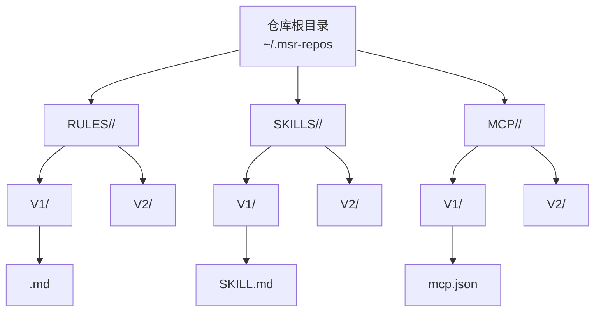
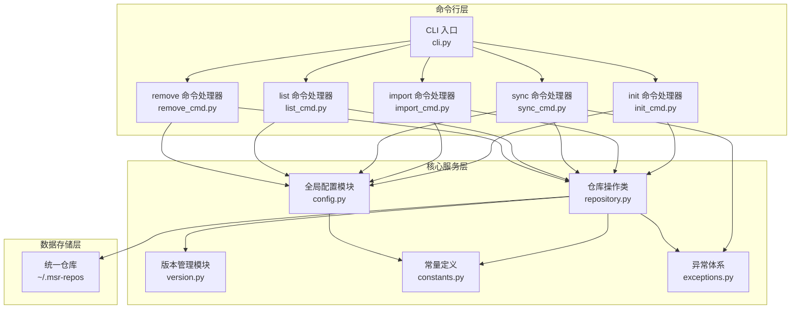
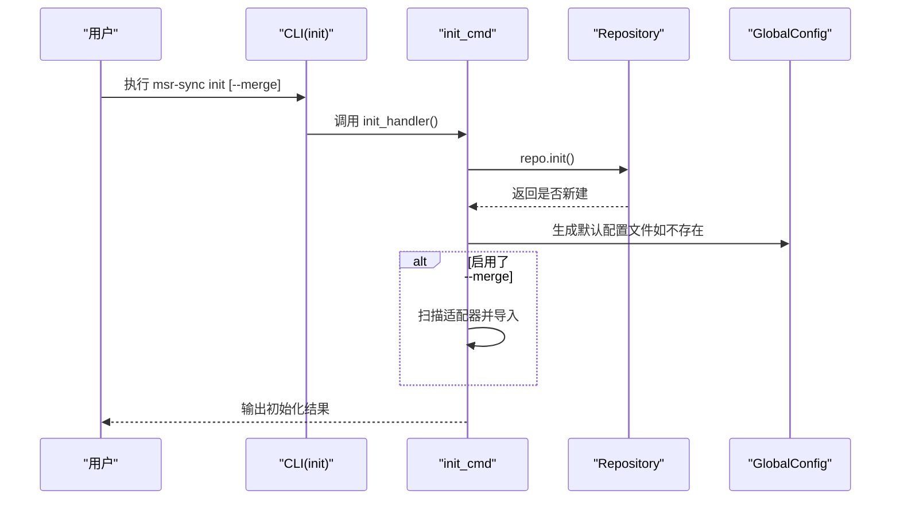
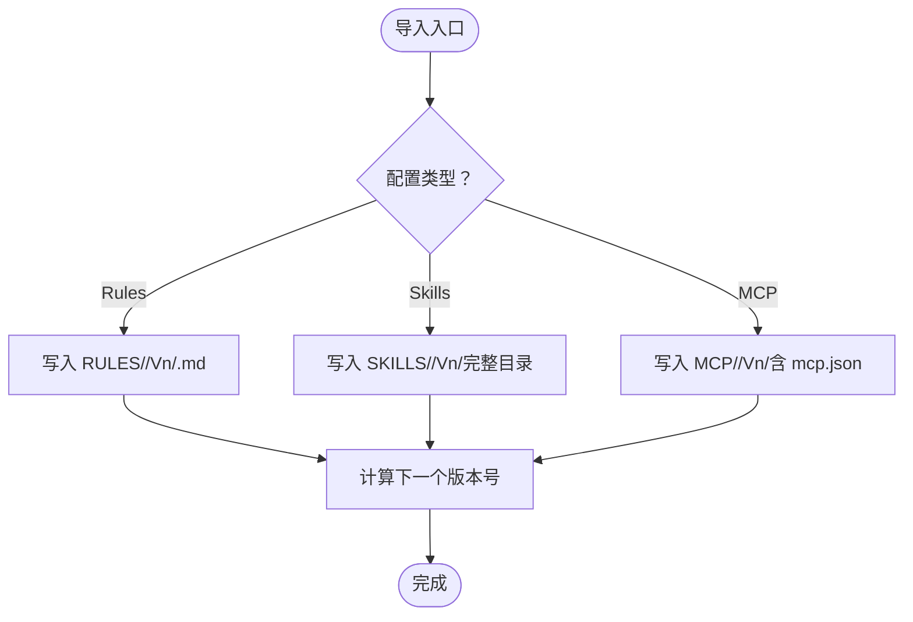
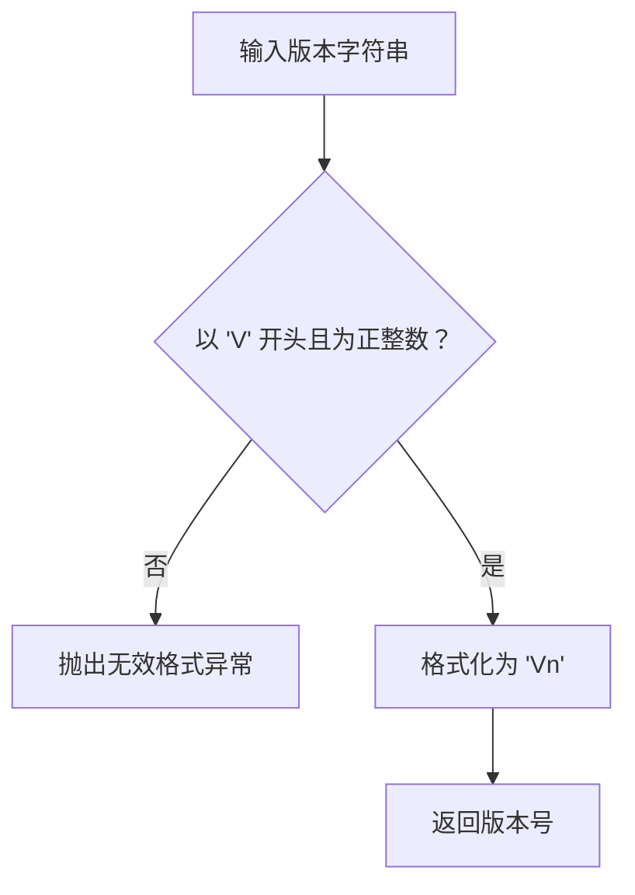
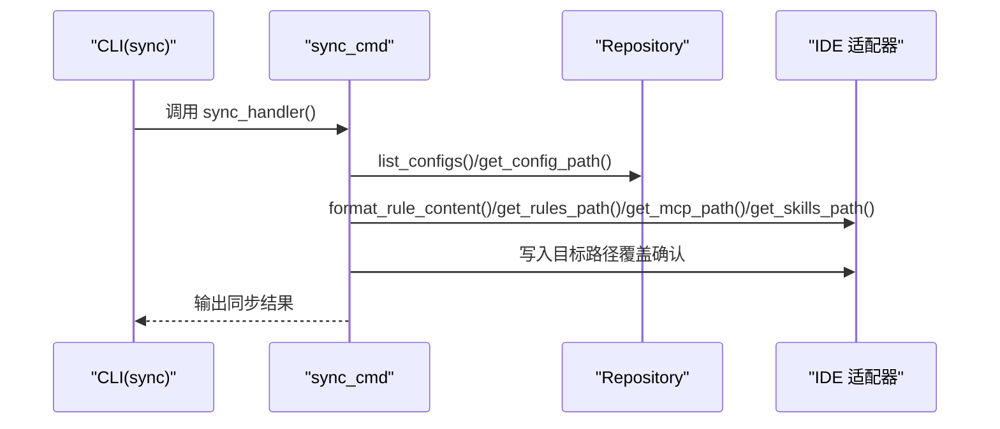
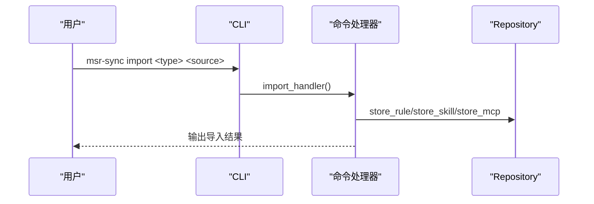
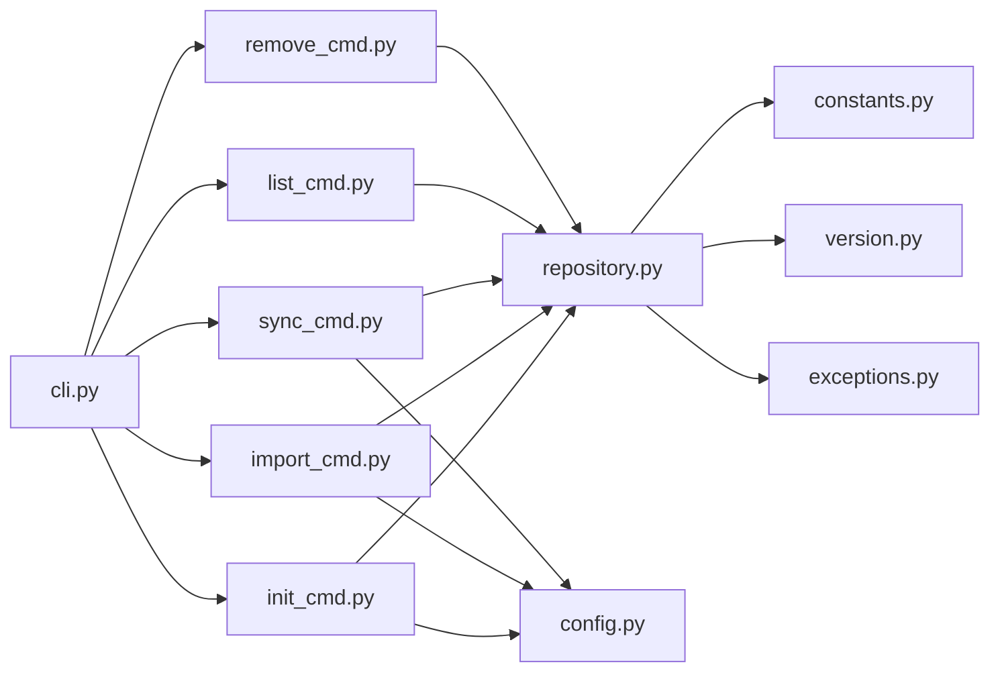

# 统一仓库设计

<cite>
**本文引用的文件**
- [repository.py](file://MSR-cli/msr_sync/core/repository.py)
- [config.py](file://MSR-cli/msr_sync/core/config.py)
- [constants.py](file://MSR-cli/msr_sync/constants.py)
- [version.py](file://MSR-cli/msr_sync/core/version.py)
- [exceptions.py](file://MSR-cli/msr_sync/core/exceptions.py)
- [cli.py](file://MSR-cli/msr_sync/cli.py)
- [init_cmd.py](file://MSR-cli/msr_sync/commands/init_cmd.py)
- [import_cmd.py](file://MSR-cli/msr_sync/commands/import_cmd.py)
- [list_cmd.py](file://MSR-cli/msr_sync/commands/list_cmd.py)
- [remove_cmd.py](file://MSR-cli/msr_sync/commands/remove_cmd.py)
- [sync_cmd.py](file://MSR-cli/msr_sync/commands/sync_cmd.py)
- [usage.md](file://MSR-cli/docs/usage.md)
- [README.md](file://MSR-cli/README.md)
- [pyproject.toml](file://MSR-cli/pyproject.toml)
</cite>

## 目录
1. [简介](#简介)
2. [项目结构](#项目结构)
3. [核心组件](#核心组件)
4. [架构总览](#架构总览)
5. [详细组件分析](#详细组件分析)
6. [依赖关系分析](#依赖关系分析)
7. [性能考量](#性能考量)
8. [故障排除指南](#故障排除指南)
9. [结论](#结论)
10. [附录](#附录)

## 简介
本文件系统化阐述 MSR-v2 统一仓库的设计与实现，重点围绕统一仓库的目录结构、版本化存储机制、初始化流程、配置管理、跨平台兼容性、与其他组件的交互关系，以及迁移与备份策略、维护与故障排除建议。统一仓库作为“单一可信源”，集中管理 rules、skills、MCP 三类配置，支持多版本演进与跨 IDE 同步。

## 项目结构
MSR-cli 作为命令行工具，统一仓库位于用户主目录下的固定路径，采用三层目录结构：
- 仓库根目录：默认 ~/.msr-repos
- 一级子目录：RULES、SKILLS、MCP（分别对应三类配置）
- 二级子目录：每个配置名称作为子目录
- 三级子目录：V1、V2、V3…（版本号，递增正整数）

图表来源
- [README.md:240-265](file://MSR-cli/README.md#L240-L265)
- [constants.py:10-13](file://MSR-cli/msr_sync/constants.py#L10-L13)

章节来源
- [README.md:240-265](file://MSR-cli/README.md#L240-L265)
- [constants.py:10-13](file://MSR-cli/msr_sync/constants.py#L10-L13)

## 核心组件
- 仓库操作类：负责仓库初始化、目录存在性检查、配置存储、路径解析、版本查询、删除、读取等。
- 全局配置模块：负责加载与生成 ~/.msr-sync/config.yaml，解析仓库路径、忽略模式、默认 IDE、默认作用域等。
- 版本管理模块：负责版本号解析、格式化、排序、获取最新版本、计算下一个版本号。
- 命令入口与命令处理器：CLI 定义 init/import/sync/list/remove 等命令，命令处理器封装业务逻辑。
- 异常体系：统一错误类型，便于上层 CLI 捕获并输出用户友好的提示。

章节来源
- [repository.py:23-291](file://MSR-cli/msr_sync/core/repository.py#L23-L291)
- [config.py:18-204](file://MSR-cli/msr_sync/core/config.py#L18-L204)
- [version.py:9-119](file://MSR-cli/msr_sync/core/version.py#L9-L119)
- [cli.py:8-116](file://MSR-cli/msr_sync/cli.py#L8-L116)
- [exceptions.py:4-34](file://MSR-cli/msr_sync/core/exceptions.py#L4-L34)

## 架构总览
统一仓库围绕“仓库根目录 + 三类配置目录 + 多版本目录”的扁平树形结构组织，配合版本号管理与命令行工具形成完整的导入、同步、查看、删除、初始化流程。

图表来源
- [cli.py:8-116](file://MSR-cli/msr_sync/cli.py#L8-L116)
- [init_cmd.py:13-137](file://MSR-cli/msr_sync/commands/init_cmd.py#L13-L137)
- [import_cmd.py:14-151](file://MSR-cli/msr_sync/commands/import_cmd.py#L14-L151)
- [sync_cmd.py:26-411](file://MSR-cli/msr_sync/commands/sync_cmd.py#L26-L411)
- [list_cmd.py:12-63](file://MSR-cli/msr_sync/commands/list_cmd.py#L12-L63)
- [remove_cmd.py:12-43](file://MSR-cli/msr_sync/commands/remove_cmd.py#L12-L43)
- [repository.py:23-291](file://MSR-cli/msr_sync/core/repository.py#L23-L291)
- [config.py:18-204](file://MSR-cli/msr_sync/core/config.py#L18-L204)
- [version.py:9-119](file://MSR-cli/msr_sync/core/version.py#L9-L119)
- [constants.py:16-50](file://MSR-cli/msr_sync/constants.py#L16-L50)
- [exceptions.py:4-34](file://MSR-cli/msr_sync/core/exceptions.py#L4-L34)

## 详细组件分析

### 仓库初始化与目录结构
- 初始化幂等：若仓库根目录不存在则创建 RULES/SKILLS/MCP 三个子目录；若已存在则跳过创建。
- 默认仓库路径：来自全局配置模块，支持 ~ 展开与默认值回退。
- 合并已有配置：init --merge 会扫描适配器，读取各 IDE 现有配置并导入统一仓库。

图表来源
- [cli.py:14-24](file://MSR-cli/msr_sync/cli.py#L14-L24)
- [init_cmd.py:13-42](file://MSR-cli/msr_sync/commands/init_cmd.py#L13-L42)
- [repository.py:40-51](file://MSR-cli/msr_sync/core/repository.py#L40-L51)
- [config.py:187-204](file://MSR-cli/msr_sync/core/config.py#L187-L204)

章节来源
- [init_cmd.py:13-42](file://MSR-cli/msr_sync/commands/init_cmd.py#L13-L42)
- [repository.py:40-51](file://MSR-cli/msr_sync/core/repository.py#L40-L51)
- [config.py:187-204](file://MSR-cli/msr_sync/core/config.py#L187-L204)

### 配置存储与命名约定
- Rules：以 .md 文件为单位，文件名（不含扩展名）作为配置名称；内容写入 RULES/<name>/Vn/<name>.md。
- Skills：以目录为单位，根目录需包含 SKILL.md；内容写入 SKILLS/<name>/Vn/（完整目录树）。
- MCP：以目录为单位，根目录需包含 mcp.json；内容写入 MCP/<name>/Vn/（完整目录树）。
- 版本号：V1/V2/V3…，自动递增；同一名称的多次导入会创建新版本。

图表来源
- [repository.py:89-158](file://MSR-cli/msr_sync/core/repository.py#L89-L158)
- [constants.py:39-43](file://MSR-cli/msr_sync/constants.py#L39-L43)
- [version.py:103-119](file://MSR-cli/msr_sync/core/version.py#L103-L119)

章节来源
- [repository.py:89-158](file://MSR-cli/msr_sync/core/repository.py#L89-L158)
- [constants.py:39-43](file://MSR-cli/msr_sync/constants.py#L39-L43)
- [version.py:103-119](file://MSR-cli/msr_sync/core/version.py#L103-L119)

### 版本化存储机制
- 版本解析与格式化：支持 V1/V2 等格式，拒绝非法格式（如前导零、非数字后缀）。
- 版本排序与最新版本：按数字升序返回版本列表，最新版本为最大版本号。
- 下一个版本：若无版本则返回 V1，否则在最大版本号基础上 +1。

图表来源
- [version.py:9-44](file://MSR-cli/msr_sync/core/version.py#L9-L44)
- [version.py:47-57](file://MSR-cli/msr_sync/core/version.py#L47-L57)
- [version.py:59-101](file://MSR-cli/msr_sync/core/version.py#L59-L101)
- [version.py:103-119](file://MSR-cli/msr_sync/core/version.py#L103-L119)

章节来源
- [version.py:9-119](file://MSR-cli/msr_sync/core/version.py#L9-L119)

### 路径解析与跨平台兼容性
- 仓库路径解析：支持 ~ 展开、默认值回退、路径规范化。
- 平台支持：明确支持 macOS 与 Windows；IDE 配置路径随平台解析。
- IDE 路径参考：README 提供各 IDE 在不同平台的配置路径，便于适配器解析。

章节来源
- [config.py:46-79](file://MSR-cli/msr_sync/core/config.py#L46-L79)
- [README.md:128-133](file://MSR-cli/README.md#L128-L133)
- [usage.md:477-522](file://MSR-cli/docs/usage.md#L477-L522)

### 与其他组件的交互关系
- CLI：定义 init/import/sync/list/remove 等命令，捕获异常并输出用户提示。
- 适配器：sync 命令通过适配器将仓库中的配置写入各 IDE 的目标路径；MCP 同步时进行合并与覆盖确认。
- 全局配置：init 生成默认配置文件；sync/list/remove/import 等命令读取配置决定默认行为。

图表来源
- [cli.py:58-82](file://MSR-cli/msr_sync/cli.py#L58-L82)
- [sync_cmd.py:26-131](file://MSR-cli/msr_sync/commands/sync_cmd.py#L26-L131)
- [repository.py:160-200](file://MSR-cli/msr_sync/core/repository.py#L160-L200)

章节来源
- [cli.py:58-82](file://MSR-cli/msr_sync/cli.py#L58-L82)
- [sync_cmd.py:26-131](file://MSR-cli/msr_sync/commands/sync_cmd.py#L26-L131)
- [repository.py:160-200](file://MSR-cli/msr_sync/core/repository.py#L160-L200)

### 命令行工作流
- init：初始化仓库并生成默认配置文件；可选择合并已有 IDE 配置。
- import：解析来源（文件/目录/压缩包/URL），按类型导入到统一仓库。
- sync：按 IDE、scope、type、name、version 精确控制同步范围，支持覆盖确认。
- list：以树形结构展示仓库中的配置与版本。
- remove：删除指定配置版本。

图表来源
- [cli.py:27-39](file://MSR-cli/msr_sync/cli.py#L27-L39)
- [import_cmd.py:14-56](file://MSR-cli/msr_sync/commands/import_cmd.py#L14-L56)
- [repository.py:89-158](file://MSR-cli/msr_sync/core/repository.py#L89-L158)

章节来源
- [cli.py:27-39](file://MSR-cli/msr_sync/cli.py#L27-L39)
- [import_cmd.py:14-56](file://MSR-cli/msr_sync/commands/import_cmd.py#L14-L56)
- [repository.py:89-158](file://MSR-cli/msr_sync/core/repository.py#L89-L158)

## 依赖关系分析
- 模块内聚与耦合：
  - repository.py 依赖 constants.py（目录名、版本前缀、文件名常量）、version.py（版本解析与计算）、exceptions.py（异常类型）。
  - commands/* 依赖 repository.py 与 constants.py，同时在 CLI 层捕获异常并输出。
  - config.py 为全局配置单例，被 CLI 与 init_cmd 使用。
- 外部依赖：
  - Click 用于命令行接口。
  - PyYAML 用于配置文件解析。
  - Python 标准库（pathlib、shutil、json、yaml、glob 等）。

图表来源
- [repository.py:7-9](file://MSR-cli/msr_sync/core/repository.py#L7-L9)
- [version.py:6](file://MSR-cli/msr_sync/core/version.py#L6)
- [constants.py:3-6](file://MSR-cli/msr_sync/constants.py#L3-L6)
- [init_cmd.py:9-10](file://MSR-cli/msr_sync/commands/init_cmd.py#L9-L10)
- [import_cmd.py:8-11](file://MSR-cli/msr_sync/commands/import_cmd.py#L8-L11)
- [sync_cmd.py:14-23](file://MSR-cli/msr_sync/commands/sync_cmd.py#L14-L23)
- [list_cmd.py:8-9](file://MSR-cli/msr_sync/commands/list_cmd.py#L8-L9)
- [remove_cmd.py:8-9](file://MSR-cli/msr_sync/commands/remove_cmd.py#L8-L9)
- [cli.py:3-5](file://MSR-cli/msr_sync/cli.py#L3-L5)
- [config.py:3-6](file://MSR-cli/msr_sync/core/config.py#L3-L6)

章节来源
- [pyproject.toml:18-21](file://MSR-cli/pyproject.toml#L18-L21)

## 性能考量
- 目录遍历与排序：list 与版本查询对目录进行遍历与排序，建议避免在超大仓库中频繁执行；可通过按类型过滤减少扫描范围。
- 文件读写：MCP 合并与 Skills 拷贝涉及大量小文件读写，建议在本地 SSD 上存放仓库以提升性能。
- 并发与网络：import 从 URL 导入时受网络影响，建议在稳定网络环境下进行批量导入。
- 内存占用：MCP JSON 合并时会加载目标文件至内存，建议控制单个 MCP 配置规模。

## 故障排除指南
- 仓库未初始化：执行 init 或在命令中添加 --merge。
- 配置不存在：使用 list 查看当前仓库配置与版本，确认名称与版本号。
- 无效导入来源：检查文件/目录是否存在、压缩包格式是否受支持、URL 是否可达。
- 网络错误：检查网络连通性与代理设置。
- 压缩包解压失败：确认压缩包完整性与格式。
- MCP 配置格式错误：检查 mcp.json 是否为合法 JSON。
- 不支持的操作系统：当前仅支持 macOS 与 Windows。
- 权限不足：检查目标路径写权限。
- 配置文件 YAML 语法错误：修正缩进、冒号与引号问题，或删除后重新生成默认配置。
- IDE 名称或默认作用域无效：修正配置文件中的 default_ides 与 default_scope。

章节来源
- [usage.md:634-759](file://MSR-cli/docs/usage.md#L634-L759)
- [exceptions.py:4-34](file://MSR-cli/msr_sync/core/exceptions.py#L4-L34)

## 结论
MSR-v2 的统一仓库通过清晰的目录结构与版本化机制，实现了 rules、skills、MCP 三类配置的集中管理与跨 IDE 同步。结合全局配置与命令行工具，用户可在多 IDE 间高效迁移与复用配置，同时保留版本演进能力。建议在本地高性能存储中维护仓库，并遵循本文提供的迁移、备份与维护策略，确保长期稳定运行。

## 附录

### 仓库迁移与备份策略
- 迁移策略：
  - 使用 init --merge 一键扫描并导入各 IDE 现有配置。
  - 导入后通过 list 校验完整性，再执行 sync 同步到目标 IDE。
- 备份策略：
  - 直接备份 ~/.msr-repos 整体目录。
  - 建议定期将仓库纳入版本控制或云存储，保留多版本快照。
- 迁移注意事项：
  - 不同 IDE 的 frontmatter 规范差异由工具自动处理，无需手工调整。
  - MCP 的 cwd 字段在同步时会被重写为仓库路径，确保服务可正确启动。

章节来源
- [init_cmd.py:44-137](file://MSR-cli/msr_sync/commands/init_cmd.py#L44-L137)
- [README.md:240-295](file://MSR-cli/README.md#L240-L295)

### 仓库维护与故障排除清单
- 日常维护：
  - 定期执行 list 检查仓库状态与版本数量。
  - 清理不再使用的旧版本（remove）。
- 常见问题快速定位：
  - 仓库未初始化：执行 init。
  - 同步失败：检查 IDE 支持情况与目标路径权限。
  - 配置文件错误：修正 YAML 语法或删除后重新生成默认配置。

章节来源
- [list_cmd.py:12-63](file://MSR-cli/msr_sync/commands/list_cmd.py#L12-L63)
- [remove_cmd.py:12-43](file://MSR-cli/msr_sync/commands/remove_cmd.py#L12-L43)
- [usage.md:634-759](file://MSR-cli/docs/usage.md#L634-L759)