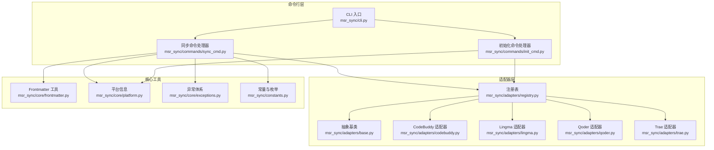
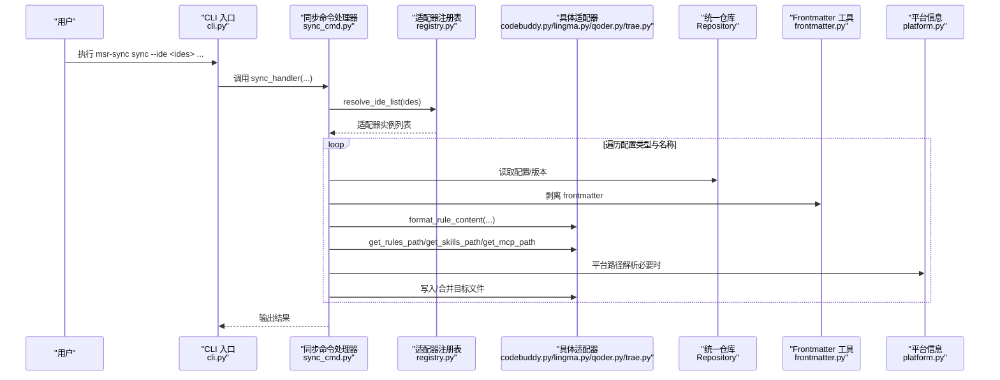
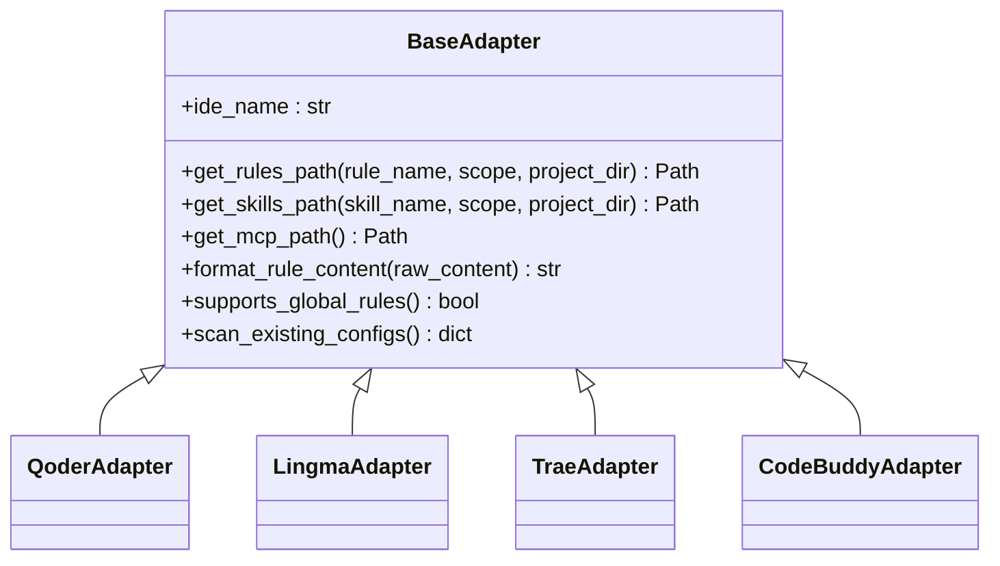
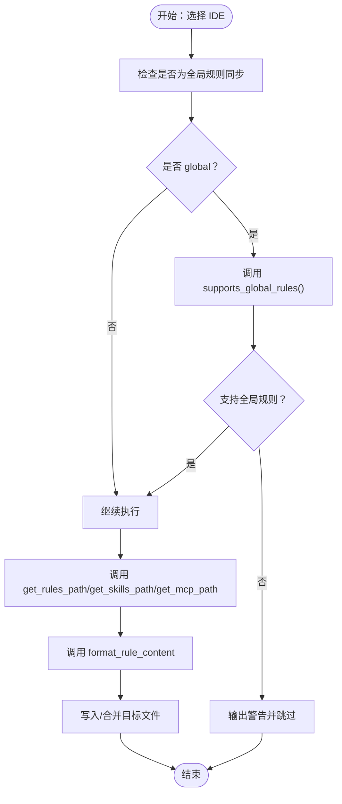
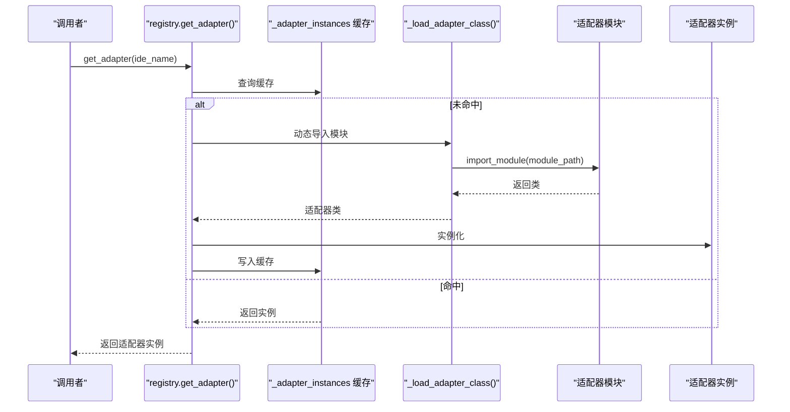
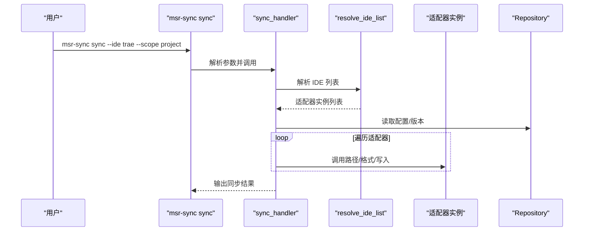
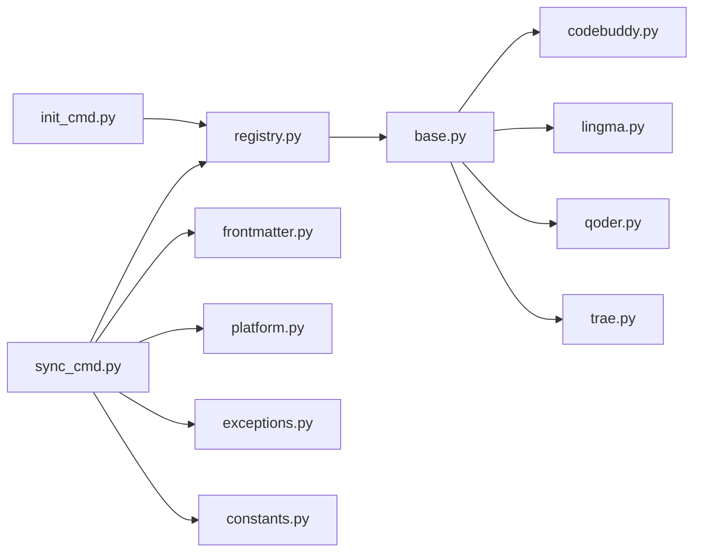

# 适配器模式应用

<cite>
**本文引用的文件**
- [MSR-cli/msr_sync/adapters/base.py](file://MSR-cli/msr_sync/adapters/base.py)
- [MSR-cli/msr_sync/adapters/registry.py](file://MSR-cli/msr_sync/adapters/registry.py)
- [MSR-cli/msr_sync/adapters/__init__.py](file://MSR-cli/msr_sync/adapters/__init__.py)
- [MSR-cli/msr_sync/adapters/codebuddy.py](file://MSR-cli/msr_sync/adapters/codebuddy.py)
- [MSR-cli/msr_sync/adapters/lingma.py](file://MSR-cli/msr_sync/adapters/lingma.py)
- [MSR-cli/msr_sync/adapters/qoder.py](file://MSR-cli/msr_sync/adapters/qoder.py)
- [MSR-cli/msr_sync/adapters/trae.py](file://MSR-cli/msr_sync/adapters/trae.py)
- [MSR-cli/msr_sync/core/frontmatter.py](file://MSR-cli/msr_sync/core/frontmatter.py)
- [MSR-cli/msr_sync/core/platform.py](file://MSR-cli/msr_sync/core/platform.py)
- [MSR-cli/msr_sync/commands/sync_cmd.py](file://MSR-cli/msr_sync/commands/sync_cmd.py)
- [MSR-cli/msr_sync/commands/init_cmd.py](file://MSR-cli/msr_sync/commands/init_cmd.py)
- [MSR-cli/msr_sync/cli.py](file://MSR-cli/msr_sync/cli.py)
- [MSR-cli/msr_sync/constants.py](file://MSR-cli/msr_sync/constants.py)
- [MSR-cli/msr_sync/core/exceptions.py](file://MSR-cli/msr_sync/core/exceptions.py)
- [MSR-cli/tests/test_adapters.py](file://MSR-cli/tests/test_adapters.py)
- [MSR-cli/pyproject.toml](file://MSR-cli/pyproject.toml)
</cite>

## 目录
1. [引言](#引言)
2. [项目结构](#项目结构)
3. [核心组件](#核心组件)
4. [架构总览](#架构总览)
5. [详细组件分析](#详细组件分析)
6. [依赖分析](#依赖分析)
7. [性能考虑](#性能考虑)
8. [故障排查指南](#故障排查指南)
9. [结论](#结论)
10. [附录](#附录)

## 引言
本文件系统化阐述 MSR-v2 中“适配器模式”的设计理念与实现细节，聚焦于如何通过统一抽象接口屏蔽不同 AI IDE（如 Qoder、Lingma、Trae、CodeBuddy、Cursor）之间的差异，实现规则（rules）、技能（skills）、MCP 配置的跨 IDE 同步与初始化。文档涵盖：
- 抽象基类设计与职责边界
- 具体适配器实现与差异化处理
- 适配器注册表与延迟加载机制
- 命令行层对适配器的集成与调度
- 新适配器开发指南与最佳实践
- 性能优化与错误处理策略

## 项目结构
MSR-cli 子模块围绕“适配器层”组织，核心目录与文件如下：
- 适配器层：adapters（抽象基类、具体适配器、注册表）
- 核心工具：core（frontmatter、platform、exceptions、constants）
- 命令行入口与命令处理器：cli、commands
- 测试：tests（覆盖适配器行为与注册表）

**图表来源**
- [MSR-cli/msr_sync/cli.py:1-116](file://MSR-cli/msr_sync/cli.py#L1-L116)
- [MSR-cli/msr_sync/commands/sync_cmd.py:1-411](file://MSR-cli/msr_sync/commands/sync_cmd.py#L1-L411)
- [MSR-cli/msr_sync/commands/init_cmd.py:1-137](file://MSR-cli/msr_sync/commands/init_cmd.py#L1-L137)
- [MSR-cli/msr_sync/adapters/base.py:1-105](file://MSR-cli/msr_sync/adapters/base.py#L1-L105)
- [MSR-cli/msr_sync/adapters/registry.py:1-89](file://MSR-cli/msr_sync/adapters/registry.py#L1-L89)
- [MSR-cli/msr_sync/adapters/codebuddy.py:1-143](file://MSR-cli/msr_sync/adapters/codebuddy.py#L1-L143)
- [MSR-cli/msr_sync/adapters/lingma.py:1-140](file://MSR-cli/msr_sync/adapters/lingma.py#L1-L140)
- [MSR-cli/msr_sync/adapters/qoder.py:1-140](file://MSR-cli/msr_sync/adapters/qoder.py#L1-L140)
- [MSR-cli/msr_sync/adapters/trae.py:1-138](file://MSR-cli/msr_sync/adapters/trae.py#L1-L138)
- [MSR-cli/msr_sync/core/frontmatter.py:1-164](file://MSR-cli/msr_sync/core/frontmatter.py#L1-L164)
- [MSR-cli/msr_sync/core/platform.py:1-60](file://MSR-cli/msr_sync/core/platform.py#L1-L60)
- [MSR-cli/msr_sync/core/exceptions.py:1-34](file://MSR-cli/msr_sync/core/exceptions.py#L1-L34)
- [MSR-cli/msr_sync/constants.py:1-50](file://MSR-cli/msr_sync/constants.py#L1-L50)

**章节来源**
- [MSR-cli/msr_sync/cli.py:1-116](file://MSR-cli/msr_sync/cli.py#L1-L116)
- [MSR-cli/msr_sync/commands/sync_cmd.py:1-411](file://MSR-cli/msr_sync/commands/sync_cmd.py#L1-L411)
- [MSR-cli/msr_sync/commands/init_cmd.py:1-137](file://MSR-cli/msr_sync/commands/init_cmd.py#L1-L137)
- [MSR-cli/msr_sync/adapters/base.py:1-105](file://MSR-cli/msr_sync/adapters/base.py#L1-L105)
- [MSR-cli/msr_sync/adapters/registry.py:1-89](file://MSR-cli/msr_sync/adapters/registry.py#L1-L89)
- [MSR-cli/msr_sync/adapters/codebuddy.py:1-143](file://MSR-cli/msr_sync/adapters/codebuddy.py#L1-L143)
- [MSR-cli/msr_sync/adapters/lingma.py:1-140](file://MSR-cli/msr_sync/adapters/lingma.py#L1-L140)
- [MSR-cli/msr_sync/adapters/qoder.py:1-140](file://MSR-cli/msr_sync/adapters/qoder.py#L1-L140)
- [MSR-cli/msr_sync/adapters/trae.py:1-138](file://MSR-cli/msr_sync/adapters/trae.py#L1-L138)
- [MSR-cli/msr_sync/core/frontmatter.py:1-164](file://MSR-cli/msr_sync/core/frontmatter.py#L1-L164)
- [MSR-cli/msr_sync/core/platform.py:1-60](file://MSR-cli/msr_sync/core/platform.py#L1-L60)
- [MSR-cli/msr_sync/core/exceptions.py:1-34](file://MSR-cli/msr_sync/core/exceptions.py#L1-L34)
- [MSR-cli/msr_sync/constants.py:1-50](file://MSR-cli/msr_sync/constants.py#L1-L50)

## 核心组件
- 抽象基类 BaseAdapter：定义统一接口，包括路径解析、格式转换、能力查询、配置扫描等，确保所有 IDE 适配器遵循一致契约。
- 具体适配器：Qoder、Lingma、Trae、CodeBuddy、Cursor（注册表中包含）分别实现各自差异化逻辑（路径约定、头部模板、平台路径、扫描策略）。
- 注册表 registry：集中管理 IDE 名称到适配器类的映射，提供延迟加载与实例缓存，支持“all”展开与解析 IDE 列表。
- 命令处理器：sync_cmd 与 init_cmd 通过注册表获取适配器实例，驱动统一仓库与 IDE 之间的双向同步与导入。

**章节来源**
- [MSR-cli/msr_sync/adapters/base.py:8-105](file://MSR-cli/msr_sync/adapters/base.py#L8-L105)
- [MSR-cli/msr_sync/adapters/registry.py:8-89](file://MSR-cli/msr_sync/adapters/registry.py#L8-L89)
- [MSR-cli/msr_sync/commands/sync_cmd.py:26-131](file://MSR-cli/msr_sync/commands/sync_cmd.py#L26-L131)
- [MSR-cli/msr_sync/commands/init_cmd.py:13-42](file://MSR-cli/msr_sync/commands/init_cmd.py#L13-L42)

## 架构总览
适配器模式在 MSR-v2 中的落地体现为“统一接口 + 多态实现 + 注册表调度”。命令行层通过 Click 定义子命令，命令处理器解析参数后，委托注册表解析 IDE 列表，再由具体适配器完成差异化处理。

**图表来源**
- [MSR-cli/msr_sync/cli.py:58-82](file://MSR-cli/msr_sync/cli.py#L58-L82)
- [MSR-cli/msr_sync/commands/sync_cmd.py:26-131](file://MSR-cli/msr_sync/commands/sync_cmd.py#L26-L131)
- [MSR-cli/msr_sync/adapters/registry.py:46-89](file://MSR-cli/msr_sync/adapters/registry.py#L46-L89)
- [MSR-cli/msr_sync/adapters/codebuddy.py:22-143](file://MSR-cli/msr_sync/adapters/codebuddy.py#L22-L143)
- [MSR-cli/msr_sync/adapters/lingma.py:22-140](file://MSR-cli/msr_sync/adapters/lingma.py#L22-L140)
- [MSR-cli/msr_sync/adapters/qoder.py:22-140](file://MSR-cli/msr_sync/adapters/qoder.py#L22-L140)
- [MSR-cli/msr_sync/adapters/trae.py:21-138](file://MSR-cli/msr_sync/adapters/trae.py#L21-L138)
- [MSR-cli/msr_sync/core/frontmatter.py:10-23](file://MSR-cli/msr_sync/core/frontmatter.py#L10-L23)
- [MSR-cli/msr_sync/core/platform.py:9-60](file://MSR-cli/msr_sync/core/platform.py#L9-L60)

## 详细组件分析

### 抽象基类 BaseAdapter 设计
- 职责边界清晰：统一定义路径解析（rules/skills/MCP）、格式转换、能力查询（如全局规则支持）、配置扫描等接口，保证多 IDE 的一致性体验。
- 可扩展性：通过抽象方法约束实现，同时提供默认能力（如全局规则支持默认返回 False），便于新增 IDE 时快速对齐。
- 关键接口要点：
  - ide_name：IDE 标识，用于注册表与输出提示。
  - 路径解析：get_rules_path、get_skills_path、get_mcp_path，支持 project/global 两级作用域。
  - 格式转换：format_rule_content，将剥离 frontmatter 的内容转为 IDE 特定头部。
  - 能力查询：supports_global_rules，默认 False，CodeBuddy 覆盖为 True。
  - 配置扫描：scan_existing_configs，返回规则、技能、MCP 的现有配置清单。

**图表来源**
- [MSR-cli/msr_sync/adapters/base.py:8-105](file://MSR-cli/msr_sync/adapters/base.py#L8-L105)
- [MSR-cli/msr_sync/adapters/qoder.py:22-140](file://MSR-cli/msr_sync/adapters/qoder.py#L22-L140)
- [MSR-cli/msr_sync/adapters/lingma.py:22-140](file://MSR-cli/msr_sync/adapters/lingma.py#L22-L140)
- [MSR-cli/msr_sync/adapters/trae.py:21-138](file://MSR-cli/msr_sync/adapters/trae.py#L21-L138)
- [MSR-cli/msr_sync/adapters/codebuddy.py:22-143](file://MSR-cli/msr_sync/adapters/codebuddy.py#L22-L143)

**章节来源**
- [MSR-cli/msr_sync/adapters/base.py:8-105](file://MSR-cli/msr_sync/adapters/base.py#L8-L105)

### 具体适配器实现与差异化处理
- CodeBuddy
  - 支持全局规则；MCP 跨平台统一路径；规则头部包含时间戳等字段。
  - 路径解析与扫描：参考 [MSR-cli/msr_sync/adapters/codebuddy.py:31-143](file://MSR-cli/msr_sync/adapters/codebuddy.py#L31-L143)。
- Lingma / Qoder
  - 仅支持项目级规则；MCP 路径位于应用数据目录；规则头部统一为 trigger: always_on。
  - 路径解析与扫描：参考 [MSR-cli/msr_sync/adapters/lingma.py:31-140](file://MSR-cli/msr_sync/adapters/lingma.py#L31-L140)、[MSR-cli/msr_sync/adapters/qoder.py:31-140](file://MSR-cli/msr_sync/adapters/qoder.py#L31-L140)。
- Trae
  - 仅支持项目级规则；全局技能路径使用 .trae-cn；规则内容不添加额外头部。
  - 路径解析与扫描：参考 [MSR-cli/msr_sync/adapters/trae.py:30-138](file://MSR-cli/msr_sync/adapters/trae.py#L30-L138)。
- Cursor
  - 注册表包含 Cursor，其规则头部与 CodeBuddy 类似（含时间戳），路径约定与 CodeBuddy 类似。
  - 参考注册表映射：[MSR-cli/msr_sync/adapters/registry.py:10-16](file://MSR-cli/msr_sync/adapters/registry.py#L10-L16)。

**图表来源**
- [MSR-cli/msr_sync/commands/sync_cmd.py:204-230](file://MSR-cli/msr_sync/commands/sync_cmd.py#L204-L230)
- [MSR-cli/msr_sync/adapters/base.py:80-89](file://MSR-cli/msr_sync/adapters/base.py#L80-L89)

**章节来源**
- [MSR-cli/msr_sync/adapters/codebuddy.py:31-143](file://MSR-cli/msr_sync/adapters/codebuddy.py#L31-L143)
- [MSR-cli/msr_sync/adapters/lingma.py:31-140](file://MSR-cli/msr_sync/adapters/lingma.py#L31-L140)
- [MSR-cli/msr_sync/adapters/qoder.py:31-140](file://MSR-cli/msr_sync/adapters/qoder.py#L31-L140)
- [MSR-cli/msr_sync/adapters/trae.py:30-138](file://MSR-cli/msr_sync/adapters/trae.py#L30-L138)

### 适配器注册表与延迟加载
- 映射表：_ADAPTER_REGISTRY 将 IDE 名称映射到模块路径与类名，支持 qoder、lingma、trae、codebuddy、cursor。
- 实例缓存：_adapter_instances 避免重复创建实例，提升性能。
- 延迟加载：_load_adapter_class 动态导入模块并获取类，未注册的 IDE 抛出 ValueError。
- 列表解析：resolve_ide_list 支持传入 ("all",) 展开为全部适配器，或指定多个 IDE 名称。

**图表来源**
- [MSR-cli/msr_sync/adapters/registry.py:22-63](file://MSR-cli/msr_sync/adapters/registry.py#L22-L63)

**章节来源**
- [MSR-cli/msr_sync/adapters/registry.py:8-89](file://MSR-cli/msr_sync/adapters/registry.py#L8-L89)

### 命令行集成与工作流
- CLI 定义 sync/list/import/remove 等子命令，其中 sync 命令支持 --ide、--scope、--type、--name、--version 等参数。
- sync_handler 解析参数、获取适配器列表、遍历统一仓库配置并逐项同步。
- init_handler 在 --merge 模式下扫描所有适配器现有配置并导入统一仓库。

**图表来源**
- [MSR-cli/msr_sync/cli.py:58-82](file://MSR-cli/msr_sync/cli.py#L58-L82)
- [MSR-cli/msr_sync/commands/sync_cmd.py:26-131](file://MSR-cli/msr_sync/commands/sync_cmd.py#L26-L131)
- [MSR-cli/msr_sync/commands/init_cmd.py:44-137](file://MSR-cli/msr_sync/commands/init_cmd.py#L44-L137)

**章节来源**
- [MSR-cli/msr_sync/cli.py:14-116](file://MSR-cli/msr_sync/cli.py#L14-L116)
- [MSR-cli/msr_sync/commands/sync_cmd.py:26-131](file://MSR-cli/msr_sync/commands/sync_cmd.py#L26-L131)
- [MSR-cli/msr_sync/commands/init_cmd.py:13-42](file://MSR-cli/msr_sync/commands/init_cmd.py#L13-L42)

### 前端与平台工具
- frontmatter：剥离/解析 YAML frontmatter，生成各 IDE 的头部模板（Qoder、Lingma、CodeBuddy、Cursor）。
- platform：封装平台检测与路径解析（Home、App Support Dir），为适配器提供跨平台能力。

**章节来源**
- [MSR-cli/msr_sync/core/frontmatter.py:10-164](file://MSR-cli/msr_sync/core/frontmatter.py#L10-L164)
- [MSR-cli/msr_sync/core/platform.py:9-60](file://MSR-cli/msr_sync/core/platform.py#L9-L60)

## 依赖分析
- 低耦合高内聚：命令处理器仅依赖注册表与统一仓库接口，不直接耦合具体适配器类。
- 可观测性：注册表集中维护 IDE 到类的映射，便于扩展与审计。
- 运行时依赖：frontmatter 与 platform 作为基础设施被适配器与命令处理器共同使用。

**图表来源**
- [MSR-cli/msr_sync/commands/sync_cmd.py:14-24](file://MSR-cli/msr_sync/commands/sync_cmd.py#L14-L24)
- [MSR-cli/msr_sync/commands/init_cmd.py:9-11](file://MSR-cli/msr_sync/commands/init_cmd.py#L9-L11)
- [MSR-cli/msr_sync/adapters/registry.py:5-6](file://MSR-cli/msr_sync/adapters/registry.py#L5-L6)
- [MSR-cli/msr_sync/adapters/base.py:3-6](file://MSR-cli/msr_sync/adapters/base.py#L3-L6)
- [MSR-cli/msr_sync/core/frontmatter.py:6-8](file://MSR-cli/msr_sync/core/frontmatter.py#L6-L8)
- [MSR-cli/msr_sync/core/platform.py:3-7](file://MSR-cli/msr_sync/core/platform.py#L3-L7)
- [MSR-cli/msr_sync/core/exceptions.py:4-34](file://MSR-cli/msr_sync/core/exceptions.py#L4-L34)
- [MSR-cli/msr_sync/constants.py:3-50](file://MSR-cli/msr_sync/constants.py#L3-L50)

**章节来源**
- [MSR-cli/msr_sync/commands/sync_cmd.py:14-24](file://MSR-cli/msr_sync/commands/sync_cmd.py#L14-L24)
- [MSR-cli/msr_sync/commands/init_cmd.py:9-11](file://MSR-cli/msr_sync/commands/init_cmd.py#L9-L11)
- [MSR-cli/msr_sync/adapters/registry.py:5-6](file://MSR-cli/msr_sync/adapters/registry.py#L5-L6)
- [MSR-cli/msr_sync/adapters/base.py:3-6](file://MSR-cli/msr_sync/adapters/base.py#L3-L6)
- [MSR-cli/msr_sync/core/frontmatter.py:6-8](file://MSR-cli/msr_sync/core/frontmatter.py#L6-L8)
- [MSR-cli/msr_sync/core/platform.py:3-7](file://MSR-cli/msr_sync/core/platform.py#L3-L7)
- [MSR-cli/msr_sync/core/exceptions.py:4-34](file://MSR-cli/msr_sync/core/exceptions.py#L4-L34)
- [MSR-cli/msr_sync/constants.py:3-50](file://MSR-cli/msr_sync/constants.py#L3-L50)

## 性能考虑
- 实例缓存：注册表对适配器实例进行缓存，避免重复实例化带来的开销。
- 延迟加载：仅在需要时动态导入模块，减少启动时的模块加载压力。
- I/O 合并：MCP 合并采用一次性读取/写入策略，减少多次磁盘访问。
- 路径解析最小化：通过 PlatformInfo 统一平台路径，避免重复判断与拼接。

**章节来源**
- [MSR-cli/msr_sync/adapters/registry.py:18-20](file://MSR-cli/msr_sync/adapters/registry.py#L18-L20)
- [MSR-cli/msr_sync/commands/sync_cmd.py:290-349](file://MSR-cli/msr_sync/commands/sync_cmd.py#L290-L349)
- [MSR-cli/msr_sync/core/platform.py:9-60](file://MSR-cli/msr_sync/core/platform.py#L9-L60)

## 故障排查指南
- 不支持的 IDE：注册表对未知 IDE 抛出 ValueError，检查 IDE 名称是否在注册表中。
- 平台不支持：PlatformInfo 在非 macOS/Windows 抛出 UnsupportedPlatformError，确认运行环境。
- 配置解析错误：frontmatter 解析失败或 MCP JSON 格式错误，检查 YAML/JSON 结构。
- 同步失败：sync_cmd 对每项同步进行 try-except 包裹，输出具体失败原因与 IDE 名称，便于定位。
- 初始化合并：init_cmd 在扫描与导入过程中对异常进行捕获并跳过，输出跳过详情。

**章节来源**
- [MSR-cli/msr_sync/adapters/registry.py:35-37](file://MSR-cli/msr_sync/adapters/registry.py#L35-L37)
- [MSR-cli/msr_sync/core/platform.py:22-30](file://MSR-cli/msr_sync/core/platform.py#L22-L30)
- [MSR-cli/msr_sync/core/frontmatter.py:26-60](file://MSR-cli/msr_sync/core/frontmatter.py#L26-L60)
- [MSR-cli/msr_sync/commands/sync_cmd.py:120-125](file://MSR-cli/msr_sync/commands/sync_cmd.py#L120-L125)
- [MSR-cli/msr_sync/commands/init_cmd.py:60-64](file://MSR-cli/msr_sync/commands/init_cmd.py#L60-L64)

## 结论
MSR-v2 通过“抽象基类 + 具体适配器 + 注册表”的组合，实现了多 IDE 的统一接口与差异化处理。该设计具备良好的可扩展性与可维护性，命令行层通过注册表解耦具体实现，frontmatter 与 platform 提供跨平台与格式转换能力。测试覆盖了路径解析、格式转换、能力查询与注册表行为，保障了适配器的一致性与稳定性。

## 附录

### 新适配器开发指南与最佳实践
- 继承 BaseAdapter 并实现必需接口：ide_name、路径解析、格式转换、能力查询、配置扫描。
- 路径约定与平台差异：优先复用 PlatformInfo 获取 Home 与 App Support 目录，确保跨平台兼容。
- 头部模板：通过 frontmatter 工具生成或拼接 IDE 特定头部，保持内容一致性。
- 能力声明：明确 supports_global_rules 返回值，避免全局同步时产生歧义。
- 注册表扩展：在 registry 的映射表中添加新的 IDE 名称与模块路径，确保延迟加载可用。
- 错误处理：对平台不支持、文件不存在、JSON/YAML 解析失败等情况进行显式处理与用户提示。
- 单元测试：参考测试用例的策略与断言，覆盖路径解析、格式转换、能力查询与注册表行为。

**章节来源**
- [MSR-cli/msr_sync/adapters/base.py:8-105](file://MSR-cli/msr_sync/adapters/base.py#L8-L105)
- [MSR-cli/msr_sync/adapters/registry.py:10-16](file://MSR-cli/msr_sync/adapters/registry.py#L10-L16)
- [MSR-cli/msr_sync/core/frontmatter.py:110-164](file://MSR-cli/msr_sync/core/frontmatter.py#L110-L164)
- [MSR-cli/msr_sync/core/platform.py:32-60](file://MSR-cli/msr_sync/core/platform.py#L32-L60)
- [MSR-cli/tests/test_adapters.py:176-240](file://MSR-cli/tests/test_adapters.py#L176-L240)