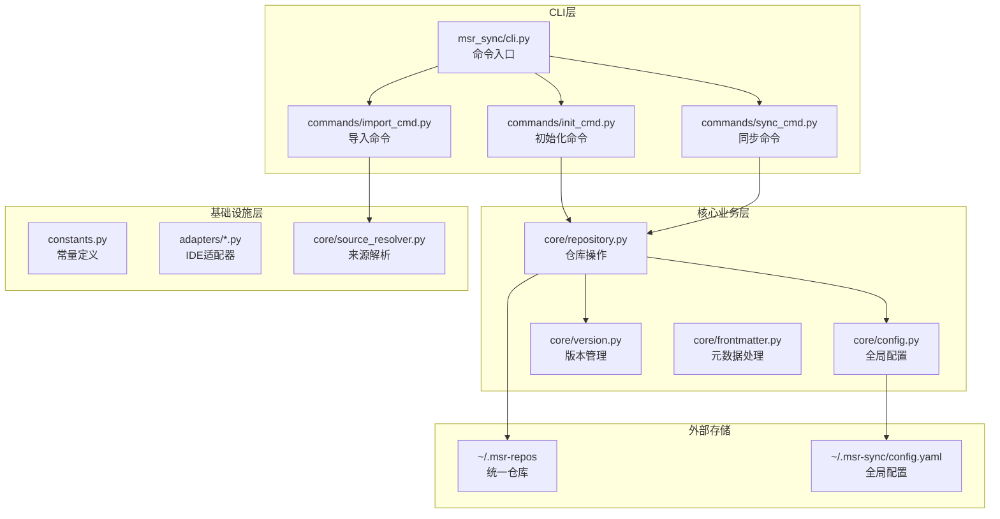
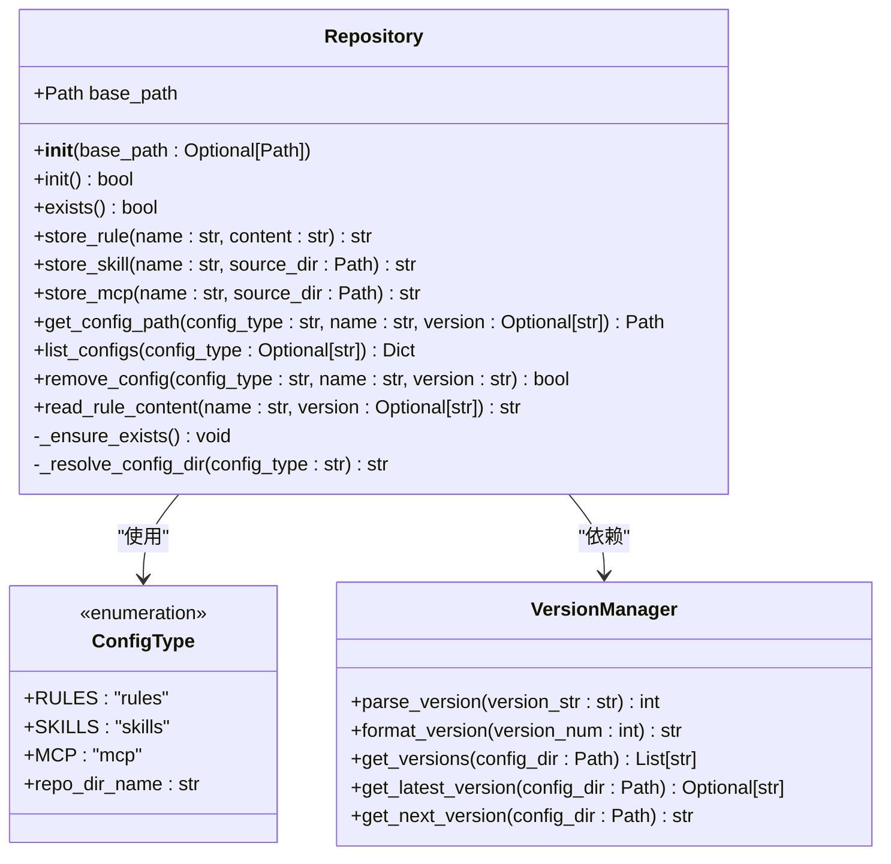
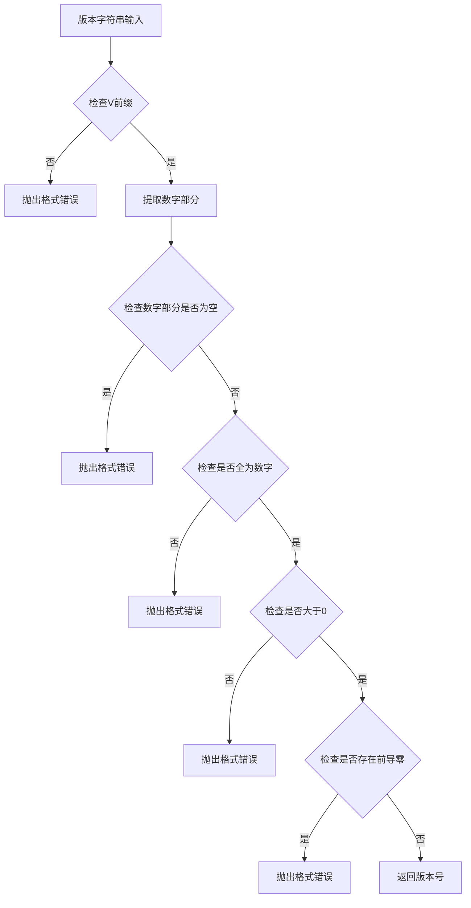
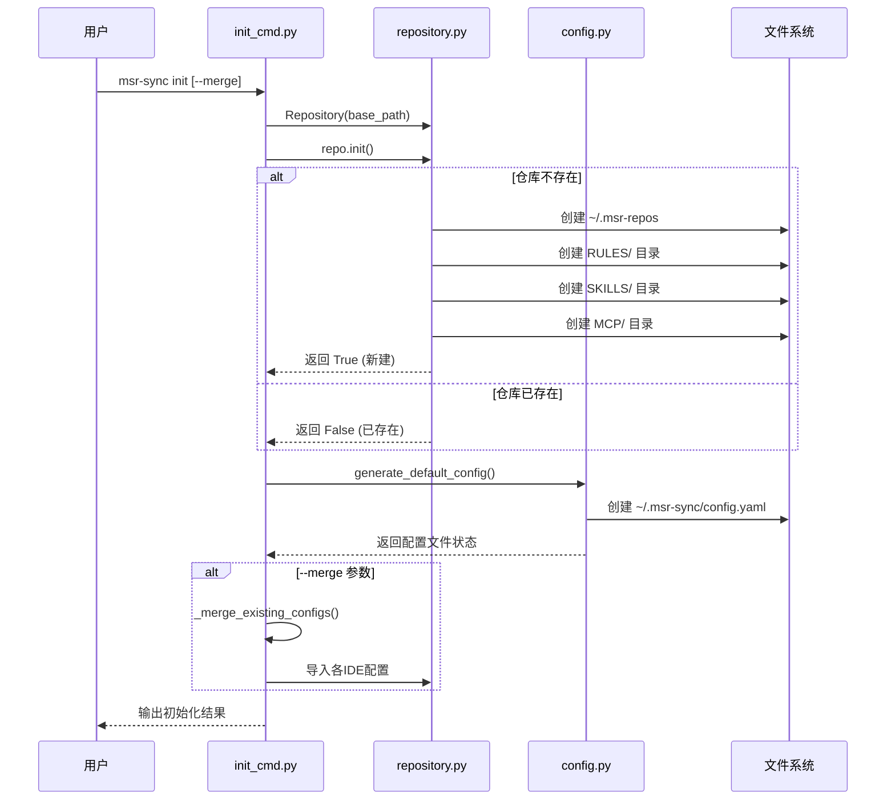

# 仓库结构设计

<cite>
**本文档引用的文件**
- [repository.py](file://MSR-cli/msr_sync/core/repository.py)
- [constants.py](file://MSR-cli/msr_sync/constants.py)
- [config.py](file://MSR-cli/msr_sync/core/config.py)
- [init_cmd.py](file://MSR-cli/msr_sync/commands/init_cmd.py)
- [version.py](file://MSR-cli/msr_sync/core/version.py)
- [base.py](file://MSR-cli/msr_sync/adapters/base.py)
- [README.md](file://README.md)
- [usage.md](file://MSR-cli/docs/usage.md)
</cite>

## 目录
1. [简介](#简介)
2. [项目结构概述](#项目结构概述)
3. [统一仓库架构设计](#统一仓库架构设计)
4. [核心组件分析](#核心组件分析)
5. [目录结构详解](#目录结构详解)
6. [配置类型与存储策略](#配置类型与存储策略)
7. [版本管理机制](#版本管理机制)
8. [初始化流程分析](#初始化流程分析)
9. [最佳实践与维护建议](#最佳实践与维护建议)
10. [故障排除指南](#故障排除指南)
11. [总结](#总结)

## 简介

MSR-cli（msr-sync）是一个统一管理多款国内AI IDE配置的命令行工具。本文档深入解析统一仓库的目录组织架构设计，重点阐述根目录`~/.msr-repos`的设计原则以及三个核心子目录（RULES/、SKILLS/、MCP/）的功能定位和存储策略。

统一仓库作为配置的"单一可信来源"，解决了多IDE配置相互隔离、跨IDE迁移成本高、配置格式不统一、版本管理缺失等核心痛点。通过标准化的目录结构和严格的命名规范，实现了配置的集中管理、版本控制和多端同步。

## 项目结构概述

MSR-cli项目采用分层架构设计，主要包含以下层次：



**图表来源**
- [repository.py:1-291](file://MSR-cli/msr_sync/core/repository.py#L1-L291)
- [config.py:1-204](file://MSR-cli/msr_sync/core/config.py#L1-L204)
- [constants.py:1-50](file://MSR-cli/msr_sync/constants.py#L1-L50)

**章节来源**
- [README.md:1-368](file://README.md#L1-L368)
- [usage.md:1-759](file://MSR-cli/docs/usage.md#L1-L759)

## 统一仓库架构设计

### 设计原则

统一仓库遵循以下核心设计原则：

1. **标准化统一存储**：所有配置类型在统一的根目录下进行存储，避免分散管理
2. **类型化分离**：通过子目录实现配置类型的物理隔离，便于管理和维护
3. **版本化演进**：每个配置条目支持多版本管理，确保配置的历史可追溯性
4. **幂等性保证**：初始化和操作流程具有幂等性，支持重复执行而不产生副作用
5. **跨平台兼容**：支持macOS和Windows平台的路径规范

### 根目录设计

统一仓库的根目录默认位于用户主目录下的隐藏目录中：

```
~/.msr-repos/
```

根目录设计考虑了以下因素：
- **隐私性**：使用隐藏目录避免干扰用户的日常文件管理
- **便携性**：位于用户主目录下，便于在不同系统间迁移
- **隔离性**：独立于项目目录，避免与项目代码混淆

**章节来源**
- [constants.py:8-9](file://MSR-cli/msr_sync/constants.py#L8-L9)
- [config.py:47-54](file://MSR-cli/msr_sync/core/config.py#L47-L54)

## 核心组件分析

### Repository类架构

Repository类是统一仓库的核心操作类，负责管理所有配置的存储和检索：



**图表来源**
- [repository.py:23-291](file://MSR-cli/msr_sync/core/repository.py#L23-L291)
- [constants.py:16-31](file://MSR-cli/msr_sync/constants.py#L16-L31)
- [version.py:9-119](file://MSR-cli/msr_sync/core/version.py#L9-L119)

### 配置类型映射

系统通过ConfigType枚举定义了三种核心配置类型，并建立了与仓库目录的映射关系：

| 配置类型 | 枚举值 | 仓库目录 | 描述 |
|---------|--------|----------|------|
| Rules | `rules` | `RULES` | AI IDE中的规则配置，指导AI行为 |
| Skills | `skills` | `SKILLS` | AI IDE中的技能配置，包含技能定义和相关文件 |
| MCP | `mcp` | `MCP` | Model Context Protocol配置，定义AI IDE可用的外部工具 |

**章节来源**
- [constants.py:16-31](file://MSR-cli/msr_sync/constants.py#L16-L31)
- [repository.py:13-17](file://MSR-cli/msr_sync/core/repository.py#L13-L17)

## 目录结构详解

### 标准目录结构

统一仓库的标准目录结构采用三层嵌套设计：

```
~/.msr-repos/
├── RULES/
│   └── <rule-name>/
│       ├── V1/
│       │   └── <rule-name>.md
│       └── V2/
│           └── <rule-name>.md
├── SKILLS/
│   └── <skill-name>/
│       ├── V1/
│       │   ├── SKILL.md
│       │   └── [其他技能文件...]
│       └── V2/
│           └── [其他技能文件...]
└── MCP/
    └── <mcp-name>/
        ├── V1/
        │   └── mcp.json
        └── V2/
            └── mcp.json
```

### 目录层级解析

每个配置条目都遵循相同的层级结构模式：

1. **第一层：配置类型目录**
   - RULES/：规则配置目录
   - SKILLS/：技能配置目录  
   - MCP/：MCP配置目录

2. **第二层：配置名称目录**
   - 使用配置的规范化名称作为目录名
   - 同一配置类型下的不同配置相互隔离

3. **第三层：版本目录**
   - 采用`V<number>`格式的版本号
   - 每个版本包含该版本的完整配置内容

**章节来源**
- [README.md:240-265](file://README.md#L240-L265)
- [usage.md:70-80](file://MSR-cli/docs/usage.md#L70-L80)

## 配置类型与存储策略

### Rules（规则）配置

Rules配置采用文件化存储策略：

- **存储形式**：纯Markdown文件
- **文件命名**：`<rule-name>.md`
- **内容格式**：原始Markdown内容，无IDE特定头部
- **版本管理**：每个版本保存完整的Markdown文件

存储策略特点：
- 简洁明了，便于人类阅读和编辑
- 支持复杂的Markdown语法和格式
- 便于版本对比和历史追踪

### Skills（技能）配置

Skills配置采用目录化存储策略：

- **存储形式**：完整目录结构
- **标识文件**：每个技能目录必须包含`SKILL.md`文件
- **文件组织**：支持任意数量的相关文件
- **版本管理**：完整目录结构的版本化

存储策略特点：
- 支持复杂的多文件技能定义
- 保持技能相关的所有文件完整性
- 便于技能的打包和分享

### MCP（模型上下文协议）配置

MCP配置采用JSON文件存储策略：

- **存储形式**：标准JSON格式的`mcp.json`文件
- **文件命名**：固定为`mcp.json`
- **内容格式**：符合MCP规范的服务器定义
- **版本管理**：每个版本保存完整的JSON配置

存储策略特点：
- 标准化的配置格式
- 支持复杂的服务器配置
- 便于自动化处理和验证

**章节来源**
- [README.md:269-273](file://README.md#L269-L273)
- [constants.py:40-43](file://MSR-cli/msr_sync/constants.py#L40-L43)

## 版本管理机制

### 版本号规范

系统采用统一的版本号规范：

- **格式**：`V` + 递增正整数
- **示例**：V1、V2、V3、V10
- **前缀**：固定使用`V`字符
- **数值**：使用十进制正整数

### 版本解析与验证

版本管理系统提供了完整的解析和验证机制：



**图表来源**
- [version.py:9-44](file://MSR-cli/msr_sync/core/version.py#L9-L44)

### 版本生成策略

版本生成遵循以下策略：

1. **首次导入**：自动生成V1版本
2. **重复导入**：在最大版本号基础上+1
3. **版本排序**：按数值大小升序排列
4. **默认选择**：同步时默认使用最新版本

**章节来源**
- [version.py:59-119](file://MSR-cli/msr_sync/core/version.py#L59-L119)
- [README.md:275-295](file://README.md#L275-L295)

## 初始化流程分析

### 初始化步骤

初始化流程是一个幂等操作，确保重复执行的安全性：



**图表来源**
- [init_cmd.py:13-42](file://MSR-cli/msr_sync/commands/init_cmd.py#L13-L42)
- [repository.py:40-51](file://MSR-cli/msr_sync/core/repository.py#L40-L51)
- [config.py:187-204](file://MSR-cli/msr_sync/core/config.py#L187-L204)

### 幂等性保证

初始化流程通过以下机制保证幂等性：

1. **存在性检查**：在创建前检查仓库目录是否存在
2. **条件创建**：仅在不存在时才创建目录
3. **状态返回**：明确区分新建和已存在的情况
4. **配置文件管理**：仅在不存在时生成默认配置文件

### 权限设置

初始化过程中涉及的权限设置：

- **目录权限**：使用系统默认权限创建目录
- **文件权限**：使用系统默认权限创建配置文件
- **继承策略**：遵循用户umask设置的权限继承规则

**章节来源**
- [init_cmd.py:23-42](file://MSR-cli/msr_sync/commands/init_cmd.py#L23-L42)
- [repository.py:48-51](file://MSR-cli/msr_sync/core/repository.py#L48-L51)

## 最佳实践与维护建议

### 目录组织最佳实践

1. **命名规范**
   - 使用小写字母和连字符分隔的清晰名称
   - 避免使用特殊字符和空格
   - 保持名称的语义化和可读性

2. **版本管理**
   - 定期清理不再使用的旧版本
   - 在重大变更前创建新版本
   - 使用有意义的版本描述

3. **文件组织**
   - Skills配置中保持文件结构清晰
   - MCP配置中使用标准JSON格式
   - Rules配置中使用清晰的Markdown结构

### 维护建议

1. **定期备份**
   - 建议定期备份`~/.msr-repos`目录
   - 可以使用版本控制系统管理配置变更

2. **性能优化**
   - 定期清理不必要的旧版本
   - 避免在仓库中存储过大的二进制文件
   - 使用压缩包进行批量导入

3. **安全考虑**
   - 确保仓库目录的适当权限设置
   - 避免在MCP配置中存储敏感信息
   - 定期审查配置内容的合理性

### 团队协作建议

1. **配置共享**
   - 建议使用Git仓库管理共享配置
   - 建立配置变更的审批流程
   - 定期同步团队的标准配置

2. **文档管理**
   - 为重要的配置添加使用说明
   - 记录配置变更的历史和原因
   - 建立配置使用的最佳实践文档

## 故障排除指南

### 常见问题诊断

1. **仓库未初始化错误**
   ```bash
   ❌ 统一仓库未初始化，请先执行 `msr-sync init`
   ```
   **解决方案**：执行`msr-sync init`命令初始化仓库

2. **配置版本不存在**
   ```bash
   ❌ 未找到指定的配置版本: rules/my-rule/V5
   ```
   **解决方案**：使用`msr-sync list`查看可用版本，或重新导入配置

3. **路径解析错误**
   ```bash
   ❌ 无效的配置类型: invalid-type
   ```
   **解决方案**：检查配置类型参数，支持的类型为`rules`、`skills`、`mcp`

### 性能问题排查

1. **初始化缓慢**
   - 检查磁盘I/O性能
   - 确认网络连接（如需从URL导入）
   - 避免同时运行多个大型导入任务

2. **存储空间不足**
   - 清理不再使用的旧版本
   - 检查仓库目录的磁盘使用情况
   - 考虑使用外部存储方案

### 配置文件问题

1. **YAML语法错误**
   - 使用在线YAML验证工具检查配置文件
   - 删除配置文件后重新初始化生成默认配置
   - 确认缩进和特殊字符的正确使用

2. **权限问题**
   - 检查用户对`~/.msr-repos`目录的写入权限
   - 确认磁盘空间充足
   - 避免与其他进程同时访问仓库目录

**章节来源**
- [usage.md:634-759](file://MSR-cli/docs/usage.md#L634-L759)

## 总结

MSR-cli的统一仓库设计通过标准化的目录结构、严格的版本管理和幂等的初始化流程，成功解决了多IDE配置管理的复杂性问题。该设计的核心优势包括：

1. **统一性**：所有配置类型在统一的目录结构下管理
2. **可追溯性**：完整的版本历史记录，支持配置回滚
3. **可移植性**：标准化的存储格式，便于备份和迁移
4. **可维护性**：清晰的目录层次和命名规范，便于长期维护

通过遵循本文档的架构设计原则和最佳实践，用户可以有效地管理多款AI IDE的配置，实现配置的集中化、版本化和多端同步，显著提升开发效率和团队协作质量。