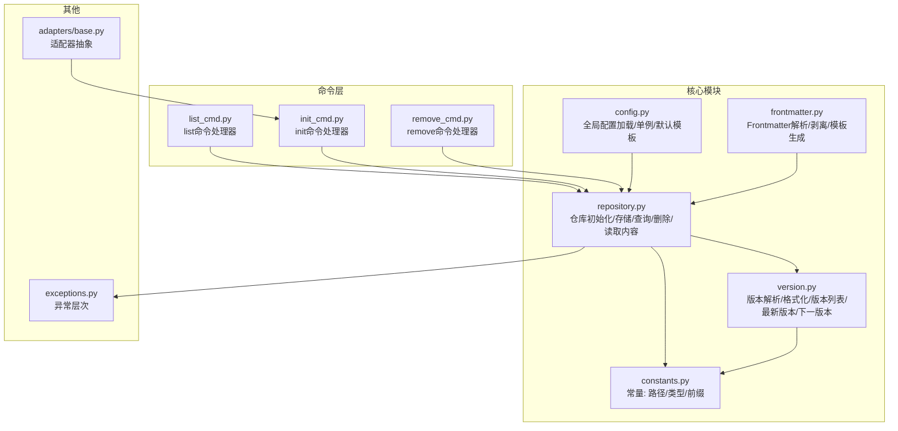
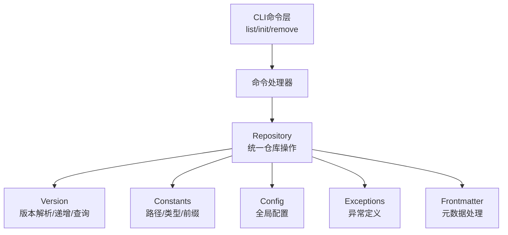
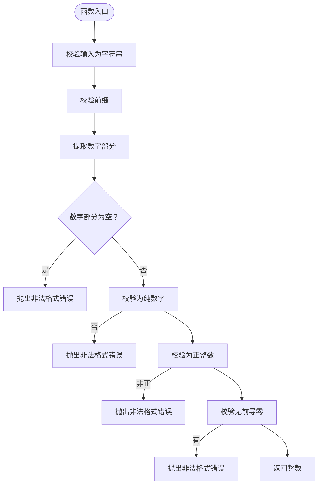
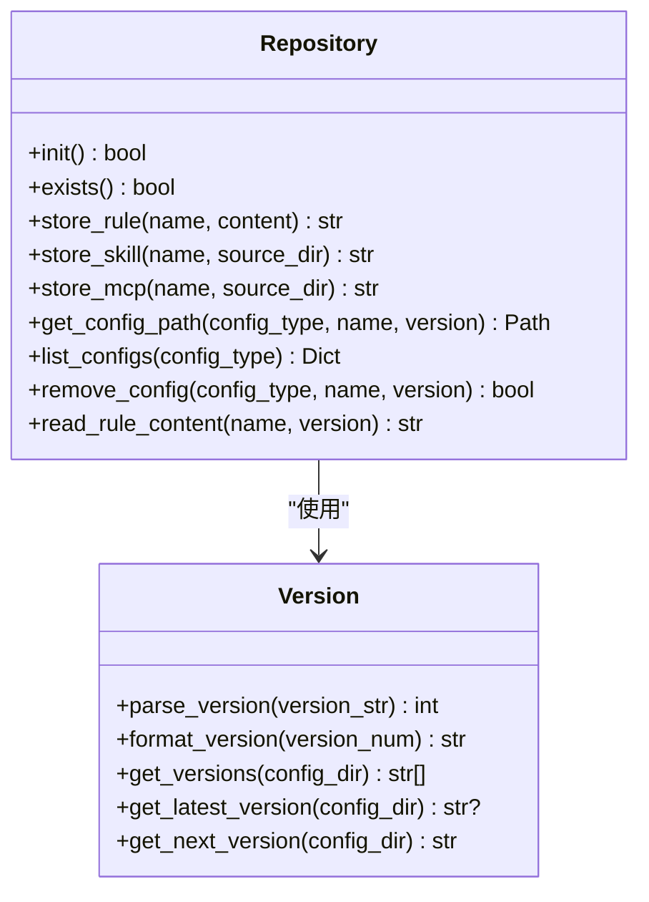
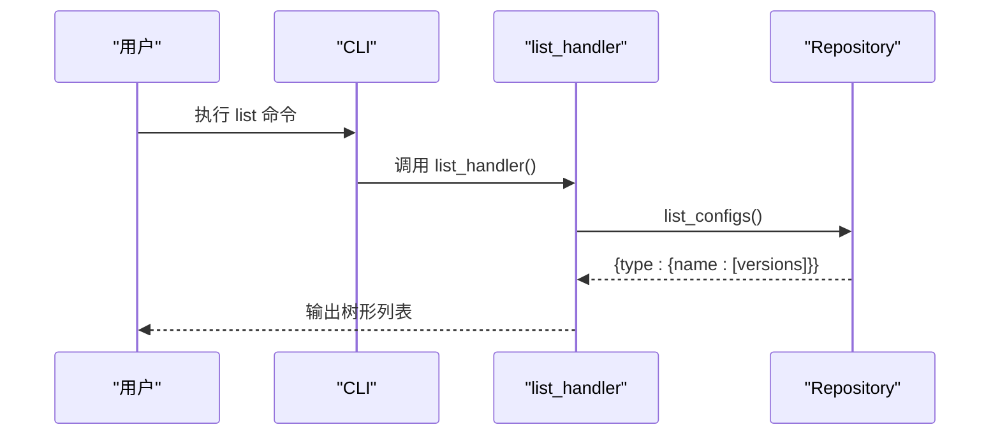
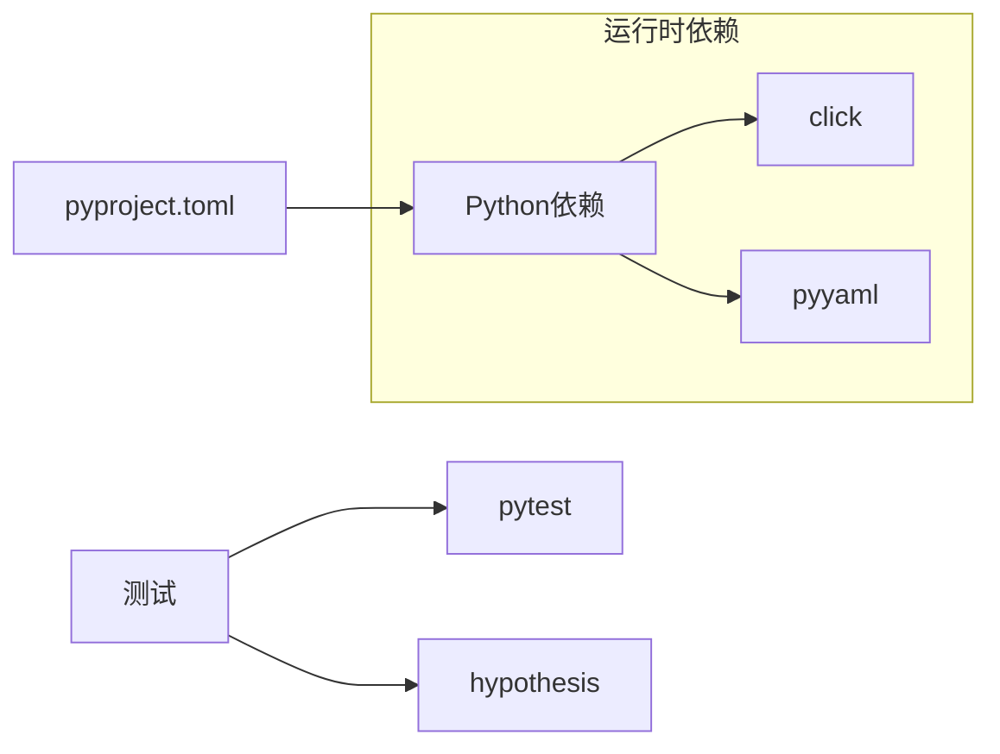

# 版本控制系统

<cite>
**本文引用的文件**
- [version.py](file://MSR-cli/msr_sync/core/version.py)
- [repository.py](file://MSR-cli/msr_sync/core/repository.py)
- [constants.py](file://MSR-cli/msr_sync/constants.py)
- [config.py](file://MSR-cli/msr_sync/core/config.py)
- [list_cmd.py](file://MSR-cli/msr_sync/commands/list_cmd.py)
- [init_cmd.py](file://MSR-cli/msr_sync/commands/init_cmd.py)
- [remove_cmd.py](file://MSR-cli/msr_sync/commands/remove_cmd.py)
- [exceptions.py](file://MSR-cli/msr_sync/core/exceptions.py)
- [base.py](file://MSR-cli/msr_sync/adapters/base.py)
- [frontmatter.py](file://MSR-cli/msr_sync/core/frontmatter.py)
- [test_version.py](file://MSR-cli/tests/test_version.py)
- [README.md](file://README.md)
- [MSR-cli/README.md](file://MSR-cli/README.md)
- [pyproject.toml](file://MSR-cli/pyproject.toml)
</cite>

## 目录
1. [简介](#简介)
2. [项目结构](#项目结构)
3. [核心组件](#核心组件)
4. [架构总览](#架构总览)
5. [详细组件分析](#详细组件分析)
6. [依赖关系分析](#依赖关系分析)
7. [性能考量](#性能考量)
8. [故障排查指南](#故障排查指南)
9. [结论](#结论)
10. [附录](#附录)

## 简介
本文件面向“版本控制系统”的设计与实现，聚焦于版本号生成与管理、版本历史存储与查询、版本比较与冲突处理、版本回滚与恢复，以及最佳实践与性能优化建议。系统以统一仓库为核心，支持规则（Rules）、技能（Skills）、MCP 配置三类条目的多版本管理，版本命名采用“V”前缀加正整数的规范化格式，版本号在导入时自动递增，查询时默认返回最新版本。

## 项目结构
- 核心模块
  - 版本管理：version.py
  - 仓库操作：repository.py
  - 常量与配置：constants.py、config.py
  - 命令入口：list_cmd.py、init_cmd.py、remove_cmd.py
  - 异常定义：exceptions.py
  - 适配器抽象：adapters/base.py
  - Frontmatter 解析：frontmatter.py
- 测试与文档
  - 单元测试：tests/test_version.py
  - 项目文档：README.md、MSR-cli/README.md
  - 构建配置：pyproject.toml

图表来源
- [version.py:1-119](file://MSR-cli/msr_sync/core/version.py#L1-L119)
- [repository.py:1-291](file://MSR-cli/msr_sync/core/repository.py#L1-L291)
- [constants.py:1-50](file://MSR-cli/msr_sync/constants.py#L1-L50)
- [config.py:1-204](file://MSR-cli/msr_sync/core/config.py#L1-L204)
- [list_cmd.py:1-63](file://MSR-cli/msr_sync/commands/list_cmd.py#L1-L63)
- [init_cmd.py:1-137](file://MSR-cli/msr_sync/commands/init_cmd.py#L1-L137)
- [remove_cmd.py:1-43](file://MSR-cli/msr_sync/commands/remove_cmd.py#L1-L43)
- [exceptions.py:1-34](file://MSR-cli/msr_sync/core/exceptions.py#L1-L34)
- [base.py:1-105](file://MSR-cli/msr_sync/adapters/base.py#L1-L105)
- [frontmatter.py:1-164](file://MSR-cli/msr_sync/core/frontmatter.py#L1-L164)

章节来源
- [version.py:1-119](file://MSR-cli/msr_sync/core/version.py#L1-L119)
- [repository.py:1-291](file://MSR-cli/msr_sync/core/repository.py#L1-L291)
- [constants.py:1-50](file://MSR-cli/msr_sync/constants.py#L1-L50)
- [config.py:1-204](file://MSR-cli/msr_sync/core/config.py#L1-L204)
- [list_cmd.py:1-63](file://MSR-cli/msr_sync/commands/list_cmd.py#L1-L63)
- [init_cmd.py:1-137](file://MSR-cli/msr_sync/commands/init_cmd.py#L1-L137)
- [remove_cmd.py:1-43](file://MSR-cli/msr_sync/commands/remove_cmd.py#L1-L43)
- [exceptions.py:1-34](file://MSR-cli/msr_sync/core/exceptions.py#L1-L34)
- [base.py:1-105](file://MSR-cli/msr_sync/adapters/base.py#L1-L105)
- [frontmatter.py:1-164](file://MSR-cli/msr_sync/core/frontmatter.py#L1-L164)

## 核心组件
- 版本号生成与管理
  - 解析版本字符串为整数，严格校验前缀、数字合法性与无前导零
  - 格式化整数为版本字符串
  - 获取版本列表并按数字升序排序
  - 获取最新版本（最大版本号）
  - 计算下一版本（基于最大版本号+1，空目录返回V1）
- 仓库与版本存储
  - 仓库初始化：创建 RULES/SKILLS/MCP 三层目录
  - 存储规则/技能/MCP：自动创建下一版本目录并写入内容
  - 查询路径与内容：支持指定版本或默认最新版本
  - 列表查询：按类型/名称聚合版本列表
  - 删除版本：安全删除指定版本目录
- 命令与集成
  - list：树形展示仓库配置与版本
  - init：初始化仓库并可合并现有 IDE 配置
  - remove：删除指定版本
- 异常与健壮性
  - 仓库未初始化、配置不存在、配置文件错误等异常类型
- 前置元数据（Frontmatter）
  - 解析/剥离 YAML frontmatter，生成各 IDE 模板头部

章节来源
- [version.py:9-119](file://MSR-cli/msr_sync/core/version.py#L9-L119)
- [repository.py:40-291](file://MSR-cli/msr_sync/core/repository.py#L40-L291)
- [list_cmd.py:12-63](file://MSR-cli/msr_sync/commands/list_cmd.py#L12-L63)
- [init_cmd.py:13-137](file://MSR-cli/msr_sync/commands/init_cmd.py#L13-L137)
- [remove_cmd.py:12-43](file://MSR-cli/msr_sync/commands/remove_cmd.py#L12-L43)
- [exceptions.py:4-34](file://MSR-cli/msr_sync/core/exceptions.py#L4-L34)
- [frontmatter.py:10-164](file://MSR-cli/msr_sync/core/frontmatter.py#L10-L164)

## 架构总览
系统围绕统一仓库组织，版本号由 version.py 提供解析/格式化与递增逻辑，repository.py 作为门面协调存储、查询与删除，命令层通过 CLI 调用 repository 的能力，异常与常量贯穿各模块。

图表来源
- [list_cmd.py:12-63](file://MSR-cli/msr_sync/commands/list_cmd.py#L12-L63)
- [init_cmd.py:13-137](file://MSR-cli/msr_sync/commands/init_cmd.py#L13-L137)
- [remove_cmd.py:12-43](file://MSR-cli/msr_sync/commands/remove_cmd.py#L12-L43)
- [repository.py:23-291](file://MSR-cli/msr_sync/core/repository.py#L23-L291)
- [version.py:9-119](file://MSR-cli/msr_sync/core/version.py#L9-L119)
- [constants.py:7-50](file://MSR-cli/msr_sync/constants.py#L7-L50)
- [config.py:18-204](file://MSR-cli/msr_sync/core/config.py#L18-L204)
- [exceptions.py:4-34](file://MSR-cli/msr_sync/core/exceptions.py#L4-L34)
- [frontmatter.py:10-164](file://MSR-cli/msr_sync/core/frontmatter.py#L10-L164)

## 详细组件分析

### 版本号生成与管理（version.py）
- 功能要点
  - parse_version：校验前缀、非空、纯数字、正数、无前导零，返回整数
  - format_version：将正整数格式化为“Vn”
  - get_versions：扫描目录，解析符合“Vn”格式的子目录，按数字排序返回版本字符串
  - get_latest_version：返回最大版本号字符串
  - get_next_version：若无版本则返回“V1”，否则返回最大版本+1
- 复杂度与性能
  - get_versions：O(k log k)，k为候选版本数量（排序主导）
  - get_latest_version/get_next_version：O(k log k) 或 O(1)（依赖上一步结果）
- 错误处理
  - 非法格式抛出 ValueError
  - 无版本目录返回 None（最新版本）

图表来源
- [version.py:9-44](file://MSR-cli/msr_sync/core/version.py#L9-L44)

章节来源
- [version.py:9-119](file://MSR-cli/msr_sync/core/version.py#L9-L119)
- [test_version.py:18-276](file://MSR-cli/tests/test_version.py#L18-L276)

### 仓库与版本存储（repository.py）
- 功能要点
  - 初始化：创建 RULES/SKILLS/MCP 三层目录
  - 存储：store_rule/store_skill/store_mcp 自动计算下一版本并写入内容
  - 查询：get_config_path 支持指定版本或默认最新版本
  - 列表：list_configs 按类型/名称聚合版本
  - 删除：remove_config 删除指定版本目录
  - 读取：read_rule_content 读取规则内容
- 并发与一致性
  - 仓库操作基于文件系统目录结构，未见显式锁机制
  - 版本递增依赖 get_next_version，遵循“最大版本+1”的原子性假设
- 错误处理
  - 仓库未初始化抛出 RepositoryNotFoundError
  - 配置或版本不存在抛出 ConfigNotFoundError

图表来源
- [repository.py:23-291](file://MSR-cli/msr_sync/core/repository.py#L23-L291)
- [version.py:9-119](file://MSR-cli/msr_sync/core/version.py#L9-L119)

章节来源
- [repository.py:40-291](file://MSR-cli/msr_sync/core/repository.py#L40-L291)

### 命令与交互（list_cmd.py、init_cmd.py、remove_cmd.py）
- list 命令：遍历仓库，按类型/名称/版本输出树形结构
- init 命令：初始化仓库，可扫描并合并现有 IDE 配置
- remove 命令：删除指定版本，失败时输出友好提示并退出

图表来源
- [list_cmd.py:12-63](file://MSR-cli/msr_sync/commands/list_cmd.py#L12-L63)
- [repository.py:201-235](file://MSR-cli/msr_sync/core/repository.py#L201-L235)

章节来源
- [list_cmd.py:12-63](file://MSR-cli/msr_sync/commands/list_cmd.py#L12-L63)
- [init_cmd.py:13-137](file://MSR-cli/msr_sync/commands/init_cmd.py#L13-L137)
- [remove_cmd.py:12-43](file://MSR-cli/msr_sync/commands/remove_cmd.py#L12-L43)

### 常量与配置（constants.py、config.py）
- 常量
  - DEFAULT_REPO_PATH、RULES_DIR、SKILLS_DIR、MCP_DIR
  - ConfigType 枚举与目录映射
  - VERSION_PREFIX、SKILL_MARKER_FILE、MCP_CONFIG_FILE、支持的扩展名与平台
- 全局配置
  - GlobalConfig：解析 repo_path、校验 IDE 列表与作用域
  - 单例加载与默认模板生成

章节来源
- [constants.py:7-50](file://MSR-cli/msr_sync/constants.py#L7-L50)
- [config.py:18-204](file://MSR-cli/msr_sync/core/config.py#L18-L204)

### 异常与健壮性（exceptions.py）
- 异常层次：基础异常 MSRError，以及仓库未初始化、配置不存在、配置文件错误等专用异常

章节来源
- [exceptions.py:4-34](file://MSR-cli/msr_sync/core/exceptions.py#L4-L34)

### 前置元数据（frontmatter.py）
- 解析/剥离 YAML frontmatter，生成各 IDE 模板头部（Qoder/Lingma/CodeBuddy/Cursor）
- 为规则内容提供标准化的头部包装

章节来源
- [frontmatter.py:10-164](file://MSR-cli/msr_sync/core/frontmatter.py#L10-L164)

## 依赖关系分析
- 模块耦合
  - repository.py 依赖 version.py、constants.py、exceptions.py
  - 命令层依赖 repository.py 与异常类型
  - frontmatter.py 与 repository.py 解耦，仅在内容层面协作
- 外部依赖
  - Python 标准库（pathlib、shutil、yaml、click 等）
  - 构建与测试依赖（pytest、hypothesis）

图表来源
- [pyproject.toml:18-31](file://MSR-cli/pyproject.toml#L18-L31)

章节来源
- [pyproject.toml:1-37](file://MSR-cli/pyproject.toml#L1-L37)

## 性能考量
- 版本列表与排序
  - get_versions 对候选目录进行排序，复杂度 O(k log k)，建议控制单条目版本数量或缓存结果
- I/O 操作
  - 存储与删除涉及目录创建/删除与文件写入，建议批量导入时合并操作减少系统调用
- 并发与一致性
  - 当前实现未显式加锁，建议在高并发场景引入文件级锁或原子重命名策略，避免竞态条件导致的版本号冲突
- 前置元数据处理
  - frontmatter 解析为线性扫描，对大文件可能成为瓶颈，建议限制规则文件大小或采用流式处理

[本节为通用性能讨论，无需具体文件分析]

## 故障排查指南
- 仓库未初始化
  - 现象：执行命令时报仓库未初始化
  - 处理：先执行初始化命令，再重试
  - 参考：异常类型与命令层错误处理
- 配置或版本不存在
  - 现象：指定配置/版本路径不存在
  - 处理：检查配置类型、名称与版本号是否正确；使用 list 命令核对版本
- 版本号格式错误
  - 现象：parse_version 抛出非法格式错误
  - 处理：确认版本号为“Vn”且 n 为正整数，无前导零
- Frontmatter 解析异常
  - 现象：规则内容解析失败
  - 处理：检查 Markdown 文件是否包含合法的 YAML frontmatter 分隔符

章节来源
- [exceptions.py:8-34](file://MSR-cli/msr_sync/core/exceptions.py#L8-L34)
- [list_cmd.py:26-42](file://MSR-cli/msr_sync/commands/list_cmd.py#L26-L42)
- [version.py:21-44](file://MSR-cli/msr_sync/core/version.py#L21-L44)
- [frontmatter.py:37-60](file://MSR-cli/msr_sync/core/frontmatter.py#L37-L60)

## 结论
本版本控制系统以简洁的文件系统结构实现了规则、技能、MCP 的多版本管理，版本号采用“Vn”规范化命名，递增算法简单可靠。通过命令层与仓库门面的清晰分离，系统具备良好的可扩展性。建议在高并发场景增强一致性保障，在大文件场景优化前置元数据处理，并持续完善测试覆盖以提升稳定性。

[本节为总结性内容，无需具体文件分析]

## 附录

### 版本命名规范与递增算法
- 命名规范
  - “V”前缀 + 正整数，例如 V1、V2、V10
  - 无前导零，非法格式将被拒绝
- 递增算法
  - 空目录返回 V1
  - 非空目录基于最大版本号 + 1 生成下一版本
- 版本比较
  - 数字排序：V10 排在 V2 之后
  - 默认同步最新版本，也可指定版本

章节来源
- [version.py:9-119](file://MSR-cli/msr_sync/core/version.py#L9-L119)
- [test_version.py:89-276](file://MSR-cli/tests/test_version.py#L89-L276)
- [README.md:275-295](file://README.md#L275-L295)
- [MSR-cli/README.md:275-295](file://MSR-cli/README.md#L275-L295)

### 版本历史存储策略与查询接口
- 存储策略
  - 统一仓库目录：RULES/<name>/Vn/<content>、SKILLS/<name>/Vn/...、MCP/<name>/Vn/mcp.json
- 查询接口
  - list_configs：按类型/名称聚合版本列表
  - get_config_path：获取指定版本路径（默认最新）
  - read_rule_content：读取规则内容（默认最新）

章节来源
- [repository.py:201-291](file://MSR-cli/msr_sync/core/repository.py#L201-L291)
- [README.md:240-265](file://README.md#L240-L265)
- [MSR-cli/README.md:240-265](file://MSR-cli/README.md#L240-L265)

### 版本冲突检测与解决机制
- 冲突检测
  - 通过 get_next_version 基于最大版本号推导下一版本，避免重复
- 解决机制
  - 无显式锁：建议在导入流程中采用原子写入与重命名，或引入文件锁
  - 版本删除：remove 命令安全删除指定版本目录，避免误删最新版本

章节来源
- [repository.py:103-158](file://MSR-cli/msr_sync/core/repository.py#L103-L158)
- [repository.py:237-264](file://MSR-cli/msr_sync/core/repository.py#L237-L264)
- [version.py:103-119](file://MSR-cli/msr_sync/core/version.py#L103-L119)

### 版本回滚与恢复操作指南
- 回滚到指定版本
  - 使用 list 命令查看版本列表，选择目标版本
  - 在同步命令中指定版本参数，实现回滚
- 完整恢复
  - 通过 init --merge 合并现有 IDE 配置，恢复到统一仓库
- 部分回滚
  - 删除不需要的历史版本目录，保留目标版本

章节来源
- [README.md:275-295](file://README.md#L275-L295)
- [MSR-cli/README.md:275-295](file://MSR-cli/README.md#L275-L295)
- [init_cmd.py:44-137](file://MSR-cli/msr_sync/commands/init_cmd.py#L44-L137)
- [remove_cmd.py:12-43](file://MSR-cli/msr_sync/commands/remove_cmd.py#L12-L43)

### 最佳实践与性能优化建议
- 最佳实践
  - 保持版本命名规范，避免手动修改版本号
  - 使用 list 命令定期核对版本状态
  - 在团队内统一版本管理流程
- 性能优化
  - 控制单条目版本数量，必要时清理历史版本
  - 批量导入时合并 I/O 操作
  - 在高并发场景引入一致性保障与锁机制

[本节为通用建议，无需具体文件分析]