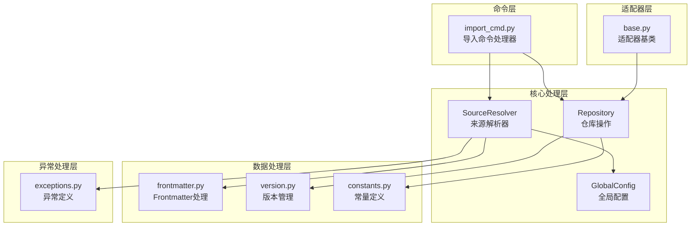
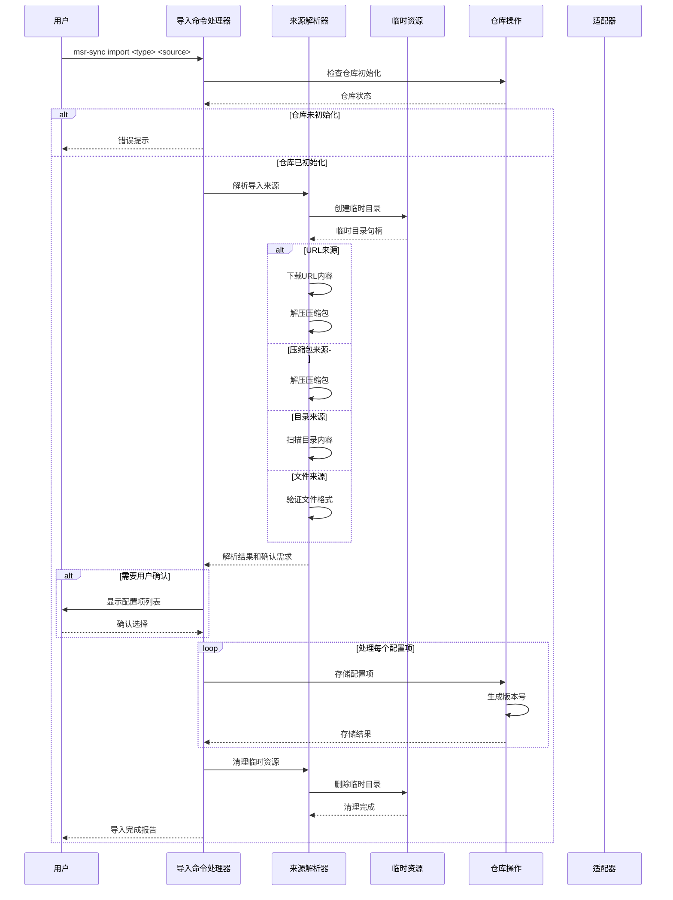
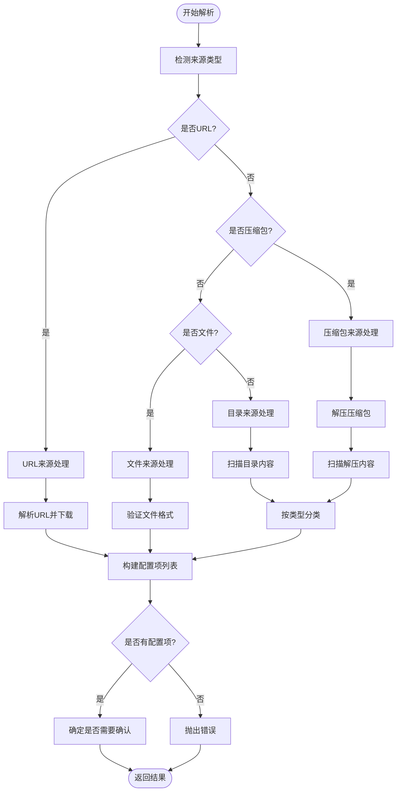
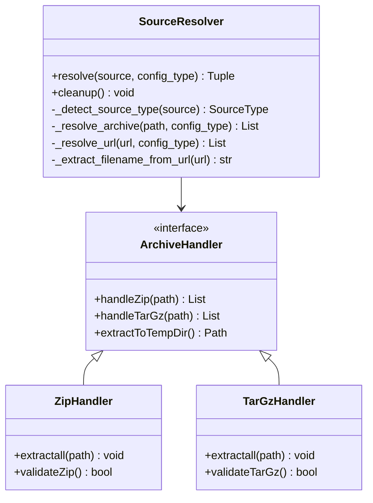
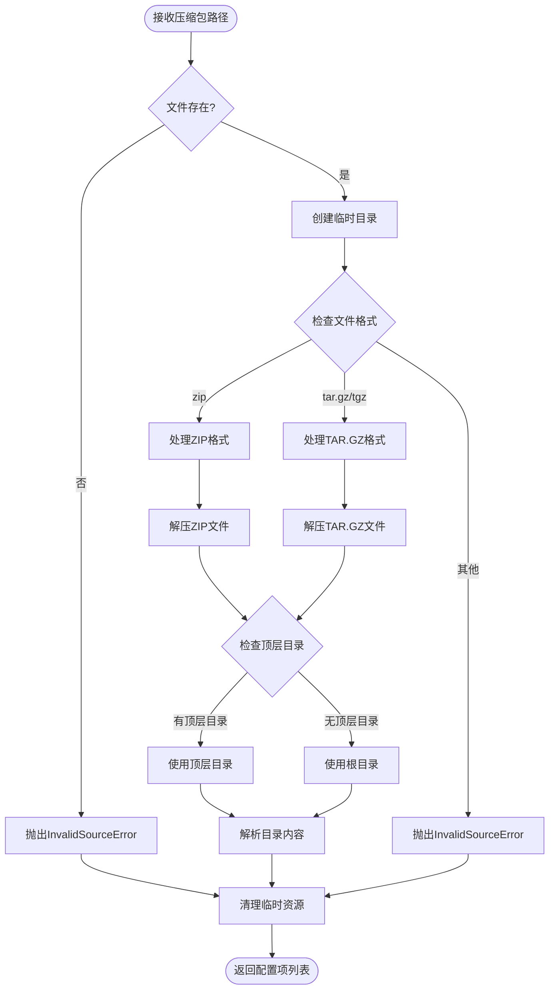
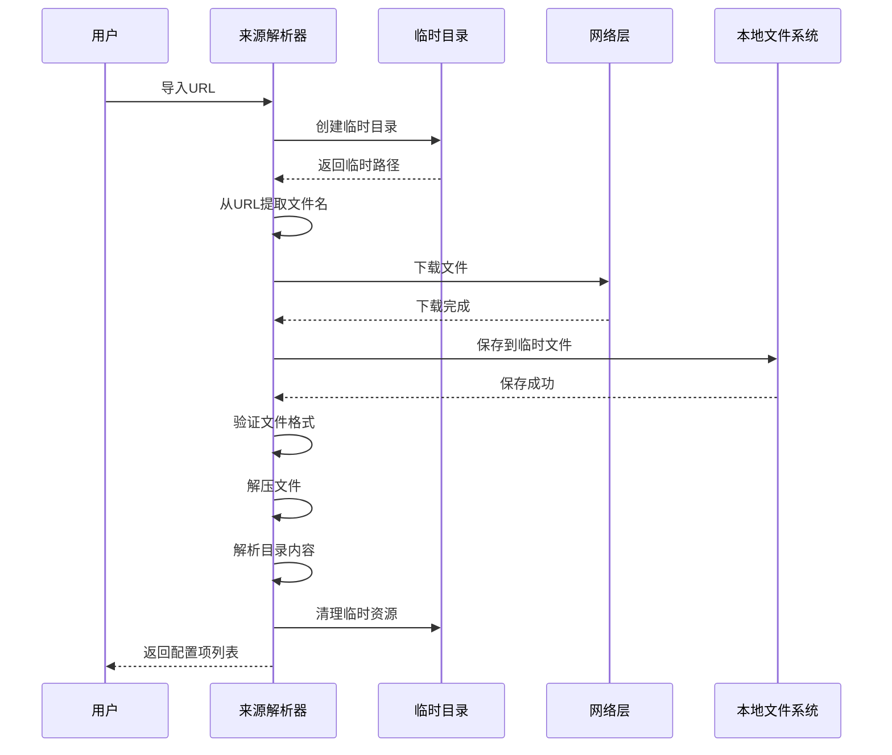
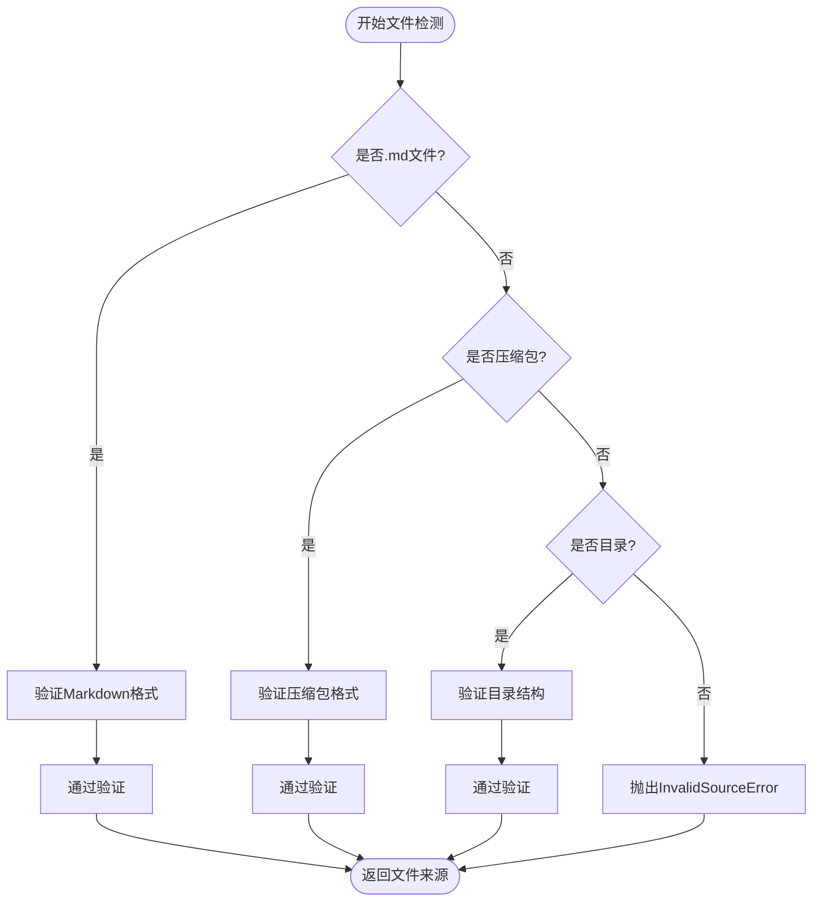
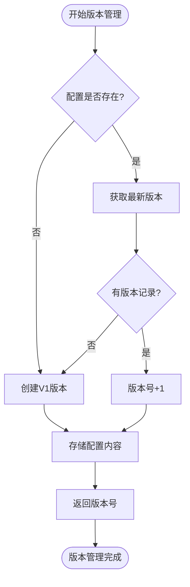
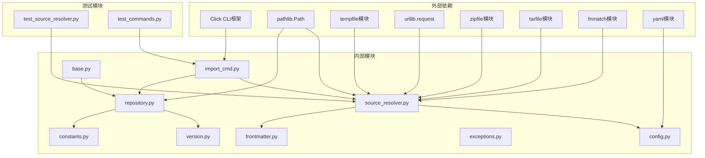

# 配置导入流程

<cite>
**本文档引用的文件**
- [import_cmd.py](file://MSR-cli/msr_sync/commands/import_cmd.py)
- [source_resolver.py](file://MSR-cli/msr_sync/core/source_resolver.py)
- [repository.py](file://MSR-cli/msr_sync/core/repository.py)
- [constants.py](file://MSR-cli/msr_sync/constants.py)
- [exceptions.py](file://MSR-cli/msr_sync/core/exceptions.py)
- [frontmatter.py](file://MSR-cli/msr_sync/core/frontmatter.py)
- [version.py](file://MSR-cli/msr_sync/core/version.py)
- [config.py](file://MSR-cli/msr_sync/core/config.py)
- [base.py](file://MSR-cli/msr_sync/adapters/base.py)
- [test_source_resolver.py](file://MSR-cli/tests/test_source_resolver.py)
- [test_commands.py](file://MSR-cli/tests/test_commands.py)
- [README.md](file://MSR-cli/README.md)
- [usage.md](file://MSR-cli/docs/usage.md)
</cite>

## 目录
1. [简介](#简介)
2. [项目结构](#项目结构)
3. [核心组件](#核心组件)
4. [架构概览](#架构概览)
5. [详细组件分析](#详细组件分析)
6. [依赖关系分析](#依赖关系分析)
7. [性能考虑](#性能考虑)
8. [故障排除指南](#故障排除指南)
9. [结论](#结论)
10. [附录](#附录)

## 简介

MSR-cli 的配置导入流程是一个高度模块化的系统，负责将来自多种来源的配置（rules、skills、MCP）统一导入到中央仓库中。该系统支持四种主要的导入来源：本地文件、目录、压缩包和远程URL，并提供了完整的错误处理、格式验证和版本管理机制。

导入流程的核心价值在于：
- **统一管理**：通过单一仓库管理所有IDE配置
- **格式转换**：自动处理不同IDE之间的格式差异
- **版本控制**：支持多版本管理和回滚
- **批量处理**：支持批量导入和交互式确认
- **错误处理**：完善的异常处理和用户反馈

## 项目结构

MSR-cli 的导入功能分布在多个核心模块中，形成了清晰的分层架构：



**图表来源**
- [import_cmd.py:1-151](file://MSR-cli/msr_sync/commands/import_cmd.py#L1-L151)
- [source_resolver.py:1-404](file://MSR-cli/msr_sync/core/source_resolver.py#L1-L404)
- [repository.py:1-291](file://MSR-cli/msr_sync/core/repository.py#L1-L291)

**章节来源**
- [import_cmd.py:1-151](file://MSR-cli/msr_sync/commands/import_cmd.py#L1-L151)
- [source_resolver.py:1-404](file://MSR-cli/msr_sync/core/source_resolver.py#L1-L404)
- [repository.py:1-291](file://MSR-cli/msr_sync/core/repository.py#L1-L291)

## 核心组件

### 导入命令处理器 (import_cmd.py)

导入命令处理器是整个导入流程的入口点，负责协调各个组件的工作：

- **主要职责**：
  - 验证仓库初始化状态
  - 解析导入来源并确定处理策略
  - 处理用户确认流程
  - 调用仓库存储操作
  - 清理临时资源

- **关键特性**：
  - 支持单个和批量导入
  - 交互式确认机制
  - 统一的错误处理
  - 资源清理保证

**章节来源**
- [import_cmd.py:14-151](file://MSR-cli/msr_sync/commands/import_cmd.py#L14-L151)

### 来源解析器 (source_resolver.py)

来源解析器是导入流程的核心，负责识别和处理各种导入来源：

- **支持的来源类型**：
  - 单个文件（仅rules）
  - 目录（按配置类型智能识别）
  - 压缩包（zip、tar.gz、tgz）
  - 远程URL（自动下载）

- **智能识别机制**：
  - 基于文件扩展名的格式检测
  - 目录内容分析（SKILL.md、mcp.json标识）
  - 压缩包内容解压和扫描

**章节来源**
- [source_resolver.py:43-404](file://MSR-cli/msr_sync/core/source_resolver.py#L43-L404)

### 仓库操作 (repository.py)

仓库操作模块负责实际的配置存储和版本管理：

- **存储结构**：
  - RULES/<name>/Vn/<name>.md
  - SKILLS/<name>/Vn/...
  - MCP/<name>/Vn/mcp.json

- **版本管理**：
  - 自动版本号生成（V1, V2, V3...）
  - 版本冲突自动处理
  - 版本查询和遍历

**章节来源**
- [repository.py:23-291](file://MSR-cli/msr_sync/core/repository.py#L23-L291)

## 架构概览

导入流程遵循清晰的分层架构，确保了良好的模块化和可维护性：



**图表来源**
- [import_cmd.py:14-151](file://MSR-cli/msr_sync/commands/import_cmd.py#L14-L151)
- [source_resolver.py:77-110](file://MSR-cli/msr_sync/core/source_resolver.py#L77-L110)
- [repository.py:89-158](file://MSR-cli/msr_sync/core/repository.py#L89-L158)

## 详细组件分析

### 来源解析器详细分析

来源解析器实现了复杂的多来源处理逻辑，支持四种不同的导入方式：

#### 来源类型检测



**图表来源**
- [source_resolver.py:77-110](file://MSR-cli/msr_sync/core/source_resolver.py#L77-L110)
- [source_resolver.py:118-150](file://MSR-cli/msr_sync/core/source_resolver.py#L118-L150)

#### 配置类型智能识别

不同配置类型的目录识别规则：

| 配置类型 | 识别规则 | 示例 |
|---------|----------|------|
| Rules | 目录下所有.md文件 | `rules/` 目录中的每个文件 |
| Skills | 根目录含SKILL.md视为单个 | `skill-name/` 目录整体 |
| Skills | 根目录无SKILL.md视为多个 | `skills-pack/` 中的每个子目录 |
| MCP | 根目录含非子目录文件视为单个 | `mcp-config/` 目录整体 |
| MCP | 根目录仅含子目录视为多个 | `mcp-pack/` 中的每个子目录 |

**章节来源**
- [source_resolver.py:197-280](file://MSR-cli/msr_sync/core/source_resolver.py#L197-L280)

### 压缩包处理机制

压缩包处理是导入流程的重要组成部分，支持多种压缩格式：

#### 支持的压缩格式



**图表来源**
- [source_resolver.py:282-361](file://MSR-cli/msr_sync/core/source_resolver.py#L282-L361)

#### 压缩包解压流程



**图表来源**
- [source_resolver.py:297-325](file://MSR-cli/msr_sync/core/source_resolver.py#L297-L325)

**章节来源**
- [source_resolver.py:282-361](file://MSR-cli/msr_sync/core/source_resolver.py#L282-L361)

### 远程URL处理机制

远程URL处理提供了从网络导入配置的能力：

#### URL处理流程



**图表来源**
- [source_resolver.py:327-361](file://MSR-cli/msr_sync/core/source_resolver.py#L327-L361)

#### URL文件名提取算法

URL文件名提取采用了智能的路径解析策略：

| 输入URL | 提取结果 | 处理步骤 |
|---------|----------|----------|
| `https://example.com/file.zip` | `file.zip` | 移除查询参数和片段 |
| `https://example.com/path/to/file.zip?param=value` | `file.zip` | 保留最后一个路径段 |
| `https://example.com/dir/` | `download` | 目录URL使用默认名称 |
| `https://example.com/file.zip#section` | `file.zip` | 移除URL片段 |

**章节来源**
- [source_resolver.py:364-372](file://MSR-cli/msr_sync/core/source_resolver.py#L364-L372)

### 数据转换和验证机制

导入流程包含了多层次的数据验证和转换机制：

#### 文件类型检测



**图表来源**
- [source_resolver.py:170-177](file://MSR-cli/msr_sync/core/source_resolver.py#L170-L177)
- [source_resolver.py:130-150](file://MSR-cli/msr_sync/core/source_resolver.py#L130-L150)

#### 内容解析和格式转换

导入流程中的内容处理遵循以下原则：

1. **规则（Rules）**：直接存储.md文件内容
2. **技能（Skills）**：存储整个目录结构
3. **MCP配置**：存储mcp.json文件

**章节来源**
- [import_cmd.py:134-150](file://MSR-cli/msr_sync/commands/import_cmd.py#L134-L150)

### 版本管理机制

MSR-cli 实现了完整的版本管理功能，支持配置的历史版本追踪：

#### 版本号生成规则



**图表来源**
- [repository.py:105-112](file://MSR-cli/msr_sync/core/repository.py#L105-L112)
- [version.py:103-118](file://MSR-cli/msr_sync/core/version.py#L103-L118)

#### 版本冲突处理

当导入同名配置时，系统会自动创建新版本：

- **自动递增**：V1 → V2 → V3...
- **版本查询**：支持获取最新版本和所有版本列表
- **版本回滚**：支持删除特定版本进行回滚

**章节来源**
- [repository.py:101-158](file://MSR-cli/msr_sync/core/repository.py#L101-L158)
- [version.py:59-118](file://MSR-cli/msr_sync/core/version.py#L59-L118)

## 依赖关系分析

导入系统的依赖关系体现了清晰的分层设计：



**图表来源**
- [import_cmd.py:3-11](file://MSR-cli/msr_sync/commands/import_cmd.py#L3-L11)
- [source_resolver.py:3-13](file://MSR-cli/msr_sync/core/source_resolver.py#L3-L13)
- [repository.py:3-9](file://MSR-cli/msr_sync/core/repository.py#L3-L9)

### 模块间耦合度分析

- **低耦合设计**：各模块职责明确，接口清晰
- **依赖方向**：自上而下依赖，避免循环依赖
- **接口稳定性**：核心接口保持稳定，便于测试和维护

**章节来源**
- [constants.py:16-46](file://MSR-cli/msr_sync/constants.py#L16-L46)
- [exceptions.py:4-34](file://MSR-cli/msr_sync/core/exceptions.py#L4-L34)

## 性能考虑

导入系统在设计时充分考虑了性能优化：

### 内存使用优化

1. **流式处理**：压缩包解压采用临时文件而非内存缓存
2. **延迟加载**：配置内容按需读取，避免不必要的内存占用
3. **资源清理**：及时清理临时文件和目录

### I/O性能优化

1. **批量操作**：支持批量导入减少I/O次数
2. **并行处理**：多个配置项可并行处理（在导入命令层面）
3. **缓存机制**：仓库路径和配置信息的缓存使用

### 网络性能优化

1. **超时控制**：URL下载设置了合理的超时机制
2. **错误重试**：网络错误时提供重试机会
3. **进度反馈**：大文件下载时提供进度指示

## 故障排除指南

### 常见错误类型和解决方案

#### 仓库初始化错误

**错误信息**：`❌ 统一仓库未初始化，请先执行 msr-sync init`

**原因**：
- 未执行初始化命令
- 仓库目录被意外删除
- 权限问题导致无法创建目录

**解决方案**：
```bash
msr-sync init
```

**章节来源**
- [import_cmd.py:32-34](file://MSR-cli/msr_sync/commands/import_cmd.py#L32-L34)

#### 无效导入来源错误

**错误信息**：`❌ 无效的导入来源: {source}`

**可能原因**：
- 文件路径不存在
- 目录路径不存在
- 压缩包格式不受支持
- URL地址不可访问

**解决方案**：
1. 验证文件路径拼写
2. 检查文件权限
3. 确认压缩包格式
4. 测试URL连通性

**章节来源**
- [source_resolver.py:150](file://MSR-cli/msr_sync/core/source_resolver.py#L150)
- [source_resolver.py:298](file://MSR-cli/msr_sync/core/source_resolver.py#L298)

#### 压缩包解压失败

**错误信息**：`❌ 压缩包解压失败: {path}`

**原因**：
- 压缩包文件损坏
- 压缩包格式不支持
- 磁盘空间不足

**解决方案**：
1. 重新下载压缩包
2. 验证压缩包完整性
3. 检查磁盘空间

**章节来源**
- [source_resolver.py:313-314](file://MSR-cli/msr_sync/core/source_resolver.py#L313-L314)

#### 网络错误

**错误信息**：`❌ 网络错误: {e}`

**原因**：
- 网络连接不稳定
- 防火墙阻止访问
- 代理配置错误

**解决方案**：
1. 检查网络连接
2. 配置代理设置
3. 使用镜像URL

**章节来源**
- [import_cmd.py:43-45](file://MSR-cli/msr_sync/commands/import_cmd.py#L43-L45)

### 调试技巧

#### 启用详细日志

```bash
# 使用调试模式查看更多详细信息
msr-sync -v import rules ./my-rule.md
```

#### 验证配置文件

```bash
# 检查全局配置文件
cat ~/.msr-sync/config.yaml
```

#### 测试网络连接

```bash
# 测试URL可达性
curl -I https://example.com/rules.zip
```

## 结论

MSR-cli 的配置导入流程是一个设计精良、功能完整的系统，具有以下特点：

### 设计优势

1. **模块化架构**：清晰的分层设计便于维护和扩展
2. **多格式支持**：支持多种导入来源，满足不同使用场景
3. **智能识别**：自动识别配置类型和格式，减少用户操作
4. **版本管理**：完整的版本控制系统，支持回滚和比较
5. **错误处理**：完善的异常处理机制，提供友好的用户反馈

### 技术亮点

1. **灵活的来源解析**：支持文件、目录、压缩包、URL四种来源
2. **智能配置识别**：基于文件内容的配置类型自动识别
3. **资源管理**：完善的临时资源管理和清理机制
4. **性能优化**：内存和I/O性能的多重优化

### 应用价值

- **统一管理**：解决多IDE配置相互隔离的问题
- **提高效率**：自动化处理格式转换和版本管理
- **降低风险**：版本控制和错误处理减少配置迁移风险
- **增强协作**：标准化的配置格式便于团队共享

该系统为开发者提供了一个强大而易用的配置管理解决方案，特别适合需要在多个AI IDE之间共享和管理配置的场景。

## 附录

### 导入示例

#### 基本导入命令

```bash
# 导入单个规则文件
msr-sync import rules ./coding-standards.md

# 导入规则目录
msr-sync import rules ./rules/

# 导入技能目录
msr-sync import skills ./code-review-skill/

# 导入MCP配置
msr-sync import mcp ./my-mcp-config/

# 从压缩包导入
msr-sync import rules ./rules-pack.zip

# 从URL导入
msr-sync import skills https://example.com/skills.zip
```

#### 批量导入处理

当导入多个配置项时，系统会显示确认列表：

```bash
发现 3 个 rules 配置项:
  1. coding-standards
  2. code-review
  3. testing-guide

是否导入 'coding-standards'? [Y/n]: y
  ✅ 已导入: coding-standards (V1)
是否导入 'code-review'? [Y/n]: y
  ✅ 已导入: code-review (V1)
是否导入 'testing-guide'? [Y/n]: n
  ⏭️ 已跳过: testing-guide

导入完成: 成功 2 项
```

### 配置分类规则

#### Rules 配置规则

- **单个文件**：`./my-rule.md` → 导入为 `my-rule` 配置
- **目录扫描**：扫描目录下所有 `.md` 文件
- **忽略模式**：自动跳过 `__MACOSX`、`.DS_Store` 等

#### Skills 配置规则

- **单个技能**：根目录包含 `SKILL.md` 的目录
- **多个技能**：根目录无 `SKILL.md` 的目录，每个子目录视为独立技能
- **文件要求**：每个技能目录必须包含 `SKILL.md`

#### MCP 配置规则

- **单个MCP**：根目录包含非子目录文件的目录
- **多个MCP**：根目录仅包含子目录的目录
- **文件要求**：每个MCP目录必须包含 `mcp.json`

### 性能优化建议

1. **批量导入**：尽量使用压缩包进行批量导入
2. **网络优化**：使用稳定的网络连接进行URL导入
3. **磁盘空间**：确保有足够的磁盘空间处理压缩包
4. **权限设置**：确保对仓库目录有适当的读写权限

### 故障排除清单

- [ ] 确认已执行 `msr-sync init`
- [ ] 验证文件路径和权限
- [ ] 检查网络连接（URL导入）
- [ ] 确认压缩包格式和完整性
- [ ] 检查全局配置文件格式
- [ ] 查看详细的错误信息和日志