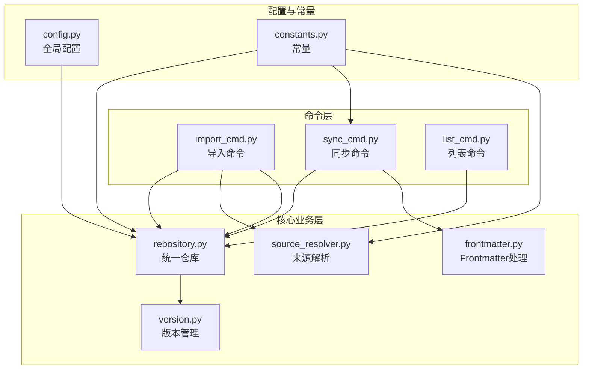
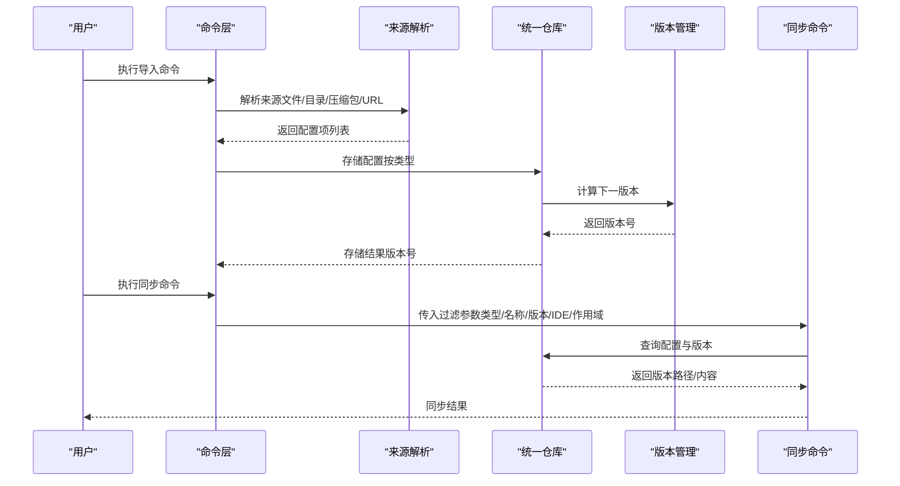
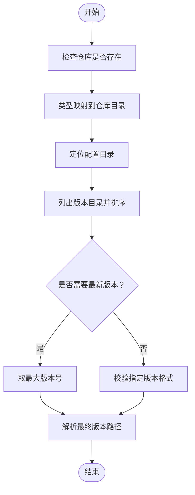
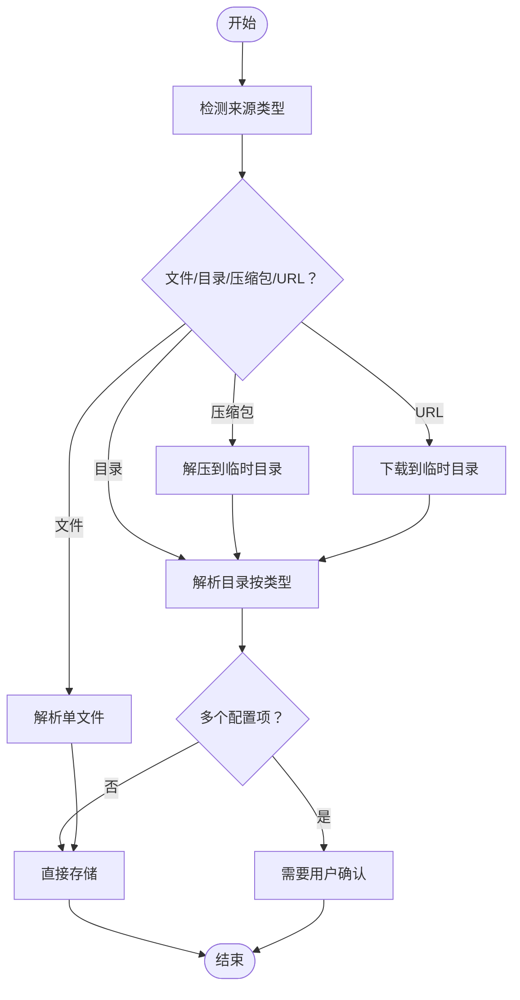
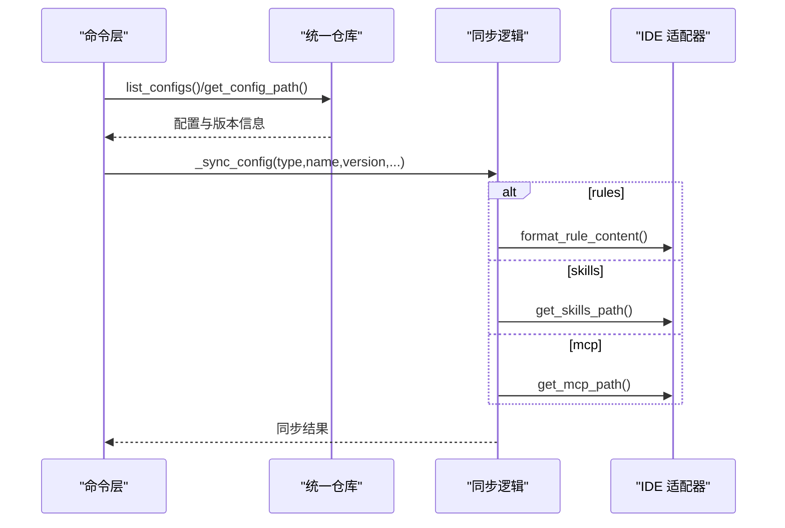
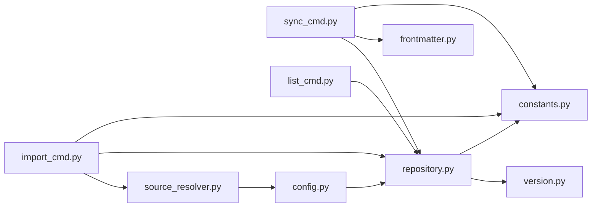

# 配置导出与备份

<cite>
**本文引用的文件**
- [MSR-cli/README.md](file://MSR-cli/README.md)
- [MSR-cli/docs/usage.md](file://MSR-cli/docs/usage.md)
- [MSR-cli/msr_sync/core/config.py](file://MSR-cli/msr_sync/core/config.py)
- [MSR-cli/msr_sync/core/repository.py](file://MSR-cli/msr_sync/core/repository.py)
- [MSR-cli/msr_sync/core/version.py](file://MSR-cli/msr_sync/core/version.py)
- [MSR-cli/msr_sync/core/frontmatter.py](file://MSR-cli/msr_sync/core/frontmatter.py)
- [MSR-cli/msr_sync/core/source_resolver.py](file://MSR-cli/msr_sync/core/source_resolver.py)
- [MSR-cli/msr_sync/commands/import_cmd.py](file://MSR-cli/msr_sync/commands/import_cmd.py)
- [MSR-cli/msr_sync/commands/sync_cmd.py](file://MSR-cli/msr_sync/commands/sync_cmd.py)
- [MSR-cli/msr_sync/commands/list_cmd.py](file://MSR-cli/msr_sync/commands/list_cmd.py)
- [MSR-cli/msr_sync/constants.py](file://MSR-cli/msr_sync/constants.py)
</cite>

## 目录
1. [简介](#简介)
2. [项目结构](#项目结构)
3. [核心组件](#核心组件)
4. [架构总览](#架构总览)
5. [详细组件分析](#详细组件分析)
6. [依赖关系分析](#依赖关系分析)
7. [性能考虑](#性能考虑)
8. [故障排查指南](#故障排查指南)
9. [结论](#结论)
10. [附录](#附录)

## 简介
本文件围绕“配置导出与备份”主题，结合代码库现状，系统阐述统一仓库的配置存储、版本管理、批量导出与打包策略、增量备份设计思路、导出格式与传输协议选择、备份恢复与灾难恢复最佳实践，以及性能优化与大容量数据处理建议。需要特别说明的是：当前代码库未提供“导出为压缩包”的命令或接口，亦未实现“差异检测与增量备份”的自动化流程；本文在“详细组件分析”中给出基于现有能力的可行方案与建议，帮助读者在现有基础上扩展实现。

## 项目结构
MSR-cli 采用命令行工具结构，核心围绕统一仓库（~/.msr-repos）进行配置的导入、列举、同步与删除。命令入口位于命令模块，核心业务逻辑集中在仓库与版本管理模块，配置与常量分布在相应模块中。

**图表来源**
- [MSR-cli/msr_sync/commands/import_cmd.py:14-56](file://MSR-cli/msr_sync/commands/import_cmd.py#L14-L56)
- [MSR-cli/msr_sync/commands/sync_cmd.py:26-131](file://MSR-cli/msr_sync/commands/sync_cmd.py#L26-L131)
- [MSR-cli/msr_sync/commands/list_cmd.py:12-31](file://MSR-cli/msr_sync/commands/list_cmd.py#L12-L31)
- [MSR-cli/msr_sync/core/repository.py:23-51](file://MSR-cli/msr_sync/core/repository.py#L23-L51)
- [MSR-cli/msr_sync/core/version.py:59-119](file://MSR-cli/msr_sync/core/version.py#L59-L119)
- [MSR-cli/msr_sync/core/frontmatter.py:10-24](file://MSR-cli/msr_sync/core/frontmatter.py#L10-L24)
- [MSR-cli/msr_sync/core/source_resolver.py:77-111](file://MSR-cli/msr_sync/core/source_resolver.py#L77-L111)
- [MSR-cli/msr_sync/core/config.py:91-128](file://MSR-cli/msr_sync/core/config.py#L91-L128)
- [MSR-cli/msr_sync/constants.py:16-46](file://MSR-cli/msr_sync/constants.py#L16-L46)

**章节来源**
- [MSR-cli/README.md:240-266](file://MSR-cli/README.md#L240-L266)
- [MSR-cli/docs/usage.md:346-357](file://MSR-cli/docs/usage.md#L346-L357)

## 核心组件
- 统一仓库（Repository）：负责仓库初始化、配置存储（rules/skills/mcp）、版本路径解析、版本列表与删除、规则内容读取等。
- 版本管理（Version）：负责版本号解析、格式化、排序、最新版本与下一版本计算。
- 导入来源解析（SourceResolver）：支持文件、目录、压缩包（zip/tar.gz/tgz）、URL，自动解压与扫描，按类型识别单个或多个配置项。
- 同步命令（sync_cmd）：按 IDE、scope、type、name、version 精确控制同步范围，支持批量同步。
- 列表命令（list_cmd）：以树形结构展示仓库配置与版本。
- 全局配置（config）：加载 ~/.msr-sync/config.yaml，提供仓库路径、忽略模式、默认 IDE、默认作用域等。
- 常量（constants）：定义仓库目录名、配置类型枚举、版本前缀、MCP/技能标识文件名、支持的压缩包扩展名等。

**章节来源**
- [MSR-cli/msr_sync/core/repository.py:23-291](file://MSR-cli/msr_sync/core/repository.py#L23-L291)
- [MSR-cli/msr_sync/core/version.py:1-119](file://MSR-cli/msr_sync/core/version.py#L1-L119)
- [MSR-cli/msr_sync/core/source_resolver.py:43-404](file://MSR-cli/msr_sync/core/source_resolver.py#L43-L404)
- [MSR-cli/msr_sync/commands/sync_cmd.py:26-131](file://MSR-cli/msr_sync/commands/sync_cmd.py#L26-L131)
- [MSR-cli/msr_sync/commands/list_cmd.py:12-63](file://MSR-cli/msr_sync/commands/list_cmd.py#L12-L63)
- [MSR-cli/msr_sync/core/config.py:18-160](file://MSR-cli/msr_sync/core/config.py#L18-L160)
- [MSR-cli/msr_sync/constants.py:16-46](file://MSR-cli/msr_sync/constants.py#L16-L46)

## 架构总览
下图展示了“导入—存储—版本管理—同步—列表”的核心流程，以及与全局配置、常量的关系。

**图表来源**
- [MSR-cli/msr_sync/commands/import_cmd.py:14-56](file://MSR-cli/msr_sync/commands/import_cmd.py#L14-L56)
- [MSR-cli/msr_sync/core/source_resolver.py:77-111](file://MSR-cli/msr_sync/core/source_resolver.py#L77-L111)
- [MSR-cli/msr_sync/core/repository.py:101-158](file://MSR-cli/msr_sync/core/repository.py#L101-L158)
- [MSR-cli/msr_sync/core/version.py:103-119](file://MSR-cli/msr_sync/core/version.py#L103-L119)
- [MSR-cli/msr_sync/commands/sync_cmd.py:26-131](file://MSR-cli/msr_sync/commands/sync_cmd.py#L26-L131)

## 详细组件分析

### 统一仓库与版本管理
- 仓库初始化与存在性检查：创建 RULES/SKILLS/MCP 三个子目录，幂等操作。
- 配置存储：按类型分别写入对应目录的 <name>/Vn/<...> 结构；rules 写入 .md，skills/mcp 写入目录。
- 版本解析与排序：按 Vn 格式目录排序，取最新版本；计算下一版本号。
- 路径解析与读取：按类型/名称/版本解析具体路径，读取规则内容。

**图表来源**
- [MSR-cli/msr_sync/core/repository.py:72-199](file://MSR-cli/msr_sync/core/repository.py#L72-L199)
- [MSR-cli/msr_sync/core/version.py:59-119](file://MSR-cli/msr_sync/core/version.py#L59-L119)

**章节来源**
- [MSR-cli/msr_sync/core/repository.py:23-291](file://MSR-cli/msr_sync/core/repository.py#L23-L291)
- [MSR-cli/msr_sync/core/version.py:1-119](file://MSR-cli/msr_sync/core/version.py#L1-L119)

### 导入来源解析与批量处理
- 支持来源类型：文件、目录、压缩包（zip/tar.gz/tgz）、URL。
- 扫描与识别：按类型识别单个或多个配置项；支持忽略模式（精确匹配与通配符）。
- 压缩包处理：自动解压至临时目录，再按目录规则解析。
- URL 处理：推断文件名，下载至临时目录后按压缩包处理。

**图表来源**
- [MSR-cli/msr_sync/core/source_resolver.py:77-111](file://MSR-cli/msr_sync/core/source_resolver.py#L77-L111)
- [MSR-cli/msr_sync/core/source_resolver.py:282-326](file://MSR-cli/msr_sync/core/source_resolver.py#L282-L326)
- [MSR-cli/msr_sync/core/source_resolver.py:327-362](file://MSR-cli/msr_sync/core/source_resolver.py#L327-L362)

**章节来源**
- [MSR-cli/msr_sync/core/source_resolver.py:43-404](file://MSR-cli/msr_sync/core/source_resolver.py#L43-L404)
- [MSR-cli/msr_sync/commands/import_cmd.py:14-56](file://MSR-cli/msr_sync/commands/import_cmd.py#L14-L56)

### 同步命令与批量筛选
- 支持按 IDE、作用域（global/project）、类型、名称、版本进行精确控制。
- 按类型遍历配置，按名称过滤，按版本解析（默认最新版本），逐项同步到目标 IDE。
- 不同类型采用不同同步策略：rules 剥离 frontmatter 并按 IDE 添加头部；skills 目录拷贝；mcp 合并 JSON。

**图表来源**
- [MSR-cli/msr_sync/commands/sync_cmd.py:26-131](file://MSR-cli/msr_sync/commands/sync_cmd.py#L26-L131)
- [MSR-cli/msr_sync/commands/sync_cmd.py:133-172](file://MSR-cli/msr_sync/commands/sync_cmd.py#L133-L172)
- [MSR-cli/msr_sync/commands/sync_cmd.py:179-231](file://MSR-cli/msr_sync/commands/sync_cmd.py#L179-L231)
- [MSR-cli/msr_sync/commands/sync_cmd.py:238-350](file://MSR-cli/msr_sync/commands/sync_cmd.py#L238-L350)
- [MSR-cli/msr_sync/commands/sync_cmd.py:357-411](file://MSR-cli/msr_sync/commands/sync_cmd.py#L357-L411)

**章节来源**
- [MSR-cli/msr_sync/commands/sync_cmd.py:26-131](file://MSR-cli/msr_sync/commands/sync_cmd.py#L26-L131)

### 列表命令与版本展示
- 以树形结构展示仓库中配置与版本，支持按类型过滤。
- 无配置时输出提示信息。

**章节来源**
- [MSR-cli/msr_sync/commands/list_cmd.py:12-63](file://MSR-cli/msr_sync/commands/list_cmd.py#L12-L63)

### 全局配置与常量
- 全局配置：加载 ~/.msr-sync/config.yaml，提供仓库路径、忽略模式、默认 IDE、默认作用域。
- 常量：定义仓库目录名、配置类型枚举、版本前缀、MCP/技能标识文件名、支持的压缩包扩展名。

**章节来源**
- [MSR-cli/msr_sync/core/config.py:91-160](file://MSR-cli/msr_sync/core/config.py#L91-L160)
- [MSR-cli/msr_sync/constants.py:16-46](file://MSR-cli/msr_sync/constants.py#L16-L46)

## 依赖关系分析
- 命令层依赖仓库与版本模块；同步命令还依赖前端处理模块与常量。
- 仓库模块依赖版本模块与常量；导入命令依赖来源解析模块与仓库模块。
- 全局配置模块为仓库模块提供基础路径，来源解析模块依赖全局配置的忽略模式。

**图表来源**
- [MSR-cli/msr_sync/commands/import_cmd.py:14-56](file://MSR-cli/msr_sync/commands/import_cmd.py#L14-L56)
- [MSR-cli/msr_sync/commands/sync_cmd.py:26-131](file://MSR-cli/msr_sync/commands/sync_cmd.py#L26-L131)
- [MSR-cli/msr_sync/commands/list_cmd.py:12-31](file://MSR-cli/msr_sync/commands/list_cmd.py#L12-L31)
- [MSR-cli/msr_sync/core/repository.py:23-51](file://MSR-cli/msr_sync/core/repository.py#L23-L51)
- [MSR-cli/msr_sync/core/version.py:59-119](file://MSR-cli/msr_sync/core/version.py#L59-L119)
- [MSR-cli/msr_sync/core/frontmatter.py:10-24](file://MSR-cli/msr_sync/core/frontmatter.py#L10-L24)
- [MSR-cli/msr_sync/core/source_resolver.py:65-76](file://MSR-cli/msr_sync/core/source_resolver.py#L65-L76)
- [MSR-cli/msr_sync/core/config.py:91-128](file://MSR-cli/msr_sync/core/config.py#L91-L128)
- [MSR-cli/msr_sync/constants.py:16-46](file://MSR-cli/msr_sync/constants.py#L16-L46)

**章节来源**
- [MSR-cli/msr_sync/commands/import_cmd.py:14-56](file://MSR-cli/msr_sync/commands/import_cmd.py#L14-L56)
- [MSR-cli/msr_sync/commands/sync_cmd.py:26-131](file://MSR-cli/msr_sync/commands/sync_cmd.py#L26-L131)
- [MSR-cli/msr_sync/commands/list_cmd.py:12-31](file://MSR-cli/msr_sync/commands/list_cmd.py#L12-L31)
- [MSR-cli/msr_sync/core/repository.py:23-51](file://MSR-cli/msr_sync/core/repository.py#L23-L51)

## 性能考虑
- I/O 优化
  - 批量同步时按类型/名称/版本分层过滤，减少不必要的 IO。
  - 规则同步前剥离 frontmatter，避免重复解析。
  - skills 与 mcp 采用目录拷贝与 JSON 合并，避免逐行文本处理。
- 版本管理
  - 版本目录按数字排序，取最新版本的时间复杂度为 O(n log n)，n 为版本数量；可考虑缓存最近一次排序结果以降低重复计算。
- 压缩包处理
  - 压缩包解压使用临时目录，结束后统一清理，避免磁盘碎片与残留。
- 大容量数据
  - 导入时按类型扫描目录，忽略模式使用精确匹配与通配符匹配，减少无效扫描。
  - 同步时按 IDE 顺序执行，避免并发写入导致的竞争与锁争用。

[本节为通用性能建议，不直接分析具体文件，故无“章节来源”]

## 故障排查指南
- 仓库未初始化
  - 现象：执行 list/sync/remove/import 前未初始化。
  - 处理：先执行初始化命令。
- 配置版本不存在
  - 现象：指定的配置名称或版本号不存在。
  - 处理：使用 list 查看当前仓库配置与版本，确认拼写与版本号。
- 导入来源无效
  - 现象：文件/目录不存在或格式不受支持。
  - 处理：确认路径存在、压缩包格式为 zip/tar.gz/tgz、URL 可访问。
- 下载失败
  - 现象：从 URL 下载压缩包失败。
  - 处理：检查网络连接、确认 URL 正确与可访问。
- 压缩包解压失败
  - 现象：压缩包损坏或格式不受支持。
  - 处理：确认压缩包完整、格式为 zip/tar.gz/tgz。
- MCP 配置文件格式错误
  - 现象：mcp.json 非法 JSON。
  - 处理：检查 JSON 格式，使用校验工具验证。
- 权限不足
  - 现象：无法写入目标路径。
  - 处理：检查目标目录权限，确认当前用户有写入权限。
- 全局配置文件语法错误
  - 现象：YAML 语法错误。
  - 处理：修正缩进、冒号、引号等，或删除后重新初始化生成默认配置。
- IDE 不支持全局 rules
  - 现象：某些 IDE 不支持全局 rules。
  - 处理：使用项目级同步。

**章节来源**
- [MSR-cli/docs/usage.md:634-759](file://MSR-cli/docs/usage.md#L634-L759)
- [MSR-cli/msr_sync/commands/sync_cmd.py:204-207](file://MSR-cli/msr_sync/commands/sync_cmd.py#L204-L207)

## 结论
- 现状总结：代码库提供了完善的统一仓库、版本管理、导入与同步能力，支持按类型、名称、版本、IDE、作用域的批量筛选与同步；但未提供“导出为压缩包”的命令与“差异检测与增量备份”的自动化实现。
- 建议方向：可在现有仓库与版本管理基础上，扩展“导出命令”，支持将指定类型/名称/版本的配置打包为 zip/tar.gz；在“差异检测与增量备份”方面，可引入哈希校验与增量标记，结合版本号实现增量导出与恢复。

[本节为总结性内容，不直接分析具体文件，故无“章节来源”]

## 附录

### 配置导出与备份策略（基于现有能力的可行方案）
- 批量导出（按类型/名称/版本）
  - 利用 list 命令查看仓库配置与版本，结合 sync 命令的过滤参数，确定导出清单。
  - 通过仓库路径解析函数获取目标版本目录，按类型组织导出目录结构。
  - 使用系统压缩工具（zip/tar.gz）对导出目录进行打包，形成可传输的备份包。
- 增量备份（设计思路）
  - 哈希校验：为每个版本目录生成内容哈希，记录上次备份的哈希集，仅导出变化项。
  - 版本标记：在备份元数据中标记“已备份版本集合”，下次备份时对比差异。
  - 存储优化：对重复内容进行去重与压缩，减少存储空间占用。
- 导出格式与传输协议
  - 压缩格式：zip（跨平台兼容性好）、tar.gz（Unix 系统常用）。
  - 传输协议：HTTP/HTTPS（配合 URL 导入）、本地文件系统（最简单可靠）。
- 备份恢复与灾难恢复
  - 恢复流程：将备份包解压至临时目录，使用导入命令将配置项导入统一仓库，随后按需同步到目标 IDE。
  - 灾难恢复：定期执行全量备份+周期性增量备份；在仓库损坏时，优先使用最近一次全量备份，再叠加增量备份恢复。
- 性能优化与大容量数据处理
  - 分批处理：将大量配置按类型/名称分批导出，避免一次性占用过多内存。
  - 并行压缩：在多核环境下对不同类型的导出包并行压缩，缩短总耗时。
  - 磁盘 I/O：优先使用 SSD 存储导出中间目录，减少 I/O 等待时间。

[本节为概念性建议，不直接分析具体文件，故无“章节来源”]