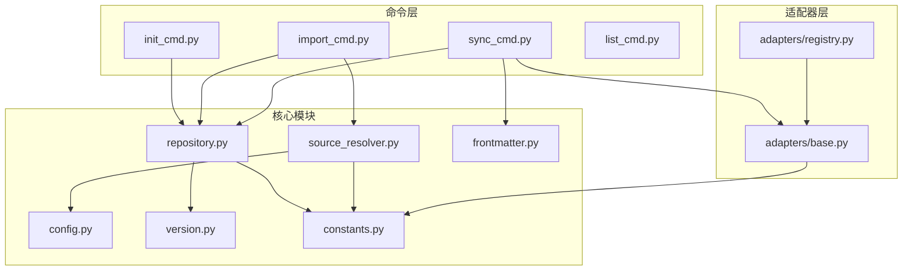
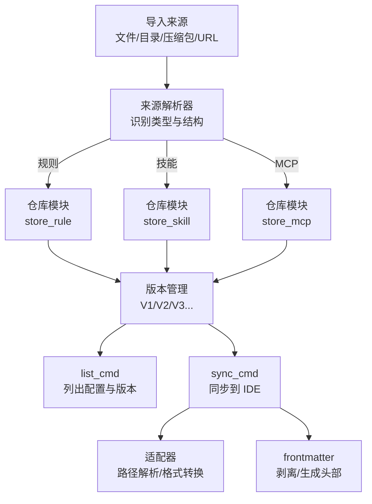
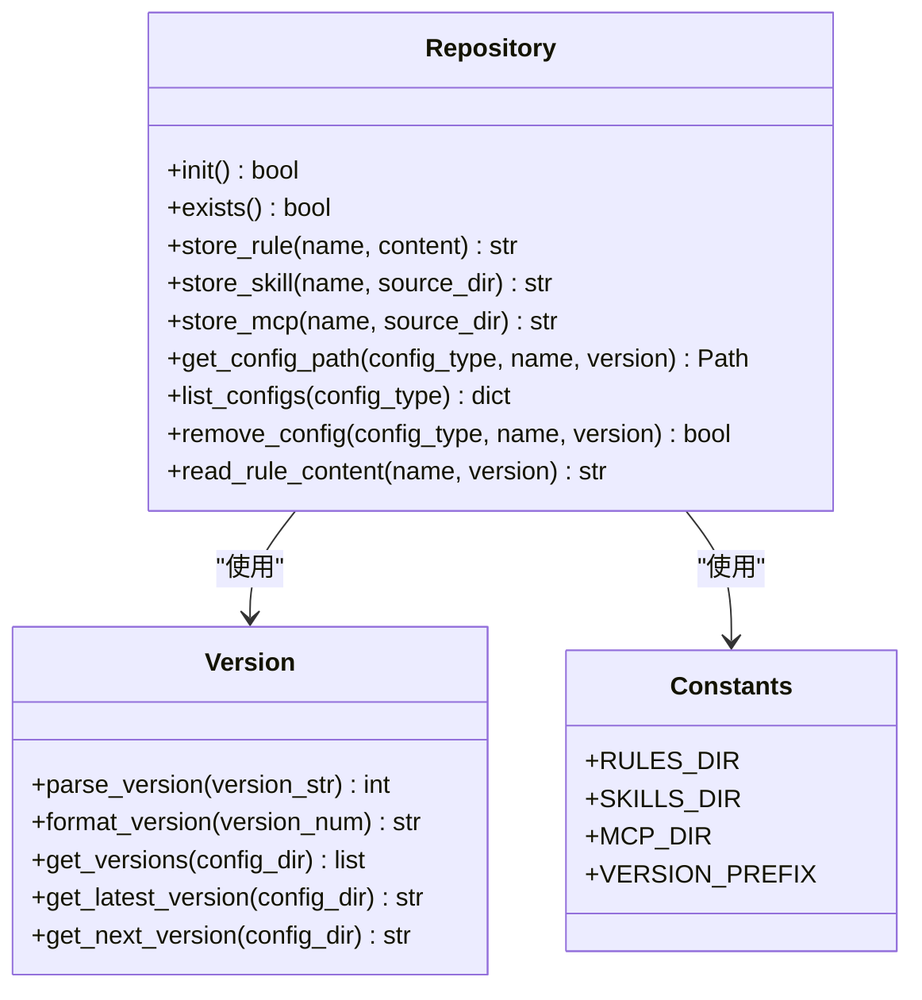
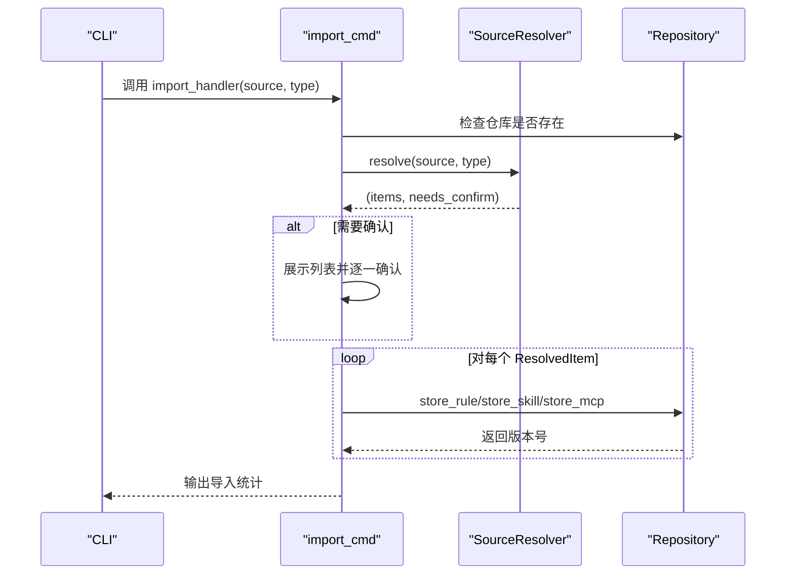
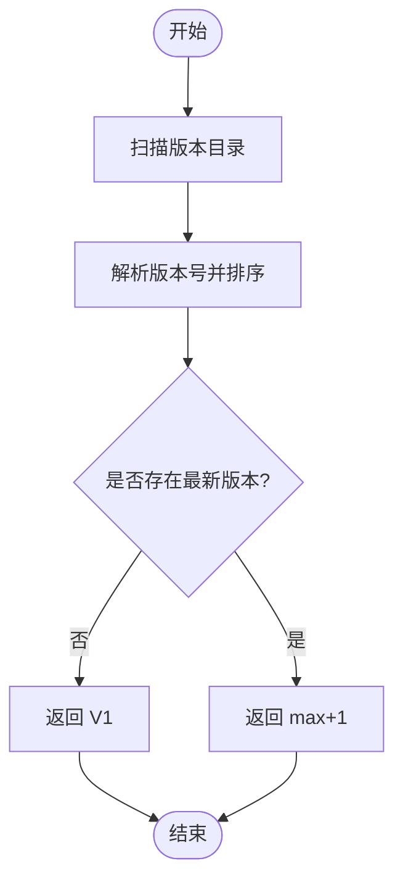
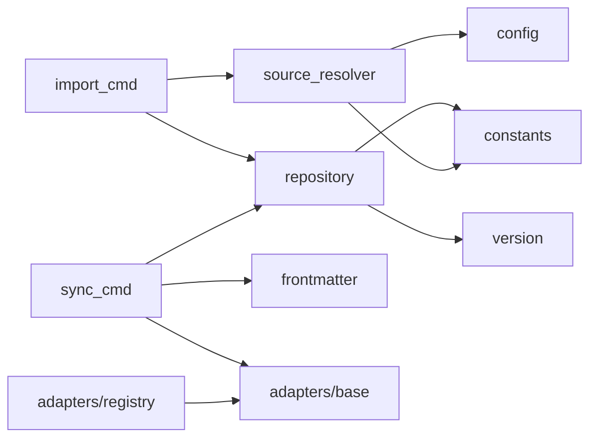

# 配置管理

<cite>
**本文引用的文件**
- [MSR-cli/msr_sync/core/config.py](file://MSR-cli/msr_sync/core/config.py)
- [MSR-cli/msr_sync/core/repository.py](file://MSR-cli/msr_sync/core/repository.py)
- [MSR-cli/msr_sync/core/source_resolver.py](file://MSR-cli/msr_sync/core/source_resolver.py)
- [MSR-cli/msr_sync/core/version.py](file://MSR-cli/msr_sync/core/version.py)
- [MSR-cli/msr_sync/core/frontmatter.py](file://MSR-cli/msr_sync/core/frontmatter.py)
- [MSR-cli/msr_sync/commands/init_cmd.py](file://MSR-cli/msr_sync/commands/init_cmd.py)
- [MSR-cli/msr_sync/commands/import_cmd.py](file://MSR-cli/msr_sync/commands/import_cmd.py)
- [MSR-cli/msr_sync/commands/sync_cmd.py](file://MSR-cli/msr_sync/commands/sync_cmd.py)
- [MSR-cli/msr_sync/commands/list_cmd.py](file://MSR-cli/msr_sync/commands/list_cmd.py)
- [MSR-cli/msr_sync/constants.py](file://MSR-cli/msr_sync/constants.py)
- [MSR-cli/msr_sync/adapters/base.py](file://MSR-cli/msr_sync/adapters/base.py)
- [MSR-cli/msr_sync/adapters/registry.py](file://MSR-cli/msr_sync/adapters/registry.py)
- [MSR-cli/tests/test_config.py](file://MSR-cli/tests/test_config.py)
- [MSR-cli/tests/test_repository.py](file://MSR-cli/tests/test_repository.py)
- [MSR-cli/tests/test_version.py](file://MSR-cli/tests/test_version.py)
</cite>

## 目录
1. [简介](#简介)
2. [项目结构](#项目结构)
3. [核心组件](#核心组件)
4. [架构总览](#架构总览)
5. [详细组件分析](#详细组件分析)
6. [依赖分析](#依赖分析)
7. [性能考虑](#性能考虑)
8. [故障排查指南](#故障排查指南)
9. [结论](#结论)
10. [附录](#附录)

## 简介
本文件面向“配置管理系统”的使用者与维护者，提供统一仓库的设计与管理机制说明，涵盖配置文件的组织方式、存储策略、访问模式、导入流程（支持的导入源类型、格式转换与验证）、导出与备份策略（批量与增量）、版本控制（历史管理、冲突解决与回滚）、配置模板使用与最佳实践，以及配置迁移与升级的完整流程。文档同时给出可视化图示与实操建议，帮助快速落地。

## 项目结构
MSR-sync 的 CLI 子项目采用“命令驱动 + 核心模块 + 适配器”的分层设计：
- 命令层：init、import、sync、list 等命令处理器，负责 CLI 交互与流程编排
- 核心模块：配置、仓库、版本、来源解析、frontmatter 等，提供通用能力
- 适配器层：针对不同 IDE 的路径解析、格式转换与扫描能力
- 常量与异常：统一常量与错误类型定义

图表来源
- [MSR-cli/msr_sync/commands/init_cmd.py:13-42](file://MSR-cli/msr_sync/commands/init_cmd.py#L13-L42)
- [MSR-cli/msr_sync/commands/import_cmd.py:14-56](file://MSR-cli/msr_sync/commands/import_cmd.py#L14-L56)
- [MSR-cli/msr_sync/commands/sync_cmd.py:26-131](file://MSR-cli/msr_sync/commands/sync_cmd.py#L26-L131)
- [MSR-cli/msr_sync/commands/list_cmd.py:12-39](file://MSR-cli/msr_sync/commands/list_cmd.py#L12-L39)
- [MSR-cli/msr_sync/core/config.py:91-127](file://MSR-cli/msr_sync/core/config.py#L91-L127)
- [MSR-cli/msr_sync/core/repository.py:23-63](file://MSR-cli/msr_sync/core/repository.py#L23-L63)
- [MSR-cli/msr_sync/core/source_resolver.py:43-110](file://MSR-cli/msr_sync/core/source_resolver.py#L43-L110)
- [MSR-cli/msr_sync/core/version.py:59-118](file://MSR-cli/msr_sync/core/version.py#L59-L118)
- [MSR-cli/msr_sync/core/frontmatter.py:10-60](file://MSR-cli/msr_sync/core/frontmatter.py#L10-L60)
- [MSR-cli/msr_sync/constants.py:16-46](file://MSR-cli/msr_sync/constants.py#L16-L46)
- [MSR-cli/msr_sync/adapters/base.py:8-105](file://MSR-cli/msr_sync/adapters/base.py#L8-L105)
- [MSR-cli/msr_sync/adapters/registry.py:45-87](file://MSR-cli/msr_sync/adapters/registry.py#L45-L87)

章节来源
- [MSR-cli/msr_sync/commands/init_cmd.py:13-42](file://MSR-cli/msr_sync/commands/init_cmd.py#L13-L42)
- [MSR-cli/msr_sync/commands/import_cmd.py:14-56](file://MSR-cli/msr_sync/commands/import_cmd.py#L14-L56)
- [MSR-cli/msr_sync/commands/sync_cmd.py:26-131](file://MSR-cli/msr_sync/commands/sync_cmd.py#L26-L131)
- [MSR-cli/msr_sync/commands/list_cmd.py:12-39](file://MSR-cli/msr_sync/commands/list_cmd.py#L12-L39)
- [MSR-cli/msr_sync/core/config.py:91-127](file://MSR-cli/msr_sync/core/config.py#L91-L127)
- [MSR-cli/msr_sync/core/repository.py:23-63](file://MSR-cli/msr_sync/core/repository.py#L23-L63)
- [MSR-cli/msr_sync/core/source_resolver.py:43-110](file://MSR-cli/msr_sync/core/source_resolver.py#L43-L110)
- [MSR-cli/msr_sync/core/version.py:59-118](file://MSR-cli/msr_sync/core/version.py#L59-L118)
- [MSR-cli/msr_sync/core/frontmatter.py:10-60](file://MSR-cli/msr_sync/core/frontmatter.py#L10-L60)
- [MSR-cli/msr_sync/constants.py:16-46](file://MSR-cli/msr_sync/constants.py#L16-L46)
- [MSR-cli/msr_sync/adapters/base.py:8-105](file://MSR-cli/msr_sync/adapters/base.py#L8-L105)
- [MSR-cli/msr_sync/adapters/registry.py:45-87](file://MSR-cli/msr_sync/adapters/registry.py#L45-L87)

## 核心组件
- 全局配置模块：加载与管理用户配置，提供默认值、路径展开、校验与单例管理
- 统一仓库模块：管理 RULES/SKILLS/MCP 三类配置的导入、查询、删除、版本管理
- 来源解析模块：解析文件/目录/压缩包/URL 四类导入源，支持规则与目录结构识别
- 版本管理模块：解析/格式化版本号、获取最新/下一版本，保证版本命名规范
- Frontmatter 模块：剥离/解析 Markdown frontmatter，生成 IDE 模板头部
- 命令处理器：init/import/sync/list，串联上述模块完成端到端流程
- 适配器与注册表：抽象 IDE 差异，提供路径解析、格式转换与扫描能力

章节来源
- [MSR-cli/msr_sync/core/config.py:18-88](file://MSR-cli/msr_sync/core/config.py#L18-L88)
- [MSR-cli/msr_sync/core/repository.py:23-63](file://MSR-cli/msr_sync/core/repository.py#L23-L63)
- [MSR-cli/msr_sync/core/source_resolver.py:43-110](file://MSR-cli/msr_sync/core/source_resolver.py#L43-L110)
- [MSR-cli/msr_sync/core/version.py:59-118](file://MSR-cli/msr_sync/core/version.py#L59-L118)
- [MSR-cli/msr_sync/core/frontmatter.py:10-60](file://MSR-cli/msr_sync/core/frontmatter.py#L10-L60)
- [MSR-cli/msr_sync/commands/init_cmd.py:13-42](file://MSR-cli/msr_sync/commands/init_cmd.py#L13-L42)
- [MSR-cli/msr_sync/commands/import_cmd.py:14-56](file://MSR-cli/msr_sync/commands/import_cmd.py#L14-L56)
- [MSR-cli/msr_sync/commands/sync_cmd.py:26-131](file://MSR-cli/msr_sync/commands/sync_cmd.py#L26-L131)
- [MSR-cli/msr_sync/commands/list_cmd.py:12-39](file://MSR-cli/msr_sync/commands/list_cmd.py#L12-L39)
- [MSR-cli/msr_sync/adapters/base.py:8-105](file://MSR-cli/msr_sync/adapters/base.py#L8-L105)
- [MSR-cli/msr_sync/adapters/registry.py:45-87](file://MSR-cli/msr_sync/adapters/registry.py#L45-L87)

## 架构总览
统一仓库采用三层目录结构：RULES、SKILLS、MCP。每个配置条目下按版本号 V1/V2/V3… 存放具体文件或目录。导入流程通过来源解析器识别来源类型与结构，再由仓库模块进行版本化存储。同步流程从仓库读取配置，经 frontmatter 处理与适配器格式转换后写入目标 IDE。

图表来源
- [MSR-cli/msr_sync/core/source_resolver.py:77-110](file://MSR-cli/msr_sync/core/source_resolver.py#L77-L110)
- [MSR-cli/msr_sync/core/repository.py:89-158](file://MSR-cli/msr_sync/core/repository.py#L89-L158)
- [MSR-cli/msr_sync/core/version.py:59-118](file://MSR-cli/msr_sync/core/version.py#L59-L118)
- [MSR-cli/msr_sync/commands/list_cmd.py:12-39](file://MSR-cli/msr_sync/commands/list_cmd.py#L12-L39)
- [MSR-cli/msr_sync/commands/sync_cmd.py:133-171](file://MSR-cli/msr_sync/commands/sync_cmd.py#L133-L171)
- [MSR-cli/msr_sync/core/frontmatter.py:10-60](file://MSR-cli/msr_sync/core/frontmatter.py#L10-L60)
- [MSR-cli/msr_sync/adapters/base.py:25-76](file://MSR-cli/msr_sync/adapters/base.py#L25-L76)

## 详细组件分析

### 统一仓库结构与管理机制
- 目录布局
  - RULES/<name>/Vn/<name>.md：规则文件，按版本存放
  - SKILLS/<name>/Vn/：技能目录，按版本存放
  - MCP/<name>/Vn/：MCP 配置目录，按版本存放
- 初始化与存在性检查
  - init() 创建 RULES/SKILLS/MCP 三层目录，幂等返回是否新建
  - exists() 检查根目录与子目录是否存在
- 配置读写与版本管理
  - store_rule/store_skill/store_mcp 自动递增版本号并写入
  - get_config_path 支持指定版本或获取最新版本路径
  - list_configs 按类型/名称/版本聚合展示
  - remove_config 删除指定版本目录
  - read_rule_content 读取规则内容

图表来源
- [MSR-cli/msr_sync/core/repository.py:23-291](file://MSR-cli/msr_sync/core/repository.py#L23-L291)
- [MSR-cli/msr_sync/core/version.py:59-118](file://MSR-cli/msr_sync/core/version.py#L59-L118)
- [MSR-cli/msr_sync/constants.py:10-46](file://MSR-cli/msr_sync/constants.py#L10-L46)

章节来源
- [MSR-cli/msr_sync/core/repository.py:23-291](file://MSR-cli/msr_sync/core/repository.py#L23-L291)
- [MSR-cli/msr_sync/core/version.py:59-118](file://MSR-cli/msr_sync/core/version.py#L59-L118)
- [MSR-cli/msr_sync/constants.py:10-46](file://MSR-cli/msr_sync/constants.py#L10-L46)

### 配置导入流程（来源类型、格式转换与验证）
- 支持的导入源类型
  - 文件：仅 .md 文件（规则）
  - 目录：按规则/技能/MCP 的目录结构识别
  - 压缩包：.zip、.tar.gz、.tgz，自动解压并解析
  - URL：下载压缩包后按压缩包流程解析
- 格式转换与验证
  - 规则：读取 .md 内容，剥离 frontmatter，按 IDE 生成模板头部
  - 技能：复制目录结构，遵循技能标识文件约定
  - MCP：读取 mcp.json，合并服务器条目
- 用户确认
  - 多项导入时逐项确认，单项导入直接执行

图表来源
- [MSR-cli/msr_sync/commands/import_cmd.py:14-56](file://MSR-cli/msr_sync/commands/import_cmd.py#L14-L56)
- [MSR-cli/msr_sync/core/source_resolver.py:77-110](file://MSR-cli/msr_sync/core/source_resolver.py#L77-L110)
- [MSR-cli/msr_sync/core/repository.py:89-158](file://MSR-cli/msr_sync/core/repository.py#L89-L158)

章节来源
- [MSR-cli/msr_sync/commands/import_cmd.py:14-56](file://MSR-cli/msr_sync/commands/import_cmd.py#L14-L56)
- [MSR-cli/msr_sync/core/source_resolver.py:77-110](file://MSR-cli/msr_sync/core/source_resolver.py#L77-L110)
- [MSR-cli/msr_sync/core/repository.py:89-158](file://MSR-cli/msr_sync/core/repository.py#L89-L158)

### 配置导出与备份策略（批量与增量）
- 批量导出
  - 使用 list 命令查看仓库配置与版本，结合版本号进行批量导出
- 增量备份
  - 通过版本管理模块获取最新版本，对比历史版本差异，仅备份变更版本
- 建议
  - 定期执行 list 与版本对比，形成增量备份计划
  - 对 MCP 配置，建议在导出前统一 cwd 路径，避免跨机器路径漂移

章节来源
- [MSR-cli/msr_sync/commands/list_cmd.py:12-39](file://MSR-cli/msr_sync/commands/list_cmd.py#L12-L39)
- [MSR-cli/msr_sync/core/version.py:59-118](file://MSR-cli/msr_sync/core/version.py#L59-L118)
- [MSR-cli/msr_sync/commands/sync_cmd.py:238-287](file://MSR-cli/msr_sync/commands/sync_cmd.py#L238-L287)

### 版本控制（历史管理、冲突解决与回滚）
- 历史管理
  - 每个配置条目按 V1/V2/V3… 存放，get_versions 返回排序后的版本列表
  - get_latest_version 返回最大版本号，get_next_version 基于最大版本递增
- 冲突解决
  - 同名配置再次导入时自动创建新版本，不覆盖历史版本
  - MCP 同名服务器条目合并时提示用户确认覆盖
- 回滚机制
  - 通过指定版本号读取与同步，实现回滚到历史版本
  - 删除版本目录可回滚至更早版本（需谨慎）

图表来源
- [MSR-cli/msr_sync/core/version.py:59-118](file://MSR-cli/msr_sync/core/version.py#L59-L118)

章节来源
- [MSR-cli/msr_sync/core/version.py:59-118](file://MSR-cli/msr_sync/core/version.py#L59-L118)
- [MSR-cli/msr_sync/commands/sync_cmd.py:290-349](file://MSR-cli/msr_sync/commands/sync_cmd.py#L290-L349)

### 配置模板与最佳实践
- 规则模板
  - 使用 frontmatter 模块生成 IDE 模板头部，确保触发条件与元数据一致
  - 建议在规则中保留必要的 frontmatter，便于剥离与复用
- 技能模板
  - 以包含标识文件的目录作为单个技能，便于导入与管理
- MCP 模板
  - 统一 mcp.json 的服务器条目结构，避免跨机器路径问题
  - 同名条目合并时注意确认覆盖，防止误删

章节来源
- [MSR-cli/msr_sync/core/frontmatter.py:110-144](file://MSR-cli/msr_sync/core/frontmatter.py#L110-L144)
- [MSR-cli/msr_sync/core/source_resolver.py:375-403](file://MSR-cli/msr_sync/core/source_resolver.py#L375-L403)
- [MSR-cli/msr_sync/commands/sync_cmd.py:238-287](file://MSR-cli/msr_sync/commands/sync_cmd.py#L238-L287)

### 配置迁移与升级流程
- 初始化与合并
  - init 命令创建统一仓库并生成默认配置文件
  - --merge 选项扫描各 IDE 现有配置并导入到统一仓库
- 升级策略
  - 通过版本管理模块获取最新版本，逐步替换旧版本
  - 对 MCP 配置，升级前统一 cwd 路径，避免路径漂移导致失效

章节来源
- [MSR-cli/msr_sync/commands/init_cmd.py:13-42](file://MSR-cli/msr_sync/commands/init_cmd.py#L13-L42)
- [MSR-cli/msr_sync/commands/sync_cmd.py:238-287](file://MSR-cli/msr_sync/commands/sync_cmd.py#L238-L287)

## 依赖分析
- 命令层依赖核心模块与适配器层
- 仓库模块依赖版本管理与常量
- 来源解析模块依赖配置与常量
- 同步流程依赖仓库、frontmatter 与适配器

图表来源
- [MSR-cli/msr_sync/commands/import_cmd.py:14-56](file://MSR-cli/msr_sync/commands/import_cmd.py#L14-L56)
- [MSR-cli/msr_sync/commands/sync_cmd.py:26-131](file://MSR-cli/msr_sync/commands/sync_cmd.py#L26-L131)
- [MSR-cli/msr_sync/core/repository.py:23-63](file://MSR-cli/msr_sync/core/repository.py#L23-L63)
- [MSR-cli/msr_sync/core/source_resolver.py:43-110](file://MSR-cli/msr_sync/core/source_resolver.py#L43-L110)
- [MSR-cli/msr_sync/core/frontmatter.py:10-60](file://MSR-cli/msr_sync/core/frontmatter.py#L10-L60)
- [MSR-cli/msr_sync/adapters/base.py:8-105](file://MSR-cli/msr_sync/adapters/base.py#L8-L105)
- [MSR-cli/msr_sync/adapters/registry.py:45-87](file://MSR-cli/msr_sync/adapters/registry.py#L45-L87)

章节来源
- [MSR-cli/msr_sync/commands/import_cmd.py:14-56](file://MSR-cli/msr_sync/commands/import_cmd.py#L14-L56)
- [MSR-cli/msr_sync/commands/sync_cmd.py:26-131](file://MSR-cli/msr_sync/commands/sync_cmd.py#L26-L131)
- [MSR-cli/msr_sync/core/repository.py:23-63](file://MSR-cli/msr_sync/core/repository.py#L23-L63)
- [MSR-cli/msr_sync/core/source_resolver.py:43-110](file://MSR-cli/msr_sync/core/source_resolver.py#L43-L110)
- [MSR-cli/msr_sync/core/frontmatter.py:10-60](file://MSR-cli/msr_sync/core/frontmatter.py#L10-L60)
- [MSR-cli/msr_sync/adapters/base.py:8-105](file://MSR-cli/msr_sync/adapters/base.py#L8-L105)
- [MSR-cli/msr_sync/adapters/registry.py:45-87](file://MSR-cli/msr_sync/adapters/registry.py#L45-L87)

## 性能考虑
- 导入阶段
  - 压缩包与 URL 导入涉及 IO 与网络，建议在本地缓存与并发下载场景下评估资源占用
  - 目录扫描与忽略模式匹配采用通配符与精确匹配，建议合理设置忽略模式减少扫描开销
- 同步阶段
  - 规则同步为小文件写入，性能主要受磁盘 IO 影响
  - MCP 合并涉及 JSON 解析与写入，建议在合并前进行预校验
- 版本管理
  - 版本号解析与排序为 O(n log n)，在大量版本场景下建议定期清理历史版本

## 故障排查指南
- 仓库未初始化
  - 现象：执行仓库相关操作时报错
  - 处理：先执行初始化命令创建目录结构
- 配置文件错误
  - 现象：YAML 语法错误或默认值回退
  - 处理：检查配置文件语法与键名，必要时重新生成默认配置
- 来源无效
  - 现象：无法识别导入源或格式不支持
  - 处理：确认来源类型与扩展名，检查压缩包完整性与 URL 可达性
- 同步冲突
  - 现象：MCP 同名条目冲突
  - 处理：按提示确认覆盖或调整条目名称

章节来源
- [MSR-cli/msr_sync/core/repository.py:65-70](file://MSR-cli/msr_sync/core/repository.py#L65-L70)
- [MSR-cli/msr_sync/core/config.py:113-127](file://MSR-cli/msr_sync/core/config.py#L113-L127)
- [MSR-cli/msr_sync/core/source_resolver.py:130-150](file://MSR-cli/msr_sync/core/source_resolver.py#L130-L150)
- [MSR-cli/msr_sync/commands/sync_cmd.py:326-334](file://MSR-cli/msr_sync/commands/sync_cmd.py#L326-L334)

## 结论
本系统通过统一仓库与版本化管理，实现了规则、技能与 MCP 配置的集中存储与多版本演进；通过来源解析与适配器抽象，兼容多种导入源与 IDE 差异；通过 frontmatter 处理与模板头部生成，确保配置在不同 IDE 中的一致性与可用性。配合清单与同步命令，可实现批量与增量的运维策略，并提供完善的冲突处理与回滚能力。

## 附录
- 常用命令
  - 初始化：创建统一仓库与默认配置
  - 导入：支持文件/目录/压缩包/URL 四类来源
  - 同步：按 IDE/层级/类型/名称/版本精确同步
  - 列表：以树形结构展示配置与版本
- 测试参考
  - 配置模块、仓库模块与版本模块均具备属性测试与单元测试，可作为行为验证与回归测试的参考

章节来源
- [MSR-cli/tests/test_config.py:1-435](file://MSR-cli/tests/test_config.py#L1-L435)
- [MSR-cli/tests/test_repository.py:1-547](file://MSR-cli/tests/test_repository.py#L1-L547)
- [MSR-cli/tests/test_version.py:1-276](file://MSR-cli/tests/test_version.py#L1-L276)