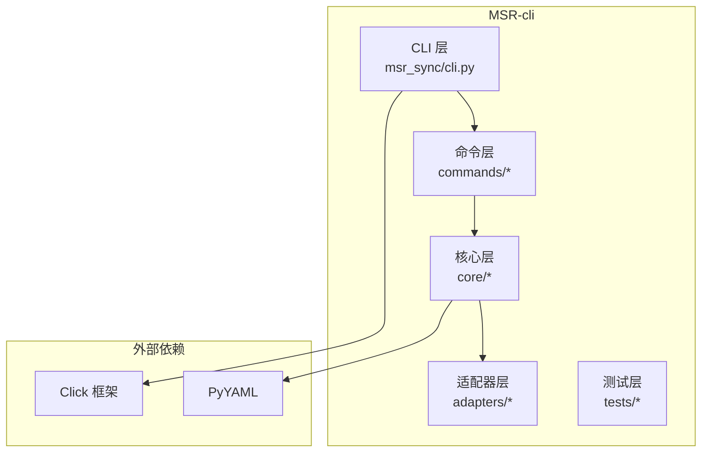
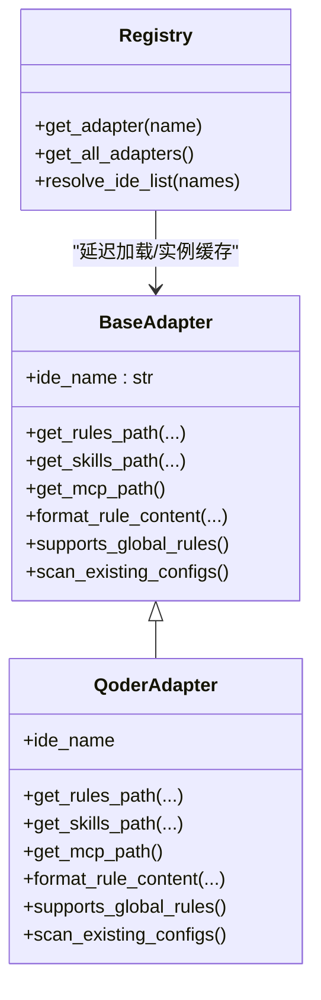
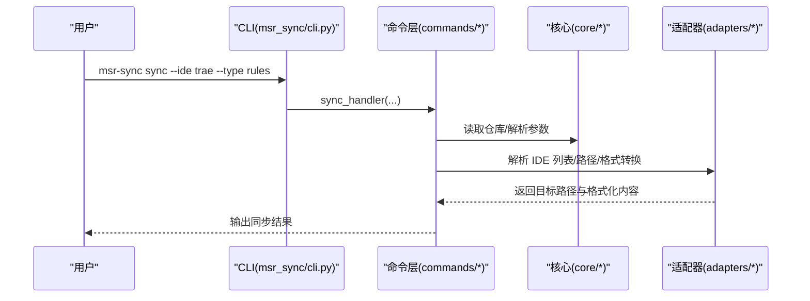
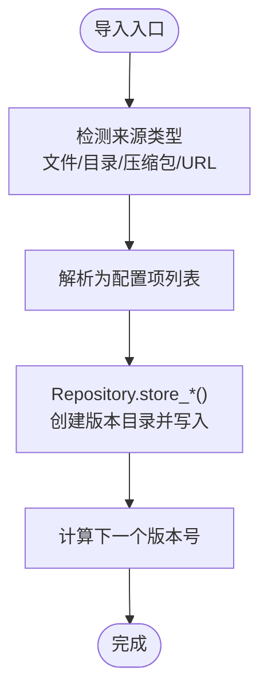
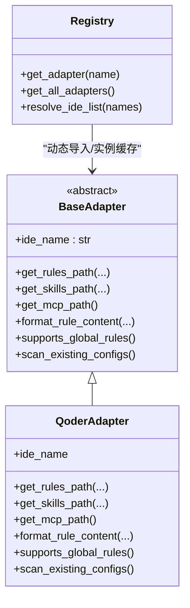
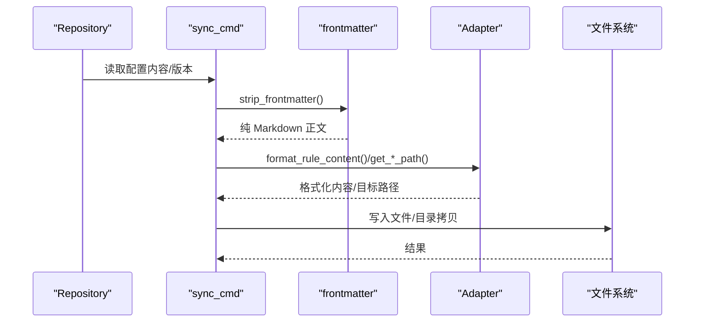
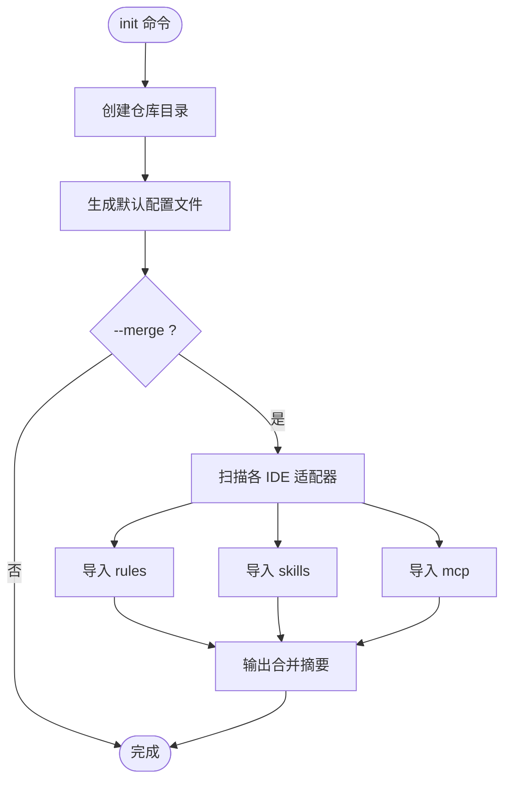
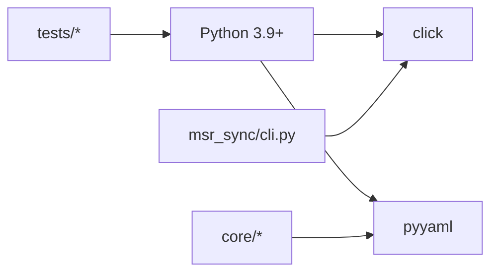

# 项目概述

<cite>
**本文引用的文件**
- [blog-msr-sync.md](file://blog-msr-sync.md)
- [pyproject.toml](file://MSR-cli/pyproject.toml)
- [cli.py](file://MSR-cli/msr_sync/cli.py)
- [constants.py](file://MSR-cli/msr_sync/constants.py)
- [config.py](file://MSR-cli/msr_sync/core/config.py)
- [base.py](file://MSR-cli/msr_sync/adapters/base.py)
- [registry.py](file://MSR-cli/msr_sync/adapters/registry.py)
- [qoder.py](file://MSR-cli/msr_sync/adapters/qoder.py)
- [repository.py](file://MSR-cli/msr_sync/core/repository.py)
- [frontmatter.py](file://MSR-cli/msr_sync/core/frontmatter.py)
- [version.py](file://MSR-cli/msr_sync/core/version.py)
- [platform.py](file://MSR-cli/msr_sync/core/platform.py)
- [source_resolver.py](file://MSR-cli/msr_sync/core/source_resolver.py)
- [init_cmd.py](file://MSR-cli/msr_sync/commands/init_cmd.py)
- [sync_cmd.py](file://MSR-cli/msr_sync/commands/sync_cmd.py)
</cite>

## 目录
1. [引言](#引言)
2. [项目结构](#项目结构)
3. [核心组件](#核心组件)
4. [架构总览](#架构总览)
5. [详细组件分析](#详细组件分析)
6. [依赖分析](#依赖分析)
7. [性能考虑](#性能考虑)
8. [故障排查指南](#故障排查指南)
9. [结论](#结论)
10. [附录](#附录)

## 引言
MSR-v2 是一款面向 AI IDE 的配置管理工具，核心价值在于“统一管理多款 AI IDE 的 rules、skills、MCP 配置”，并通过 CLI 工具实现跨 IDE 的一键同步。其设计理念是建立一个“本地统一仓库”作为 Single Source of Truth，将分散在不同 IDE 的配置集中存储、版本化管理，并在需要时自动转换为目标 IDE 的格式与路径，从而消除配置碎片化带来的重复劳动与一致性风险。

MSR-cli（命令名为 msr-sync）支持 Trae、Qoder、Lingma、CodeBuddy 四大 AI IDE，覆盖规则（Rules）、技能（Skills）、MCP 工具配置三大类。项目强调跨平台支持（macOS/Windows）、版本控制（V1/V2/V3…）、自动格式转换（frontmatter 头部、MCP 合并策略、目录拷贝）、以及通过适配器模式实现的可扩展架构。

## 项目结构
MSR-v2 采用模块化的分层组织，核心位于 MSR-cli 子项目中，包含 CLI、命令层、核心业务层、适配器层与测试模块；根目录还包含文档与 GUI 相关占位目录。下图展示了主要模块与职责划分：

图表来源
- [cli.py:1-116](file://MSR-cli/msr_sync/cli.py#L1-L116)
- [config.py:1-204](file://MSR-cli/msr_sync/core/config.py#L1-L204)
- [repository.py:1-291](file://MSR-cli/msr_sync/core/repository.py#L1-L291)
- [base.py:1-105](file://MSR-cli/msr_sync/adapters/base.py#L1-L105)
- [registry.py:1-88](file://MSR-cli/msr_sync/adapters/registry.py#L1-L88)
- [pyproject.toml:1-37](file://MSR-cli/pyproject.toml#L1-L37)

章节来源
- [pyproject.toml:1-37](file://MSR-cli/pyproject.toml#L1-L37)
- [cli.py:1-116](file://MSR-cli/msr_sync/cli.py#L1-L116)

## 核心组件
- CLI 层：基于 Click 定义 init/import/list/remove/sync 等子命令，负责参数解析与错误输出。
- 命令层：init_cmd、sync_cmd 等，封装业务编排与流程控制。
- 核心层：Repository（统一仓库）、config（全局配置）、frontmatter（Markdown frontmatter 解析/生成）、version（版本管理）、platform（平台检测）、source_resolver（导入来源解析）。
- 适配器层：BaseAdapter 抽象 + 各 IDE 适配器（如 QoderAdapter），负责路径解析、格式转换与扫描已有配置。
- 常量与配置：constants 定义仓库目录、配置类型、平台支持等；config 提供默认配置模板与加载机制。

章节来源
- [cli.py:1-116](file://MSR-cli/msr_sync/cli.py#L1-L116)
- [constants.py:1-50](file://MSR-cli/msr_sync/constants.py#L1-L50)
- [config.py:1-204](file://MSR-cli/msr_sync/core/config.py#L1-L204)
- [repository.py:1-291](file://MSR-cli/msr_sync/core/repository.py#L1-L291)
- [frontmatter.py:1-145](file://MSR-cli/msr_sync/core/frontmatter.py#L1-L145)
- [version.py:1-119](file://MSR-cli/msr_sync/core/version.py#L1-L119)
- [platform.py:1-60](file://MSR-cli/msr_sync/core/platform.py#L1-L60)
- [source_resolver.py:1-404](file://MSR-cli/msr_sync/core/source_resolver.py#L1-L404)
- [base.py:1-105](file://MSR-cli/msr_sync/adapters/base.py#L1-L105)
- [registry.py:1-88](file://MSR-cli/msr_sync/adapters/registry.py#L1-L88)
- [qoder.py:1-140](file://MSR-cli/msr_sync/adapters/qoder.py#L1-L140)

## 架构总览
MSR-cli 采用四层分层架构与适配器模式相结合的设计：
- CLI 层：命令入口与参数绑定。
- 命令层：业务编排与流程控制。
- 核心层：纯业务逻辑（仓库、版本、frontmatter、平台、来源解析）。
- 适配器层：IDE 特定实现，通过注册表延迟加载与实例缓存，屏蔽具体 IDE 差异。

图表来源
- [base.py:1-105](file://MSR-cli/msr_sync/adapters/base.py#L1-L105)
- [qoder.py:1-140](file://MSR-cli/msr_sync/adapters/qoder.py#L1-L140)
- [registry.py:1-88](file://MSR-cli/msr_sync/adapters/registry.py#L1-L88)

章节来源
- [base.py:1-105](file://MSR-cli/msr_sync/adapters/base.py#L1-L105)
- [registry.py:1-88](file://MSR-cli/msr_sync/adapters/registry.py#L1-L88)
- [blog-msr-sync.md:297-344](file://blog-msr-sync.md#L297-L344)

## 详细组件分析

### CLI 与命令层
- init：初始化统一仓库与默认配置文件；支持 --merge 合并已有 IDE 配置。
- import：解析来源（文件/目录/压缩包/URL），按类型识别配置项并导入仓库。
- sync：按 IDE、作用域（global/project）、类型、名称、版本进行同步；支持默认配置覆盖。
- list/remove：列出仓库配置与删除指定版本。

图表来源
- [cli.py:58-82](file://MSR-cli/msr_sync/cli.py#L58-L82)
- [sync_cmd.py:26-131](file://MSR-cli/msr_sync/commands/sync_cmd.py#L26-L131)
- [registry.py:74-87](file://MSR-cli/msr_sync/adapters/registry.py#L74-L87)

章节来源
- [cli.py:1-116](file://MSR-cli/msr_sync/cli.py#L1-L116)
- [sync_cmd.py:1-411](file://MSR-cli/msr_sync/commands/sync_cmd.py#L1-L411)

### 统一仓库与版本管理
- Repository：负责仓库初始化、导入/读取/删除配置、版本目录结构管理（V1/V2/V3…）。
- version：版本解析、格式化、排序与下一个版本计算，拒绝非法前导零等边界情况。
- frontmatter：剥离/解析 Markdown frontmatter，并生成各 IDE 的模板头部（Qoder/Lingma/CodeBuddy）。

图表来源
- [source_resolver.py:77-110](file://MSR-cli/msr_sync/core/source_resolver.py#L77-L110)
- [repository.py:89-158](file://MSR-cli/msr_sync/core/repository.py#L89-L158)
- [version.py:103-119](file://MSR-cli/msr_sync/core/version.py#L103-L119)

章节来源
- [repository.py:1-291](file://MSR-cli/msr_sync/core/repository.py#L1-L291)
- [version.py:1-119](file://MSR-cli/msr_sync/core/version.py#L1-L119)
- [frontmatter.py:1-145](file://MSR-cli/msr_sync/core/frontmatter.py#L1-L145)

### 适配器层与 IDE 差异化解耦
- BaseAdapter：定义统一接口（路径解析、格式转换、能力查询、扫描已有配置）。
- Registry：延迟加载与实例缓存，支持 "all" 展开，解析 IDE 名称列表。
- QoderAdapter 示例：实现路径约定（项目级/用户级）、格式转换（Qoder frontmatter）、扫描逻辑与能力声明。

图表来源
- [base.py:1-105](file://MSR-cli/msr_sync/adapters/base.py#L1-L105)
- [qoder.py:1-140](file://MSR-cli/msr_sync/adapters/qoder.py#L1-L140)
- [registry.py:1-88](file://MSR-cli/msr_sync/adapters/registry.py#L1-L88)

章节来源
- [base.py:1-105](file://MSR-cli/msr_sync/adapters/base.py#L1-L105)
- [registry.py:1-88](file://MSR-cli/msr_sync/adapters/registry.py#L1-L88)
- [qoder.py:1-140](file://MSR-cli/msr_sync/adapters/qoder.py#L1-L140)

### 同步流程与格式转换
- Rules：剥离原始 frontmatter，按目标 IDE 添加模板头部，写入目标路径。
- Skills：目录拷贝（shutil.copytree），目标存在时确认覆盖。
- MCP：JSON 合并策略（mcpServers），同名 server 提示覆盖，自动重写 cwd 指向仓库版本目录。

图表来源
- [sync_cmd.py:179-231](file://MSR-cli/msr_sync/commands/sync_cmd.py#L179-L231)
- [frontmatter.py:10-24](file://MSR-cli/msr_sync/core/frontmatter.py#L10-L24)
- [base.py:65-76](file://MSR-cli/msr_sync/adapters/base.py#L65-L76)

章节来源
- [sync_cmd.py:1-411](file://MSR-cli/msr_sync/commands/sync_cmd.py#L1-L411)
- [frontmatter.py:1-145](file://MSR-cli/msr_sync/core/frontmatter.py#L1-L145)
- [base.py:1-105](file://MSR-cli/msr_sync/adapters/base.py#L1-L105)

### 初始化与合并已有配置
- init：创建仓库与默认配置文件；--merge 时扫描各 IDE 适配器的现有配置并导入。
- 扫描与导入：遍历适配器，读取规则/技能/MCP，写入统一仓库并统计摘要。

图表来源
- [init_cmd.py:13-42](file://MSR-cli/msr_sync/commands/init_cmd.py#L13-L42)
- [registry.py:65-71](file://MSR-cli/msr_sync/adapters/registry.py#L65-L71)

章节来源
- [init_cmd.py:1-137](file://MSR-cli/msr_sync/commands/init_cmd.py#L1-L137)
- [registry.py:1-88](file://MSR-cli/msr_sync/adapters/registry.py#L1-L88)

## 依赖分析
- 技术栈与运行环境
  - Python 3.9+
  - 依赖：click（命令行）、pyyaml（配置解析）
  - 可选开发依赖：pytest、hypothesis
- 平台与兼容性
  - 双平台支持（macOS/Windows），自动检测并适配路径差异。
  - 支持的 IDE：Trae、Qoder、Lingma、CodeBuddy。
  - 支持的配置类型：rules、skills、mcp。
- 依赖关系可视化

图表来源
- [pyproject.toml:18-21](file://MSR-cli/pyproject.toml#L18-L21)
- [cli.py:1-116](file://MSR-cli/msr_sync/cli.py#L1-L116)
- [config.py:1-204](file://MSR-cli/msr_sync/core/config.py#L1-L204)

章节来源
- [pyproject.toml:1-37](file://MSR-cli/pyproject.toml#L1-L37)
- [platform.py:1-60](file://MSR-cli/msr_sync/core/platform.py#L1-L60)

## 性能考虑
- 幂等与最小化 IO：init 重复执行不破坏数据；仓库初始化仅创建必要目录。
- 版本化与增量：导入同名配置自动递增版本，避免覆盖与冲突。
- 并发与资源管理：SourceResolver 统一管理临时目录并在 finally 清理，减少磁盘占用与泄漏风险。
- 适配器缓存：Registry 缓存适配器实例，避免重复导入与实例化成本。
- 同步策略：Rules 与 MCP 采用按需转换与合并，避免不必要的文件写入。

## 故障排查指南
- 常见错误与定位
  - 未初始化仓库：执行 sync 前确保已 init；仓库不存在时抛出异常。
  - 配置文件错误：config.yaml YAML 语法错误会触发 ConfigFileError。
  - 来源无效：文件/目录/压缩包/URL 不匹配或格式不支持时抛出 InvalidSourceError。
  - 网络错误：URL 下载失败抛出 NetworkError。
  - 平台不支持：非 macOS/Windows 触发 UnsupportedPlatformError。
- 建议排查步骤
  - 检查 ~/.msr-sync/config.yaml 是否存在且格式正确。
  - 确认仓库目录结构完整（RULES/SKILLS/MCP 子目录）。
  - 使用 list 命令核对仓库内配置与版本。
  - 使用 --verbose 或逐条同步定位具体失败项。
  - 在 Windows/macOS 上确认平台路径解析是否正确。

章节来源
- [config.py:91-127](file://MSR-cli/msr_sync/core/config.py#L91-L127)
- [source_resolver.py:327-361](file://MSR-cli/msr_sync/core/source_resolver.py#L327-L361)
- [platform.py:28-30](file://MSR-cli/msr_sync/core/platform.py#L28-L30)
- [sync_cmd.py:52-54](file://MSR-cli/msr_sync/commands/sync_cmd.py#L52-L54)

## 结论
MSR-v2 通过“统一仓库 + 适配器模式”的架构，有效解决了多 AI IDE 配置碎片化问题。其 CLI 工具以简洁命令实现复杂的跨 IDE 同步与格式转换，配合版本管理与平台适配，既满足初学者快速上手，也为进阶用户提供良好的扩展空间。未来可在 GUI 界面、更多 IDE 支持与团队协作能力方面持续演进。

## 附录
- 快速上手要点
  - 安装：pip install msr-sync 或源码安装。
  - 初始化：msr-sync init；可选 --merge 收录已有配置。
  - 导入：支持文件/目录/压缩包/URL 四种来源。
  - 同步：按 IDE、作用域、类型、名称、版本精确控制。
  - 查看与删除：msr-sync list 与 remove。
- 支持的 IDE 与平台
  - IDE：Trae、Qoder、Lingma、CodeBuddy。
  - 平台：macOS、Windows。
  - Python：3.9+

章节来源
- [blog-msr-sync.md:70-421](file://blog-msr-sync.md#L70-L421)
- [constants.py:33-50](file://MSR-cli/msr_sync/constants.py#L33-L50)
- [platform.py:1-60](file://MSR-cli/msr_sync/core/platform.py#L1-L60)