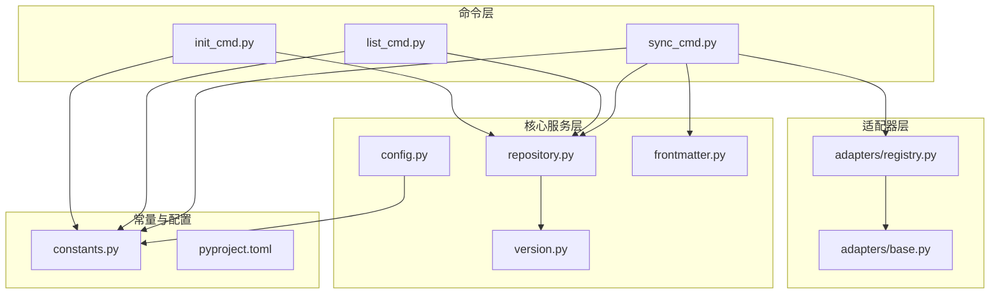
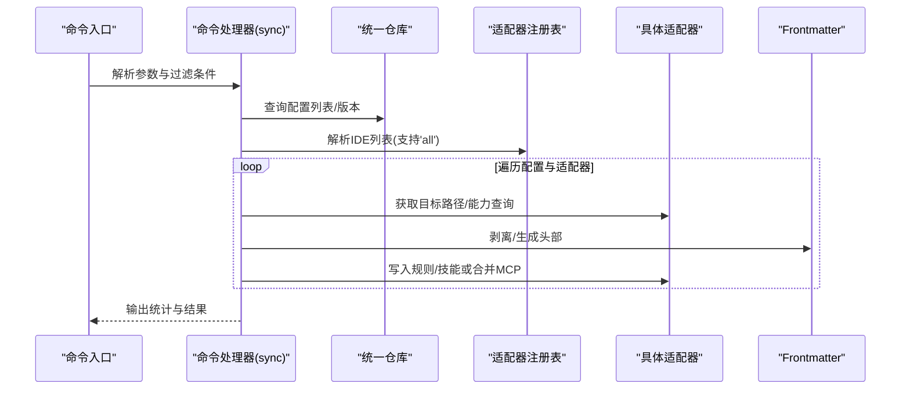
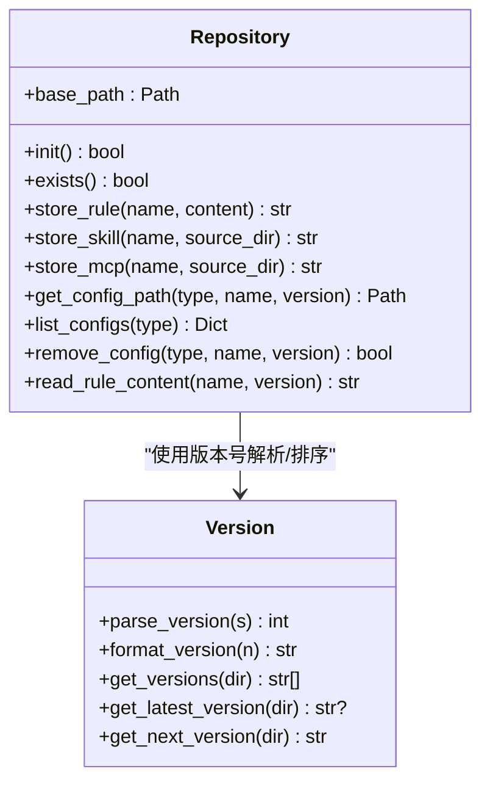
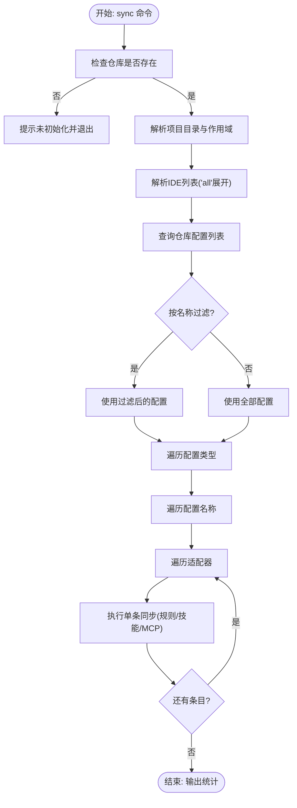
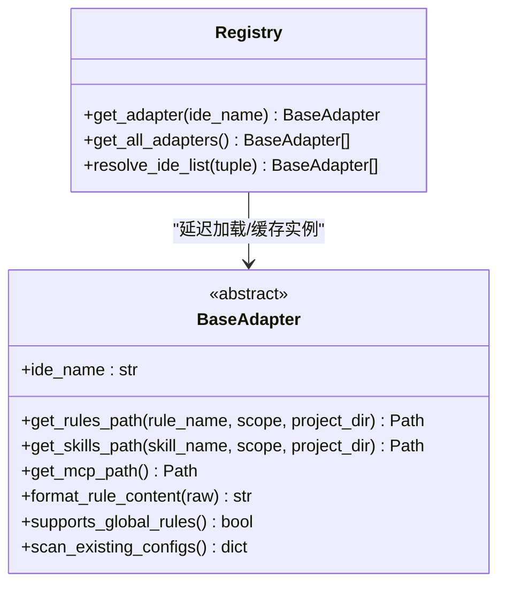
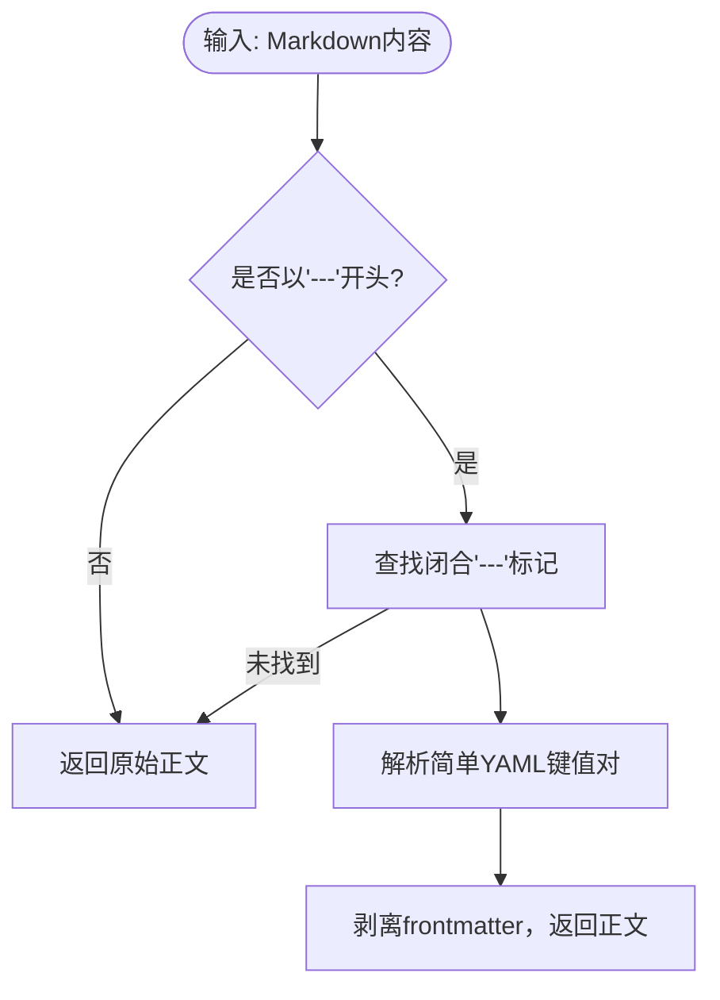
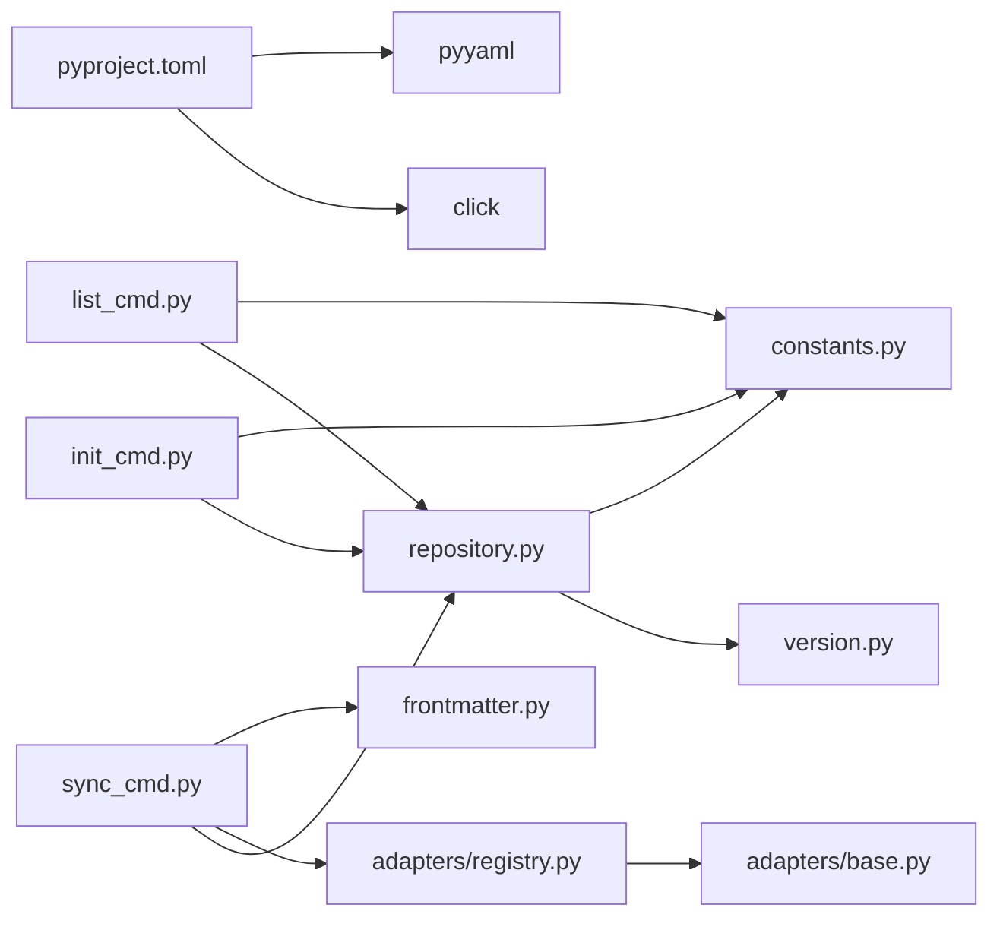

# 性能优化与最佳实践

<cite>
**本文引用的文件**
- [MSR-cli/msr_sync/core/config.py](file://MSR-cli/msr_sync/core/config.py)
- [MSR-cli/msr_sync/core/repository.py](file://MSR-cli/msr_sync/core/repository.py)
- [MSR-cli/msr_sync/core/version.py](file://MSR-cli/msr_sync/core/version.py)
- [MSR-cli/msr_sync/core/frontmatter.py](file://MSR-cli/msr_sync/core/frontmatter.py)
- [MSR-cli/msr_sync/commands/sync_cmd.py](file://MSR-cli/msr_sync/commands/sync_cmd.py)
- [MSR-cli/msr_sync/commands/init_cmd.py](file://MSR-cli/msr_sync/commands/init_cmd.py)
- [MSR-cli/msr_sync/commands/list_cmd.py](file://MSR-cli/msr_sync/commands/list_cmd.py)
- [MSR-cli/msr_sync/adapters/base.py](file://MSR-cli/msr_sync/adapters/base.py)
- [MSR-cli/msr_sync/adapters/registry.py](file://MSR-cli/msr_sync/adapters/registry.py)
- [MSR-cli/msr_sync/constants.py](file://MSR-cli/msr_sync/constants.py)
- [MSR-cli/pyproject.toml](file://MSR-cli/pyproject.toml)
</cite>

## 目录
1. [简介](#简介)
2. [项目结构](#项目结构)
3. [核心组件](#核心组件)
4. [架构总览](#架构总览)
5. [详细组件分析](#详细组件分析)
6. [依赖分析](#依赖分析)
7. [性能考虑](#性能考虑)
8. [故障排查指南](#故障排查指南)
9. [结论](#结论)
10. [附录](#附录)

## 简介
本文件聚焦于大规模配置管理场景下的性能优化与最佳实践，围绕统一仓库的读写、版本管理、适配器扩展、命令流程与数据处理进行系统性梳理，并给出可落地的优化策略与排障建议。内容涵盖：
- 缓存机制与增量同步
- 并行处理与批量操作
- 内存优化与大文件/流式处理
- 网络优化与离线模式
- 配置组织、命名规范与版本管理
- 性能监控与调试技巧
- 面向不同规模项目的优化建议

## 项目结构
该项目采用“命令驱动 + 适配器扩展 + 统一仓库”的分层设计：
- 命令层：init、list、sync 等命令处理器，负责参数解析与流程编排
- 核心服务层：配置加载、仓库管理、版本解析、frontmatter 处理
- 适配器层：面向不同 IDE 的适配器，负责路径解析、格式转换与能力声明
- 常量与工具：统一常量、版本号格式化、路径与类型定义

图表来源
- [MSR-cli/msr_sync/commands/init_cmd.py:1-137](file://MSR-cli/msr_sync/commands/init_cmd.py#L1-L137)
- [MSR-cli/msr_sync/commands/list_cmd.py:1-63](file://MSR-cli/msr_sync/commands/list_cmd.py#L1-L63)
- [MSR-cli/msr_sync/commands/sync_cmd.py:1-411](file://MSR-cli/msr_sync/commands/sync_cmd.py#L1-L411)
- [MSR-cli/msr_sync/core/repository.py:1-291](file://MSR-cli/msr_sync/core/repository.py#L1-L291)
- [MSR-cli/msr_sync/core/version.py:1-119](file://MSR-cli/msr_sync/core/version.py#L1-L119)
- [MSR-cli/msr_sync/core/frontmatter.py:1-164](file://MSR-cli/msr_sync/core/frontmatter.py#L1-L164)
- [MSR-cli/msr_sync/adapters/base.py:1-105](file://MSR-cli/msr_sync/adapters/base.py#L1-L105)
- [MSR-cli/msr_sync/adapters/registry.py:1-89](file://MSR-cli/msr_sync/adapters/registry.py#L1-L89)
- [MSR-cli/msr_sync/constants.py:1-50](file://MSR-cli/msr_sync/constants.py#L1-L50)
- [MSR-cli/pyproject.toml:1-37](file://MSR-cli/pyproject.toml#L1-L37)

章节来源
- [MSR-cli/msr_sync/commands/init_cmd.py:1-137](file://MSR-cli/msr_sync/commands/init_cmd.py#L1-L137)
- [MSR-cli/msr_sync/commands/list_cmd.py:1-63](file://MSR-cli/msr_sync/commands/list_cmd.py#L1-L63)
- [MSR-cli/msr_sync/commands/sync_cmd.py:1-411](file://MSR-cli/msr_sync/commands/sync_cmd.py#L1-L411)
- [MSR-cli/msr_sync/core/repository.py:1-291](file://MSR-cli/msr_sync/core/repository.py#L1-L291)
- [MSR-cli/msr_sync/core/version.py:1-119](file://MSR-cli/msr_sync/core/version.py#L1-L119)
- [MSR-cli/msr_sync/core/frontmatter.py:1-164](file://MSR-cli/msr_sync/core/frontmatter.py#L1-L164)
- [MSR-cli/msr_sync/adapters/base.py:1-105](file://MSR-cli/msr_sync/adapters/base.py#L1-L105)
- [MSR-cli/msr_sync/adapters/registry.py:1-89](file://MSR-cli/msr_sync/adapters/registry.py#L1-L89)
- [MSR-cli/msr_sync/constants.py:1-50](file://MSR-cli/msr_sync/constants.py#L1-L50)
- [MSR-cli/pyproject.toml:1-37](file://MSR-cli/pyproject.toml#L1-L37)

## 核心组件
- 全局配置模块：负责加载与校验用户配置，提供默认值与单例缓存，减少重复 IO
- 统一仓库模块：集中管理 rules、skills、MCP 的存储、查询与版本管理
- 版本管理模块：解析/格式化版本号，提供最新版本与下一个版本计算
- Frontmatter 模块：剥离与生成 Markdown frontmatter，支撑跨 IDE 内容格式化
- 命令处理器：init、list、sync 的业务流程编排，串联仓库与适配器
- 适配器注册表：延迟加载与实例缓存，降低模块导入与对象创建成本
- 常量定义：统一仓库目录、类型枚举、版本前缀、文件名等常量

章节来源
- [MSR-cli/msr_sync/core/config.py:1-204](file://MSR-cli/msr_sync/core/config.py#L1-L204)
- [MSR-cli/msr_sync/core/repository.py:1-291](file://MSR-cli/msr_sync/core/repository.py#L1-L291)
- [MSR-cli/msr_sync/core/version.py:1-119](file://MSR-cli/msr_sync/core/version.py#L1-L119)
- [MSR-cli/msr_sync/core/frontmatter.py:1-164](file://MSR-cli/msr_sync/core/frontmatter.py#L1-L164)
- [MSR-cli/msr_sync/commands/sync_cmd.py:1-411](file://MSR-cli/msr_sync/commands/sync_cmd.py#L1-L411)
- [MSR-cli/msr_sync/adapters/registry.py:1-89](file://MSR-cli/msr_sync/adapters/registry.py#L1-L89)
- [MSR-cli/msr_sync/constants.py:1-50](file://MSR-cli/msr_sync/constants.py#L1-L50)

## 架构总览
整体流程从命令入口进入，通过仓库与版本模块访问统一存储，借助适配器层将内容写入目标 IDE；frontmatter 模块负责内容格式化。

图表来源
- [MSR-cli/msr_sync/commands/sync_cmd.py:26-131](file://MSR-cli/msr_sync/commands/sync_cmd.py#L26-L131)
- [MSR-cli/msr_sync/adapters/registry.py:75-89](file://MSR-cli/msr_sync/adapters/registry.py#L75-L89)
- [MSR-cli/msr_sync/core/frontmatter.py:10-60](file://MSR-cli/msr_sync/core/frontmatter.py#L10-L60)
- [MSR-cli/msr_sync/core/repository.py:160-235](file://MSR-cli/msr_sync/core/repository.py#L160-L235)

## 详细组件分析

### 组件A：统一仓库与版本管理
- 功能要点
  - 初始化仓库目录结构，幂等创建
  - 支持 rules/skills/mcp 三类配置的存储、查询、删除
  - 版本管理：自动递增版本号、获取最新版本、列举版本
  - 读取规则内容、定位配置路径
- 性能相关
  - 目录遍历与版本排序：O(k log k)，k 为某配置的版本数量
  - 文件读写：按需读取，避免一次性加载全部内容
  - 路径解析与校验：减少 IO 与异常开销

图表来源
- [MSR-cli/msr_sync/core/repository.py:23-291](file://MSR-cli/msr_sync/core/repository.py#L23-L291)
- [MSR-cli/msr_sync/core/version.py:59-119](file://MSR-cli/msr_sync/core/version.py#L59-L119)

章节来源
- [MSR-cli/msr_sync/core/repository.py:1-291](file://MSR-cli/msr_sync/core/repository.py#L1-L291)
- [MSR-cli/msr_sync/core/version.py:1-119](file://MSR-cli/msr_sync/core/version.py#L1-L119)

### 组件B：命令流程与并行化潜力
- sync 命令
  - 支持按 IDE、scope、type、name、version 精确控制
  - 逐条同步并输出统计，具备并发改造空间
- list 命令
  - 树形展示仓库配置，适合在 GUI 层二次渲染
- init 命令
  - 合并现有 IDE 配置到统一仓库，涉及多次 IO 与 JSON 解析

图表来源
- [MSR-cli/msr_sync/commands/sync_cmd.py:26-131](file://MSR-cli/msr_sync/commands/sync_cmd.py#L26-L131)

章节来源
- [MSR-cli/msr_sync/commands/sync_cmd.py:1-411](file://MSR-cli/msr_sync/commands/sync_cmd.py#L1-L411)
- [MSR-cli/msr_sync/commands/list_cmd.py:1-63](file://MSR-cli/msr_sync/commands/list_cmd.py#L1-L63)
- [MSR-cli/msr_sync/commands/init_cmd.py:1-137](file://MSR-cli/msr_sync/commands/init_cmd.py#L1-L137)

### 组件C：适配器抽象与实例缓存
- 抽象基类定义了路径解析、格式转换、能力查询与扫描接口
- 注册表支持延迟加载与实例缓存，避免重复导入与对象创建
- 适配器能力差异（如全局规则支持）影响同步策略

图表来源
- [MSR-cli/msr_sync/adapters/base.py:8-105](file://MSR-cli/msr_sync/adapters/base.py#L8-L105)
- [MSR-cli/msr_sync/adapters/registry.py:46-89](file://MSR-cli/msr_sync/adapters/registry.py#L46-L89)

章节来源
- [MSR-cli/msr_sync/adapters/base.py:1-105](file://MSR-cli/msr_sync/adapters/base.py#L1-L105)
- [MSR-cli/msr_sync/adapters/registry.py:1-89](file://MSR-cli/msr_sync/adapters/registry.py#L1-L89)

### 组件D：Frontmatter 解析与格式化
- 支持剥离与解析 Markdown frontmatter，生成 IDE 特定头部
- 仅解析简单键值对，避免复杂 YAML 解析带来的额外开销

图表来源
- [MSR-cli/msr_sync/core/frontmatter.py:26-60](file://MSR-cli/msr_sync/core/frontmatter.py#L26-L60)

章节来源
- [MSR-cli/msr_sync/core/frontmatter.py:1-164](file://MSR-cli/msr_sync/core/frontmatter.py#L1-L164)

## 依赖分析
- 外部依赖
  - click：命令行交互与确认提示
  - pyyaml：配置文件解析
- 内部模块耦合
  - 命令层依赖仓库与适配器注册表
  - 仓库依赖版本模块与常量
  - 适配器注册表依赖具体适配器模块（延迟加载）

图表来源
- [MSR-cli/pyproject.toml:18-21](file://MSR-cli/pyproject.toml#L18-L21)
- [MSR-cli/msr_sync/commands/sync_cmd.py:14-23](file://MSR-cli/msr_sync/commands/sync_cmd.py#L14-L23)
- [MSR-cli/msr_sync/commands/init_cmd.py:9-10](file://MSR-cli/msr_sync/commands/init_cmd.py#L9-L10)
- [MSR-cli/msr_sync/commands/list_cmd.py:8-9](file://MSR-cli/msr_sync/commands/list_cmd.py#L8-L9)
- [MSR-cli/msr_sync/core/repository.py:7-9](file://MSR-cli/msr_sync/core/repository.py#L7-L9)
- [MSR-cli/msr_sync/adapters/registry.py:3-5](file://MSR-cli/msr_sync/adapters/registry.py#L3-L5)

章节来源
- [MSR-cli/pyproject.toml:1-37](file://MSR-cli/pyproject.toml#L1-L37)
- [MSR-cli/msr_sync/commands/sync_cmd.py:1-411](file://MSR-cli/msr_sync/commands/sync_cmd.py#L1-L411)
- [MSR-cli/msr_sync/commands/init_cmd.py:1-137](file://MSR-cli/msr_sync/commands/init_cmd.py#L1-L137)
- [MSR-cli/msr_sync/commands/list_cmd.py:1-63](file://MSR-cli/msr_sync/commands/list_cmd.py#L1-L63)
- [MSR-cli/msr_sync/core/repository.py:1-291](file://MSR-cli/msr_sync/core/repository.py#L1-L291)
- [MSR-cli/msr_sync/adapters/registry.py:1-89](file://MSR-cli/msr_sync/adapters/registry.py#L1-L89)

## 性能考虑

### 缓存机制
- 配置单例缓存：全局配置模块提供单例缓存，避免重复读取与解析配置文件
- 适配器实例缓存：注册表缓存适配器实例，减少延迟加载与重复构造
- 建议
  - 在长时间运行的进程或批量任务中复用同一配置与适配器实例
  - 对频繁查询的仓库列表与版本列表进行应用层缓存（如内存字典）

章节来源
- [MSR-cli/msr_sync/core/config.py:140-158](file://MSR-cli/msr_sync/core/config.py#L140-L158)
- [MSR-cli/msr_sync/adapters/registry.py:18-63](file://MSR-cli/msr_sync/adapters/registry.py#L18-L63)

### 增量同步与批量处理
- 现状
  - sync 命令按配置类型/名称/版本逐条执行，具备并发改造空间
  - list 命令一次性列举并输出，适合 GUI 渲染
- 优化建议
  - 并行策略
    - 按配置类型或名称分片，使用线程池/进程池并发执行
    - 控制并发度，避免磁盘与网络拥塞
  - 增量策略
    - 仅对变更的配置或版本执行同步
    - 引入哈希指纹（如内容 SHA）记录上次同步状态
  - 批量写入
    - 合并 MCP 配置时一次性写入，减少多次 IO

章节来源
- [MSR-cli/msr_sync/commands/sync_cmd.py:84-131](file://MSR-cli/msr_sync/commands/sync_cmd.py#L84-L131)
- [MSR-cli/msr_sync/commands/list_cmd.py:24-63](file://MSR-cli/msr_sync/commands/list_cmd.py#L24-L63)
- [MSR-cli/msr_sync/commands/sync_cmd.py:290-349](file://MSR-cli/msr_sync/commands/sync_cmd.py#L290-L349)

### 内存优化与大文件/流式处理
- 现状
  - 规则内容读取与写入均为一次性文本处理
  - MCP JSON 解析与合并为内存中字典操作
- 优化建议
  - 流式读取
    - 对超大规则文件采用分块读取与按需处理
  - 内存占用控制
    - 合并 MCP 时分批处理服务器条目，及时释放中间字典
  - 临时目录与清理
    - init 合并时使用临时目录隔离，完成后清理

章节来源
- [MSR-cli/msr_sync/core/repository.py:266-291](file://MSR-cli/msr_sync/core/repository.py#L266-L291)
- [MSR-cli/msr_sync/commands/init_cmd.py:108-124](file://MSR-cli/msr_sync/commands/init_cmd.py#L108-L124)
- [MSR-cli/msr_sync/commands/sync_cmd.py:267-287](file://MSR-cli/msr_sync/commands/sync_cmd.py#L267-L287)

### 网络优化与离线模式
- 现状
  - 仓库与适配器均为本地文件操作，无网络依赖
- 优化建议
  - 离线优先：优先使用本地仓库，失败再降级到网络拉取（如后续扩展）
  - 本地缓存：将常用配置与版本缓存至本地，减少重复构建
  - 代理与镜像：如引入网络源，支持代理与镜像配置

章节来源
- [MSR-cli/msr_sync/core/repository.py:1-291](file://MSR-cli/msr_sync/core/repository.py#L1-L291)
- [MSR-cli/msr_sync/adapters/registry.py:22-44](file://MSR-cli/msr_sync/adapters/registry.py#L22-L44)

### 配置组织、命名规范与版本管理
- 组织结构
  - 仓库根目录下按类型划分 RULES、SKILLS、MCP 三大目录
  - 每个配置条目下按版本号 V1/V2/V3… 存放
- 命名规范
  - 版本号前缀统一为大写 V，数字严格递增
  - 配置名称建议使用清晰语义，避免特殊字符
- 版本管理
  - 自动递增下一个版本号，保证历史可追溯
  - 列表与查询时按版本号排序，便于选择最新或指定版本

章节来源
- [MSR-cli/msr_sync/constants.py:10-46](file://MSR-cli/msr_sync/constants.py#L10-L46)
- [MSR-cli/msr_sync/core/version.py:103-119](file://MSR-cli/msr_sync/core/version.py#L103-L119)
- [MSR-cli/msr_sync/core/repository.py:13-20](file://MSR-cli/msr_sync/core/repository.py#L13-L20)

### 性能监控与调试技巧
- 监控指标
  - 同步耗时：按类型/名称/适配器维度统计
  - IO 次数：读取/写入/遍历次数
  - 内存峰值：大文件/大批量合并时的内存占用
- 调试方法
  - 使用 --dry-run 或细粒度日志输出定位瓶颈
  - 对慢查询与慢写入进行采样分析
  - 在 CI 中加入基准测试，对比不同优化策略效果

章节来源
- [MSR-cli/msr_sync/commands/sync_cmd.py:127-131](file://MSR-cli/msr_sync/commands/sync_cmd.py#L127-L131)

### 面向不同规模项目的优化建议
- 小型项目
  - 单线程顺序执行即可满足需求
  - 重点在于规范命名与版本管理，减少后期维护成本
- 中型项目
  - 引入轻量并发（每类型或每名称一组线程）
  - 对 MCP 合并进行分批处理，避免内存峰值
- 大型项目
  - 引入增量同步与指纹校验
  - 使用流式处理与分片并行，结合限速与背压控制
  - 建立本地缓存与代理，提升网络不可用时的可用性

## 故障排查指南
- 仓库未初始化
  - 现象：命令报错提示未初始化
  - 处理：先执行初始化命令，再重试
- 配置或版本不存在
  - 现象：查询时报找不到配置或版本
  - 处理：使用 list 命令查看可用配置与版本，确认名称与版本号
- YAML/JSON 格式错误
  - 现象：配置文件解析失败
  - 处理：检查配置文件语法，必要时重新生成默认配置
- 适配器能力限制
  - 现象：全局规则在某些 IDE 上被跳过
  - 处理：确认适配器能力，必要时改为项目级同步

章节来源
- [MSR-cli/msr_sync/commands/sync_cmd.py:52-54](file://MSR-cli/msr_sync/commands/sync_cmd.py#L52-L54)
- [MSR-cli/msr_sync/core/repository.py:180-197](file://MSR-cli/msr_sync/core/repository.py#L180-L197)
- [MSR-cli/msr_sync/commands/sync_cmd.py:267-271](file://MSR-cli/msr_sync/commands/sync_cmd.py#L267-L271)
- [MSR-cli/msr_sync/adapters/base.py:80-89](file://MSR-cli/msr_sync/adapters/base.py#L80-L89)

## 结论
本项目在统一仓库与适配器扩展方面具备良好的可扩展性与可维护性。面向大规模配置管理，建议从“缓存与实例复用、增量与并行、流式与内存控制、离线与本地缓存”等方面入手，结合监控与基准测试持续迭代优化。同时，规范化的组织与版本管理是保障长期稳定性的关键。

## 附录
- 常用命令
  - 初始化：创建统一仓库与默认配置
  - 列表：查看仓库配置与版本
  - 同步：将配置同步到目标 IDE，支持按 IDE、作用域、类型、名称、版本过滤

章节来源
- [MSR-cli/msr_sync/commands/init_cmd.py:13-42](file://MSR-cli/msr_sync/commands/init_cmd.py#L13-L42)
- [MSR-cli/msr_sync/commands/list_cmd.py:12-63](file://MSR-cli/msr_sync/commands/list_cmd.py#L12-L63)
- [MSR-cli/msr_sync/commands/sync_cmd.py:26-131](file://MSR-cli/msr_sync/commands/sync_cmd.py#L26-L131)