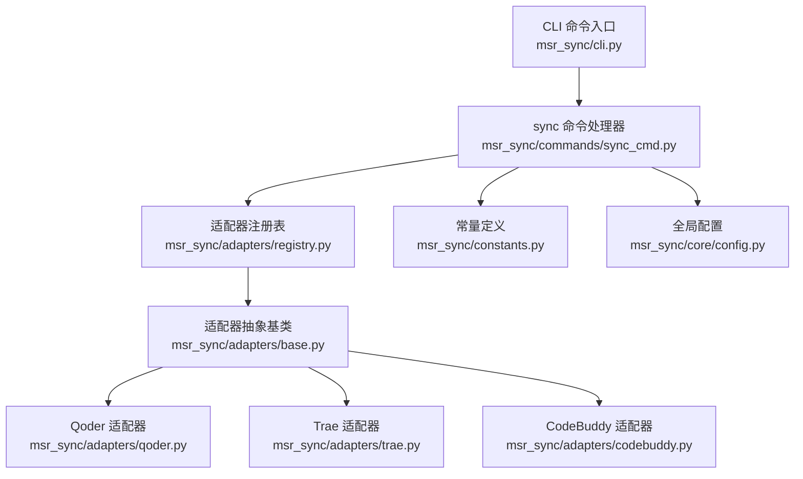
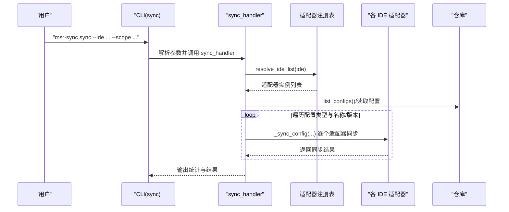
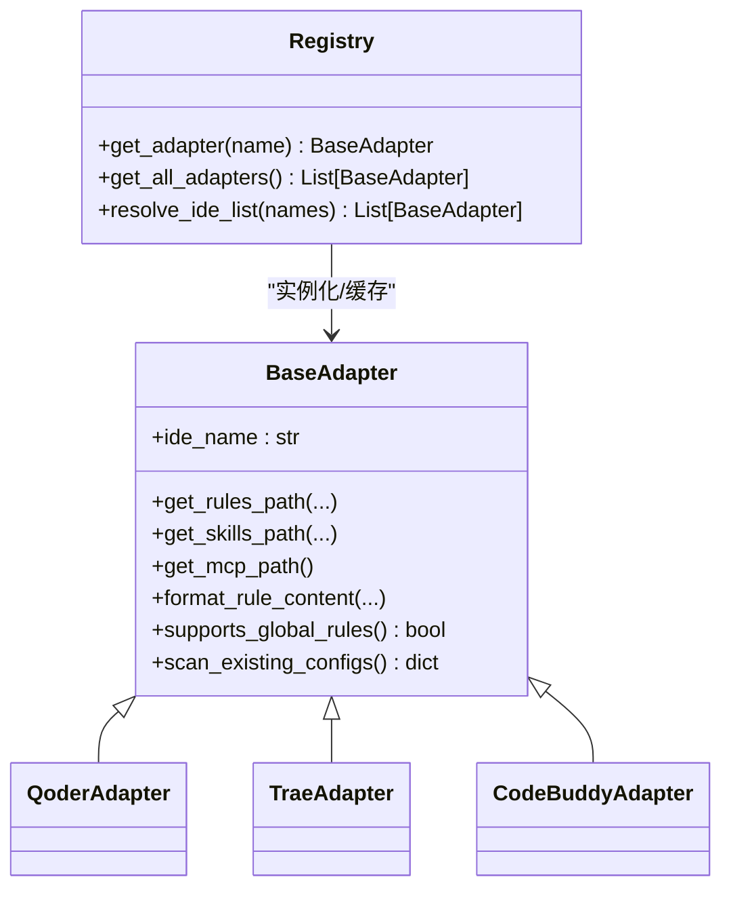
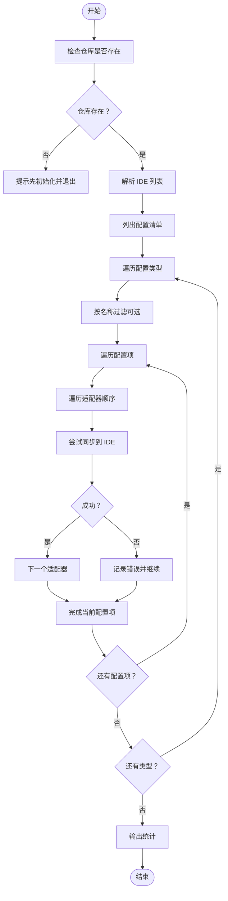
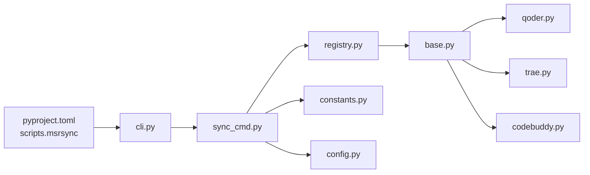

# 批量同步配置

<cite>
**本文引用的文件**
- [MSR-cli/msr_sync/commands/sync_cmd.py](file://MSR-cli/msr_sync/commands/sync_cmd.py)
- [MSR-cli/msr_sync/adapters/registry.py](file://MSR-cli/msr_sync/adapters/registry.py)
- [MSR-cli/msr_sync/adapters/base.py](file://MSR-cli/msr_sync/adapters/base.py)
- [MSR-cli/msr_sync/adapters/qoder.py](file://MSR-cli/msr_sync/adapters/qoder.py)
- [MSR-cli/msr_sync/adapters/trae.py](file://MSR-cli/msr_sync/adapters/trae.py)
- [MSR-cli/msr_sync/adapters/codebuddy.py](file://MSR-cli/msr_sync/adapters/codebuddy.py)
- [MSR-cli/msr_sync/cli.py](file://MSR-cli/msr_sync/cli.py)
- [MSR-cli/msr_sync/core/config.py](file://MSR-cli/msr_sync/core/config.py)
- [MSR-cli/msr_sync/constants.py](file://MSR-cli/msr_sync/constants.py)
- [MSR-cli/pyproject.toml](file://MSR-cli/pyproject.toml)
- [MSR-cli/tests/test_cli_integration.py](file://MSR-cli/tests/test_cli_integration.py)
</cite>

## 目录
1. [简介](#简介)
2. [项目结构](#项目结构)
3. [核心组件](#核心组件)
4. [架构总览](#架构总览)
5. [详细组件分析](#详细组件分析)
6. [依赖分析](#依赖分析)
7. [性能考虑](#性能考虑)
8. [故障排除指南](#故障排除指南)
9. [结论](#结论)
10. [附录](#附录)

## 简介
本文件面向需要同时向多个 AI IDE（如 Trae、Qoder、Lingma、CodeBuddy）批量同步配置的用户与维护者，系统性说明以下内容：
- 如何通过 sync 命令的 --ide 参数选择目标 IDE，并支持 ('all',) 与 ('trae', 'qoder') 等组合
- IDE 列表解析、适配器实例化与并发处理策略
- 错误处理与回退机制
- 性能优化建议（并行与资源管理）
- 最佳实践（同步顺序、依赖关系处理与回滚思路）
- 实际使用案例与常见问题排查

## 项目结构
MSR-sync 采用“命令层-适配器层-核心层”的分层设计：
- 命令层：CLI 定义与命令入口，负责参数解析与流程编排
- 适配器层：针对不同 IDE 的路径解析、格式转换与能力声明
- 核心层：仓库访问、版本解析、异常体系与全局配置

图表来源
- [MSR-cli/msr_sync/cli.py:41-82](file://MSR-cli/msr_sync/cli.py#L41-L82)
- [MSR-cli/msr_sync/commands/sync_cmd.py:26-131](file://MSR-cli/msr_sync/commands/sync_cmd.py#L26-L131)
- [MSR-cli/msr_sync/adapters/registry.py:74-87](file://MSR-cli/msr_sync/adapters/registry.py#L74-L87)
- [MSR-cli/msr_sync/adapters/base.py:8-105](file://MSR-cli/msr_sync/adapters/base.py#L8-L105)
- [MSR-cli/msr_sync/adapters/qoder.py:22-140](file://MSR-cli/msr_sync/adapters/qoder.py#L22-L140)
- [MSR-cli/msr_sync/adapters/trae.py:21-138](file://MSR-cli/msr_sync/adapters/trae.py#L21-L138)
- [MSR-cli/msr_sync/adapters/codebuddy.py:22-143](file://MSR-cli/msr_sync/adapters/codebuddy.py#L22-L143)
- [MSR-cli/msr_sync/constants.py:16-43](file://MSR-cli/msr_sync/constants.py#L16-L43)
- [MSR-cli/msr_sync/core/config.py:18-80](file://MSR-cli/msr_sync/core/config.py#L18-L80)

章节来源
- [MSR-cli/msr_sync/cli.py:41-82](file://MSR-cli/msr_sync/cli.py#L41-L82)
- [MSR-cli/msr_sync/commands/sync_cmd.py:26-131](file://MSR-cli/msr_sync/commands/sync_cmd.py#L26-L131)
- [MSR-cli/msr_sync/adapters/registry.py:74-87](file://MSR-cli/msr_sync/adapters/registry.py#L74-L87)
- [MSR-cli/msr_sync/adapters/base.py:8-105](file://MSR-cli/msr_sync/adapters/base.py#L8-L105)
- [MSR-cli/msr_sync/adapters/qoder.py:22-140](file://MSR-cli/msr_sync/adapters/qoder.py#L22-L140)
- [MSR-cli/msr_sync/adapters/trae.py:21-138](file://MSR-cli/msr_sync/adapters/trae.py#L21-L138)
- [MSR-cli/msr_sync/adapters/codebuddy.py:22-143](file://MSR-cli/msr_sync/adapters/codebuddy.py#L22-L143)
- [MSR-cli/msr_sync/constants.py:16-43](file://MSR-cli/msr_sync/constants.py#L16-L43)
- [MSR-cli/msr_sync/core/config.py:18-80](file://MSR-cli/msr_sync/core/config.py#L18-L80)

## 核心组件
- sync 命令处理器：负责解析参数、解析 IDE 列表、遍历配置类型与版本、逐个适配器同步，并汇总统计
- 适配器注册表：将 IDE 名称映射为适配器类，支持缓存与延迟加载；提供 resolve_ide_list 将 ('all',)/('trae','qoder') 等转换为适配器实例列表
- 适配器抽象基类：定义统一接口（路径解析、格式转换、能力查询、扫描已有配置）
- 具体 IDE 适配器：Qoder、Trae、CodeBuddy 分别实现各自路径约定、规则格式与能力差异
- CLI：定义 sync 子命令及其参数，支持 --ide、--scope、--project-dir、--type、--name、--version
- 全局配置：提供默认 IDE 列表与默认作用域，支持从配置文件读取并在命令行未指定时生效
- 常量：统一仓库目录名、配置类型枚举、MCP 文件名等

章节来源
- [MSR-cli/msr_sync/commands/sync_cmd.py:26-131](file://MSR-cli/msr_sync/commands/sync_cmd.py#L26-L131)
- [MSR-cli/msr_sync/adapters/registry.py:74-87](file://MSR-cli/msr_sync/adapters/registry.py#L74-L87)
- [MSR-cli/msr_sync/adapters/base.py:8-105](file://MSR-cli/msr_sync/adapters/base.py#L8-L105)
- [MSR-cli/msr_sync/adapters/qoder.py:22-140](file://MSR-cli/msr_sync/adapters/qoder.py#L22-L140)
- [MSR-cli/msr_sync/adapters/trae.py:21-138](file://MSR-cli/msr_sync/adapters/trae.py#L21-L138)
- [MSR-cli/msr_sync/adapters/codebuddy.py:22-143](file://MSR-cli/msr_sync/adapters/codebuddy.py#L22-L143)
- [MSR-cli/msr_sync/cli.py:41-82](file://MSR-cli/msr_sync/cli.py#L41-L82)
- [MSR-cli/msr_sync/core/config.py:18-80](file://MSR-cli/msr_sync/core/config.py#L18-L80)
- [MSR-cli/msr_sync/constants.py:16-43](file://MSR-cli/msr_sync/constants.py#L16-L43)

## 架构总览
sync 命令的执行流程如下：

图表来源
- [MSR-cli/msr_sync/cli.py:58-82](file://MSR-cli/msr_sync/cli.py#L58-L82)
- [MSR-cli/msr_sync/commands/sync_cmd.py:26-131](file://MSR-cli/msr_sync/commands/sync_cmd.py#L26-L131)
- [MSR-cli/msr_sync/adapters/registry.py:74-87](file://MSR-cli/msr_sync/adapters/registry.py#L74-L87)

## 详细组件分析

### sync 命令与参数解析
- --ide 支持多值输入，可传入 ('all',) 或 ('trae', 'qoder') 等组合
- --scope 支持 'project'/'global'，配合 --project-dir 指定项目目录
- --type/--name/--version 用于精确控制同步范围
- 若命令行未指定 --ide 或 --scope，则从全局配置读取默认值

章节来源
- [MSR-cli/msr_sync/cli.py:41-82](file://MSR-cli/msr_sync/cli.py#L41-L82)
- [MSR-cli/msr_sync/core/config.py:18-80](file://MSR-cli/msr_sync/core/config.py#L18-L80)

### IDE 列表解析与适配器实例化
- 注册表维护 IDE 名称到模块类的映射，支持延迟加载与实例缓存
- resolve_ide_list 将 ('all',) 展开为所有已注册适配器，或将 ('trae','qoder') 映射为对应实例
- 适配器实例缓存避免重复创建，提升性能

图表来源
- [MSR-cli/msr_sync/adapters/base.py:8-105](file://MSR-cli/msr_sync/adapters/base.py#L8-L105)
- [MSR-cli/msr_sync/adapters/qoder.py:22-140](file://MSR-cli/msr_sync/adapters/qoder.py#L22-L140)
- [MSR-cli/msr_sync/adapters/trae.py:21-138](file://MSR-cli/msr_sync/adapters/trae.py#L21-L138)
- [MSR-cli/msr_sync/adapters/codebuddy.py:22-143](file://MSR-cli/msr_sync/adapters/codebuddy.py#L22-L143)
- [MSR-cli/msr_sync/adapters/registry.py:74-87](file://MSR-cli/msr_sync/adapters/registry.py#L74-L87)

章节来源
- [MSR-cli/msr_sync/adapters/registry.py:74-87](file://MSR-cli/msr_sync/adapters/registry.py#L74-L87)
- [MSR-cli/msr_sync/adapters/base.py:8-105](file://MSR-cli/msr_sync/adapters/base.py#L8-L105)

### 并发处理策略
- 当前实现为顺序遍历：对每个配置项，依次对每个适配器执行同步
- 优点：实现简单、状态一致、易于调试
- 缺点：当 IDE 数量较多时，整体耗时较长
- 建议的优化方向（概念性说明）：
  - 将“对每个配置项”的外层循环改为并发任务队列，内层对适配器的同步保持串行（避免同一配置对多个 IDE 的竞争）
  - 使用线程池/进程池限制并发度，结合信号量控制资源占用
  - 异常隔离：任一适配器失败不影响其他适配器的执行
  - 进度反馈：在并发场景下提供更细粒度的进度提示

[本节为通用性能讨论，不直接分析具体文件，故不附加章节来源]

### 错误处理与回退机制
- 仓库未初始化：检测并提示先执行初始化
- 配置不存在：对特定配置名称过滤后可能跳过
- MCP 合并冲突：遇到同名条目时交互式确认覆盖
- 适配器异常：捕获并输出错误信息，继续处理下一个适配器
- 全局规则不支持：对不支持全局 rules 的 IDE 输出警告并跳过

图表来源
- [MSR-cli/msr_sync/commands/sync_cmd.py:26-131](file://MSR-cli/msr_sync/commands/sync_cmd.py#L26-L131)

章节来源
- [MSR-cli/msr_sync/commands/sync_cmd.py:26-131](file://MSR-cli/msr_sync/commands/sync_cmd.py#L26-L131)

### 配置类型与同步逻辑
- Rules：剥离原始 frontmatter，按 IDE 添加特定头部，写入目标路径
- Skills：复制技能目录，若目标已存在则交互式确认覆盖
- MCP：读取源 mcp.json，重写 cwd 为仓库路径，合并到目标 mcp.json，同名条目交互式确认

章节来源
- [MSR-cli/msr_sync/commands/sync_cmd.py:133-411](file://MSR-cli/msr_sync/commands/sync_cmd.py#L133-L411)

### IDE 能力与路径差异
- CodeBuddy：支持全局 rules，路径与 MCP 跨平台统一
- Qoder/Trae：不支持全局 rules，项目级路径不同；MCP 路径位于应用支持目录
- Lingma：注册表中存在占位，具体实现以仓库为准

章节来源
- [MSR-cli/msr_sync/adapters/qoder.py:22-140](file://MSR-cli/msr_sync/adapters/qoder.py#L22-L140)
- [MSR-cli/msr_sync/adapters/trae.py:21-138](file://MSR-cli/msr_sync/adapters/trae.py#L21-L138)
- [MSR-cli/msr_sync/adapters/codebuddy.py:22-143](file://MSR-cli/msr_sync/adapters/codebuddy.py#L22-L143)
- [MSR-cli/msr_sync/adapters/registry.py:10-15](file://MSR-cli/msr_sync/adapters/registry.py#L10-L15)

## 依赖分析
- CLI 依赖命令处理器与全局配置
- 命令处理器依赖适配器注册表、常量与仓库访问
- 适配器层依赖平台信息与前端头构建工具
- 项目脚本通过 setuptools 暴露命令入口

图表来源
- [MSR-cli/pyproject.toml:29-30](file://MSR-cli/pyproject.toml#L29-L30)
- [MSR-cli/msr_sync/cli.py:41-82](file://MSR-cli/msr_sync/cli.py#L41-L82)
- [MSR-cli/msr_sync/commands/sync_cmd.py:26-131](file://MSR-cli/msr_sync/commands/sync_cmd.py#L26-L131)
- [MSR-cli/msr_sync/adapters/registry.py:74-87](file://MSR-cli/msr_sync/adapters/registry.py#L74-L87)
- [MSR-cli/msr_sync/constants.py:16-43](file://MSR-cli/msr_sync/constants.py#L16-L43)
- [MSR-cli/msr_sync/core/config.py:18-80](file://MSR-cli/msr_sync/core/config.py#L18-L80)
- [MSR-cli/msr_sync/adapters/base.py:8-105](file://MSR-cli/msr_sync/adapters/base.py#L8-L105)
- [MSR-cli/msr_sync/adapters/qoder.py:22-140](file://MSR-cli/msr_sync/adapters/qoder.py#L22-L140)
- [MSR-cli/msr_sync/adapters/trae.py:21-138](file://MSR-cli/msr_sync/adapters/trae.py#L21-L138)
- [MSR-cli/msr_sync/adapters/codebuddy.py:22-143](file://MSR-cli/msr_sync/adapters/codebuddy.py#L22-L143)

章节来源
- [MSR-cli/pyproject.toml:29-30](file://MSR-cli/pyproject.toml#L29-L30)
- [MSR-cli/msr_sync/cli.py:41-82](file://MSR-cli/msr_sync/cli.py#L41-L82)
- [MSR-cli/msr_sync/commands/sync_cmd.py:26-131](file://MSR-cli/msr_sync/commands/sync_cmd.py#L26-L131)
- [MSR-cli/msr_sync/adapters/registry.py:74-87](file://MSR-cli/msr_sync/adapters/registry.py#L74-L87)
- [MSR-cli/msr_sync/constants.py:16-43](file://MSR-cli/msr_sync/constants.py#L16-L43)
- [MSR-cli/msr_sync/core/config.py:18-80](file://MSR-cli/msr_sync/core/config.py#L18-L80)
- [MSR-cli/msr_sync/adapters/base.py:8-105](file://MSR-cli/msr_sync/adapters/base.py#L8-L105)
- [MSR-cli/msr_sync/adapters/qoder.py:22-140](file://MSR-cli/msr_sync/adapters/qoder.py#L22-L140)
- [MSR-cli/msr_sync/adapters/trae.py:21-138](file://MSR-cli/msr_sync/adapters/trae.py#L21-L138)
- [MSR-cli/msr_sync/adapters/codebuddy.py:22-143](file://MSR-cli/msr_sync/adapters/codebuddy.py#L22-L143)

## 性能考虑
- 当前为顺序同步：对每个配置项，依次对每个适配器执行，适合小规模批量与一致性要求高的场景
- 并行优化建议（概念性说明）：
  - 外层并发：将“配置项”维度改为并发任务，内层对适配器串行
  - 限流：设置最大并发数，避免磁盘/网络争用
  - I/O 优化：合并同类项（如多个 IDE 的规则写入）减少系统调用
  - 资源管理：在并发场景下确保文件锁与临时目录清理
- 交互确认（覆盖 MCP/覆盖技能）会阻塞执行，建议在自动化场景中通过非交互方式或预设策略规避

[本节为通用性能讨论，不直接分析具体文件，故不附加章节来源]

## 故障排除指南
- 仓库未初始化
  - 现象：提示先执行初始化
  - 处理：运行初始化命令后再执行 sync
- 不支持全局 rules 的 IDE
  - 现象：对 Qoder/Trae 等 IDE 同步全局 rules 时输出警告并跳过
  - 处理：改用 --scope project 或仅在支持全局 rules 的 IDE（如 CodeBuddy）上同步
- MCP 同步冲突
  - 现象：目标存在同名 MCP 条目，交互式确认覆盖
  - 处理：根据提示选择覆盖或跳过；如需自动化，建议预先清理或统一命名
- 适配器异常
  - 现象：某 IDE 同步失败但不影响其他 IDE
  - 处理：查看具体错误信息，修复后单独对该 IDE 重试
- 配置不存在
  - 现象：按名称过滤后无匹配配置
  - 处理：检查配置名称或去掉 --name 过滤

章节来源
- [MSR-cli/msr_sync/commands/sync_cmd.py:26-131](file://MSR-cli/msr_sync/commands/sync_cmd.py#L26-L131)
- [MSR-cli/tests/test_cli_integration.py:184-198](file://MSR-cli/tests/test_cli_integration.py#L184-L198)

## 结论
- 当前实现以“顺序可靠”为主，适合中小规模批量同步
- 通过适配器注册表与抽象基类，系统具备良好的扩展性
- 建议在大规模批量场景引入并发优化，并完善非交互式覆盖策略与回滚方案

[本节为总结性内容，不直接分析具体文件，故不附加章节来源]

## 附录

### 使用案例
- 同步到所有 IDE：使用 --ide all
- 同步到部分 IDE：使用 --ide trae --ide qoder
- 指定作用域：--scope project 或 --scope global
- 指定配置类型/名称/版本：--type/--name/--version
- 未指定参数时的行为：从全局配置读取默认值

章节来源
- [MSR-cli/msr_sync/cli.py:41-82](file://MSR-cli/msr_sync/cli.py#L41-L82)
- [MSR-cli/msr_sync/core/config.py:18-80](file://MSR-cli/msr_sync/core/config.py#L18-L80)
- [MSR-cli/tests/test_cli_integration.py:155-182](file://MSR-cli/tests/test_cli_integration.py#L155-L182)
- [MSR-cli/tests/test_cli_integration.py:219-246](file://MSR-cli/tests/test_cli_integration.py#L219-L246)
- [MSR-cli/tests/test_cli_integration.py:248-274](file://MSR-cli/tests/test_cli_integration.py#L248-L274)