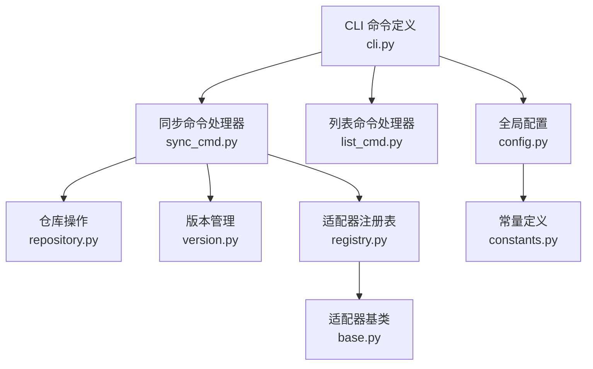
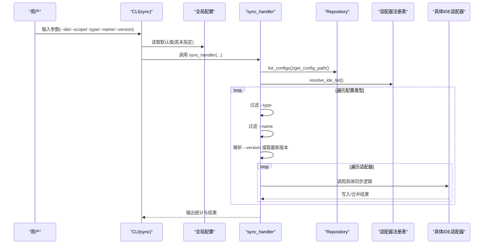
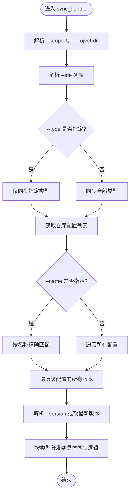
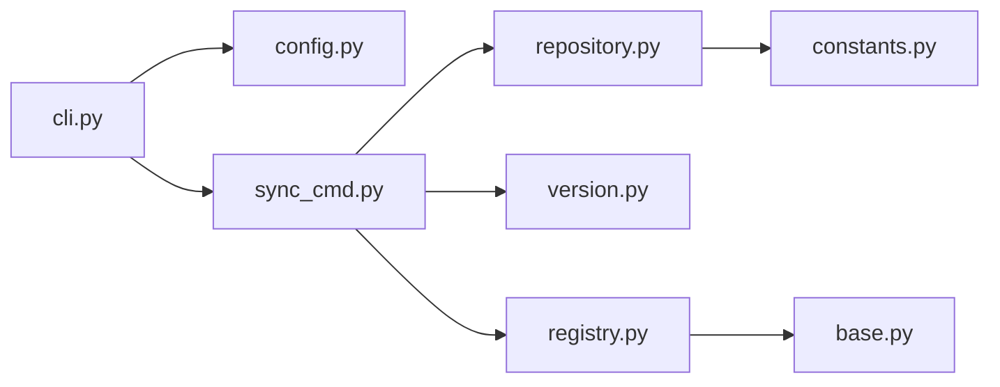

# 条件同步设置

<cite>
**本文引用的文件**
- [cli.py](file://MSR-cli/msr_sync/cli.py)
- [sync_cmd.py](file://MSR-cli/msr_sync/commands/sync_cmd.py)
- [config.py](file://MSR-cli/msr_sync/core/config.py)
- [constants.py](file://MSR-cli/msr_sync/constants.py)
- [repository.py](file://MSR-cli/msr_sync/core/repository.py)
- [version.py](file://MSR-cli/msr_sync/core/version.py)
- [base.py](file://MSR-cli/msr_sync/adapters/base.py)
- [registry.py](file://MSR-cli/msr_sync/adapters/registry.py)
- [README.md](file://MSR-cli/README.md)
- [usage.md](file://MSR-cli/docs/usage.md)
</cite>

## 目录
1. [简介](#简介)
2. [项目结构](#项目结构)
3. [核心组件](#核心组件)
4. [架构总览](#架构总览)
5. [详细组件分析](#详细组件分析)
6. [依赖关系分析](#依赖关系分析)
7. [性能考量](#性能考量)
8. [故障排查指南](#故障排查指南)
9. [结论](#结论)
10. [附录](#附录)

## 简介
本文件聚焦“条件同步设置”，系统性阐述基于参数的精确控制机制，涵盖以下关键参数的组合使用与最佳实践：
- --scope：控制同步层级（global 与 project）
- --type（或 --config-type）：过滤配置类型（rules、skills、mcp）
- --name：精确匹配配置名称
- --version：版本控制与选择

同时，文档解释 scope 在 global 与 project 之间的区别与适用场景，说明 config-type 对 rules、skills、mcp 的过滤机制，以及 name 与 version 的精确匹配与版本选择策略。最后给出按需同步、版本选择与范围控制的实际应用场景与配置示例。

## 项目结构
MSR-cli 采用清晰的分层架构：
- CLI 层：定义命令与参数，负责参数解析与错误处理
- 命令处理器层：实现具体业务逻辑（如 sync、list、remove）
- 核心模块层：配置管理、仓库操作、版本管理、前端内容处理
- 适配器层：针对不同 IDE 的路径解析与格式转换

图表来源
- [cli.py:1-116](file://MSR-cli/msr_sync/cli.py#L1-L116)
- [sync_cmd.py:1-411](file://MSR-cli/msr_sync/commands/sync_cmd.py#L1-L411)
- [repository.py:1-291](file://MSR-cli/msr_sync/core/repository.py#L1-L291)
- [version.py:1-119](file://MSR-cli/msr_sync/core/version.py#L1-L119)
- [registry.py:1-89](file://MSR-cli/msr_sync/adapters/registry.py#L1-L89)
- [base.py:1-105](file://MSR-cli/msr_sync/adapters/base.py#L1-L105)
- [config.py:1-204](file://MSR-cli/msr_sync/core/config.py#L1-L204)
- [constants.py:1-50](file://MSR-cli/msr_sync/constants.py#L1-L50)

章节来源
- [cli.py:1-116](file://MSR-cli/msr_sync/cli.py#L1-L116)
- [README.md:1-361](file://MSR-cli/README.md#L1-L361)
- [usage.md:1-759](file://MSR-cli/docs/usage.md#L1-L759)

## 核心组件
- CLI 参数定义与默认值：提供 --ide、--scope、--project-dir、--type、--name、--version 等参数，并在未指定时回退到全局配置
- 同步处理器：解析参数、筛选配置、按类型分发到具体同步逻辑（rules、skills、mcp）
- 仓库与版本：统一仓库目录结构、版本号解析与选择、路径解析
- 适配器：按 IDE 解析目标路径、格式转换、能力查询（如是否支持全局 rules）

章节来源
- [cli.py:41-82](file://MSR-cli/msr_sync/cli.py#L41-L82)
- [sync_cmd.py:26-131](file://MSR-cli/msr_sync/commands/sync_cmd.py#L26-L131)
- [repository.py:23-291](file://MSR-cli/msr_sync/core/repository.py#L23-L291)
- [version.py:9-119](file://MSR-cli/msr_sync/core/version.py#L9-L119)
- [base.py:8-105](file://MSR-cli/msr_sync/adapters/base.py#L8-L105)

## 架构总览
下面的序列图展示了 sync 命令从参数解析到最终同步的关键流程，体现 --scope、--type、--name、--version 的作用点与交互关系。

图表来源
- [cli.py:58](file://MSR-cli/msr_sync/cli.py#L58)
- [sync_cmd.py:26-131](file://MSR-cli/msr_sync/commands/sync_cmd.py#L26-L131)
- [repository.py:201-235](file://MSR-cli/msr_sync/core/repository.py#L201-L235)
- [registry.py:75-89](file://MSR-cli/msr_sync/adapters/registry.py#L75-L89)

## 详细组件分析

### 参数与控制流：--scope、--type、--name、--version
- --scope：决定同步层级（global 或 project）。当为 project 时，需要 --project-dir 指定项目目录；当为 global 时，某些 IDE 不支持全局 rules，会输出警告并跳过
- --type：过滤配置类型（rules/skills/mcp），未指定时默认同步全部类型
- --name：精确匹配配置名称，未找到时输出警告并跳过该类型
- --version：指定版本，未指定时默认使用每个配置的最新版本（版本号最大的）

图表来源
- [sync_cmd.py:26-131](file://MSR-cli/msr_sync/commands/sync_cmd.py#L26-L131)

章节来源
- [cli.py:41-82](file://MSR-cli/msr_sync/cli.py#L41-L82)
- [sync_cmd.py:26-131](file://MSR-cli/msr_sync/commands/sync_cmd.py#L26-L131)

### scope 参数：global 与 project 的区别与场景
- global：将配置写入用户级目录（如全局 rules、全局 skills）。部分 IDE 不支持全局 rules，此时会跳过并输出警告
- project：将配置写入项目级目录（如项目 .qoder/.lingma/.trae/.codebuddy 等），需要提供 --project-dir 或使用当前目录

适用场景举例：
- global：希望在所有项目中复用同一套规则或技能，适用于 CodeBuddy 的全局 rules
- project：希望将规则或技能限定在特定项目内，适用于 Trae、Qoder、Lingma 的项目级 rules

章节来源
- [sync_cmd.py:58-65](file://MSR-cli/msr_sync/commands/sync_cmd.py#L58-L65)
- [sync_cmd.py:204-207](file://MSR-cli/msr_sync/commands/sync_cmd.py#L204-L207)
- [usage.md:525-580](file://MSR-cli/docs/usage.md#L525-L580)

### config-type 参数：对 rules、skills、mcp 的过滤机制
- --type 未指定：默认遍历全部类型（rules、skills、mcp）
- --type 指定：仅对该类型进行后续过滤与同步
- 仓库层面：list_configs 支持按类型过滤，返回 {type: {name: [versions]}}

章节来源
- [sync_cmd.py:68-75](file://MSR-cli/msr_sync/commands/sync_cmd.py#L68-L75)
- [repository.py:201-235](file://MSR-cli/msr_sync/core/repository.py#L201-L235)

### name 参数：精确匹配与未命中处理
- --name 指定时，仅保留该名称的配置；若名称不存在，输出警告并跳过该类型
- 未指定时，遍历仓库中该类型下的所有配置名称

章节来源
- [sync_cmd.py:89-98](file://MSR-cli/msr_sync/commands/sync_cmd.py#L89-L98)

### version 参数：版本选择与默认行为
- --version 指定时：使用指定版本
- 未指定时：默认使用每个配置的最新版本（版本号最大的）
- 版本解析与格式化由 version 模块负责，支持 V1、V2 等格式，拒绝前导零等非法格式

章节来源
- [sync_cmd.py:102-106](file://MSR-cli/msr_sync/commands/sync_cmd.py#L102-L106)
- [version.py:9-119](file://MSR-cli/msr_sync/core/version.py#L9-L119)

### 适配器与路径解析：scope 与 IDE 的交互
- 适配器注册表根据 --ide 解析为具体适配器实例，支持 'all' 展开为所有已注册 IDE
- 适配器基类提供路径解析接口（get_rules_path/get_skills_path/get_mcp_path）与能力查询（supports_global_rules）
- 不同 IDE 对 global rules 的支持不同，同步时会据此决定是否跳过

章节来源
- [registry.py:75-89](file://MSR-cli/msr_sync/adapters/registry.py#L75-L89)
- [base.py:25-90](file://MSR-cli/msr_sync/adapters/base.py#L25-L90)

### 规则同步（rules）：格式转换与层级控制
- 读取仓库中的原始规则内容，剥离 frontmatter，再按 IDE 添加特定头部
- global 级同步时，若 IDE 不支持全局 rules，输出警告并跳过
- project 级同步时，写入项目目录下的 IDE 规则路径

章节来源
- [sync_cmd.py:179-231](file://MSR-cli/msr_sync/commands/sync_cmd.py#L179-L231)

### 技能同步（skills）：目录复制与覆盖确认
- 读取仓库中的 skill 目录，目标不存在时直接复制；存在时提示用户确认覆盖
- 支持 project/global 两种层级，路径由适配器解析

章节来源
- [sync_cmd.py:357-411](file://MSR-cli/msr_sync/commands/sync_cmd.py#L357-L411)

### MCP 同步（mcp）：JSON 合并与覆盖确认
- 读取仓库中的 mcp.json，合并到目标 IDE 的 mcp.json
- 目标不存在时新建；存在同名条目时提示用户确认覆盖；支持 cwd 自动重写为仓库路径

章节来源
- [sync_cmd.py:238-350](file://MSR-cli/msr_sync/commands/sync_cmd.py#L238-L350)

## 依赖关系分析
- CLI 依赖全局配置模块以回退默认值
- 同步处理器依赖仓库模块进行配置列表与路径解析，依赖版本模块进行版本选择
- 同步处理器依赖适配器注册表解析 IDE 列表
- 适配器注册表依赖各 IDE 适配器类，适配器类继承自基类

图表来源
- [cli.py:1-116](file://MSR-cli/msr_sync/cli.py#L1-L116)
- [sync_cmd.py:1-411](file://MSR-cli/msr_sync/commands/sync_cmd.py#L1-L411)
- [config.py:1-204](file://MSR-cli/msr_sync/core/config.py#L1-L204)
- [repository.py:1-291](file://MSR-cli/msr_sync/core/repository.py#L1-L291)
- [version.py:1-119](file://MSR-cli/msr_sync/core/version.py#L1-L119)
- [registry.py:1-89](file://MSR-cli/msr_sync/adapters/registry.py#L1-L89)
- [base.py:1-105](file://MSR-cli/msr_sync/adapters/base.py#L1-L105)
- [constants.py:1-50](file://MSR-cli/msr_sync/constants.py#L1-L50)

章节来源
- [cli.py:1-116](file://MSR-cli/msr_sync/cli.py#L1-L116)
- [sync_cmd.py:1-411](file://MSR-cli/msr_sync/commands/sync_cmd.py#L1-L411)

## 性能考量
- 版本解析与排序：get_versions 对版本目录进行解析与排序，时间复杂度 O(n log n)，其中 n 为版本数量
- 路径解析与写入：按类型与名称过滤后逐条同步，I/O 主要集中在文件读写与目录复制
- 适配器实例缓存：注册表使用全局缓存避免重复创建，降低初始化开销
- 建议：在大规模配置同步时，优先使用 --type 与 --name 缩小范围，减少不必要的遍历与 I/O

章节来源
- [version.py:59-119](file://MSR-cli/msr_sync/core/version.py#L59-L119)
- [registry.py:18-20](file://MSR-cli/msr_sync/adapters/registry.py#L18-L20)

## 故障排查指南
- 统一仓库未初始化：执行 `msr-sync init` 初始化仓库后再进行同步
- 未找到指定配置或版本：使用 `msr-sync list` 查看当前仓库中的配置与版本
- 不支持的 IDE 或无效参数：检查 --ide 与 --scope 的取值是否在支持范围内
- 权限不足：确认目标路径具有写入权限
- 配置文件 YAML 语法错误：修正 ~/.msr-sync/config.yaml 的语法后重试

章节来源
- [usage.md:634-759](file://MSR-cli/docs/usage.md#L634-L759)

## 结论
通过 --scope、--type、--name、--version 的组合，MSR-cli 能够实现对规则、技能与 MCP 配置的精细化同步控制。合理运用这些参数，可在不同 IDE 间高效迁移配置、限定同步范围、管理多版本并满足团队协作与按需同步的需求。

## 附录

### 实际应用场景与配置示例
- 按需同步：仅同步指定类型与名称的配置，如仅同步 rules 并指定名称
- 版本选择：未指定 --version 时默认使用最新版本；也可指定旧版本进行回滚
- 范围控制：global 适合 CodeBuddy 的全局 rules；project 适合 Trae、Qoder、Lingma 的项目级 rules

章节来源
- [usage.md:202-306](file://MSR-cli/docs/usage.md#L202-L306)
- [README.md:202-240](file://MSR-cli/README.md#L202-L240)