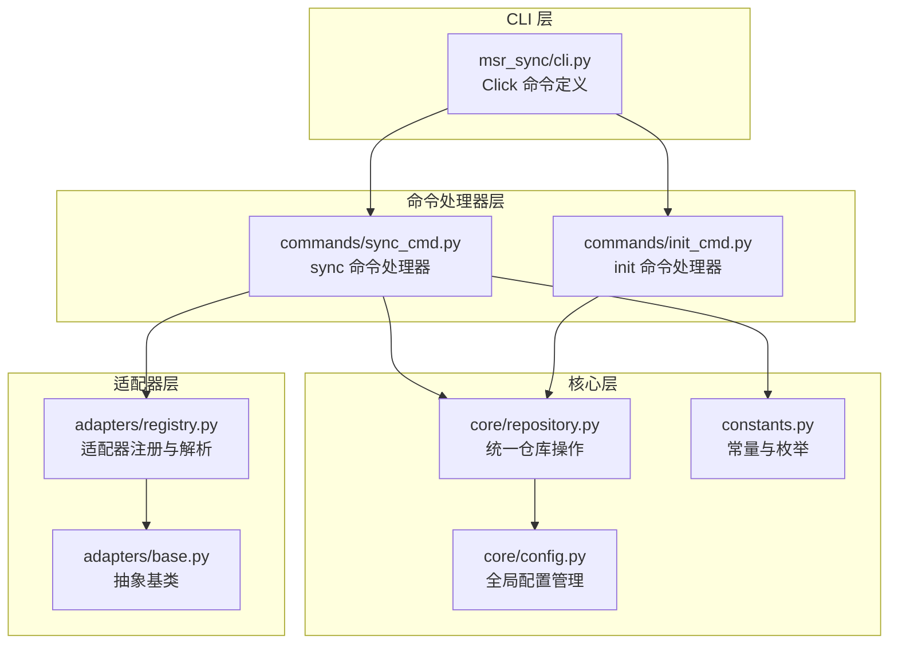
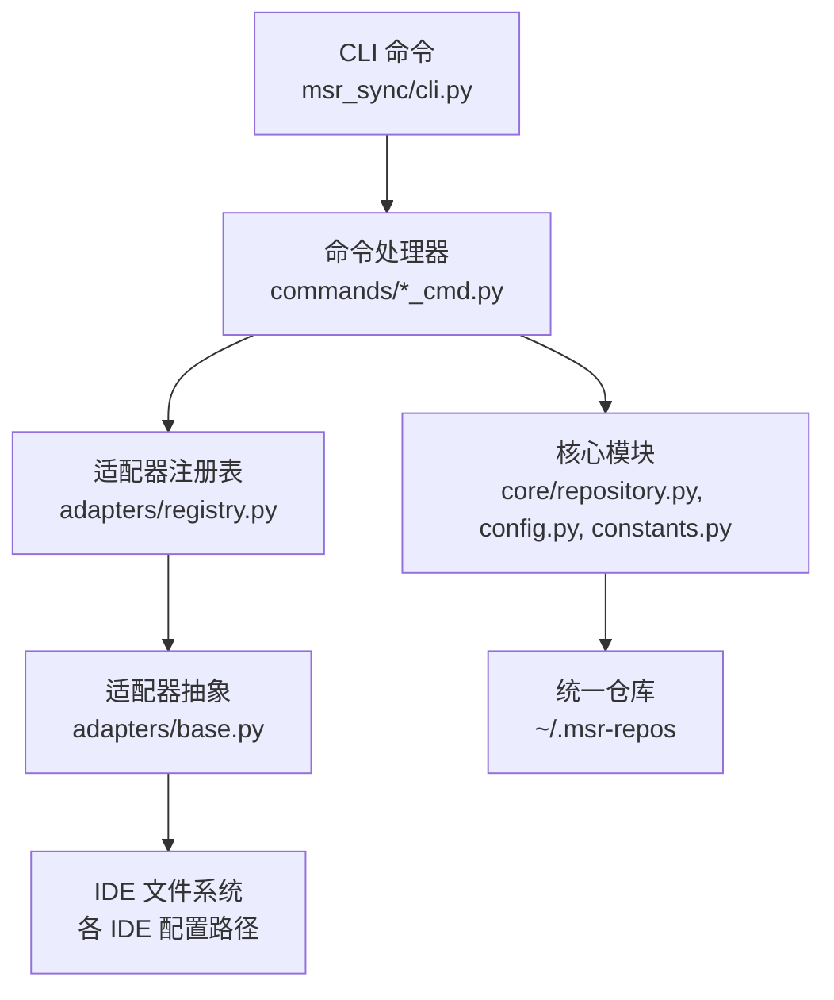
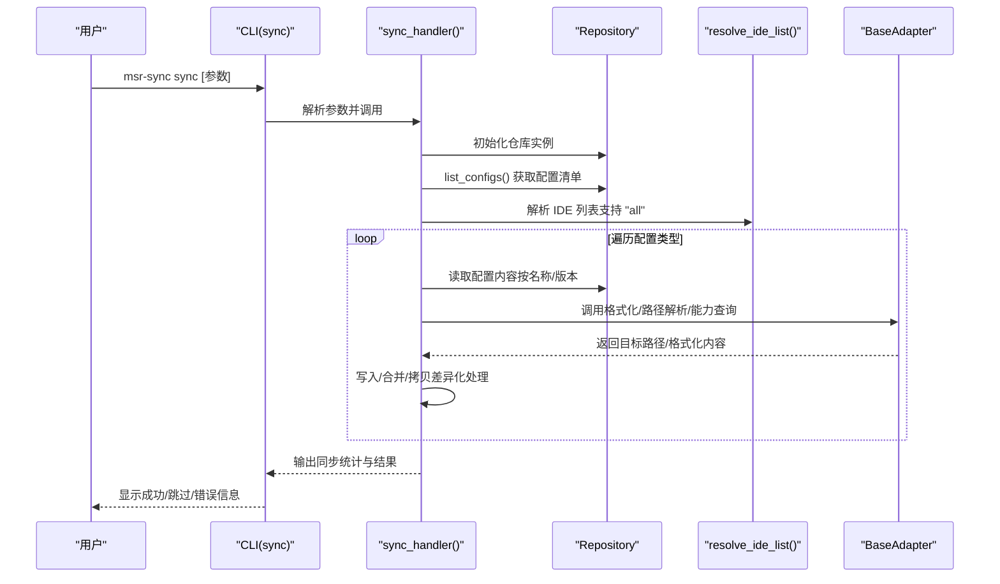
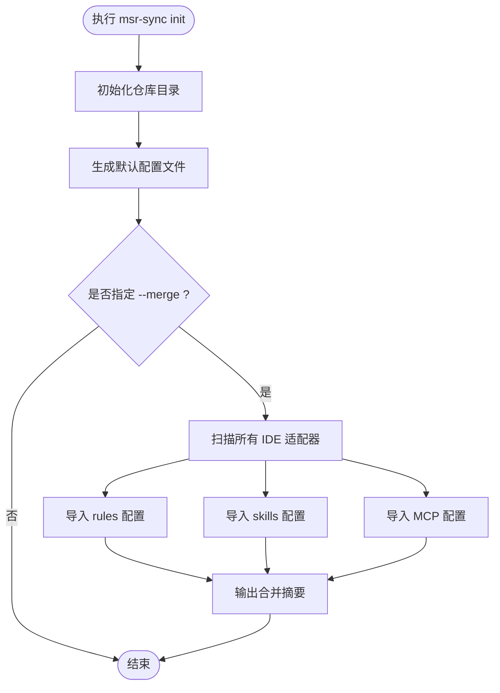
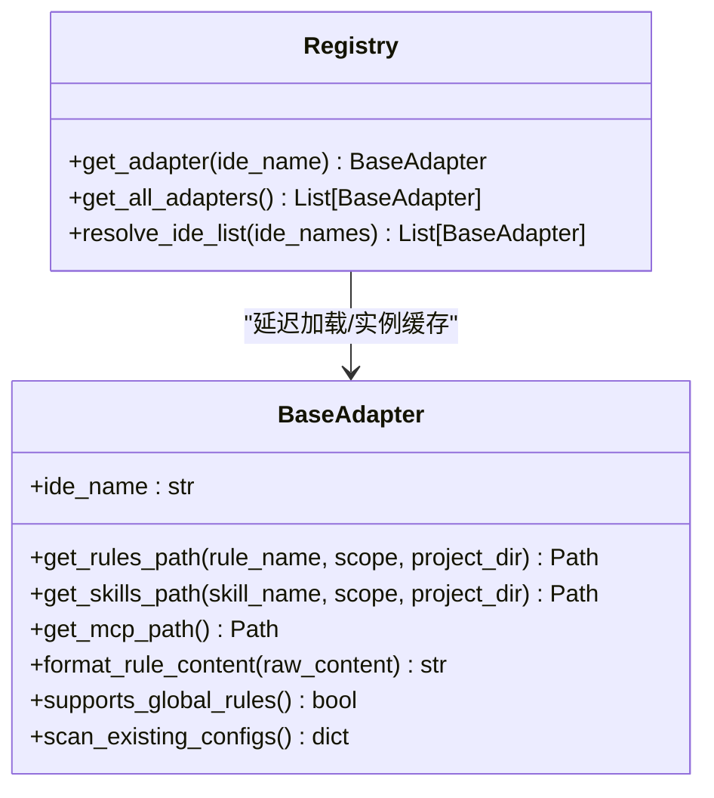
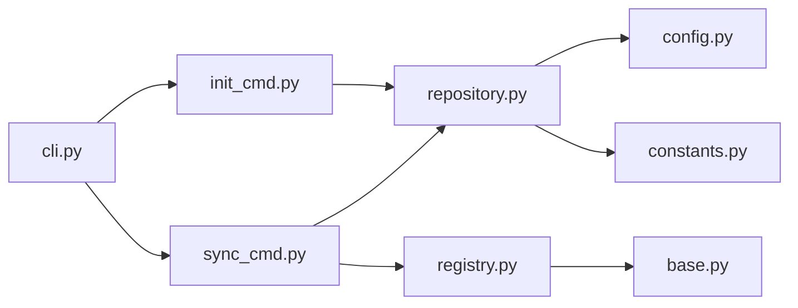
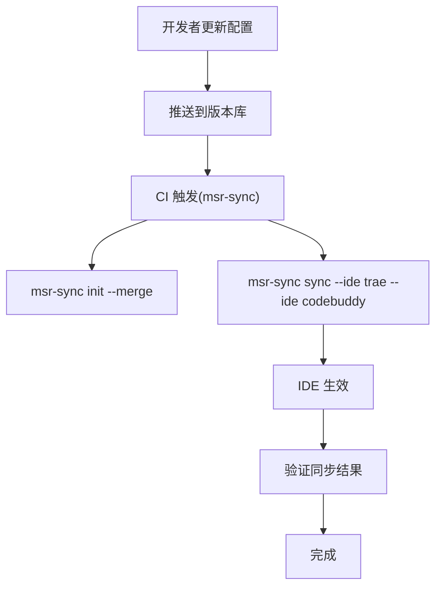

# 自动化脚本集成

<cite>
**本文引用的文件**
- [MSR-cli/pyproject.toml](file://MSR-cli/pyproject.toml)
- [MSR-cli/msr_sync/cli.py](file://MSR-cli/msr_sync/cli.py)
- [MSR-cli/msr_sync/commands/sync_cmd.py](file://MSR-cli/msr_sync/commands/sync_cmd.py)
- [MSR-cli/msr_sync/commands/init_cmd.py](file://MSR-cli/msr_sync/commands/init_cmd.py)
- [MSR-cli/msr_sync/core/repository.py](file://MSR-cli/msr_sync/core/repository.py)
- [MSR-cli/msr_sync/adapters/base.py](file://MSR-cli/msr_sync/adapters/base.py)
- [MSR-cli/msr_sync/adapters/registry.py](file://MSR-cli/msr_sync/adapters/registry.py)
- [MSR-cli/msr_sync/constants.py](file://MSR-cli/msr_sync/constants.py)
- [MSR-cli/msr_sync/core/config.py](file://MSR-cli/msr_sync/core/config.py)
- [MSR-cli/docs/usage.md](file://MSR-cli/docs/usage.md)
- [blog-msr-sync.md](file://blog-msr-sync.md)
- [MSR-cli/tests/test_cli_integration.py](file://MSR-cli/tests/test_cli_integration.py)
- [MSR-cli/tests/test_commands.py](file://MSR-cli/tests/test_commands.py)
</cite>

## 目录
1. [简介](#简介)
2. [项目结构](#项目结构)
3. [核心组件](#核心组件)
4. [架构总览](#架构总览)
5. [详细组件分析](#详细组件分析)
6. [依赖分析](#依赖分析)
7. [性能考虑](#性能考虑)
8. [故障排查指南](#故障排查指南)
9. [结论](#结论)
10. [附录](#附录)

## 简介
本文件面向希望将 MSR-v2 的 msr-sync 工具纳入自动化流程的工程师与运维人员，提供从命令行到 CI/CD、从定时任务到端到端工作流的完整集成指南。内容涵盖：
- 如何编写 Python 脚本与 Shell 脚本以程序化调用 CLI
- CLI 参数传递与结果处理的最佳实践
- 与 GitHub Actions、Jenkins 等平台的集成配置示例
- 定时任务（crontab 与系统服务）的配置方法
- 从配置更新到 IDE 同步的端到端自动化工作流

## 项目结构
MSR-cli 采用 Click 命令框架与分层架构组织，核心入口为命令行工具，命令处理器负责业务编排，核心模块提供仓库与配置能力，适配器层对接不同 IDE。

**图表来源**
- [MSR-cli/msr_sync/cli.py:1-116](file://MSR-cli/msr_sync/cli.py#L1-L116)
- [MSR-cli/msr_sync/commands/sync_cmd.py:1-411](file://MSR-cli/msr_sync/commands/sync_cmd.py#L1-L411)
- [MSR-cli/msr_sync/commands/init_cmd.py:1-137](file://MSR-cli/msr_sync/commands/init_cmd.py#L1-L137)
- [MSR-cli/msr_sync/core/repository.py:1-291](file://MSR-cli/msr_sync/core/repository.py#L1-L291)
- [MSR-cli/msr_sync/adapters/base.py:1-105](file://MSR-cli/msr_sync/adapters/base.py#L1-L105)
- [MSR-cli/msr_sync/adapters/registry.py:1-89](file://MSR-cli/msr_sync/adapters/registry.py#L1-L89)
- [MSR-cli/msr_sync/constants.py:1-50](file://MSR-cli/msr_sync/constants.py#L1-L50)
- [MSR-cli/msr_sync/core/config.py:1-204](file://MSR-cli/msr_sync/core/config.py#L1-L204)

**章节来源**
- [MSR-cli/msr_sync/cli.py:1-116](file://MSR-cli/msr_sync/cli.py#L1-L116)
- [MSR-cli/msr_sync/commands/sync_cmd.py:1-411](file://MSR-cli/msr_sync/commands/sync_cmd.py#L1-L411)
- [MSR-cli/msr_sync/commands/init_cmd.py:1-137](file://MSR-cli/msr_sync/commands/init_cmd.py#L1-L137)
- [MSR-cli/msr_sync/core/repository.py:1-291](file://MSR-cli/msr_sync/core/repository.py#L1-L291)
- [MSR-cli/msr_sync/adapters/base.py:1-105](file://MSR-cli/msr_sync/adapters/base.py#L1-L105)
- [MSR-cli/msr_sync/adapters/registry.py:1-89](file://MSR-cli/msr_sync/adapters/registry.py#L1-L89)
- [MSR-cli/msr_sync/constants.py:1-50](file://MSR-cli/msr_sync/constants.py#L1-L50)
- [MSR-cli/msr_sync/core/config.py:1-204](file://MSR-cli/msr_sync/core/config.py#L1-L204)

## 核心组件
- CLI 入口与命令定义：提供 init、import、sync、list、remove 等子命令，参数校验与错误输出通过 Click 与异常体系完成。
- 命令处理器：
  - sync_cmd：实现按 IDE、作用域、类型、名称、版本的精确同步，支持规则、技能、MCP 三类配置的差异化处理。
  - init_cmd：初始化统一仓库并可选择扫描现有 IDE 配置进行合并。
- 核心模块：
  - repository：统一仓库的创建、查询、删除、版本管理与路径解析。
  - config：全局配置加载、默认值与校验、默认行为注入。
  - constants：统一仓库目录、配置类型枚举、平台与版本号约定。
- 适配器层：
  - base：定义 IDE 适配器抽象，包括路径解析、格式转换、能力查询与扫描接口。
  - registry：IDE 适配器注册与延迟加载，支持“all”展开与实例缓存。

**章节来源**
- [MSR-cli/msr_sync/cli.py:1-116](file://MSR-cli/msr_sync/cli.py#L1-L116)
- [MSR-cli/msr_sync/commands/sync_cmd.py:1-411](file://MSR-cli/msr_sync/commands/sync_cmd.py#L1-L411)
- [MSR-cli/msr_sync/commands/init_cmd.py:1-137](file://MSR-cli/msr_sync/commands/init_cmd.py#L1-L137)
- [MSR-cli/msr_sync/core/repository.py:1-291](file://MSR-cli/msr_sync/core/repository.py#L1-L291)
- [MSR-cli/msr_sync/adapters/base.py:1-105](file://MSR-cli/msr_sync/adapters/base.py#L1-L105)
- [MSR-cli/msr_sync/adapters/registry.py:1-89](file://MSR-cli/msr_sync/adapters/registry.py#L1-L89)
- [MSR-cli/msr_sync/constants.py:1-50](file://MSR-cli/msr_sync/constants.py#L1-L50)
- [MSR-cli/msr_sync/core/config.py:1-204](file://MSR-cli/msr_sync/core/config.py#L1-L204)

## 架构总览
MSR-cli 采用“CLI -> 命令处理器 -> 核心模块 -> 适配器”的分层设计，命令处理器负责参数解析与业务编排，核心模块提供仓库与配置能力，适配器层屏蔽 IDE 差异。

**图表来源**
- [MSR-cli/msr_sync/cli.py:1-116](file://MSR-cli/msr_sync/cli.py#L1-L116)
- [MSR-cli/msr_sync/commands/sync_cmd.py:1-411](file://MSR-cli/msr_sync/commands/sync_cmd.py#L1-L411)
- [MSR-cli/msr_sync/core/repository.py:1-291](file://MSR-cli/msr_sync/core/repository.py#L1-L291)
- [MSR-cli/msr_sync/adapters/registry.py:1-89](file://MSR-cli/msr_sync/adapters/registry.py#L1-L89)
- [MSR-cli/msr_sync/adapters/base.py:1-105](file://MSR-cli/msr_sync/adapters/base.py#L1-L105)

## 详细组件分析

### CLI 命令与参数体系
- init：初始化统一仓库，支持 --merge 扫描现有 IDE 配置并导入。
- import：从文件/目录/压缩包/URL 导入配置，自动创建版本并支持交互确认。
- sync：按 IDE、作用域、类型、名称、版本精确同步；支持“all”展开。
- list：以树形结构展示仓库配置与版本。
- remove：删除指定配置版本。

参数与默认值来源：
- CLI 层定义参数与默认值，未指定时由 core/config.py 的 GlobalConfig 提供默认行为。
- 仓库路径、忽略模式、默认 IDE 列表、默认作用域等可通过 ~/.msr-sync/config.yaml 自定义。

**章节来源**
- [MSR-cli/msr_sync/cli.py:1-116](file://MSR-cli/msr_sync/cli.py#L1-L116)
- [MSR-cli/msr_sync/core/config.py:1-204](file://MSR-cli/msr_sync/core/config.py#L1-L204)
- [MSR-cli/docs/usage.md:21-759](file://MSR-cli/docs/usage.md#L21-L759)

### sync 命令处理流程
sync 命令的处理流程如下：

**图表来源**
- [MSR-cli/msr_sync/cli.py:58-82](file://MSR-cli/msr_sync/cli.py#L58-L82)
- [MSR-cli/msr_sync/commands/sync_cmd.py:26-131](file://MSR-cli/msr_sync/commands/sync_cmd.py#L26-L131)
- [MSR-cli/msr_sync/core/repository.py:201-235](file://MSR-cli/msr_sync/core/repository.py#L201-L235)
- [MSR-cli/msr_sync/adapters/registry.py:75-89](file://MSR-cli/msr_sync/adapters/registry.py#L75-L89)

**章节来源**
- [MSR-cli/msr_sync/commands/sync_cmd.py:1-411](file://MSR-cli/msr_sync/commands/sync_cmd.py#L1-L411)
- [MSR-cli/msr_sync/core/repository.py:1-291](file://MSR-cli/msr_sync/core/repository.py#L1-L291)
- [MSR-cli/msr_sync/adapters/registry.py:1-89](file://MSR-cli/msr_sync/adapters/registry.py#L1-L89)

### init 命令与合并逻辑
init 命令负责创建统一仓库目录结构与默认配置文件，并可选择扫描各 IDE 现有配置进行合并。合并过程遍历适配器，逐项导入规则、技能与 MCP。

**图表来源**
- [MSR-cli/msr_sync/commands/init_cmd.py:13-42](file://MSR-cli/msr_sync/commands/init_cmd.py#L13-L42)
- [MSR-cli/msr_sync/commands/init_cmd.py:44-137](file://MSR-cli/msr_sync/commands/init_cmd.py#L44-L137)

**章节来源**
- [MSR-cli/msr_sync/commands/init_cmd.py:1-137](file://MSR-cli/msr_sync/commands/init_cmd.py#L1-L137)

### 适配器抽象与注册机制
适配器层通过抽象基类定义统一接口，注册表负责延迟加载与实例缓存，支持“all”展开与 IDE 能力查询。

**图表来源**
- [MSR-cli/msr_sync/adapters/base.py:1-105](file://MSR-cli/msr_sync/adapters/base.py#L1-L105)
- [MSR-cli/msr_sync/adapters/registry.py:1-89](file://MSR-cli/msr_sync/adapters/registry.py#L1-L89)

**章节来源**
- [MSR-cli/msr_sync/adapters/base.py:1-105](file://MSR-cli/msr_sync/adapters/base.py#L1-L105)
- [MSR-cli/msr_sync/adapters/registry.py:1-89](file://MSR-cli/msr_sync/adapters/registry.py#L1-L89)

## 依赖分析
- CLI 依赖命令处理器；命令处理器依赖核心模块与适配器注册表；核心模块依赖常量与配置；适配器层依赖抽象基类。
- 依赖关系清晰，命令层与核心层解耦，适配器层通过注册表与抽象基类实现扩展。

**图表来源**
- [MSR-cli/msr_sync/cli.py:1-116](file://MSR-cli/msr_sync/cli.py#L1-L116)
- [MSR-cli/msr_sync/commands/sync_cmd.py:1-411](file://MSR-cli/msr_sync/commands/sync_cmd.py#L1-L411)
- [MSR-cli/msr_sync/commands/init_cmd.py:1-137](file://MSR-cli/msr_sync/commands/init_cmd.py#L1-L137)
- [MSR-cli/msr_sync/core/repository.py:1-291](file://MSR-cli/msr_sync/core/repository.py#L1-L291)
- [MSR-cli/msr_sync/adapters/registry.py:1-89](file://MSR-cli/msr_sync/adapters/registry.py#L1-L89)
- [MSR-cli/msr_sync/adapters/base.py:1-105](file://MSR-cli/msr_sync/adapters/base.py#L1-L105)
- [MSR-cli/msr_sync/core/config.py:1-204](file://MSR-cli/msr_sync/core/config.py#L1-L204)
- [MSR-cli/msr_sync/constants.py:1-50](file://MSR-cli/msr_sync/constants.py#L1-L50)

**章节来源**
- [MSR-cli/msr_sync/cli.py:1-116](file://MSR-cli/msr_sync/cli.py#L1-L116)
- [MSR-cli/msr_sync/commands/sync_cmd.py:1-411](file://MSR-cli/msr_sync/commands/sync_cmd.py#L1-L411)
- [MSR-cli/msr_sync/commands/init_cmd.py:1-137](file://MSR-cli/msr_sync/commands/init_cmd.py#L1-L137)
- [MSR-cli/msr_sync/core/repository.py:1-291](file://MSR-cli/msr_sync/core/repository.py#L1-L291)
- [MSR-cli/msr_sync/adapters/registry.py:1-89](file://MSR-cli/msr_sync/adapters/registry.py#L1-L89)
- [MSR-cli/msr_sync/adapters/base.py:1-105](file://MSR-cli/msr_sync/adapters/base.py#L1-L105)
- [MSR-cli/msr_sync/core/config.py:1-204](file://MSR-cli/msr_sync/core/config.py#L1-L204)
- [MSR-cli/msr_sync/constants.py:1-50](file://MSR-cli/msr_sync/constants.py#L1-L50)

## 性能考虑
- 幂等性：init 重复执行安全；仓库目录创建与默认配置生成具备幂等特性。
- 版本管理：自动递增版本，避免冲突；同步默认使用最新版本，减少人工干预。
- 平台适配：自动区分 macOS 与 Windows 路径，减少运行时判断成本。
- 适配器缓存：注册表缓存适配器实例，降低重复创建开销。
- I/O 优化：规则写入与技能目录拷贝采用最小必要操作，MCP 合并仅在有变更时写入。

**章节来源**
- [MSR-cli/msr_sync/commands/init_cmd.py:13-42](file://MSR-cli/msr_sync/commands/init_cmd.py#L13-L42)
- [MSR-cli/msr_sync/commands/sync_cmd.py:1-411](file://MSR-cli/msr_sync/commands/sync_cmd.py#L1-L411)
- [MSR-cli/msr_sync/adapters/registry.py:18-63](file://MSR-cli/msr_sync/adapters/registry.py#L18-L63)

## 故障排查指南
- 未初始化仓库：执行任何命令前需先执行 init；CLI 会在未初始化时明确提示。
- 配置文件错误：YAML 语法错误会给出具体文件路径与错误信息；可删除后重新生成。
- 无效 IDE 名称或作用域：配置文件中的值会被校验并回退到默认值，同时输出警告。
- 权限不足：检查目标路径写权限；同步失败会提示无法写入。
- MCP 格式错误：确保 mcp.json 为合法 JSON；合并失败会提示格式错误。
- 不支持的全局规则：对不支持全局规则的 IDE（如 Trae、Qoder、Lingma），全局级同步会跳过并提示。

**章节来源**
- [MSR-cli/docs/usage.md:634-759](file://MSR-cli/docs/usage.md#L634-L759)
- [MSR-cli/msr_sync/core/config.py:91-127](file://MSR-cli/msr_sync/core/config.py#L91-L127)
- [MSR-cli/msr_sync/commands/sync_cmd.py:204-207](file://MSR-cli/msr_sync/commands/sync_cmd.py#L204-L207)

## 结论
MSR-v2 的 msr-sync 工具提供了统一的 CLI 接口与完善的命令处理器、核心模块与适配器层，能够稳定地支持规则、技能、MCP 三类配置的集中管理与跨 IDE 同步。通过本文档提供的自动化脚本集成方案，可在本地与 CI/CD 环境中高效落地，实现从配置更新到 IDE 同步的端到端自动化。

## 附录

### A. Python 脚本程序化调用 CLI
- 使用 click.testing.CliRunner 进行命令调用与断言，适合在测试中模拟 CLI 行为。
- 在生产脚本中，建议直接调用命令处理器函数（如 sync_handler、init_handler），传入参数与 base_path，以避免 CLI 输出干扰与交互确认。
- 注意：
  - 未初始化仓库时需先调用 init_handler。
  - 通过 core/config.get_config() 获取默认行为，或在调用前重置/注入配置。
  - 适配器解析依赖注册表，确保 IDE 名称在支持列表内。

**章节来源**
- [MSR-cli/tests/test_cli_integration.py:1-276](file://MSR-cli/tests/test_cli_integration.py#L1-L276)
- [MSR-cli/tests/test_commands.py:1-533](file://MSR-cli/tests/test_commands.py#L1-L533)
- [MSR-cli/msr_sync/commands/sync_cmd.py:26-82](file://MSR-cli/msr_sync/commands/sync_cmd.py#L26-L82)
- [MSR-cli/msr_sync/commands/init_cmd.py:13-42](file://MSR-cli/msr_sync/commands/init_cmd.py#L13-L42)
- [MSR-cli/msr_sync/core/config.py:140-158](file://MSR-cli/msr_sync/core/config.py#L140-L158)

### B. Shell 脚本调用 CLI
- 直接在 Shell 中执行 msr-sync 命令，结合 set -e 与错误码处理，实现失败即停止的自动化流程。
- 建议：
  - 在执行前检查仓库是否存在，不存在则先执行 init。
  - 使用 --type、--name、--version 精确控制同步范围，避免不必要的 I/O。
  - 对于 CI 环境，建议将 ~/.msr-sync/config.yaml 预置为期望配置，减少交互。

**章节来源**
- [MSR-cli/docs/usage.md:21-759](file://MSR-cli/docs/usage.md#L21-L759)

### C. CI/CD 集成方案

#### GitHub Actions
- 工作流要点：
  - 使用 actions/checkout 拉取代码。
  - 使用 actions/setup-python 安装 Python。
  - 安装 msr-sync：pip install msr-sync。
  - 执行初始化与同步：msr-sync init、msr-sync sync --ide <ide>。
  - 可选：将 ~/.msr-sync/config.yaml 与密钥放入 Secrets，部署前注入。
- 示例步骤（概念示意）：
  - checkout -> setup-python -> pip install msr-sync -> msr-sync init --merge -> msr-sync sync --ide trae --ide codebuddy

**章节来源**
- [MSR-cli/docs/usage.md:21-759](file://MSR-cli/docs/usage.md#L21-L759)
- [MSR-cli/pyproject.toml:1-37](file://MSR-cli/pyproject.toml#L1-L37)

#### Jenkins
- 插件建议：Pipeline Utility Steps、Credentials Binding。
- 步骤建议：
  - 执行 shell 步骤安装与调用 msr-sync。
  - 使用环境变量或凭据绑定注入配置文件与密钥。
  - 将同步结果记录到构建日志或 Artifacts。
- 注意：确保 Jenkins Agent 上有 Python 与所需权限。

**章节来源**
- [MSR-cli/docs/usage.md:21-759](file://MSR-cli/docs/usage.md#L21-L759)

### D. 定时任务配置

#### crontab
- 适用场景：每日/每周定时同步团队共享配置到本地 IDE。
- 建议：
  - 使用绝对路径与完整环境变量。
  - 在脚本中先执行 init（幂等），再执行 sync。
  - 将输出重定向至日志文件，便于排查。

**章节来源**
- [MSR-cli/docs/usage.md:21-759](file://MSR-cli/docs/usage.md#L21-L759)

#### 系统服务（Linux systemd）
- 适用场景：开机自启或周期性任务。
- 建议：
  - 编写 ExecStart= 调用 Shell 脚本。
  - 设置 WorkingDirectory 与 Environment。
  - 使用 Timer 单元实现定时触发。

**章节来源**
- [MSR-cli/docs/usage.md:21-759](file://MSR-cli/docs/usage.md#L21-L759)

### E. 端到端自动化工作流示例

- 说明：
  - init --merge 从各 IDE 扫描并导入现有配置，形成统一仓库。
  - sync 将统一仓库中的配置同步到目标 IDE。
  - CI/CD 与定时任务可自动化执行上述步骤，实现持续同步。

**图表来源**
- [MSR-cli/docs/usage.md:525-631](file://MSR-cli/docs/usage.md#L525-L631)
- [blog-msr-sync.md:346-421](file://blog-msr-sync.md#L346-L421)