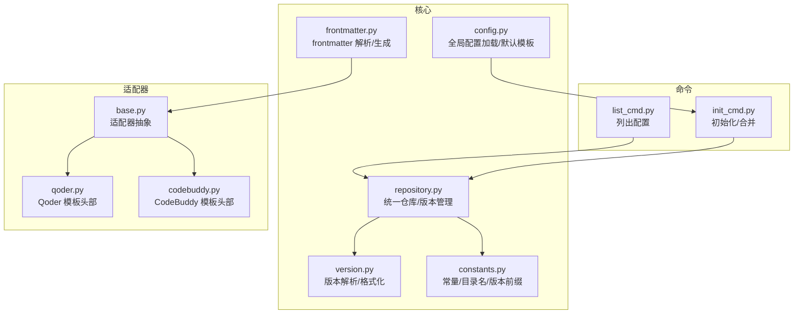
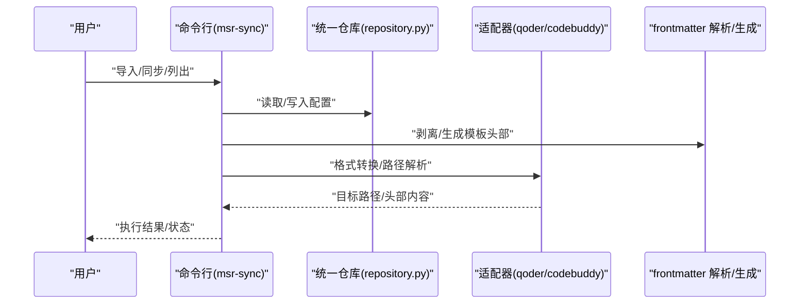
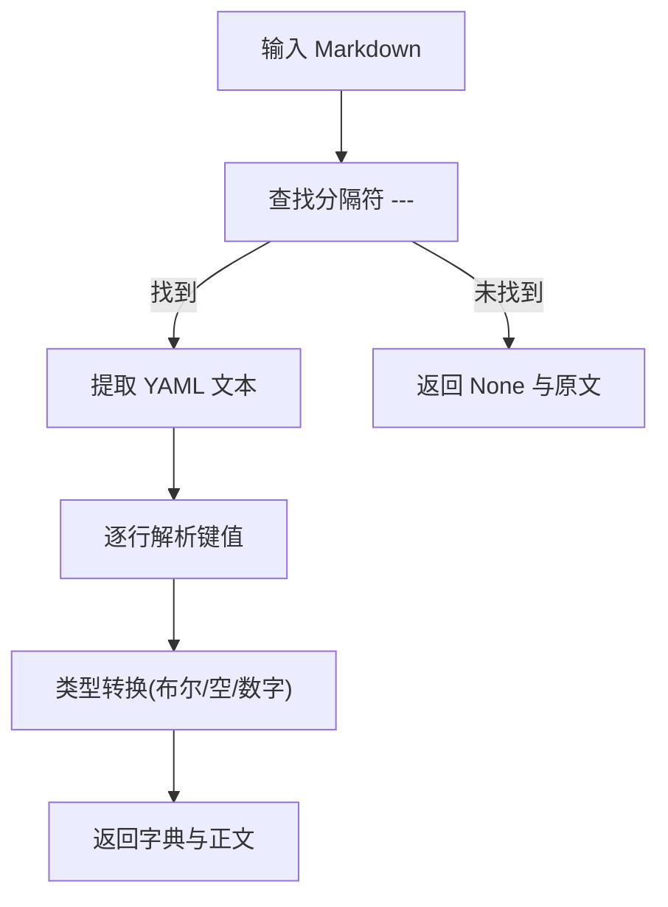
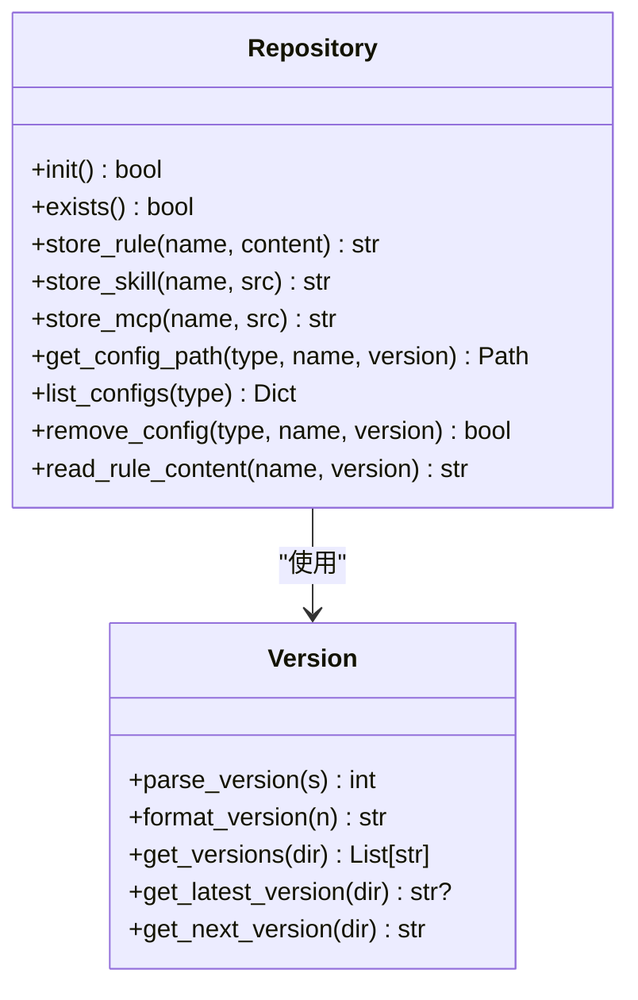
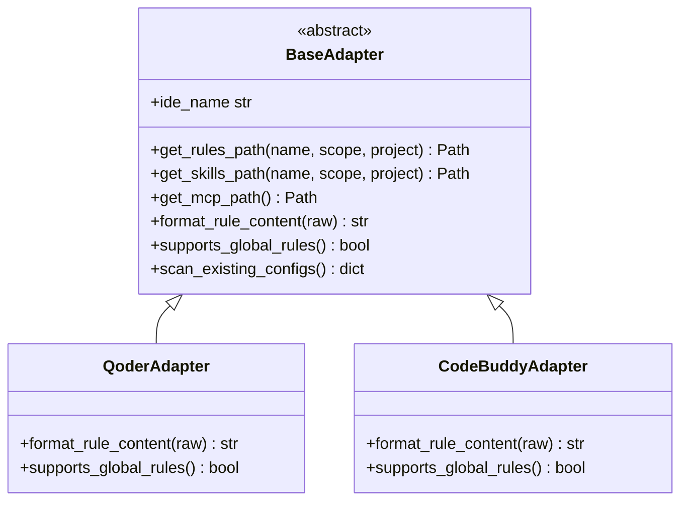
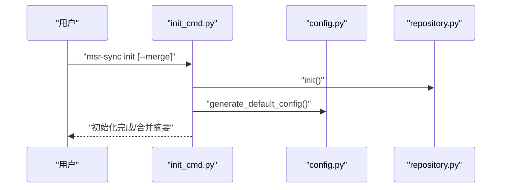
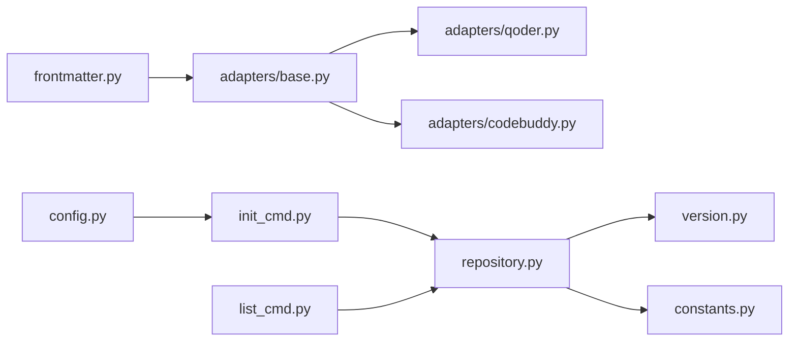

# 配置模板管理

<cite>
**本文引用的文件**
- [frontmatter.py](file://MSR-cli/msr_sync/core/frontmatter.py)
- [config.py](file://MSR-cli/msr_sync/core/config.py)
- [repository.py](file://MSR-cli/msr_sync/core/repository.py)
- [version.py](file://MSR-cli/msr_sync/core/version.py)
- [constants.py](file://MSR-cli/msr_sync/constants.py)
- [base.py](file://MSR-cli/msr_sync/adapters/base.py)
- [qoder.py](file://MSR-cli/msr_sync/adapters/qoder.py)
- [codebuddy.py](file://MSR-cli/msr_sync/adapters/codebuddy.py)
- [init_cmd.py](file://MSR-cli/msr_sync/commands/init_cmd.py)
- [list_cmd.py](file://MSR-cli/msr_sync/commands/list_cmd.py)
- [usage.md](file://MSR-cli/docs/usage.md)
- [test_frontmatter.py](file://MSR-cli/tests/test_frontmatter.py)
- [pyproject.toml](file://MSR-cli/pyproject.toml)
</cite>

## 目录
1. [简介](#简介)
2. [项目结构](#项目结构)
3. [核心组件](#核心组件)
4. [架构总览](#架构总览)
5. [详细组件分析](#详细组件分析)
6. [依赖分析](#依赖分析)
7. [性能考虑](#性能考虑)
8. [故障排查指南](#故障排查指南)
9. [结论](#结论)
10. [附录](#附录)

## 简介
本文件系统性阐述“配置模板管理”的设计与实现，围绕模板的创建、使用与管理机制展开，重点包括：
- 模板格式规范与命名约定
- frontmatter 的作用、格式与解析流程
- 模板继承与复用机制（基础模板与扩展模板）
- 版本管理与共享策略
- 实际使用案例与常见问题解决方案

本系统以统一仓库为核心，支持 rules、skills、MCP 三类配置的导入、存储、版本化与同步；同时通过适配器模式对接不同 IDE 的模板头部要求，实现跨 IDE 的模板复用与迁移。

## 项目结构
MSR-sync 的模板管理相关代码集中在以下模块：
- 核心解析与生成：frontmatter.py
- 仓库与版本：repository.py、version.py、constants.py
- 配置与默认行为：config.py、usage.md
- 适配器与模板头部：adapters/base.py、adapters/qoder.py、adapters/codebuddy.py
- 命令入口：commands/init_cmd.py、commands/list_cmd.py
- 测试与文档：tests/test_frontmatter.py、pyproject.toml

**图表来源**
- [frontmatter.py:1-164](file://MSR-cli/msr_sync/core/frontmatter.py#L1-L164)
- [config.py:1-204](file://MSR-cli/msr_sync/core/config.py#L1-L204)
- [repository.py:1-291](file://MSR-cli/msr_sync/core/repository.py#L1-L291)
- [version.py:1-119](file://MSR-cli/msr_sync/core/version.py#L1-L119)
- [constants.py:1-50](file://MSR-cli/msr_sync/constants.py#L1-L50)
- [base.py:1-105](file://MSR-cli/msr_sync/adapters/base.py#L1-L105)
- [qoder.py:1-140](file://MSR-cli/msr_sync/adapters/qoder.py#L1-L140)
- [codebuddy.py:1-143](file://MSR-cli/msr_sync/adapters/codebuddy.py#L1-L143)
- [init_cmd.py:1-137](file://MSR-cli/msr_sync/commands/init_cmd.py#L1-L137)
- [list_cmd.py:1-63](file://MSR-cli/msr_sync/commands/list_cmd.py#L1-L63)

**章节来源**
- [frontmatter.py:1-164](file://MSR-cli/msr_sync/core/frontmatter.py#L1-L164)
- [config.py:1-204](file://MSR-cli/msr_sync/core/config.py#L1-L204)
- [repository.py:1-291](file://MSR-cli/msr_sync/core/repository.py#L1-L291)
- [version.py:1-119](file://MSR-cli/msr_sync/core/version.py#L1-L119)
- [constants.py:1-50](file://MSR-cli/msr_sync/constants.py#L1-L50)
- [base.py:1-105](file://MSR-cli/msr_sync/adapters/base.py#L1-L105)
- [qoder.py:1-140](file://MSR-cli/msr_sync/adapters/qoder.py#L1-L140)
- [codebuddy.py:1-143](file://MSR-cli/msr_sync/adapters/codebuddy.py#L1-L143)
- [init_cmd.py:1-137](file://MSR-cli/msr_sync/commands/init_cmd.py#L1-L137)
- [list_cmd.py:1-63](file://MSR-cli/msr_sync/commands/list_cmd.py#L1-L63)

## 核心组件
- frontmatter 解析与生成：提供剥离、解析与生成 IDE 模板头部的能力，支撑模板格式一致性与跨 IDE 复用。
- 仓库与版本：统一存储 rules、skills、MCP，按名称与版本号组织，支持多版本并存与自动递增。
- 适配器：面向不同 IDE 的路径解析与模板头部生成，实现“基础模板 + 扩展模板”的差异化应用。
- 命令与配置：提供初始化、导入、同步、列出等命令，结合全局配置文件实现默认行为与共享策略。

**章节来源**
- [frontmatter.py:10-164](file://MSR-cli/msr_sync/core/frontmatter.py#L10-L164)
- [repository.py:23-291](file://MSR-cli/msr_sync/core/repository.py#L23-L291)
- [version.py:9-119](file://MSR-cli/msr_sync/core/version.py#L9-L119)
- [base.py:8-105](file://MSR-cli/msr_sync/adapters/base.py#L8-L105)
- [init_cmd.py:13-137](file://MSR-cli/msr_sync/commands/init_cmd.py#L13-L137)
- [list_cmd.py:12-63](file://MSR-cli/msr_sync/commands/list_cmd.py#L12-L63)
- [config.py:91-204](file://MSR-cli/msr_sync/core/config.py#L91-L204)

## 架构总览
模板管理的端到端流程如下：
- 创建阶段：编写 Markdown 规则，按需加入 frontmatter 元数据；导入到统一仓库，自动创建版本目录。
- 使用阶段：同步到目标 IDE，系统剥离原始 frontmatter，按 IDE 生成模板头部，写入对应路径。
- 管理阶段：版本化存储、列出版本、删除旧版本；全局配置控制默认行为与忽略模式。

**图表来源**
- [repository.py:89-291](file://MSR-cli/msr_sync/core/repository.py#L89-L291)
- [frontmatter.py:10-164](file://MSR-cli/msr_sync/core/frontmatter.py#L10-L164)
- [qoder.py:84-98](file://MSR-cli/msr_sync/adapters/qoder.py#L84-L98)
- [codebuddy.py:82-100](file://MSR-cli/msr_sync/adapters/codebuddy.py#L82-L100)
- [init_cmd.py:13-137](file://MSR-cli/msr_sync/commands/init_cmd.py#L13-L137)
- [list_cmd.py:12-63](file://MSR-cli/msr_sync/commands/list_cmd.py#L12-L63)

## 详细组件分析

### 组件一：frontmatter 解析与模板生成
- 功能要点
  - 剥离 frontmatter：去除以 --- 开头与结尾的 YAML 区块，返回正文。
  - 解析 frontmatter：将 YAML 键值对解析为字典，支持布尔/空/数字等类型转换。
  - 生成 IDE 模板头部：针对不同 IDE 生成固定格式的 frontmatter 模板，保证跨 IDE 一致性。
- 设计模式
  - 简化 YAML 解析：仅支持单层 key: value，不支持嵌套与复杂结构，满足当前需求。
  - 模板工厂：按 IDE 生成头部，便于扩展新 IDE。
- 复杂度与性能
  - 剥离与解析均为线性扫描，时间复杂度 O(n)，空间复杂度 O(n)。
  - 类型转换采用惰性尝试，性能开销小。

**图表来源**
- [frontmatter.py:26-107](file://MSR-cli/msr_sync/core/frontmatter.py#L26-L107)

**章节来源**
- [frontmatter.py:10-164](file://MSR-cli/msr_sync/core/frontmatter.py#L10-L164)
- [test_frontmatter.py:22-381](file://MSR-cli/tests/test_frontmatter.py#L22-L381)

### 组件二：统一仓库与版本管理
- 功能要点
  - 目录结构：统一仓库包含 RULES、SKILLS、MCP 三大目录，按名称分组。
  - 版本化：每个配置名称下按 V1/V2/V3... 递增版本，支持读取最新版本与下一个版本。
  - 存储与读取：rules 以 .md 文件存储，skills 与 MCP 以目录形式复制。
- 命名约定
  - 配置名称：由导入来源决定（rules 以文件名不含扩展名，skills 以目录名，MCP 以目录名）。
  - 版本号：以大写字母 V 开头加正整数，如 V1、V2。
- 复杂度与性能
  - 版本扫描与排序为 O(k log k)，k 为版本数量；I/O 主导。

**图表来源**
- [repository.py:23-291](file://MSR-cli/msr_sync/core/repository.py#L23-L291)
- [version.py:9-119](file://MSR-cli/msr_sync/core/version.py#L9-L119)
- [constants.py:16-43](file://MSR-cli/msr_sync/constants.py#L16-L43)

**章节来源**
- [repository.py:23-291](file://MSR-cli/msr_sync/core/repository.py#L23-L291)
- [version.py:59-119](file://MSR-cli/msr_sync/core/version.py#L59-L119)
- [constants.py:16-43](file://MSR-cli/msr_sync/constants.py#L16-L43)

### 组件三：适配器与模板头部
- 功能要点
  - 路径解析：根据 scope（project/global）与 IDE 平台，计算目标路径。
  - 模板头部：按 IDE 生成固定 frontmatter 模板，确保目标 IDE 可识别。
  - 能力查询：声明是否支持全局 rules 等能力。
- 模板头部差异
  - Qoder/Lingma：统一使用 trigger: always_on。
  - CodeBuddy：包含 description、alwaysApply、enabled、updatedAt、provider 等字段。
  - Trae：不添加额外头部，直接写入正文。
- 复杂度与性能
  - 路径解析与文件系统操作为主，时间复杂度取决于文件系统性能。

**图表来源**
- [base.py:8-105](file://MSR-cli/msr_sync/adapters/base.py#L8-L105)
- [qoder.py:22-140](file://MSR-cli/msr_sync/adapters/qoder.py#L22-L140)
- [codebuddy.py:22-143](file://MSR-cli/msr_sync/adapters/codebuddy.py#L22-L143)

**章节来源**
- [base.py:18-105](file://MSR-cli/msr_sync/adapters/base.py#L18-L105)
- [qoder.py:84-98](file://MSR-cli/msr_sync/adapters/qoder.py#L84-L98)
- [codebuddy.py:82-100](file://MSR-cli/msr_sync/adapters/codebuddy.py#L82-L100)

### 组件四：命令与流程
- init 命令：初始化统一仓库，生成默认配置文件；可选择合并现有 IDE 配置。
- list 命令：以树形结构列出仓库中的配置与版本。
- 同步流程：读取仓库内容 → 剥离原始 frontmatter → 生成目标 IDE 模板头部 → 写入目标路径。

**图表来源**
- [init_cmd.py:13-137](file://MSR-cli/msr_sync/commands/init_cmd.py#L13-L137)
- [config.py:187-204](file://MSR-cli/msr_sync/core/config.py#L187-L204)
- [repository.py:40-51](file://MSR-cli/msr_sync/core/repository.py#L40-L51)

**章节来源**
- [init_cmd.py:13-137](file://MSR-cli/msr_sync/commands/init_cmd.py#L13-L137)
- [list_cmd.py:12-63](file://MSR-cli/msr_sync/commands/list_cmd.py#L12-L63)
- [usage.md:202-306](file://MSR-cli/docs/usage.md#L202-L306)

## 依赖分析
- 模块内聚与耦合
  - frontmatter 与适配器松耦合：适配器仅依赖 frontmatter 的头部生成接口。
  - 仓库与版本：仓库依赖版本模块进行版本号解析与递增。
  - 命令层依赖仓库与适配器，负责编排流程。
- 外部依赖
  - YAML 解析：用于全局配置文件加载与序列化。
  - Click：命令行框架。
  - 可选依赖：测试框架与属性基测试库。

**图表来源**
- [frontmatter.py:1-164](file://MSR-cli/msr_sync/core/frontmatter.py#L1-L164)
- [base.py:1-105](file://MSR-cli/msr_sync/adapters/base.py#L1-L105)
- [qoder.py:1-140](file://MSR-cli/msr_sync/adapters/qoder.py#L1-L140)
- [codebuddy.py:1-143](file://MSR-cli/msr_sync/adapters/codebuddy.py#L1-L143)
- [repository.py:1-291](file://MSR-cli/msr_sync/core/repository.py#L1-L291)
- [version.py:1-119](file://MSR-cli/msr_sync/core/version.py#L1-L119)
- [constants.py:1-50](file://MSR-cli/msr_sync/constants.py#L1-L50)
- [init_cmd.py:1-137](file://MSR-cli/msr_sync/commands/init_cmd.py#L1-L137)
- [list_cmd.py:1-63](file://MSR-cli/msr_sync/commands/list_cmd.py#L1-L63)
- [config.py:1-204](file://MSR-cli/msr_sync/core/config.py#L1-L204)

**章节来源**
- [pyproject.toml:18-27](file://MSR-cli/pyproject.toml#L18-L27)

## 性能考虑
- frontmatter 解析：线性扫描，适合大体量 Markdown；建议保持 frontmatter 简洁，避免冗余键值。
- 版本管理：版本目录扫描与排序为 O(k log k)，建议控制每个配置的版本数量，定期清理旧版本。
- I/O 密集：仓库读写与适配器写入为主要瓶颈，建议批量同步与异步写入（当前实现为顺序执行，满足 CLI 工具场景）。
- 平台路径解析：适配器路径解析为常量时间，受文件系统性能影响。

## 故障排查指南
- 统一仓库未初始化
  - 现象：执行 list/sync/remove/import 报错。
  - 处理：先执行初始化命令，或检查仓库目录是否存在。
- 配置文件 YAML 语法错误
  - 现象：加载配置时报错。
  - 处理：修正 YAML 缩进/键值，或删除后重新生成默认配置。
- 不支持的 IDE 名称或默认层级
  - 现象：配置文件中的 default_ides/default_scope 无效。
  - 处理：修正为支持值（如 trae/qoder/lingma/codebuddy/all 与 global/project）。
- 全局级 rules 不支持
  - 现象：对 Qoder/Lingma 使用 global scope 同步 rules 时出现警告。
  - 处理：改为 project scope，或迁移到支持全局 rules 的 IDE（如 CodeBuddy）。
- MCP 配置格式错误
  - 现象：mcp.json 非法 JSON。
  - 处理：使用 JSON 校验工具修复，或删除后重新生成。

**章节来源**
- [usage.md:634-759](file://MSR-cli/docs/usage.md#L634-L759)
- [config.py:91-128](file://MSR-cli/msr_sync/core/config.py#L91-L128)

## 结论
本系统通过“统一仓库 + 适配器 + frontmatter 模板头部”的架构，实现了跨 IDE 的模板标准化与版本化管理。frontmatter 的剥离与生成确保了模板的一致性；适配器模式使新增 IDE 变得轻量；版本化存储与命令行工具提供了完善的生命周期管理。建议在团队内推广统一的 frontmatter 字段与命名规范，配合版本管理与共享策略，提升配置复用效率与可维护性。

## 附录

### 模板格式规范与命名约定
- 模板文件类型
  - rules：Markdown 文件，文件名为配置名称（不含扩展名）。
  - skills：目录，根目录包含标识文件（如 SKILL.md）。
  - MCP：目录，根目录包含配置文件（如 mcp.json）。
- frontmatter 规范
  - 使用三短横线分隔，键值对采用单层 key: value。
  - 值支持布尔、空值、数字；字符串保持原样。
  - IDE 模板头部字段：
    - Qoder/Lingma：trigger: always_on
    - CodeBuddy：description、alwaysApply: true、enabled: true、updatedAt、provider
    - Trae：无额外头部
- 命名约定
  - 配置名称：由导入来源决定；建议使用语义化英文，避免特殊字符。
  - 版本号：V1/V2/V3...，禁止前导零与负数。

**章节来源**
- [usage.md:194-199](file://MSR-cli/docs/usage.md#L194-L199)
- [frontmatter.py:26-107](file://MSR-cli/msr_sync/core/frontmatter.py#L26-L107)
- [qoder.py:84-98](file://MSR-cli/msr_sync/adapters/qoder.py#L84-L98)
- [codebuddy.py:82-100](file://MSR-cli/msr_sync/adapters/codebuddy.py#L82-L100)
- [constants.py:39-43](file://MSR-cli/msr_sync/constants.py#L39-L43)

### 模板继承与复用机制
- 基础模板：由 frontmatter 模块提供的 IDE 头部模板构成，确保目标 IDE 可识别。
- 扩展模板：在基础模板之上，结合具体 IDE 的能力与字段要求，形成差异化模板。
- 复用策略：通过统一仓库存储与版本化管理，实现跨 IDE 的模板复用；通过命令行参数控制同步范围与版本。

**章节来源**
- [frontmatter.py:110-164](file://MSR-cli/msr_sync/core/frontmatter.py#L110-L164)
- [base.py:65-89](file://MSR-cli/msr_sync/adapters/base.py#L65-L89)

### 版本管理与共享策略
- 版本管理
  - 自动递增：导入同名配置时自动创建新版本。
  - 最新版本：默认同步使用最新版本；可通过参数指定版本。
  - 清理策略：定期删除不再使用的旧版本，减少存储占用。
- 共享策略
  - 压缩包导入：支持从本地或 URL 导入压缩包，批量共享配置。
  - 初始化合并：通过 --merge 将现有 IDE 配置导入统一仓库，便于迁移与共享。

**章节来源**
- [repository.py:89-158](file://MSR-cli/msr_sync/core/repository.py#L89-L158)
- [version.py:103-119](file://MSR-cli/msr_sync/core/version.py#L103-L119)
- [init_cmd.py:44-137](file://MSR-cli/msr_sync/commands/init_cmd.py#L44-L137)
- [usage.md:101-149](file://MSR-cli/docs/usage.md#L101-L149)

### 实际使用案例
- 从 Trae 迁移到 CodeBuddy：初始化并合并配置，随后同步到 CodeBuddy。
- 批量同步到所有 IDE：一次性同步所有配置至目标 IDE。
- 项目级同步：将 rules 同步到当前项目的 IDE 配置目录。
- 多版本管理：导入更新版本，查看版本列表，同步指定版本，删除旧版本。
- 从压缩包批量导入：团队共享配置通过压缩包导入，确认后同步。

**章节来源**
- [usage.md:525-631](file://MSR-cli/docs/usage.md#L525-L631)
- [init_cmd.py:44-137](file://MSR-cli/msr_sync/commands/init_cmd.py#L44-L137)
- [list_cmd.py:12-63](file://MSR-cli/msr_sync/commands/list_cmd.py#L12-L63)