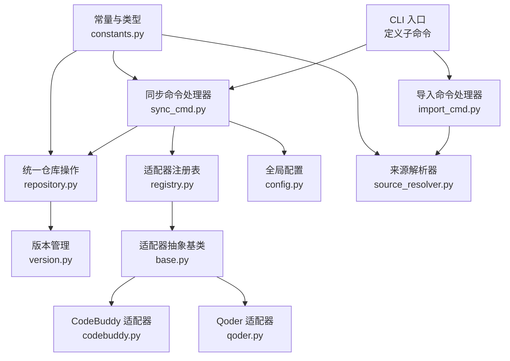
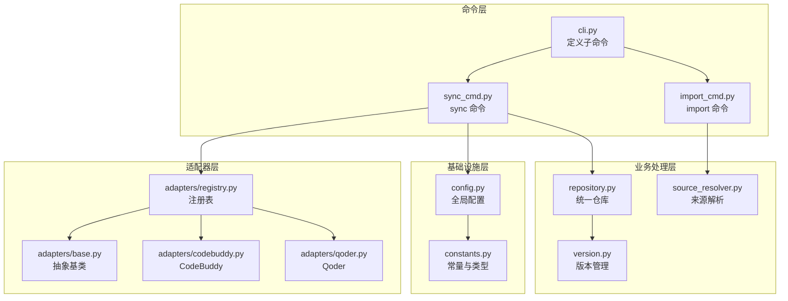
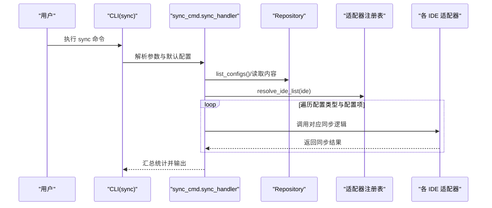
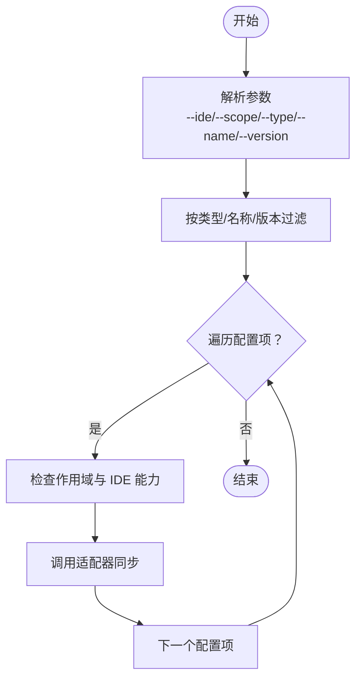
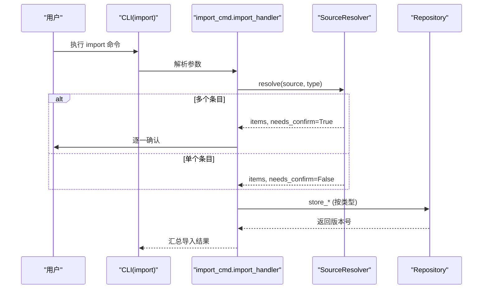
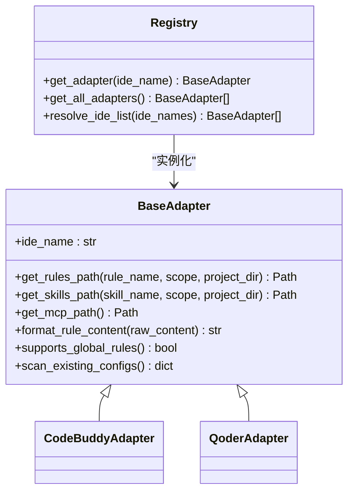
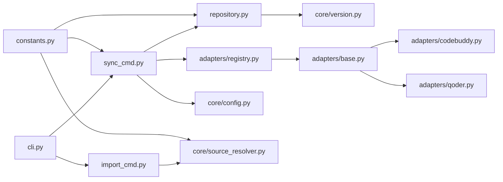

# 高级功能

<cite>
**本文引用的文件**
- [MSR-cli/msr_sync/cli.py](file://MSR-cli/msr_sync/cli.py)
- [MSR-cli/msr_sync/commands/sync_cmd.py](file://MSR-cli/msr_sync/commands/sync_cmd.py)
- [MSR-cli/msr_sync/commands/import_cmd.py](file://MSR-cli/msr_sync/commands/import_cmd.py)
- [MSR-cli/msr_sync/core/config.py](file://MSR-cli/msr_sync/core/config.py)
- [MSR-cli/msr_sync/core/repository.py](file://MSR-cli/msr_sync/core/repository.py)
- [MSR-cli/msr_sync/core/source_resolver.py](file://MSR-cli/msr_sync/core/source_resolver.py)
- [MSR-cli/msr_sync/core/version.py](file://MSR-cli/msr_sync/core/version.py)
- [MSR-cli/msr_sync/constants.py](file://MSR-cli/msr_sync/constants.py)
- [MSR-cli/msr_sync/adapters/base.py](file://MSR-cli/msr_sync/adapters/base.py)
- [MSR-cli/msr_sync/adapters/registry.py](file://MSR-cli/msr_sync/adapters/registry.py)
- [MSR-cli/msr_sync/adapters/codebuddy.py](file://MSR-cli/msr_sync/adapters/codebuddy.py)
- [MSR-cli/msr_sync/adapters/qoder.py](file://MSR-cli/msr_sync/adapters/qoder.py)
- [MSR-cli/pyproject.toml](file://MSR-cli/pyproject.toml)
</cite>

## 目录
1. [简介](#简介)
2. [项目结构](#项目结构)
3. [核心组件](#核心组件)
4. [架构总览](#架构总览)
5. [详细组件分析](#详细组件分析)
6. [依赖分析](#依赖分析)
7. [性能考虑](#性能考虑)
8. [故障排查指南](#故障排查指南)
9. [结论](#结论)
10. [附录](#附录)

## 简介
本文件面向高级用户，系统阐述“批量同步配置”的实现机制与使用场景，涵盖同时同步到多个 IDE 的策略与注意事项；解释条件同步设置（基于规则的智能同步与选择性同步）；介绍配置模板与自定义模板的创建方法；提供自动化脚本编写指南（含与 CI/CD 的集成与定时任务配置）；说明高级导入功能（批量导入、格式转换与数据验证）；并给出性能优化建议与大规模配置管理最佳实践，以及扩展与定制能力指导。

## 项目结构
MSR-sync 采用命令驱动的 CLI 架构，围绕“统一仓库”集中管理 rules、skills、MCP 三类配置，通过适配器层对接不同 IDE，提供导入、同步、列出、删除等能力。核心模块包括：
- CLI 定义与命令入口
- 同步命令处理器
- 导入命令处理器
- 全局配置与默认行为
- 统一仓库操作
- 来源解析与批量导入
- 版本管理
- 常量与类型
- 适配器抽象与注册表
- 具体 IDE 适配器实现

**图表来源**
- [MSR-cli/msr_sync/cli.py:1-116](file://MSR-cli/msr_sync/cli.py#L1-L116)
- [MSR-cli/msr_sync/commands/sync_cmd.py:1-411](file://MSR-cli/msr_sync/commands/sync_cmd.py#L1-L411)
- [MSR-cli/msr_sync/commands/import_cmd.py:1-151](file://MSR-cli/msr_sync/commands/import_cmd.py#L1-L151)
- [MSR-cli/msr_sync/core/repository.py:1-291](file://MSR-cli/msr_sync/core/repository.py#L1-L291)
- [MSR-cli/msr_sync/core/config.py:1-204](file://MSR-cli/msr_sync/core/config.py#L1-L204)
- [MSR-cli/msr_sync/core/source_resolver.py:1-404](file://MSR-cli/msr_sync/core/source_resolver.py#L1-L404)
- [MSR-cli/msr_sync/core/version.py:1-119](file://MSR-cli/msr_sync/core/version.py#L1-L119)
- [MSR-cli/msr_sync/constants.py:1-50](file://MSR-cli/msr_sync/constants.py#L1-L50)
- [MSR-cli/msr_sync/adapters/base.py:1-105](file://MSR-cli/msr_sync/adapters/base.py#L1-L105)
- [MSR-cli/msr_sync/adapters/registry.py:1-88](file://MSR-cli/msr_sync/adapters/registry.py#L1-L88)
- [MSR-cli/msr_sync/adapters/codebuddy.py:1-143](file://MSR-cli/msr_sync/adapters/codebuddy.py#L1-L143)
- [MSR-cli/msr_sync/adapters/qoder.py:1-140](file://MSR-cli/msr_sync/adapters/qoder.py#L1-L140)

**章节来源**
- [MSR-cli/msr_sync/cli.py:1-116](file://MSR-cli/msr_sync/cli.py#L1-L116)
- [MSR-cli/msr_sync/constants.py:1-50](file://MSR-cli/msr_sync/constants.py#L1-L50)

## 核心组件
- CLI 与命令
  - 初始化、导入、同步、列出、删除等命令通过 Click 定义，支持选项与参数组合。
- 同步命令处理器
  - 支持按 IDE、作用域、类型、名称、版本进行条件同步；自动解析目标 IDE 列表；逐项同步并汇总结果。
- 导入命令处理器
  - 解析来源（文件/目录/压缩包/URL），支持批量导入与交互确认；将配置项存储到统一仓库。
- 统一仓库
  - 提供规则、技能、MCP 的存储、查询、删除与内容读取；支持多版本管理与最新版本解析。
- 来源解析器
  - 自动识别来源类型，按配置类型检测有效条目；支持忽略模式、压缩包解压与 URL 下载。
- 适配器层
  - 抽象基类定义路径解析、格式转换、能力查询与扫描接口；注册表负责 IDE 名称到适配器实例的解析。
- 全局配置
  - 管理仓库路径、默认 IDE 列表、默认作用域与忽略模式；提供默认配置模板生成。
- 版本管理
  - 规范版本号格式（Vn）、解析与排序、计算下一个版本号。

**章节来源**
- [MSR-cli/msr_sync/cli.py:1-116](file://MSR-cli/msr_sync/cli.py#L1-L116)
- [MSR-cli/msr_sync/commands/sync_cmd.py:1-411](file://MSR-cli/msr_sync/commands/sync_cmd.py#L1-L411)
- [MSR-cli/msr_sync/commands/import_cmd.py:1-151](file://MSR-cli/msr_sync/commands/import_cmd.py#L1-L151)
- [MSR-cli/msr_sync/core/repository.py:1-291](file://MSR-cli/msr_sync/core/repository.py#L1-L291)
- [MSR-cli/msr_sync/core/source_resolver.py:1-404](file://MSR-cli/msr_sync/core/source_resolver.py#L1-L404)
- [MSR-cli/msr_sync/adapters/base.py:1-105](file://MSR-cli/msr_sync/adapters/base.py#L1-L105)
- [MSR-cli/msr_sync/adapters/registry.py:1-88](file://MSR-cli/msr_sync/adapters/registry.py#L1-L88)
- [MSR-cli/msr_sync/core/config.py:1-204](file://MSR-cli/msr_sync/core/config.py#L1-L204)
- [MSR-cli/msr_sync/core/version.py:1-119](file://MSR-cli/msr_sync/core/version.py#L1-L119)

## 架构总览
MSR-sync 的架构以“命令层—业务处理层—基础设施层—适配器层”分层设计，命令层负责参数解析与流程编排，业务处理层实现具体逻辑（同步/导入），基础设施层提供仓库与版本管理，适配器层屏蔽不同 IDE 的差异。

**图表来源**
- [MSR-cli/msr_sync/cli.py:1-116](file://MSR-cli/msr_sync/cli.py#L1-L116)
- [MSR-cli/msr_sync/commands/sync_cmd.py:1-411](file://MSR-cli/msr_sync/commands/sync_cmd.py#L1-L411)
- [MSR-cli/msr_sync/commands/import_cmd.py:1-151](file://MSR-cli/msr_sync/commands/import_cmd.py#L1-L151)
- [MSR-cli/msr_sync/core/repository.py:1-291](file://MSR-cli/msr_sync/core/repository.py#L1-L291)
- [MSR-cli/msr_sync/core/source_resolver.py:1-404](file://MSR-cli/msr_sync/core/source_resolver.py#L1-L404)
- [MSR-cli/msr_sync/core/version.py:1-119](file://MSR-cli/msr_sync/core/version.py#L1-L119)
- [MSR-cli/msr_sync/core/config.py:1-204](file://MSR-cli/msr_sync/core/config.py#L1-L204)
- [MSR-cli/msr_sync/constants.py:1-50](file://MSR-cli/msr_sync/constants.py#L1-L50)
- [MSR-cli/msr_sync/adapters/base.py:1-105](file://MSR-cli/msr_sync/adapters/base.py#L1-L105)
- [MSR-cli/msr_sync/adapters/registry.py:1-88](file://MSR-cli/msr_sync/adapters/registry.py#L1-L88)
- [MSR-cli/msr_sync/adapters/codebuddy.py:1-143](file://MSR-cli/msr_sync/adapters/codebuddy.py#L1-L143)
- [MSR-cli/msr_sync/adapters/qoder.py:1-140](file://MSR-cli/msr_sync/adapters/qoder.py#L1-L140)

## 详细组件分析

### 批量同步配置机制与多 IDE 策略
- 同步范围控制
  - 支持按 IDE 列表（可包含 all）批量同步；支持按作用域（project/global）与配置类型（rules/skills/mcp）过滤；支持按名称与版本精确选择。
- 多 IDE 同步策略
  - 当包含 all 时，自动展开为所有已注册适配器；逐个 IDE 执行同步，分别处理规则、MCP、技能的差异化逻辑。
  - 全局级规则同步时，对不支持全局规则的 IDE 输出警告并跳过，避免无效操作。
- MCP 合并与覆盖策略
  - 读取源 MCP 配置，将 cwd 路径重写为统一仓库路径；合并到目标 mcp.json，遇到同名条目时交互确认覆盖。
- 技能同步与覆盖策略
  - 目标已存在时交互确认覆盖；不存在时直接复制；保证幂等与可控性。

**图表来源**
- [MSR-cli/msr_sync/cli.py:41-82](file://MSR-cli/msr_sync/cli.py#L41-L82)
- [MSR-cli/msr_sync/commands/sync_cmd.py:26-131](file://MSR-cli/msr_sync/commands/sync_cmd.py#L26-L131)
- [MSR-cli/msr_sync/core/repository.py:201-235](file://MSR-cli/msr_sync/core/repository.py#L201-L235)
- [MSR-cli/msr_sync/adapters/registry.py:74-87](file://MSR-cli/msr_sync/adapters/registry.py#L74-L87)

**章节来源**
- [MSR-cli/msr_sync/commands/sync_cmd.py:26-131](file://MSR-cli/msr_sync/commands/sync_cmd.py#L26-L131)
- [MSR-cli/msr_sync/commands/sync_cmd.py:133-411](file://MSR-cli/msr_sync/commands/sync_cmd.py#L133-L411)
- [MSR-cli/msr_sync/adapters/registry.py:74-87](file://MSR-cli/msr_sync/adapters/registry.py#L74-L87)

### 条件同步设置：基于规则的智能同步与选择性同步
- 基于参数的条件过滤
  - 支持通过 --type、--name、--version 精确筛选；未指定时默认全量同步。
- 作用域与 IDE 能力适配
  - 通过 supports_global_rules() 判断是否允许全局规则同步；对不支持的 IDE 跳过并提示。
- 交互式确认
  - MCP 与技能同步时对同名条目进行交互确认，避免误覆盖。

**图表来源**
- [MSR-cli/msr_sync/commands/sync_cmd.py:67-131](file://MSR-cli/msr_sync/commands/sync_cmd.py#L67-L131)
- [MSR-cli/msr_sync/adapters/base.py:80-89](file://MSR-cli/msr_sync/adapters/base.py#L80-L89)

**章节来源**
- [MSR-cli/msr_sync/commands/sync_cmd.py:67-131](file://MSR-cli/msr_sync/commands/sync_cmd.py#L67-L131)
- [MSR-cli/msr_sync/adapters/base.py:80-89](file://MSR-cli/msr_sync/adapters/base.py#L80-L89)

### 配置模板与自定义模板
- 全局配置模板
  - 提供默认配置文件模板（含注释），支持生成默认配置文件；包含仓库路径、忽略模式、默认 IDE 列表、默认作用域等键位。
- IDE 特定模板
  - 适配器层通过 format_rule_content() 为不同 IDE 生成特定头部；例如 CodeBuddy 与 Qoder 的 frontmatter 模板由各自构建函数生成。
- 自定义模板建议
  - 在统一仓库中维护基础规则内容，通过适配器的格式转换实现 IDE 侧模板渲染；保持规则内容与 IDE 头部分离，便于复用与升级。

**章节来源**
- [MSR-cli/msr_sync/core/config.py:161-204](file://MSR-cli/msr_sync/core/config.py#L161-L204)
- [MSR-cli/msr_sync/adapters/codebuddy.py:82-100](file://MSR-cli/msr_sync/adapters/codebuddy.py#L82-L100)
- [MSR-cli/msr_sync/adapters/qoder.py:84-98](file://MSR-cli/msr_sync/adapters/qoder.py#L84-L98)

### 高级导入功能：批量导入、格式转换与数据验证
- 批量导入
  - 支持单文件、目录、压缩包、URL 四种来源；目录与压缩包按配置类型自动检测有效条目；多条目时交互确认。
- 格式转换
  - 规则导入时读取原始内容；技能与 MCP 导入时复制目录结构；MCP 导入时重写 cwd 路径为统一仓库路径。
- 数据验证
  - 来源解析阶段进行格式与类型校验；网络错误与无效来源抛出明确异常；仓库未初始化时提示初始化。

**图表来源**
- [MSR-cli/msr_sync/cli.py:27-38](file://MSR-cli/msr_sync/cli.py#L27-L38)
- [MSR-cli/msr_sync/commands/import_cmd.py:14-56](file://MSR-cli/msr_sync/commands/import_cmd.py#L14-L56)
- [MSR-cli/msr_sync/core/source_resolver.py:77-110](file://MSR-cli/msr_sync/core/source_resolver.py#L77-L110)
- [MSR-cli/msr_sync/core/repository.py:89-158](file://MSR-cli/msr_sync/core/repository.py#L89-L158)

**章节来源**
- [MSR-cli/msr_sync/commands/import_cmd.py:14-151](file://MSR-cli/msr_sync/commands/import_cmd.py#L14-L151)
- [MSR-cli/msr_sync/core/source_resolver.py:1-404](file://MSR-cli/msr_sync/core/source_resolver.py#L1-L404)
- [MSR-cli/msr_sync/core/repository.py:89-158](file://MSR-cli/msr_sync/core/repository.py#L89-L158)

### 自动化脚本与 CI/CD 集成
- 命令行可编程化
  - CLI 通过子命令与选项组合，适合在脚本中直接调用；结合全局配置的默认值减少手工参数。
- CI/CD 集成建议
  - 在流水线中先执行初始化，再执行导入与同步；对多 IDE 同步时注意 IDE 能力差异与交互确认（可通过非交互方式或预设参数规避）。
- 定时任务配置
  - 使用系统计划任务定期执行同步，建议在非高峰时段运行；结合日志与错误处理确保稳定性。

**章节来源**
- [MSR-cli/msr_sync/cli.py:1-116](file://MSR-cli/msr_sync/cli.py#L1-L116)
- [MSR-cli/msr_sync/core/config.py:91-158](file://MSR-cli/msr_sync/core/config.py#L91-L158)

### 性能优化与大规模配置管理最佳实践
- 版本管理与增量更新
  - 利用多版本管理与“最新版本”解析，避免重复写入；仅在必要时更新版本。
- 批量操作与并发
  - 同步时按类型与配置项分层遍历，IDE 层面顺序执行；对于大量配置，建议分批执行并记录进度。
- 路径与 I/O 优化
  - 统一仓库路径集中管理；MCP 合并时仅在需要时写入；技能复制使用目录级操作，减少小文件 I/O。
- 大规模配置管理
  - 使用命名规范与版本号规范；通过 CLI 的过滤选项进行选择性同步；利用默认配置减少重复参数。

**章节来源**
- [MSR-cli/msr_sync/core/version.py:59-119](file://MSR-cli/msr_sync/core/version.py#L59-L119)
- [MSR-cli/msr_sync/commands/sync_cmd.py:133-411](file://MSR-cli/msr_sync/commands/sync_cmd.py#L133-L411)
- [MSR-cli/msr_sync/core/repository.py:160-235](file://MSR-cli/msr_sync/core/repository.py#L160-L235)

### 扩展与定制能力
- 新增 IDE 适配器
  - 继承 BaseAdapter，实现路径解析、格式转换、能力查询与扫描方法；在注册表中登记 IDE 名称与类映射。
- 自定义来源解析
  - 可扩展 SourceResolver 以支持新的来源类型或检测规则。
- 全局配置扩展
  - 通过全局配置文件扩展默认行为（如默认 IDE 列表、忽略模式等）。

**图表来源**
- [MSR-cli/msr_sync/adapters/base.py:8-105](file://MSR-cli/msr_sync/adapters/base.py#L8-L105)
- [MSR-cli/msr_sync/adapters/codebuddy.py:22-143](file://MSR-cli/msr_sync/adapters/codebuddy.py#L22-L143)
- [MSR-cli/msr_sync/adapters/qoder.py:22-140](file://MSR-cli/msr_sync/adapters/qoder.py#L22-L140)
- [MSR-cli/msr_sync/adapters/registry.py:45-87](file://MSR-cli/msr_sync/adapters/registry.py#L45-L87)

**章节来源**
- [MSR-cli/msr_sync/adapters/base.py:1-105](file://MSR-cli/msr_sync/adapters/base.py#L1-L105)
- [MSR-cli/msr_sync/adapters/registry.py:1-88](file://MSR-cli/msr_sync/adapters/registry.py#L1-L88)
- [MSR-cli/msr_sync/adapters/codebuddy.py:1-143](file://MSR-cli/msr_sync/adapters/codebuddy.py#L1-L143)
- [MSR-cli/msr_sync/adapters/qoder.py:1-140](file://MSR-cli/msr_sync/adapters/qoder.py#L1-L140)

## 依赖分析
- 模块耦合
  - CLI 仅依赖命令处理器；命令处理器依赖仓库、适配器注册表与全局配置；仓库依赖版本管理；适配器注册表依赖具体适配器实现。
- 外部依赖
  - Click 用于 CLI；PyYAML 用于配置文件；标准库用于文件系统、网络与归档处理。
- 可能的循环依赖
  - 通过延迟导入与模块边界清晰划分，避免循环依赖。

**图表来源**
- [MSR-cli/msr_sync/cli.py:1-116](file://MSR-cli/msr_sync/cli.py#L1-L116)
- [MSR-cli/msr_sync/commands/sync_cmd.py:1-411](file://MSR-cli/msr_sync/commands/sync_cmd.py#L1-L411)
- [MSR-cli/msr_sync/commands/import_cmd.py:1-151](file://MSR-cli/msr_sync/commands/import_cmd.py#L1-L151)
- [MSR-cli/msr_sync/core/repository.py:1-291](file://MSR-cli/msr_sync/core/repository.py#L1-L291)
- [MSR-cli/msr_sync/core/source_resolver.py:1-404](file://MSR-cli/msr_sync/core/source_resolver.py#L1-L404)
- [MSR-cli/msr_sync/core/version.py:1-119](file://MSR-cli/msr_sync/core/version.py#L1-L119)
- [MSR-cli/msr_sync/core/config.py:1-204](file://MSR-cli/msr_sync/core/config.py#L1-L204)
- [MSR-cli/msr_sync/constants.py:1-50](file://MSR-cli/msr_sync/constants.py#L1-L50)
- [MSR-cli/msr_sync/adapters/base.py:1-105](file://MSR-cli/msr_sync/adapters/base.py#L1-L105)
- [MSR-cli/msr_sync/adapters/registry.py:1-88](file://MSR-cli/msr_sync/adapters/registry.py#L1-L88)
- [MSR-cli/msr_sync/adapters/codebuddy.py:1-143](file://MSR-cli/msr_sync/adapters/codebuddy.py#L1-L143)
- [MSR-cli/msr_sync/adapters/qoder.py:1-140](file://MSR-cli/msr_sync/adapters/qoder.py#L1-L140)

**章节来源**
- [MSR-cli/pyproject.toml:1-37](file://MSR-cli/pyproject.toml#L1-L37)

## 性能考虑
- I/O 与磁盘访问
  - 大量小文件写入可能成为瓶颈；优先使用目录复制与 JSON 合并，减少频繁打开/关闭文件。
- 网络与压缩包
  - URL 导入与压缩包解压会引入网络与 CPU 开销；建议在本地缓存与离线环境下执行批量导入。
- 并发与批处理
  - 同步过程按配置类型与配置项顺序执行；对多 IDE 的同步可在外部调度器中并行执行，但需注意 IDE 能力差异与交互确认。
- 版本管理
  - 多版本存储增加磁盘占用；建议定期清理不再使用的旧版本，保留必要的历史版本。

## 故障排查指南
- 常见问题与处理
  - 仓库未初始化：执行初始化命令后再进行导入或同步。
  - 无效导入来源：检查来源类型与格式（仅支持 .md 文件与特定压缩包格式）。
  - 网络错误：检查网络连通性与 URL 可达性。
  - 配置文件错误：检查 YAML 语法与字段有效性。
  - IDE 能力限制：对不支持全局规则的 IDE，使用项目级同步或跳过。
- 错误传播与退出码
  - CLI 捕获业务异常并输出错误信息，随后以非零退出码终止，便于脚本与 CI/CD 检测失败。

**章节来源**
- [MSR-cli/msr_sync/commands/import_cmd.py:38-56](file://MSR-cli/msr_sync/commands/import_cmd.py#L38-L56)
- [MSR-cli/msr_sync/commands/sync_cmd.py:51-83](file://MSR-cli/msr_sync/commands/sync_cmd.py#L51-L83)
- [MSR-cli/msr_sync/core/config.py:113-127](file://MSR-cli/msr_sync/core/config.py#L113-L127)

## 结论
MSR-sync 通过统一仓库与适配器层实现了对多款 AI IDE 的标准化配置管理。其批量同步机制支持多 IDE、多作用域、多类型与多版本的灵活控制；导入功能覆盖多种来源与格式；全局配置与版本管理为规模化运维提供了基础。通过合理的脚本化与 CI/CD 集成、性能优化与故障排查策略，可满足高级用户的复杂需求。

## 附录
- 命令速查
  - 初始化：初始化统一仓库
  - 导入：将配置导入统一仓库
  - 同步：将配置同步到目标 IDE
  - 列表：查看统一仓库中的配置列表
  - 删除：删除指定配置版本
- 常用参数
  - --ide：目标 IDE 列表（支持 all）
  - --scope：作用域（project/global）
  - --type：配置类型（rules/skills/mcp）
  - --name：配置名称
  - --version：指定版本
  - --project-dir：项目目录（作用域为 project 时使用）

**章节来源**
- [MSR-cli/msr_sync/cli.py:14-116](file://MSR-cli/msr_sync/cli.py#L14-L116)